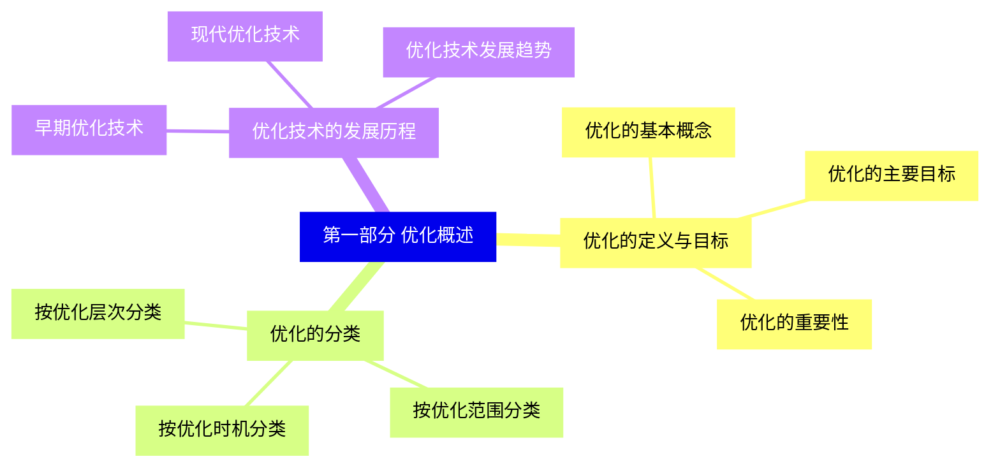
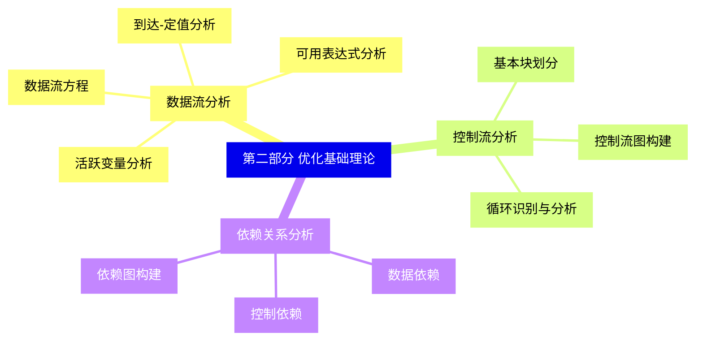
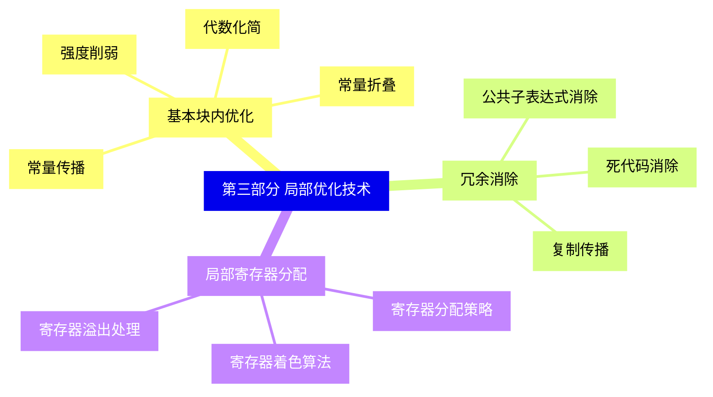
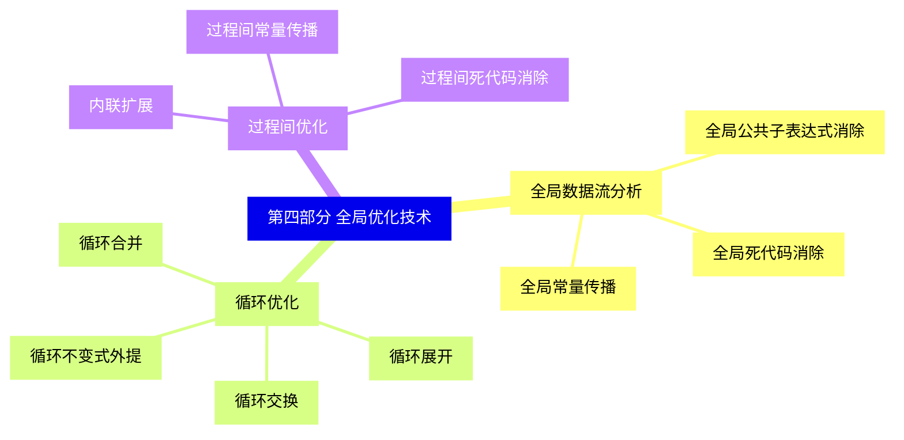
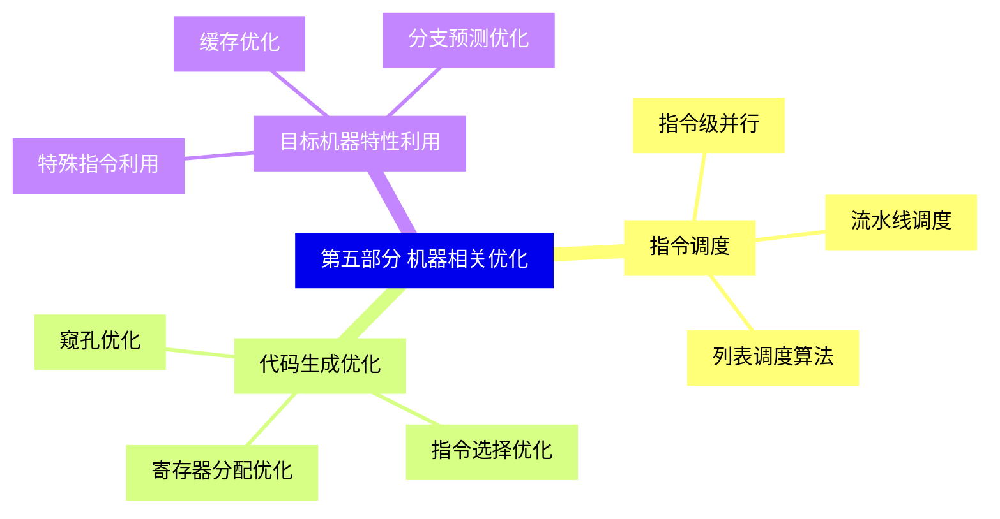
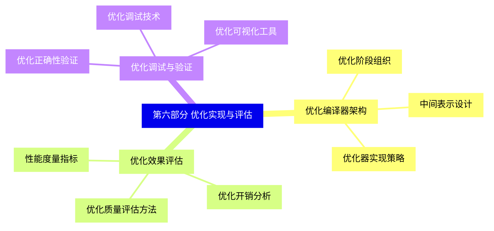
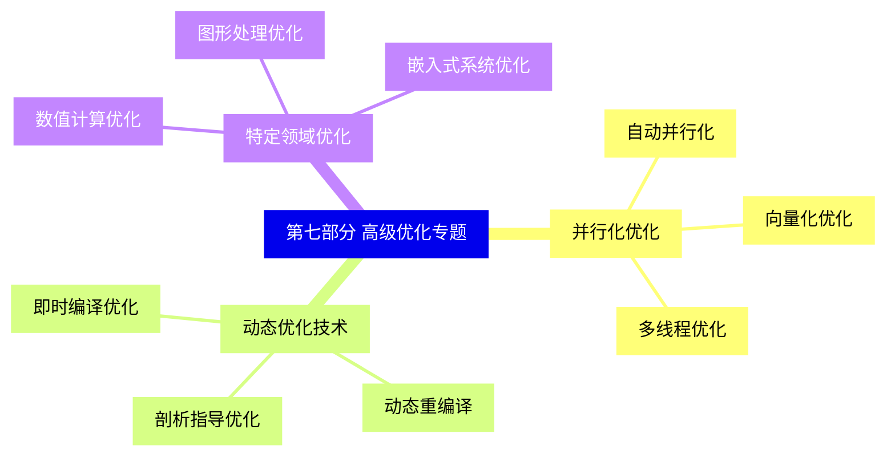
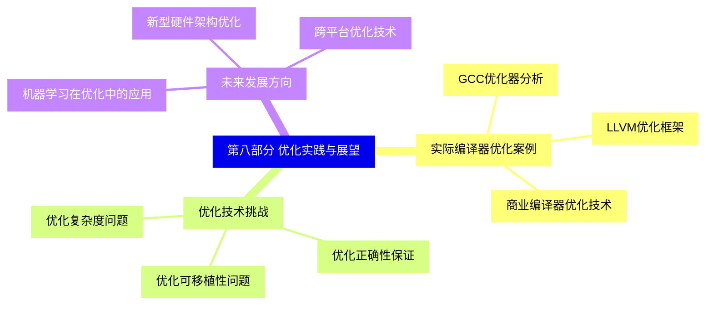


### 1 [第一部分 优化概述](#1)
#### 1.1 [优化的定义与目标](#1)
##### 1.1.1 [优化的基本概念](#1)
##### 1.1.2 [优化的主要目标](#1)
##### 1.1.3 [优化的重要性](#1)
#### 1.2 [优化的分类](#1)
##### 1.2.1 [按优化层次分类](#1)
##### 1.2.2 [按优化范围分类](#1)
##### 1.2.3 [按优化时机分类](#1)
#### 1.3 [优化技术的发展历程](#1)
##### 1.3.1 [早期优化技术](#1)
##### 1.3.2 [现代优化技术](#1)
##### 1.3.3 [优化技术发展趋势](#1)
### 2 [第二部分 优化基础理论](#2)
#### 2.1 [数据流分析](#2)
##### 2.1.1 [数据流方程](#2)
##### 2.1.2 [活跃变量分析](#2)
##### 2.1.3 [可用表达式分析](#2)
##### 2.1.4 [到达-定值分析](#2)
#### 2.2 [控制流分析](#2)
##### 2.2.1 [基本块划分](#2)
##### 2.2.2 [控制流图构建](#2)
##### 2.2.3 [循环识别与分析](#2)
#### 2.3 [依赖关系分析](#2)
##### 2.3.1 [数据依赖](#2)
##### 2.3.2 [控制依赖](#2)
##### 2.3.3 [依赖图构建](#2)
### 3 [第三部分 局部优化技术](#3)
#### 3.1 [基本块内优化](#3)
##### 3.1.1 [常量传播](#3)
##### 3.1.2 [常量折叠](#3)
##### 3.1.3 [代数化简](#3)
##### 3.1.4 [强度削弱](#3)
#### 3.2 [冗余消除](#3)
##### 3.2.1 [公共子表达式消除](#3)
##### 3.2.2 [死代码消除](#3)
##### 3.2.3 [复制传播](#3)
#### 3.3 [局部寄存器分配](#3)
##### 3.3.1 [寄存器分配策略](#3)
##### 3.3.2 [寄存器着色算法](#3)
##### 3.3.3 [寄存器溢出处理](#3)
### 4 [第四部分 全局优化技术](#4)
#### 4.1 [全局数据流分析](#4)
##### 4.1.1 [全局常量传播](#4)
##### 4.1.2 [全局公共子表达式消除](#4)
##### 4.1.3 [全局死代码消除](#4)
#### 4.2 [循环优化](#4)
##### 4.2.1 [循环不变式外提](#4)
##### 4.2.2 [循环展开](#4)
##### 4.2.3 [循环合并](#4)
##### 4.2.4 [循环交换](#4)
#### 4.3 [过程间优化](#4)
##### 4.3.1 [内联扩展](#4)
##### 4.3.2 [过程间常量传播](#4)
##### 4.3.3 [过程间死代码消除](#4)
### 5 [第五部分 机器相关优化](#5)
#### 5.1 [指令调度](#5)
##### 5.1.1 [指令级并行](#5)
##### 5.1.2 [流水线调度](#5)
##### 5.1.3 [列表调度算法](#5)
#### 5.2 [代码生成优化](#5)
##### 5.2.1 [窥孔优化](#5)
##### 5.2.2 [指令选择优化](#5)
##### 5.2.3 [寄存器分配优化](#5)
#### 5.3 [目标机器特性利用](#5)
##### 5.3.1 [特殊指令利用](#5)
##### 5.3.2 [缓存优化](#5)
##### 5.3.3 [分支预测优化](#5)
### 6 [第六部分 优化实现与评估](#6)
#### 6.1 [优化编译器架构](#6)
##### 6.1.1 [优化阶段组织](#6)
##### 6.1.2 [中间表示设计](#6)
##### 6.1.3 [优化器实现策略](#6)
#### 6.2 [优化效果评估](#6)
##### 6.2.1 [性能度量指标](#6)
##### 6.2.2 [优化开销分析](#6)
##### 6.2.3 [优化质量评估方法](#6)
#### 6.3 [优化调试与验证](#6)
##### 6.3.1 [优化正确性验证](#6)
##### 6.3.2 [优化调试技术](#6)
##### 6.3.3 [优化可视化工具](#6)
### 7 [第七部分 高级优化专题](#7)
#### 7.1 [并行化优化](#7)
##### 7.1.1 [自动并行化](#7)
##### 7.1.2 [向量化优化](#7)
##### 7.1.3 [多线程优化](#7)
#### 7.2 [动态优化技术](#7)
##### 7.2.1 [即时编译优化](#7)
##### 7.2.2 [动态重编译](#7)
##### 7.2.3 [剖析指导优化](#7)
#### 7.3 [特定领域优化](#7)
##### 7.3.1 [数值计算优化](#7)
##### 7.3.2 [图形处理优化](#7)
##### 7.3.3 [嵌入式系统优化](#7)
### 8 [第八部分 优化实践与展望](#8)
#### 8.1 [实际编译器优化案例](#8)
##### 8.1.1 [GCC优化器分析](#8)
##### 8.1.2 [LLVM优化框架](#8)
##### 8.1.3 [商业编译器优化技术](#8)
#### 8.2 [优化技术挑战](#8)
##### 8.2.1 [优化复杂度问题](#8)
##### 8.2.2 [优化正确性保证](#8)
##### 8.2.3 [优化可移植性问题](#8)
#### 8.3 [未来发展方向](#8)
##### 8.3.1 [机器学习在优化中的应用](#8)
##### 8.3.2 [新型硬件架构优化](#8)
##### 8.3.3 [跨平台优化技术](#8)




### 1 第一部分 优化概述

---
### 1 第一部分 优化概述
___
#### 1.1 优化的定义与目标
___
##### 1.1.1 优化的基本概念
___
##### 1.1.2 优化的主要目标
___
##### 1.1.3 优化的重要性
___
#### 1.2 优化的分类
___
##### 1.2.1 按优化层次分类
___
##### 1.2.2 按优化范围分类
___
##### 1.2.3 按优化时机分类
___
#### 1.3 优化技术的发展历程
___
##### 1.3.1 早期优化技术
___
##### 1.3.2 现代优化技术
___
##### 1.3.3 优化技术发展趋势
### 2 第二部分 优化基础理论

---
### 2 第二部分 优化基础理论
___
#### 2.1 数据流分析
___
##### 2.1.1 数据流方程
___
##### 2.1.2 活跃变量分析
___
##### 2.1.3 可用表达式分析
___
##### 2.1.4 到达-定值分析
___
#### 2.2 控制流分析
___
##### 2.2.1 基本块划分
___
##### 2.2.2 控制流图构建
___
##### 2.2.3 循环识别与分析
___
#### 2.3 依赖关系分析
___
##### 2.3.1 数据依赖
___
##### 2.3.2 控制依赖
___
##### 2.3.3 依赖图构建
### 3 第三部分 局部优化技术

---
### 3 第三部分 局部优化技术
___
#### 3.1 基本块内优化
___
##### 3.1.1 常量传播
___
##### 3.1.2 常量折叠
___
##### 3.1.3 代数化简
___
##### 3.1.4 强度削弱
___
#### 3.2 冗余消除
___
##### 3.2.1 公共子表达式消除
___
##### 3.2.2 死代码消除
___
##### 3.2.3 复制传播
___
#### 3.3 局部寄存器分配
___
##### 3.3.1 寄存器分配策略
___
##### 3.3.2 寄存器着色算法
___
##### 3.3.3 寄存器溢出处理
### 4 第四部分 全局优化技术

---
### 4 第四部分 全局优化技术
___
#### 4.1 全局数据流分析
___
##### 4.1.1 全局常量传播
___
##### 4.1.2 全局公共子表达式消除
___
##### 4.1.3 全局死代码消除
___
#### 4.2 循环优化
___
##### 4.2.1 循环不变式外提
___
##### 4.2.2 循环展开
___
##### 4.2.3 循环合并
___
##### 4.2.4 循环交换
___
#### 4.3 过程间优化
___
##### 4.3.1 内联扩展
___
##### 4.3.2 过程间常量传播
___
##### 4.3.3 过程间死代码消除
### 5 第五部分 机器相关优化

---
### 5 第五部分 机器相关优化
___
#### 5.1 指令调度
___
##### 5.1.1 指令级并行
___
##### 5.1.2 流水线调度
___
##### 5.1.3 列表调度算法
___
#### 5.2 代码生成优化
___
##### 5.2.1 窥孔优化
___
##### 5.2.2 指令选择优化
___
##### 5.2.3 寄存器分配优化
___
#### 5.3 目标机器特性利用
___
##### 5.3.1 特殊指令利用
___
##### 5.3.2 缓存优化
___
##### 5.3.3 分支预测优化
### 6 第六部分 优化实现与评估

---
### 6 第六部分 优化实现与评估
___
#### 6.1 优化编译器架构
___
##### 6.1.1 优化阶段组织
___
##### 6.1.2 中间表示设计
___
##### 6.1.3 优化器实现策略
___
#### 6.2 优化效果评估
___
##### 6.2.1 性能度量指标
___
##### 6.2.2 优化开销分析
___
##### 6.2.3 优化质量评估方法
___
#### 6.3 优化调试与验证
___
##### 6.3.1 优化正确性验证
___
##### 6.3.2 优化调试技术
___
##### 6.3.3 优化可视化工具
### 7 第七部分 高级优化专题

---
### 7 第七部分 高级优化专题
___
#### 7.1 并行化优化
___
##### 7.1.1 自动并行化
___
##### 7.1.2 向量化优化
___
##### 7.1.3 多线程优化
___
#### 7.2 动态优化技术
___
##### 7.2.1 即时编译优化
___
##### 7.2.2 动态重编译
___
##### 7.2.3 剖析指导优化
___
#### 7.3 特定领域优化
___
##### 7.3.1 数值计算优化
___
##### 7.3.2 图形处理优化
___
##### 7.3.3 嵌入式系统优化
### 8 第八部分 优化实践与展望

---
### 8 第八部分 优化实践与展望
___
#### 8.1 实际编译器优化案例
___
##### 8.1.1 GCC优化器分析
___
##### 8.1.2 LLVM优化框架
___
##### 8.1.3 商业编译器优化技术
___
#### 8.2 优化技术挑战
___
##### 8.2.1 优化复杂度问题
___
##### 8.2.2 优化正确性保证
___
##### 8.2.3 优化可移植性问题
___
#### 8.3 未来发展方向
___
##### 8.3.1 机器学习在优化中的应用
___
##### 8.3.2 新型硬件架构优化
___
##### 8.3.3 跨平台优化技术


### 1 第一部分 优化概述{#1}

{}

<--->
{}
{}
{}
{}
{}
{}
{}
{}
{}
{}
{}
{}
{}
{}
{}
{}
{}
{}
{}
{}
{}
{}
{}
{}
{}

### 2 第二部分 优化基础理论{#2}

{}
{}
{}
{}
{}
{}
{}
{}
{}
{}
{}
{}
{}
{}
{}
{}
{}
{}
{}
{}
{}
{}
{}
{}
{}
{}
{}
<--->

{}

### 3 第三部分 局部优化技术{#3}

{}

<--->
{}
{}
{}
{}
{}
{}
{}
{}
{}
{}
{}
{}
{}
{}
{}
{}
{}
{}
{}
{}
{}
{}
{}
{}
{}
{}
{}

### 4 第四部分 全局优化技术{#4}

{}
{}
{}
{}
{}
{}
{}
{}
{}
{}
{}
{}
{}
{}
{}
{}
{}
{}
{}
{}
{}
{}
{}
{}
{}
{}
{}
<--->

{}

### 5 第五部分 机器相关优化{#5}

{}

<--->
{}
{}
{}
{}
{}
{}
{}
{}
{}
{}
{}
{}
{}
{}
{}
{}
{}
{}
{}
{}
{}
{}
{}
{}
{}

### 6 第六部分 优化实现与评估{#6}

{}
{}
{}
{}
{}
{}
{}
{}
{}
{}
{}
{}
{}
{}
{}
{}
{}
{}
{}
{}
{}
{}
{}
{}
{}
<--->

{}

### 7 第七部分 高级优化专题{#7}

{}

<--->
{}
{}
{}
{}
{}
{}
{}
{}
{}
{}
{}
{}
{}
{}
{}
{}
{}
{}
{}
{}
{}
{}
{}
{}
{}

### 8 第八部分 优化实践与展望{#8}

{}
{}
{}
{}
{}
{}
{}
{}
{}
{}
{}
{}
{}
{}
{}
{}
{}
{}
{}
{}
{}
{}
{}
{}
{}
<--->

{}
