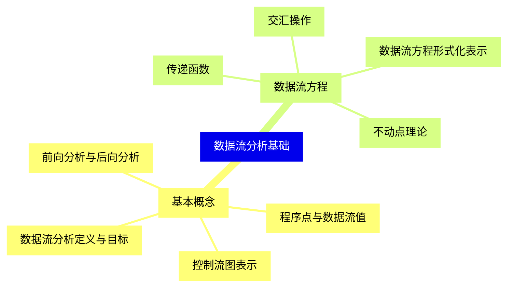
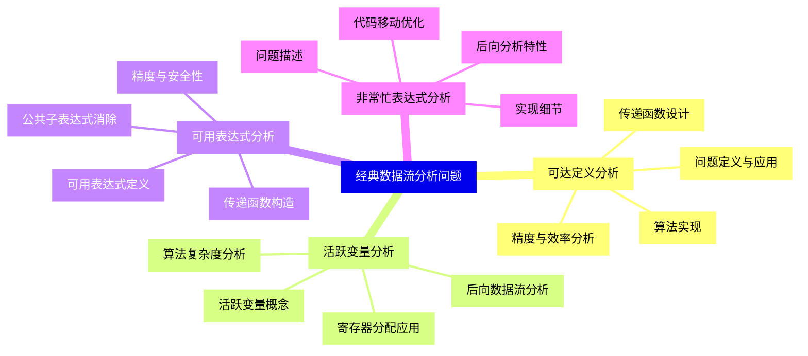
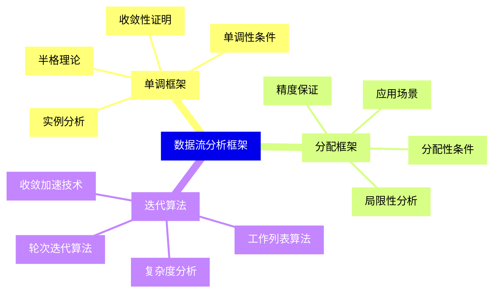
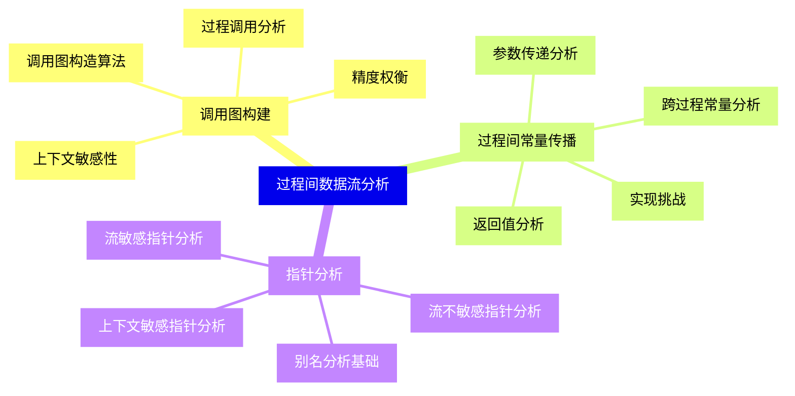
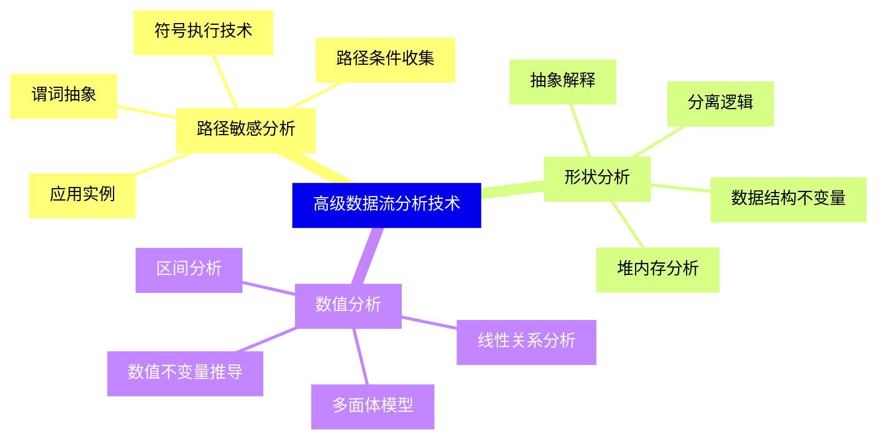
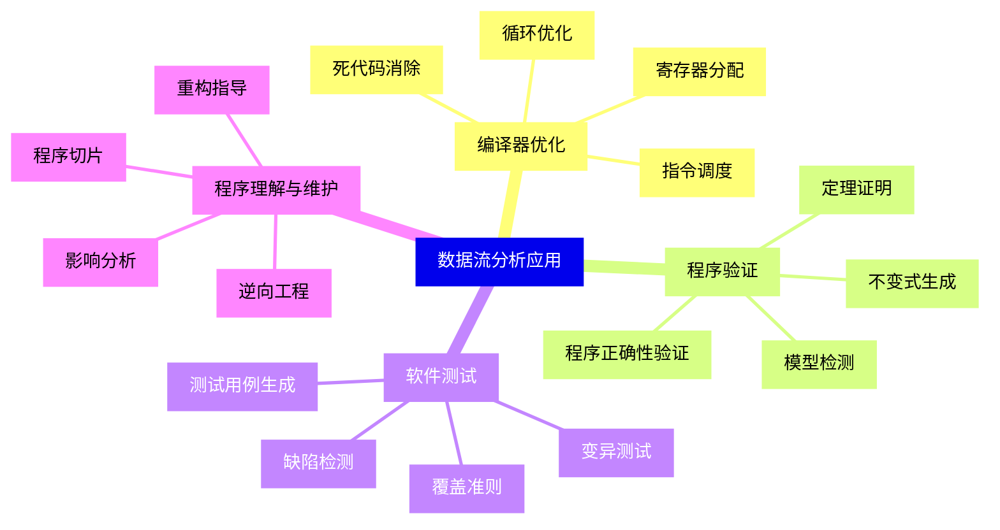
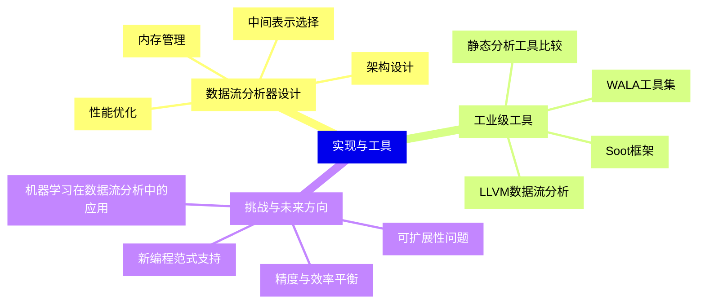


### 1 [数据流分析基础](#1)
#### 1.1 [基本概念](#1)
##### 1.1.1 [数据流分析定义与目标](#1)
##### 1.1.2 [程序点与数据流值](#1)
##### 1.1.3 [控制流图表示](#1)
##### 1.1.4 [前向分析与后向分析](#1)
#### 1.2 [数据流方程](#1)
##### 1.2.1 [传递函数](#1)
##### 1.2.2 [交汇操作](#1)
##### 1.2.3 [数据流方程形式化表示](#1)
##### 1.2.4 [不动点理论](#1)
### 2 [经典数据流分析问题](#2)
#### 2.1 [可达定义分析](#2)
##### 2.1.1 [问题定义与应用](#2)
##### 2.1.2 [传递函数设计](#2)
##### 2.1.3 [算法实现](#2)
##### 2.1.4 [精度与效率分析](#2)
#### 2.2 [活跃变量分析](#2)
##### 2.2.1 [活跃变量概念](#2)
##### 2.2.2 [后向数据流分析](#2)
##### 2.2.3 [寄存器分配应用](#2)
##### 2.2.4 [算法复杂度分析](#2)
#### 2.3 [可用表达式分析](#2)
##### 2.3.1 [可用表达式定义](#2)
##### 2.3.2 [公共子表达式消除](#2)
##### 2.3.3 [传递函数构造](#2)
##### 2.3.4 [精度与安全性](#2)
#### 2.4 [非常忙表达式分析](#2)
##### 2.4.1 [问题描述](#2)
##### 2.4.2 [后向分析特性](#2)
##### 2.4.3 [代码移动优化](#2)
##### 2.4.4 [实现细节](#2)
### 3 [数据流分析框架](#3)
#### 3.1 [单调框架](#3)
##### 3.1.1 [半格理论](#3)
##### 3.1.2 [单调性条件](#3)
##### 3.1.3 [收敛性证明](#3)
##### 3.1.4 [实例分析](#3)
#### 3.2 [分配框架](#3)
##### 3.2.1 [分配性条件](#3)
##### 3.2.2 [精度保证](#3)
##### 3.2.3 [应用场景](#3)
##### 3.2.4 [局限性分析](#3)
#### 3.3 [迭代算法](#3)
##### 3.3.1 [工作列表算法](#3)
##### 3.3.2 [轮次迭代算法](#3)
##### 3.3.3 [收敛加速技术](#3)
##### 3.3.4 [复杂度分析](#3)
### 4 [过程间数据流分析](#4)
#### 4.1 [调用图构建](#4)
##### 4.1.1 [过程调用分析](#4)
##### 4.1.2 [调用图构造算法](#4)
##### 4.1.3 [上下文敏感性](#4)
##### 4.1.4 [精度权衡](#4)
#### 4.2 [过程间常量传播](#4)
##### 4.2.1 [跨过程常量分析](#4)
##### 4.2.2 [参数传递分析](#4)
##### 4.2.3 [返回值分析](#4)
##### 4.2.4 [实现挑战](#4)
#### 4.3 [指针分析](#4)
##### 4.3.1 [别名分析基础](#4)
##### 4.3.2 [流敏感指针分析](#4)
##### 4.3.3 [流不敏感指针分析](#4)
##### 4.3.4 [上下文敏感指针分析](#4)
### 5 [高级数据流分析技术](#5)
#### 5.1 [路径敏感分析](#5)
##### 5.1.1 [路径条件收集](#5)
##### 5.1.2 [符号执行技术](#5)
##### 5.1.3 [谓词抽象](#5)
##### 5.1.4 [应用实例](#5)
#### 5.2 [形状分析](#5)
##### 5.2.1 [堆内存分析](#5)
##### 5.2.2 [抽象解释](#5)
##### 5.2.3 [分离逻辑](#5)
##### 5.2.4 [数据结构不变量](#5)
#### 5.3 [数值分析](#5)
##### 5.3.1 [区间分析](#5)
##### 5.3.2 [线性关系分析](#5)
##### 5.3.3 [多面体模型](#5)
##### 5.3.4 [数值不变量推导](#5)
### 6 [数据流分析应用](#6)
#### 6.1 [编译器优化](#6)
##### 6.1.1 [死代码消除](#6)
##### 6.1.2 [循环优化](#6)
##### 6.1.3 [寄存器分配](#6)
##### 6.1.4 [指令调度](#6)
#### 6.2 [程序验证](#6)
##### 6.2.1 [程序正确性验证](#6)
##### 6.2.2 [不变式生成](#6)
##### 6.2.3 [模型检测](#6)
##### 6.2.4 [定理证明](#6)
#### 6.3 [软件测试](#6)
##### 6.3.1 [测试用例生成](#6)
##### 6.3.2 [覆盖准则](#6)
##### 6.3.3 [缺陷检测](#6)
##### 6.3.4 [变异测试](#6)
#### 6.4 [程序理解与维护](#6)
##### 6.4.1 [程序切片](#6)
##### 6.4.2 [影响分析](#6)
##### 6.4.3 [重构指导](#6)
##### 6.4.4 [逆向工程](#6)
### 7 [实现与工具](#7)
#### 7.1 [数据流分析器设计](#7)
##### 7.1.1 [架构设计](#7)
##### 7.1.2 [中间表示选择](#7)
##### 7.1.3 [内存管理](#7)
##### 7.1.4 [性能优化](#7)
#### 7.2 [工业级工具](#7)
##### 7.2.1 [LLVM数据流分析](#7)
##### 7.2.2 [Soot框架](#7)
##### 7.2.3 [WALA工具集](#7)
##### 7.2.4 [静态分析工具比较](#7)
#### 7.3 [挑战与未来方向](#7)
##### 7.3.1 [可扩展性问题](#7)
##### 7.3.2 [精度与效率平衡](#7)
##### 7.3.3 [新编程范式支持](#7)
##### 7.3.4 [机器学习在数据流分析中的应用](#7)




### 1 数据流分析基础

---
### 1 数据流分析基础
___
#### 1.1 基本概念
___
##### 1.1.1 数据流分析定义与目标
___
##### 1.1.2 程序点与数据流值
___
##### 1.1.3 控制流图表示
___
##### 1.1.4 前向分析与后向分析
___
#### 1.2 数据流方程
___
##### 1.2.1 传递函数
___
##### 1.2.2 交汇操作
___
##### 1.2.3 数据流方程形式化表示
___
##### 1.2.4 不动点理论
### 2 经典数据流分析问题

---
### 2 经典数据流分析问题
___
#### 2.1 可达定义分析
___
##### 2.1.1 问题定义与应用
___
##### 2.1.2 传递函数设计
___
##### 2.1.3 算法实现
___
##### 2.1.4 精度与效率分析
___
#### 2.2 活跃变量分析
___
##### 2.2.1 活跃变量概念
___
##### 2.2.2 后向数据流分析
___
##### 2.2.3 寄存器分配应用
___
##### 2.2.4 算法复杂度分析
___
#### 2.3 可用表达式分析
___
##### 2.3.1 可用表达式定义
___
##### 2.3.2 公共子表达式消除
___
##### 2.3.3 传递函数构造
___
##### 2.3.4 精度与安全性
___
#### 2.4 非常忙表达式分析
___
##### 2.4.1 问题描述
___
##### 2.4.2 后向分析特性
___
##### 2.4.3 代码移动优化
___
##### 2.4.4 实现细节
### 3 数据流分析框架

---
### 3 数据流分析框架
___
#### 3.1 单调框架
___
##### 3.1.1 半格理论
___
##### 3.1.2 单调性条件
___
##### 3.1.3 收敛性证明
___
##### 3.1.4 实例分析
___
#### 3.2 分配框架
___
##### 3.2.1 分配性条件
___
##### 3.2.2 精度保证
___
##### 3.2.3 应用场景
___
##### 3.2.4 局限性分析
___
#### 3.3 迭代算法
___
##### 3.3.1 工作列表算法
___
##### 3.3.2 轮次迭代算法
___
##### 3.3.3 收敛加速技术
___
##### 3.3.4 复杂度分析
### 4 过程间数据流分析

---
### 4 过程间数据流分析
___
#### 4.1 调用图构建
___
##### 4.1.1 过程调用分析
___
##### 4.1.2 调用图构造算法
___
##### 4.1.3 上下文敏感性
___
##### 4.1.4 精度权衡
___
#### 4.2 过程间常量传播
___
##### 4.2.1 跨过程常量分析
___
##### 4.2.2 参数传递分析
___
##### 4.2.3 返回值分析
___
##### 4.2.4 实现挑战
___
#### 4.3 指针分析
___
##### 4.3.1 别名分析基础
___
##### 4.3.2 流敏感指针分析
___
##### 4.3.3 流不敏感指针分析
___
##### 4.3.4 上下文敏感指针分析
### 5 高级数据流分析技术

---
### 5 高级数据流分析技术
___
#### 5.1 路径敏感分析
___
##### 5.1.1 路径条件收集
___
##### 5.1.2 符号执行技术
___
##### 5.1.3 谓词抽象
___
##### 5.1.4 应用实例
___
#### 5.2 形状分析
___
##### 5.2.1 堆内存分析
___
##### 5.2.2 抽象解释
___
##### 5.2.3 分离逻辑
___
##### 5.2.4 数据结构不变量
___
#### 5.3 数值分析
___
##### 5.3.1 区间分析
___
##### 5.3.2 线性关系分析
___
##### 5.3.3 多面体模型
___
##### 5.3.4 数值不变量推导
### 6 数据流分析应用

---
### 6 数据流分析应用
___
#### 6.1 编译器优化
___
##### 6.1.1 死代码消除
___
##### 6.1.2 循环优化
___
##### 6.1.3 寄存器分配
___
##### 6.1.4 指令调度
___
#### 6.2 程序验证
___
##### 6.2.1 程序正确性验证
___
##### 6.2.2 不变式生成
___
##### 6.2.3 模型检测
___
##### 6.2.4 定理证明
___
#### 6.3 软件测试
___
##### 6.3.1 测试用例生成
___
##### 6.3.2 覆盖准则
___
##### 6.3.3 缺陷检测
___
##### 6.3.4 变异测试
___
#### 6.4 程序理解与维护
___
##### 6.4.1 程序切片
___
##### 6.4.2 影响分析
___
##### 6.4.3 重构指导
___
##### 6.4.4 逆向工程
### 7 实现与工具

---
### 7 实现与工具
___
#### 7.1 数据流分析器设计
___
##### 7.1.1 架构设计
___
##### 7.1.2 中间表示选择
___
##### 7.1.3 内存管理
___
##### 7.1.4 性能优化
___
#### 7.2 工业级工具
___
##### 7.2.1 LLVM数据流分析
___
##### 7.2.2 Soot框架
___
##### 7.2.3 WALA工具集
___
##### 7.2.4 静态分析工具比较
___
#### 7.3 挑战与未来方向
___
##### 7.3.1 可扩展性问题
___
##### 7.3.2 精度与效率平衡
___
##### 7.3.3 新编程范式支持
___
##### 7.3.4 机器学习在数据流分析中的应用


### 1 数据流分析基础{#1}

{}

<--->
{}
{}
{}
{}
{}
{}
{}
{}
{}
{}
{}
{}
{}
{}
{}
{}
{}
{}
{}
{}
{}

### 2 经典数据流分析问题{#2}

{}
{}
{}
{}
{}
{}
{}
{}
{}
{}
{}
{}
{}
{}
{}
{}
{}
{}
{}
{}
{}
{}
{}
{}
{}
{}
{}
{}
{}
{}
{}
{}
{}
{}
{}
{}
{}
{}
{}
{}
{}
<--->

{}

### 3 数据流分析框架{#3}

{}

<--->
{}
{}
{}
{}
{}
{}
{}
{}
{}
{}
{}
{}
{}
{}
{}
{}
{}
{}
{}
{}
{}
{}
{}
{}
{}
{}
{}
{}
{}
{}
{}

### 4 过程间数据流分析{#4}

{}
{}
{}
{}
{}
{}
{}
{}
{}
{}
{}
{}
{}
{}
{}
{}
{}
{}
{}
{}
{}
{}
{}
{}
{}
{}
{}
{}
{}
{}
{}
<--->

{}

### 5 高级数据流分析技术{#5}

{}

<--->
{}
{}
{}
{}
{}
{}
{}
{}
{}
{}
{}
{}
{}
{}
{}
{}
{}
{}
{}
{}
{}
{}
{}
{}
{}
{}
{}
{}
{}
{}
{}

### 6 数据流分析应用{#6}

{}
{}
{}
{}
{}
{}
{}
{}
{}
{}
{}
{}
{}
{}
{}
{}
{}
{}
{}
{}
{}
{}
{}
{}
{}
{}
{}
{}
{}
{}
{}
{}
{}
{}
{}
{}
{}
{}
{}
{}
{}
<--->

{}

### 7 实现与工具{#7}

{}

<--->
{}
{}
{}
{}
{}
{}
{}
{}
{}
{}
{}
{}
{}
{}
{}
{}
{}
{}
{}
{}
{}
{}
{}
{}
{}
{}
{}
{}
{}
{}
{}
