
### 1 [循环优化概述](#1)
#### 1.1 [循环优化的重要性](#1)
#### 1.2 [程序执行时间分析](#1)
#### 1.3 [循环在程序中的占比](#1)
#### 1.4 [优化对性能提升的影响](#1)
#### 1.5 [循环优化的分类](#1)
#### 1.6 [机器无关优化](#1)
#### 1.7 [机器相关优化](#1)
#### 1.8 [源码级优化](#1)
#### 1.9 [中间代码级优化](#1)
#### 1.10 [循环优化的基本原则](#1)
#### 1.11 [安全性原则](#1)
#### 1.12 [收益性原则](#1)
#### 1.13 [代价分析](#1)
### 2 [循环识别与分析](#2)
#### 2.1 [循环结构识别](#2)
#### 2.2 [控制流图分析](#2)
#### 2.3 [支配节点与回边](#2)
#### 2.4 [自然循环识别算法](#2)
#### 2.5 [循环嵌套分析](#2)
#### 2.6 [嵌套层次确定](#2)
#### 2.7 [循环间依赖关系](#2)
#### 2.8 [循环变换的可行性分析](#2)
#### 2.9 [循环数据流分析](#2)
#### 2.10 [到达定值分析](#2)
#### 2.11 [活跃变量分析](#2)
#### 2.12 [循环不变量识别](#2)
### 3 [循环不变计算外提](#3)
#### 3.1 [基本原理](#3)
#### 3.2 [循环不变式定义](#3)
#### 3.3 [外提条件分析](#3)
#### 3.4 [安全性检查](#3)
#### 3.5 [实现技术](#3)
#### 3.6 [代码移动算法](#3)
#### 3.7 [前置节点插入](#3)
#### 3.8 [特殊情况处理](#3)
#### 3.9 [优化效果评估](#3)
#### 3.10 [计算量减少分析](#3)
#### 3.11 [对缓存性能的影响](#3)
#### 3.12 [代码大小变化](#3)
### 4 [归纳变量优化](#4)
#### 4.1 [归纳变量识别](#4)
#### 4.2 [基本归纳变量](#4)
#### 4.3 [派生归纳变量](#4)
#### 4.4 [线性函数关系分析](#4)
#### 4.5 [强度削弱](#4)
#### 4.6 [乘法运算转换为加法](#4)
#### 4.7 [除法运算转换](#4)
#### 4.8 [模运算优化](#4)
#### 4.9 [归纳变量删除](#4)
#### 4.10 [无用归纳变量消除](#4)
#### 4.11 [循环终止条件优化](#4)
#### 4.12 [寄存器分配优化](#4)
### 5 [循环展开](#5)
#### 5.1 [完全循环展开](#5)
#### 5.2 [展开因子选择](#5)
#### 5.3 [代码复制与调整](#5)
#### 5.4 [循环体合并优化](#5)
#### 5.5 [部分循环展开](#5)
#### 5.6 [展开度确定](#5)
#### 5.7 [剩余循环处理](#5)
#### 5.8 [展开策略选择](#5)
#### 5.9 [展开效果分析](#5)
#### 5.10 [指令级并行性提升](#5)
#### 5.11 [分支预测改进](#5)
#### 5.12 [开销与收益平衡](#5)
### 6 [循环合并与分裂](#6)
#### 6.1 [循环合并](#6)
#### 6.2 [相同迭代空间循环合并](#6)
#### 6.3 [数据局部性改善](#6)
#### 6.4 [循环开销减少](#6)
#### 6.5 [循环分裂](#6)
#### 6.6 [循环体过大时的分裂](#6)
#### 6.7 [不同优化目标的分裂](#6)
#### 6.8 [缓存性能优化](#6)
#### 6.9 [循环分布](#6)
#### 6.10 [数据依赖分析](#6)
#### 6.11 [并行化潜力挖掘](#6)
#### 6.12 [负载均衡考虑](#6)
### 7 [循环交换与重排序](#7)
#### 7.1 [循环交换](#7)
#### 7.2 [嵌套循环顺序调整](#7)
#### 7.3 [数据访问模式优化](#7)
#### 7.4 [缓存命中率提升](#7)
#### 7.5 [循环融合](#7)
#### 7.6 [相邻循环合并](#7)
#### 7.7 [数据重用优化](#7)
#### 7.8 [通信开销减少](#7)
#### 7.9 [循环分块](#7)
#### 7.10 [分块大小选择](#7)
#### 7.11 [数据局部性优化](#7)
#### 7.12 [多级存储层次利用](#7)
### 8 [软件流水线技术](#8)
#### 8.1 [基本原理](#8)
#### 8.2 [指令级并行挖掘](#8)
#### 8.3 [流水线阶段划分](#8)
#### 8.4 [资源冲突解决](#8)
#### 8.5 [模调度算法](#8)
#### 8.6 [初始化间隔确定](#8)
#### 8.7 [资源约束检查](#8)
#### 8.8 [内核代码生成](#8)
#### 8.9 [寄存器压力管理](#8)
#### 8.10 [生存范围分析](#8)
#### 8.11 [寄存器分配策略](#8)
#### 8.12 [溢出代码处理](#8)
### 9 [循环并行化优化](#9)
#### 9.1 [自动并行化](#9)
#### 9.2 [数据依赖分析](#9)
#### 9.3 [并行性检测](#9)
#### 9.4 [并行循环生成](#9)
#### 9.5 [向量化优化](#9)
#### 9.6 [数据对齐处理](#9)
#### 9.7 [向量指令利用](#9)
#### 9.8 [内存访问优化](#9)
#### 9.9 [多核并行](#9)
#### 9.10 [循环划分策略](#9)
#### 9.11 [负载均衡技术](#9)
#### 9.12 [同步开销最小化](#9)
### 10 [特殊循环结构优化](#10)
#### 10.1 [while循环优化](#10)
#### 10.2 [循环条件简化](#10)
#### 10.3 [循环终止性分析](#10)
#### 10.4 [边界情况处理](#10)
#### 10.5 [do-while循环优化](#10)
#### 10.6 [至少执行一次特性利用](#10)
#### 10.7 [条件判断优化](#10)
#### 10.8 [循环控制流改进](#10)
#### 10.9 [无限循环处理](#10)
#### 10.10 [死循环检测](#10)
#### 10.11 [有意义的无限循环优化](#10)
#### 10.12 [退出条件分析](#10)
### 11 [循环优化与其它优化的交互](#11)
#### 11.1 [与数据流优化的关系](#11)
#### 11.2 [常量传播](#11)
#### 11.3 [复写传播](#11)
#### 11.4 [死代码删除](#11)
#### 11.5 [与寄存器分配的协调](#11)
#### 11.6 [寄存器压力分析](#11)
#### 11.7 [生存期管理](#11)
#### 11.8 [溢出避免](#11)
#### 11.9 [与指令调度的配合](#11)
#### 11.10 [指令重排序](#11)
#### 11.11 [功能单元利用](#11)
#### 11.12 [流水线停顿减少](#11)
### 12 [循环优化实现技术](#12)
#### 12.1 [中间表示选择](#12)
#### 12.2 [地址代码](#12)
#### 12.3 [静态单赋值形式](#12)
#### 12.4 [控制流图表示](#12)
#### 12.5 [优化遍设计](#12)
#### 12.6 [优化顺序安排](#12)
#### 12.7 [信息传递机制](#12)
#### 12.8 [多次优化处理](#12)
#### 12.9 [调试与测试](#12)
#### 12.10 [优化正确性验证](#12)
#### 12.11 [性能测试方法](#12)
#### 12.12 [回归测试策略](#12)
### 13 [现代编译器中的循环优化](#13)
#### 13.1 [LLVM循环优化框架](#13)
#### 13.2 [LoopInfo分析](#13)
#### 13.3 [ScalarEvolution分析](#13)
#### 13.4 [循环转换pass](#13)
#### 13.5 [GCC循环优化实现](#13)
#### 13.6 [树SSA表示](#13)
#### 13.7 [图形化循环处理](#13)
#### 13.8 [目标相关优化](#13)
#### 13.9 [即时编译器的循环优化](#13)
#### 13.10 [动态优化特性](#13)
#### 13.11 [性能剖析指导](#13)
#### 13.12 [自适应优化策略](#13)
### 14 [循环优化研究进展](#14)
#### 14.1 [多面体模型优化](#14)
#### 14.2 [仿射循环变换](#14)
#### 14.3 [自动并行化技术](#14)
#### 14.4 [优化空间探索](#14)
#### 14.5 [机器学习在循环优化中的应用](#14)
#### 14.6 [优化决策建模](#14)
#### 14.7 [性能预测](#14)
#### 14.8 [自适应优化](#14)
#### 14.9 [新兴架构下的循环优化](#14)
#### 14.10 [GPU循环优化](#14)
#### 14.11 [众核处理器优化](#14)
#### 14.12 [异构计算优化](#14)




### 1 循环优化概述

---
### 1 循环优化概述
___
#### 1.1 循环优化的重要性
___
#### 1.2 程序执行时间分析
___
#### 1.3 循环在程序中的占比
___
#### 1.4 优化对性能提升的影响
___
#### 1.5 循环优化的分类
___
#### 1.6 机器无关优化
___
#### 1.7 机器相关优化
___
#### 1.8 源码级优化
___
#### 1.9 中间代码级优化
___
#### 1.10 循环优化的基本原则
___
#### 1.11 安全性原则
___
#### 1.12 收益性原则
___
#### 1.13 代价分析
### 2 循环识别与分析

---
### 2 循环识别与分析
___
#### 2.1 循环结构识别
___
#### 2.2 控制流图分析
___
#### 2.3 支配节点与回边
___
#### 2.4 自然循环识别算法
___
#### 2.5 循环嵌套分析
___
#### 2.6 嵌套层次确定
___
#### 2.7 循环间依赖关系
___
#### 2.8 循环变换的可行性分析
___
#### 2.9 循环数据流分析
___
#### 2.10 到达定值分析
___
#### 2.11 活跃变量分析
___
#### 2.12 循环不变量识别
### 3 循环不变计算外提

---
### 3 循环不变计算外提
___
#### 3.1 基本原理
___
#### 3.2 循环不变式定义
___
#### 3.3 外提条件分析
___
#### 3.4 安全性检查
___
#### 3.5 实现技术
___
#### 3.6 代码移动算法
___
#### 3.7 前置节点插入
___
#### 3.8 特殊情况处理
___
#### 3.9 优化效果评估
___
#### 3.10 计算量减少分析
___
#### 3.11 对缓存性能的影响
___
#### 3.12 代码大小变化
### 4 归纳变量优化

---
### 4 归纳变量优化
___
#### 4.1 归纳变量识别
___
#### 4.2 基本归纳变量
___
#### 4.3 派生归纳变量
___
#### 4.4 线性函数关系分析
___
#### 4.5 强度削弱
___
#### 4.6 乘法运算转换为加法
___
#### 4.7 除法运算转换
___
#### 4.8 模运算优化
___
#### 4.9 归纳变量删除
___
#### 4.10 无用归纳变量消除
___
#### 4.11 循环终止条件优化
___
#### 4.12 寄存器分配优化
### 5 循环展开

---
### 5 循环展开
___
#### 5.1 完全循环展开
___
#### 5.2 展开因子选择
___
#### 5.3 代码复制与调整
___
#### 5.4 循环体合并优化
___
#### 5.5 部分循环展开
___
#### 5.6 展开度确定
___
#### 5.7 剩余循环处理
___
#### 5.8 展开策略选择
___
#### 5.9 展开效果分析
___
#### 5.10 指令级并行性提升
___
#### 5.11 分支预测改进
___
#### 5.12 开销与收益平衡
### 6 循环合并与分裂

---
### 6 循环合并与分裂
___
#### 6.1 循环合并
___
#### 6.2 相同迭代空间循环合并
___
#### 6.3 数据局部性改善
___
#### 6.4 循环开销减少
___
#### 6.5 循环分裂
___
#### 6.6 循环体过大时的分裂
___
#### 6.7 不同优化目标的分裂
___
#### 6.8 缓存性能优化
___
#### 6.9 循环分布
___
#### 6.10 数据依赖分析
___
#### 6.11 并行化潜力挖掘
___
#### 6.12 负载均衡考虑
### 7 循环交换与重排序

---
### 7 循环交换与重排序
___
#### 7.1 循环交换
___
#### 7.2 嵌套循环顺序调整
___
#### 7.3 数据访问模式优化
___
#### 7.4 缓存命中率提升
___
#### 7.5 循环融合
___
#### 7.6 相邻循环合并
___
#### 7.7 数据重用优化
___
#### 7.8 通信开销减少
___
#### 7.9 循环分块
___
#### 7.10 分块大小选择
___
#### 7.11 数据局部性优化
___
#### 7.12 多级存储层次利用
### 8 软件流水线技术

---
### 8 软件流水线技术
___
#### 8.1 基本原理
___
#### 8.2 指令级并行挖掘
___
#### 8.3 流水线阶段划分
___
#### 8.4 资源冲突解决
___
#### 8.5 模调度算法
___
#### 8.6 初始化间隔确定
___
#### 8.7 资源约束检查
___
#### 8.8 内核代码生成
___
#### 8.9 寄存器压力管理
___
#### 8.10 生存范围分析
___
#### 8.11 寄存器分配策略
___
#### 8.12 溢出代码处理
### 9 循环并行化优化

---
### 9 循环并行化优化
___
#### 9.1 自动并行化
___
#### 9.2 数据依赖分析
___
#### 9.3 并行性检测
___
#### 9.4 并行循环生成
___
#### 9.5 向量化优化
___
#### 9.6 数据对齐处理
___
#### 9.7 向量指令利用
___
#### 9.8 内存访问优化
___
#### 9.9 多核并行
___
#### 9.10 循环划分策略
___
#### 9.11 负载均衡技术
___
#### 9.12 同步开销最小化
### 10 特殊循环结构优化

---
### 10 特殊循环结构优化
___
#### 10.1 while循环优化
___
#### 10.2 循环条件简化
___
#### 10.3 循环终止性分析
___
#### 10.4 边界情况处理
___
#### 10.5 do-while循环优化
___
#### 10.6 至少执行一次特性利用
___
#### 10.7 条件判断优化
___
#### 10.8 循环控制流改进
___
#### 10.9 无限循环处理
___
#### 10.10 死循环检测
___
#### 10.11 有意义的无限循环优化
___
#### 10.12 退出条件分析
### 11 循环优化与其它优化的交互

---
### 11 循环优化与其它优化的交互
___
#### 11.1 与数据流优化的关系
___
#### 11.2 常量传播
___
#### 11.3 复写传播
___
#### 11.4 死代码删除
___
#### 11.5 与寄存器分配的协调
___
#### 11.6 寄存器压力分析
___
#### 11.7 生存期管理
___
#### 11.8 溢出避免
___
#### 11.9 与指令调度的配合
___
#### 11.10 指令重排序
___
#### 11.11 功能单元利用
___
#### 11.12 流水线停顿减少
### 12 循环优化实现技术

---
### 12 循环优化实现技术
___
#### 12.1 中间表示选择
___
#### 12.2 地址代码
___
#### 12.3 静态单赋值形式
___
#### 12.4 控制流图表示
___
#### 12.5 优化遍设计
___
#### 12.6 优化顺序安排
___
#### 12.7 信息传递机制
___
#### 12.8 多次优化处理
___
#### 12.9 调试与测试
___
#### 12.10 优化正确性验证
___
#### 12.11 性能测试方法
___
#### 12.12 回归测试策略
### 13 现代编译器中的循环优化

---
### 13 现代编译器中的循环优化
___
#### 13.1 LLVM循环优化框架
___
#### 13.2 LoopInfo分析
___
#### 13.3 ScalarEvolution分析
___
#### 13.4 循环转换pass
___
#### 13.5 GCC循环优化实现
___
#### 13.6 树SSA表示
___
#### 13.7 图形化循环处理
___
#### 13.8 目标相关优化
___
#### 13.9 即时编译器的循环优化
___
#### 13.10 动态优化特性
___
#### 13.11 性能剖析指导
___
#### 13.12 自适应优化策略
### 14 循环优化研究进展

---
### 14 循环优化研究进展
___
#### 14.1 多面体模型优化
___
#### 14.2 仿射循环变换
___
#### 14.3 自动并行化技术
___
#### 14.4 优化空间探索
___
#### 14.5 机器学习在循环优化中的应用
___
#### 14.6 优化决策建模
___
#### 14.7 性能预测
___
#### 14.8 自适应优化
___
#### 14.9 新兴架构下的循环优化
___
#### 14.10 GPU循环优化
___
#### 14.11 众核处理器优化
___
#### 14.12 异构计算优化


### 1 循环优化概述{#1}

{}
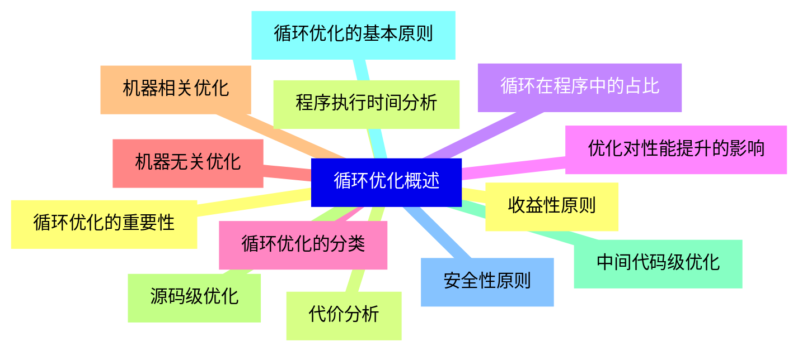

<--->
{}
{}
{}
{}
{}
{}
{}
{}
{}
{}
{}
{}
{}
{}
{}
{}
{}
{}
{}
{}
{}
{}
{}
{}
{}
{}
{}

### 2 循环识别与分析{#2}

{}
{}
{}
{}
{}
{}
{}
{}
{}
{}
{}
{}
{}
{}
{}
{}
{}
{}
{}
{}
{}
{}
{}
{}
{}
<--->
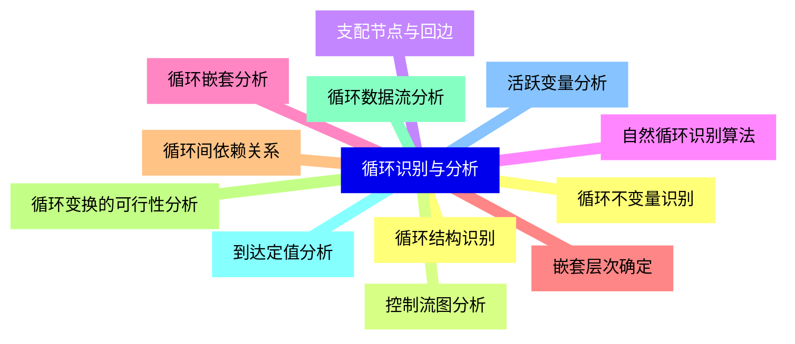

{}

### 3 循环不变计算外提{#3}

{}
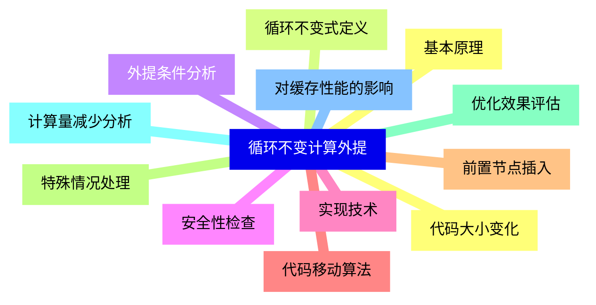

<--->
{}
{}
{}
{}
{}
{}
{}
{}
{}
{}
{}
{}
{}
{}
{}
{}
{}
{}
{}
{}
{}
{}
{}
{}
{}

### 4 归纳变量优化{#4}

{}
{}
{}
{}
{}
{}
{}
{}
{}
{}
{}
{}
{}
{}
{}
{}
{}
{}
{}
{}
{}
{}
{}
{}
{}
<--->
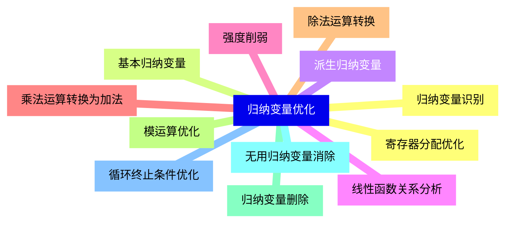

{}

### 5 循环展开{#5}

{}
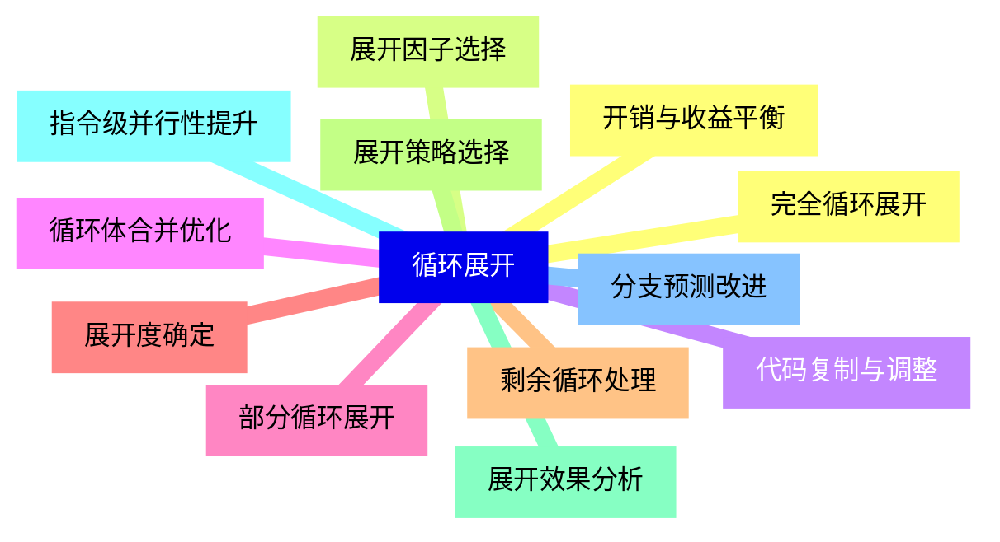

<--->
{}
{}
{}
{}
{}
{}
{}
{}
{}
{}
{}
{}
{}
{}
{}
{}
{}
{}
{}
{}
{}
{}
{}
{}
{}

### 6 循环合并与分裂{#6}

{}
{}
{}
{}
{}
{}
{}
{}
{}
{}
{}
{}
{}
{}
{}
{}
{}
{}
{}
{}
{}
{}
{}
{}
{}
<--->
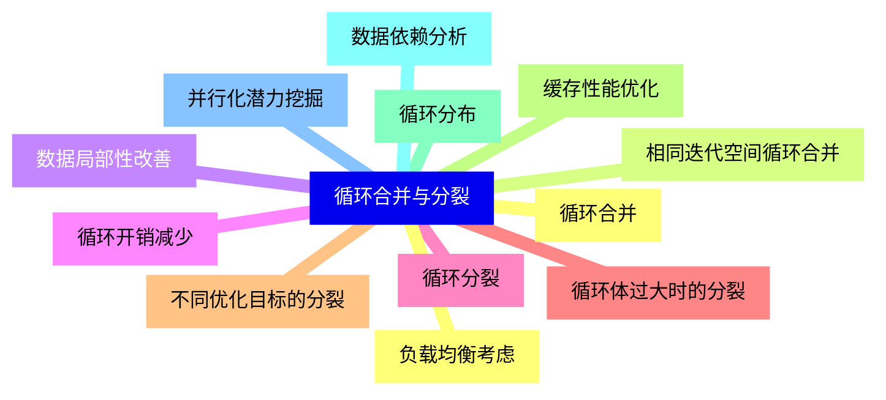

{}

### 7 循环交换与重排序{#7}

{}
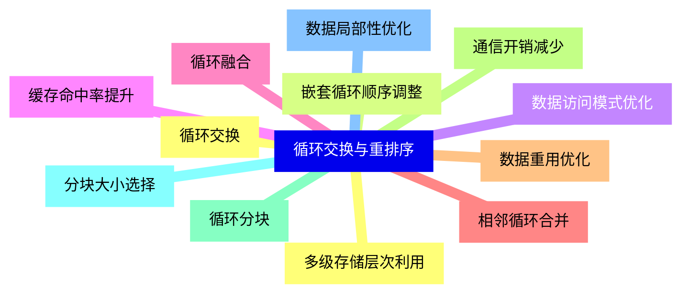

<--->
{}
{}
{}
{}
{}
{}
{}
{}
{}
{}
{}
{}
{}
{}
{}
{}
{}
{}
{}
{}
{}
{}
{}
{}
{}

### 8 软件流水线技术{#8}

{}
{}
{}
{}
{}
{}
{}
{}
{}
{}
{}
{}
{}
{}
{}
{}
{}
{}
{}
{}
{}
{}
{}
{}
{}
<--->
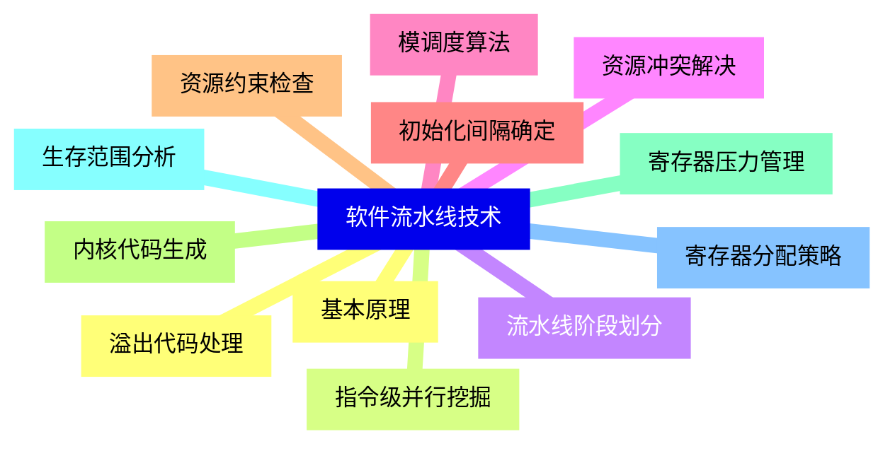

{}

### 9 循环并行化优化{#9}

{}
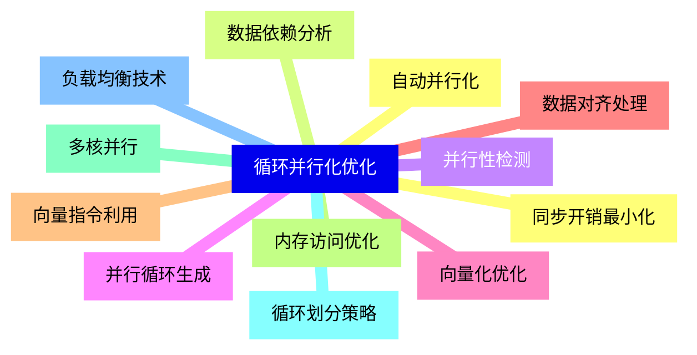

<--->
{}
{}
{}
{}
{}
{}
{}
{}
{}
{}
{}
{}
{}
{}
{}
{}
{}
{}
{}
{}
{}
{}
{}
{}
{}

### 10 特殊循环结构优化{#10}

{}
{}
{}
{}
{}
{}
{}
{}
{}
{}
{}
{}
{}
{}
{}
{}
{}
{}
{}
{}
{}
{}
{}
{}
{}
<--->
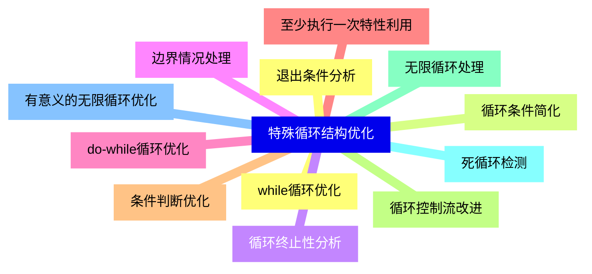

{}

### 11 循环优化与其它优化的交互{#11}

{}
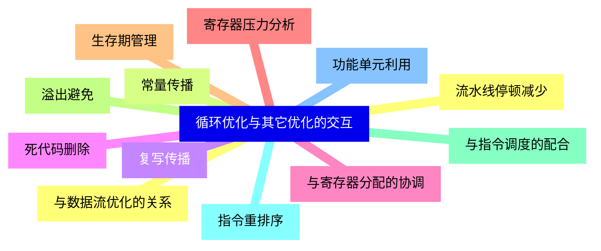

<--->
{}
{}
{}
{}
{}
{}
{}
{}
{}
{}
{}
{}
{}
{}
{}
{}
{}
{}
{}
{}
{}
{}
{}
{}
{}

### 12 循环优化实现技术{#12}

{}
{}
{}
{}
{}
{}
{}
{}
{}
{}
{}
{}
{}
{}
{}
{}
{}
{}
{}
{}
{}
{}
{}
{}
{}
<--->
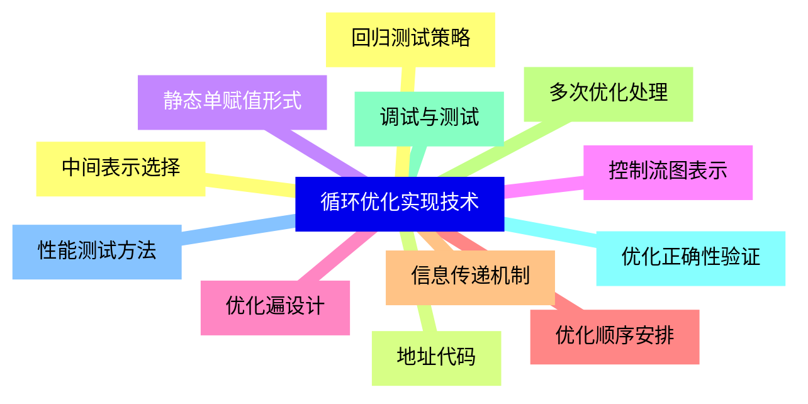

{}

### 13 现代编译器中的循环优化{#13}

{}
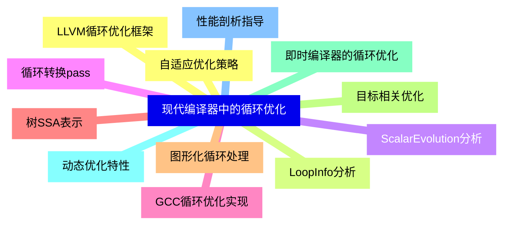

<--->
{}
{}
{}
{}
{}
{}
{}
{}
{}
{}
{}
{}
{}
{}
{}
{}
{}
{}
{}
{}
{}
{}
{}
{}
{}

### 14 循环优化研究进展{#14}

{}
{}
{}
{}
{}
{}
{}
{}
{}
{}
{}
{}
{}
{}
{}
{}
{}
{}
{}
{}
{}
{}
{}
{}
{}
<--->
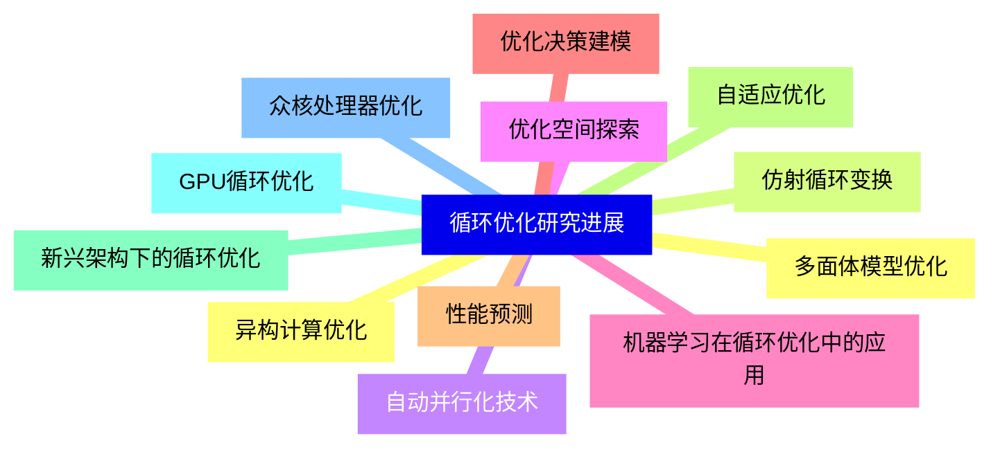

{}
