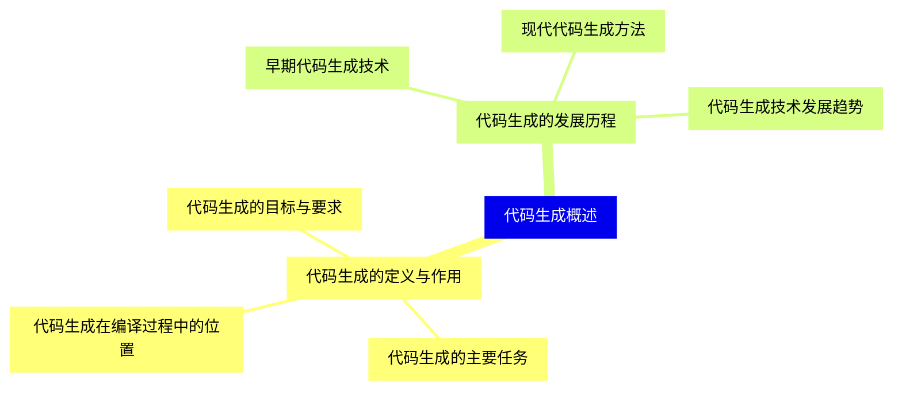
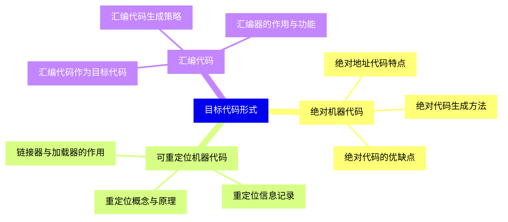
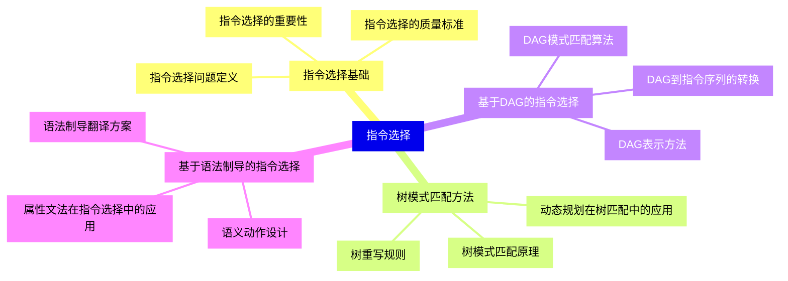
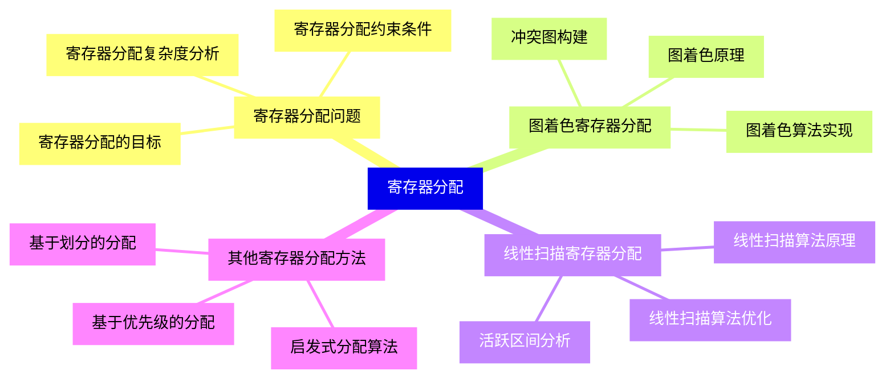
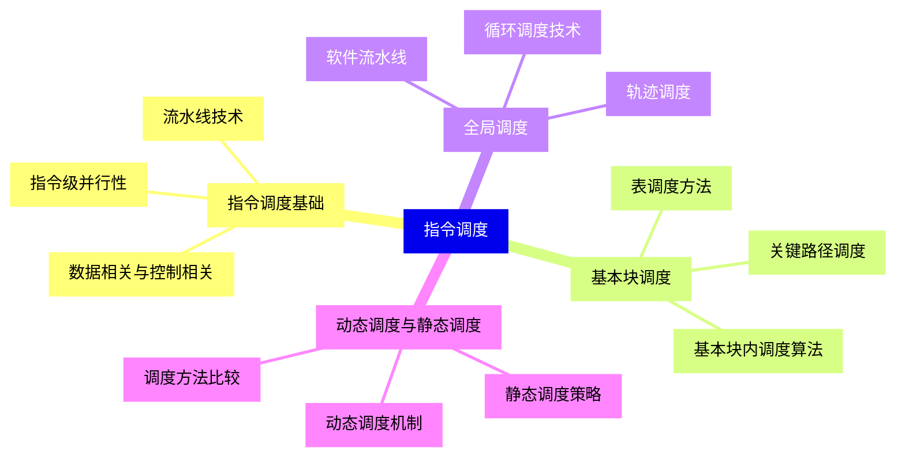
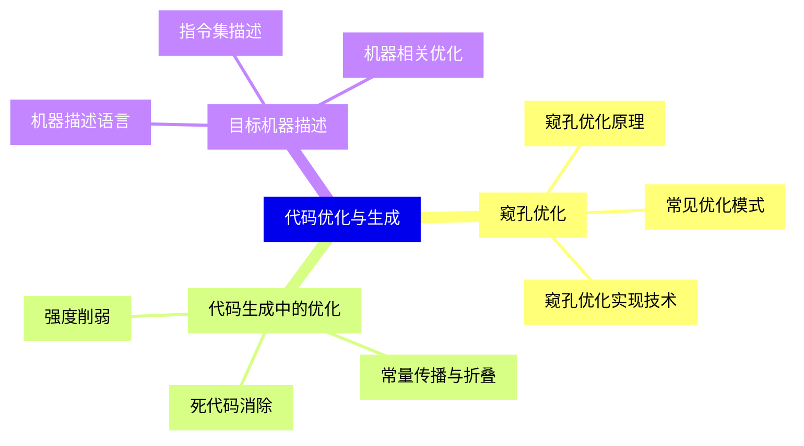
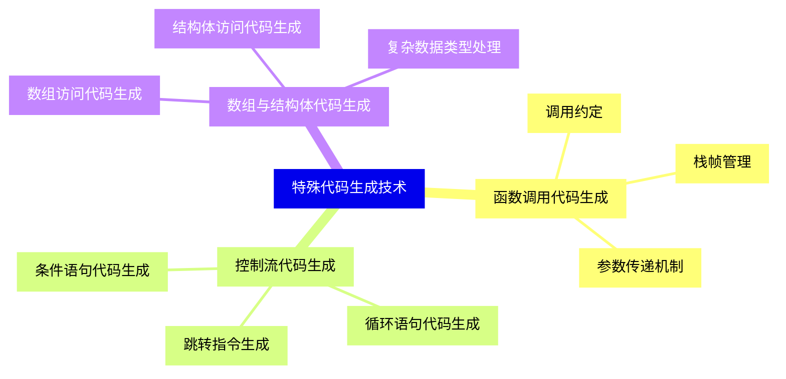
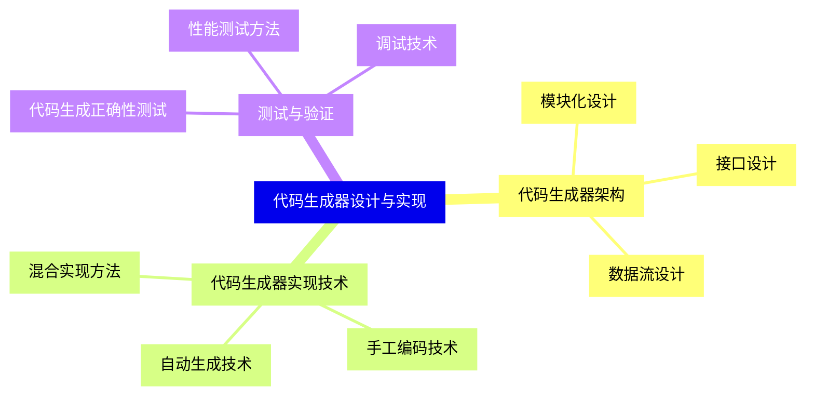
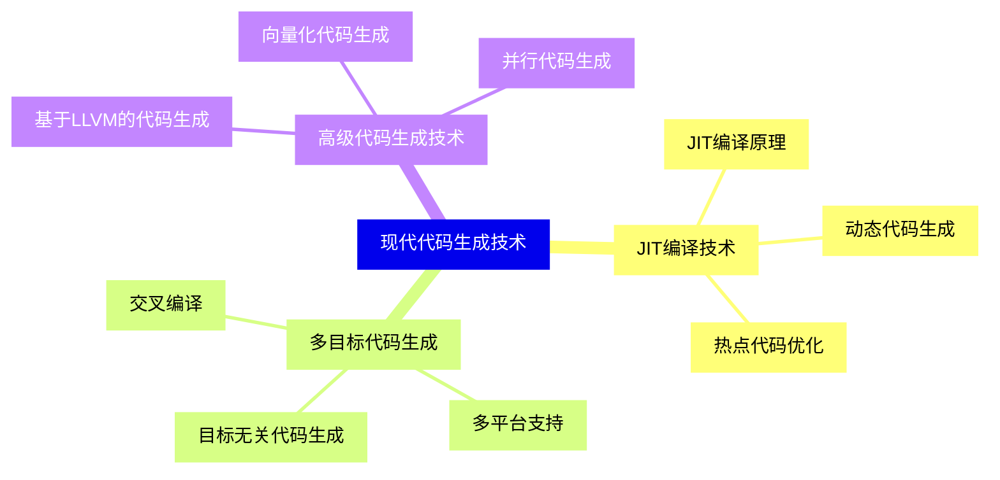


### 1 [代码生成概述](#1)
#### 1.1 [代码生成的定义与作用](#1)
##### 1.1.1 [代码生成在编译过程中的位置](#1)
##### 1.1.2 [代码生成的主要任务](#1)
##### 1.1.3 [代码生成的目标与要求](#1)
#### 1.2 [代码生成的发展历程](#1)
##### 1.2.1 [早期代码生成技术](#1)
##### 1.2.2 [现代代码生成方法](#1)
##### 1.2.3 [代码生成技术发展趋势](#1)
### 2 [目标代码形式](#2)
#### 2.1 [绝对机器代码](#2)
##### 2.1.1 [绝对地址代码特点](#2)
##### 2.1.2 [绝对代码生成方法](#2)
##### 2.1.3 [绝对代码的优缺点](#2)
#### 2.2 [可重定位机器代码](#2)
##### 2.2.1 [重定位概念与原理](#2)
##### 2.2.2 [重定位信息记录](#2)
##### 2.2.3 [链接器与加载器的作用](#2)
#### 2.3 [汇编代码](#2)
##### 2.3.1 [汇编代码作为目标代码](#2)
##### 2.3.2 [汇编代码生成策略](#2)
##### 2.3.3 [汇编器的作用与功能](#2)
### 3 [指令选择](#3)
#### 3.1 [指令选择基础](#3)
##### 3.1.1 [指令选择问题定义](#3)
##### 3.1.2 [指令选择的重要性](#3)
##### 3.1.3 [指令选择的质量标准](#3)
#### 3.2 [树模式匹配方法](#3)
##### 3.2.1 [树模式匹配原理](#3)
##### 3.2.2 [树重写规则](#3)
##### 3.2.3 [动态规划在树匹配中的应用](#3)
#### 3.3 [基于DAG的指令选择](#3)
##### 3.3.1 [DAG表示方法](#3)
##### 3.3.2 [DAG模式匹配算法](#3)
##### 3.3.3 [DAG到指令序列的转换](#3)
#### 3.4 [基于语法制导的指令选择](#3)
##### 3.4.1 [语法制导翻译方案](#3)
##### 3.4.2 [属性文法在指令选择中的应用](#3)
##### 3.4.3 [语义动作设计](#3)
### 4 [寄存器分配](#4)
#### 4.1 [寄存器分配问题](#4)
##### 4.1.1 [寄存器分配的目标](#4)
##### 4.1.2 [寄存器分配约束条件](#4)
##### 4.1.3 [寄存器分配复杂度分析](#4)
#### 4.2 [图着色寄存器分配](#4)
##### 4.2.1 [图着色原理](#4)
##### 4.2.2 [冲突图构建](#4)
##### 4.2.3 [图着色算法实现](#4)
#### 4.3 [线性扫描寄存器分配](#4)
##### 4.3.1 [线性扫描算法原理](#4)
##### 4.3.2 [活跃区间分析](#4)
##### 4.3.3 [线性扫描算法优化](#4)
#### 4.4 [其他寄存器分配方法](#4)
##### 4.4.1 [基于优先级的分配](#4)
##### 4.4.2 [基于划分的分配](#4)
##### 4.4.3 [启发式分配算法](#4)
### 5 [指令调度](#5)
#### 5.1 [指令调度基础](#5)
##### 5.1.1 [指令级并行性](#5)
##### 5.1.2 [流水线技术](#5)
##### 5.1.3 [数据相关与控制相关](#5)
#### 5.2 [基本块调度](#5)
##### 5.2.1 [基本块内调度算法](#5)
##### 5.2.2 [表调度方法](#5)
##### 5.2.3 [关键路径调度](#5)
#### 5.3 [全局调度](#5)
##### 5.3.1 [轨迹调度](#5)
##### 5.3.2 [软件流水线](#5)
##### 5.3.3 [循环调度技术](#5)
#### 5.4 [动态调度与静态调度](#5)
##### 5.4.1 [动态调度机制](#5)
##### 5.4.2 [静态调度策略](#5)
##### 5.4.3 [调度方法比较](#5)
### 6 [代码优化与生成](#6)
#### 6.1 [窥孔优化](#6)
##### 6.1.1 [窥孔优化原理](#6)
##### 6.1.2 [常见优化模式](#6)
##### 6.1.3 [窥孔优化实现技术](#6)
#### 6.2 [代码生成中的优化](#6)
##### 6.2.1 [常量传播与折叠](#6)
##### 6.2.2 [死代码消除](#6)
##### 6.2.3 [强度削弱](#6)
#### 6.3 [目标机器描述](#6)
##### 6.3.1 [机器描述语言](#6)
##### 6.3.2 [指令集描述](#6)
##### 6.3.3 [机器相关优化](#6)
### 7 [特殊代码生成技术](#7)
#### 7.1 [函数调用代码生成](#7)
##### 7.1.1 [调用约定](#7)
##### 7.1.2 [栈帧管理](#7)
##### 7.1.3 [参数传递机制](#7)
#### 7.2 [控制流代码生成](#7)
##### 7.2.1 [条件语句代码生成](#7)
##### 7.2.2 [循环语句代码生成](#7)
##### 7.2.3 [跳转指令生成](#7)
#### 7.3 [数组与结构体代码生成](#7)
##### 7.3.1 [数组访问代码生成](#7)
##### 7.3.2 [结构体访问代码生成](#7)
##### 7.3.3 [复杂数据类型处理](#7)
### 8 [代码生成器设计与实现](#8)
#### 8.1 [代码生成器架构](#8)
##### 8.1.1 [模块化设计](#8)
##### 8.1.2 [接口设计](#8)
##### 8.1.3 [数据流设计](#8)
#### 8.2 [代码生成器实现技术](#8)
##### 8.2.1 [自动生成技术](#8)
##### 8.2.2 [手工编码技术](#8)
##### 8.2.3 [混合实现方法](#8)
#### 8.3 [测试与验证](#8)
##### 8.3.1 [代码生成正确性测试](#8)
##### 8.3.2 [性能测试方法](#8)
##### 8.3.3 [调试技术](#8)
### 9 [现代代码生成技术](#9)
#### 9.1 [JIT编译技术](#9)
##### 9.1.1 [JIT编译原理](#9)
##### 9.1.2 [动态代码生成](#9)
##### 9.1.3 [热点代码优化](#9)
#### 9.2 [多目标代码生成](#9)
##### 9.2.1 [交叉编译](#9)
##### 9.2.2 [多平台支持](#9)
##### 9.2.3 [目标无关代码生成](#9)
#### 9.3 [高级代码生成技术](#9)
##### 9.3.1 [基于LLVM的代码生成](#9)
##### 9.3.2 [向量化代码生成](#9)
##### 9.3.3 [并行代码生成](#9)




### 1 代码生成概述

---
### 1 代码生成概述
___
#### 1.1 代码生成的定义与作用
___
##### 1.1.1 代码生成在编译过程中的位置
___
##### 1.1.2 代码生成的主要任务
___
##### 1.1.3 代码生成的目标与要求
___
#### 1.2 代码生成的发展历程
___
##### 1.2.1 早期代码生成技术
___
##### 1.2.2 现代代码生成方法
___
##### 1.2.3 代码生成技术发展趋势
### 2 目标代码形式

---
### 2 目标代码形式
___
#### 2.1 绝对机器代码
___
##### 2.1.1 绝对地址代码特点
___
##### 2.1.2 绝对代码生成方法
___
##### 2.1.3 绝对代码的优缺点
___
#### 2.2 可重定位机器代码
___
##### 2.2.1 重定位概念与原理
___
##### 2.2.2 重定位信息记录
___
##### 2.2.3 链接器与加载器的作用
___
#### 2.3 汇编代码
___
##### 2.3.1 汇编代码作为目标代码
___
##### 2.3.2 汇编代码生成策略
___
##### 2.3.3 汇编器的作用与功能
### 3 指令选择

---
### 3 指令选择
___
#### 3.1 指令选择基础
___
##### 3.1.1 指令选择问题定义
___
##### 3.1.2 指令选择的重要性
___
##### 3.1.3 指令选择的质量标准
___
#### 3.2 树模式匹配方法
___
##### 3.2.1 树模式匹配原理
___
##### 3.2.2 树重写规则
___
##### 3.2.3 动态规划在树匹配中的应用
___
#### 3.3 基于DAG的指令选择
___
##### 3.3.1 DAG表示方法
___
##### 3.3.2 DAG模式匹配算法
___
##### 3.3.3 DAG到指令序列的转换
___
#### 3.4 基于语法制导的指令选择
___
##### 3.4.1 语法制导翻译方案
___
##### 3.4.2 属性文法在指令选择中的应用
___
##### 3.4.3 语义动作设计
### 4 寄存器分配

---
### 4 寄存器分配
___
#### 4.1 寄存器分配问题
___
##### 4.1.1 寄存器分配的目标
___
##### 4.1.2 寄存器分配约束条件
___
##### 4.1.3 寄存器分配复杂度分析
___
#### 4.2 图着色寄存器分配
___
##### 4.2.1 图着色原理
___
##### 4.2.2 冲突图构建
___
##### 4.2.3 图着色算法实现
___
#### 4.3 线性扫描寄存器分配
___
##### 4.3.1 线性扫描算法原理
___
##### 4.3.2 活跃区间分析
___
##### 4.3.3 线性扫描算法优化
___
#### 4.4 其他寄存器分配方法
___
##### 4.4.1 基于优先级的分配
___
##### 4.4.2 基于划分的分配
___
##### 4.4.3 启发式分配算法
### 5 指令调度

---
### 5 指令调度
___
#### 5.1 指令调度基础
___
##### 5.1.1 指令级并行性
___
##### 5.1.2 流水线技术
___
##### 5.1.3 数据相关与控制相关
___
#### 5.2 基本块调度
___
##### 5.2.1 基本块内调度算法
___
##### 5.2.2 表调度方法
___
##### 5.2.3 关键路径调度
___
#### 5.3 全局调度
___
##### 5.3.1 轨迹调度
___
##### 5.3.2 软件流水线
___
##### 5.3.3 循环调度技术
___
#### 5.4 动态调度与静态调度
___
##### 5.4.1 动态调度机制
___
##### 5.4.2 静态调度策略
___
##### 5.4.3 调度方法比较
### 6 代码优化与生成

---
### 6 代码优化与生成
___
#### 6.1 窥孔优化
___
##### 6.1.1 窥孔优化原理
___
##### 6.1.2 常见优化模式
___
##### 6.1.3 窥孔优化实现技术
___
#### 6.2 代码生成中的优化
___
##### 6.2.1 常量传播与折叠
___
##### 6.2.2 死代码消除
___
##### 6.2.3 强度削弱
___
#### 6.3 目标机器描述
___
##### 6.3.1 机器描述语言
___
##### 6.3.2 指令集描述
___
##### 6.3.3 机器相关优化
### 7 特殊代码生成技术

---
### 7 特殊代码生成技术
___
#### 7.1 函数调用代码生成
___
##### 7.1.1 调用约定
___
##### 7.1.2 栈帧管理
___
##### 7.1.3 参数传递机制
___
#### 7.2 控制流代码生成
___
##### 7.2.1 条件语句代码生成
___
##### 7.2.2 循环语句代码生成
___
##### 7.2.3 跳转指令生成
___
#### 7.3 数组与结构体代码生成
___
##### 7.3.1 数组访问代码生成
___
##### 7.3.2 结构体访问代码生成
___
##### 7.3.3 复杂数据类型处理
### 8 代码生成器设计与实现

---
### 8 代码生成器设计与实现
___
#### 8.1 代码生成器架构
___
##### 8.1.1 模块化设计
___
##### 8.1.2 接口设计
___
##### 8.1.3 数据流设计
___
#### 8.2 代码生成器实现技术
___
##### 8.2.1 自动生成技术
___
##### 8.2.2 手工编码技术
___
##### 8.2.3 混合实现方法
___
#### 8.3 测试与验证
___
##### 8.3.1 代码生成正确性测试
___
##### 8.3.2 性能测试方法
___
##### 8.3.3 调试技术
### 9 现代代码生成技术

---
### 9 现代代码生成技术
___
#### 9.1 JIT编译技术
___
##### 9.1.1 JIT编译原理
___
##### 9.1.2 动态代码生成
___
##### 9.1.3 热点代码优化
___
#### 9.2 多目标代码生成
___
##### 9.2.1 交叉编译
___
##### 9.2.2 多平台支持
___
##### 9.2.3 目标无关代码生成
___
#### 9.3 高级代码生成技术
___
##### 9.3.1 基于LLVM的代码生成
___
##### 9.3.2 向量化代码生成
___
##### 9.3.3 并行代码生成


### 1 代码生成概述{#1}

{}

<--->
{}
{}
{}
{}
{}
{}
{}
{}
{}
{}
{}
{}
{}
{}
{}
{}
{}

### 2 目标代码形式{#2}

{}
{}
{}
{}
{}
{}
{}
{}
{}
{}
{}
{}
{}
{}
{}
{}
{}
{}
{}
{}
{}
{}
{}
{}
{}
<--->

{}

### 3 指令选择{#3}

{}

<--->
{}
{}
{}
{}
{}
{}
{}
{}
{}
{}
{}
{}
{}
{}
{}
{}
{}
{}
{}
{}
{}
{}
{}
{}
{}
{}
{}
{}
{}
{}
{}
{}
{}

### 4 寄存器分配{#4}

{}
{}
{}
{}
{}
{}
{}
{}
{}
{}
{}
{}
{}
{}
{}
{}
{}
{}
{}
{}
{}
{}
{}
{}
{}
{}
{}
{}
{}
{}
{}
{}
{}
<--->

{}

### 5 指令调度{#5}

{}

<--->
{}
{}
{}
{}
{}
{}
{}
{}
{}
{}
{}
{}
{}
{}
{}
{}
{}
{}
{}
{}
{}
{}
{}
{}
{}
{}
{}
{}
{}
{}
{}
{}
{}

### 6 代码优化与生成{#6}

{}
{}
{}
{}
{}
{}
{}
{}
{}
{}
{}
{}
{}
{}
{}
{}
{}
{}
{}
{}
{}
{}
{}
{}
{}
<--->

{}

### 7 特殊代码生成技术{#7}

{}

<--->
{}
{}
{}
{}
{}
{}
{}
{}
{}
{}
{}
{}
{}
{}
{}
{}
{}
{}
{}
{}
{}
{}
{}
{}
{}

### 8 代码生成器设计与实现{#8}

{}
{}
{}
{}
{}
{}
{}
{}
{}
{}
{}
{}
{}
{}
{}
{}
{}
{}
{}
{}
{}
{}
{}
{}
{}
<--->

{}

### 9 现代代码生成技术{#9}

{}

<--->
{}
{}
{}
{}
{}
{}
{}
{}
{}
{}
{}
{}
{}
{}
{}
{}
{}
{}
{}
{}
{}
{}
{}
{}
{}
