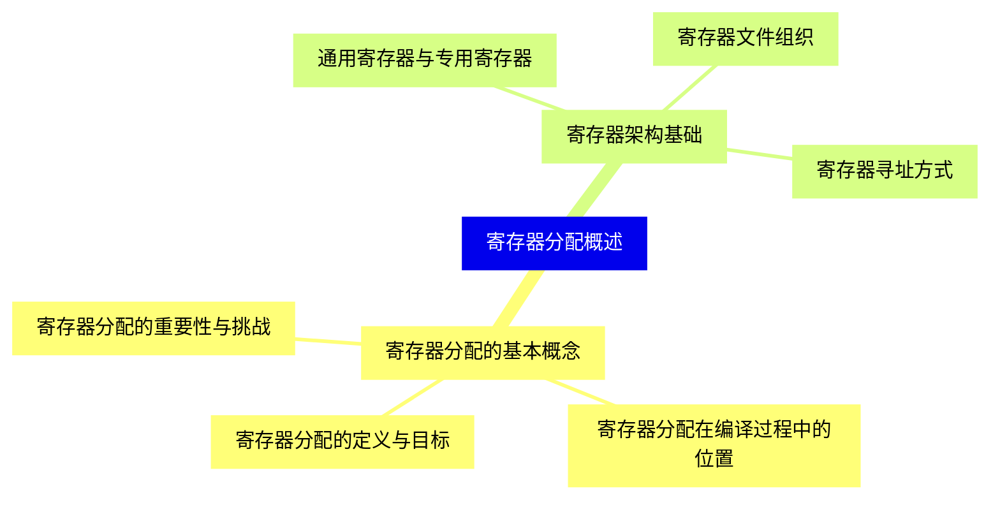
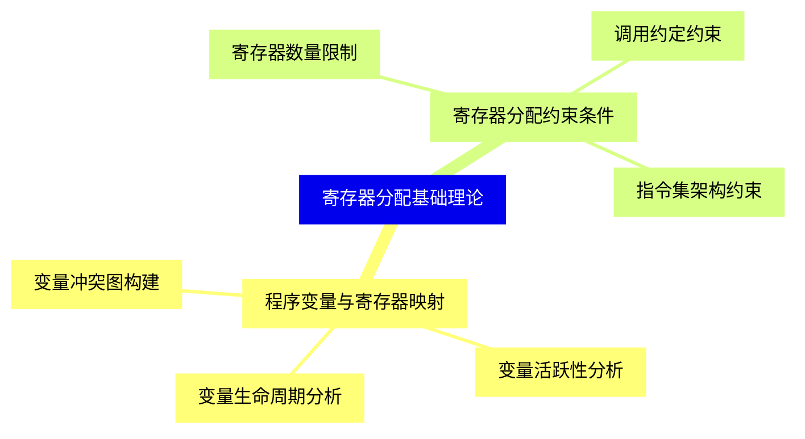
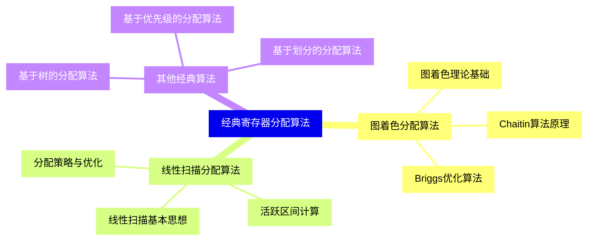
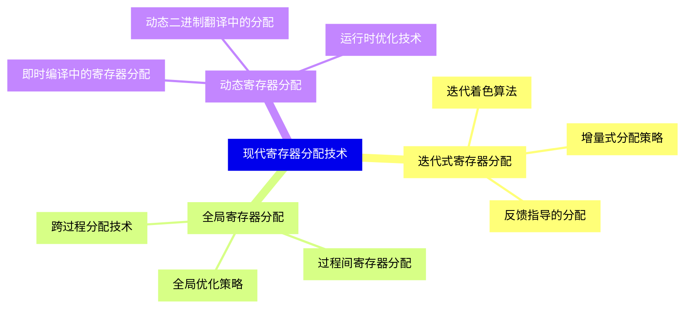
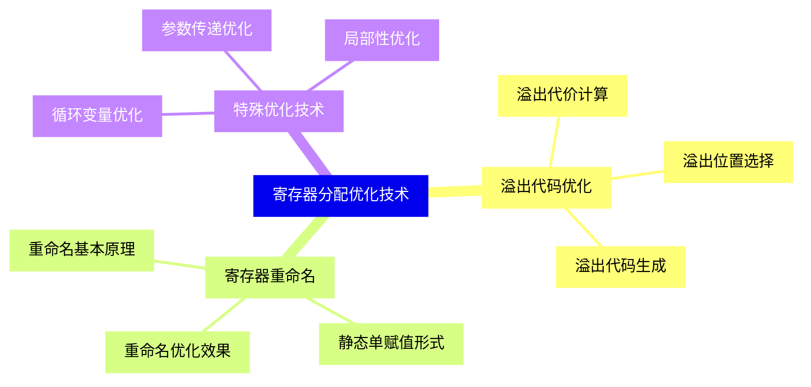
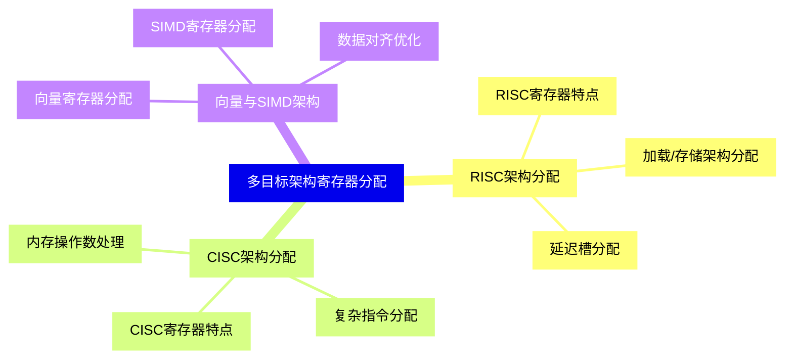
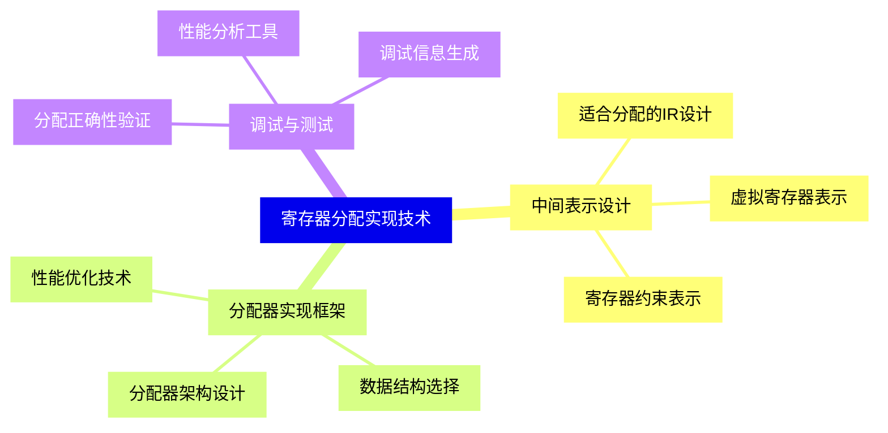
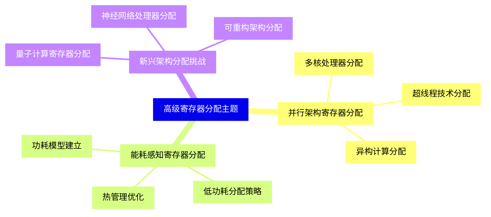
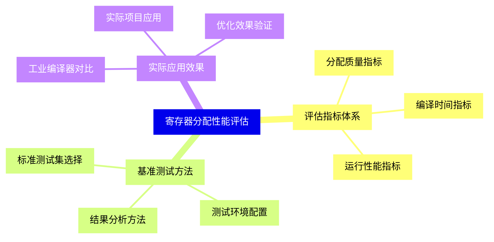


### 1 [寄存器分配概述](#1)
#### 1.1 [寄存器分配的基本概念](#1)
##### 1.1.1 [寄存器分配的定义与目标](#1)
##### 1.1.2 [寄存器分配在编译过程中的位置](#1)
##### 1.1.3 [寄存器分配的重要性与挑战](#1)
#### 1.2 [寄存器架构基础](#1)
##### 1.2.1 [通用寄存器与专用寄存器](#1)
##### 1.2.2 [寄存器文件组织](#1)
##### 1.2.3 [寄存器寻址方式](#1)
### 2 [寄存器分配基础理论](#2)
#### 2.1 [程序变量与寄存器映射](#2)
##### 2.1.1 [变量生命周期分析](#2)
##### 2.1.2 [变量活跃性分析](#2)
##### 2.1.3 [变量冲突图构建](#2)
#### 2.2 [寄存器分配约束条件](#2)
##### 2.2.1 [寄存器数量限制](#2)
##### 2.2.2 [调用约定约束](#2)
##### 2.2.3 [指令集架构约束](#2)
### 3 [经典寄存器分配算法](#3)
#### 3.1 [图着色分配算法](#3)
##### 3.1.1 [图着色理论基础](#3)
##### 3.1.2 [Chaitin算法原理](#3)
##### 3.1.3 [Briggs优化算法](#3)
#### 3.2 [线性扫描分配算法](#3)
##### 3.2.1 [线性扫描基本思想](#3)
##### 3.2.2 [活跃区间计算](#3)
##### 3.2.3 [分配策略与优化](#3)
#### 3.3 [其他经典算法](#3)
##### 3.3.1 [基于树的分配算法](#3)
##### 3.3.2 [基于优先级的分配算法](#3)
##### 3.3.3 [基于划分的分配算法](#3)
### 4 [现代寄存器分配技术](#4)
#### 4.1 [迭代式寄存器分配](#4)
##### 4.1.1 [迭代着色算法](#4)
##### 4.1.2 [增量式分配策略](#4)
##### 4.1.3 [反馈指导的分配](#4)
#### 4.2 [全局寄存器分配](#4)
##### 4.2.1 [跨过程分配技术](#4)
##### 4.2.2 [过程间寄存器分配](#4)
##### 4.2.3 [全局优化策略](#4)
#### 4.3 [动态寄存器分配](#4)
##### 4.3.1 [即时编译中的寄存器分配](#4)
##### 4.3.2 [动态二进制翻译中的分配](#4)
##### 4.3.3 [运行时优化技术](#4)
### 5 [寄存器分配优化技术](#5)
#### 5.1 [溢出代码优化](#5)
##### 5.1.1 [溢出代价计算](#5)
##### 5.1.2 [溢出位置选择](#5)
##### 5.1.3 [溢出代码生成](#5)
#### 5.2 [寄存器重命名](#5)
##### 5.2.1 [重命名基本原理](#5)
##### 5.2.2 [静态单赋值形式](#5)
##### 5.2.3 [重命名优化效果](#5)
#### 5.3 [特殊优化技术](#5)
##### 5.3.1 [循环变量优化](#5)
##### 5.3.2 [参数传递优化](#5)
##### 5.3.3 [局部性优化](#5)
### 6 [多目标架构寄存器分配](#6)
#### 6.1 [RISC架构分配](#6)
##### 6.1.1 [RISC寄存器特点](#6)
##### 6.1.2 [加载/存储架构分配](#6)
##### 6.1.3 [延迟槽分配](#6)
#### 6.2 [CISC架构分配](#6)
##### 6.2.1 [CISC寄存器特点](#6)
##### 6.2.2 [复杂指令分配](#6)
##### 6.2.3 [内存操作数处理](#6)
#### 6.3 [向量与SIMD架构](#6)
##### 6.3.1 [向量寄存器分配](#6)
##### 6.3.2 [SIMD寄存器分配](#6)
##### 6.3.3 [数据对齐优化](#6)
### 7 [寄存器分配实现技术](#7)
#### 7.1 [中间表示设计](#7)
##### 7.1.1 [适合分配的IR设计](#7)
##### 7.1.2 [虚拟寄存器表示](#7)
##### 7.1.3 [寄存器约束表示](#7)
#### 7.2 [分配器实现框架](#7)
##### 7.2.1 [分配器架构设计](#7)
##### 7.2.2 [数据结构选择](#7)
##### 7.2.3 [性能优化技术](#7)
#### 7.3 [调试与测试](#7)
##### 7.3.1 [分配正确性验证](#7)
##### 7.3.2 [性能分析工具](#7)
##### 7.3.3 [调试信息生成](#7)
### 8 [高级寄存器分配主题](#8)
#### 8.1 [并行架构寄存器分配](#8)
##### 8.1.1 [多核处理器分配](#8)
##### 8.1.2 [超线程技术分配](#8)
##### 8.1.3 [异构计算分配](#8)
#### 8.2 [能耗感知寄存器分配](#8)
##### 8.2.1 [功耗模型建立](#8)
##### 8.2.2 [低功耗分配策略](#8)
##### 8.2.3 [热管理优化](#8)
#### 8.3 [新兴架构分配挑战](#8)
##### 8.3.1 [量子计算寄存器分配](#8)
##### 8.3.2 [神经网络处理器分配](#8)
##### 8.3.3 [可重构架构分配](#8)
### 9 [寄存器分配性能评估](#9)
#### 9.1 [评估指标体系](#9)
##### 9.1.1 [分配质量指标](#9)
##### 9.1.2 [编译时间指标](#9)
##### 9.1.3 [运行性能指标](#9)
#### 9.2 [基准测试方法](#9)
##### 9.2.1 [标准测试集选择](#9)
##### 9.2.2 [测试环境配置](#9)
##### 9.2.3 [结果分析方法](#9)
#### 9.3 [实际应用效果](#9)
##### 9.3.1 [工业编译器对比](#9)
##### 9.3.2 [实际项目应用](#9)
##### 9.3.3 [优化效果验证](#9)




### 1 寄存器分配概述

---
### 1 寄存器分配概述
___
#### 1.1 寄存器分配的基本概念
___
##### 1.1.1 寄存器分配的定义与目标
___
##### 1.1.2 寄存器分配在编译过程中的位置
___
##### 1.1.3 寄存器分配的重要性与挑战
___
#### 1.2 寄存器架构基础
___
##### 1.2.1 通用寄存器与专用寄存器
___
##### 1.2.2 寄存器文件组织
___
##### 1.2.3 寄存器寻址方式
### 2 寄存器分配基础理论

---
### 2 寄存器分配基础理论
___
#### 2.1 程序变量与寄存器映射
___
##### 2.1.1 变量生命周期分析
___
##### 2.1.2 变量活跃性分析
___
##### 2.1.3 变量冲突图构建
___
#### 2.2 寄存器分配约束条件
___
##### 2.2.1 寄存器数量限制
___
##### 2.2.2 调用约定约束
___
##### 2.2.3 指令集架构约束
### 3 经典寄存器分配算法

---
### 3 经典寄存器分配算法
___
#### 3.1 图着色分配算法
___
##### 3.1.1 图着色理论基础
___
##### 3.1.2 Chaitin算法原理
___
##### 3.1.3 Briggs优化算法
___
#### 3.2 线性扫描分配算法
___
##### 3.2.1 线性扫描基本思想
___
##### 3.2.2 活跃区间计算
___
##### 3.2.3 分配策略与优化
___
#### 3.3 其他经典算法
___
##### 3.3.1 基于树的分配算法
___
##### 3.3.2 基于优先级的分配算法
___
##### 3.3.3 基于划分的分配算法
### 4 现代寄存器分配技术

---
### 4 现代寄存器分配技术
___
#### 4.1 迭代式寄存器分配
___
##### 4.1.1 迭代着色算法
___
##### 4.1.2 增量式分配策略
___
##### 4.1.3 反馈指导的分配
___
#### 4.2 全局寄存器分配
___
##### 4.2.1 跨过程分配技术
___
##### 4.2.2 过程间寄存器分配
___
##### 4.2.3 全局优化策略
___
#### 4.3 动态寄存器分配
___
##### 4.3.1 即时编译中的寄存器分配
___
##### 4.3.2 动态二进制翻译中的分配
___
##### 4.3.3 运行时优化技术
### 5 寄存器分配优化技术

---
### 5 寄存器分配优化技术
___
#### 5.1 溢出代码优化
___
##### 5.1.1 溢出代价计算
___
##### 5.1.2 溢出位置选择
___
##### 5.1.3 溢出代码生成
___
#### 5.2 寄存器重命名
___
##### 5.2.1 重命名基本原理
___
##### 5.2.2 静态单赋值形式
___
##### 5.2.3 重命名优化效果
___
#### 5.3 特殊优化技术
___
##### 5.3.1 循环变量优化
___
##### 5.3.2 参数传递优化
___
##### 5.3.3 局部性优化
### 6 多目标架构寄存器分配

---
### 6 多目标架构寄存器分配
___
#### 6.1 RISC架构分配
___
##### 6.1.1 RISC寄存器特点
___
##### 6.1.2 加载/存储架构分配
___
##### 6.1.3 延迟槽分配
___
#### 6.2 CISC架构分配
___
##### 6.2.1 CISC寄存器特点
___
##### 6.2.2 复杂指令分配
___
##### 6.2.3 内存操作数处理
___
#### 6.3 向量与SIMD架构
___
##### 6.3.1 向量寄存器分配
___
##### 6.3.2 SIMD寄存器分配
___
##### 6.3.3 数据对齐优化
### 7 寄存器分配实现技术

---
### 7 寄存器分配实现技术
___
#### 7.1 中间表示设计
___
##### 7.1.1 适合分配的IR设计
___
##### 7.1.2 虚拟寄存器表示
___
##### 7.1.3 寄存器约束表示
___
#### 7.2 分配器实现框架
___
##### 7.2.1 分配器架构设计
___
##### 7.2.2 数据结构选择
___
##### 7.2.3 性能优化技术
___
#### 7.3 调试与测试
___
##### 7.3.1 分配正确性验证
___
##### 7.3.2 性能分析工具
___
##### 7.3.3 调试信息生成
### 8 高级寄存器分配主题

---
### 8 高级寄存器分配主题
___
#### 8.1 并行架构寄存器分配
___
##### 8.1.1 多核处理器分配
___
##### 8.1.2 超线程技术分配
___
##### 8.1.3 异构计算分配
___
#### 8.2 能耗感知寄存器分配
___
##### 8.2.1 功耗模型建立
___
##### 8.2.2 低功耗分配策略
___
##### 8.2.3 热管理优化
___
#### 8.3 新兴架构分配挑战
___
##### 8.3.1 量子计算寄存器分配
___
##### 8.3.2 神经网络处理器分配
___
##### 8.3.3 可重构架构分配
### 9 寄存器分配性能评估

---
### 9 寄存器分配性能评估
___
#### 9.1 评估指标体系
___
##### 9.1.1 分配质量指标
___
##### 9.1.2 编译时间指标
___
##### 9.1.3 运行性能指标
___
#### 9.2 基准测试方法
___
##### 9.2.1 标准测试集选择
___
##### 9.2.2 测试环境配置
___
##### 9.2.3 结果分析方法
___
#### 9.3 实际应用效果
___
##### 9.3.1 工业编译器对比
___
##### 9.3.2 实际项目应用
___
##### 9.3.3 优化效果验证


### 1 寄存器分配概述{#1}

{}

<--->
{}
{}
{}
{}
{}
{}
{}
{}
{}
{}
{}
{}
{}
{}
{}
{}
{}

### 2 寄存器分配基础理论{#2}

{}
{}
{}
{}
{}
{}
{}
{}
{}
{}
{}
{}
{}
{}
{}
{}
{}
<--->

{}

### 3 经典寄存器分配算法{#3}

{}

<--->
{}
{}
{}
{}
{}
{}
{}
{}
{}
{}
{}
{}
{}
{}
{}
{}
{}
{}
{}
{}
{}
{}
{}
{}
{}

### 4 现代寄存器分配技术{#4}

{}
{}
{}
{}
{}
{}
{}
{}
{}
{}
{}
{}
{}
{}
{}
{}
{}
{}
{}
{}
{}
{}
{}
{}
{}
<--->

{}

### 5 寄存器分配优化技术{#5}

{}

<--->
{}
{}
{}
{}
{}
{}
{}
{}
{}
{}
{}
{}
{}
{}
{}
{}
{}
{}
{}
{}
{}
{}
{}
{}
{}

### 6 多目标架构寄存器分配{#6}

{}
{}
{}
{}
{}
{}
{}
{}
{}
{}
{}
{}
{}
{}
{}
{}
{}
{}
{}
{}
{}
{}
{}
{}
{}
<--->

{}

### 7 寄存器分配实现技术{#7}

{}

<--->
{}
{}
{}
{}
{}
{}
{}
{}
{}
{}
{}
{}
{}
{}
{}
{}
{}
{}
{}
{}
{}
{}
{}
{}
{}

### 8 高级寄存器分配主题{#8}

{}
{}
{}
{}
{}
{}
{}
{}
{}
{}
{}
{}
{}
{}
{}
{}
{}
{}
{}
{}
{}
{}
{}
{}
{}
<--->

{}

### 9 寄存器分配性能评估{#9}

{}

<--->
{}
{}
{}
{}
{}
{}
{}
{}
{}
{}
{}
{}
{}
{}
{}
{}
{}
{}
{}
{}
{}
{}
{}
{}
{}
