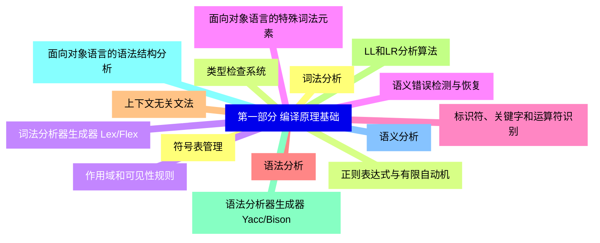
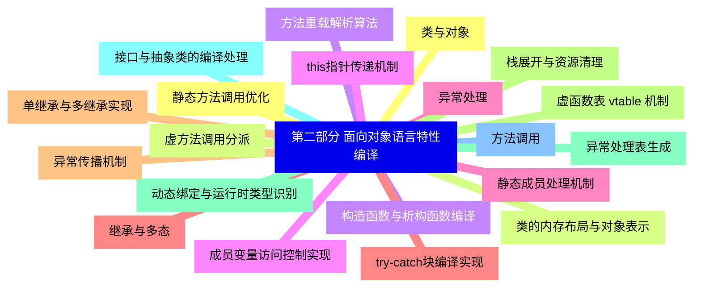
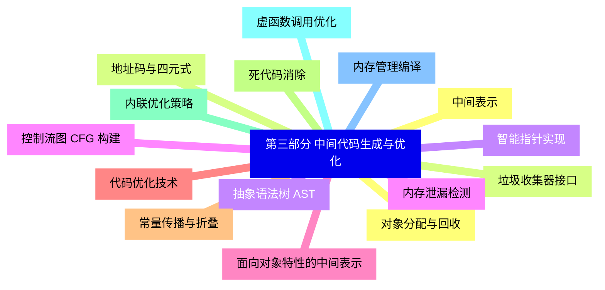
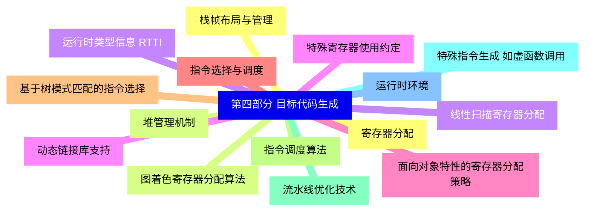
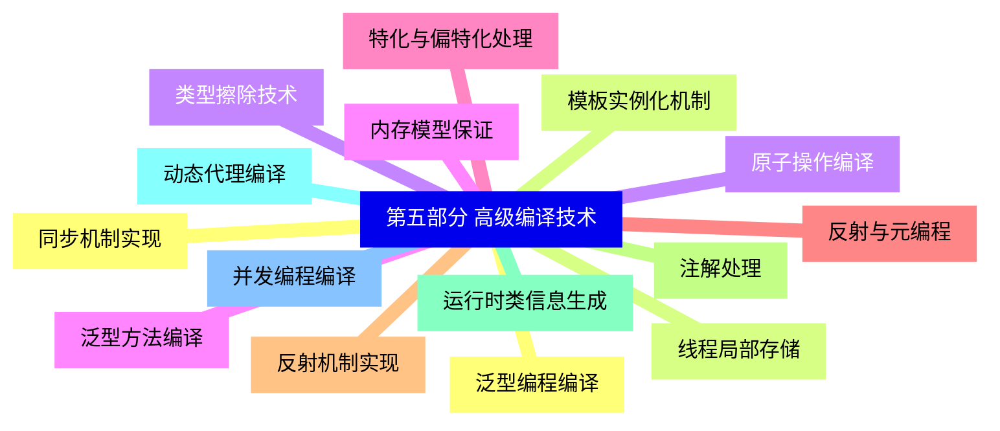
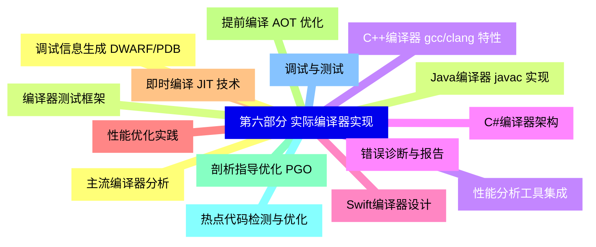


### 1 [第一部分 编译原理基础](#1)
#### 1.1 [词法分析](#1)
#### 1.2 [正则表达式与有限自动机](#1)
#### 1.3 [词法分析器生成器 Lex/Flex](#1)
#### 1.4 [面向对象语言的特殊词法元素](#1)
#### 1.5 [标识符、关键字和运算符识别](#1)
#### 1.6 [语法分析](#1)
#### 1.7 [上下文无关文法](#1)
#### 1.8 [LL和LR分析算法](#1)
#### 1.9 [语法分析器生成器 Yacc/Bison](#1)
#### 1.10 [面向对象语言的语法结构分析](#1)
#### 1.11 [语义分析](#1)
#### 1.12 [符号表管理](#1)
#### 1.13 [类型检查系统](#1)
#### 1.14 [作用域和可见性规则](#1)
#### 1.15 [语义错误检测与恢复](#1)
### 2 [第二部分 面向对象语言特性编译](#2)
#### 2.1 [类与对象](#2)
#### 2.2 [类的内存布局与对象表示](#2)
#### 2.3 [构造函数与析构函数编译](#2)
#### 2.4 [成员变量访问控制实现](#2)
#### 2.5 [静态成员处理机制](#2)
#### 2.6 [继承与多态](#2)
#### 2.7 [单继承与多继承实现](#2)
#### 2.8 [虚函数表 vtable 机制](#2)
#### 2.9 [动态绑定与运行时类型识别](#2)
#### 2.10 [接口与抽象类的编译处理](#2)
#### 2.11 [方法调用](#2)
#### 2.12 [静态方法调用优化](#2)
#### 2.13 [虚方法调用分派](#2)
#### 2.14 [方法重载解析算法](#2)
#### 2.15 [this指针传递机制](#2)
#### 2.16 [异常处理](#2)
#### 2.17 [try-catch块编译实现](#2)
#### 2.18 [异常传播机制](#2)
#### 2.19 [栈展开与资源清理](#2)
#### 2.20 [异常处理表生成](#2)
### 3 [第三部分 中间代码生成与优化](#3)
#### 3.1 [中间表示](#3)
#### 3.2 [地址码与四元式](#3)
#### 3.3 [抽象语法树 AST](#3)
#### 3.4 [控制流图 CFG 构建](#3)
#### 3.5 [面向对象特性的中间表示](#3)
#### 3.6 [代码优化技术](#3)
#### 3.7 [常量传播与折叠](#3)
#### 3.8 [死代码消除](#3)
#### 3.9 [内联优化策略](#3)
#### 3.10 [虚函数调用优化](#3)
#### 3.11 [内存管理编译](#3)
#### 3.12 [对象分配与回收](#3)
#### 3.13 [垃圾收集器接口](#3)
#### 3.14 [智能指针实现](#3)
#### 3.15 [内存泄漏检测](#3)
### 4 [第四部分 目标代码生成](#4)
#### 4.1 [寄存器分配](#4)
#### 4.2 [图着色寄存器分配算法](#4)
#### 4.3 [线性扫描寄存器分配](#4)
#### 4.4 [特殊寄存器使用约定](#4)
#### 4.5 [面向对象特性的寄存器分配策略](#4)
#### 4.6 [指令选择与调度](#4)
#### 4.7 [基于树模式匹配的指令选择](#4)
#### 4.8 [指令调度算法](#4)
#### 4.9 [流水线优化技术](#4)
#### 4.10 [特殊指令生成 如虚函数调用](#4)
#### 4.11 [运行时环境](#4)
#### 4.12 [栈帧布局与管理](#4)
#### 4.13 [堆管理机制](#4)
#### 4.14 [运行时类型信息 RTTI](#4)
#### 4.15 [动态链接库支持](#4)
### 5 [第五部分 高级编译技术](#5)
#### 5.1 [泛型编程编译](#5)
#### 5.2 [模板实例化机制](#5)
#### 5.3 [类型擦除技术](#5)
#### 5.4 [泛型方法编译](#5)
#### 5.5 [特化与偏特化处理](#5)
#### 5.6 [反射与元编程](#5)
#### 5.7 [反射机制实现](#5)
#### 5.8 [注解处理](#5)
#### 5.9 [运行时类信息生成](#5)
#### 5.10 [动态代理编译](#5)
#### 5.11 [并发编程编译](#5)
#### 5.12 [同步机制实现](#5)
#### 5.13 [线程局部存储](#5)
#### 5.14 [原子操作编译](#5)
#### 5.15 [内存模型保证](#5)
### 6 [第六部分 实际编译器实现](#6)
#### 6.1 [主流编译器分析](#6)
#### 6.2 [Java编译器 javac 实现](#6)
#### 6.3 [C++编译器 gcc/clang 特性](#6)
#### 6.4 [C#编译器架构](#6)
#### 6.5 [Swift编译器设计](#6)
#### 6.6 [性能优化实践](#6)
#### 6.7 [即时编译 JIT 技术](#6)
#### 6.8 [提前编译 AOT 优化](#6)
#### 6.9 [剖析指导优化 PGO](#6)
#### 6.10 [热点代码检测与优化](#6)
#### 6.11 [调试与测试](#6)
#### 6.12 [调试信息生成 DWARF/PDB](#6)
#### 6.13 [编译器测试框架](#6)
#### 6.14 [性能分析工具集成](#6)
#### 6.15 [错误诊断与报告](#6)




### 1 第一部分 编译原理基础

---
### 1 第一部分 编译原理基础
___
#### 1.1 词法分析
___
#### 1.2 正则表达式与有限自动机
___
#### 1.3 词法分析器生成器 Lex/Flex
___
#### 1.4 面向对象语言的特殊词法元素
___
#### 1.5 标识符、关键字和运算符识别
___
#### 1.6 语法分析
___
#### 1.7 上下文无关文法
___
#### 1.8 LL和LR分析算法
___
#### 1.9 语法分析器生成器 Yacc/Bison
___
#### 1.10 面向对象语言的语法结构分析
___
#### 1.11 语义分析
___
#### 1.12 符号表管理
___
#### 1.13 类型检查系统
___
#### 1.14 作用域和可见性规则
___
#### 1.15 语义错误检测与恢复
### 2 第二部分 面向对象语言特性编译

---
### 2 第二部分 面向对象语言特性编译
___
#### 2.1 类与对象
___
#### 2.2 类的内存布局与对象表示
___
#### 2.3 构造函数与析构函数编译
___
#### 2.4 成员变量访问控制实现
___
#### 2.5 静态成员处理机制
___
#### 2.6 继承与多态
___
#### 2.7 单继承与多继承实现
___
#### 2.8 虚函数表 vtable 机制
___
#### 2.9 动态绑定与运行时类型识别
___
#### 2.10 接口与抽象类的编译处理
___
#### 2.11 方法调用
___
#### 2.12 静态方法调用优化
___
#### 2.13 虚方法调用分派
___
#### 2.14 方法重载解析算法
___
#### 2.15 this指针传递机制
___
#### 2.16 异常处理
___
#### 2.17 try-catch块编译实现
___
#### 2.18 异常传播机制
___
#### 2.19 栈展开与资源清理
___
#### 2.20 异常处理表生成
### 3 第三部分 中间代码生成与优化

---
### 3 第三部分 中间代码生成与优化
___
#### 3.1 中间表示
___
#### 3.2 地址码与四元式
___
#### 3.3 抽象语法树 AST
___
#### 3.4 控制流图 CFG 构建
___
#### 3.5 面向对象特性的中间表示
___
#### 3.6 代码优化技术
___
#### 3.7 常量传播与折叠
___
#### 3.8 死代码消除
___
#### 3.9 内联优化策略
___
#### 3.10 虚函数调用优化
___
#### 3.11 内存管理编译
___
#### 3.12 对象分配与回收
___
#### 3.13 垃圾收集器接口
___
#### 3.14 智能指针实现
___
#### 3.15 内存泄漏检测
### 4 第四部分 目标代码生成

---
### 4 第四部分 目标代码生成
___
#### 4.1 寄存器分配
___
#### 4.2 图着色寄存器分配算法
___
#### 4.3 线性扫描寄存器分配
___
#### 4.4 特殊寄存器使用约定
___
#### 4.5 面向对象特性的寄存器分配策略
___
#### 4.6 指令选择与调度
___
#### 4.7 基于树模式匹配的指令选择
___
#### 4.8 指令调度算法
___
#### 4.9 流水线优化技术
___
#### 4.10 特殊指令生成 如虚函数调用
___
#### 4.11 运行时环境
___
#### 4.12 栈帧布局与管理
___
#### 4.13 堆管理机制
___
#### 4.14 运行时类型信息 RTTI
___
#### 4.15 动态链接库支持
### 5 第五部分 高级编译技术

---
### 5 第五部分 高级编译技术
___
#### 5.1 泛型编程编译
___
#### 5.2 模板实例化机制
___
#### 5.3 类型擦除技术
___
#### 5.4 泛型方法编译
___
#### 5.5 特化与偏特化处理
___
#### 5.6 反射与元编程
___
#### 5.7 反射机制实现
___
#### 5.8 注解处理
___
#### 5.9 运行时类信息生成
___
#### 5.10 动态代理编译
___
#### 5.11 并发编程编译
___
#### 5.12 同步机制实现
___
#### 5.13 线程局部存储
___
#### 5.14 原子操作编译
___
#### 5.15 内存模型保证
### 6 第六部分 实际编译器实现

---
### 6 第六部分 实际编译器实现
___
#### 6.1 主流编译器分析
___
#### 6.2 Java编译器 javac 实现
___
#### 6.3 C++编译器 gcc/clang 特性
___
#### 6.4 C#编译器架构
___
#### 6.5 Swift编译器设计
___
#### 6.6 性能优化实践
___
#### 6.7 即时编译 JIT 技术
___
#### 6.8 提前编译 AOT 优化
___
#### 6.9 剖析指导优化 PGO
___
#### 6.10 热点代码检测与优化
___
#### 6.11 调试与测试
___
#### 6.12 调试信息生成 DWARF/PDB
___
#### 6.13 编译器测试框架
___
#### 6.14 性能分析工具集成
___
#### 6.15 错误诊断与报告


### 1 第一部分 编译原理基础{#1}

{}

<--->
{}
{}
{}
{}
{}
{}
{}
{}
{}
{}
{}
{}
{}
{}
{}
{}
{}
{}
{}
{}
{}
{}
{}
{}
{}
{}
{}
{}
{}
{}
{}

### 2 第二部分 面向对象语言特性编译{#2}

{}
{}
{}
{}
{}
{}
{}
{}
{}
{}
{}
{}
{}
{}
{}
{}
{}
{}
{}
{}
{}
{}
{}
{}
{}
{}
{}
{}
{}
{}
{}
{}
{}
{}
{}
{}
{}
{}
{}
{}
{}
<--->

{}

### 3 第三部分 中间代码生成与优化{#3}

{}

<--->
{}
{}
{}
{}
{}
{}
{}
{}
{}
{}
{}
{}
{}
{}
{}
{}
{}
{}
{}
{}
{}
{}
{}
{}
{}
{}
{}
{}
{}
{}
{}

### 4 第四部分 目标代码生成{#4}

{}
{}
{}
{}
{}
{}
{}
{}
{}
{}
{}
{}
{}
{}
{}
{}
{}
{}
{}
{}
{}
{}
{}
{}
{}
{}
{}
{}
{}
{}
{}
<--->

{}

### 5 第五部分 高级编译技术{#5}

{}

<--->
{}
{}
{}
{}
{}
{}
{}
{}
{}
{}
{}
{}
{}
{}
{}
{}
{}
{}
{}
{}
{}
{}
{}
{}
{}
{}
{}
{}
{}
{}
{}

### 6 第六部分 实际编译器实现{#6}

{}
{}
{}
{}
{}
{}
{}
{}
{}
{}
{}
{}
{}
{}
{}
{}
{}
{}
{}
{}
{}
{}
{}
{}
{}
{}
{}
{}
{}
{}
{}
<--->

{}
