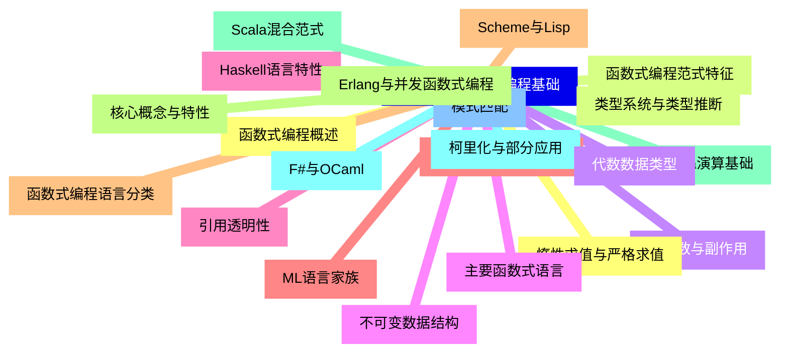
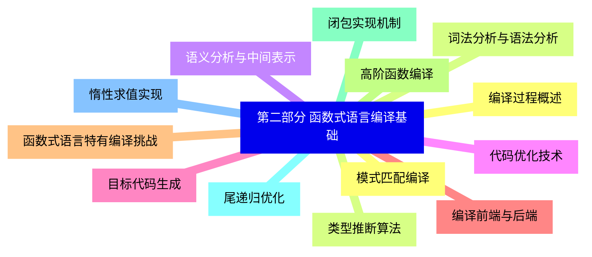
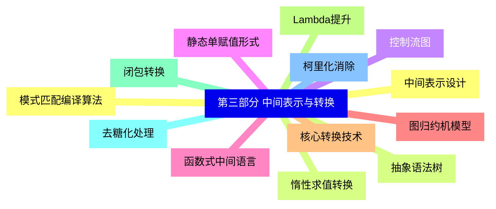
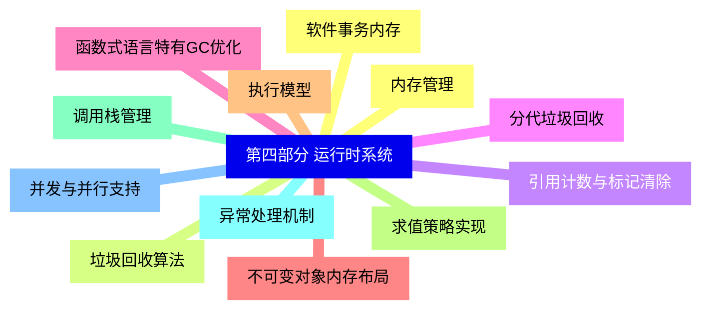
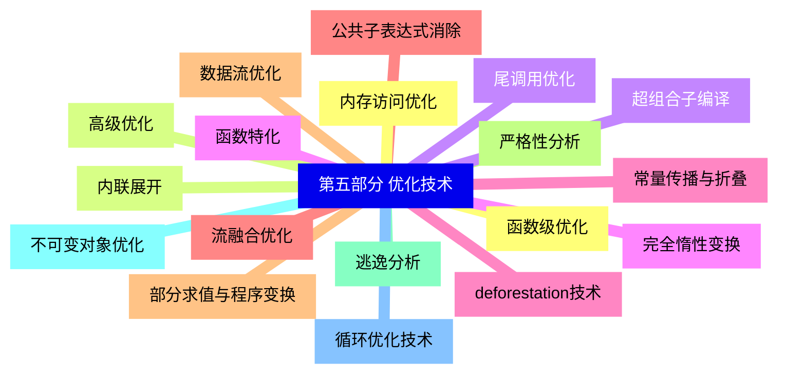
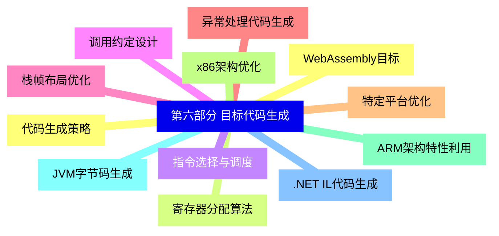
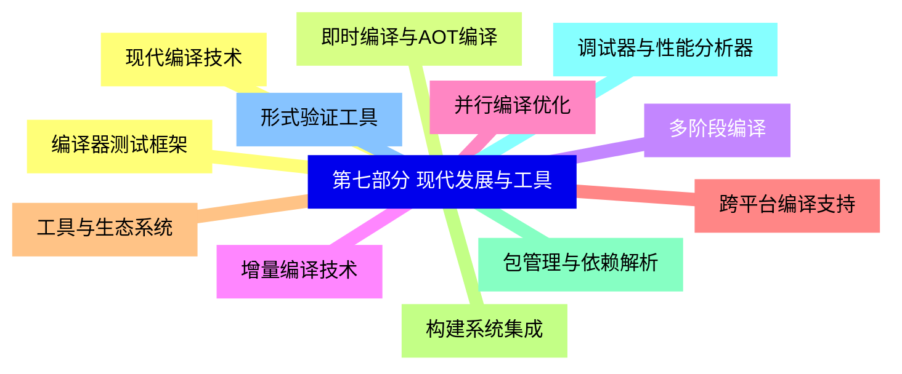
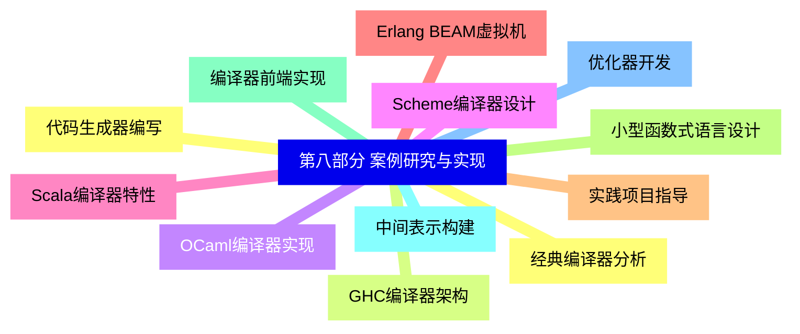


### 1 [第一部分 函数式编程基础](#1)
#### 1.1 [函数式编程概述](#1)
#### 1.2 [函数式编程范式特征](#1)
#### 1.3 [纯函数与副作用](#1)
#### 1.4 [不可变数据结构](#1)
#### 1.5 [引用透明性](#1)
#### 1.6 [高阶函数与函数组合](#1)
#### 1.7 [函数式编程语言分类](#1)
#### 1.8 [核心概念与特性](#1)
#### 1.9 [Lambda演算基础](#1)
#### 1.10 [柯里化与部分应用](#1)
#### 1.11 [模式匹配](#1)
#### 1.12 [惰性求值与严格求值](#1)
#### 1.13 [类型系统与类型推断](#1)
#### 1.14 [代数数据类型](#1)
#### 1.15 [主要函数式语言](#1)
#### 1.16 [Haskell语言特性](#1)
#### 1.17 [ML语言家族](#1)
#### 1.18 [Scheme与Lisp](#1)
#### 1.19 [Erlang与并发函数式编程](#1)
#### 1.20 [Scala混合范式](#1)
#### 1.21 [F#与OCaml](#1)
### 2 [第二部分 函数式语言编译基础](#2)
#### 2.1 [编译过程概述](#2)
#### 2.2 [词法分析与语法分析](#2)
#### 2.3 [语义分析与中间表示](#2)
#### 2.4 [代码优化技术](#2)
#### 2.5 [目标代码生成](#2)
#### 2.6 [编译前端与后端](#2)
#### 2.7 [函数式语言特有编译挑战](#2)
#### 2.8 [高阶函数编译](#2)
#### 2.9 [闭包实现机制](#2)
#### 2.10 [尾递归优化](#2)
#### 2.11 [惰性求值实现](#2)
#### 2.12 [模式匹配编译](#2)
#### 2.13 [类型推断算法](#2)
### 3 [第三部分 中间表示与转换](#3)
#### 3.1 [中间表示设计](#3)
#### 3.2 [抽象语法树](#3)
#### 3.3 [控制流图](#3)
#### 3.4 [静态单赋值形式](#3)
#### 3.5 [函数式中间语言](#3)
#### 3.6 [图归约机模型](#3)
#### 3.7 [核心转换技术](#3)
#### 3.8 [Lambda提升](#3)
#### 3.9 [闭包转换](#3)
#### 3.10 [去糖化处理](#3)
#### 3.11 [柯里化消除](#3)
#### 3.12 [模式匹配编译算法](#3)
#### 3.13 [惰性求值转换](#3)
### 4 [第四部分 运行时系统](#4)
#### 4.1 [内存管理](#4)
#### 4.2 [垃圾回收算法](#4)
#### 4.3 [引用计数与标记清除](#4)
#### 4.4 [分代垃圾回收](#4)
#### 4.5 [函数式语言特有GC优化](#4)
#### 4.6 [不可变对象内存布局](#4)
#### 4.7 [执行模型](#4)
#### 4.8 [求值策略实现](#4)
#### 4.9 [调用栈管理](#4)
#### 4.10 [异常处理机制](#4)
#### 4.11 [并发与并行支持](#4)
#### 4.12 [软件事务内存](#4)
### 5 [第五部分 优化技术](#5)
#### 5.1 [函数级优化](#5)
#### 5.2 [内联展开](#5)
#### 5.3 [尾调用优化](#5)
#### 5.4 [函数特化](#5)
#### 5.5 [常量传播与折叠](#5)
#### 5.6 [公共子表达式消除](#5)
#### 5.7 [数据流优化](#5)
#### 5.8 [严格性分析](#5)
#### 5.9 [逃逸分析](#5)
#### 5.10 [不可变对象优化](#5)
#### 5.11 [循环优化技术](#5)
#### 5.12 [内存访问优化](#5)
#### 5.13 [高级优化](#5)
#### 5.14 [超组合子编译](#5)
#### 5.15 [完全惰性变换](#5)
#### 5.16 [deforestation技术](#5)
#### 5.17 [流融合优化](#5)
#### 5.18 [部分求值与程序变换](#5)
### 6 [第六部分 目标代码生成](#6)
#### 6.1 [代码生成策略](#6)
#### 6.2 [寄存器分配算法](#6)
#### 6.3 [指令选择与调度](#6)
#### 6.4 [调用约定设计](#6)
#### 6.5 [栈帧布局优化](#6)
#### 6.6 [异常处理代码生成](#6)
#### 6.7 [特定平台优化](#6)
#### 6.8 [x86架构优化](#6)
#### 6.9 [ARM架构特性利用](#6)
#### 6.10 [JVM字节码生成](#6)
#### 6.11 [.NET IL代码生成](#6)
#### 6.12 [WebAssembly目标](#6)
### 7 [第七部分 现代发展与工具](#7)
#### 7.1 [现代编译技术](#7)
#### 7.2 [即时编译与AOT编译](#7)
#### 7.3 [多阶段编译](#7)
#### 7.4 [增量编译技术](#7)
#### 7.5 [并行编译优化](#7)
#### 7.6 [跨平台编译支持](#7)
#### 7.7 [工具与生态系统](#7)
#### 7.8 [构建系统集成](#7)
#### 7.9 [包管理与依赖解析](#7)
#### 7.10 [调试器与性能分析器](#7)
#### 7.11 [形式验证工具](#7)
#### 7.12 [编译器测试框架](#7)
### 8 [第八部分 案例研究与实现](#8)
#### 8.1 [经典编译器分析](#8)
#### 8.2 [GHC编译器架构](#8)
#### 8.3 [OCaml编译器实现](#8)
#### 8.4 [Scheme编译器设计](#8)
#### 8.5 [Scala编译器特性](#8)
#### 8.6 [Erlang BEAM虚拟机](#8)
#### 8.7 [实践项目指导](#8)
#### 8.8 [小型函数式语言设计](#8)
#### 8.9 [编译器前端实现](#8)
#### 8.10 [中间表示构建](#8)
#### 8.11 [优化器开发](#8)
#### 8.12 [代码生成器编写](#8)




### 1 第一部分 函数式编程基础

---
### 1 第一部分 函数式编程基础
___
#### 1.1 函数式编程概述
___
#### 1.2 函数式编程范式特征
___
#### 1.3 纯函数与副作用
___
#### 1.4 不可变数据结构
___
#### 1.5 引用透明性
___
#### 1.6 高阶函数与函数组合
___
#### 1.7 函数式编程语言分类
___
#### 1.8 核心概念与特性
___
#### 1.9 Lambda演算基础
___
#### 1.10 柯里化与部分应用
___
#### 1.11 模式匹配
___
#### 1.12 惰性求值与严格求值
___
#### 1.13 类型系统与类型推断
___
#### 1.14 代数数据类型
___
#### 1.15 主要函数式语言
___
#### 1.16 Haskell语言特性
___
#### 1.17 ML语言家族
___
#### 1.18 Scheme与Lisp
___
#### 1.19 Erlang与并发函数式编程
___
#### 1.20 Scala混合范式
___
#### 1.21 F#与OCaml
### 2 第二部分 函数式语言编译基础

---
### 2 第二部分 函数式语言编译基础
___
#### 2.1 编译过程概述
___
#### 2.2 词法分析与语法分析
___
#### 2.3 语义分析与中间表示
___
#### 2.4 代码优化技术
___
#### 2.5 目标代码生成
___
#### 2.6 编译前端与后端
___
#### 2.7 函数式语言特有编译挑战
___
#### 2.8 高阶函数编译
___
#### 2.9 闭包实现机制
___
#### 2.10 尾递归优化
___
#### 2.11 惰性求值实现
___
#### 2.12 模式匹配编译
___
#### 2.13 类型推断算法
### 3 第三部分 中间表示与转换

---
### 3 第三部分 中间表示与转换
___
#### 3.1 中间表示设计
___
#### 3.2 抽象语法树
___
#### 3.3 控制流图
___
#### 3.4 静态单赋值形式
___
#### 3.5 函数式中间语言
___
#### 3.6 图归约机模型
___
#### 3.7 核心转换技术
___
#### 3.8 Lambda提升
___
#### 3.9 闭包转换
___
#### 3.10 去糖化处理
___
#### 3.11 柯里化消除
___
#### 3.12 模式匹配编译算法
___
#### 3.13 惰性求值转换
### 4 第四部分 运行时系统

---
### 4 第四部分 运行时系统
___
#### 4.1 内存管理
___
#### 4.2 垃圾回收算法
___
#### 4.3 引用计数与标记清除
___
#### 4.4 分代垃圾回收
___
#### 4.5 函数式语言特有GC优化
___
#### 4.6 不可变对象内存布局
___
#### 4.7 执行模型
___
#### 4.8 求值策略实现
___
#### 4.9 调用栈管理
___
#### 4.10 异常处理机制
___
#### 4.11 并发与并行支持
___
#### 4.12 软件事务内存
### 5 第五部分 优化技术

---
### 5 第五部分 优化技术
___
#### 5.1 函数级优化
___
#### 5.2 内联展开
___
#### 5.3 尾调用优化
___
#### 5.4 函数特化
___
#### 5.5 常量传播与折叠
___
#### 5.6 公共子表达式消除
___
#### 5.7 数据流优化
___
#### 5.8 严格性分析
___
#### 5.9 逃逸分析
___
#### 5.10 不可变对象优化
___
#### 5.11 循环优化技术
___
#### 5.12 内存访问优化
___
#### 5.13 高级优化
___
#### 5.14 超组合子编译
___
#### 5.15 完全惰性变换
___
#### 5.16 deforestation技术
___
#### 5.17 流融合优化
___
#### 5.18 部分求值与程序变换
### 6 第六部分 目标代码生成

---
### 6 第六部分 目标代码生成
___
#### 6.1 代码生成策略
___
#### 6.2 寄存器分配算法
___
#### 6.3 指令选择与调度
___
#### 6.4 调用约定设计
___
#### 6.5 栈帧布局优化
___
#### 6.6 异常处理代码生成
___
#### 6.7 特定平台优化
___
#### 6.8 x86架构优化
___
#### 6.9 ARM架构特性利用
___
#### 6.10 JVM字节码生成
___
#### 6.11 .NET IL代码生成
___
#### 6.12 WebAssembly目标
### 7 第七部分 现代发展与工具

---
### 7 第七部分 现代发展与工具
___
#### 7.1 现代编译技术
___
#### 7.2 即时编译与AOT编译
___
#### 7.3 多阶段编译
___
#### 7.4 增量编译技术
___
#### 7.5 并行编译优化
___
#### 7.6 跨平台编译支持
___
#### 7.7 工具与生态系统
___
#### 7.8 构建系统集成
___
#### 7.9 包管理与依赖解析
___
#### 7.10 调试器与性能分析器
___
#### 7.11 形式验证工具
___
#### 7.12 编译器测试框架
### 8 第八部分 案例研究与实现

---
### 8 第八部分 案例研究与实现
___
#### 8.1 经典编译器分析
___
#### 8.2 GHC编译器架构
___
#### 8.3 OCaml编译器实现
___
#### 8.4 Scheme编译器设计
___
#### 8.5 Scala编译器特性
___
#### 8.6 Erlang BEAM虚拟机
___
#### 8.7 实践项目指导
___
#### 8.8 小型函数式语言设计
___
#### 8.9 编译器前端实现
___
#### 8.10 中间表示构建
___
#### 8.11 优化器开发
___
#### 8.12 代码生成器编写


### 1 第一部分 函数式编程基础{#1}

{}

<--->
{}
{}
{}
{}
{}
{}
{}
{}
{}
{}
{}
{}
{}
{}
{}
{}
{}
{}
{}
{}
{}
{}
{}
{}
{}
{}
{}
{}
{}
{}
{}
{}
{}
{}
{}
{}
{}
{}
{}
{}
{}
{}
{}

### 2 第二部分 函数式语言编译基础{#2}

{}
{}
{}
{}
{}
{}
{}
{}
{}
{}
{}
{}
{}
{}
{}
{}
{}
{}
{}
{}
{}
{}
{}
{}
{}
{}
{}
<--->

{}

### 3 第三部分 中间表示与转换{#3}

{}

<--->
{}
{}
{}
{}
{}
{}
{}
{}
{}
{}
{}
{}
{}
{}
{}
{}
{}
{}
{}
{}
{}
{}
{}
{}
{}
{}
{}

### 4 第四部分 运行时系统{#4}

{}
{}
{}
{}
{}
{}
{}
{}
{}
{}
{}
{}
{}
{}
{}
{}
{}
{}
{}
{}
{}
{}
{}
{}
{}
<--->

{}

### 5 第五部分 优化技术{#5}

{}

<--->
{}
{}
{}
{}
{}
{}
{}
{}
{}
{}
{}
{}
{}
{}
{}
{}
{}
{}
{}
{}
{}
{}
{}
{}
{}
{}
{}
{}
{}
{}
{}
{}
{}
{}
{}
{}
{}

### 6 第六部分 目标代码生成{#6}

{}
{}
{}
{}
{}
{}
{}
{}
{}
{}
{}
{}
{}
{}
{}
{}
{}
{}
{}
{}
{}
{}
{}
{}
{}
<--->

{}

### 7 第七部分 现代发展与工具{#7}

{}

<--->
{}
{}
{}
{}
{}
{}
{}
{}
{}
{}
{}
{}
{}
{}
{}
{}
{}
{}
{}
{}
{}
{}
{}
{}
{}

### 8 第八部分 案例研究与实现{#8}

{}
{}
{}
{}
{}
{}
{}
{}
{}
{}
{}
{}
{}
{}
{}
{}
{}
{}
{}
{}
{}
{}
{}
{}
{}
<--->

{}
