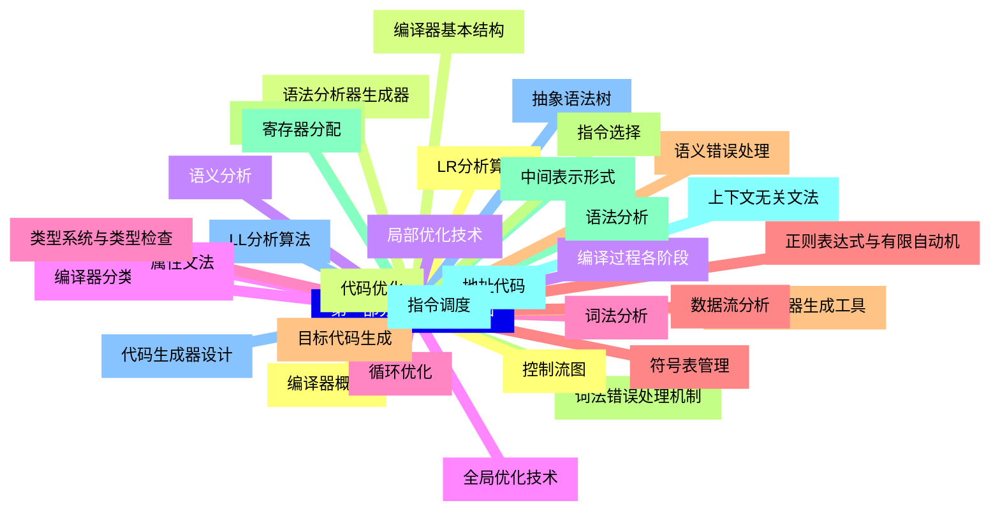
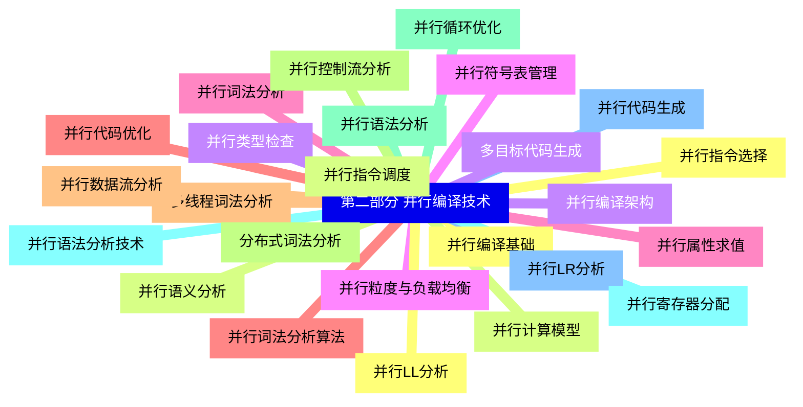
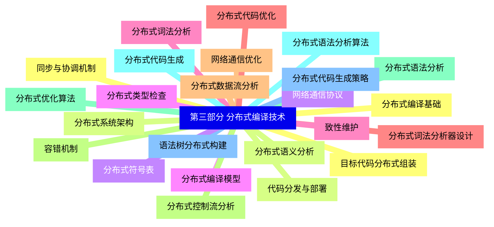
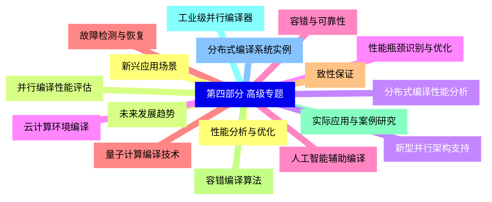


### 1 [第一部分 编译原理基础](#1)
#### 1.1 [编译器概述](#1)
#### 1.2 [编译器基本结构](#1)
#### 1.3 [编译过程各阶段](#1)
#### 1.4 [编译器分类与设计目标](#1)
#### 1.5 [词法分析](#1)
#### 1.6 [正则表达式与有限自动机](#1)
#### 1.7 [词法分析器生成工具](#1)
#### 1.8 [词法错误处理机制](#1)
#### 1.9 [语法分析](#1)
#### 1.10 [上下文无关文法](#1)
#### 1.11 [LL分析算法](#1)
#### 1.12 [LR分析算法](#1)
#### 1.13 [语法分析器生成器](#1)
#### 1.14 [语义分析](#1)
#### 1.15 [属性文法](#1)
#### 1.16 [类型系统与类型检查](#1)
#### 1.17 [符号表管理](#1)
#### 1.18 [语义错误处理](#1)
#### 1.19 [中间代码生成](#1)
#### 1.20 [中间表示形式](#1)
#### 1.21 [地址代码](#1)
#### 1.22 [抽象语法树](#1)
#### 1.23 [控制流图](#1)
#### 1.24 [代码优化](#1)
#### 1.25 [局部优化技术](#1)
#### 1.26 [全局优化技术](#1)
#### 1.27 [循环优化](#1)
#### 1.28 [数据流分析](#1)
#### 1.29 [目标代码生成](#1)
#### 1.30 [指令选择](#1)
#### 1.31 [寄存器分配](#1)
#### 1.32 [指令调度](#1)
#### 1.33 [代码生成器设计](#1)
### 2 [第二部分 并行编译技术](#2)
#### 2.1 [并行编译基础](#2)
#### 2.2 [并行计算模型](#2)
#### 2.3 [并行编译架构](#2)
#### 2.4 [并行粒度与负载均衡](#2)
#### 2.5 [并行词法分析](#2)
#### 2.6 [并行词法分析算法](#2)
#### 2.7 [多线程词法分析](#2)
#### 2.8 [分布式词法分析](#2)
#### 2.9 [并行语法分析](#2)
#### 2.10 [并行语法分析技术](#2)
#### 2.11 [并行LR分析](#2)
#### 2.12 [并行LL分析](#2)
#### 2.13 [并行语义分析](#2)
#### 2.14 [并行类型检查](#2)
#### 2.15 [并行符号表管理](#2)
#### 2.16 [并行属性求值](#2)
#### 2.17 [并行代码优化](#2)
#### 2.18 [并行数据流分析](#2)
#### 2.19 [并行控制流分析](#2)
#### 2.20 [并行循环优化](#2)
#### 2.21 [并行寄存器分配](#2)
#### 2.22 [并行代码生成](#2)
#### 2.23 [并行指令选择](#2)
#### 2.24 [并行指令调度](#2)
#### 2.25 [多目标代码生成](#2)
### 3 [第三部分 分布式编译技术](#3)
#### 3.1 [分布式编译基础](#3)
#### 3.2 [分布式系统架构](#3)
#### 3.3 [网络通信协议](#3)
#### 3.4 [分布式编译模型](#3)
#### 3.5 [分布式词法分析](#3)
#### 3.6 [分布式词法分析器设计](#3)
#### 3.7 [网络通信优化](#3)
#### 3.8 [容错机制](#3)
#### 3.9 [分布式语法分析](#3)
#### 3.10 [分布式语法分析算法](#3)
#### 3.11 [语法树分布式构建](#3)
#### 3.12 [同步与协调机制](#3)
#### 3.13 [分布式语义分析](#3)
#### 3.14 [分布式符号表](#3)
#### 3.15 [分布式类型检查](#3)
#### 3.16 [致性维护](#3)
#### 3.17 [分布式代码优化](#3)
#### 3.18 [分布式数据流分析](#3)
#### 3.19 [分布式控制流分析](#3)
#### 3.20 [分布式优化算法](#3)
#### 3.21 [分布式代码生成](#3)
#### 3.22 [分布式代码生成策略](#3)
#### 3.23 [目标代码分布式组装](#3)
#### 3.24 [代码分发与部署](#3)
### 4 [第四部分 高级专题](#4)
#### 4.1 [性能分析与优化](#4)
#### 4.2 [并行编译性能评估](#4)
#### 4.3 [分布式编译性能分析](#4)
#### 4.4 [性能瓶颈识别与优化](#4)
#### 4.5 [容错与可靠性](#4)
#### 4.6 [故障检测与恢复](#4)
#### 4.7 [致性保证](#4)
#### 4.8 [容错编译算法](#4)
#### 4.9 [实际应用与案例研究](#4)
#### 4.10 [工业级并行编译器](#4)
#### 4.11 [分布式编译系统实例](#4)
#### 4.12 [新兴应用场景](#4)
#### 4.13 [未来发展趋势](#4)
#### 4.14 [新型并行架构支持](#4)
#### 4.15 [云计算环境编译](#4)
#### 4.16 [人工智能辅助编译](#4)
#### 4.17 [量子计算编译技术](#4)




### 1 第一部分 编译原理基础

---
### 1 第一部分 编译原理基础
___
#### 1.1 编译器概述
___
#### 1.2 编译器基本结构
___
#### 1.3 编译过程各阶段
___
#### 1.4 编译器分类与设计目标
___
#### 1.5 词法分析
___
#### 1.6 正则表达式与有限自动机
___
#### 1.7 词法分析器生成工具
___
#### 1.8 词法错误处理机制
___
#### 1.9 语法分析
___
#### 1.10 上下文无关文法
___
#### 1.11 LL分析算法
___
#### 1.12 LR分析算法
___
#### 1.13 语法分析器生成器
___
#### 1.14 语义分析
___
#### 1.15 属性文法
___
#### 1.16 类型系统与类型检查
___
#### 1.17 符号表管理
___
#### 1.18 语义错误处理
___
#### 1.19 中间代码生成
___
#### 1.20 中间表示形式
___
#### 1.21 地址代码
___
#### 1.22 抽象语法树
___
#### 1.23 控制流图
___
#### 1.24 代码优化
___
#### 1.25 局部优化技术
___
#### 1.26 全局优化技术
___
#### 1.27 循环优化
___
#### 1.28 数据流分析
___
#### 1.29 目标代码生成
___
#### 1.30 指令选择
___
#### 1.31 寄存器分配
___
#### 1.32 指令调度
___
#### 1.33 代码生成器设计
### 2 第二部分 并行编译技术

---
### 2 第二部分 并行编译技术
___
#### 2.1 并行编译基础
___
#### 2.2 并行计算模型
___
#### 2.3 并行编译架构
___
#### 2.4 并行粒度与负载均衡
___
#### 2.5 并行词法分析
___
#### 2.6 并行词法分析算法
___
#### 2.7 多线程词法分析
___
#### 2.8 分布式词法分析
___
#### 2.9 并行语法分析
___
#### 2.10 并行语法分析技术
___
#### 2.11 并行LR分析
___
#### 2.12 并行LL分析
___
#### 2.13 并行语义分析
___
#### 2.14 并行类型检查
___
#### 2.15 并行符号表管理
___
#### 2.16 并行属性求值
___
#### 2.17 并行代码优化
___
#### 2.18 并行数据流分析
___
#### 2.19 并行控制流分析
___
#### 2.20 并行循环优化
___
#### 2.21 并行寄存器分配
___
#### 2.22 并行代码生成
___
#### 2.23 并行指令选择
___
#### 2.24 并行指令调度
___
#### 2.25 多目标代码生成
### 3 第三部分 分布式编译技术

---
### 3 第三部分 分布式编译技术
___
#### 3.1 分布式编译基础
___
#### 3.2 分布式系统架构
___
#### 3.3 网络通信协议
___
#### 3.4 分布式编译模型
___
#### 3.5 分布式词法分析
___
#### 3.6 分布式词法分析器设计
___
#### 3.7 网络通信优化
___
#### 3.8 容错机制
___
#### 3.9 分布式语法分析
___
#### 3.10 分布式语法分析算法
___
#### 3.11 语法树分布式构建
___
#### 3.12 同步与协调机制
___
#### 3.13 分布式语义分析
___
#### 3.14 分布式符号表
___
#### 3.15 分布式类型检查
___
#### 3.16 致性维护
___
#### 3.17 分布式代码优化
___
#### 3.18 分布式数据流分析
___
#### 3.19 分布式控制流分析
___
#### 3.20 分布式优化算法
___
#### 3.21 分布式代码生成
___
#### 3.22 分布式代码生成策略
___
#### 3.23 目标代码分布式组装
___
#### 3.24 代码分发与部署
### 4 第四部分 高级专题

---
### 4 第四部分 高级专题
___
#### 4.1 性能分析与优化
___
#### 4.2 并行编译性能评估
___
#### 4.3 分布式编译性能分析
___
#### 4.4 性能瓶颈识别与优化
___
#### 4.5 容错与可靠性
___
#### 4.6 故障检测与恢复
___
#### 4.7 致性保证
___
#### 4.8 容错编译算法
___
#### 4.9 实际应用与案例研究
___
#### 4.10 工业级并行编译器
___
#### 4.11 分布式编译系统实例
___
#### 4.12 新兴应用场景
___
#### 4.13 未来发展趋势
___
#### 4.14 新型并行架构支持
___
#### 4.15 云计算环境编译
___
#### 4.16 人工智能辅助编译
___
#### 4.17 量子计算编译技术


### 1 第一部分 编译原理基础{#1}

{}

<--->
{}
{}
{}
{}
{}
{}
{}
{}
{}
{}
{}
{}
{}
{}
{}
{}
{}
{}
{}
{}
{}
{}
{}
{}
{}
{}
{}
{}
{}
{}
{}
{}
{}
{}
{}
{}
{}
{}
{}
{}
{}
{}
{}
{}
{}
{}
{}
{}
{}
{}
{}
{}
{}
{}
{}
{}
{}
{}
{}
{}
{}
{}
{}
{}
{}
{}
{}

### 2 第二部分 并行编译技术{#2}

{}
{}
{}
{}
{}
{}
{}
{}
{}
{}
{}
{}
{}
{}
{}
{}
{}
{}
{}
{}
{}
{}
{}
{}
{}
{}
{}
{}
{}
{}
{}
{}
{}
{}
{}
{}
{}
{}
{}
{}
{}
{}
{}
{}
{}
{}
{}
{}
{}
{}
{}
<--->

{}

### 3 第三部分 分布式编译技术{#3}

{}

<--->
{}
{}
{}
{}
{}
{}
{}
{}
{}
{}
{}
{}
{}
{}
{}
{}
{}
{}
{}
{}
{}
{}
{}
{}
{}
{}
{}
{}
{}
{}
{}
{}
{}
{}
{}
{}
{}
{}
{}
{}
{}
{}
{}
{}
{}
{}
{}
{}
{}

### 4 第四部分 高级专题{#4}

{}
{}
{}
{}
{}
{}
{}
{}
{}
{}
{}
{}
{}
{}
{}
{}
{}
{}
{}
{}
{}
{}
{}
{}
{}
{}
{}
{}
{}
{}
{}
{}
{}
{}
{}
<--->

{}
