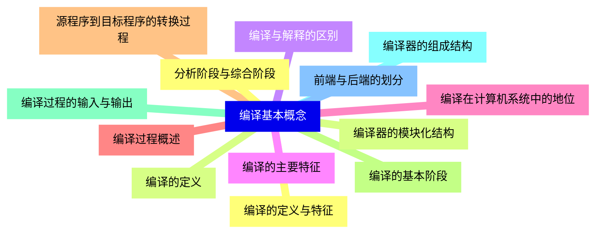
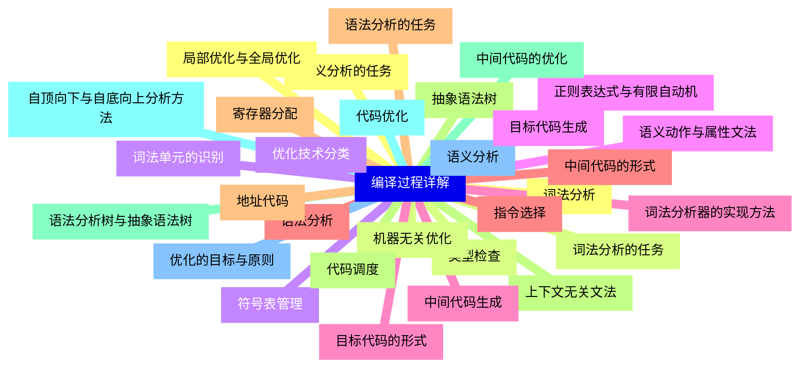
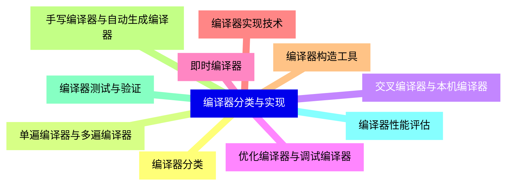
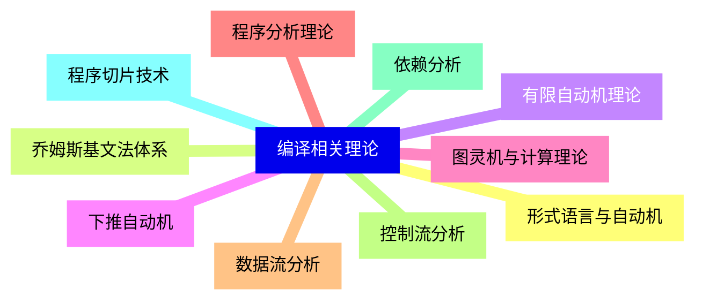
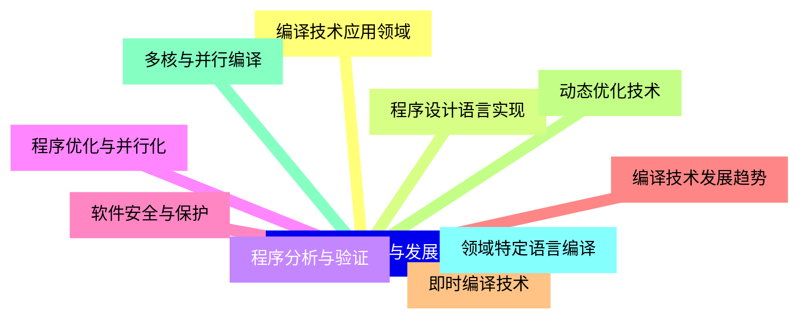


### 1 [编译基本概念](#1)
#### 1.1 [编译的定义与特征](#1)
#### 1.2 [编译的定义](#1)
#### 1.3 [编译与解释的区别](#1)
#### 1.4 [编译的主要特征](#1)
#### 1.5 [编译在计算机系统中的地位](#1)
#### 1.6 [编译过程概述](#1)
#### 1.7 [源程序到目标程序的转换过程](#1)
#### 1.8 [编译的基本阶段](#1)
#### 1.9 [编译过程的输入与输出](#1)
#### 1.10 [编译器的组成结构](#1)
#### 1.11 [前端与后端的划分](#1)
#### 1.12 [分析阶段与综合阶段](#1)
#### 1.13 [编译器的模块化结构](#1)
### 2 [编译过程详解](#2)
#### 2.1 [词法分析](#2)
#### 2.2 [词法分析的任务](#2)
#### 2.3 [词法单元的识别](#2)
#### 2.4 [正则表达式与有限自动机](#2)
#### 2.5 [词法分析器的实现方法](#2)
#### 2.6 [语法分析](#2)
#### 2.7 [语法分析的任务](#2)
#### 2.8 [上下文无关文法](#2)
#### 2.9 [语法分析树与抽象语法树](#2)
#### 2.10 [自顶向下与自底向上分析方法](#2)
#### 2.11 [语义分析](#2)
#### 2.12 [语义分析的任务](#2)
#### 2.13 [类型检查](#2)
#### 2.14 [符号表管理](#2)
#### 2.15 [语义动作与属性文法](#2)
#### 2.16 [中间代码生成](#2)
#### 2.17 [中间代码的形式](#2)
#### 2.18 [地址代码](#2)
#### 2.19 [抽象语法树](#2)
#### 2.20 [中间代码的优化](#2)
#### 2.21 [代码优化](#2)
#### 2.22 [优化的目标与原则](#2)
#### 2.23 [局部优化与全局优化](#2)
#### 2.24 [机器无关优化](#2)
#### 2.25 [优化技术分类](#2)
#### 2.26 [目标代码生成](#2)
#### 2.27 [目标代码的形式](#2)
#### 2.28 [指令选择](#2)
#### 2.29 [寄存器分配](#2)
#### 2.30 [代码调度](#2)
### 3 [编译器分类与实现](#3)
#### 3.1 [编译器分类](#3)
#### 3.2 [单遍编译器与多遍编译器](#3)
#### 3.3 [交叉编译器与本机编译器](#3)
#### 3.4 [优化编译器与调试编译器](#3)
#### 3.5 [即时编译器](#3)
#### 3.6 [编译器实现技术](#3)
#### 3.7 [编译器构造工具](#3)
#### 3.8 [手写编译器与自动生成编译器](#3)
#### 3.9 [编译器测试与验证](#3)
#### 3.10 [编译器性能评估](#3)
### 4 [编译相关理论](#4)
#### 4.1 [形式语言与自动机](#4)
#### 4.2 [乔姆斯基文法体系](#4)
#### 4.3 [有限自动机理论](#4)
#### 4.4 [下推自动机](#4)
#### 4.5 [图灵机与计算理论](#4)
#### 4.6 [程序分析理论](#4)
#### 4.7 [数据流分析](#4)
#### 4.8 [控制流分析](#4)
#### 4.9 [依赖分析](#4)
#### 4.10 [程序切片技术](#4)
### 5 [编译技术应用与发展](#5)
#### 5.1 [编译技术应用领域](#5)
#### 5.2 [程序设计语言实现](#5)
#### 5.3 [程序分析与验证](#5)
#### 5.4 [程序优化与并行化](#5)
#### 5.5 [软件安全与保护](#5)
#### 5.6 [编译技术发展趋势](#5)
#### 5.7 [即时编译技术](#5)
#### 5.8 [动态优化技术](#5)
#### 5.9 [多核与并行编译](#5)
#### 5.10 [领域特定语言编译](#5)




### 1 编译基本概念

---
### 1 编译基本概念
___
#### 1.1 编译的定义与特征
___
#### 1.2 编译的定义
___
#### 1.3 编译与解释的区别
___
#### 1.4 编译的主要特征
___
#### 1.5 编译在计算机系统中的地位
___
#### 1.6 编译过程概述
___
#### 1.7 源程序到目标程序的转换过程
___
#### 1.8 编译的基本阶段
___
#### 1.9 编译过程的输入与输出
___
#### 1.10 编译器的组成结构
___
#### 1.11 前端与后端的划分
___
#### 1.12 分析阶段与综合阶段
___
#### 1.13 编译器的模块化结构
### 2 编译过程详解

---
### 2 编译过程详解
___
#### 2.1 词法分析
___
#### 2.2 词法分析的任务
___
#### 2.3 词法单元的识别
___
#### 2.4 正则表达式与有限自动机
___
#### 2.5 词法分析器的实现方法
___
#### 2.6 语法分析
___
#### 2.7 语法分析的任务
___
#### 2.8 上下文无关文法
___
#### 2.9 语法分析树与抽象语法树
___
#### 2.10 自顶向下与自底向上分析方法
___
#### 2.11 语义分析
___
#### 2.12 语义分析的任务
___
#### 2.13 类型检查
___
#### 2.14 符号表管理
___
#### 2.15 语义动作与属性文法
___
#### 2.16 中间代码生成
___
#### 2.17 中间代码的形式
___
#### 2.18 地址代码
___
#### 2.19 抽象语法树
___
#### 2.20 中间代码的优化
___
#### 2.21 代码优化
___
#### 2.22 优化的目标与原则
___
#### 2.23 局部优化与全局优化
___
#### 2.24 机器无关优化
___
#### 2.25 优化技术分类
___
#### 2.26 目标代码生成
___
#### 2.27 目标代码的形式
___
#### 2.28 指令选择
___
#### 2.29 寄存器分配
___
#### 2.30 代码调度
### 3 编译器分类与实现

---
### 3 编译器分类与实现
___
#### 3.1 编译器分类
___
#### 3.2 单遍编译器与多遍编译器
___
#### 3.3 交叉编译器与本机编译器
___
#### 3.4 优化编译器与调试编译器
___
#### 3.5 即时编译器
___
#### 3.6 编译器实现技术
___
#### 3.7 编译器构造工具
___
#### 3.8 手写编译器与自动生成编译器
___
#### 3.9 编译器测试与验证
___
#### 3.10 编译器性能评估
### 4 编译相关理论

---
### 4 编译相关理论
___
#### 4.1 形式语言与自动机
___
#### 4.2 乔姆斯基文法体系
___
#### 4.3 有限自动机理论
___
#### 4.4 下推自动机
___
#### 4.5 图灵机与计算理论
___
#### 4.6 程序分析理论
___
#### 4.7 数据流分析
___
#### 4.8 控制流分析
___
#### 4.9 依赖分析
___
#### 4.10 程序切片技术
### 5 编译技术应用与发展

---
### 5 编译技术应用与发展
___
#### 5.1 编译技术应用领域
___
#### 5.2 程序设计语言实现
___
#### 5.3 程序分析与验证
___
#### 5.4 程序优化与并行化
___
#### 5.5 软件安全与保护
___
#### 5.6 编译技术发展趋势
___
#### 5.7 即时编译技术
___
#### 5.8 动态优化技术
___
#### 5.9 多核与并行编译
___
#### 5.10 领域特定语言编译


### 1 编译基本概念{#1}

{}

<--->
{}
{}
{}
{}
{}
{}
{}
{}
{}
{}
{}
{}
{}
{}
{}
{}
{}
{}
{}
{}
{}
{}
{}
{}
{}
{}
{}

### 2 编译过程详解{#2}

{}
{}
{}
{}
{}
{}
{}
{}
{}
{}
{}
{}
{}
{}
{}
{}
{}
{}
{}
{}
{}
{}
{}
{}
{}
{}
{}
{}
{}
{}
{}
{}
{}
{}
{}
{}
{}
{}
{}
{}
{}
{}
{}
{}
{}
{}
{}
{}
{}
{}
{}
{}
{}
{}
{}
{}
{}
{}
{}
{}
{}
<--->

{}

### 3 编译器分类与实现{#3}

{}

<--->
{}
{}
{}
{}
{}
{}
{}
{}
{}
{}
{}
{}
{}
{}
{}
{}
{}
{}
{}
{}
{}

### 4 编译相关理论{#4}

{}
{}
{}
{}
{}
{}
{}
{}
{}
{}
{}
{}
{}
{}
{}
{}
{}
{}
{}
{}
{}
<--->

{}

### 5 编译技术应用与发展{#5}

{}

<--->
{}
{}
{}
{}
{}
{}
{}
{}
{}
{}
{}
{}
{}
{}
{}
{}
{}
{}
{}
{}
{}
