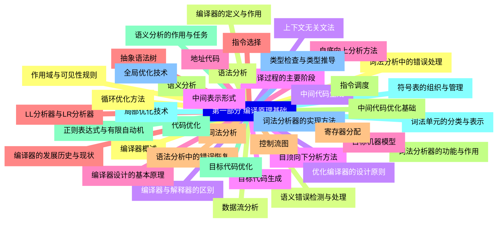
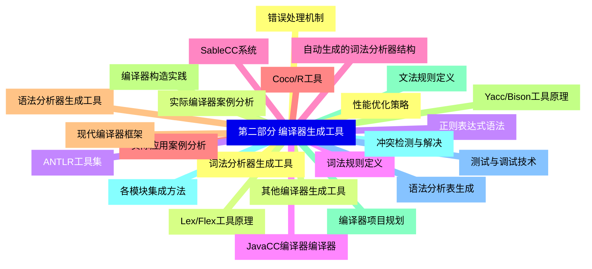
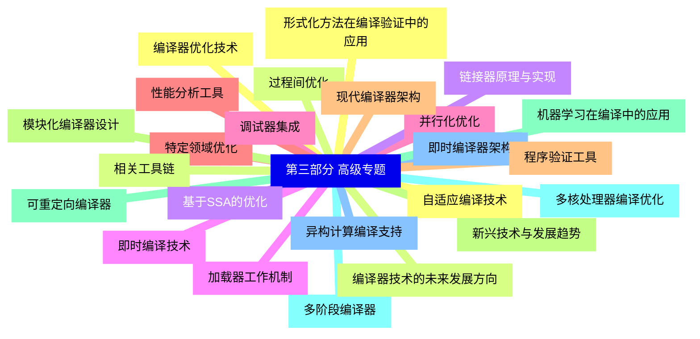


### 1 [第一部分 编译原理基础](#1)
#### 1.1 [编译器概述](#1)
#### 1.2 [编译器的定义与作用](#1)
#### 1.3 [编译器与解释器的区别](#1)
#### 1.4 [编译过程的主要阶段](#1)
#### 1.5 [编译器设计的基本原理](#1)
#### 1.6 [编译器的发展历史与现状](#1)
#### 1.7 [词法分析](#1)
#### 1.8 [词法分析器的功能与作用](#1)
#### 1.9 [正则表达式与有限自动机](#1)
#### 1.10 [词法单元的分类与表示](#1)
#### 1.11 [词法分析器的实现方法](#1)
#### 1.12 [词法分析中的错误处理](#1)
#### 1.13 [语法分析](#1)
#### 1.14 [上下文无关文法](#1)
#### 1.15 [自顶向下分析方法](#1)
#### 1.16 [自底向上分析方法](#1)
#### 1.17 [LL分析器与LR分析器](#1)
#### 1.18 [语法分析中的错误恢复](#1)
#### 1.19 [语义分析](#1)
#### 1.20 [语义分析的作用与任务](#1)
#### 1.21 [符号表的组织与管理](#1)
#### 1.22 [类型检查与类型推导](#1)
#### 1.23 [作用域与可见性规则](#1)
#### 1.24 [语义错误检测与处理](#1)
#### 1.25 [中间代码生成](#1)
#### 1.26 [中间表示形式](#1)
#### 1.27 [地址代码](#1)
#### 1.28 [抽象语法树](#1)
#### 1.29 [控制流图](#1)
#### 1.30 [中间代码优化基础](#1)
#### 1.31 [代码优化](#1)
#### 1.32 [局部优化技术](#1)
#### 1.33 [全局优化技术](#1)
#### 1.34 [循环优化方法](#1)
#### 1.35 [数据流分析](#1)
#### 1.36 [优化编译器的设计原则](#1)
#### 1.37 [目标代码生成](#1)
#### 1.38 [目标机器模型](#1)
#### 1.39 [指令选择](#1)
#### 1.40 [寄存器分配](#1)
#### 1.41 [指令调度](#1)
#### 1.42 [目标代码优化](#1)
### 2 [第二部分 编译器生成工具](#2)
#### 2.1 [词法分析器生成工具](#2)
#### 2.2 [Lex/Flex工具原理](#2)
#### 2.3 [正则表达式语法](#2)
#### 2.4 [词法规则定义](#2)
#### 2.5 [自动生成的词法分析器结构](#2)
#### 2.6 [实际应用案例分析](#2)
#### 2.7 [语法分析器生成工具](#2)
#### 2.8 [Yacc/Bison工具原理](#2)
#### 2.9 [文法规则定义](#2)
#### 2.10 [冲突检测与解决](#2)
#### 2.11 [语法分析表生成](#2)
#### 2.12 [错误处理机制](#2)
#### 2.13 [其他编译器生成工具](#2)
#### 2.14 [ANTLR工具集](#2)
#### 2.15 [JavaCC编译器编译器](#2)
#### 2.16 [SableCC系统](#2)
#### 2.17 [Coco/R工具](#2)
#### 2.18 [现代编译器框架](#2)
#### 2.19 [编译器构造实践](#2)
#### 2.20 [编译器项目规划](#2)
#### 2.21 [各模块集成方法](#2)
#### 2.22 [测试与调试技术](#2)
#### 2.23 [性能优化策略](#2)
#### 2.24 [实际编译器案例分析](#2)
### 3 [第三部分 高级专题](#3)
#### 3.1 [编译器优化技术](#3)
#### 3.2 [过程间优化](#3)
#### 3.3 [基于SSA的优化](#3)
#### 3.4 [即时编译技术](#3)
#### 3.5 [并行化优化](#3)
#### 3.6 [特定领域优化](#3)
#### 3.7 [现代编译器架构](#3)
#### 3.8 [模块化编译器设计](#3)
#### 3.9 [可重定向编译器](#3)
#### 3.10 [多阶段编译器](#3)
#### 3.11 [即时编译器架构](#3)
#### 3.12 [自适应编译技术](#3)
#### 3.13 [相关工具链](#3)
#### 3.14 [链接器原理与实现](#3)
#### 3.15 [加载器工作机制](#3)
#### 3.16 [调试器集成](#3)
#### 3.17 [性能分析工具](#3)
#### 3.18 [程序验证工具](#3)
#### 3.19 [新兴技术与发展趋势](#3)
#### 3.20 [机器学习在编译中的应用](#3)
#### 3.21 [多核处理器编译优化](#3)
#### 3.22 [异构计算编译支持](#3)
#### 3.23 [形式化方法在编译验证中的应用](#3)
#### 3.24 [编译器技术的未来发展方向](#3)




### 1 第一部分 编译原理基础

---
### 1 第一部分 编译原理基础
___
#### 1.1 编译器概述
___
#### 1.2 编译器的定义与作用
___
#### 1.3 编译器与解释器的区别
___
#### 1.4 编译过程的主要阶段
___
#### 1.5 编译器设计的基本原理
___
#### 1.6 编译器的发展历史与现状
___
#### 1.7 词法分析
___
#### 1.8 词法分析器的功能与作用
___
#### 1.9 正则表达式与有限自动机
___
#### 1.10 词法单元的分类与表示
___
#### 1.11 词法分析器的实现方法
___
#### 1.12 词法分析中的错误处理
___
#### 1.13 语法分析
___
#### 1.14 上下文无关文法
___
#### 1.15 自顶向下分析方法
___
#### 1.16 自底向上分析方法
___
#### 1.17 LL分析器与LR分析器
___
#### 1.18 语法分析中的错误恢复
___
#### 1.19 语义分析
___
#### 1.20 语义分析的作用与任务
___
#### 1.21 符号表的组织与管理
___
#### 1.22 类型检查与类型推导
___
#### 1.23 作用域与可见性规则
___
#### 1.24 语义错误检测与处理
___
#### 1.25 中间代码生成
___
#### 1.26 中间表示形式
___
#### 1.27 地址代码
___
#### 1.28 抽象语法树
___
#### 1.29 控制流图
___
#### 1.30 中间代码优化基础
___
#### 1.31 代码优化
___
#### 1.32 局部优化技术
___
#### 1.33 全局优化技术
___
#### 1.34 循环优化方法
___
#### 1.35 数据流分析
___
#### 1.36 优化编译器的设计原则
___
#### 1.37 目标代码生成
___
#### 1.38 目标机器模型
___
#### 1.39 指令选择
___
#### 1.40 寄存器分配
___
#### 1.41 指令调度
___
#### 1.42 目标代码优化
### 2 第二部分 编译器生成工具

---
### 2 第二部分 编译器生成工具
___
#### 2.1 词法分析器生成工具
___
#### 2.2 Lex/Flex工具原理
___
#### 2.3 正则表达式语法
___
#### 2.4 词法规则定义
___
#### 2.5 自动生成的词法分析器结构
___
#### 2.6 实际应用案例分析
___
#### 2.7 语法分析器生成工具
___
#### 2.8 Yacc/Bison工具原理
___
#### 2.9 文法规则定义
___
#### 2.10 冲突检测与解决
___
#### 2.11 语法分析表生成
___
#### 2.12 错误处理机制
___
#### 2.13 其他编译器生成工具
___
#### 2.14 ANTLR工具集
___
#### 2.15 JavaCC编译器编译器
___
#### 2.16 SableCC系统
___
#### 2.17 Coco/R工具
___
#### 2.18 现代编译器框架
___
#### 2.19 编译器构造实践
___
#### 2.20 编译器项目规划
___
#### 2.21 各模块集成方法
___
#### 2.22 测试与调试技术
___
#### 2.23 性能优化策略
___
#### 2.24 实际编译器案例分析
### 3 第三部分 高级专题

---
### 3 第三部分 高级专题
___
#### 3.1 编译器优化技术
___
#### 3.2 过程间优化
___
#### 3.3 基于SSA的优化
___
#### 3.4 即时编译技术
___
#### 3.5 并行化优化
___
#### 3.6 特定领域优化
___
#### 3.7 现代编译器架构
___
#### 3.8 模块化编译器设计
___
#### 3.9 可重定向编译器
___
#### 3.10 多阶段编译器
___
#### 3.11 即时编译器架构
___
#### 3.12 自适应编译技术
___
#### 3.13 相关工具链
___
#### 3.14 链接器原理与实现
___
#### 3.15 加载器工作机制
___
#### 3.16 调试器集成
___
#### 3.17 性能分析工具
___
#### 3.18 程序验证工具
___
#### 3.19 新兴技术与发展趋势
___
#### 3.20 机器学习在编译中的应用
___
#### 3.21 多核处理器编译优化
___
#### 3.22 异构计算编译支持
___
#### 3.23 形式化方法在编译验证中的应用
___
#### 3.24 编译器技术的未来发展方向


### 1 第一部分 编译原理基础{#1}

{}

<--->
{}
{}
{}
{}
{}
{}
{}
{}
{}
{}
{}
{}
{}
{}
{}
{}
{}
{}
{}
{}
{}
{}
{}
{}
{}
{}
{}
{}
{}
{}
{}
{}
{}
{}
{}
{}
{}
{}
{}
{}
{}
{}
{}
{}
{}
{}
{}
{}
{}
{}
{}
{}
{}
{}
{}
{}
{}
{}
{}
{}
{}
{}
{}
{}
{}
{}
{}
{}
{}
{}
{}
{}
{}
{}
{}
{}
{}
{}
{}
{}
{}
{}
{}
{}
{}

### 2 第二部分 编译器生成工具{#2}

{}
{}
{}
{}
{}
{}
{}
{}
{}
{}
{}
{}
{}
{}
{}
{}
{}
{}
{}
{}
{}
{}
{}
{}
{}
{}
{}
{}
{}
{}
{}
{}
{}
{}
{}
{}
{}
{}
{}
{}
{}
{}
{}
{}
{}
{}
{}
{}
{}
<--->

{}

### 3 第三部分 高级专题{#3}

{}

<--->
{}
{}
{}
{}
{}
{}
{}
{}
{}
{}
{}
{}
{}
{}
{}
{}
{}
{}
{}
{}
{}
{}
{}
{}
{}
{}
{}
{}
{}
{}
{}
{}
{}
{}
{}
{}
{}
{}
{}
{}
{}
{}
{}
{}
{}
{}
{}
{}
{}
