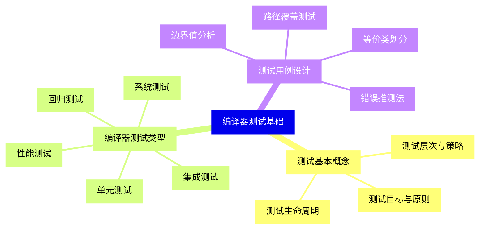
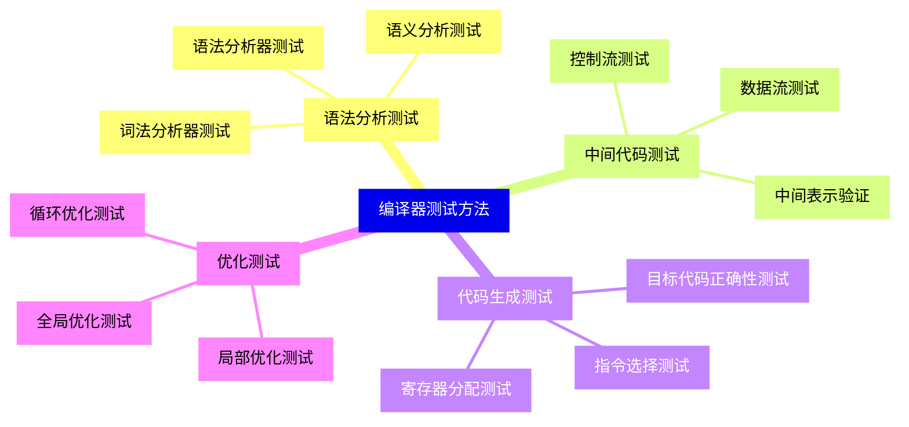
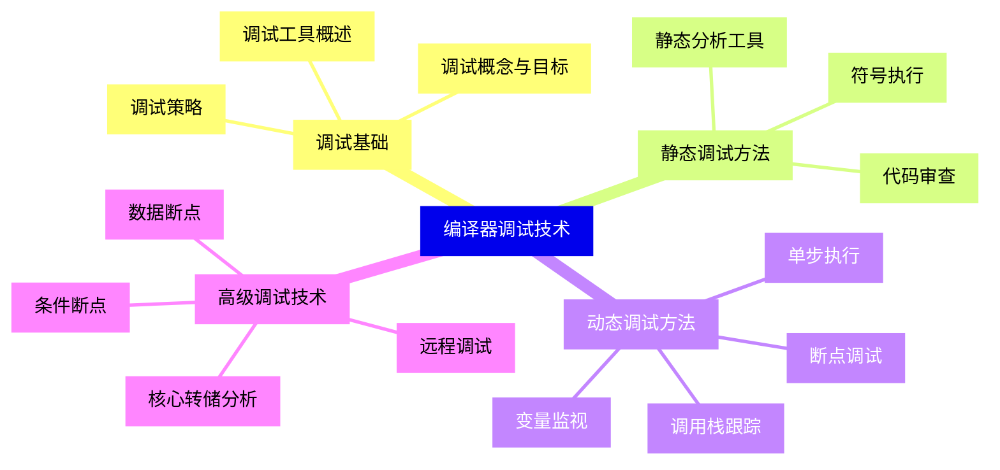
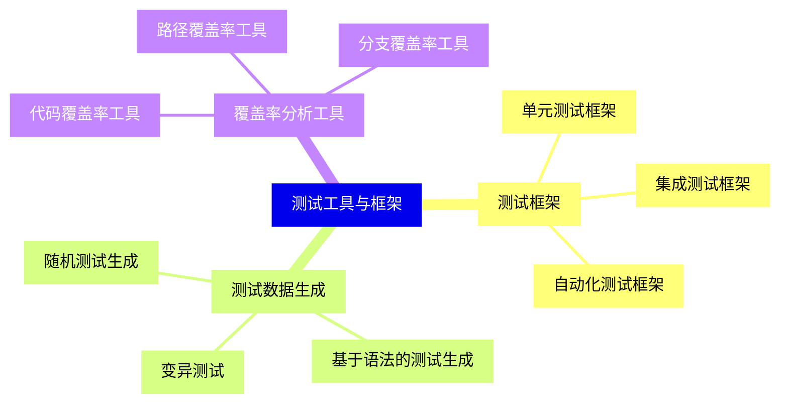
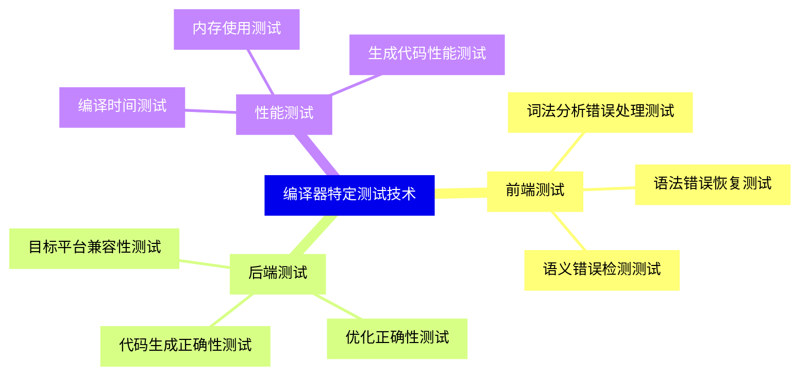
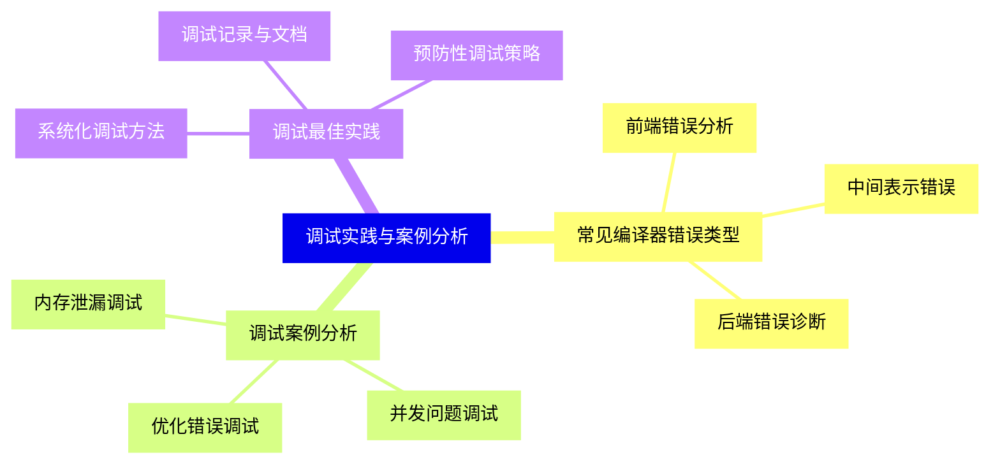
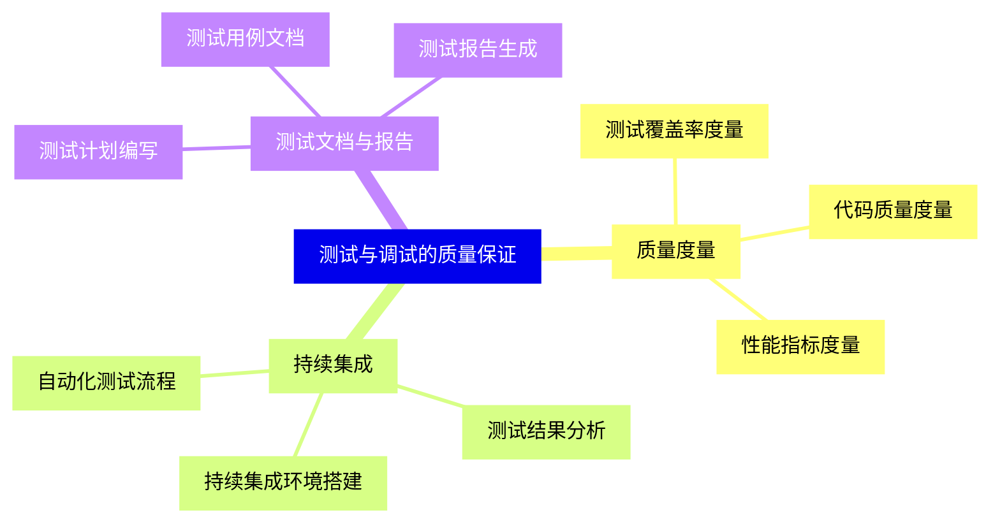
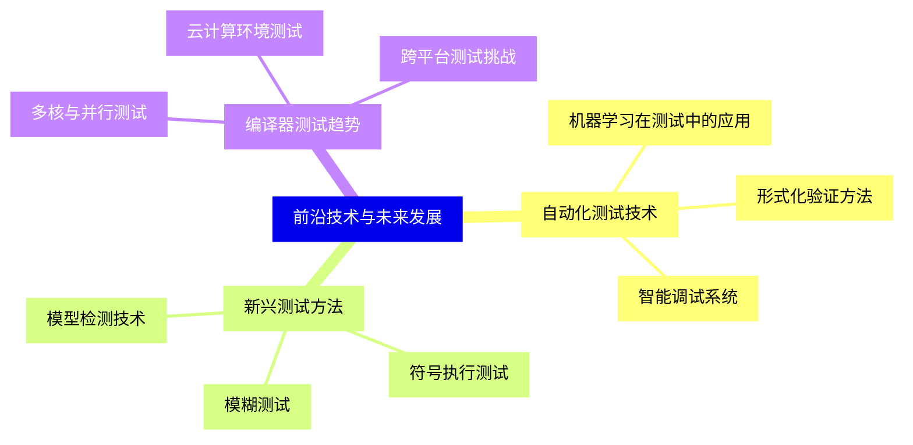


### 1 [编译器测试基础](#1)
#### 1.1 [测试基本概念](#1)
##### 1.1.1 [测试目标与原则](#1)
##### 1.1.2 [测试层次与策略](#1)
##### 1.1.3 [测试生命周期](#1)
#### 1.2 [编译器测试类型](#1)
##### 1.2.1 [单元测试](#1)
##### 1.2.2 [集成测试](#1)
##### 1.2.3 [系统测试](#1)
##### 1.2.4 [回归测试](#1)
##### 1.2.5 [性能测试](#1)
#### 1.3 [测试用例设计](#1)
##### 1.3.1 [等价类划分](#1)
##### 1.3.2 [边界值分析](#1)
##### 1.3.3 [路径覆盖测试](#1)
##### 1.3.4 [错误推测法](#1)
### 2 [编译器测试方法](#2)
#### 2.1 [语法分析测试](#2)
##### 2.1.1 [词法分析器测试](#2)
##### 2.1.2 [语法分析器测试](#2)
##### 2.1.3 [语义分析测试](#2)
#### 2.2 [中间代码测试](#2)
##### 2.2.1 [中间表示验证](#2)
##### 2.2.2 [控制流测试](#2)
##### 2.2.3 [数据流测试](#2)
#### 2.3 [代码生成测试](#2)
##### 2.3.1 [目标代码正确性测试](#2)
##### 2.3.2 [寄存器分配测试](#2)
##### 2.3.3 [指令选择测试](#2)
#### 2.4 [优化测试](#2)
##### 2.4.1 [局部优化测试](#2)
##### 2.4.2 [全局优化测试](#2)
##### 2.4.3 [循环优化测试](#2)
### 3 [编译器调试技术](#3)
#### 3.1 [调试基础](#3)
##### 3.1.1 [调试概念与目标](#3)
##### 3.1.2 [调试工具概述](#3)
##### 3.1.3 [调试策略](#3)
#### 3.2 [静态调试方法](#3)
##### 3.2.1 [代码审查](#3)
##### 3.2.2 [静态分析工具](#3)
##### 3.2.3 [符号执行](#3)
#### 3.3 [动态调试方法](#3)
##### 3.3.1 [断点调试](#3)
##### 3.3.2 [单步执行](#3)
##### 3.3.3 [变量监视](#3)
##### 3.3.4 [调用栈跟踪](#3)
#### 3.4 [高级调试技术](#3)
##### 3.4.1 [条件断点](#3)
##### 3.4.2 [数据断点](#3)
##### 3.4.3 [远程调试](#3)
##### 3.4.4 [核心转储分析](#3)
### 4 [测试工具与框架](#4)
#### 4.1 [测试框架](#4)
##### 4.1.1 [单元测试框架](#4)
##### 4.1.2 [集成测试框架](#4)
##### 4.1.3 [自动化测试框架](#4)
#### 4.2 [测试数据生成](#4)
##### 4.2.1 [随机测试生成](#4)
##### 4.2.2 [基于语法的测试生成](#4)
##### 4.2.3 [变异测试](#4)
#### 4.3 [覆盖率分析工具](#4)
##### 4.3.1 [代码覆盖率工具](#4)
##### 4.3.2 [路径覆盖率工具](#4)
##### 4.3.3 [分支覆盖率工具](#4)
### 5 [编译器特定测试技术](#5)
#### 5.1 [前端测试](#5)
##### 5.1.1 [词法分析错误处理测试](#5)
##### 5.1.2 [语法错误恢复测试](#5)
##### 5.1.3 [语义错误检测测试](#5)
#### 5.2 [后端测试](#5)
##### 5.2.1 [代码生成正确性测试](#5)
##### 5.2.2 [优化正确性测试](#5)
##### 5.2.3 [目标平台兼容性测试](#5)
#### 5.3 [性能测试](#5)
##### 5.3.1 [编译时间测试](#5)
##### 5.3.2 [内存使用测试](#5)
##### 5.3.3 [生成代码性能测试](#5)
### 6 [调试实践与案例分析](#6)
#### 6.1 [常见编译器错误类型](#6)
##### 6.1.1 [前端错误分析](#6)
##### 6.1.2 [中间表示错误](#6)
##### 6.1.3 [后端错误诊断](#6)
#### 6.2 [调试案例分析](#6)
##### 6.2.1 [内存泄漏调试](#6)
##### 6.2.2 [并发问题调试](#6)
##### 6.2.3 [优化错误调试](#6)
#### 6.3 [调试最佳实践](#6)
##### 6.3.1 [系统化调试方法](#6)
##### 6.3.2 [调试记录与文档](#6)
##### 6.3.3 [预防性调试策略](#6)
### 7 [测试与调试的质量保证](#7)
#### 7.1 [质量度量](#7)
##### 7.1.1 [测试覆盖率度量](#7)
##### 7.1.2 [代码质量度量](#7)
##### 7.1.3 [性能指标度量](#7)
#### 7.2 [持续集成](#7)
##### 7.2.1 [自动化测试流程](#7)
##### 7.2.2 [持续集成环境搭建](#7)
##### 7.2.3 [测试结果分析](#7)
#### 7.3 [测试文档与报告](#7)
##### 7.3.1 [测试计划编写](#7)
##### 7.3.2 [测试用例文档](#7)
##### 7.3.3 [测试报告生成](#7)
### 8 [前沿技术与未来发展](#8)
#### 8.1 [自动化测试技术](#8)
##### 8.1.1 [机器学习在测试中的应用](#8)
##### 8.1.2 [形式化验证方法](#8)
##### 8.1.3 [智能调试系统](#8)
#### 8.2 [新兴测试方法](#8)
##### 8.2.1 [模糊测试](#8)
##### 8.2.2 [符号执行测试](#8)
##### 8.2.3 [模型检测技术](#8)
#### 8.3 [编译器测试趋势](#8)
##### 8.3.1 [多核与并行测试](#8)
##### 8.3.2 [云计算环境测试](#8)
##### 8.3.3 [跨平台测试挑战](#8)




### 1 编译器测试基础

---
### 1 编译器测试基础
___
#### 1.1 测试基本概念
___
##### 1.1.1 测试目标与原则
___
##### 1.1.2 测试层次与策略
___
##### 1.1.3 测试生命周期
___
#### 1.2 编译器测试类型
___
##### 1.2.1 单元测试
___
##### 1.2.2 集成测试
___
##### 1.2.3 系统测试
___
##### 1.2.4 回归测试
___
##### 1.2.5 性能测试
___
#### 1.3 测试用例设计
___
##### 1.3.1 等价类划分
___
##### 1.3.2 边界值分析
___
##### 1.3.3 路径覆盖测试
___
##### 1.3.4 错误推测法
### 2 编译器测试方法

---
### 2 编译器测试方法
___
#### 2.1 语法分析测试
___
##### 2.1.1 词法分析器测试
___
##### 2.1.2 语法分析器测试
___
##### 2.1.3 语义分析测试
___
#### 2.2 中间代码测试
___
##### 2.2.1 中间表示验证
___
##### 2.2.2 控制流测试
___
##### 2.2.3 数据流测试
___
#### 2.3 代码生成测试
___
##### 2.3.1 目标代码正确性测试
___
##### 2.3.2 寄存器分配测试
___
##### 2.3.3 指令选择测试
___
#### 2.4 优化测试
___
##### 2.4.1 局部优化测试
___
##### 2.4.2 全局优化测试
___
##### 2.4.3 循环优化测试
### 3 编译器调试技术

---
### 3 编译器调试技术
___
#### 3.1 调试基础
___
##### 3.1.1 调试概念与目标
___
##### 3.1.2 调试工具概述
___
##### 3.1.3 调试策略
___
#### 3.2 静态调试方法
___
##### 3.2.1 代码审查
___
##### 3.2.2 静态分析工具
___
##### 3.2.3 符号执行
___
#### 3.3 动态调试方法
___
##### 3.3.1 断点调试
___
##### 3.3.2 单步执行
___
##### 3.3.3 变量监视
___
##### 3.3.4 调用栈跟踪
___
#### 3.4 高级调试技术
___
##### 3.4.1 条件断点
___
##### 3.4.2 数据断点
___
##### 3.4.3 远程调试
___
##### 3.4.4 核心转储分析
### 4 测试工具与框架

---
### 4 测试工具与框架
___
#### 4.1 测试框架
___
##### 4.1.1 单元测试框架
___
##### 4.1.2 集成测试框架
___
##### 4.1.3 自动化测试框架
___
#### 4.2 测试数据生成
___
##### 4.2.1 随机测试生成
___
##### 4.2.2 基于语法的测试生成
___
##### 4.2.3 变异测试
___
#### 4.3 覆盖率分析工具
___
##### 4.3.1 代码覆盖率工具
___
##### 4.3.2 路径覆盖率工具
___
##### 4.3.3 分支覆盖率工具
### 5 编译器特定测试技术

---
### 5 编译器特定测试技术
___
#### 5.1 前端测试
___
##### 5.1.1 词法分析错误处理测试
___
##### 5.1.2 语法错误恢复测试
___
##### 5.1.3 语义错误检测测试
___
#### 5.2 后端测试
___
##### 5.2.1 代码生成正确性测试
___
##### 5.2.2 优化正确性测试
___
##### 5.2.3 目标平台兼容性测试
___
#### 5.3 性能测试
___
##### 5.3.1 编译时间测试
___
##### 5.3.2 内存使用测试
___
##### 5.3.3 生成代码性能测试
### 6 调试实践与案例分析

---
### 6 调试实践与案例分析
___
#### 6.1 常见编译器错误类型
___
##### 6.1.1 前端错误分析
___
##### 6.1.2 中间表示错误
___
##### 6.1.3 后端错误诊断
___
#### 6.2 调试案例分析
___
##### 6.2.1 内存泄漏调试
___
##### 6.2.2 并发问题调试
___
##### 6.2.3 优化错误调试
___
#### 6.3 调试最佳实践
___
##### 6.3.1 系统化调试方法
___
##### 6.3.2 调试记录与文档
___
##### 6.3.3 预防性调试策略
### 7 测试与调试的质量保证

---
### 7 测试与调试的质量保证
___
#### 7.1 质量度量
___
##### 7.1.1 测试覆盖率度量
___
##### 7.1.2 代码质量度量
___
##### 7.1.3 性能指标度量
___
#### 7.2 持续集成
___
##### 7.2.1 自动化测试流程
___
##### 7.2.2 持续集成环境搭建
___
##### 7.2.3 测试结果分析
___
#### 7.3 测试文档与报告
___
##### 7.3.1 测试计划编写
___
##### 7.3.2 测试用例文档
___
##### 7.3.3 测试报告生成
### 8 前沿技术与未来发展

---
### 8 前沿技术与未来发展
___
#### 8.1 自动化测试技术
___
##### 8.1.1 机器学习在测试中的应用
___
##### 8.1.2 形式化验证方法
___
##### 8.1.3 智能调试系统
___
#### 8.2 新兴测试方法
___
##### 8.2.1 模糊测试
___
##### 8.2.2 符号执行测试
___
##### 8.2.3 模型检测技术
___
#### 8.3 编译器测试趋势
___
##### 8.3.1 多核与并行测试
___
##### 8.3.2 云计算环境测试
___
##### 8.3.3 跨平台测试挑战


### 1 编译器测试基础{#1}

{}

<--->
{}
{}
{}
{}
{}
{}
{}
{}
{}
{}
{}
{}
{}
{}
{}
{}
{}
{}
{}
{}
{}
{}
{}
{}
{}
{}
{}
{}
{}
{}
{}

### 2 编译器测试方法{#2}

{}
{}
{}
{}
{}
{}
{}
{}
{}
{}
{}
{}
{}
{}
{}
{}
{}
{}
{}
{}
{}
{}
{}
{}
{}
{}
{}
{}
{}
{}
{}
{}
{}
<--->

{}

### 3 编译器调试技术{#3}

{}

<--->
{}
{}
{}
{}
{}
{}
{}
{}
{}
{}
{}
{}
{}
{}
{}
{}
{}
{}
{}
{}
{}
{}
{}
{}
{}
{}
{}
{}
{}
{}
{}
{}
{}
{}
{}
{}
{}

### 4 测试工具与框架{#4}

{}
{}
{}
{}
{}
{}
{}
{}
{}
{}
{}
{}
{}
{}
{}
{}
{}
{}
{}
{}
{}
{}
{}
{}
{}
<--->

{}

### 5 编译器特定测试技术{#5}

{}

<--->
{}
{}
{}
{}
{}
{}
{}
{}
{}
{}
{}
{}
{}
{}
{}
{}
{}
{}
{}
{}
{}
{}
{}
{}
{}

### 6 调试实践与案例分析{#6}

{}
{}
{}
{}
{}
{}
{}
{}
{}
{}
{}
{}
{}
{}
{}
{}
{}
{}
{}
{}
{}
{}
{}
{}
{}
<--->

{}

### 7 测试与调试的质量保证{#7}

{}

<--->
{}
{}
{}
{}
{}
{}
{}
{}
{}
{}
{}
{}
{}
{}
{}
{}
{}
{}
{}
{}
{}
{}
{}
{}
{}

### 8 前沿技术与未来发展{#8}

{}
{}
{}
{}
{}
{}
{}
{}
{}
{}
{}
{}
{}
{}
{}
{}
{}
{}
{}
{}
{}
{}
{}
{}
{}
<--->

{}
