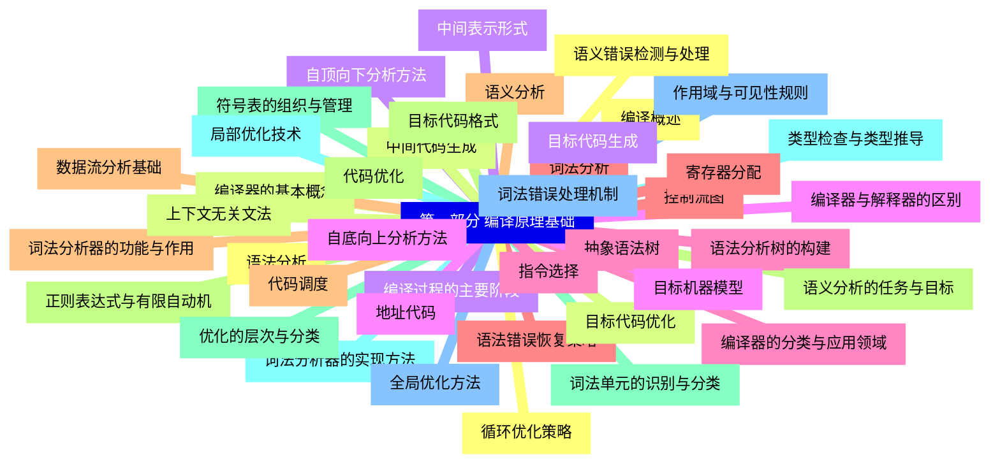
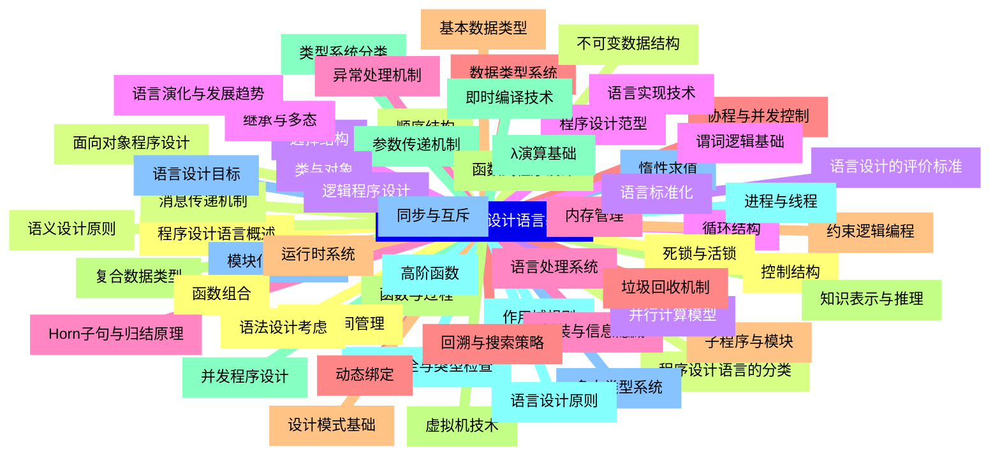


### 1 [第一部分 编译原理基础](#1)
#### 1.1 [编译概述](#1)
#### 1.2 [编译器的基本概念](#1)
#### 1.3 [编译过程的主要阶段](#1)
#### 1.4 [编译器与解释器的区别](#1)
#### 1.5 [编译器的分类与应用领域](#1)
#### 1.6 [词法分析](#1)
#### 1.7 [词法分析器的功能与作用](#1)
#### 1.8 [正则表达式与有限自动机](#1)
#### 1.9 [词法单元的识别与分类](#1)
#### 1.10 [词法分析器的实现方法](#1)
#### 1.11 [词法错误处理机制](#1)
#### 1.12 [语法分析](#1)
#### 1.13 [上下文无关文法](#1)
#### 1.14 [自顶向下分析方法](#1)
#### 1.15 [自底向上分析方法](#1)
#### 1.16 [语法分析树的构建](#1)
#### 1.17 [语法错误恢复策略](#1)
#### 1.18 [语义分析](#1)
#### 1.19 [语义分析的任务与目标](#1)
#### 1.20 [符号表的组织与管理](#1)
#### 1.21 [类型检查与类型推导](#1)
#### 1.22 [作用域与可见性规则](#1)
#### 1.23 [语义错误检测与处理](#1)
#### 1.24 [中间代码生成](#1)
#### 1.25 [中间表示形式](#1)
#### 1.26 [地址代码](#1)
#### 1.27 [抽象语法树](#1)
#### 1.28 [控制流图](#1)
#### 1.29 [数据流分析基础](#1)
#### 1.30 [代码优化](#1)
#### 1.31 [优化的层次与分类](#1)
#### 1.32 [局部优化技术](#1)
#### 1.33 [全局优化方法](#1)
#### 1.34 [循环优化策略](#1)
#### 1.35 [目标代码优化](#1)
#### 1.36 [目标代码生成](#1)
#### 1.37 [目标机器模型](#1)
#### 1.38 [指令选择](#1)
#### 1.39 [寄存器分配](#1)
#### 1.40 [代码调度](#1)
#### 1.41 [目标代码格式](#1)
### 2 [第二部分 程序设计语言基础](#2)
#### 2.1 [程序设计语言概述](#2)
#### 2.2 [程序设计语言的分类](#2)
#### 2.3 [语言设计的评价标准](#2)
#### 2.4 [程序设计范型](#2)
#### 2.5 [语言处理系统](#2)
#### 2.6 [数据类型系统](#2)
#### 2.7 [基本数据类型](#2)
#### 2.8 [复合数据类型](#2)
#### 2.9 [类型系统分类](#2)
#### 2.10 [类型安全与类型检查](#2)
#### 2.11 [多态类型系统](#2)
#### 2.12 [控制结构](#2)
#### 2.13 [顺序结构](#2)
#### 2.14 [选择结构](#2)
#### 2.15 [循环结构](#2)
#### 2.16 [异常处理机制](#2)
#### 2.17 [协程与并发控制](#2)
#### 2.18 [子程序与模块](#2)
#### 2.19 [函数与过程](#2)
#### 2.20 [参数传递机制](#2)
#### 2.21 [作用域规则](#2)
#### 2.22 [模块化程序设计](#2)
#### 2.23 [命名空间管理](#2)
#### 2.24 [面向对象程序设计](#2)
#### 2.25 [类与对象](#2)
#### 2.26 [继承与多态](#2)
#### 2.27 [封装与信息隐藏](#2)
#### 2.28 [动态绑定](#2)
#### 2.29 [设计模式基础](#2)
#### 2.30 [函数式程序设计](#2)
#### 2.31 [λ演算基础](#2)
#### 2.32 [高阶函数](#2)
#### 2.33 [惰性求值](#2)
#### 2.34 [函数组合](#2)
#### 2.35 [不可变数据结构](#2)
#### 2.36 [逻辑程序设计](#2)
#### 2.37 [谓词逻辑基础](#2)
#### 2.38 [Horn子句与归结原理](#2)
#### 2.39 [回溯与搜索策略](#2)
#### 2.40 [约束逻辑编程](#2)
#### 2.41 [知识表示与推理](#2)
#### 2.42 [并发程序设计](#2)
#### 2.43 [进程与线程](#2)
#### 2.44 [同步与互斥](#2)
#### 2.45 [死锁与活锁](#2)
#### 2.46 [消息传递机制](#2)
#### 2.47 [并行计算模型](#2)
#### 2.48 [语言实现技术](#2)
#### 2.49 [内存管理](#2)
#### 2.50 [垃圾回收机制](#2)
#### 2.51 [运行时系统](#2)
#### 2.52 [虚拟机技术](#2)
#### 2.53 [即时编译技术](#2)
#### 2.54 [语言设计原则](#2)
#### 2.55 [语言设计目标](#2)
#### 2.56 [语法设计考虑](#2)
#### 2.57 [语义设计原则](#2)
#### 2.58 [语言标准化](#2)
#### 2.59 [语言演化与发展趋势](#2)




### 1 第一部分 编译原理基础

---
### 1 第一部分 编译原理基础
___
#### 1.1 编译概述
___
#### 1.2 编译器的基本概念
___
#### 1.3 编译过程的主要阶段
___
#### 1.4 编译器与解释器的区别
___
#### 1.5 编译器的分类与应用领域
___
#### 1.6 词法分析
___
#### 1.7 词法分析器的功能与作用
___
#### 1.8 正则表达式与有限自动机
___
#### 1.9 词法单元的识别与分类
___
#### 1.10 词法分析器的实现方法
___
#### 1.11 词法错误处理机制
___
#### 1.12 语法分析
___
#### 1.13 上下文无关文法
___
#### 1.14 自顶向下分析方法
___
#### 1.15 自底向上分析方法
___
#### 1.16 语法分析树的构建
___
#### 1.17 语法错误恢复策略
___
#### 1.18 语义分析
___
#### 1.19 语义分析的任务与目标
___
#### 1.20 符号表的组织与管理
___
#### 1.21 类型检查与类型推导
___
#### 1.22 作用域与可见性规则
___
#### 1.23 语义错误检测与处理
___
#### 1.24 中间代码生成
___
#### 1.25 中间表示形式
___
#### 1.26 地址代码
___
#### 1.27 抽象语法树
___
#### 1.28 控制流图
___
#### 1.29 数据流分析基础
___
#### 1.30 代码优化
___
#### 1.31 优化的层次与分类
___
#### 1.32 局部优化技术
___
#### 1.33 全局优化方法
___
#### 1.34 循环优化策略
___
#### 1.35 目标代码优化
___
#### 1.36 目标代码生成
___
#### 1.37 目标机器模型
___
#### 1.38 指令选择
___
#### 1.39 寄存器分配
___
#### 1.40 代码调度
___
#### 1.41 目标代码格式
### 2 第二部分 程序设计语言基础

---
### 2 第二部分 程序设计语言基础
___
#### 2.1 程序设计语言概述
___
#### 2.2 程序设计语言的分类
___
#### 2.3 语言设计的评价标准
___
#### 2.4 程序设计范型
___
#### 2.5 语言处理系统
___
#### 2.6 数据类型系统
___
#### 2.7 基本数据类型
___
#### 2.8 复合数据类型
___
#### 2.9 类型系统分类
___
#### 2.10 类型安全与类型检查
___
#### 2.11 多态类型系统
___
#### 2.12 控制结构
___
#### 2.13 顺序结构
___
#### 2.14 选择结构
___
#### 2.15 循环结构
___
#### 2.16 异常处理机制
___
#### 2.17 协程与并发控制
___
#### 2.18 子程序与模块
___
#### 2.19 函数与过程
___
#### 2.20 参数传递机制
___
#### 2.21 作用域规则
___
#### 2.22 模块化程序设计
___
#### 2.23 命名空间管理
___
#### 2.24 面向对象程序设计
___
#### 2.25 类与对象
___
#### 2.26 继承与多态
___
#### 2.27 封装与信息隐藏
___
#### 2.28 动态绑定
___
#### 2.29 设计模式基础
___
#### 2.30 函数式程序设计
___
#### 2.31 λ演算基础
___
#### 2.32 高阶函数
___
#### 2.33 惰性求值
___
#### 2.34 函数组合
___
#### 2.35 不可变数据结构
___
#### 2.36 逻辑程序设计
___
#### 2.37 谓词逻辑基础
___
#### 2.38 Horn子句与归结原理
___
#### 2.39 回溯与搜索策略
___
#### 2.40 约束逻辑编程
___
#### 2.41 知识表示与推理
___
#### 2.42 并发程序设计
___
#### 2.43 进程与线程
___
#### 2.44 同步与互斥
___
#### 2.45 死锁与活锁
___
#### 2.46 消息传递机制
___
#### 2.47 并行计算模型
___
#### 2.48 语言实现技术
___
#### 2.49 内存管理
___
#### 2.50 垃圾回收机制
___
#### 2.51 运行时系统
___
#### 2.52 虚拟机技术
___
#### 2.53 即时编译技术
___
#### 2.54 语言设计原则
___
#### 2.55 语言设计目标
___
#### 2.56 语法设计考虑
___
#### 2.57 语义设计原则
___
#### 2.58 语言标准化
___
#### 2.59 语言演化与发展趋势


### 1 第一部分 编译原理基础{#1}

{}

<--->
{}
{}
{}
{}
{}
{}
{}
{}
{}
{}
{}
{}
{}
{}
{}
{}
{}
{}
{}
{}
{}
{}
{}
{}
{}
{}
{}
{}
{}
{}
{}
{}
{}
{}
{}
{}
{}
{}
{}
{}
{}
{}
{}
{}
{}
{}
{}
{}
{}
{}
{}
{}
{}
{}
{}
{}
{}
{}
{}
{}
{}
{}
{}
{}
{}
{}
{}
{}
{}
{}
{}
{}
{}
{}
{}
{}
{}
{}
{}
{}
{}
{}
{}

### 2 第二部分 程序设计语言基础{#2}

{}
{}
{}
{}
{}
{}
{}
{}
{}
{}
{}
{}
{}
{}
{}
{}
{}
{}
{}
{}
{}
{}
{}
{}
{}
{}
{}
{}
{}
{}
{}
{}
{}
{}
{}
{}
{}
{}
{}
{}
{}
{}
{}
{}
{}
{}
{}
{}
{}
{}
{}
{}
{}
{}
{}
{}
{}
{}
{}
{}
{}
{}
{}
{}
{}
{}
{}
{}
{}
{}
{}
{}
{}
{}
{}
{}
{}
{}
{}
{}
{}
{}
{}
{}
{}
{}
{}
{}
{}
{}
{}
{}
{}
{}
{}
{}
{}
{}
{}
{}
{}
{}
{}
{}
{}
{}
{}
{}
{}
{}
{}
{}
{}
{}
{}
{}
{}
{}
{}
<--->

{}
