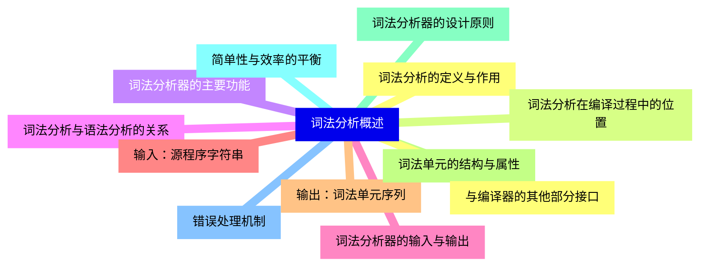
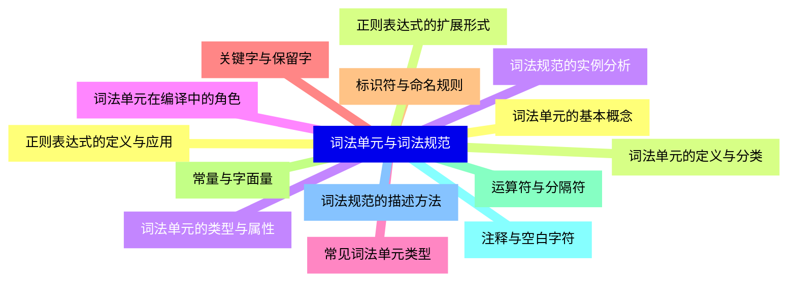
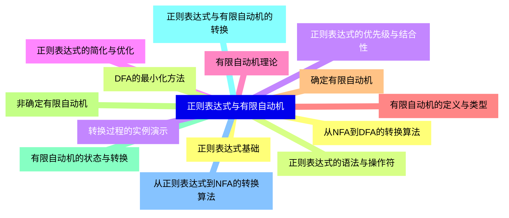
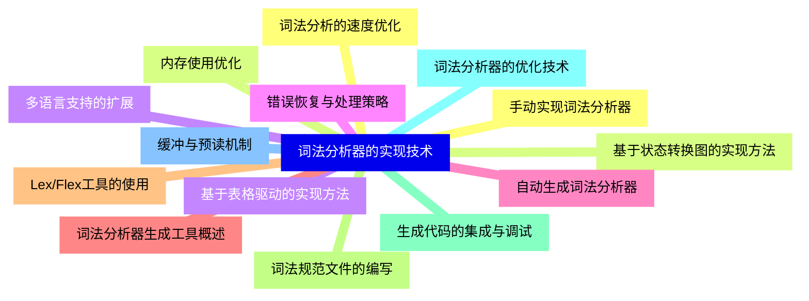
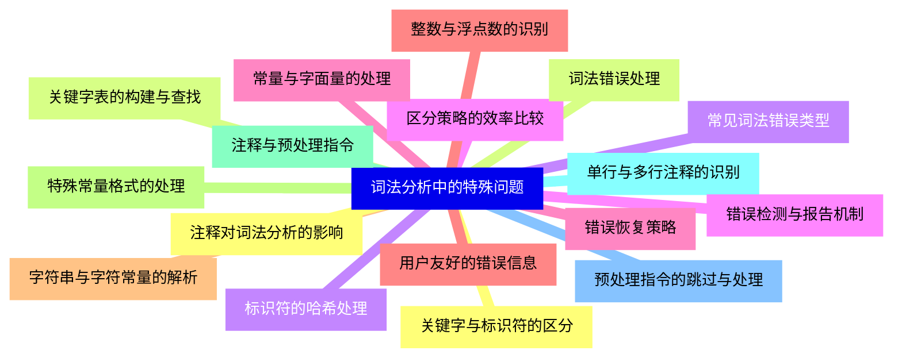
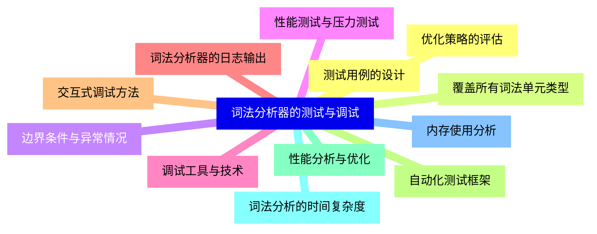
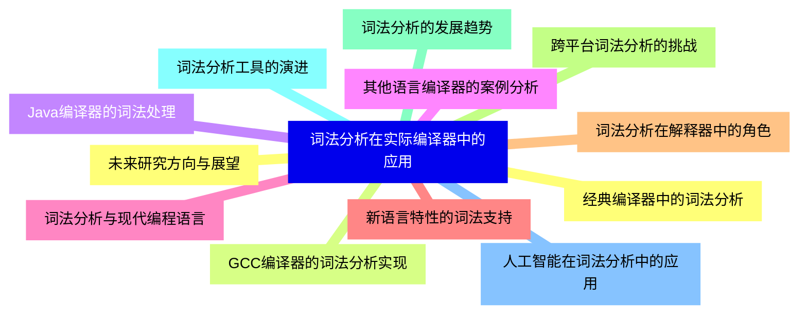


### 1 [词法分析概述](#1)
#### 1.1 [词法分析的定义与作用](#1)
#### 1.2 [词法分析在编译过程中的位置](#1)
#### 1.3 [词法分析器的主要功能](#1)
#### 1.4 [词法分析与语法分析的关系](#1)
#### 1.5 [词法分析器的输入与输出](#1)
#### 1.6 [输入：源程序字符串](#1)
#### 1.7 [输出：词法单元序列](#1)
#### 1.8 [词法单元的结构与属性](#1)
#### 1.9 [词法分析器的设计原则](#1)
#### 1.10 [简单性与效率的平衡](#1)
#### 1.11 [错误处理机制](#1)
#### 1.12 [与编译器的其他部分接口](#1)
### 2 [词法单元与词法规范](#2)
#### 2.1 [词法单元的基本概念](#2)
#### 2.2 [词法单元的定义与分类](#2)
#### 2.3 [词法单元的类型与属性](#2)
#### 2.4 [词法单元在编译中的角色](#2)
#### 2.5 [常见词法单元类型](#2)
#### 2.6 [关键字与保留字](#2)
#### 2.7 [标识符与命名规则](#2)
#### 2.8 [常量与字面量](#2)
#### 2.9 [运算符与分隔符](#2)
#### 2.10 [注释与空白字符](#2)
#### 2.11 [词法规范的描述方法](#2)
#### 2.12 [正则表达式的定义与应用](#2)
#### 2.13 [正则表达式的扩展形式](#2)
#### 2.14 [词法规范的实例分析](#2)
### 3 [正则表达式与有限自动机](#3)
#### 3.1 [正则表达式基础](#3)
#### 3.2 [正则表达式的语法与操作符](#3)
#### 3.3 [正则表达式的优先级与结合性](#3)
#### 3.4 [正则表达式的简化与优化](#3)
#### 3.5 [有限自动机理论](#3)
#### 3.6 [有限自动机的定义与类型](#3)
#### 3.7 [确定有限自动机](#3)
#### 3.8 [非确定有限自动机](#3)
#### 3.9 [有限自动机的状态与转换](#3)
#### 3.10 [正则表达式与有限自动机的转换](#3)
#### 3.11 [从正则表达式到NFA的转换算法](#3)
#### 3.12 [从NFA到DFA的转换算法](#3)
#### 3.13 [DFA的最小化方法](#3)
#### 3.14 [转换过程的实例演示](#3)
### 4 [词法分析器的实现技术](#4)
#### 4.1 [手动实现词法分析器](#4)
#### 4.2 [基于状态转换图的实现方法](#4)
#### 4.3 [基于表格驱动的实现方法](#4)
#### 4.4 [错误恢复与处理策略](#4)
#### 4.5 [自动生成词法分析器](#4)
#### 4.6 [词法分析器生成工具概述](#4)
#### 4.7 [Lex/Flex工具的使用](#4)
#### 4.8 [词法规范文件的编写](#4)
#### 4.9 [生成代码的集成与调试](#4)
#### 4.10 [词法分析器的优化技术](#4)
#### 4.11 [缓冲与预读机制](#4)
#### 4.12 [词法分析的速度优化](#4)
#### 4.13 [内存使用优化](#4)
#### 4.14 [多语言支持的扩展](#4)
### 5 [词法分析中的特殊问题](#5)
#### 5.1 [关键字与标识符的区分](#5)
#### 5.2 [关键字表的构建与查找](#5)
#### 5.3 [标识符的哈希处理](#5)
#### 5.4 [区分策略的效率比较](#5)
#### 5.5 [常量与字面量的处理](#5)
#### 5.6 [整数与浮点数的识别](#5)
#### 5.7 [字符串与字符常量的解析](#5)
#### 5.8 [特殊常量格式的处理](#5)
#### 5.9 [注释与预处理指令](#5)
#### 5.10 [单行与多行注释的识别](#5)
#### 5.11 [预处理指令的跳过与处理](#5)
#### 5.12 [注释对词法分析的影响](#5)
#### 5.13 [词法错误处理](#5)
#### 5.14 [常见词法错误类型](#5)
#### 5.15 [错误检测与报告机制](#5)
#### 5.16 [错误恢复策略](#5)
#### 5.17 [用户友好的错误信息](#5)
### 6 [词法分析器的测试与调试](#6)
#### 6.1 [测试用例的设计](#6)
#### 6.2 [覆盖所有词法单元类型](#6)
#### 6.3 [边界条件与异常情况](#6)
#### 6.4 [性能测试与压力测试](#6)
#### 6.5 [调试工具与技术](#6)
#### 6.6 [词法分析器的日志输出](#6)
#### 6.7 [交互式调试方法](#6)
#### 6.8 [自动化测试框架](#6)
#### 6.9 [性能分析与优化](#6)
#### 6.10 [词法分析的时间复杂度](#6)
#### 6.11 [内存使用分析](#6)
#### 6.12 [优化策略的评估](#6)
### 7 [词法分析在实际编译器中的应用](#7)
#### 7.1 [经典编译器中的词法分析](#7)
#### 7.2 [GCC编译器的词法分析实现](#7)
#### 7.3 [Java编译器的词法处理](#7)
#### 7.4 [其他语言编译器的案例分析](#7)
#### 7.5 [词法分析与现代编程语言](#7)
#### 7.6 [新语言特性的词法支持](#7)
#### 7.7 [词法分析在解释器中的角色](#7)
#### 7.8 [跨平台词法分析的挑战](#7)
#### 7.9 [词法分析的发展趋势](#7)
#### 7.10 [词法分析工具的演进](#7)
#### 7.11 [人工智能在词法分析中的应用](#7)
#### 7.12 [未来研究方向与展望](#7)




### 1 词法分析概述

---
### 1 词法分析概述
___
#### 1.1 词法分析的定义与作用
___
#### 1.2 词法分析在编译过程中的位置
___
#### 1.3 词法分析器的主要功能
___
#### 1.4 词法分析与语法分析的关系
___
#### 1.5 词法分析器的输入与输出
___
#### 1.6 输入：源程序字符串
___
#### 1.7 输出：词法单元序列
___
#### 1.8 词法单元的结构与属性
___
#### 1.9 词法分析器的设计原则
___
#### 1.10 简单性与效率的平衡
___
#### 1.11 错误处理机制
___
#### 1.12 与编译器的其他部分接口
### 2 词法单元与词法规范

---
### 2 词法单元与词法规范
___
#### 2.1 词法单元的基本概念
___
#### 2.2 词法单元的定义与分类
___
#### 2.3 词法单元的类型与属性
___
#### 2.4 词法单元在编译中的角色
___
#### 2.5 常见词法单元类型
___
#### 2.6 关键字与保留字
___
#### 2.7 标识符与命名规则
___
#### 2.8 常量与字面量
___
#### 2.9 运算符与分隔符
___
#### 2.10 注释与空白字符
___
#### 2.11 词法规范的描述方法
___
#### 2.12 正则表达式的定义与应用
___
#### 2.13 正则表达式的扩展形式
___
#### 2.14 词法规范的实例分析
### 3 正则表达式与有限自动机

---
### 3 正则表达式与有限自动机
___
#### 3.1 正则表达式基础
___
#### 3.2 正则表达式的语法与操作符
___
#### 3.3 正则表达式的优先级与结合性
___
#### 3.4 正则表达式的简化与优化
___
#### 3.5 有限自动机理论
___
#### 3.6 有限自动机的定义与类型
___
#### 3.7 确定有限自动机
___
#### 3.8 非确定有限自动机
___
#### 3.9 有限自动机的状态与转换
___
#### 3.10 正则表达式与有限自动机的转换
___
#### 3.11 从正则表达式到NFA的转换算法
___
#### 3.12 从NFA到DFA的转换算法
___
#### 3.13 DFA的最小化方法
___
#### 3.14 转换过程的实例演示
### 4 词法分析器的实现技术

---
### 4 词法分析器的实现技术
___
#### 4.1 手动实现词法分析器
___
#### 4.2 基于状态转换图的实现方法
___
#### 4.3 基于表格驱动的实现方法
___
#### 4.4 错误恢复与处理策略
___
#### 4.5 自动生成词法分析器
___
#### 4.6 词法分析器生成工具概述
___
#### 4.7 Lex/Flex工具的使用
___
#### 4.8 词法规范文件的编写
___
#### 4.9 生成代码的集成与调试
___
#### 4.10 词法分析器的优化技术
___
#### 4.11 缓冲与预读机制
___
#### 4.12 词法分析的速度优化
___
#### 4.13 内存使用优化
___
#### 4.14 多语言支持的扩展
### 5 词法分析中的特殊问题

---
### 5 词法分析中的特殊问题
___
#### 5.1 关键字与标识符的区分
___
#### 5.2 关键字表的构建与查找
___
#### 5.3 标识符的哈希处理
___
#### 5.4 区分策略的效率比较
___
#### 5.5 常量与字面量的处理
___
#### 5.6 整数与浮点数的识别
___
#### 5.7 字符串与字符常量的解析
___
#### 5.8 特殊常量格式的处理
___
#### 5.9 注释与预处理指令
___
#### 5.10 单行与多行注释的识别
___
#### 5.11 预处理指令的跳过与处理
___
#### 5.12 注释对词法分析的影响
___
#### 5.13 词法错误处理
___
#### 5.14 常见词法错误类型
___
#### 5.15 错误检测与报告机制
___
#### 5.16 错误恢复策略
___
#### 5.17 用户友好的错误信息
### 6 词法分析器的测试与调试

---
### 6 词法分析器的测试与调试
___
#### 6.1 测试用例的设计
___
#### 6.2 覆盖所有词法单元类型
___
#### 6.3 边界条件与异常情况
___
#### 6.4 性能测试与压力测试
___
#### 6.5 调试工具与技术
___
#### 6.6 词法分析器的日志输出
___
#### 6.7 交互式调试方法
___
#### 6.8 自动化测试框架
___
#### 6.9 性能分析与优化
___
#### 6.10 词法分析的时间复杂度
___
#### 6.11 内存使用分析
___
#### 6.12 优化策略的评估
### 7 词法分析在实际编译器中的应用

---
### 7 词法分析在实际编译器中的应用
___
#### 7.1 经典编译器中的词法分析
___
#### 7.2 GCC编译器的词法分析实现
___
#### 7.3 Java编译器的词法处理
___
#### 7.4 其他语言编译器的案例分析
___
#### 7.5 词法分析与现代编程语言
___
#### 7.6 新语言特性的词法支持
___
#### 7.7 词法分析在解释器中的角色
___
#### 7.8 跨平台词法分析的挑战
___
#### 7.9 词法分析的发展趋势
___
#### 7.10 词法分析工具的演进
___
#### 7.11 人工智能在词法分析中的应用
___
#### 7.12 未来研究方向与展望


### 1 词法分析概述{#1}

{}

<--->
{}
{}
{}
{}
{}
{}
{}
{}
{}
{}
{}
{}
{}
{}
{}
{}
{}
{}
{}
{}
{}
{}
{}
{}
{}

### 2 词法单元与词法规范{#2}

{}
{}
{}
{}
{}
{}
{}
{}
{}
{}
{}
{}
{}
{}
{}
{}
{}
{}
{}
{}
{}
{}
{}
{}
{}
{}
{}
{}
{}
<--->

{}

### 3 正则表达式与有限自动机{#3}

{}

<--->
{}
{}
{}
{}
{}
{}
{}
{}
{}
{}
{}
{}
{}
{}
{}
{}
{}
{}
{}
{}
{}
{}
{}
{}
{}
{}
{}
{}
{}

### 4 词法分析器的实现技术{#4}

{}
{}
{}
{}
{}
{}
{}
{}
{}
{}
{}
{}
{}
{}
{}
{}
{}
{}
{}
{}
{}
{}
{}
{}
{}
{}
{}
{}
{}
<--->

{}

### 5 词法分析中的特殊问题{#5}

{}

<--->
{}
{}
{}
{}
{}
{}
{}
{}
{}
{}
{}
{}
{}
{}
{}
{}
{}
{}
{}
{}
{}
{}
{}
{}
{}
{}
{}
{}
{}
{}
{}
{}
{}
{}
{}

### 6 词法分析器的测试与调试{#6}

{}
{}
{}
{}
{}
{}
{}
{}
{}
{}
{}
{}
{}
{}
{}
{}
{}
{}
{}
{}
{}
{}
{}
{}
{}
<--->

{}

### 7 词法分析在实际编译器中的应用{#7}

{}

<--->
{}
{}
{}
{}
{}
{}
{}
{}
{}
{}
{}
{}
{}
{}
{}
{}
{}
{}
{}
{}
{}
{}
{}
{}
{}
