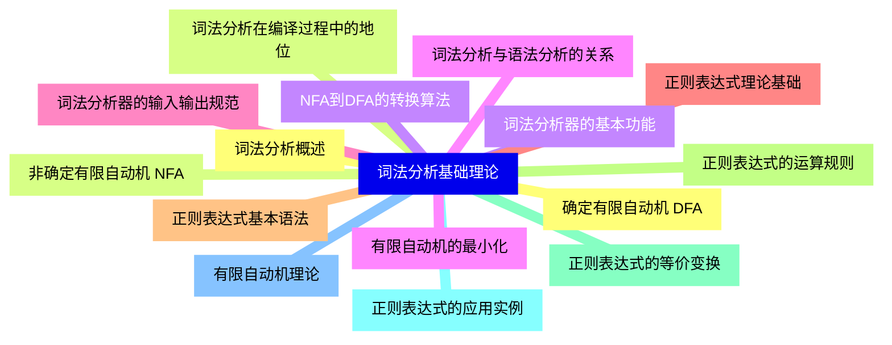
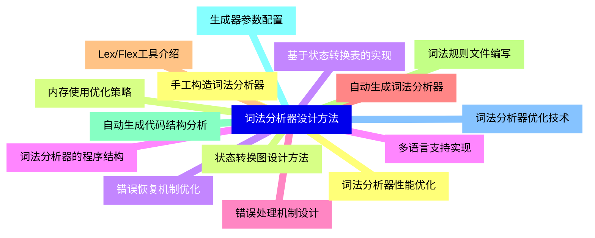
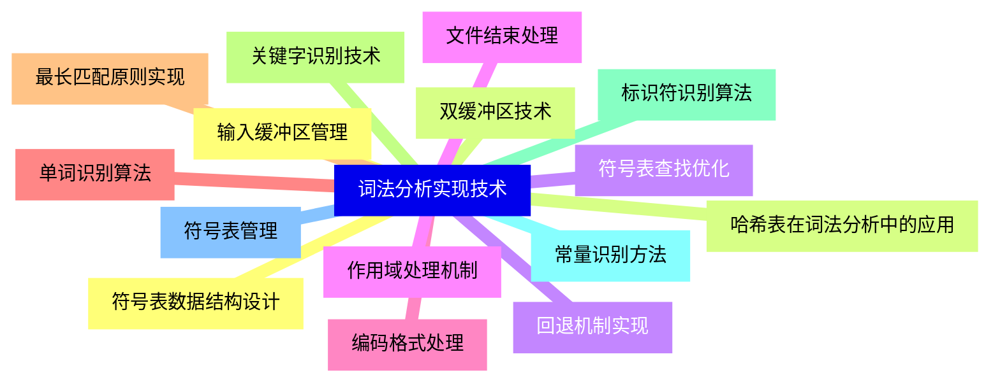
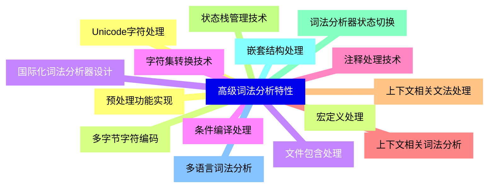
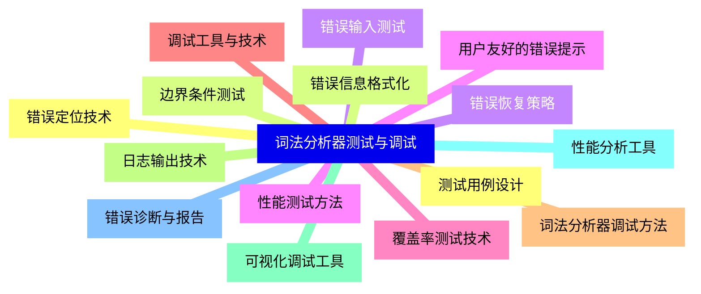
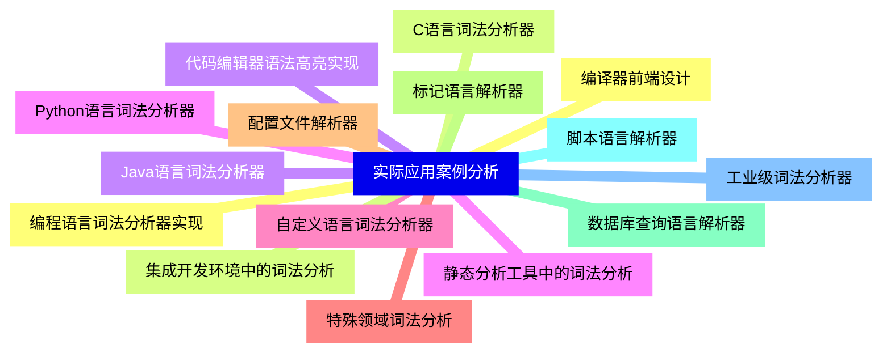


### 1 [词法分析基础理论](#1)
#### 1.1 [词法分析概述](#1)
#### 1.2 [词法分析在编译过程中的地位](#1)
#### 1.3 [词法分析器的基本功能](#1)
#### 1.4 [词法分析与语法分析的关系](#1)
#### 1.5 [词法分析器的输入输出规范](#1)
#### 1.6 [正则表达式理论基础](#1)
#### 1.7 [正则表达式基本语法](#1)
#### 1.8 [正则表达式的运算规则](#1)
#### 1.9 [正则表达式的等价变换](#1)
#### 1.10 [正则表达式的应用实例](#1)
#### 1.11 [有限自动机理论](#1)
#### 1.12 [确定有限自动机 DFA](#1)
#### 1.13 [非确定有限自动机 NFA](#1)
#### 1.14 [NFA到DFA的转换算法](#1)
#### 1.15 [有限自动机的最小化](#1)
### 2 [词法分析器设计方法](#2)
#### 2.1 [手工构造词法分析器](#2)
#### 2.2 [状态转换图设计方法](#2)
#### 2.3 [基于状态转换表的实现](#2)
#### 2.4 [词法分析器的程序结构](#2)
#### 2.5 [错误处理机制设计](#2)
#### 2.6 [自动生成词法分析器](#2)
#### 2.7 [Lex/Flex工具介绍](#2)
#### 2.8 [词法规则文件编写](#2)
#### 2.9 [自动生成代码结构分析](#2)
#### 2.10 [生成器参数配置](#2)
#### 2.11 [词法分析器优化技术](#2)
#### 2.12 [词法分析器性能优化](#2)
#### 2.13 [内存使用优化策略](#2)
#### 2.14 [错误恢复机制优化](#2)
#### 2.15 [多语言支持实现](#2)
### 3 [词法分析实现技术](#3)
#### 3.1 [输入缓冲区管理](#3)
#### 3.2 [双缓冲区技术](#3)
#### 3.3 [回退机制实现](#3)
#### 3.4 [文件结束处理](#3)
#### 3.5 [编码格式处理](#3)
#### 3.6 [单词识别算法](#3)
#### 3.7 [最长匹配原则实现](#3)
#### 3.8 [关键字识别技术](#3)
#### 3.9 [标识符识别算法](#3)
#### 3.10 [常量识别方法](#3)
#### 3.11 [符号表管理](#3)
#### 3.12 [符号表数据结构设计](#3)
#### 3.13 [哈希表在词法分析中的应用](#3)
#### 3.14 [符号表查找优化](#3)
#### 3.15 [作用域处理机制](#3)
### 4 [高级词法分析特性](#4)
#### 4.1 [预处理功能实现](#4)
#### 4.2 [宏定义处理](#4)
#### 4.3 [文件包含处理](#4)
#### 4.4 [条件编译处理](#4)
#### 4.5 [注释处理技术](#4)
#### 4.6 [上下文相关词法分析](#4)
#### 4.7 [上下文相关文法处理](#4)
#### 4.8 [状态栈管理技术](#4)
#### 4.9 [词法分析器状态切换](#4)
#### 4.10 [嵌套结构处理](#4)
#### 4.11 [多语言词法分析](#4)
#### 4.12 [Unicode字符处理](#4)
#### 4.13 [多字节字符编码](#4)
#### 4.14 [国际化词法分析器设计](#4)
#### 4.15 [字符集转换技术](#4)
### 5 [词法分析器测试与调试](#5)
#### 5.1 [测试用例设计](#5)
#### 5.2 [边界条件测试](#5)
#### 5.3 [错误输入测试](#5)
#### 5.4 [性能测试方法](#5)
#### 5.5 [覆盖率测试技术](#5)
#### 5.6 [调试工具与技术](#5)
#### 5.7 [词法分析器调试方法](#5)
#### 5.8 [日志输出技术](#5)
#### 5.9 [可视化调试工具](#5)
#### 5.10 [性能分析工具](#5)
#### 5.11 [错误诊断与报告](#5)
#### 5.12 [错误定位技术](#5)
#### 5.13 [错误信息格式化](#5)
#### 5.14 [错误恢复策略](#5)
#### 5.15 [用户友好的错误提示](#5)
### 6 [实际应用案例分析](#6)
#### 6.1 [编程语言词法分析器实现](#6)
#### 6.2 [C语言词法分析器](#6)
#### 6.3 [Java语言词法分析器](#6)
#### 6.4 [Python语言词法分析器](#6)
#### 6.5 [自定义语言词法分析器](#6)
#### 6.6 [特殊领域词法分析](#6)
#### 6.7 [配置文件解析器](#6)
#### 6.8 [标记语言解析器](#6)
#### 6.9 [数据库查询语言解析器](#6)
#### 6.10 [脚本语言解析器](#6)
#### 6.11 [工业级词法分析器](#6)
#### 6.12 [编译器前端设计](#6)
#### 6.13 [集成开发环境中的词法分析](#6)
#### 6.14 [代码编辑器语法高亮实现](#6)
#### 6.15 [静态分析工具中的词法分析](#6)




### 1 词法分析基础理论

---
### 1 词法分析基础理论
___
#### 1.1 词法分析概述
___
#### 1.2 词法分析在编译过程中的地位
___
#### 1.3 词法分析器的基本功能
___
#### 1.4 词法分析与语法分析的关系
___
#### 1.5 词法分析器的输入输出规范
___
#### 1.6 正则表达式理论基础
___
#### 1.7 正则表达式基本语法
___
#### 1.8 正则表达式的运算规则
___
#### 1.9 正则表达式的等价变换
___
#### 1.10 正则表达式的应用实例
___
#### 1.11 有限自动机理论
___
#### 1.12 确定有限自动机 DFA
___
#### 1.13 非确定有限自动机 NFA
___
#### 1.14 NFA到DFA的转换算法
___
#### 1.15 有限自动机的最小化
### 2 词法分析器设计方法

---
### 2 词法分析器设计方法
___
#### 2.1 手工构造词法分析器
___
#### 2.2 状态转换图设计方法
___
#### 2.3 基于状态转换表的实现
___
#### 2.4 词法分析器的程序结构
___
#### 2.5 错误处理机制设计
___
#### 2.6 自动生成词法分析器
___
#### 2.7 Lex/Flex工具介绍
___
#### 2.8 词法规则文件编写
___
#### 2.9 自动生成代码结构分析
___
#### 2.10 生成器参数配置
___
#### 2.11 词法分析器优化技术
___
#### 2.12 词法分析器性能优化
___
#### 2.13 内存使用优化策略
___
#### 2.14 错误恢复机制优化
___
#### 2.15 多语言支持实现
### 3 词法分析实现技术

---
### 3 词法分析实现技术
___
#### 3.1 输入缓冲区管理
___
#### 3.2 双缓冲区技术
___
#### 3.3 回退机制实现
___
#### 3.4 文件结束处理
___
#### 3.5 编码格式处理
___
#### 3.6 单词识别算法
___
#### 3.7 最长匹配原则实现
___
#### 3.8 关键字识别技术
___
#### 3.9 标识符识别算法
___
#### 3.10 常量识别方法
___
#### 3.11 符号表管理
___
#### 3.12 符号表数据结构设计
___
#### 3.13 哈希表在词法分析中的应用
___
#### 3.14 符号表查找优化
___
#### 3.15 作用域处理机制
### 4 高级词法分析特性

---
### 4 高级词法分析特性
___
#### 4.1 预处理功能实现
___
#### 4.2 宏定义处理
___
#### 4.3 文件包含处理
___
#### 4.4 条件编译处理
___
#### 4.5 注释处理技术
___
#### 4.6 上下文相关词法分析
___
#### 4.7 上下文相关文法处理
___
#### 4.8 状态栈管理技术
___
#### 4.9 词法分析器状态切换
___
#### 4.10 嵌套结构处理
___
#### 4.11 多语言词法分析
___
#### 4.12 Unicode字符处理
___
#### 4.13 多字节字符编码
___
#### 4.14 国际化词法分析器设计
___
#### 4.15 字符集转换技术
### 5 词法分析器测试与调试

---
### 5 词法分析器测试与调试
___
#### 5.1 测试用例设计
___
#### 5.2 边界条件测试
___
#### 5.3 错误输入测试
___
#### 5.4 性能测试方法
___
#### 5.5 覆盖率测试技术
___
#### 5.6 调试工具与技术
___
#### 5.7 词法分析器调试方法
___
#### 5.8 日志输出技术
___
#### 5.9 可视化调试工具
___
#### 5.10 性能分析工具
___
#### 5.11 错误诊断与报告
___
#### 5.12 错误定位技术
___
#### 5.13 错误信息格式化
___
#### 5.14 错误恢复策略
___
#### 5.15 用户友好的错误提示
### 6 实际应用案例分析

---
### 6 实际应用案例分析
___
#### 6.1 编程语言词法分析器实现
___
#### 6.2 C语言词法分析器
___
#### 6.3 Java语言词法分析器
___
#### 6.4 Python语言词法分析器
___
#### 6.5 自定义语言词法分析器
___
#### 6.6 特殊领域词法分析
___
#### 6.7 配置文件解析器
___
#### 6.8 标记语言解析器
___
#### 6.9 数据库查询语言解析器
___
#### 6.10 脚本语言解析器
___
#### 6.11 工业级词法分析器
___
#### 6.12 编译器前端设计
___
#### 6.13 集成开发环境中的词法分析
___
#### 6.14 代码编辑器语法高亮实现
___
#### 6.15 静态分析工具中的词法分析


### 1 词法分析基础理论{#1}

{}

<--->
{}
{}
{}
{}
{}
{}
{}
{}
{}
{}
{}
{}
{}
{}
{}
{}
{}
{}
{}
{}
{}
{}
{}
{}
{}
{}
{}
{}
{}
{}
{}

### 2 词法分析器设计方法{#2}

{}
{}
{}
{}
{}
{}
{}
{}
{}
{}
{}
{}
{}
{}
{}
{}
{}
{}
{}
{}
{}
{}
{}
{}
{}
{}
{}
{}
{}
{}
{}
<--->

{}

### 3 词法分析实现技术{#3}

{}

<--->
{}
{}
{}
{}
{}
{}
{}
{}
{}
{}
{}
{}
{}
{}
{}
{}
{}
{}
{}
{}
{}
{}
{}
{}
{}
{}
{}
{}
{}
{}
{}

### 4 高级词法分析特性{#4}

{}
{}
{}
{}
{}
{}
{}
{}
{}
{}
{}
{}
{}
{}
{}
{}
{}
{}
{}
{}
{}
{}
{}
{}
{}
{}
{}
{}
{}
{}
{}
<--->

{}

### 5 词法分析器测试与调试{#5}

{}

<--->
{}
{}
{}
{}
{}
{}
{}
{}
{}
{}
{}
{}
{}
{}
{}
{}
{}
{}
{}
{}
{}
{}
{}
{}
{}
{}
{}
{}
{}
{}
{}

### 6 实际应用案例分析{#6}

{}
{}
{}
{}
{}
{}
{}
{}
{}
{}
{}
{}
{}
{}
{}
{}
{}
{}
{}
{}
{}
{}
{}
{}
{}
{}
{}
{}
{}
{}
{}
<--->

{}
