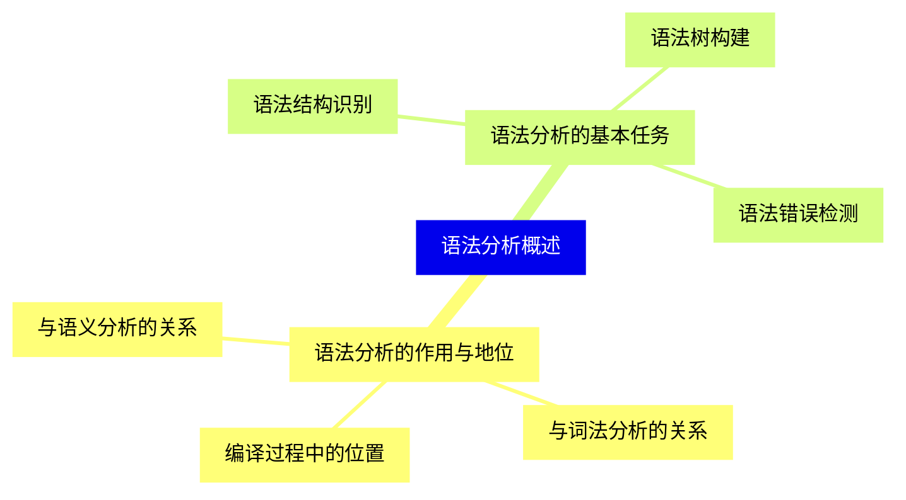
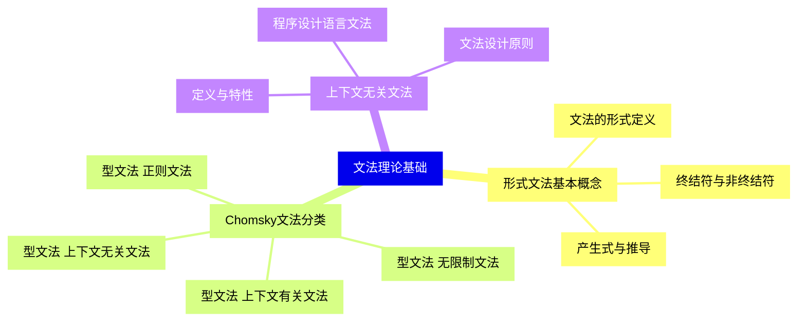
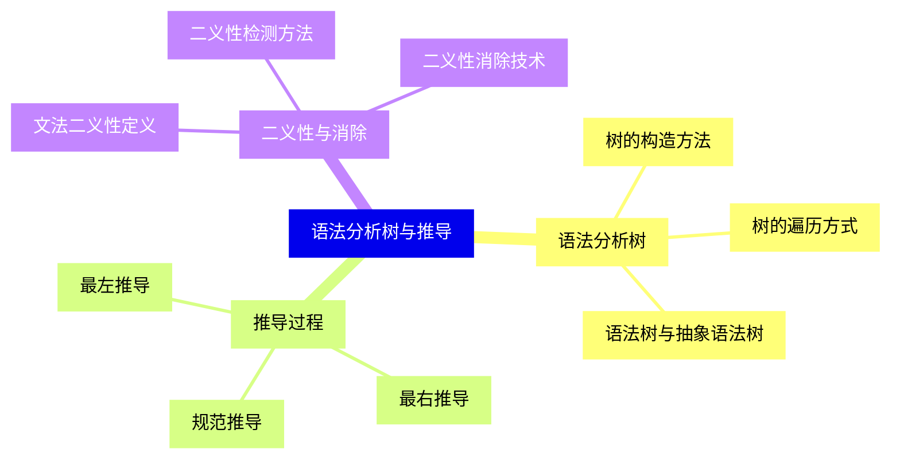
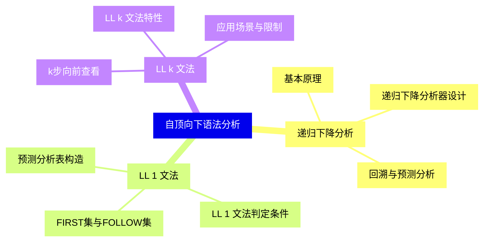
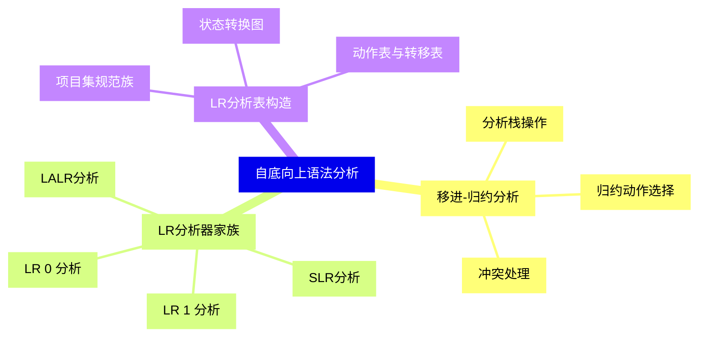
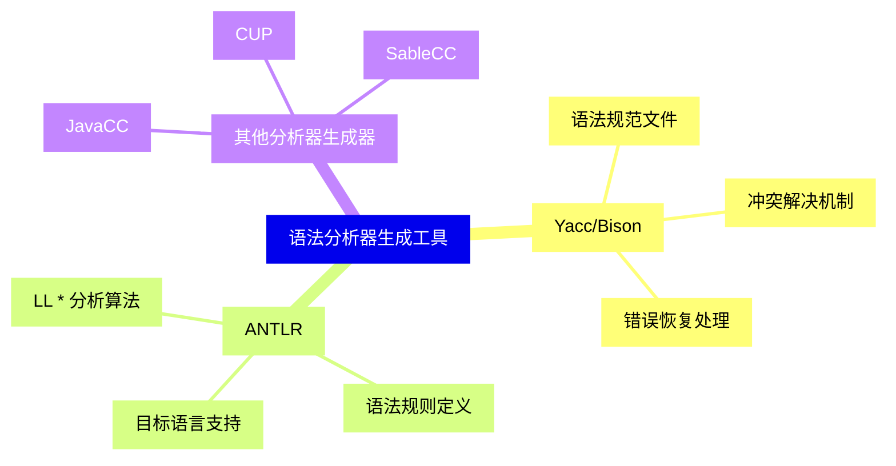
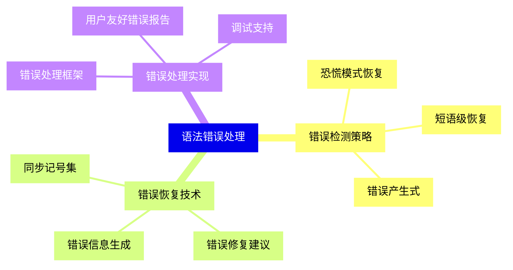
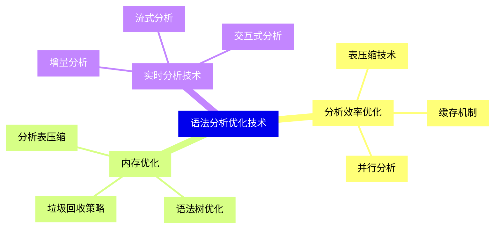
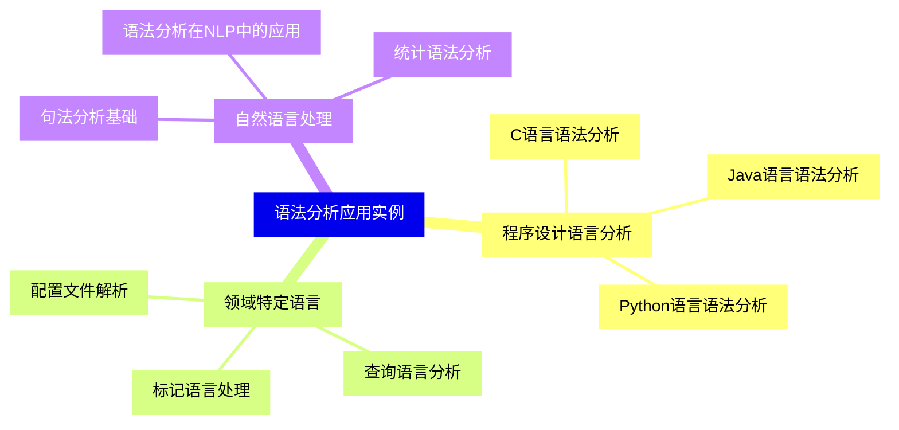
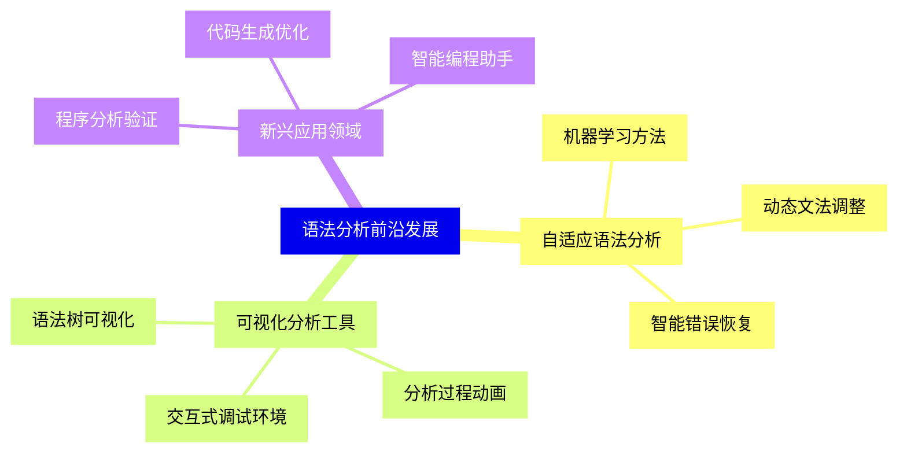


### 1 [语法分析概述](#1)
#### 1.1 [语法分析的作用与地位](#1)
##### 1.1.1 [编译过程中的位置](#1)
##### 1.1.2 [与词法分析的关系](#1)
##### 1.1.3 [与语义分析的关系](#1)
#### 1.2 [语法分析的基本任务](#1)
##### 1.2.1 [语法结构识别](#1)
##### 1.2.2 [语法错误检测](#1)
##### 1.2.3 [语法树构建](#1)
### 2 [文法理论基础](#2)
#### 2.1 [形式文法基本概念](#2)
##### 2.1.1 [文法的形式定义](#2)
##### 2.1.2 [终结符与非终结符](#2)
##### 2.1.3 [产生式与推导](#2)
#### 2.2 [Chomsky文法分类](#2)
##### 2.2.1 [型文法 无限制文法](#2)
##### 2.2.2 [型文法 上下文有关文法](#2)
##### 2.2.3 [型文法 上下文无关文法](#2)
##### 2.2.4 [型文法 正则文法](#2)
#### 2.3 [上下文无关文法](#2)
##### 2.3.1 [定义与特性](#2)
##### 2.3.2 [程序设计语言文法](#2)
##### 2.3.3 [文法设计原则](#2)
### 3 [语法分析树与推导](#3)
#### 3.1 [语法分析树](#3)
##### 3.1.1 [树的构造方法](#3)
##### 3.1.2 [树的遍历方式](#3)
##### 3.1.3 [语法树与抽象语法树](#3)
#### 3.2 [推导过程](#3)
##### 3.2.1 [最左推导](#3)
##### 3.2.2 [最右推导](#3)
##### 3.2.3 [规范推导](#3)
#### 3.3 [二义性与消除](#3)
##### 3.3.1 [文法二义性定义](#3)
##### 3.3.2 [二义性检测方法](#3)
##### 3.3.3 [二义性消除技术](#3)
### 4 [自顶向下语法分析](#4)
#### 4.1 [递归下降分析](#4)
##### 4.1.1 [基本原理](#4)
##### 4.1.2 [递归下降分析器设计](#4)
##### 4.1.3 [回溯与预测分析](#4)
#### 4.2 [LL 1 文法](#4)
##### 4.2.1 [FIRST集与FOLLOW集](#4)
##### 4.2.2 [LL 1 文法判定条件](#4)
##### 4.2.3 [预测分析表构造](#4)
#### 4.3 [LL k 文法](#4)
##### 4.3.1 [k步向前查看](#4)
##### 4.3.2 [LL k 文法特性](#4)
##### 4.3.3 [应用场景与限制](#4)
### 5 [自底向上语法分析](#5)
#### 5.1 [移进-归约分析](#5)
##### 5.1.1 [分析栈操作](#5)
##### 5.1.2 [归约动作选择](#5)
##### 5.1.3 [冲突处理](#5)
#### 5.2 [LR分析器家族](#5)
##### 5.2.1 [LR 0 分析](#5)
##### 5.2.2 [SLR分析](#5)
##### 5.2.3 [LR 1 分析](#5)
##### 5.2.4 [LALR分析](#5)
#### 5.3 [LR分析表构造](#5)
##### 5.3.1 [项目集规范族](#5)
##### 5.3.2 [状态转换图](#5)
##### 5.3.3 [动作表与转移表](#5)
### 6 [语法分析器生成工具](#6)
#### 6.1 [Yacc/Bison](#6)
##### 6.1.1 [语法规范文件](#6)
##### 6.1.2 [冲突解决机制](#6)
##### 6.1.3 [错误恢复处理](#6)
#### 6.2 [ANTLR](#6)
##### 6.2.1 [LL * 分析算法](#6)
##### 6.2.2 [语法规则定义](#6)
##### 6.2.3 [目标语言支持](#6)
#### 6.3 [其他分析器生成器](#6)
##### 6.3.1 [JavaCC](#6)
##### 6.3.2 [CUP](#6)
##### 6.3.3 [SableCC](#6)
### 7 [语法错误处理](#7)
#### 7.1 [错误检测策略](#7)
##### 7.1.1 [恐慌模式恢复](#7)
##### 7.1.2 [短语级恢复](#7)
##### 7.1.3 [错误产生式](#7)
#### 7.2 [错误恢复技术](#7)
##### 7.2.1 [同步记号集](#7)
##### 7.2.2 [错误修复建议](#7)
##### 7.2.3 [错误信息生成](#7)
#### 7.3 [错误处理实现](#7)
##### 7.3.1 [错误处理框架](#7)
##### 7.3.2 [用户友好错误报告](#7)
##### 7.3.3 [调试支持](#7)
### 8 [语法分析优化技术](#8)
#### 8.1 [分析效率优化](#8)
##### 8.1.1 [表压缩技术](#8)
##### 8.1.2 [缓存机制](#8)
##### 8.1.3 [并行分析](#8)
#### 8.2 [内存优化](#8)
##### 8.2.1 [分析表压缩](#8)
##### 8.2.2 [语法树优化](#8)
##### 8.2.3 [垃圾回收策略](#8)
#### 8.3 [实时分析技术](#8)
##### 8.3.1 [增量分析](#8)
##### 8.3.2 [流式分析](#8)
##### 8.3.3 [交互式分析](#8)
### 9 [语法分析应用实例](#9)
#### 9.1 [程序设计语言分析](#9)
##### 9.1.1 [C语言语法分析](#9)
##### 9.1.2 [Java语言语法分析](#9)
##### 9.1.3 [Python语言语法分析](#9)
#### 9.2 [领域特定语言](#9)
##### 9.2.1 [配置文件解析](#9)
##### 9.2.2 [查询语言分析](#9)
##### 9.2.3 [标记语言处理](#9)
#### 9.3 [自然语言处理](#9)
##### 9.3.1 [句法分析基础](#9)
##### 9.3.2 [语法分析在NLP中的应用](#9)
##### 9.3.3 [统计语法分析](#9)
### 10 [语法分析前沿发展](#10)
#### 10.1 [自适应语法分析](#10)
##### 10.1.1 [机器学习方法](#10)
##### 10.1.2 [动态文法调整](#10)
##### 10.1.3 [智能错误恢复](#10)
#### 10.2 [可视化分析工具](#10)
##### 10.2.1 [语法树可视化](#10)
##### 10.2.2 [分析过程动画](#10)
##### 10.2.3 [交互式调试环境](#10)
#### 10.3 [新兴应用领域](#10)
##### 10.3.1 [程序分析验证](#10)
##### 10.3.2 [代码生成优化](#10)
##### 10.3.3 [智能编程助手](#10)




### 1 语法分析概述

---
### 1 语法分析概述
___
#### 1.1 语法分析的作用与地位
___
##### 1.1.1 编译过程中的位置
___
##### 1.1.2 与词法分析的关系
___
##### 1.1.3 与语义分析的关系
___
#### 1.2 语法分析的基本任务
___
##### 1.2.1 语法结构识别
___
##### 1.2.2 语法错误检测
___
##### 1.2.3 语法树构建
### 2 文法理论基础

---
### 2 文法理论基础
___
#### 2.1 形式文法基本概念
___
##### 2.1.1 文法的形式定义
___
##### 2.1.2 终结符与非终结符
___
##### 2.1.3 产生式与推导
___
#### 2.2 Chomsky文法分类
___
##### 2.2.1 型文法 无限制文法
___
##### 2.2.2 型文法 上下文有关文法
___
##### 2.2.3 型文法 上下文无关文法
___
##### 2.2.4 型文法 正则文法
___
#### 2.3 上下文无关文法
___
##### 2.3.1 定义与特性
___
##### 2.3.2 程序设计语言文法
___
##### 2.3.3 文法设计原则
### 3 语法分析树与推导

---
### 3 语法分析树与推导
___
#### 3.1 语法分析树
___
##### 3.1.1 树的构造方法
___
##### 3.1.2 树的遍历方式
___
##### 3.1.3 语法树与抽象语法树
___
#### 3.2 推导过程
___
##### 3.2.1 最左推导
___
##### 3.2.2 最右推导
___
##### 3.2.3 规范推导
___
#### 3.3 二义性与消除
___
##### 3.3.1 文法二义性定义
___
##### 3.3.2 二义性检测方法
___
##### 3.3.3 二义性消除技术
### 4 自顶向下语法分析

---
### 4 自顶向下语法分析
___
#### 4.1 递归下降分析
___
##### 4.1.1 基本原理
___
##### 4.1.2 递归下降分析器设计
___
##### 4.1.3 回溯与预测分析
___
#### 4.2 LL 1 文法
___
##### 4.2.1 FIRST集与FOLLOW集
___
##### 4.2.2 LL 1 文法判定条件
___
##### 4.2.3 预测分析表构造
___
#### 4.3 LL k 文法
___
##### 4.3.1 k步向前查看
___
##### 4.3.2 LL k 文法特性
___
##### 4.3.3 应用场景与限制
### 5 自底向上语法分析

---
### 5 自底向上语法分析
___
#### 5.1 移进-归约分析
___
##### 5.1.1 分析栈操作
___
##### 5.1.2 归约动作选择
___
##### 5.1.3 冲突处理
___
#### 5.2 LR分析器家族
___
##### 5.2.1 LR 0 分析
___
##### 5.2.2 SLR分析
___
##### 5.2.3 LR 1 分析
___
##### 5.2.4 LALR分析
___
#### 5.3 LR分析表构造
___
##### 5.3.1 项目集规范族
___
##### 5.3.2 状态转换图
___
##### 5.3.3 动作表与转移表
### 6 语法分析器生成工具

---
### 6 语法分析器生成工具
___
#### 6.1 Yacc/Bison
___
##### 6.1.1 语法规范文件
___
##### 6.1.2 冲突解决机制
___
##### 6.1.3 错误恢复处理
___
#### 6.2 ANTLR
___
##### 6.2.1 LL * 分析算法
___
##### 6.2.2 语法规则定义
___
##### 6.2.3 目标语言支持
___
#### 6.3 其他分析器生成器
___
##### 6.3.1 JavaCC
___
##### 6.3.2 CUP
___
##### 6.3.3 SableCC
### 7 语法错误处理

---
### 7 语法错误处理
___
#### 7.1 错误检测策略
___
##### 7.1.1 恐慌模式恢复
___
##### 7.1.2 短语级恢复
___
##### 7.1.3 错误产生式
___
#### 7.2 错误恢复技术
___
##### 7.2.1 同步记号集
___
##### 7.2.2 错误修复建议
___
##### 7.2.3 错误信息生成
___
#### 7.3 错误处理实现
___
##### 7.3.1 错误处理框架
___
##### 7.3.2 用户友好错误报告
___
##### 7.3.3 调试支持
### 8 语法分析优化技术

---
### 8 语法分析优化技术
___
#### 8.1 分析效率优化
___
##### 8.1.1 表压缩技术
___
##### 8.1.2 缓存机制
___
##### 8.1.3 并行分析
___
#### 8.2 内存优化
___
##### 8.2.1 分析表压缩
___
##### 8.2.2 语法树优化
___
##### 8.2.3 垃圾回收策略
___
#### 8.3 实时分析技术
___
##### 8.3.1 增量分析
___
##### 8.3.2 流式分析
___
##### 8.3.3 交互式分析
### 9 语法分析应用实例

---
### 9 语法分析应用实例
___
#### 9.1 程序设计语言分析
___
##### 9.1.1 C语言语法分析
___
##### 9.1.2 Java语言语法分析
___
##### 9.1.3 Python语言语法分析
___
#### 9.2 领域特定语言
___
##### 9.2.1 配置文件解析
___
##### 9.2.2 查询语言分析
___
##### 9.2.3 标记语言处理
___
#### 9.3 自然语言处理
___
##### 9.3.1 句法分析基础
___
##### 9.3.2 语法分析在NLP中的应用
___
##### 9.3.3 统计语法分析
### 10 语法分析前沿发展

---
### 10 语法分析前沿发展
___
#### 10.1 自适应语法分析
___
##### 10.1.1 机器学习方法
___
##### 10.1.2 动态文法调整
___
##### 10.1.3 智能错误恢复
___
#### 10.2 可视化分析工具
___
##### 10.2.1 语法树可视化
___
##### 10.2.2 分析过程动画
___
##### 10.2.3 交互式调试环境
___
#### 10.3 新兴应用领域
___
##### 10.3.1 程序分析验证
___
##### 10.3.2 代码生成优化
___
##### 10.3.3 智能编程助手


### 1 语法分析概述{#1}

{}

<--->
{}
{}
{}
{}
{}
{}
{}
{}
{}
{}
{}
{}
{}
{}
{}
{}
{}

### 2 文法理论基础{#2}

{}
{}
{}
{}
{}
{}
{}
{}
{}
{}
{}
{}
{}
{}
{}
{}
{}
{}
{}
{}
{}
{}
{}
{}
{}
{}
{}
<--->

{}

### 3 语法分析树与推导{#3}

{}

<--->
{}
{}
{}
{}
{}
{}
{}
{}
{}
{}
{}
{}
{}
{}
{}
{}
{}
{}
{}
{}
{}
{}
{}
{}
{}

### 4 自顶向下语法分析{#4}

{}
{}
{}
{}
{}
{}
{}
{}
{}
{}
{}
{}
{}
{}
{}
{}
{}
{}
{}
{}
{}
{}
{}
{}
{}
<--->

{}

### 5 自底向上语法分析{#5}

{}

<--->
{}
{}
{}
{}
{}
{}
{}
{}
{}
{}
{}
{}
{}
{}
{}
{}
{}
{}
{}
{}
{}
{}
{}
{}
{}
{}
{}

### 6 语法分析器生成工具{#6}

{}
{}
{}
{}
{}
{}
{}
{}
{}
{}
{}
{}
{}
{}
{}
{}
{}
{}
{}
{}
{}
{}
{}
{}
{}
<--->

{}

### 7 语法错误处理{#7}

{}

<--->
{}
{}
{}
{}
{}
{}
{}
{}
{}
{}
{}
{}
{}
{}
{}
{}
{}
{}
{}
{}
{}
{}
{}
{}
{}

### 8 语法分析优化技术{#8}

{}
{}
{}
{}
{}
{}
{}
{}
{}
{}
{}
{}
{}
{}
{}
{}
{}
{}
{}
{}
{}
{}
{}
{}
{}
<--->

{}

### 9 语法分析应用实例{#9}

{}

<--->
{}
{}
{}
{}
{}
{}
{}
{}
{}
{}
{}
{}
{}
{}
{}
{}
{}
{}
{}
{}
{}
{}
{}
{}
{}

### 10 语法分析前沿发展{#10}

{}
{}
{}
{}
{}
{}
{}
{}
{}
{}
{}
{}
{}
{}
{}
{}
{}
{}
{}
{}
{}
{}
{}
{}
{}
<--->

{}
