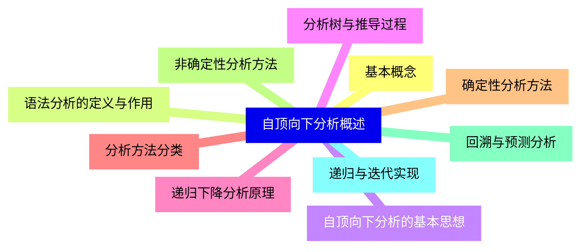
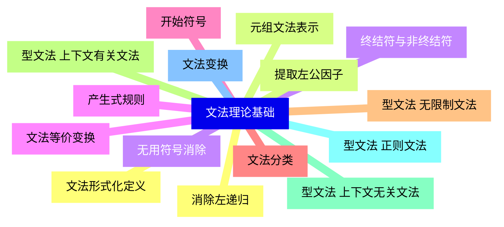
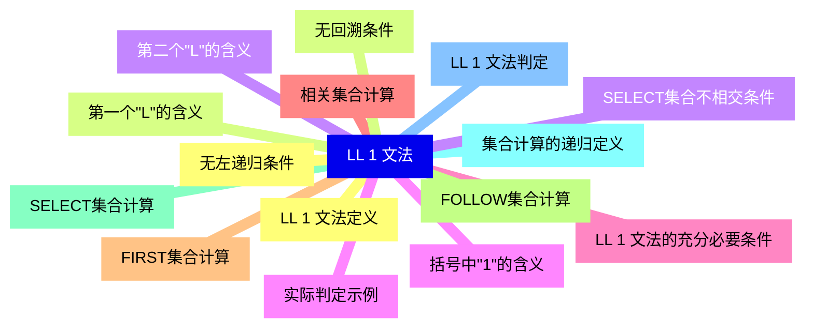
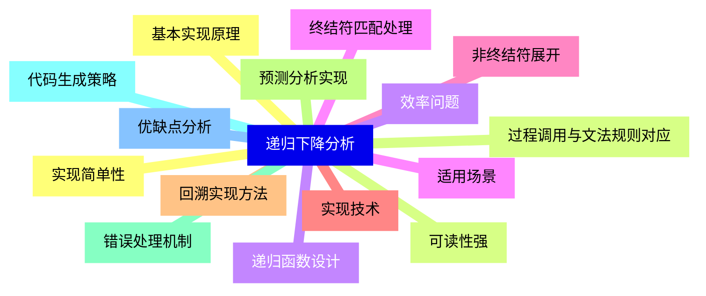
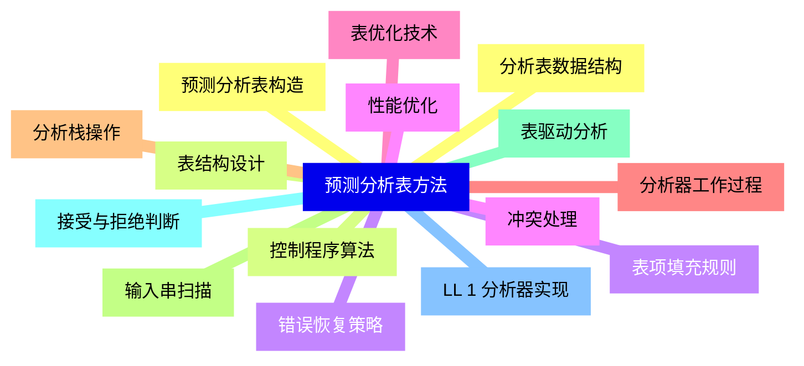
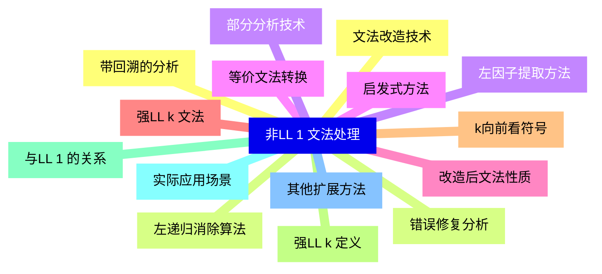
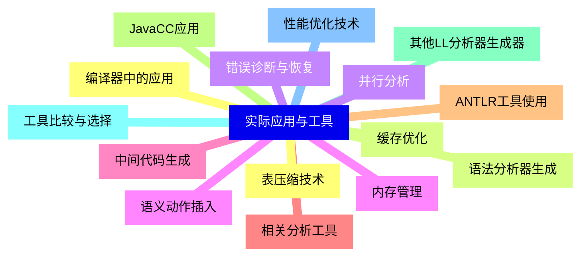
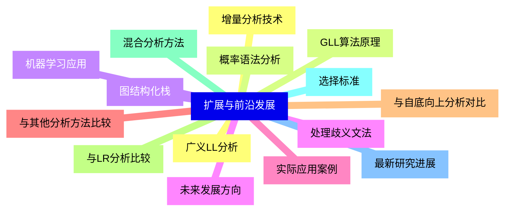


### 1 [自顶向下分析概述](#1)
#### 1.1 [基本概念](#1)
#### 1.2 [语法分析的定义与作用](#1)
#### 1.3 [自顶向下分析的基本思想](#1)
#### 1.4 [分析树与推导过程](#1)
#### 1.5 [递归下降分析原理](#1)
#### 1.6 [分析方法分类](#1)
#### 1.7 [确定性分析方法](#1)
#### 1.8 [非确定性分析方法](#1)
#### 1.9 [回溯与预测分析](#1)
#### 1.10 [递归与迭代实现](#1)
### 2 [文法理论基础](#2)
#### 2.1 [文法形式化定义](#2)
#### 2.2 [元组文法表示](#2)
#### 2.3 [终结符与非终结符](#2)
#### 2.4 [产生式规则](#2)
#### 2.5 [开始符号](#2)
#### 2.6 [文法分类](#2)
#### 2.7 [型文法 无限制文法](#2)
#### 2.8 [型文法 上下文有关文法](#2)
#### 2.9 [型文法 上下文无关文法](#2)
#### 2.10 [型文法 正则文法](#2)
#### 2.11 [文法变换](#2)
#### 2.12 [消除左递归](#2)
#### 2.13 [提取左公因子](#2)
#### 2.14 [无用符号消除](#2)
#### 2.15 [文法等价变换](#2)
### 3 [LL 1 文法](#3)
#### 3.1 [LL 1 文法定义](#3)
#### 3.2 [第一个"L"的含义](#3)
#### 3.3 [第二个"L"的含义](#3)
#### 3.4 [括号中"1"的含义](#3)
#### 3.5 [LL 1 文法的充分必要条件](#3)
#### 3.6 [相关集合计算](#3)
#### 3.7 [FIRST集合计算](#3)
#### 3.8 [FOLLOW集合计算](#3)
#### 3.9 [SELECT集合计算](#3)
#### 3.10 [集合计算的递归定义](#3)
#### 3.11 [LL 1 文法判定](#3)
#### 3.12 [无左递归条件](#3)
#### 3.13 [无回溯条件](#3)
#### 3.14 [SELECT集合不相交条件](#3)
#### 3.15 [实际判定示例](#3)
### 4 [递归下降分析](#4)
#### 4.1 [基本实现原理](#4)
#### 4.2 [过程调用与文法规则对应](#4)
#### 4.3 [递归函数设计](#4)
#### 4.4 [终结符匹配处理](#4)
#### 4.5 [非终结符展开](#4)
#### 4.6 [实现技术](#4)
#### 4.7 [回溯实现方法](#4)
#### 4.8 [预测分析实现](#4)
#### 4.9 [错误处理机制](#4)
#### 4.10 [代码生成策略](#4)
#### 4.11 [优缺点分析](#4)
#### 4.12 [实现简单性](#4)
#### 4.13 [可读性强](#4)
#### 4.14 [效率问题](#4)
#### 4.15 [适用场景](#4)
### 5 [预测分析表方法](#5)
#### 5.1 [预测分析表构造](#5)
#### 5.2 [表结构设计](#5)
#### 5.3 [表项填充规则](#5)
#### 5.4 [冲突处理](#5)
#### 5.5 [表优化技术](#5)
#### 5.6 [分析器工作过程](#5)
#### 5.7 [分析栈操作](#5)
#### 5.8 [输入串扫描](#5)
#### 5.9 [表驱动分析](#5)
#### 5.10 [接受与拒绝判断](#5)
#### 5.11 [LL 1 分析器实现](#5)
#### 5.12 [分析表数据结构](#5)
#### 5.13 [控制程序算法](#5)
#### 5.14 [错误恢复策略](#5)
#### 5.15 [性能优化](#5)
### 6 [非LL 1 文法处理](#6)
#### 6.1 [文法改造技术](#6)
#### 6.2 [左递归消除算法](#6)
#### 6.3 [左因子提取方法](#6)
#### 6.4 [等价文法转换](#6)
#### 6.5 [改造后文法性质](#6)
#### 6.6 [强LL k 文法](#6)
#### 6.7 [k向前看符号](#6)
#### 6.8 [强LL k 定义](#6)
#### 6.9 [与LL 1 的关系](#6)
#### 6.10 [实际应用场景](#6)
#### 6.11 [其他扩展方法](#6)
#### 6.12 [带回溯的分析](#6)
#### 6.13 [错误修复分析](#6)
#### 6.14 [部分分析技术](#6)
#### 6.15 [启发式方法](#6)
### 7 [实际应用与工具](#7)
#### 7.1 [编译器中的应用](#7)
#### 7.2 [语法分析器生成](#7)
#### 7.3 [错误诊断与恢复](#7)
#### 7.4 [语义动作插入](#7)
#### 7.5 [中间代码生成](#7)
#### 7.6 [相关分析工具](#7)
#### 7.7 [ANTLR工具使用](#7)
#### 7.8 [JavaCC应用](#7)
#### 7.9 [其他LL分析器生成器](#7)
#### 7.10 [工具比较与选择](#7)
#### 7.11 [性能优化技术](#7)
#### 7.12 [表压缩技术](#7)
#### 7.13 [缓存优化](#7)
#### 7.14 [并行分析](#7)
#### 7.15 [内存管理](#7)
### 8 [扩展与前沿发展](#8)
#### 8.1 [广义LL分析](#8)
#### 8.2 [GLL算法原理](#8)
#### 8.3 [图结构化栈](#8)
#### 8.4 [处理歧义文法](#8)
#### 8.5 [实际应用案例](#8)
#### 8.6 [与其他分析方法比较](#8)
#### 8.7 [与自底向上分析对比](#8)
#### 8.8 [与LR分析比较](#8)
#### 8.9 [混合分析方法](#8)
#### 8.10 [选择标准](#8)
#### 8.11 [最新研究进展](#8)
#### 8.12 [增量分析技术](#8)
#### 8.13 [概率语法分析](#8)
#### 8.14 [机器学习应用](#8)
#### 8.15 [未来发展方向](#8)




### 1 自顶向下分析概述

---
### 1 自顶向下分析概述
___
#### 1.1 基本概念
___
#### 1.2 语法分析的定义与作用
___
#### 1.3 自顶向下分析的基本思想
___
#### 1.4 分析树与推导过程
___
#### 1.5 递归下降分析原理
___
#### 1.6 分析方法分类
___
#### 1.7 确定性分析方法
___
#### 1.8 非确定性分析方法
___
#### 1.9 回溯与预测分析
___
#### 1.10 递归与迭代实现
### 2 文法理论基础

---
### 2 文法理论基础
___
#### 2.1 文法形式化定义
___
#### 2.2 元组文法表示
___
#### 2.3 终结符与非终结符
___
#### 2.4 产生式规则
___
#### 2.5 开始符号
___
#### 2.6 文法分类
___
#### 2.7 型文法 无限制文法
___
#### 2.8 型文法 上下文有关文法
___
#### 2.9 型文法 上下文无关文法
___
#### 2.10 型文法 正则文法
___
#### 2.11 文法变换
___
#### 2.12 消除左递归
___
#### 2.13 提取左公因子
___
#### 2.14 无用符号消除
___
#### 2.15 文法等价变换
### 3 LL 1 文法

---
### 3 LL 1 文法
___
#### 3.1 LL 1 文法定义
___
#### 3.2 第一个"L"的含义
___
#### 3.3 第二个"L"的含义
___
#### 3.4 括号中"1"的含义
___
#### 3.5 LL 1 文法的充分必要条件
___
#### 3.6 相关集合计算
___
#### 3.7 FIRST集合计算
___
#### 3.8 FOLLOW集合计算
___
#### 3.9 SELECT集合计算
___
#### 3.10 集合计算的递归定义
___
#### 3.11 LL 1 文法判定
___
#### 3.12 无左递归条件
___
#### 3.13 无回溯条件
___
#### 3.14 SELECT集合不相交条件
___
#### 3.15 实际判定示例
### 4 递归下降分析

---
### 4 递归下降分析
___
#### 4.1 基本实现原理
___
#### 4.2 过程调用与文法规则对应
___
#### 4.3 递归函数设计
___
#### 4.4 终结符匹配处理
___
#### 4.5 非终结符展开
___
#### 4.6 实现技术
___
#### 4.7 回溯实现方法
___
#### 4.8 预测分析实现
___
#### 4.9 错误处理机制
___
#### 4.10 代码生成策略
___
#### 4.11 优缺点分析
___
#### 4.12 实现简单性
___
#### 4.13 可读性强
___
#### 4.14 效率问题
___
#### 4.15 适用场景
### 5 预测分析表方法

---
### 5 预测分析表方法
___
#### 5.1 预测分析表构造
___
#### 5.2 表结构设计
___
#### 5.3 表项填充规则
___
#### 5.4 冲突处理
___
#### 5.5 表优化技术
___
#### 5.6 分析器工作过程
___
#### 5.7 分析栈操作
___
#### 5.8 输入串扫描
___
#### 5.9 表驱动分析
___
#### 5.10 接受与拒绝判断
___
#### 5.11 LL 1 分析器实现
___
#### 5.12 分析表数据结构
___
#### 5.13 控制程序算法
___
#### 5.14 错误恢复策略
___
#### 5.15 性能优化
### 6 非LL 1 文法处理

---
### 6 非LL 1 文法处理
___
#### 6.1 文法改造技术
___
#### 6.2 左递归消除算法
___
#### 6.3 左因子提取方法
___
#### 6.4 等价文法转换
___
#### 6.5 改造后文法性质
___
#### 6.6 强LL k 文法
___
#### 6.7 k向前看符号
___
#### 6.8 强LL k 定义
___
#### 6.9 与LL 1 的关系
___
#### 6.10 实际应用场景
___
#### 6.11 其他扩展方法
___
#### 6.12 带回溯的分析
___
#### 6.13 错误修复分析
___
#### 6.14 部分分析技术
___
#### 6.15 启发式方法
### 7 实际应用与工具

---
### 7 实际应用与工具
___
#### 7.1 编译器中的应用
___
#### 7.2 语法分析器生成
___
#### 7.3 错误诊断与恢复
___
#### 7.4 语义动作插入
___
#### 7.5 中间代码生成
___
#### 7.6 相关分析工具
___
#### 7.7 ANTLR工具使用
___
#### 7.8 JavaCC应用
___
#### 7.9 其他LL分析器生成器
___
#### 7.10 工具比较与选择
___
#### 7.11 性能优化技术
___
#### 7.12 表压缩技术
___
#### 7.13 缓存优化
___
#### 7.14 并行分析
___
#### 7.15 内存管理
### 8 扩展与前沿发展

---
### 8 扩展与前沿发展
___
#### 8.1 广义LL分析
___
#### 8.2 GLL算法原理
___
#### 8.3 图结构化栈
___
#### 8.4 处理歧义文法
___
#### 8.5 实际应用案例
___
#### 8.6 与其他分析方法比较
___
#### 8.7 与自底向上分析对比
___
#### 8.8 与LR分析比较
___
#### 8.9 混合分析方法
___
#### 8.10 选择标准
___
#### 8.11 最新研究进展
___
#### 8.12 增量分析技术
___
#### 8.13 概率语法分析
___
#### 8.14 机器学习应用
___
#### 8.15 未来发展方向


### 1 自顶向下分析概述{#1}

{}

<--->
{}
{}
{}
{}
{}
{}
{}
{}
{}
{}
{}
{}
{}
{}
{}
{}
{}
{}
{}
{}
{}

### 2 文法理论基础{#2}

{}
{}
{}
{}
{}
{}
{}
{}
{}
{}
{}
{}
{}
{}
{}
{}
{}
{}
{}
{}
{}
{}
{}
{}
{}
{}
{}
{}
{}
{}
{}
<--->

{}

### 3 LL 1 文法{#3}

{}

<--->
{}
{}
{}
{}
{}
{}
{}
{}
{}
{}
{}
{}
{}
{}
{}
{}
{}
{}
{}
{}
{}
{}
{}
{}
{}
{}
{}
{}
{}
{}
{}

### 4 递归下降分析{#4}

{}
{}
{}
{}
{}
{}
{}
{}
{}
{}
{}
{}
{}
{}
{}
{}
{}
{}
{}
{}
{}
{}
{}
{}
{}
{}
{}
{}
{}
{}
{}
<--->

{}

### 5 预测分析表方法{#5}

{}

<--->
{}
{}
{}
{}
{}
{}
{}
{}
{}
{}
{}
{}
{}
{}
{}
{}
{}
{}
{}
{}
{}
{}
{}
{}
{}
{}
{}
{}
{}
{}
{}

### 6 非LL 1 文法处理{#6}

{}
{}
{}
{}
{}
{}
{}
{}
{}
{}
{}
{}
{}
{}
{}
{}
{}
{}
{}
{}
{}
{}
{}
{}
{}
{}
{}
{}
{}
{}
{}
<--->

{}

### 7 实际应用与工具{#7}

{}

<--->
{}
{}
{}
{}
{}
{}
{}
{}
{}
{}
{}
{}
{}
{}
{}
{}
{}
{}
{}
{}
{}
{}
{}
{}
{}
{}
{}
{}
{}
{}
{}

### 8 扩展与前沿发展{#8}

{}
{}
{}
{}
{}
{}
{}
{}
{}
{}
{}
{}
{}
{}
{}
{}
{}
{}
{}
{}
{}
{}
{}
{}
{}
{}
{}
{}
{}
{}
{}
<--->

{}
