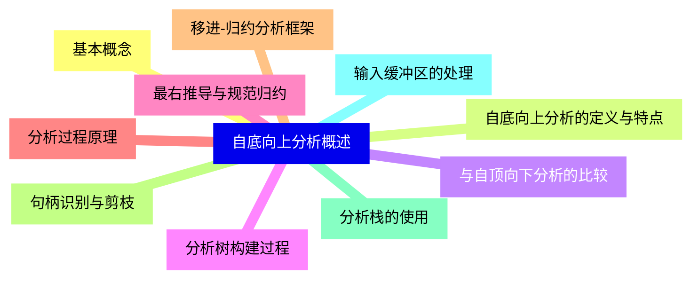
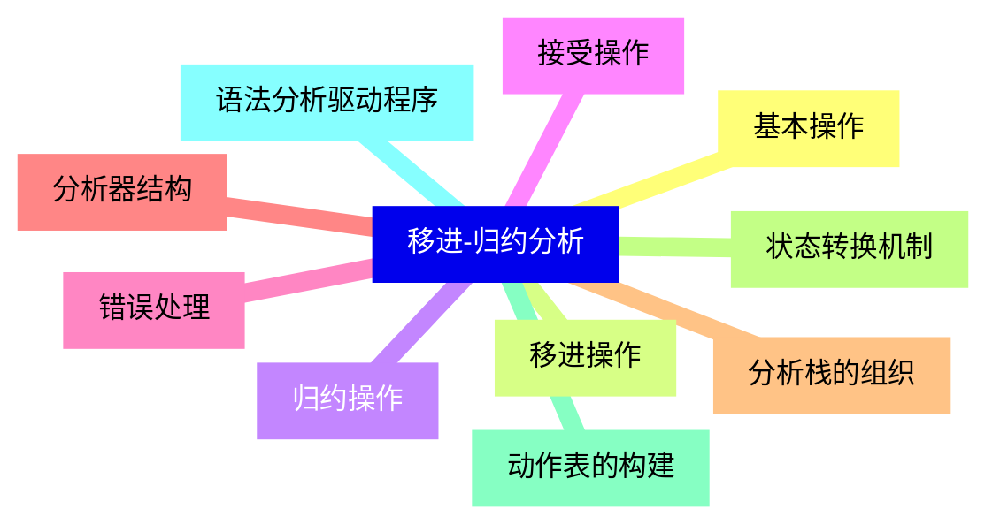
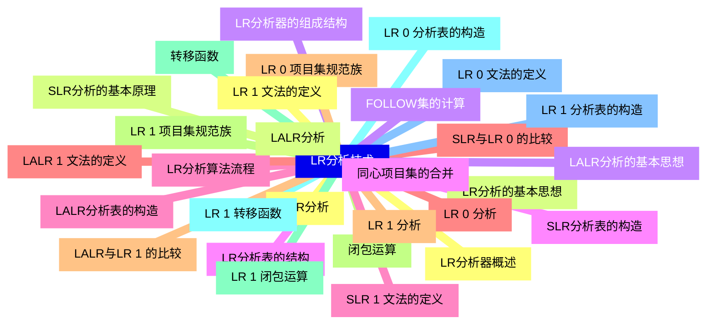
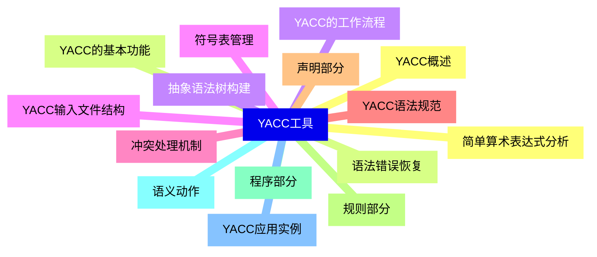
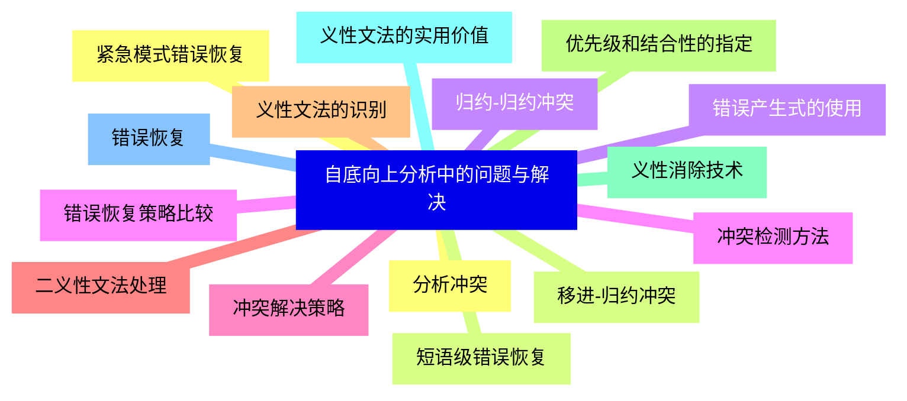
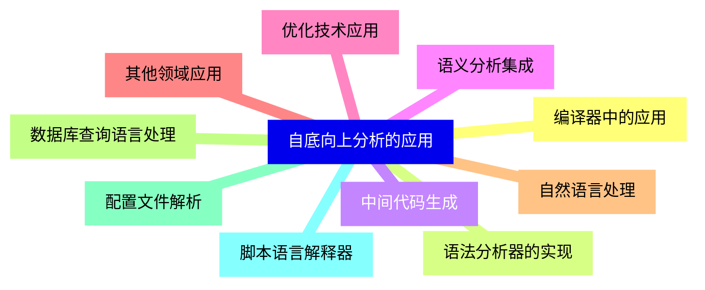
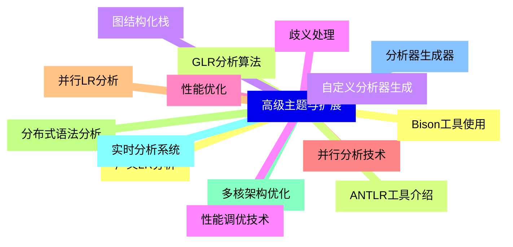


### 1 [自底向上分析概述](#1)
#### 1.1 [基本概念](#1)
#### 1.2 [自底向上分析的定义与特点](#1)
#### 1.3 [与自顶向下分析的比较](#1)
#### 1.4 [分析树构建过程](#1)
#### 1.5 [最右推导与规范归约](#1)
#### 1.6 [分析过程原理](#1)
#### 1.7 [移进-归约分析框架](#1)
#### 1.8 [句柄识别与剪枝](#1)
#### 1.9 [分析栈的使用](#1)
#### 1.10 [输入缓冲区的处理](#1)
### 2 [移进-归约分析](#2)
#### 2.1 [基本操作](#2)
#### 2.2 [移进操作](#2)
#### 2.3 [归约操作](#2)
#### 2.4 [接受操作](#2)
#### 2.5 [错误处理](#2)
#### 2.6 [分析器结构](#2)
#### 2.7 [分析栈的组织](#2)
#### 2.8 [状态转换机制](#2)
#### 2.9 [动作表的构建](#2)
#### 2.10 [语法分析驱动程序](#2)
### 3 [LR分析技术](#3)
#### 3.1 [LR分析器概述](#3)
#### 3.2 [LR分析的基本思想](#3)
#### 3.3 [LR分析器的组成结构](#3)
#### 3.4 [LR分析表的结构](#3)
#### 3.5 [LR分析算法流程](#3)
#### 3.6 [LR 0 分析](#3)
#### 3.7 [LR 0 项目集规范族](#3)
#### 3.8 [闭包运算](#3)
#### 3.9 [转移函数](#3)
#### 3.10 [LR 0 分析表的构造](#3)
#### 3.11 [LR 0 文法的定义](#3)
#### 3.12 [SLR分析](#3)
#### 3.13 [SLR分析的基本原理](#3)
#### 3.14 [FOLLOW集的计算](#3)
#### 3.15 [SLR分析表的构造](#3)
#### 3.16 [SLR 1 文法的定义](#3)
#### 3.17 [SLR与LR 0 的比较](#3)
#### 3.18 [LR 1 分析](#3)
#### 3.19 [LR 1 项目集规范族](#3)
#### 3.20 [LR 1 闭包运算](#3)
#### 3.21 [LR 1 转移函数](#3)
#### 3.22 [LR 1 分析表的构造](#3)
#### 3.23 [LR 1 文法的定义](#3)
#### 3.24 [LALR分析](#3)
#### 3.25 [LALR分析的基本思想](#3)
#### 3.26 [同心项目集的合并](#3)
#### 3.27 [LALR分析表的构造](#3)
#### 3.28 [LALR 1 文法的定义](#3)
#### 3.29 [LALR与LR 1 的比较](#3)
### 4 [YACC工具](#4)
#### 4.1 [YACC概述](#4)
#### 4.2 [YACC的基本功能](#4)
#### 4.3 [YACC的工作流程](#4)
#### 4.4 [YACC输入文件结构](#4)
#### 4.5 [冲突处理机制](#4)
#### 4.6 [YACC语法规范](#4)
#### 4.7 [声明部分](#4)
#### 4.8 [规则部分](#4)
#### 4.9 [程序部分](#4)
#### 4.10 [语义动作](#4)
#### 4.11 [YACC应用实例](#4)
#### 4.12 [简单算术表达式分析](#4)
#### 4.13 [语法错误恢复](#4)
#### 4.14 [抽象语法树构建](#4)
#### 4.15 [符号表管理](#4)
### 5 [自底向上分析中的问题与解决](#5)
#### 5.1 [分析冲突](#5)
#### 5.2 [移进-归约冲突](#5)
#### 5.3 [归约-归约冲突](#5)
#### 5.4 [冲突检测方法](#5)
#### 5.5 [冲突解决策略](#5)
#### 5.6 [二义性文法处理](#5)
#### 5.7 [义性文法的识别](#5)
#### 5.8 [优先级和结合性的指定](#5)
#### 5.9 [义性消除技术](#5)
#### 5.10 [义性文法的实用价值](#5)
#### 5.11 [错误恢复](#5)
#### 5.12 [紧急模式错误恢复](#5)
#### 5.13 [短语级错误恢复](#5)
#### 5.14 [错误产生式的使用](#5)
#### 5.15 [错误恢复策略比较](#5)
### 6 [自底向上分析的应用](#6)
#### 6.1 [编译器中的应用](#6)
#### 6.2 [语法分析器的实现](#6)
#### 6.3 [中间代码生成](#6)
#### 6.4 [语义分析集成](#6)
#### 6.5 [优化技术应用](#6)
#### 6.6 [其他领域应用](#6)
#### 6.7 [自然语言处理](#6)
#### 6.8 [数据库查询语言处理](#6)
#### 6.9 [配置文件解析](#6)
#### 6.10 [脚本语言解释器](#6)
### 7 [高级主题与扩展](#7)
#### 7.1 [广义LR分析](#7)
#### 7.2 [GLR分析算法](#7)
#### 7.3 [图结构化栈](#7)
#### 7.4 [歧义处理](#7)
#### 7.5 [性能优化](#7)
#### 7.6 [并行分析技术](#7)
#### 7.7 [并行LR分析](#7)
#### 7.8 [分布式语法分析](#7)
#### 7.9 [多核架构优化](#7)
#### 7.10 [实时分析系统](#7)
#### 7.11 [分析器生成器](#7)
#### 7.12 [Bison工具使用](#7)
#### 7.13 [ANTLR工具介绍](#7)
#### 7.14 [自定义分析器生成](#7)
#### 7.15 [性能调优技术](#7)




### 1 自底向上分析概述

---
### 1 自底向上分析概述
___
#### 1.1 基本概念
___
#### 1.2 自底向上分析的定义与特点
___
#### 1.3 与自顶向下分析的比较
___
#### 1.4 分析树构建过程
___
#### 1.5 最右推导与规范归约
___
#### 1.6 分析过程原理
___
#### 1.7 移进-归约分析框架
___
#### 1.8 句柄识别与剪枝
___
#### 1.9 分析栈的使用
___
#### 1.10 输入缓冲区的处理
### 2 移进-归约分析

---
### 2 移进-归约分析
___
#### 2.1 基本操作
___
#### 2.2 移进操作
___
#### 2.3 归约操作
___
#### 2.4 接受操作
___
#### 2.5 错误处理
___
#### 2.6 分析器结构
___
#### 2.7 分析栈的组织
___
#### 2.8 状态转换机制
___
#### 2.9 动作表的构建
___
#### 2.10 语法分析驱动程序
### 3 LR分析技术

---
### 3 LR分析技术
___
#### 3.1 LR分析器概述
___
#### 3.2 LR分析的基本思想
___
#### 3.3 LR分析器的组成结构
___
#### 3.4 LR分析表的结构
___
#### 3.5 LR分析算法流程
___
#### 3.6 LR 0 分析
___
#### 3.7 LR 0 项目集规范族
___
#### 3.8 闭包运算
___
#### 3.9 转移函数
___
#### 3.10 LR 0 分析表的构造
___
#### 3.11 LR 0 文法的定义
___
#### 3.12 SLR分析
___
#### 3.13 SLR分析的基本原理
___
#### 3.14 FOLLOW集的计算
___
#### 3.15 SLR分析表的构造
___
#### 3.16 SLR 1 文法的定义
___
#### 3.17 SLR与LR 0 的比较
___
#### 3.18 LR 1 分析
___
#### 3.19 LR 1 项目集规范族
___
#### 3.20 LR 1 闭包运算
___
#### 3.21 LR 1 转移函数
___
#### 3.22 LR 1 分析表的构造
___
#### 3.23 LR 1 文法的定义
___
#### 3.24 LALR分析
___
#### 3.25 LALR分析的基本思想
___
#### 3.26 同心项目集的合并
___
#### 3.27 LALR分析表的构造
___
#### 3.28 LALR 1 文法的定义
___
#### 3.29 LALR与LR 1 的比较
### 4 YACC工具

---
### 4 YACC工具
___
#### 4.1 YACC概述
___
#### 4.2 YACC的基本功能
___
#### 4.3 YACC的工作流程
___
#### 4.4 YACC输入文件结构
___
#### 4.5 冲突处理机制
___
#### 4.6 YACC语法规范
___
#### 4.7 声明部分
___
#### 4.8 规则部分
___
#### 4.9 程序部分
___
#### 4.10 语义动作
___
#### 4.11 YACC应用实例
___
#### 4.12 简单算术表达式分析
___
#### 4.13 语法错误恢复
___
#### 4.14 抽象语法树构建
___
#### 4.15 符号表管理
### 5 自底向上分析中的问题与解决

---
### 5 自底向上分析中的问题与解决
___
#### 5.1 分析冲突
___
#### 5.2 移进-归约冲突
___
#### 5.3 归约-归约冲突
___
#### 5.4 冲突检测方法
___
#### 5.5 冲突解决策略
___
#### 5.6 二义性文法处理
___
#### 5.7 义性文法的识别
___
#### 5.8 优先级和结合性的指定
___
#### 5.9 义性消除技术
___
#### 5.10 义性文法的实用价值
___
#### 5.11 错误恢复
___
#### 5.12 紧急模式错误恢复
___
#### 5.13 短语级错误恢复
___
#### 5.14 错误产生式的使用
___
#### 5.15 错误恢复策略比较
### 6 自底向上分析的应用

---
### 6 自底向上分析的应用
___
#### 6.1 编译器中的应用
___
#### 6.2 语法分析器的实现
___
#### 6.3 中间代码生成
___
#### 6.4 语义分析集成
___
#### 6.5 优化技术应用
___
#### 6.6 其他领域应用
___
#### 6.7 自然语言处理
___
#### 6.8 数据库查询语言处理
___
#### 6.9 配置文件解析
___
#### 6.10 脚本语言解释器
### 7 高级主题与扩展

---
### 7 高级主题与扩展
___
#### 7.1 广义LR分析
___
#### 7.2 GLR分析算法
___
#### 7.3 图结构化栈
___
#### 7.4 歧义处理
___
#### 7.5 性能优化
___
#### 7.6 并行分析技术
___
#### 7.7 并行LR分析
___
#### 7.8 分布式语法分析
___
#### 7.9 多核架构优化
___
#### 7.10 实时分析系统
___
#### 7.11 分析器生成器
___
#### 7.12 Bison工具使用
___
#### 7.13 ANTLR工具介绍
___
#### 7.14 自定义分析器生成
___
#### 7.15 性能调优技术


### 1 自底向上分析概述{#1}

{}

<--->
{}
{}
{}
{}
{}
{}
{}
{}
{}
{}
{}
{}
{}
{}
{}
{}
{}
{}
{}
{}
{}

### 2 移进-归约分析{#2}

{}
{}
{}
{}
{}
{}
{}
{}
{}
{}
{}
{}
{}
{}
{}
{}
{}
{}
{}
{}
{}
<--->

{}

### 3 LR分析技术{#3}

{}

<--->
{}
{}
{}
{}
{}
{}
{}
{}
{}
{}
{}
{}
{}
{}
{}
{}
{}
{}
{}
{}
{}
{}
{}
{}
{}
{}
{}
{}
{}
{}
{}
{}
{}
{}
{}
{}
{}
{}
{}
{}
{}
{}
{}
{}
{}
{}
{}
{}
{}
{}
{}
{}
{}
{}
{}
{}
{}
{}
{}

### 4 YACC工具{#4}

{}
{}
{}
{}
{}
{}
{}
{}
{}
{}
{}
{}
{}
{}
{}
{}
{}
{}
{}
{}
{}
{}
{}
{}
{}
{}
{}
{}
{}
{}
{}
<--->

{}

### 5 自底向上分析中的问题与解决{#5}

{}

<--->
{}
{}
{}
{}
{}
{}
{}
{}
{}
{}
{}
{}
{}
{}
{}
{}
{}
{}
{}
{}
{}
{}
{}
{}
{}
{}
{}
{}
{}
{}
{}

### 6 自底向上分析的应用{#6}

{}
{}
{}
{}
{}
{}
{}
{}
{}
{}
{}
{}
{}
{}
{}
{}
{}
{}
{}
{}
{}
<--->

{}

### 7 高级主题与扩展{#7}

{}

<--->
{}
{}
{}
{}
{}
{}
{}
{}
{}
{}
{}
{}
{}
{}
{}
{}
{}
{}
{}
{}
{}
{}
{}
{}
{}
{}
{}
{}
{}
{}
{}
