
### 1 [语法制导翻译基础概念](#1)
#### 1.1 [语法制导翻译定义与原理](#1)
#### 1.2 [语法制导翻译的基本概念](#1)
#### 1.3 [语法与语义的结合方式](#1)
#### 1.4 [翻译规则与语法产生式的关联](#1)
#### 1.5 [语法制导翻译的特点](#1)
#### 1.6 [语法驱动的翻译过程](#1)
#### 1.7 [属性计算与语法分析同步](#1)
#### 1.8 [翻译的自动生成特性](#1)
#### 1.9 [语法制导翻译的应用场景](#1)
#### 1.10 [编译器前端设计](#1)
#### 1.11 [中间代码生成](#1)
#### 1.12 [语义分析与检查](#1)
### 2 [属性文法](#2)
#### 2.1 [属性文法基本概念](#2)
#### 2.2 [属性文法的定义](#2)
#### 2.3 [综合属性与继承属性](#2)
#### 2.4 [属性依赖关系](#2)
#### 2.5 [属性计算规则](#2)
#### 2.6 [语义规则的形式化描述](#2)
#### 2.7 [属性计算顺序](#2)
#### 2.8 [属性求值方法](#2)
#### 2.9 [属性文法分类](#2)
#### 2.10 [S属性文法](#2)
#### 2.11 [L属性文法](#2)
#### 2.12 [其他特殊属性文法](#2)
### 3 [语法制导翻译方案](#3)
#### 3.1 [翻译方案基本结构](#3)
#### 3.2 [翻译方案的定义](#3)
#### 3.3 [嵌入语义动作的语法规则](#3)
#### 3.4 [翻译方案的执行时机](#3)
#### 3.5 [翻译方案设计方法](#3)
#### 3.6 [基于语法的翻译规则设计](#3)
#### 3.7 [语义动作的插入位置](#3)
#### 3.8 [翻译方案的验证](#3)
#### 3.9 [翻译方案实现技术](#3)
#### 3.10 [递归下降翻译器](#3)
#### 3.11 [预测分析翻译器](#3)
#### 3.12 [自底向上翻译器](#3)
### 4 [综合属性与继承属性](#4)
#### 4.1 [综合属性](#4)
#### 4.2 [综合属性的定义与特点](#4)
#### 4.3 [综合属性的计算方向](#4)
#### 4.4 [综合属性的应用实例](#4)
#### 4.5 [继承属性](#4)
#### 4.6 [继承属性的定义与特点](#4)
#### 4.7 [继承属性的传播机制](#4)
#### 4.8 [继承属性的使用限制](#4)
#### 4.9 [属性依赖图](#4)
#### 4.10 [依赖图的构建方法](#4)
#### 4.11 [环检测与处理](#4)
#### 4.12 [属性求值顺序确定](#4)
### 5 [S属性定义与L属性定义](#5)
#### 5.1 [S属性定义](#5)
#### 5.2 [S属性定义的特征](#5)
#### 5.3 [S属性定义的实现](#5)
#### 5.4 [S属性定义的应用](#5)
#### 5.5 [L属性定义](#5)
#### 5.6 [L属性定义的特征](#5)
#### 5.7 [L属性定义的实现](#5)
#### 5.8 [L属性定义与S属性定义的关系](#5)
#### 5.9 [属性定义的转换](#5)
#### 5.10 [S属性到L属性的转换](#5)
#### 5.11 [属性定义的等价性](#5)
#### 5.12 [属性定义的优化](#5)
### 6 [语法制导翻译的实现](#6)
#### 6.1 [递归下降翻译](#6)
#### 6.2 [递归下降翻译原理](#6)
#### 6.3 [属性栈的管理](#6)
#### 6.4 [递归下降翻译的实现](#6)
#### 6.5 [预测分析翻译](#6)
#### 6.6 [LL 1 文法的翻译](#6)
#### 6.7 [预测分析表的扩展](#6)
#### 6.8 [预测分析翻译的实现](#6)
#### 6.9 [自底向上翻译](#6)
#### 6.10 [LR分析中的语法制导翻译](#6)
#### 6.11 [语义动作的执行时机](#6)
#### 6.12 [自底向上翻译的实现技术](#6)
### 7 [中间代码生成](#7)
#### 7.1 [中间代码形式](#7)
#### 7.2 [抽象语法树 AST](#7)
#### 7.3 [地址代码](#7)
#### 7.4 [后缀表示](#7)
#### 7.5 [其他中间表示形式](#7)
#### 7.6 [表达式翻译](#7)
#### 7.7 [算术表达式翻译](#7)
#### 7.8 [布尔表达式翻译](#7)
#### 7.9 [控制流表达式翻译](#7)
#### 7.10 [控制结构翻译](#7)
#### 7.11 [条件语句翻译](#7)
#### 7.12 [循环语句翻译](#7)
#### 7.13 [过程调用翻译](#7)
### 8 [符号表管理](#8)
#### 8.1 [符号表结构](#8)
#### 8.2 [符号表的基本组织](#8)
#### 8.3 [作用域管理](#8)
#### 8.4 [类型信息存储](#8)
#### 8.5 [符号表操作](#8)
#### 8.6 [符号的插入与查找](#8)
#### 8.7 [作用域的进入与退出](#8)
#### 8.8 [符号表的重定位](#8)
#### 8.9 [符号表在翻译中的应用](#8)
#### 8.10 [标识符的语义处理](#8)
#### 8.11 [类型检查与转换](#8)
#### 8.12 [作用域规则的实现](#8)
### 9 [类型检查与语义分析](#9)
#### 9.1 [类型系统](#9)
#### 9.2 [类型的基本概念](#9)
#### 9.3 [类型等价与兼容](#9)
#### 9.4 [类型推导规则](#9)
#### 9.5 [类型检查技术](#9)
#### 9.6 [静态类型检查](#9)
#### 9.7 [动态类型检查](#9)
#### 9.8 [类型错误处理](#9)
#### 9.9 [语义分析过程](#9)
#### 9.10 [语义规则的验证](#9)
#### 9.11 [上下文相关检查](#9)
#### 9.12 [语义错误报告](#9)
### 10 [语法制导翻译的优化](#10)
#### 10.1 [翻译效率优化](#10)
#### 10.2 [属性计算优化](#10)
#### 10.3 [翻译规则简化](#10)
#### 10.4 [中间表示优化](#10)
#### 10.5 [存储优化](#10)
#### 10.6 [属性存储管理](#10)
#### 10.7 [符号表优化](#10)
#### 10.8 [内存使用优化](#10)
#### 10.9 [代码质量优化](#10)
#### 10.10 [生成代码的优化](#10)
#### 10.11 [翻译质量的评估](#10)
#### 10.12 [优化策略的选择](#10)
### 11 [实际应用案例分析](#11)
#### 11.1 [简单语言的翻译实现](#11)
#### 11.2 [算术表达式语言的翻译](#11)
#### 11.3 [控制结构语言的翻译](#11)
#### 11.4 [完整语言的翻译实例](#11)
#### 11.5 [编译器中的语法制导翻译](#11)
#### 11.6 [词法分析与语法分析的集成](#11)
#### 11.7 [语义分析与代码生成的衔接](#11)
#### 11.8 [实际编译器案例分析](#11)
#### 11.9 [其他领域的应用](#11)
#### 11.10 [解释器设计](#11)
#### 11.11 [领域特定语言翻译](#11)
#### 11.12 [程序变换工具](#11)




### 1 语法制导翻译基础概念

---
### 1 语法制导翻译基础概念
___
#### 1.1 语法制导翻译定义与原理
___
#### 1.2 语法制导翻译的基本概念
___
#### 1.3 语法与语义的结合方式
___
#### 1.4 翻译规则与语法产生式的关联
___
#### 1.5 语法制导翻译的特点
___
#### 1.6 语法驱动的翻译过程
___
#### 1.7 属性计算与语法分析同步
___
#### 1.8 翻译的自动生成特性
___
#### 1.9 语法制导翻译的应用场景
___
#### 1.10 编译器前端设计
___
#### 1.11 中间代码生成
___
#### 1.12 语义分析与检查
### 2 属性文法

---
### 2 属性文法
___
#### 2.1 属性文法基本概念
___
#### 2.2 属性文法的定义
___
#### 2.3 综合属性与继承属性
___
#### 2.4 属性依赖关系
___
#### 2.5 属性计算规则
___
#### 2.6 语义规则的形式化描述
___
#### 2.7 属性计算顺序
___
#### 2.8 属性求值方法
___
#### 2.9 属性文法分类
___
#### 2.10 S属性文法
___
#### 2.11 L属性文法
___
#### 2.12 其他特殊属性文法
### 3 语法制导翻译方案

---
### 3 语法制导翻译方案
___
#### 3.1 翻译方案基本结构
___
#### 3.2 翻译方案的定义
___
#### 3.3 嵌入语义动作的语法规则
___
#### 3.4 翻译方案的执行时机
___
#### 3.5 翻译方案设计方法
___
#### 3.6 基于语法的翻译规则设计
___
#### 3.7 语义动作的插入位置
___
#### 3.8 翻译方案的验证
___
#### 3.9 翻译方案实现技术
___
#### 3.10 递归下降翻译器
___
#### 3.11 预测分析翻译器
___
#### 3.12 自底向上翻译器
### 4 综合属性与继承属性

---
### 4 综合属性与继承属性
___
#### 4.1 综合属性
___
#### 4.2 综合属性的定义与特点
___
#### 4.3 综合属性的计算方向
___
#### 4.4 综合属性的应用实例
___
#### 4.5 继承属性
___
#### 4.6 继承属性的定义与特点
___
#### 4.7 继承属性的传播机制
___
#### 4.8 继承属性的使用限制
___
#### 4.9 属性依赖图
___
#### 4.10 依赖图的构建方法
___
#### 4.11 环检测与处理
___
#### 4.12 属性求值顺序确定
### 5 S属性定义与L属性定义

---
### 5 S属性定义与L属性定义
___
#### 5.1 S属性定义
___
#### 5.2 S属性定义的特征
___
#### 5.3 S属性定义的实现
___
#### 5.4 S属性定义的应用
___
#### 5.5 L属性定义
___
#### 5.6 L属性定义的特征
___
#### 5.7 L属性定义的实现
___
#### 5.8 L属性定义与S属性定义的关系
___
#### 5.9 属性定义的转换
___
#### 5.10 S属性到L属性的转换
___
#### 5.11 属性定义的等价性
___
#### 5.12 属性定义的优化
### 6 语法制导翻译的实现

---
### 6 语法制导翻译的实现
___
#### 6.1 递归下降翻译
___
#### 6.2 递归下降翻译原理
___
#### 6.3 属性栈的管理
___
#### 6.4 递归下降翻译的实现
___
#### 6.5 预测分析翻译
___
#### 6.6 LL 1 文法的翻译
___
#### 6.7 预测分析表的扩展
___
#### 6.8 预测分析翻译的实现
___
#### 6.9 自底向上翻译
___
#### 6.10 LR分析中的语法制导翻译
___
#### 6.11 语义动作的执行时机
___
#### 6.12 自底向上翻译的实现技术
### 7 中间代码生成

---
### 7 中间代码生成
___
#### 7.1 中间代码形式
___
#### 7.2 抽象语法树 AST
___
#### 7.3 地址代码
___
#### 7.4 后缀表示
___
#### 7.5 其他中间表示形式
___
#### 7.6 表达式翻译
___
#### 7.7 算术表达式翻译
___
#### 7.8 布尔表达式翻译
___
#### 7.9 控制流表达式翻译
___
#### 7.10 控制结构翻译
___
#### 7.11 条件语句翻译
___
#### 7.12 循环语句翻译
___
#### 7.13 过程调用翻译
### 8 符号表管理

---
### 8 符号表管理
___
#### 8.1 符号表结构
___
#### 8.2 符号表的基本组织
___
#### 8.3 作用域管理
___
#### 8.4 类型信息存储
___
#### 8.5 符号表操作
___
#### 8.6 符号的插入与查找
___
#### 8.7 作用域的进入与退出
___
#### 8.8 符号表的重定位
___
#### 8.9 符号表在翻译中的应用
___
#### 8.10 标识符的语义处理
___
#### 8.11 类型检查与转换
___
#### 8.12 作用域规则的实现
### 9 类型检查与语义分析

---
### 9 类型检查与语义分析
___
#### 9.1 类型系统
___
#### 9.2 类型的基本概念
___
#### 9.3 类型等价与兼容
___
#### 9.4 类型推导规则
___
#### 9.5 类型检查技术
___
#### 9.6 静态类型检查
___
#### 9.7 动态类型检查
___
#### 9.8 类型错误处理
___
#### 9.9 语义分析过程
___
#### 9.10 语义规则的验证
___
#### 9.11 上下文相关检查
___
#### 9.12 语义错误报告
### 10 语法制导翻译的优化

---
### 10 语法制导翻译的优化
___
#### 10.1 翻译效率优化
___
#### 10.2 属性计算优化
___
#### 10.3 翻译规则简化
___
#### 10.4 中间表示优化
___
#### 10.5 存储优化
___
#### 10.6 属性存储管理
___
#### 10.7 符号表优化
___
#### 10.8 内存使用优化
___
#### 10.9 代码质量优化
___
#### 10.10 生成代码的优化
___
#### 10.11 翻译质量的评估
___
#### 10.12 优化策略的选择
### 11 实际应用案例分析

---
### 11 实际应用案例分析
___
#### 11.1 简单语言的翻译实现
___
#### 11.2 算术表达式语言的翻译
___
#### 11.3 控制结构语言的翻译
___
#### 11.4 完整语言的翻译实例
___
#### 11.5 编译器中的语法制导翻译
___
#### 11.6 词法分析与语法分析的集成
___
#### 11.7 语义分析与代码生成的衔接
___
#### 11.8 实际编译器案例分析
___
#### 11.9 其他领域的应用
___
#### 11.10 解释器设计
___
#### 11.11 领域特定语言翻译
___
#### 11.12 程序变换工具


### 1 语法制导翻译基础概念{#1}

{}
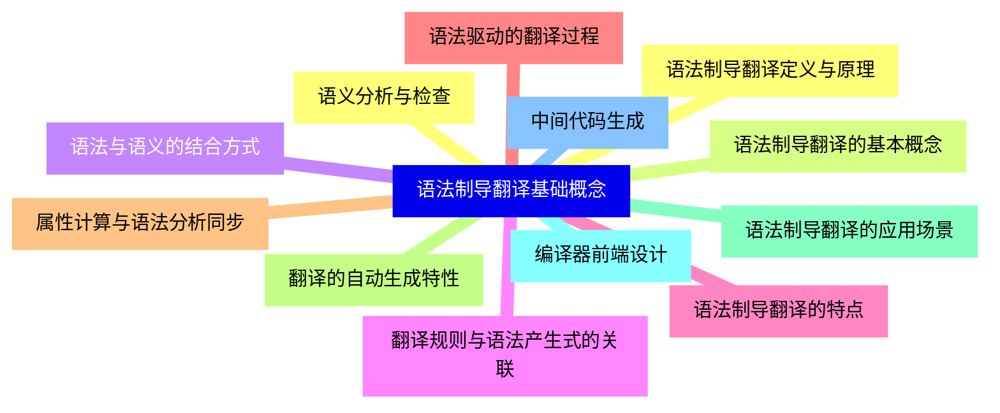

<--->
{}
{}
{}
{}
{}
{}
{}
{}
{}
{}
{}
{}
{}
{}
{}
{}
{}
{}
{}
{}
{}
{}
{}
{}
{}

### 2 属性文法{#2}

{}
{}
{}
{}
{}
{}
{}
{}
{}
{}
{}
{}
{}
{}
{}
{}
{}
{}
{}
{}
{}
{}
{}
{}
{}
<--->
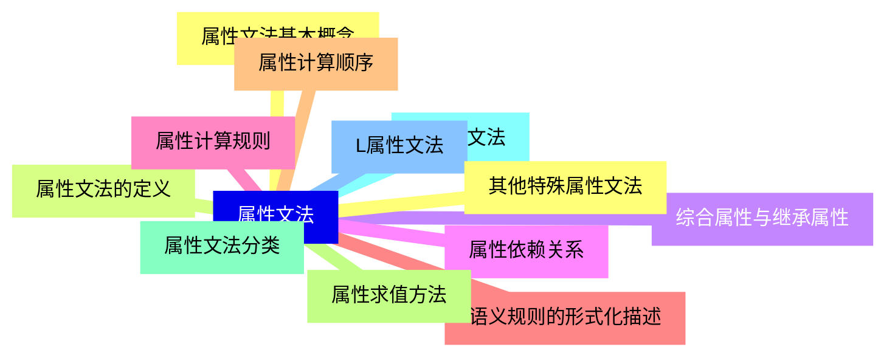

{}

### 3 语法制导翻译方案{#3}

{}
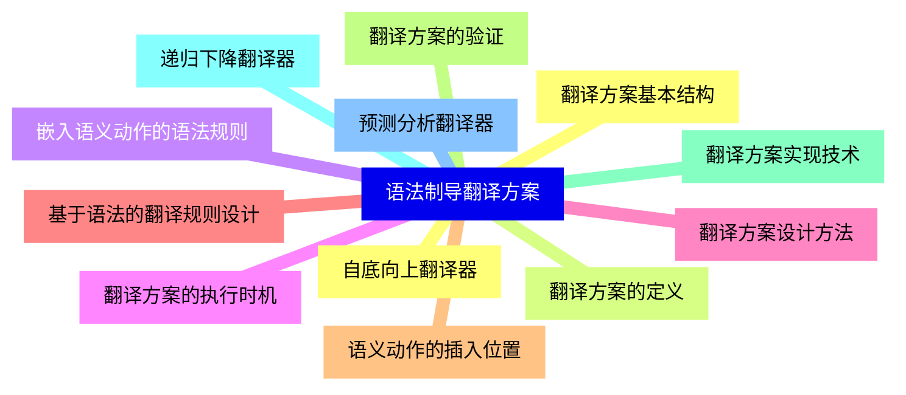

<--->
{}
{}
{}
{}
{}
{}
{}
{}
{}
{}
{}
{}
{}
{}
{}
{}
{}
{}
{}
{}
{}
{}
{}
{}
{}

### 4 综合属性与继承属性{#4}

{}
{}
{}
{}
{}
{}
{}
{}
{}
{}
{}
{}
{}
{}
{}
{}
{}
{}
{}
{}
{}
{}
{}
{}
{}
<--->
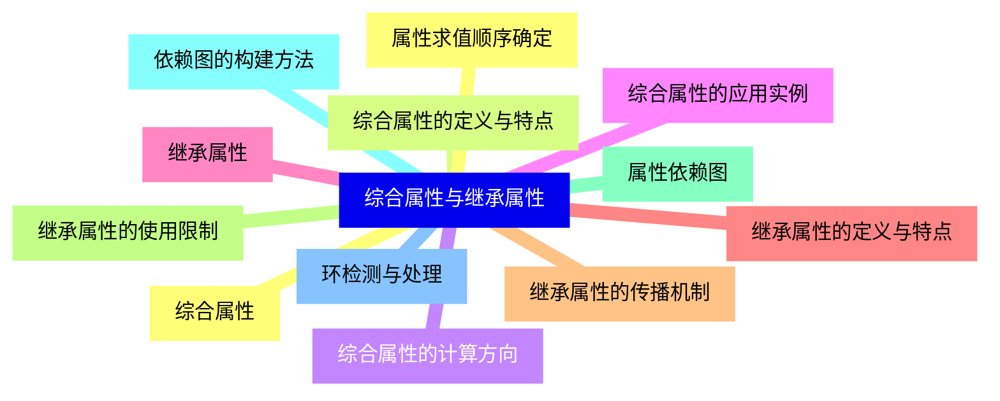

{}

### 5 S属性定义与L属性定义{#5}

{}
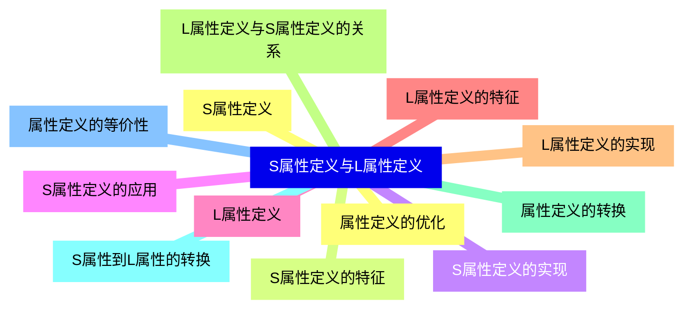

<--->
{}
{}
{}
{}
{}
{}
{}
{}
{}
{}
{}
{}
{}
{}
{}
{}
{}
{}
{}
{}
{}
{}
{}
{}
{}

### 6 语法制导翻译的实现{#6}

{}
{}
{}
{}
{}
{}
{}
{}
{}
{}
{}
{}
{}
{}
{}
{}
{}
{}
{}
{}
{}
{}
{}
{}
{}
<--->
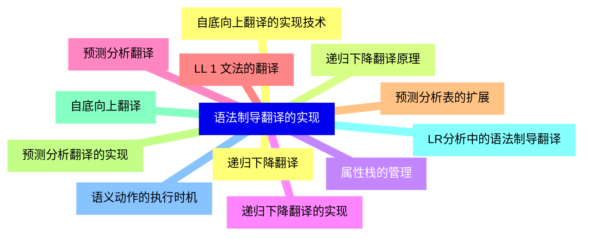

{}

### 7 中间代码生成{#7}

{}
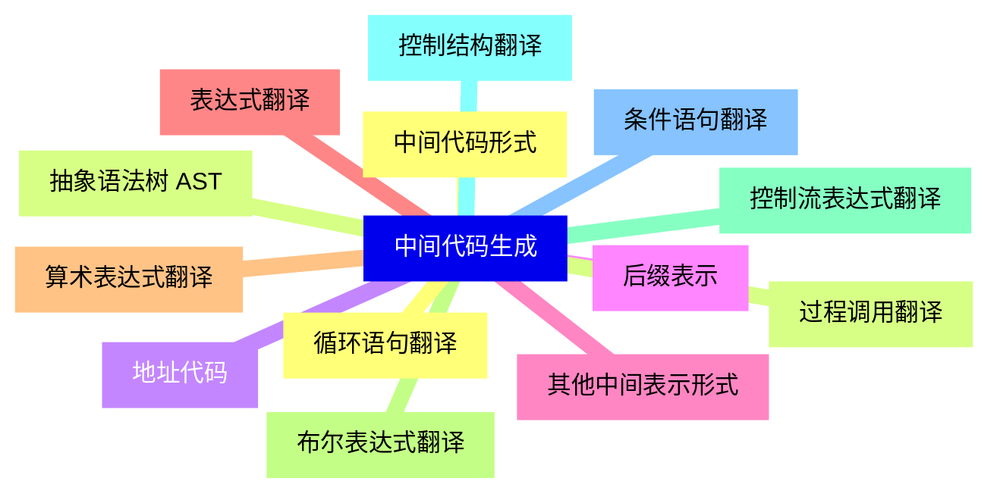

<--->
{}
{}
{}
{}
{}
{}
{}
{}
{}
{}
{}
{}
{}
{}
{}
{}
{}
{}
{}
{}
{}
{}
{}
{}
{}
{}
{}

### 8 符号表管理{#8}

{}
{}
{}
{}
{}
{}
{}
{}
{}
{}
{}
{}
{}
{}
{}
{}
{}
{}
{}
{}
{}
{}
{}
{}
{}
<--->
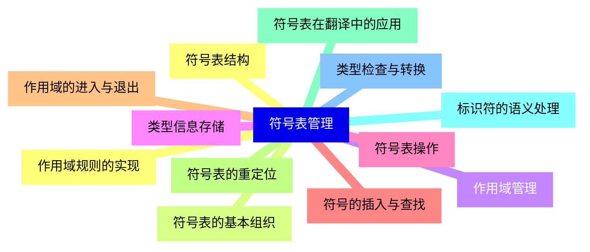

{}

### 9 类型检查与语义分析{#9}

{}
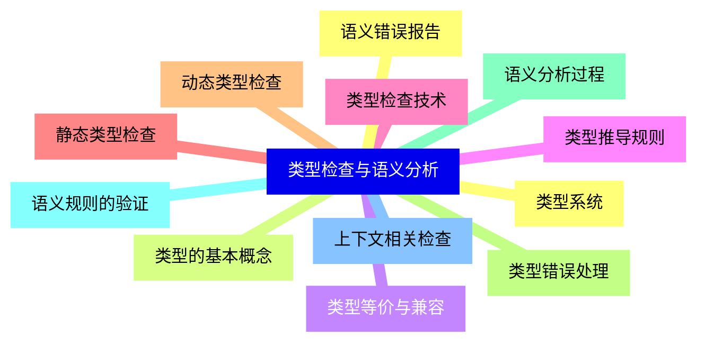

<--->
{}
{}
{}
{}
{}
{}
{}
{}
{}
{}
{}
{}
{}
{}
{}
{}
{}
{}
{}
{}
{}
{}
{}
{}
{}

### 10 语法制导翻译的优化{#10}

{}
{}
{}
{}
{}
{}
{}
{}
{}
{}
{}
{}
{}
{}
{}
{}
{}
{}
{}
{}
{}
{}
{}
{}
{}
<--->
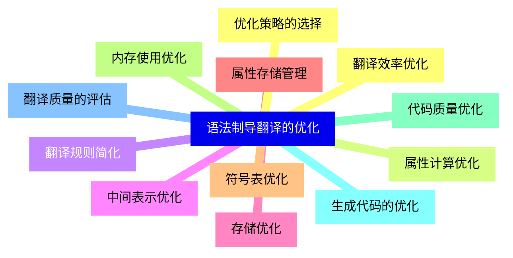

{}

### 11 实际应用案例分析{#11}

{}
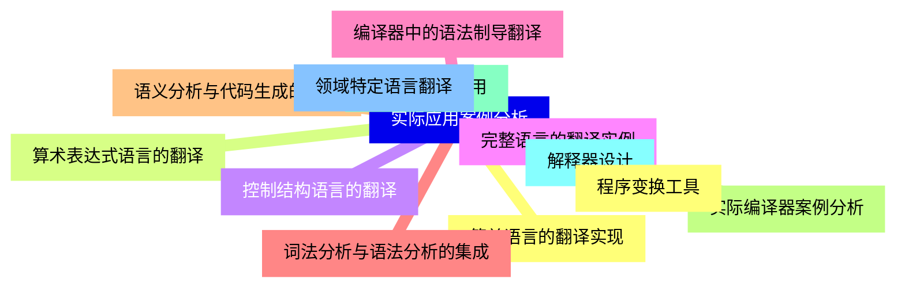

<--->
{}
{}
{}
{}
{}
{}
{}
{}
{}
{}
{}
{}
{}
{}
{}
{}
{}
{}
{}
{}
{}
{}
{}
{}
{}
