
### 1 [符号表概述](#1)
#### 1.1 [符号表基本概念](#1)
#### 1.2 [符号表的定义与作用](#1)
#### 1.3 [符号表在编译过程中的地位](#1)
#### 1.4 [符号表与其他编译阶段的交互关系](#1)
#### 1.5 [符号表的发展历史](#1)
#### 1.6 [早期符号表实现方法](#1)
#### 1.7 [现代符号表技术演进](#1)
#### 1.8 [符号表管理的发展趋势](#1)
### 2 [符号表数据结构](#2)
#### 2.1 [基本数据结构](#2)
#### 2.2 [线性表结构](#2)
#### 2.3 [树形结构](#2)
#### 2.4 [哈希表结构](#2)
#### 2.5 [平衡二叉树结构](#2)
#### 2.6 [高级数据结构](#2)
#### 2.7 [红黑树在符号表中的应用](#2)
#### 2.8 [B树与B+树结构](#2)
#### 2.9 [跳表结构](#2)
#### 2.10 [布隆过滤器](#2)
#### 2.11 [数据结构性能分析](#2)
#### 2.12 [时间复杂度比较](#2)
#### 2.13 [空间复杂度分析](#2)
#### 2.14 [不同场景下的适用性](#2)
### 3 [符号表组织方式](#3)
#### 3.1 [单表结构](#3)
#### 3.2 [全局符号表设计](#3)
#### 3.3 [单表结构的优缺点](#3)
#### 3.4 [单表结构的实现方法](#3)
#### 3.5 [分层结构](#3)
#### 3.6 [作用域嵌套原理](#3)
#### 3.7 [块结构语言符号表](#3)
#### 3.8 [分层符号表的实现](#3)
#### 3.9 [分布式结构](#3)
#### 3.10 [模块化符号表](#3)
#### 3.11 [包管理符号表](#3)
#### 3.12 [分布式符号表的同步机制](#3)
### 4 [符号表操作](#4)
#### 4.1 [基本操作](#4)
#### 4.2 [符号插入操作](#4)
#### 4.3 [符号查找操作](#4)
#### 4.4 [符号删除操作](#4)
#### 4.5 [符号更新操作](#4)
#### 4.6 [高级操作](#4)
#### 4.7 [符号重载处理](#4)
#### 4.8 [符号重定义检测](#4)
#### 4.9 [符号作用域管理](#4)
#### 4.10 [符号可见性控制](#4)
#### 4.11 [操作优化技术](#4)
#### 4.12 [缓存优化策略](#4)
#### 4.13 [预查找技术](#4)
#### 4.14 [延迟加载机制](#4)
#### 4.15 [批量操作处理](#4)
### 5 [符号表信息存储](#5)
#### 5.1 [基本信息存储](#5)
#### 5.2 [标识符名称存储](#5)
#### 5.3 [类型信息存储](#5)
#### 5.4 [存储类别信息](#5)
#### 5.5 [值信息存储](#5)
#### 5.6 [扩展信息存储](#5)
#### 5.7 [作用域信息](#5)
#### 5.8 [生命周期信息](#5)
#### 5.9 [访问权限信息](#5)
#### 5.10 [调试信息](#5)
#### 5.11 [存储优化策略](#5)
#### 5.12 [信息压缩技术](#5)
#### 5.13 [共享存储机制](#5)
#### 5.14 [延迟存储策略](#5)
#### 5.15 [增量更新技术](#5)
### 6 [作用域管理](#6)
#### 6.1 [作用域基本概念](#6)
#### 6.2 [静态作用域](#6)
#### 6.3 [动态作用域](#6)
#### 6.4 [词法作用域](#6)
#### 6.5 [语法作用域](#6)
#### 6.6 [作用域实现技术](#6)
#### 6.7 [栈式符号表](#6)
#### 6.8 [树形作用域结构](#6)
#### 6.9 [作用域链管理](#6)
#### 6.10 [闭包处理](#6)
#### 6.11 [特殊作用域处理](#6)
#### 6.12 [命名空间管理](#6)
#### 6.13 [类作用域处理](#6)
#### 6.14 [模板作用域](#6)
#### 6.15 [宏作用域](#6)
### 7 [类型系统与符号表](#7)
#### 7.1 [类型信息管理](#7)
#### 7.2 [基本类型表示](#7)
#### 7.3 [复合类型处理](#7)
#### 7.4 [函数类型存储](#7)
#### 7.5 [泛型类型管理](#7)
#### 7.6 [类型检查](#7)
#### 7.7 [类型兼容性检查](#7)
#### 7.8 [类型推导机制](#7)
#### 7.9 [类型转换处理](#7)
#### 7.10 [类型错误报告](#7)
#### 7.11 [类型系统扩展](#7)
#### 7.12 [多态类型处理](#7)
#### 7.13 [依赖类型管理](#7)
#### 7.14 [类型别名处理](#7)
#### 7.15 [类型约束检查](#7)
### 8 [符号表内存管理](#8)
#### 8.1 [内存分配策略](#8)
#### 8.2 [静态内存分配](#8)
#### 8.3 [动态内存分配](#8)
#### 8.4 [内存池技术](#8)
#### 8.5 [垃圾回收机制](#8)
#### 8.6 [内存优化技术](#8)
#### 8.7 [符号表压缩](#8)
#### 8.8 [内存对齐优化](#8)
#### 8.9 [缓存友好设计](#8)
#### 8.10 [内存泄漏检测](#8)
#### 8.11 [持久化存储](#8)
#### 8.12 [符号表序列化](#8)
#### 8.13 [磁盘存储优化](#8)
#### 8.14 [快速加载技术](#8)
#### 8.15 [增量持久化](#8)
### 9 [符号表性能优化](#9)
#### 9.1 [查找性能优化](#9)
#### 9.2 [哈希函数设计](#9)
#### 9.3 [缓存策略优化](#9)
#### 9.4 [预取技术应用](#9)
#### 9.5 [并行查找算法](#9)
#### 9.6 [存储性能优化](#9)
#### 9.7 [数据布局优化](#9)
#### 9.8 [压缩算法应用](#9)
#### 9.9 [内存访问模式优化](#9)
#### 9.10 [存储层次利用](#9)
#### 9.11 [并发性能优化](#9)
#### 9.12 [锁机制设计](#9)
#### 9.13 [无锁数据结构](#9)
#### 9.14 [读写锁优化](#9)
#### 9.15 [事务性操作](#9)
### 10 [符号表错误处理](#10)
#### 10.1 [常见错误类型](#10)
#### 10.2 [重复定义错误](#10)
#### 10.3 [未定义符号错误](#10)
#### 10.4 [作用域冲突错误](#10)
#### 10.5 [类型不匹配错误](#10)
#### 10.6 [错误检测机制](#10)
#### 10.7 [静态错误检测](#10)
#### 10.8 [动态错误检测](#10)
#### 10.9 [错误恢复策略](#10)
#### 10.10 [错误报告机制](#10)
#### 10.11 [错误处理策略](#10)
#### 10.12 [错误定位技术](#10)
#### 10.13 [错误修复建议](#10)
#### 10.14 [容错处理机制](#10)
#### 10.15 [调试信息生成](#10)
### 11 [符号表在编译器中的应用](#11)
#### 11.1 [词法分析阶段](#11)
#### 11.2 [标识符识别与存储](#11)
#### 11.3 [关键字处理](#11)
#### 11.4 [常量表管理](#11)
#### 11.5 [字面量处理](#11)
#### 11.6 [语法分析阶段](#11)
#### 11.7 [符号表构建时机](#11)
#### 11.8 [语法树与符号表关联](#11)
#### 11.9 [声明处理](#11)
#### 11.10 [作用域开始与结束](#11)
#### 11.11 [语义分析阶段](#11)
#### 11.12 [类型检查实现](#11)
#### 11.13 [符号解析过程](#11)
#### 11.14 [重载决议](#11)
#### 11.15 [语义错误检测](#11)
#### 11.16 [代码生成阶段](#11)
#### 11.17 [地址分配](#11)
#### 11.18 [符号引用解析](#11)
#### 11.19 [调试信息生成](#11)
#### 11.20 [优化信息利用](#11)
### 12 [特殊语言特性处理](#12)
#### 12.1 [面向对象特性](#12)
#### 12.2 [类与对象符号管理](#12)
#### 12.3 [继承关系处理](#12)
#### 12.4 [多态实现](#12)
#### 12.5 [访问控制实现](#12)
#### 12.6 [函数式特性](#12)
#### 12.7 [高阶函数处理](#12)
#### 12.8 [闭包实现](#12)
#### 12.9 [惰性求值支持](#12)
#### 12.10 [不可变数据管理](#12)
#### 12.11 [并发特性](#12)
#### 12.12 [线程局部存储](#12)
#### 12.13 [原子操作符号](#12)
#### 12.14 [锁符号管理](#12)
#### 12.15 [协程符号处理](#12)
### 13 [符号表工具与调试](#13)
#### 13.1 [符号表调试工具](#13)
#### 13.2 [符号表查看器](#13)
#### 13.3 [作用域分析工具](#13)
#### 13.4 [类型检查工具](#13)
#### 13.5 [性能分析工具](#13)
#### 13.6 [符号表测试](#13)
#### 13.7 [单元测试设计](#13)
#### 13.8 [集成测试策略](#13)
#### 13.9 [性能测试方法](#13)
#### 13.10 [兼容性测试](#13)
#### 13.11 [符号表维护](#13)
#### 13.12 [版本管理](#13)
#### 13.13 [备份与恢复](#13)
#### 13.14 [监控与告警](#13)
#### 13.15 [性能调优](#13)
### 14 [实际编译器案例分析](#14)
#### 14.1 [GCC编译器](#14)
#### 14.2 [GCC符号表结构](#14)
#### 14.3 [GCC作用域管理](#14)
#### 14.4 [GCC类型系统](#14)
#### 14.5 [GCC优化技术](#14)
#### 14.6 [LLVM编译器](#14)
#### 14.7 [LLVM符号表设计](#14)
#### 14.8 [LLVM中间表示](#14)
#### 14.9 [LLVM类型系统](#14)
#### 14.10 [LLVM符号解析](#14)
#### 14.11 [Java编译器](#14)
#### 14.12 [Java符号表特点](#14)
#### 14.13 [类加载器与符号表](#14)
#### 14.14 [Java泛型处理](#14)
#### 14.15 [Java注解处理](#14)
#### 14.16 [C#编译器](#14)
#### 14.17 [C#符号表架构](#14)
#### 14.18 [LINQ表达式处理](#14)
#### 14.19 [动态类型支持](#14)
#### 14.20 [异步编程支持](#14)
### 15 [符号表研究前沿](#15)
#### 15.1 [新型符号表结构](#15)
#### 15.2 [分布式符号表](#15)
#### 15.3 [增量式符号表](#15)
#### 15.4 [概率符号表](#15)
#### 15.5 [机器学习辅助符号表](#15)
#### 15.6 [符号表优化新技术](#15)
#### 15.7 [基于硬件的优化](#15)
#### 15.8 [云计算环境优化](#15)
#### 15.9 [大数据量处理](#15)
#### 15.10 [实时编译优化](#15)
#### 15.11 [符号表标准化](#15)
#### 15.12 [符号表接口标准](#15)
#### 15.13 [符号表交换格式](#15)
#### 15.14 [跨语言符号表](#15)
#### 15.15 [符号表互操作性](#15)




### 1 符号表概述

---
### 1 符号表概述
___
#### 1.1 符号表基本概念
___
#### 1.2 符号表的定义与作用
___
#### 1.3 符号表在编译过程中的地位
___
#### 1.4 符号表与其他编译阶段的交互关系
___
#### 1.5 符号表的发展历史
___
#### 1.6 早期符号表实现方法
___
#### 1.7 现代符号表技术演进
___
#### 1.8 符号表管理的发展趋势
### 2 符号表数据结构

---
### 2 符号表数据结构
___
#### 2.1 基本数据结构
___
#### 2.2 线性表结构
___
#### 2.3 树形结构
___
#### 2.4 哈希表结构
___
#### 2.5 平衡二叉树结构
___
#### 2.6 高级数据结构
___
#### 2.7 红黑树在符号表中的应用
___
#### 2.8 B树与B+树结构
___
#### 2.9 跳表结构
___
#### 2.10 布隆过滤器
___
#### 2.11 数据结构性能分析
___
#### 2.12 时间复杂度比较
___
#### 2.13 空间复杂度分析
___
#### 2.14 不同场景下的适用性
### 3 符号表组织方式

---
### 3 符号表组织方式
___
#### 3.1 单表结构
___
#### 3.2 全局符号表设计
___
#### 3.3 单表结构的优缺点
___
#### 3.4 单表结构的实现方法
___
#### 3.5 分层结构
___
#### 3.6 作用域嵌套原理
___
#### 3.7 块结构语言符号表
___
#### 3.8 分层符号表的实现
___
#### 3.9 分布式结构
___
#### 3.10 模块化符号表
___
#### 3.11 包管理符号表
___
#### 3.12 分布式符号表的同步机制
### 4 符号表操作

---
### 4 符号表操作
___
#### 4.1 基本操作
___
#### 4.2 符号插入操作
___
#### 4.3 符号查找操作
___
#### 4.4 符号删除操作
___
#### 4.5 符号更新操作
___
#### 4.6 高级操作
___
#### 4.7 符号重载处理
___
#### 4.8 符号重定义检测
___
#### 4.9 符号作用域管理
___
#### 4.10 符号可见性控制
___
#### 4.11 操作优化技术
___
#### 4.12 缓存优化策略
___
#### 4.13 预查找技术
___
#### 4.14 延迟加载机制
___
#### 4.15 批量操作处理
### 5 符号表信息存储

---
### 5 符号表信息存储
___
#### 5.1 基本信息存储
___
#### 5.2 标识符名称存储
___
#### 5.3 类型信息存储
___
#### 5.4 存储类别信息
___
#### 5.5 值信息存储
___
#### 5.6 扩展信息存储
___
#### 5.7 作用域信息
___
#### 5.8 生命周期信息
___
#### 5.9 访问权限信息
___
#### 5.10 调试信息
___
#### 5.11 存储优化策略
___
#### 5.12 信息压缩技术
___
#### 5.13 共享存储机制
___
#### 5.14 延迟存储策略
___
#### 5.15 增量更新技术
### 6 作用域管理

---
### 6 作用域管理
___
#### 6.1 作用域基本概念
___
#### 6.2 静态作用域
___
#### 6.3 动态作用域
___
#### 6.4 词法作用域
___
#### 6.5 语法作用域
___
#### 6.6 作用域实现技术
___
#### 6.7 栈式符号表
___
#### 6.8 树形作用域结构
___
#### 6.9 作用域链管理
___
#### 6.10 闭包处理
___
#### 6.11 特殊作用域处理
___
#### 6.12 命名空间管理
___
#### 6.13 类作用域处理
___
#### 6.14 模板作用域
___
#### 6.15 宏作用域
### 7 类型系统与符号表

---
### 7 类型系统与符号表
___
#### 7.1 类型信息管理
___
#### 7.2 基本类型表示
___
#### 7.3 复合类型处理
___
#### 7.4 函数类型存储
___
#### 7.5 泛型类型管理
___
#### 7.6 类型检查
___
#### 7.7 类型兼容性检查
___
#### 7.8 类型推导机制
___
#### 7.9 类型转换处理
___
#### 7.10 类型错误报告
___
#### 7.11 类型系统扩展
___
#### 7.12 多态类型处理
___
#### 7.13 依赖类型管理
___
#### 7.14 类型别名处理
___
#### 7.15 类型约束检查
### 8 符号表内存管理

---
### 8 符号表内存管理
___
#### 8.1 内存分配策略
___
#### 8.2 静态内存分配
___
#### 8.3 动态内存分配
___
#### 8.4 内存池技术
___
#### 8.5 垃圾回收机制
___
#### 8.6 内存优化技术
___
#### 8.7 符号表压缩
___
#### 8.8 内存对齐优化
___
#### 8.9 缓存友好设计
___
#### 8.10 内存泄漏检测
___
#### 8.11 持久化存储
___
#### 8.12 符号表序列化
___
#### 8.13 磁盘存储优化
___
#### 8.14 快速加载技术
___
#### 8.15 增量持久化
### 9 符号表性能优化

---
### 9 符号表性能优化
___
#### 9.1 查找性能优化
___
#### 9.2 哈希函数设计
___
#### 9.3 缓存策略优化
___
#### 9.4 预取技术应用
___
#### 9.5 并行查找算法
___
#### 9.6 存储性能优化
___
#### 9.7 数据布局优化
___
#### 9.8 压缩算法应用
___
#### 9.9 内存访问模式优化
___
#### 9.10 存储层次利用
___
#### 9.11 并发性能优化
___
#### 9.12 锁机制设计
___
#### 9.13 无锁数据结构
___
#### 9.14 读写锁优化
___
#### 9.15 事务性操作
### 10 符号表错误处理

---
### 10 符号表错误处理
___
#### 10.1 常见错误类型
___
#### 10.2 重复定义错误
___
#### 10.3 未定义符号错误
___
#### 10.4 作用域冲突错误
___
#### 10.5 类型不匹配错误
___
#### 10.6 错误检测机制
___
#### 10.7 静态错误检测
___
#### 10.8 动态错误检测
___
#### 10.9 错误恢复策略
___
#### 10.10 错误报告机制
___
#### 10.11 错误处理策略
___
#### 10.12 错误定位技术
___
#### 10.13 错误修复建议
___
#### 10.14 容错处理机制
___
#### 10.15 调试信息生成
### 11 符号表在编译器中的应用

---
### 11 符号表在编译器中的应用
___
#### 11.1 词法分析阶段
___
#### 11.2 标识符识别与存储
___
#### 11.3 关键字处理
___
#### 11.4 常量表管理
___
#### 11.5 字面量处理
___
#### 11.6 语法分析阶段
___
#### 11.7 符号表构建时机
___
#### 11.8 语法树与符号表关联
___
#### 11.9 声明处理
___
#### 11.10 作用域开始与结束
___
#### 11.11 语义分析阶段
___
#### 11.12 类型检查实现
___
#### 11.13 符号解析过程
___
#### 11.14 重载决议
___
#### 11.15 语义错误检测
___
#### 11.16 代码生成阶段
___
#### 11.17 地址分配
___
#### 11.18 符号引用解析
___
#### 11.19 调试信息生成
___
#### 11.20 优化信息利用
### 12 特殊语言特性处理

---
### 12 特殊语言特性处理
___
#### 12.1 面向对象特性
___
#### 12.2 类与对象符号管理
___
#### 12.3 继承关系处理
___
#### 12.4 多态实现
___
#### 12.5 访问控制实现
___
#### 12.6 函数式特性
___
#### 12.7 高阶函数处理
___
#### 12.8 闭包实现
___
#### 12.9 惰性求值支持
___
#### 12.10 不可变数据管理
___
#### 12.11 并发特性
___
#### 12.12 线程局部存储
___
#### 12.13 原子操作符号
___
#### 12.14 锁符号管理
___
#### 12.15 协程符号处理
### 13 符号表工具与调试

---
### 13 符号表工具与调试
___
#### 13.1 符号表调试工具
___
#### 13.2 符号表查看器
___
#### 13.3 作用域分析工具
___
#### 13.4 类型检查工具
___
#### 13.5 性能分析工具
___
#### 13.6 符号表测试
___
#### 13.7 单元测试设计
___
#### 13.8 集成测试策略
___
#### 13.9 性能测试方法
___
#### 13.10 兼容性测试
___
#### 13.11 符号表维护
___
#### 13.12 版本管理
___
#### 13.13 备份与恢复
___
#### 13.14 监控与告警
___
#### 13.15 性能调优
### 14 实际编译器案例分析

---
### 14 实际编译器案例分析
___
#### 14.1 GCC编译器
___
#### 14.2 GCC符号表结构
___
#### 14.3 GCC作用域管理
___
#### 14.4 GCC类型系统
___
#### 14.5 GCC优化技术
___
#### 14.6 LLVM编译器
___
#### 14.7 LLVM符号表设计
___
#### 14.8 LLVM中间表示
___
#### 14.9 LLVM类型系统
___
#### 14.10 LLVM符号解析
___
#### 14.11 Java编译器
___
#### 14.12 Java符号表特点
___
#### 14.13 类加载器与符号表
___
#### 14.14 Java泛型处理
___
#### 14.15 Java注解处理
___
#### 14.16 C#编译器
___
#### 14.17 C#符号表架构
___
#### 14.18 LINQ表达式处理
___
#### 14.19 动态类型支持
___
#### 14.20 异步编程支持
### 15 符号表研究前沿

---
### 15 符号表研究前沿
___
#### 15.1 新型符号表结构
___
#### 15.2 分布式符号表
___
#### 15.3 增量式符号表
___
#### 15.4 概率符号表
___
#### 15.5 机器学习辅助符号表
___
#### 15.6 符号表优化新技术
___
#### 15.7 基于硬件的优化
___
#### 15.8 云计算环境优化
___
#### 15.9 大数据量处理
___
#### 15.10 实时编译优化
___
#### 15.11 符号表标准化
___
#### 15.12 符号表接口标准
___
#### 15.13 符号表交换格式
___
#### 15.14 跨语言符号表
___
#### 15.15 符号表互操作性


### 1 符号表概述{#1}

{}
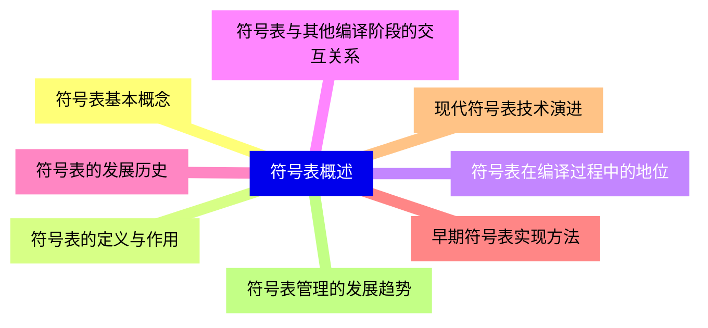

<--->
{}
{}
{}
{}
{}
{}
{}
{}
{}
{}
{}
{}
{}
{}
{}
{}
{}

### 2 符号表数据结构{#2}

{}
{}
{}
{}
{}
{}
{}
{}
{}
{}
{}
{}
{}
{}
{}
{}
{}
{}
{}
{}
{}
{}
{}
{}
{}
{}
{}
{}
{}
<--->
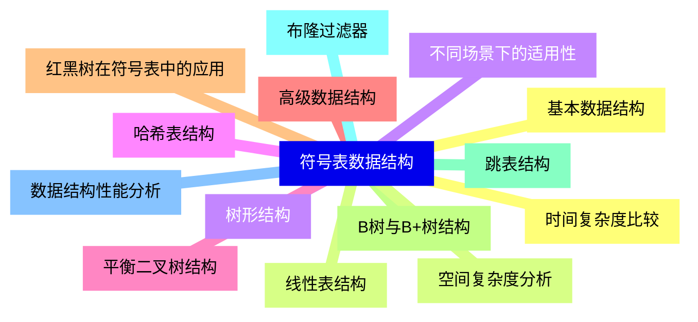

{}

### 3 符号表组织方式{#3}

{}
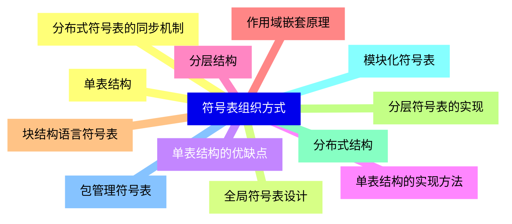

<--->
{}
{}
{}
{}
{}
{}
{}
{}
{}
{}
{}
{}
{}
{}
{}
{}
{}
{}
{}
{}
{}
{}
{}
{}
{}

### 4 符号表操作{#4}

{}
{}
{}
{}
{}
{}
{}
{}
{}
{}
{}
{}
{}
{}
{}
{}
{}
{}
{}
{}
{}
{}
{}
{}
{}
{}
{}
{}
{}
{}
{}
<--->
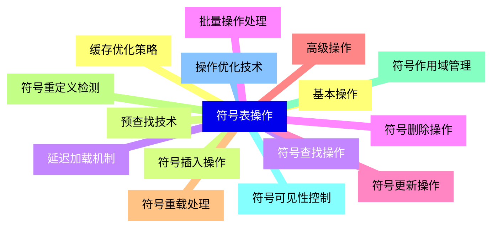

{}

### 5 符号表信息存储{#5}

{}
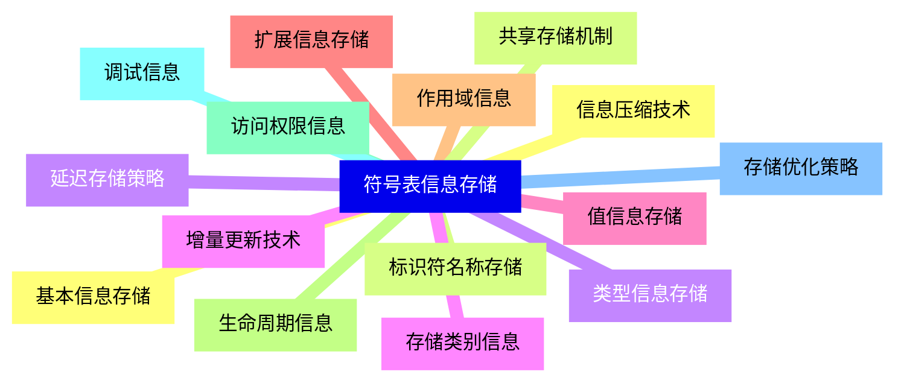

<--->
{}
{}
{}
{}
{}
{}
{}
{}
{}
{}
{}
{}
{}
{}
{}
{}
{}
{}
{}
{}
{}
{}
{}
{}
{}
{}
{}
{}
{}
{}
{}

### 6 作用域管理{#6}

{}
{}
{}
{}
{}
{}
{}
{}
{}
{}
{}
{}
{}
{}
{}
{}
{}
{}
{}
{}
{}
{}
{}
{}
{}
{}
{}
{}
{}
{}
{}
<--->
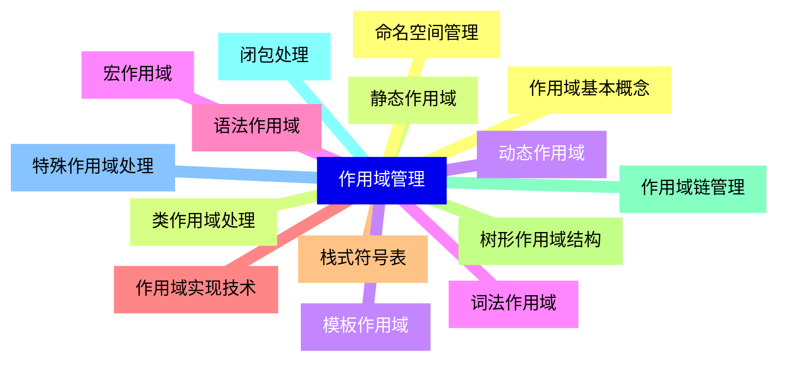

{}

### 7 类型系统与符号表{#7}

{}
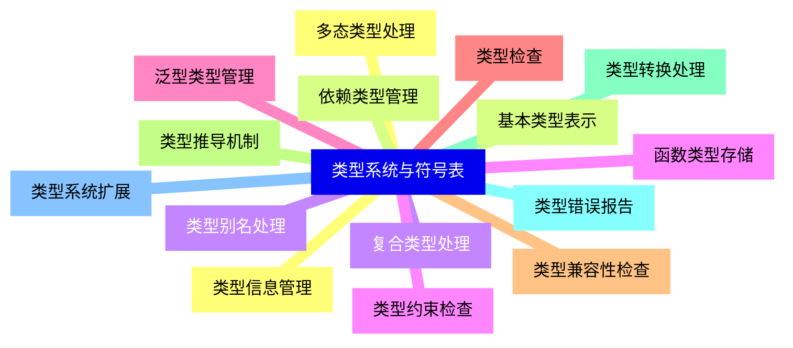

<--->
{}
{}
{}
{}
{}
{}
{}
{}
{}
{}
{}
{}
{}
{}
{}
{}
{}
{}
{}
{}
{}
{}
{}
{}
{}
{}
{}
{}
{}
{}
{}

### 8 符号表内存管理{#8}

{}
{}
{}
{}
{}
{}
{}
{}
{}
{}
{}
{}
{}
{}
{}
{}
{}
{}
{}
{}
{}
{}
{}
{}
{}
{}
{}
{}
{}
{}
{}
<--->
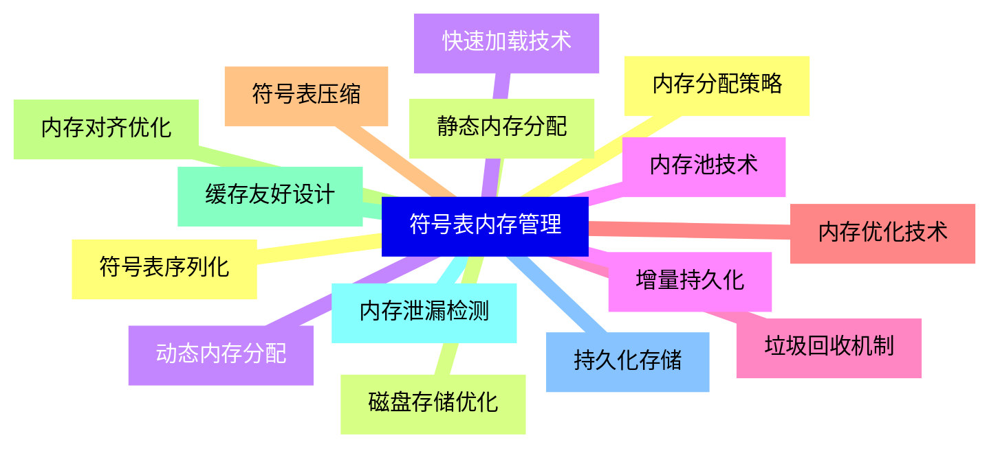

{}

### 9 符号表性能优化{#9}

{}
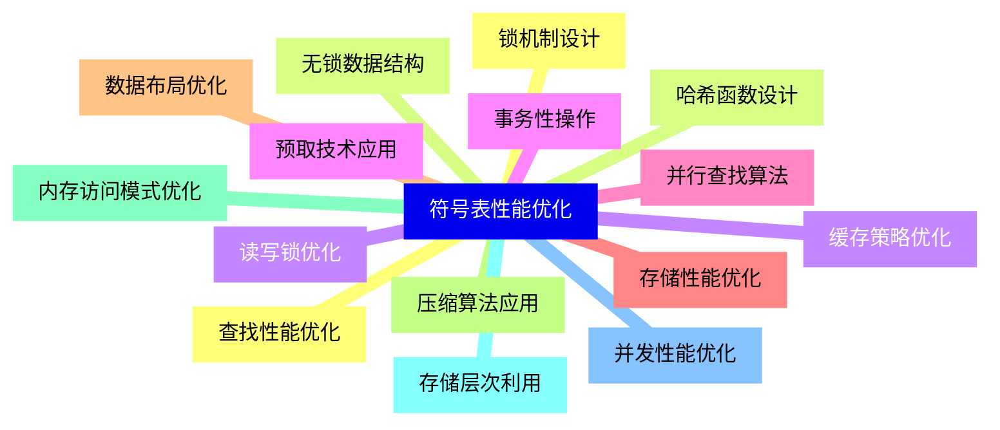

<--->
{}
{}
{}
{}
{}
{}
{}
{}
{}
{}
{}
{}
{}
{}
{}
{}
{}
{}
{}
{}
{}
{}
{}
{}
{}
{}
{}
{}
{}
{}
{}

### 10 符号表错误处理{#10}

{}
{}
{}
{}
{}
{}
{}
{}
{}
{}
{}
{}
{}
{}
{}
{}
{}
{}
{}
{}
{}
{}
{}
{}
{}
{}
{}
{}
{}
{}
{}
<--->
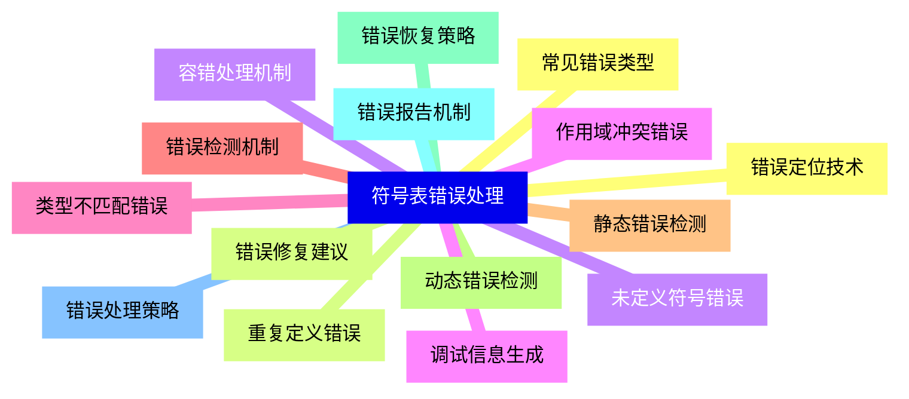

{}

### 11 符号表在编译器中的应用{#11}

{}
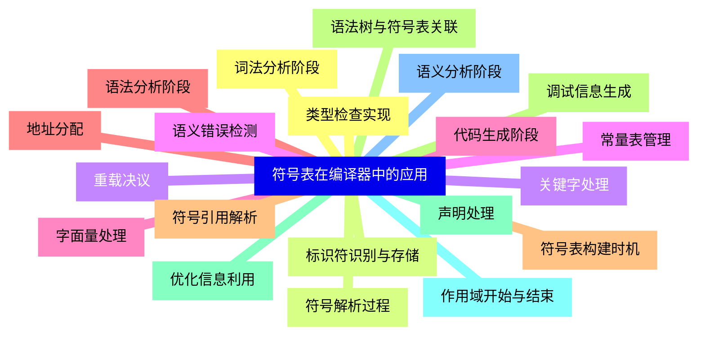

<--->
{}
{}
{}
{}
{}
{}
{}
{}
{}
{}
{}
{}
{}
{}
{}
{}
{}
{}
{}
{}
{}
{}
{}
{}
{}
{}
{}
{}
{}
{}
{}
{}
{}
{}
{}
{}
{}
{}
{}
{}
{}

### 12 特殊语言特性处理{#12}

{}
{}
{}
{}
{}
{}
{}
{}
{}
{}
{}
{}
{}
{}
{}
{}
{}
{}
{}
{}
{}
{}
{}
{}
{}
{}
{}
{}
{}
{}
{}
<--->
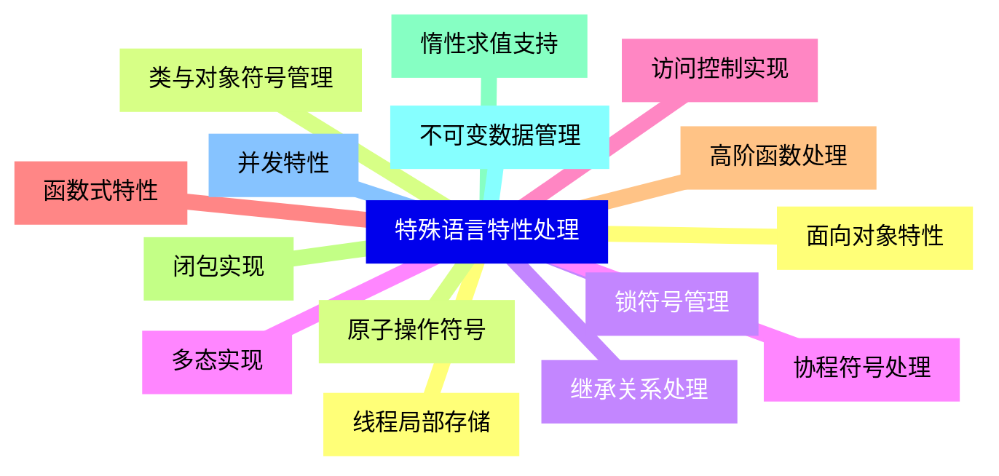

{}

### 13 符号表工具与调试{#13}

{}
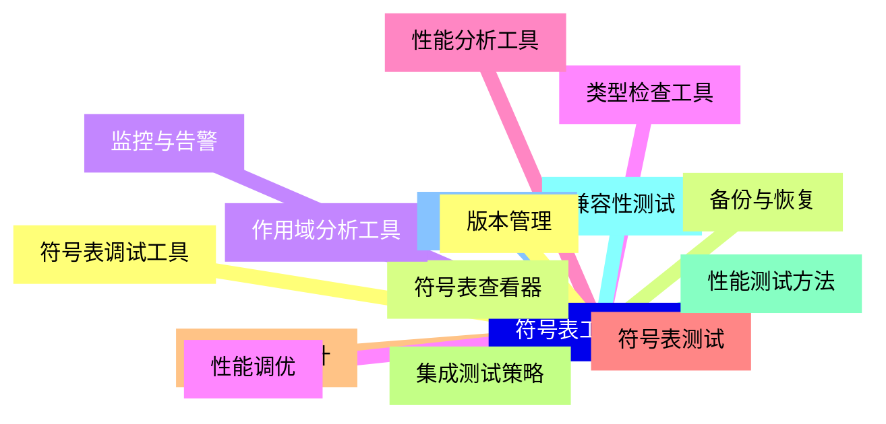

<--->
{}
{}
{}
{}
{}
{}
{}
{}
{}
{}
{}
{}
{}
{}
{}
{}
{}
{}
{}
{}
{}
{}
{}
{}
{}
{}
{}
{}
{}
{}
{}

### 14 实际编译器案例分析{#14}

{}
{}
{}
{}
{}
{}
{}
{}
{}
{}
{}
{}
{}
{}
{}
{}
{}
{}
{}
{}
{}
{}
{}
{}
{}
{}
{}
{}
{}
{}
{}
{}
{}
{}
{}
{}
{}
{}
{}
{}
{}
<--->
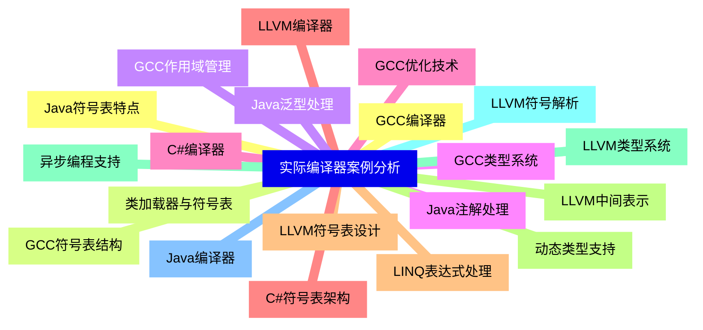

{}

### 15 符号表研究前沿{#15}

{}
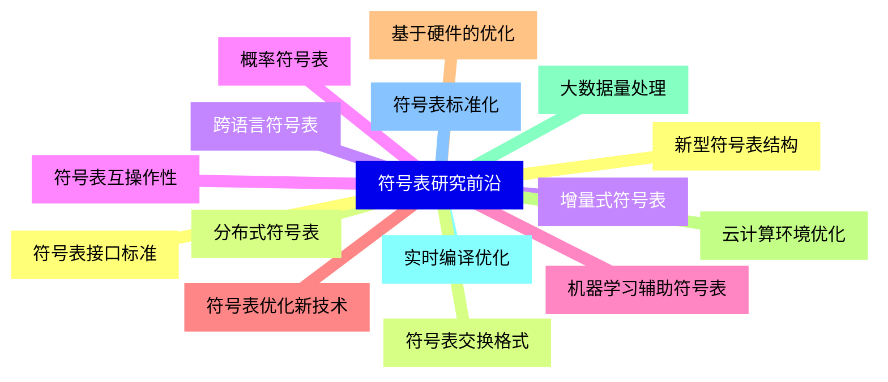

<--->
{}
{}
{}
{}
{}
{}
{}
{}
{}
{}
{}
{}
{}
{}
{}
{}
{}
{}
{}
{}
{}
{}
{}
{}
{}
{}
{}
{}
{}
{}
{}
