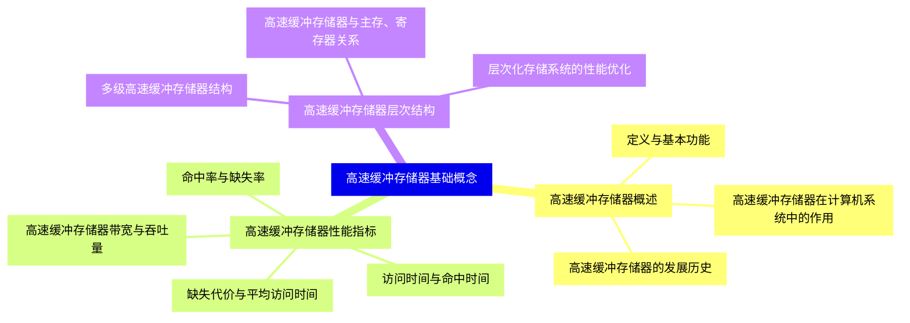
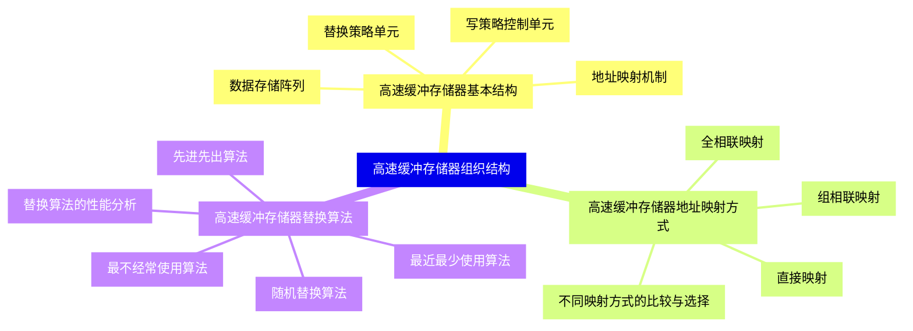
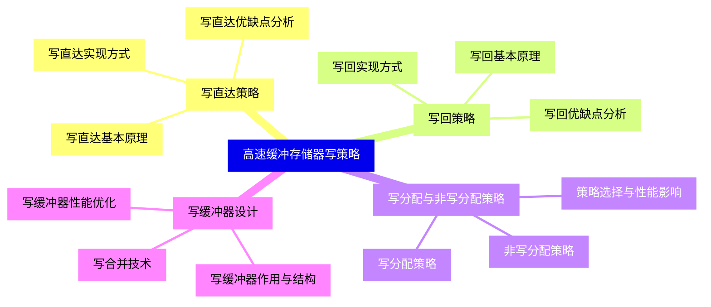
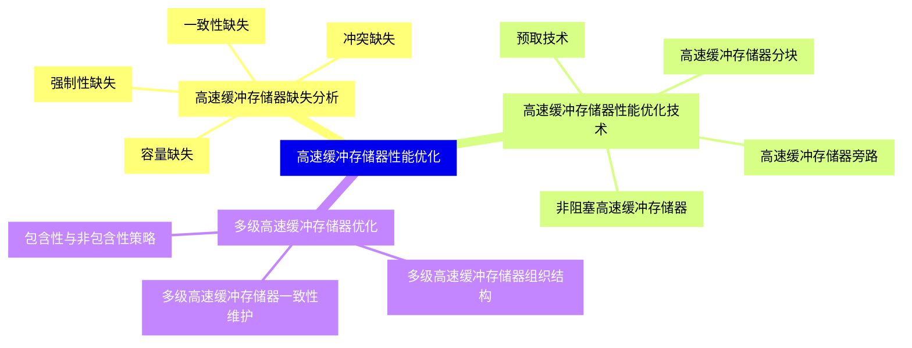
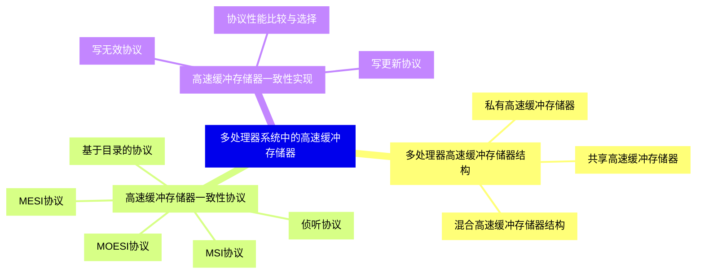
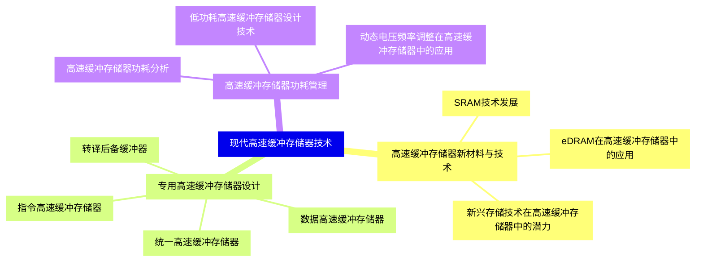
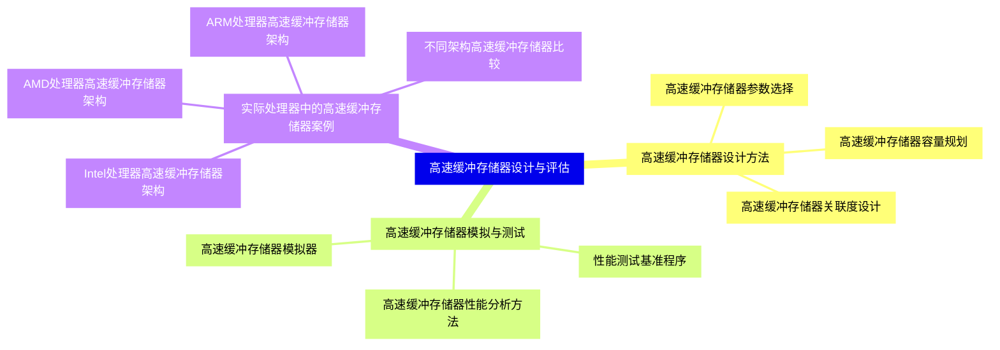
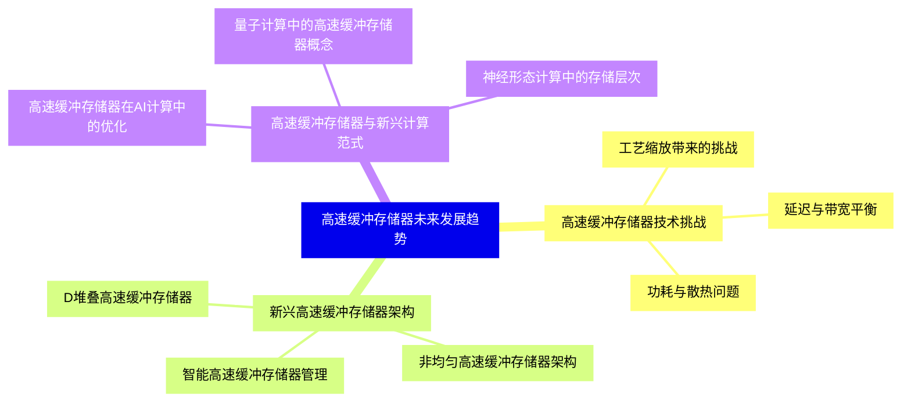


### 1 [高速缓冲存储器基础概念](#1)
#### 1.1 [高速缓冲存储器概述](#1)
##### 1.1.1 [定义与基本功能](#1)
##### 1.1.2 [高速缓冲存储器在计算机系统中的作用](#1)
##### 1.1.3 [高速缓冲存储器的发展历史](#1)
#### 1.2 [高速缓冲存储器性能指标](#1)
##### 1.2.1 [命中率与缺失率](#1)
##### 1.2.2 [访问时间与命中时间](#1)
##### 1.2.3 [缺失代价与平均访问时间](#1)
##### 1.2.4 [高速缓冲存储器带宽与吞吐量](#1)
#### 1.3 [高速缓冲存储器层次结构](#1)
##### 1.3.1 [多级高速缓冲存储器结构](#1)
##### 1.3.2 [高速缓冲存储器与主存、寄存器关系](#1)
##### 1.3.3 [层次化存储系统的性能优化](#1)
### 2 [高速缓冲存储器组织结构](#2)
#### 2.1 [高速缓冲存储器基本结构](#2)
##### 2.1.1 [数据存储阵列](#2)
##### 2.1.2 [地址映射机制](#2)
##### 2.1.3 [替换策略单元](#2)
##### 2.1.4 [写策略控制单元](#2)
#### 2.2 [高速缓冲存储器地址映射方式](#2)
##### 2.2.1 [直接映射](#2)
##### 2.2.2 [全相联映射](#2)
##### 2.2.3 [组相联映射](#2)
##### 2.2.4 [不同映射方式的比较与选择](#2)
#### 2.3 [高速缓冲存储器替换算法](#2)
##### 2.3.1 [随机替换算法](#2)
##### 2.3.2 [先进先出算法](#2)
##### 2.3.3 [最近最少使用算法](#2)
##### 2.3.4 [最不经常使用算法](#2)
##### 2.3.5 [替换算法的性能分析](#2)
### 3 [高速缓冲存储器写策略](#3)
#### 3.1 [写直达策略](#3)
##### 3.1.1 [写直达基本原理](#3)
##### 3.1.2 [写直达实现方式](#3)
##### 3.1.3 [写直达优缺点分析](#3)
#### 3.2 [写回策略](#3)
##### 3.2.1 [写回基本原理](#3)
##### 3.2.2 [写回实现方式](#3)
##### 3.2.3 [写回优缺点分析](#3)
#### 3.3 [写分配与非写分配策略](#3)
##### 3.3.1 [写分配策略](#3)
##### 3.3.2 [非写分配策略](#3)
##### 3.3.3 [策略选择与性能影响](#3)
#### 3.4 [写缓冲器设计](#3)
##### 3.4.1 [写缓冲器作用与结构](#3)
##### 3.4.2 [写合并技术](#3)
##### 3.4.3 [写缓冲器性能优化](#3)
### 4 [高速缓冲存储器性能优化](#4)
#### 4.1 [高速缓冲存储器缺失分析](#4)
##### 4.1.1 [强制性缺失](#4)
##### 4.1.2 [容量缺失](#4)
##### 4.1.3 [冲突缺失](#4)
##### 4.1.4 [一致性缺失](#4)
#### 4.2 [高速缓冲存储器性能优化技术](#4)
##### 4.2.1 [预取技术](#4)
##### 4.2.2 [高速缓冲存储器分块](#4)
##### 4.2.3 [高速缓冲存储器旁路](#4)
##### 4.2.4 [非阻塞高速缓冲存储器](#4)
#### 4.3 [多级高速缓冲存储器优化](#4)
##### 4.3.1 [多级高速缓冲存储器组织结构](#4)
##### 4.3.2 [包含性与非包含性策略](#4)
##### 4.3.3 [多级高速缓冲存储器一致性维护](#4)
### 5 [多处理器系统中的高速缓冲存储器](#5)
#### 5.1 [多处理器高速缓冲存储器结构](#5)
##### 5.1.1 [共享高速缓冲存储器](#5)
##### 5.1.2 [私有高速缓冲存储器](#5)
##### 5.1.3 [混合高速缓冲存储器结构](#5)
#### 5.2 [高速缓冲存储器一致性协议](#5)
##### 5.2.1 [基于目录的协议](#5)
##### 5.2.2 [侦听协议](#5)
##### 5.2.3 [MSI协议](#5)
##### 5.2.4 [MESI协议](#5)
##### 5.2.5 [MOESI协议](#5)
#### 5.3 [高速缓冲存储器一致性实现](#5)
##### 5.3.1 [写无效协议](#5)
##### 5.3.2 [写更新协议](#5)
##### 5.3.3 [协议性能比较与选择](#5)
### 6 [现代高速缓冲存储器技术](#6)
#### 6.1 [高速缓冲存储器新材料与技术](#6)
##### 6.1.1 [SRAM技术发展](#6)
##### 6.1.2 [eDRAM在高速缓冲存储器中的应用](#6)
##### 6.1.3 [新兴存储技术在高速缓冲存储器中的潜力](#6)
#### 6.2 [专用高速缓冲存储器设计](#6)
##### 6.2.1 [指令高速缓冲存储器](#6)
##### 6.2.2 [数据高速缓冲存储器](#6)
##### 6.2.3 [统一高速缓冲存储器](#6)
##### 6.2.4 [转译后备缓冲器](#6)
#### 6.3 [高速缓冲存储器功耗管理](#6)
##### 6.3.1 [高速缓冲存储器功耗分析](#6)
##### 6.3.2 [低功耗高速缓冲存储器设计技术](#6)
##### 6.3.3 [动态电压频率调整在高速缓冲存储器中的应用](#6)
### 7 [高速缓冲存储器设计与评估](#7)
#### 7.1 [高速缓冲存储器设计方法](#7)
##### 7.1.1 [高速缓冲存储器参数选择](#7)
##### 7.1.2 [高速缓冲存储器容量规划](#7)
##### 7.1.3 [高速缓冲存储器关联度设计](#7)
#### 7.2 [高速缓冲存储器模拟与测试](#7)
##### 7.2.1 [高速缓冲存储器模拟器](#7)
##### 7.2.2 [性能测试基准程序](#7)
##### 7.2.3 [高速缓冲存储器性能分析方法](#7)
#### 7.3 [实际处理器中的高速缓冲存储器案例](#7)
##### 7.3.1 [Intel处理器高速缓冲存储器架构](#7)
##### 7.3.2 [AMD处理器高速缓冲存储器架构](#7)
##### 7.3.3 [ARM处理器高速缓冲存储器架构](#7)
##### 7.3.4 [不同架构高速缓冲存储器比较](#7)
### 8 [高速缓冲存储器未来发展趋势](#8)
#### 8.1 [高速缓冲存储器技术挑战](#8)
##### 8.1.1 [工艺缩放带来的挑战](#8)
##### 8.1.2 [功耗与散热问题](#8)
##### 8.1.3 [延迟与带宽平衡](#8)
#### 8.2 [新兴高速缓冲存储器架构](#8)
##### 8.2.1 [D堆叠高速缓冲存储器](#8)
##### 8.2.2 [非均匀高速缓冲存储器架构](#8)
##### 8.2.3 [智能高速缓冲存储器管理](#8)
#### 8.3 [高速缓冲存储器与新兴计算范式](#8)
##### 8.3.1 [高速缓冲存储器在AI计算中的优化](#8)
##### 8.3.2 [量子计算中的高速缓冲存储器概念](#8)
##### 8.3.3 [神经形态计算中的存储层次](#8)




### 1 高速缓冲存储器基础概念

---
### 1 高速缓冲存储器基础概念
___
#### 1.1 高速缓冲存储器概述
___
##### 1.1.1 定义与基本功能
___
##### 1.1.2 高速缓冲存储器在计算机系统中的作用
___
##### 1.1.3 高速缓冲存储器的发展历史
___
#### 1.2 高速缓冲存储器性能指标
___
##### 1.2.1 命中率与缺失率
___
##### 1.2.2 访问时间与命中时间
___
##### 1.2.3 缺失代价与平均访问时间
___
##### 1.2.4 高速缓冲存储器带宽与吞吐量
___
#### 1.3 高速缓冲存储器层次结构
___
##### 1.3.1 多级高速缓冲存储器结构
___
##### 1.3.2 高速缓冲存储器与主存、寄存器关系
___
##### 1.3.3 层次化存储系统的性能优化
### 2 高速缓冲存储器组织结构

---
### 2 高速缓冲存储器组织结构
___
#### 2.1 高速缓冲存储器基本结构
___
##### 2.1.1 数据存储阵列
___
##### 2.1.2 地址映射机制
___
##### 2.1.3 替换策略单元
___
##### 2.1.4 写策略控制单元
___
#### 2.2 高速缓冲存储器地址映射方式
___
##### 2.2.1 直接映射
___
##### 2.2.2 全相联映射
___
##### 2.2.3 组相联映射
___
##### 2.2.4 不同映射方式的比较与选择
___
#### 2.3 高速缓冲存储器替换算法
___
##### 2.3.1 随机替换算法
___
##### 2.3.2 先进先出算法
___
##### 2.3.3 最近最少使用算法
___
##### 2.3.4 最不经常使用算法
___
##### 2.3.5 替换算法的性能分析
### 3 高速缓冲存储器写策略

---
### 3 高速缓冲存储器写策略
___
#### 3.1 写直达策略
___
##### 3.1.1 写直达基本原理
___
##### 3.1.2 写直达实现方式
___
##### 3.1.3 写直达优缺点分析
___
#### 3.2 写回策略
___
##### 3.2.1 写回基本原理
___
##### 3.2.2 写回实现方式
___
##### 3.2.3 写回优缺点分析
___
#### 3.3 写分配与非写分配策略
___
##### 3.3.1 写分配策略
___
##### 3.3.2 非写分配策略
___
##### 3.3.3 策略选择与性能影响
___
#### 3.4 写缓冲器设计
___
##### 3.4.1 写缓冲器作用与结构
___
##### 3.4.2 写合并技术
___
##### 3.4.3 写缓冲器性能优化
### 4 高速缓冲存储器性能优化

---
### 4 高速缓冲存储器性能优化
___
#### 4.1 高速缓冲存储器缺失分析
___
##### 4.1.1 强制性缺失
___
##### 4.1.2 容量缺失
___
##### 4.1.3 冲突缺失
___
##### 4.1.4 一致性缺失
___
#### 4.2 高速缓冲存储器性能优化技术
___
##### 4.2.1 预取技术
___
##### 4.2.2 高速缓冲存储器分块
___
##### 4.2.3 高速缓冲存储器旁路
___
##### 4.2.4 非阻塞高速缓冲存储器
___
#### 4.3 多级高速缓冲存储器优化
___
##### 4.3.1 多级高速缓冲存储器组织结构
___
##### 4.3.2 包含性与非包含性策略
___
##### 4.3.3 多级高速缓冲存储器一致性维护
### 5 多处理器系统中的高速缓冲存储器

---
### 5 多处理器系统中的高速缓冲存储器
___
#### 5.1 多处理器高速缓冲存储器结构
___
##### 5.1.1 共享高速缓冲存储器
___
##### 5.1.2 私有高速缓冲存储器
___
##### 5.1.3 混合高速缓冲存储器结构
___
#### 5.2 高速缓冲存储器一致性协议
___
##### 5.2.1 基于目录的协议
___
##### 5.2.2 侦听协议
___
##### 5.2.3 MSI协议
___
##### 5.2.4 MESI协议
___
##### 5.2.5 MOESI协议
___
#### 5.3 高速缓冲存储器一致性实现
___
##### 5.3.1 写无效协议
___
##### 5.3.2 写更新协议
___
##### 5.3.3 协议性能比较与选择
### 6 现代高速缓冲存储器技术

---
### 6 现代高速缓冲存储器技术
___
#### 6.1 高速缓冲存储器新材料与技术
___
##### 6.1.1 SRAM技术发展
___
##### 6.1.2 eDRAM在高速缓冲存储器中的应用
___
##### 6.1.3 新兴存储技术在高速缓冲存储器中的潜力
___
#### 6.2 专用高速缓冲存储器设计
___
##### 6.2.1 指令高速缓冲存储器
___
##### 6.2.2 数据高速缓冲存储器
___
##### 6.2.3 统一高速缓冲存储器
___
##### 6.2.4 转译后备缓冲器
___
#### 6.3 高速缓冲存储器功耗管理
___
##### 6.3.1 高速缓冲存储器功耗分析
___
##### 6.3.2 低功耗高速缓冲存储器设计技术
___
##### 6.3.3 动态电压频率调整在高速缓冲存储器中的应用
### 7 高速缓冲存储器设计与评估

---
### 7 高速缓冲存储器设计与评估
___
#### 7.1 高速缓冲存储器设计方法
___
##### 7.1.1 高速缓冲存储器参数选择
___
##### 7.1.2 高速缓冲存储器容量规划
___
##### 7.1.3 高速缓冲存储器关联度设计
___
#### 7.2 高速缓冲存储器模拟与测试
___
##### 7.2.1 高速缓冲存储器模拟器
___
##### 7.2.2 性能测试基准程序
___
##### 7.2.3 高速缓冲存储器性能分析方法
___
#### 7.3 实际处理器中的高速缓冲存储器案例
___
##### 7.3.1 Intel处理器高速缓冲存储器架构
___
##### 7.3.2 AMD处理器高速缓冲存储器架构
___
##### 7.3.3 ARM处理器高速缓冲存储器架构
___
##### 7.3.4 不同架构高速缓冲存储器比较
### 8 高速缓冲存储器未来发展趋势

---
### 8 高速缓冲存储器未来发展趋势
___
#### 8.1 高速缓冲存储器技术挑战
___
##### 8.1.1 工艺缩放带来的挑战
___
##### 8.1.2 功耗与散热问题
___
##### 8.1.3 延迟与带宽平衡
___
#### 8.2 新兴高速缓冲存储器架构
___
##### 8.2.1 D堆叠高速缓冲存储器
___
##### 8.2.2 非均匀高速缓冲存储器架构
___
##### 8.2.3 智能高速缓冲存储器管理
___
#### 8.3 高速缓冲存储器与新兴计算范式
___
##### 8.3.1 高速缓冲存储器在AI计算中的优化
___
##### 8.3.2 量子计算中的高速缓冲存储器概念
___
##### 8.3.3 神经形态计算中的存储层次


### 1 高速缓冲存储器基础概念{#1}

{}

<--->
{}
{}
{}
{}
{}
{}
{}
{}
{}
{}
{}
{}
{}
{}
{}
{}
{}
{}
{}
{}
{}
{}
{}
{}
{}
{}
{}

### 2 高速缓冲存储器组织结构{#2}

{}
{}
{}
{}
{}
{}
{}
{}
{}
{}
{}
{}
{}
{}
{}
{}
{}
{}
{}
{}
{}
{}
{}
{}
{}
{}
{}
{}
{}
{}
{}
{}
{}
<--->

{}

### 3 高速缓冲存储器写策略{#3}

{}

<--->
{}
{}
{}
{}
{}
{}
{}
{}
{}
{}
{}
{}
{}
{}
{}
{}
{}
{}
{}
{}
{}
{}
{}
{}
{}
{}
{}
{}
{}
{}
{}
{}
{}

### 4 高速缓冲存储器性能优化{#4}

{}
{}
{}
{}
{}
{}
{}
{}
{}
{}
{}
{}
{}
{}
{}
{}
{}
{}
{}
{}
{}
{}
{}
{}
{}
{}
{}
{}
{}
<--->

{}

### 5 多处理器系统中的高速缓冲存储器{#5}

{}

<--->
{}
{}
{}
{}
{}
{}
{}
{}
{}
{}
{}
{}
{}
{}
{}
{}
{}
{}
{}
{}
{}
{}
{}
{}
{}
{}
{}
{}
{}

### 6 现代高速缓冲存储器技术{#6}

{}
{}
{}
{}
{}
{}
{}
{}
{}
{}
{}
{}
{}
{}
{}
{}
{}
{}
{}
{}
{}
{}
{}
{}
{}
{}
{}
<--->

{}

### 7 高速缓冲存储器设计与评估{#7}

{}

<--->
{}
{}
{}
{}
{}
{}
{}
{}
{}
{}
{}
{}
{}
{}
{}
{}
{}
{}
{}
{}
{}
{}
{}
{}
{}
{}
{}

### 8 高速缓冲存储器未来发展趋势{#8}

{}
{}
{}
{}
{}
{}
{}
{}
{}
{}
{}
{}
{}
{}
{}
{}
{}
{}
{}
{}
{}
{}
{}
{}
{}
<--->

{}
