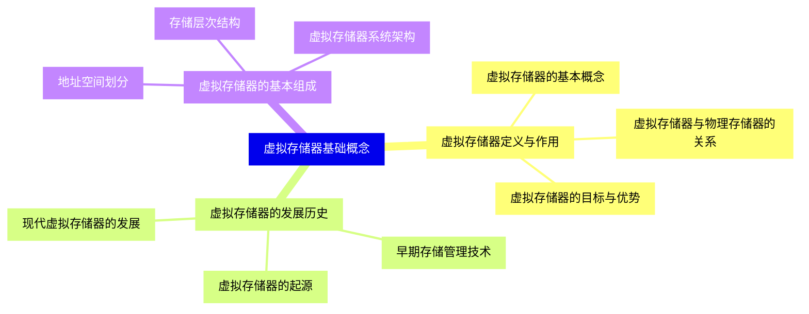
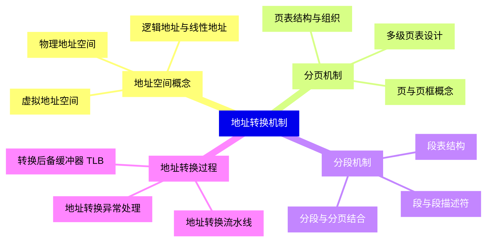
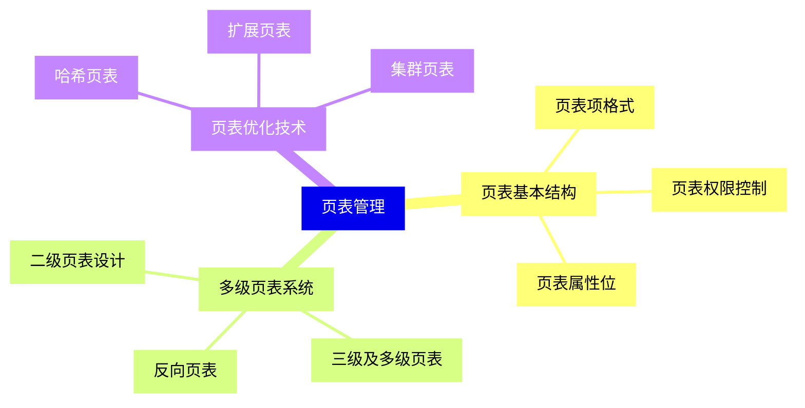
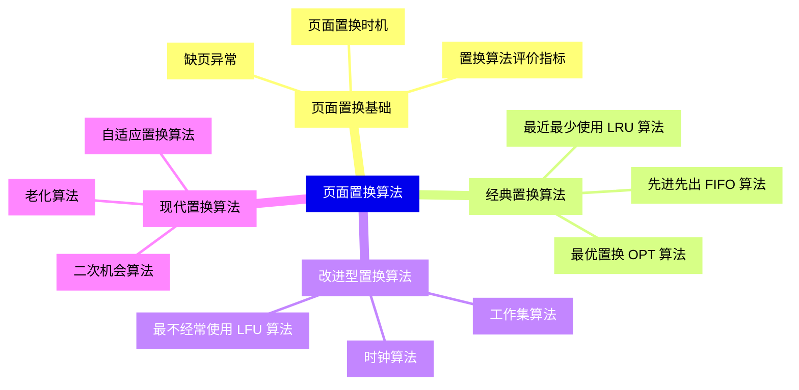
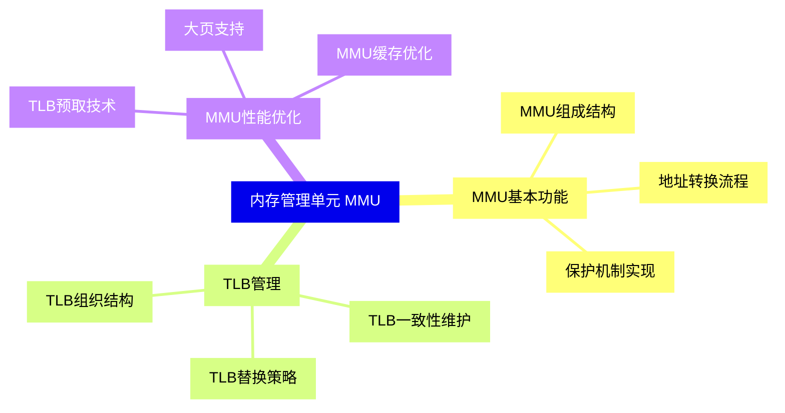
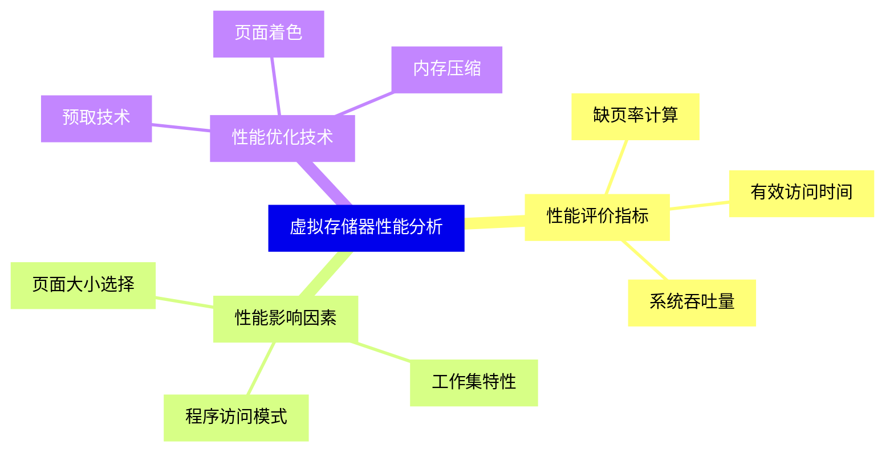
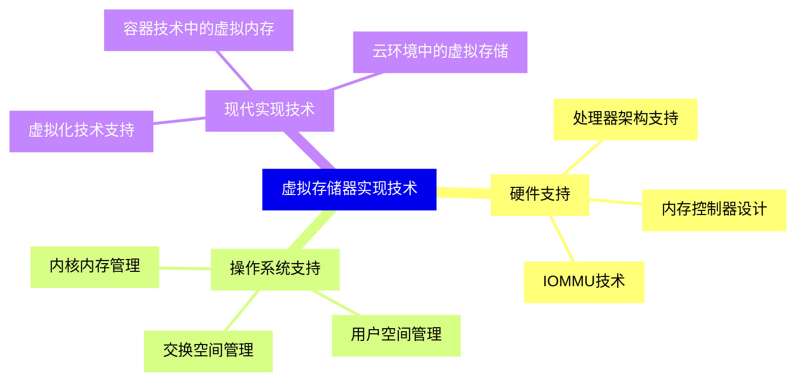
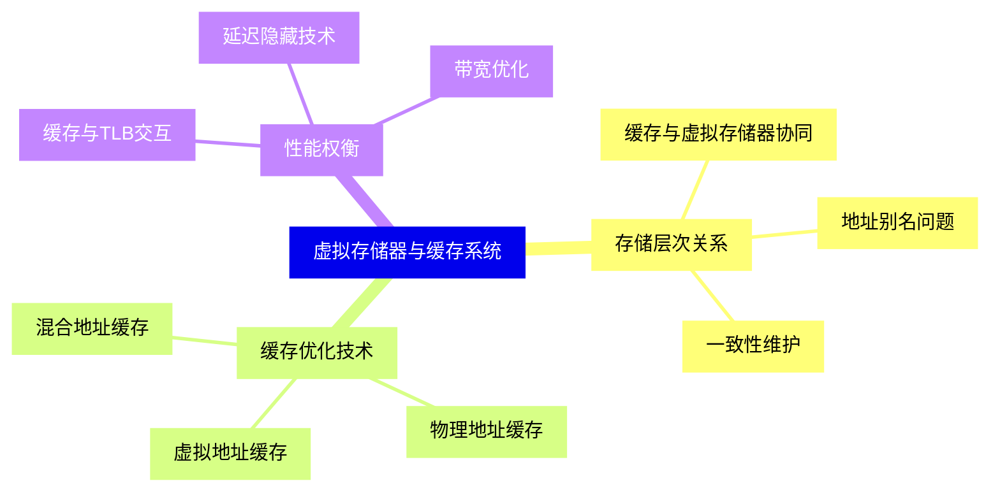
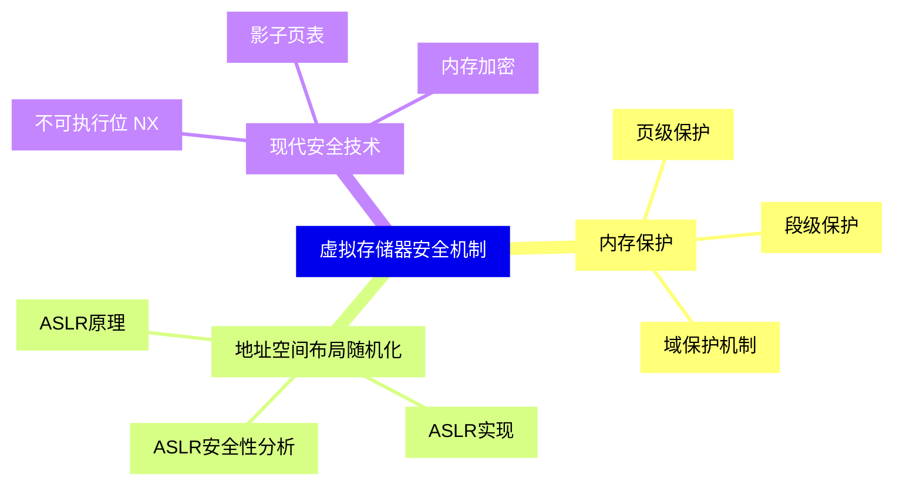
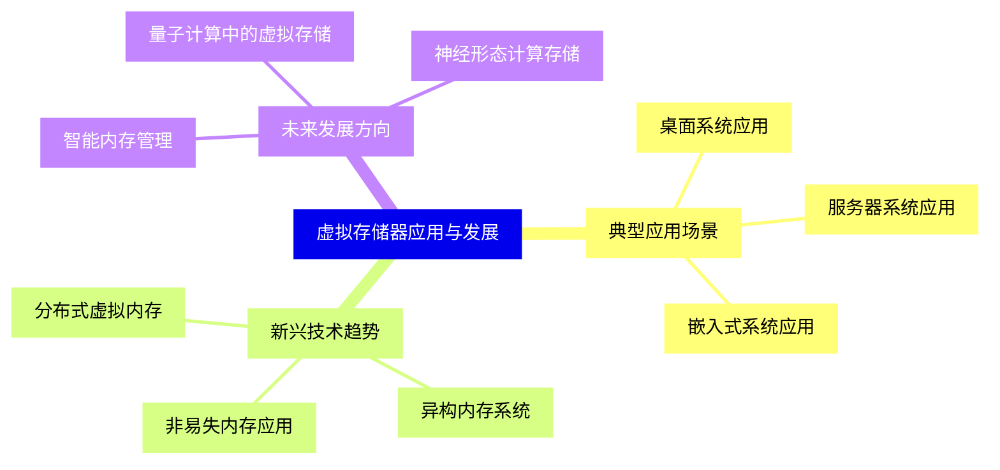


### 1 [虚拟存储器基础概念](#1)
#### 1.1 [虚拟存储器定义与作用](#1)
##### 1.1.1 [虚拟存储器的基本概念](#1)
##### 1.1.2 [虚拟存储器的目标与优势](#1)
##### 1.1.3 [虚拟存储器与物理存储器的关系](#1)
#### 1.2 [虚拟存储器的发展历史](#1)
##### 1.2.1 [早期存储管理技术](#1)
##### 1.2.2 [虚拟存储器的起源](#1)
##### 1.2.3 [现代虚拟存储器的发展](#1)
#### 1.3 [虚拟存储器的基本组成](#1)
##### 1.3.1 [地址空间划分](#1)
##### 1.3.2 [存储层次结构](#1)
##### 1.3.3 [虚拟存储器系统架构](#1)
### 2 [地址转换机制](#2)
#### 2.1 [地址空间概念](#2)
##### 2.1.1 [虚拟地址空间](#2)
##### 2.1.2 [物理地址空间](#2)
##### 2.1.3 [逻辑地址与线性地址](#2)
#### 2.2 [分页机制](#2)
##### 2.2.1 [页与页框概念](#2)
##### 2.2.2 [页表结构与组织](#2)
##### 2.2.3 [多级页表设计](#2)
#### 2.3 [分段机制](#2)
##### 2.3.1 [段与段描述符](#2)
##### 2.3.2 [段表结构](#2)
##### 2.3.3 [分段与分页结合](#2)
#### 2.4 [地址转换过程](#2)
##### 2.4.1 [地址转换流水线](#2)
##### 2.4.2 [转换后备缓冲器 TLB](#2)
##### 2.4.3 [地址转换异常处理](#2)
### 3 [页表管理](#3)
#### 3.1 [页表基本结构](#3)
##### 3.1.1 [页表项格式](#3)
##### 3.1.2 [页表权限控制](#3)
##### 3.1.3 [页表属性位](#3)
#### 3.2 [多级页表系统](#3)
##### 3.2.1 [二级页表设计](#3)
##### 3.2.2 [三级及多级页表](#3)
##### 3.2.3 [反向页表](#3)
#### 3.3 [页表优化技术](#3)
##### 3.3.1 [哈希页表](#3)
##### 3.3.2 [集群页表](#3)
##### 3.3.3 [扩展页表](#3)
### 4 [页面置换算法](#4)
#### 4.1 [页面置换基础](#4)
##### 4.1.1 [缺页异常](#4)
##### 4.1.2 [页面置换时机](#4)
##### 4.1.3 [置换算法评价指标](#4)
#### 4.2 [经典置换算法](#4)
##### 4.2.1 [先进先出 FIFO 算法](#4)
##### 4.2.2 [最优置换 OPT 算法](#4)
##### 4.2.3 [最近最少使用 LRU 算法](#4)
#### 4.3 [改进型置换算法](#4)
##### 4.3.1 [时钟算法](#4)
##### 4.3.2 [最不经常使用 LFU 算法](#4)
##### 4.3.3 [工作集算法](#4)
#### 4.4 [现代置换算法](#4)
##### 4.4.1 [二次机会算法](#4)
##### 4.4.2 [老化算法](#4)
##### 4.4.3 [自适应置换算法](#4)
### 5 [内存管理单元 MMU](#5)
#### 5.1 [MMU基本功能](#5)
##### 5.1.1 [MMU组成结构](#5)
##### 5.1.2 [地址转换流程](#5)
##### 5.1.3 [保护机制实现](#5)
#### 5.2 [TLB管理](#5)
##### 5.2.1 [TLB组织结构](#5)
##### 5.2.2 [TLB替换策略](#5)
##### 5.2.3 [TLB一致性维护](#5)
#### 5.3 [MMU性能优化](#5)
##### 5.3.1 [TLB预取技术](#5)
##### 5.3.2 [大页支持](#5)
##### 5.3.3 [MMU缓存优化](#5)
### 6 [虚拟存储器性能分析](#6)
#### 6.1 [性能评价指标](#6)
##### 6.1.1 [缺页率计算](#6)
##### 6.1.2 [有效访问时间](#6)
##### 6.1.3 [系统吞吐量](#6)
#### 6.2 [性能影响因素](#6)
##### 6.2.1 [页面大小选择](#6)
##### 6.2.2 [工作集特性](#6)
##### 6.2.3 [程序访问模式](#6)
#### 6.3 [性能优化技术](#6)
##### 6.3.1 [预取技术](#6)
##### 6.3.2 [页面着色](#6)
##### 6.3.3 [内存压缩](#6)
### 7 [虚拟存储器实现技术](#7)
#### 7.1 [硬件支持](#7)
##### 7.1.1 [处理器架构支持](#7)
##### 7.1.2 [内存控制器设计](#7)
##### 7.1.3 [IOMMU技术](#7)
#### 7.2 [操作系统支持](#7)
##### 7.2.1 [内核内存管理](#7)
##### 7.2.2 [用户空间管理](#7)
##### 7.2.3 [交换空间管理](#7)
#### 7.3 [现代实现技术](#7)
##### 7.3.1 [虚拟化技术支持](#7)
##### 7.3.2 [容器技术中的虚拟内存](#7)
##### 7.3.3 [云环境中的虚拟存储](#7)
### 8 [虚拟存储器与缓存系统](#8)
#### 8.1 [存储层次关系](#8)
##### 8.1.1 [缓存与虚拟存储器协同](#8)
##### 8.1.2 [地址别名问题](#8)
##### 8.1.3 [一致性维护](#8)
#### 8.2 [缓存优化技术](#8)
##### 8.2.1 [虚拟地址缓存](#8)
##### 8.2.2 [物理地址缓存](#8)
##### 8.2.3 [混合地址缓存](#8)
#### 8.3 [性能权衡](#8)
##### 8.3.1 [缓存与TLB交互](#8)
##### 8.3.2 [延迟隐藏技术](#8)
##### 8.3.3 [带宽优化](#8)
### 9 [虚拟存储器安全机制](#9)
#### 9.1 [内存保护](#9)
##### 9.1.1 [页级保护](#9)
##### 9.1.2 [段级保护](#9)
##### 9.1.3 [域保护机制](#9)
#### 9.2 [地址空间布局随机化](#9)
##### 9.2.1 [ASLR原理](#9)
##### 9.2.2 [ASLR实现](#9)
##### 9.2.3 [ASLR安全性分析](#9)
#### 9.3 [现代安全技术](#9)
##### 9.3.1 [不可执行位 NX](#9)
##### 9.3.2 [影子页表](#9)
##### 9.3.3 [内存加密](#9)
### 10 [虚拟存储器应用与发展](#10)
#### 10.1 [典型应用场景](#10)
##### 10.1.1 [桌面系统应用](#10)
##### 10.1.2 [服务器系统应用](#10)
##### 10.1.3 [嵌入式系统应用](#10)
#### 10.2 [新兴技术趋势](#10)
##### 10.2.1 [非易失内存应用](#10)
##### 10.2.2 [异构内存系统](#10)
##### 10.2.3 [分布式虚拟内存](#10)
#### 10.3 [未来发展方向](#10)
##### 10.3.1 [智能内存管理](#10)
##### 10.3.2 [量子计算中的虚拟存储](#10)
##### 10.3.3 [神经形态计算存储](#10)




### 1 虚拟存储器基础概念

---
### 1 虚拟存储器基础概念
___
#### 1.1 虚拟存储器定义与作用
___
##### 1.1.1 虚拟存储器的基本概念
___
##### 1.1.2 虚拟存储器的目标与优势
___
##### 1.1.3 虚拟存储器与物理存储器的关系
___
#### 1.2 虚拟存储器的发展历史
___
##### 1.2.1 早期存储管理技术
___
##### 1.2.2 虚拟存储器的起源
___
##### 1.2.3 现代虚拟存储器的发展
___
#### 1.3 虚拟存储器的基本组成
___
##### 1.3.1 地址空间划分
___
##### 1.3.2 存储层次结构
___
##### 1.3.3 虚拟存储器系统架构
### 2 地址转换机制

---
### 2 地址转换机制
___
#### 2.1 地址空间概念
___
##### 2.1.1 虚拟地址空间
___
##### 2.1.2 物理地址空间
___
##### 2.1.3 逻辑地址与线性地址
___
#### 2.2 分页机制
___
##### 2.2.1 页与页框概念
___
##### 2.2.2 页表结构与组织
___
##### 2.2.3 多级页表设计
___
#### 2.3 分段机制
___
##### 2.3.1 段与段描述符
___
##### 2.3.2 段表结构
___
##### 2.3.3 分段与分页结合
___
#### 2.4 地址转换过程
___
##### 2.4.1 地址转换流水线
___
##### 2.4.2 转换后备缓冲器 TLB
___
##### 2.4.3 地址转换异常处理
### 3 页表管理

---
### 3 页表管理
___
#### 3.1 页表基本结构
___
##### 3.1.1 页表项格式
___
##### 3.1.2 页表权限控制
___
##### 3.1.3 页表属性位
___
#### 3.2 多级页表系统
___
##### 3.2.1 二级页表设计
___
##### 3.2.2 三级及多级页表
___
##### 3.2.3 反向页表
___
#### 3.3 页表优化技术
___
##### 3.3.1 哈希页表
___
##### 3.3.2 集群页表
___
##### 3.3.3 扩展页表
### 4 页面置换算法

---
### 4 页面置换算法
___
#### 4.1 页面置换基础
___
##### 4.1.1 缺页异常
___
##### 4.1.2 页面置换时机
___
##### 4.1.3 置换算法评价指标
___
#### 4.2 经典置换算法
___
##### 4.2.1 先进先出 FIFO 算法
___
##### 4.2.2 最优置换 OPT 算法
___
##### 4.2.3 最近最少使用 LRU 算法
___
#### 4.3 改进型置换算法
___
##### 4.3.1 时钟算法
___
##### 4.3.2 最不经常使用 LFU 算法
___
##### 4.3.3 工作集算法
___
#### 4.4 现代置换算法
___
##### 4.4.1 二次机会算法
___
##### 4.4.2 老化算法
___
##### 4.4.3 自适应置换算法
### 5 内存管理单元 MMU

---
### 5 内存管理单元 MMU
___
#### 5.1 MMU基本功能
___
##### 5.1.1 MMU组成结构
___
##### 5.1.2 地址转换流程
___
##### 5.1.3 保护机制实现
___
#### 5.2 TLB管理
___
##### 5.2.1 TLB组织结构
___
##### 5.2.2 TLB替换策略
___
##### 5.2.3 TLB一致性维护
___
#### 5.3 MMU性能优化
___
##### 5.3.1 TLB预取技术
___
##### 5.3.2 大页支持
___
##### 5.3.3 MMU缓存优化
### 6 虚拟存储器性能分析

---
### 6 虚拟存储器性能分析
___
#### 6.1 性能评价指标
___
##### 6.1.1 缺页率计算
___
##### 6.1.2 有效访问时间
___
##### 6.1.3 系统吞吐量
___
#### 6.2 性能影响因素
___
##### 6.2.1 页面大小选择
___
##### 6.2.2 工作集特性
___
##### 6.2.3 程序访问模式
___
#### 6.3 性能优化技术
___
##### 6.3.1 预取技术
___
##### 6.3.2 页面着色
___
##### 6.3.3 内存压缩
### 7 虚拟存储器实现技术

---
### 7 虚拟存储器实现技术
___
#### 7.1 硬件支持
___
##### 7.1.1 处理器架构支持
___
##### 7.1.2 内存控制器设计
___
##### 7.1.3 IOMMU技术
___
#### 7.2 操作系统支持
___
##### 7.2.1 内核内存管理
___
##### 7.2.2 用户空间管理
___
##### 7.2.3 交换空间管理
___
#### 7.3 现代实现技术
___
##### 7.3.1 虚拟化技术支持
___
##### 7.3.2 容器技术中的虚拟内存
___
##### 7.3.3 云环境中的虚拟存储
### 8 虚拟存储器与缓存系统

---
### 8 虚拟存储器与缓存系统
___
#### 8.1 存储层次关系
___
##### 8.1.1 缓存与虚拟存储器协同
___
##### 8.1.2 地址别名问题
___
##### 8.1.3 一致性维护
___
#### 8.2 缓存优化技术
___
##### 8.2.1 虚拟地址缓存
___
##### 8.2.2 物理地址缓存
___
##### 8.2.3 混合地址缓存
___
#### 8.3 性能权衡
___
##### 8.3.1 缓存与TLB交互
___
##### 8.3.2 延迟隐藏技术
___
##### 8.3.3 带宽优化
### 9 虚拟存储器安全机制

---
### 9 虚拟存储器安全机制
___
#### 9.1 内存保护
___
##### 9.1.1 页级保护
___
##### 9.1.2 段级保护
___
##### 9.1.3 域保护机制
___
#### 9.2 地址空间布局随机化
___
##### 9.2.1 ASLR原理
___
##### 9.2.2 ASLR实现
___
##### 9.2.3 ASLR安全性分析
___
#### 9.3 现代安全技术
___
##### 9.3.1 不可执行位 NX
___
##### 9.3.2 影子页表
___
##### 9.3.3 内存加密
### 10 虚拟存储器应用与发展

---
### 10 虚拟存储器应用与发展
___
#### 10.1 典型应用场景
___
##### 10.1.1 桌面系统应用
___
##### 10.1.2 服务器系统应用
___
##### 10.1.3 嵌入式系统应用
___
#### 10.2 新兴技术趋势
___
##### 10.2.1 非易失内存应用
___
##### 10.2.2 异构内存系统
___
##### 10.2.3 分布式虚拟内存
___
#### 10.3 未来发展方向
___
##### 10.3.1 智能内存管理
___
##### 10.3.2 量子计算中的虚拟存储
___
##### 10.3.3 神经形态计算存储


### 1 虚拟存储器基础概念{#1}

{}

<--->
{}
{}
{}
{}
{}
{}
{}
{}
{}
{}
{}
{}
{}
{}
{}
{}
{}
{}
{}
{}
{}
{}
{}
{}
{}

### 2 地址转换机制{#2}

{}
{}
{}
{}
{}
{}
{}
{}
{}
{}
{}
{}
{}
{}
{}
{}
{}
{}
{}
{}
{}
{}
{}
{}
{}
{}
{}
{}
{}
{}
{}
{}
{}
<--->

{}

### 3 页表管理{#3}

{}

<--->
{}
{}
{}
{}
{}
{}
{}
{}
{}
{}
{}
{}
{}
{}
{}
{}
{}
{}
{}
{}
{}
{}
{}
{}
{}

### 4 页面置换算法{#4}

{}
{}
{}
{}
{}
{}
{}
{}
{}
{}
{}
{}
{}
{}
{}
{}
{}
{}
{}
{}
{}
{}
{}
{}
{}
{}
{}
{}
{}
{}
{}
{}
{}
<--->

{}

### 5 内存管理单元 MMU{#5}

{}

<--->
{}
{}
{}
{}
{}
{}
{}
{}
{}
{}
{}
{}
{}
{}
{}
{}
{}
{}
{}
{}
{}
{}
{}
{}
{}

### 6 虚拟存储器性能分析{#6}

{}
{}
{}
{}
{}
{}
{}
{}
{}
{}
{}
{}
{}
{}
{}
{}
{}
{}
{}
{}
{}
{}
{}
{}
{}
<--->

{}

### 7 虚拟存储器实现技术{#7}

{}

<--->
{}
{}
{}
{}
{}
{}
{}
{}
{}
{}
{}
{}
{}
{}
{}
{}
{}
{}
{}
{}
{}
{}
{}
{}
{}

### 8 虚拟存储器与缓存系统{#8}

{}
{}
{}
{}
{}
{}
{}
{}
{}
{}
{}
{}
{}
{}
{}
{}
{}
{}
{}
{}
{}
{}
{}
{}
{}
<--->

{}

### 9 虚拟存储器安全机制{#9}

{}

<--->
{}
{}
{}
{}
{}
{}
{}
{}
{}
{}
{}
{}
{}
{}
{}
{}
{}
{}
{}
{}
{}
{}
{}
{}
{}

### 10 虚拟存储器应用与发展{#10}

{}
{}
{}
{}
{}
{}
{}
{}
{}
{}
{}
{}
{}
{}
{}
{}
{}
{}
{}
{}
{}
{}
{}
{}
{}
<--->

{}
