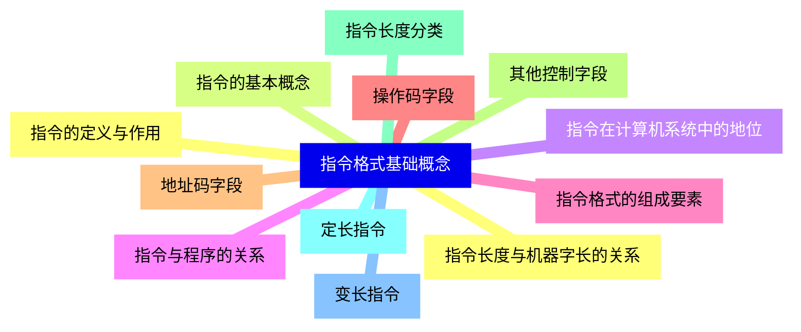
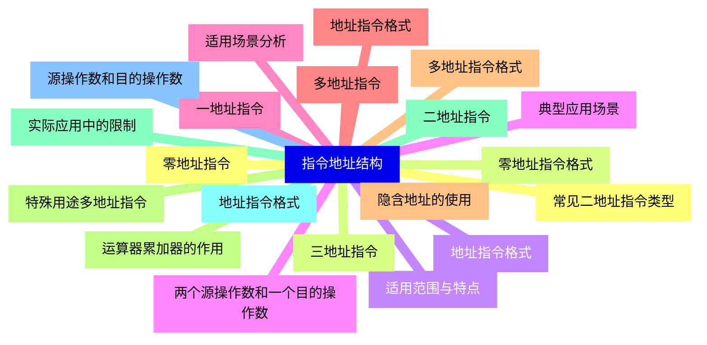
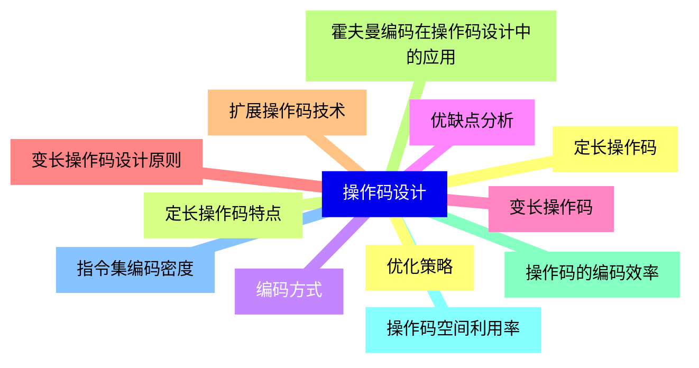
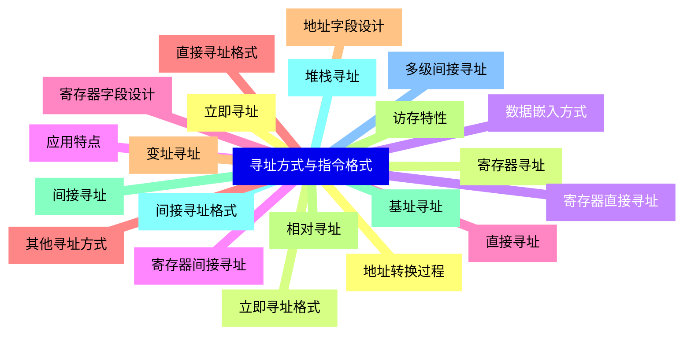
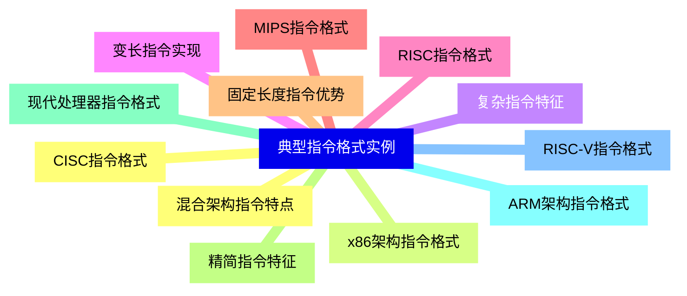
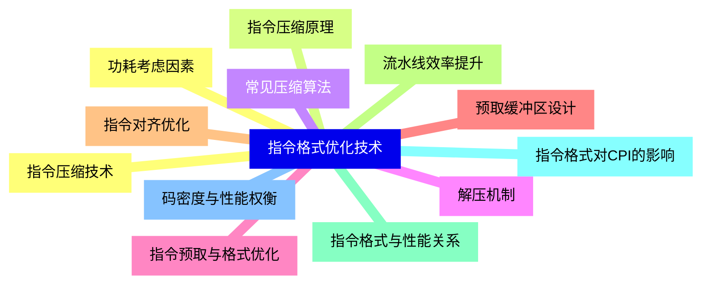
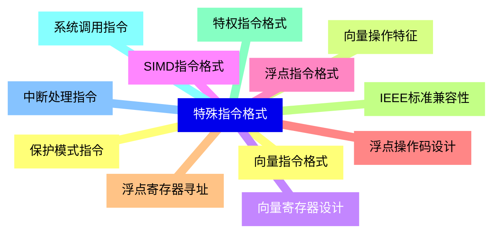
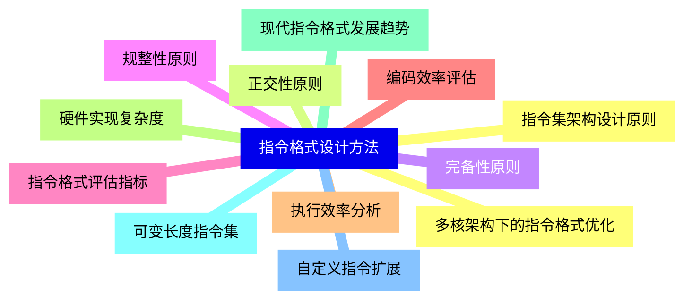


### 1 [指令格式基础概念](#1)
#### 1.1 [指令的定义与作用](#1)
#### 1.2 [指令的基本概念](#1)
#### 1.3 [指令在计算机系统中的地位](#1)
#### 1.4 [指令与程序的关系](#1)
#### 1.5 [指令格式的组成要素](#1)
#### 1.6 [操作码字段](#1)
#### 1.7 [地址码字段](#1)
#### 1.8 [其他控制字段](#1)
#### 1.9 [指令长度分类](#1)
#### 1.10 [定长指令](#1)
#### 1.11 [变长指令](#1)
#### 1.12 [指令长度与机器字长的关系](#1)
### 2 [指令地址结构](#2)
#### 2.1 [零地址指令](#2)
#### 2.2 [零地址指令格式](#2)
#### 2.3 [适用范围与特点](#2)
#### 2.4 [典型应用场景](#2)
#### 2.5 [一地址指令](#2)
#### 2.6 [地址指令格式](#2)
#### 2.7 [隐含地址的使用](#2)
#### 2.8 [运算器累加器的作用](#2)
#### 2.9 [二地址指令](#2)
#### 2.10 [地址指令格式](#2)
#### 2.11 [源操作数和目的操作数](#2)
#### 2.12 [常见二地址指令类型](#2)
#### 2.13 [三地址指令](#2)
#### 2.14 [地址指令格式](#2)
#### 2.15 [两个源操作数和一个目的操作数](#2)
#### 2.16 [适用场景分析](#2)
#### 2.17 [多地址指令](#2)
#### 2.18 [多地址指令格式](#2)
#### 2.19 [特殊用途多地址指令](#2)
#### 2.20 [实际应用中的限制](#2)
### 3 [操作码设计](#3)
#### 3.1 [定长操作码](#3)
#### 3.2 [定长操作码特点](#3)
#### 3.3 [编码方式](#3)
#### 3.4 [优缺点分析](#3)
#### 3.5 [变长操作码](#3)
#### 3.6 [变长操作码设计原则](#3)
#### 3.7 [扩展操作码技术](#3)
#### 3.8 [霍夫曼编码在操作码设计中的应用](#3)
#### 3.9 [操作码的编码效率](#3)
#### 3.10 [操作码空间利用率](#3)
#### 3.11 [指令集编码密度](#3)
#### 3.12 [优化策略](#3)
### 4 [寻址方式与指令格式](#4)
#### 4.1 [立即寻址](#4)
#### 4.2 [立即寻址格式](#4)
#### 4.3 [数据嵌入方式](#4)
#### 4.4 [应用特点](#4)
#### 4.5 [直接寻址](#4)
#### 4.6 [直接寻址格式](#4)
#### 4.7 [地址字段设计](#4)
#### 4.8 [访存特性](#4)
#### 4.9 [间接寻址](#4)
#### 4.10 [间接寻址格式](#4)
#### 4.11 [多级间接寻址](#4)
#### 4.12 [地址转换过程](#4)
#### 4.13 [寄存器寻址](#4)
#### 4.14 [寄存器直接寻址](#4)
#### 4.15 [寄存器间接寻址](#4)
#### 4.16 [寄存器字段设计](#4)
#### 4.17 [其他寻址方式](#4)
#### 4.18 [变址寻址](#4)
#### 4.19 [相对寻址](#4)
#### 4.20 [基址寻址](#4)
#### 4.21 [堆栈寻址](#4)
### 5 [典型指令格式实例](#5)
#### 5.1 [CISC指令格式](#5)
#### 5.2 [x86架构指令格式](#5)
#### 5.3 [复杂指令特征](#5)
#### 5.4 [变长指令实现](#5)
#### 5.5 [RISC指令格式](#5)
#### 5.6 [MIPS指令格式](#5)
#### 5.7 [固定长度指令优势](#5)
#### 5.8 [精简指令特征](#5)
#### 5.9 [现代处理器指令格式](#5)
#### 5.10 [ARM架构指令格式](#5)
#### 5.11 [RISC-V指令格式](#5)
#### 5.12 [混合架构指令特点](#5)
### 6 [指令格式优化技术](#6)
#### 6.1 [指令压缩技术](#6)
#### 6.2 [指令压缩原理](#6)
#### 6.3 [常见压缩算法](#6)
#### 6.4 [解压机制](#6)
#### 6.5 [指令预取与格式优化](#6)
#### 6.6 [预取缓冲区设计](#6)
#### 6.7 [指令对齐优化](#6)
#### 6.8 [流水线效率提升](#6)
#### 6.9 [指令格式与性能关系](#6)
#### 6.10 [指令格式对CPI的影响](#6)
#### 6.11 [码密度与性能权衡](#6)
#### 6.12 [功耗考虑因素](#6)
### 7 [特殊指令格式](#7)
#### 7.1 [向量指令格式](#7)
#### 7.2 [向量操作特征](#7)
#### 7.3 [向量寄存器设计](#7)
#### 7.4 [SIMD指令格式](#7)
#### 7.5 [浮点指令格式](#7)
#### 7.6 [浮点操作码设计](#7)
#### 7.7 [浮点寄存器寻址](#7)
#### 7.8 [IEEE标准兼容性](#7)
#### 7.9 [特权指令格式](#7)
#### 7.10 [系统调用指令](#7)
#### 7.11 [中断处理指令](#7)
#### 7.12 [保护模式指令](#7)
### 8 [指令格式设计方法](#8)
#### 8.1 [指令集架构设计原则](#8)
#### 8.2 [正交性原则](#8)
#### 8.3 [完备性原则](#8)
#### 8.4 [规整性原则](#8)
#### 8.5 [指令格式评估指标](#8)
#### 8.6 [编码效率评估](#8)
#### 8.7 [执行效率分析](#8)
#### 8.8 [硬件实现复杂度](#8)
#### 8.9 [现代指令格式发展趋势](#8)
#### 8.10 [可变长度指令集](#8)
#### 8.11 [自定义指令扩展](#8)
#### 8.12 [多核架构下的指令格式优化](#8)




### 1 指令格式基础概念

---
### 1 指令格式基础概念
___
#### 1.1 指令的定义与作用
___
#### 1.2 指令的基本概念
___
#### 1.3 指令在计算机系统中的地位
___
#### 1.4 指令与程序的关系
___
#### 1.5 指令格式的组成要素
___
#### 1.6 操作码字段
___
#### 1.7 地址码字段
___
#### 1.8 其他控制字段
___
#### 1.9 指令长度分类
___
#### 1.10 定长指令
___
#### 1.11 变长指令
___
#### 1.12 指令长度与机器字长的关系
### 2 指令地址结构

---
### 2 指令地址结构
___
#### 2.1 零地址指令
___
#### 2.2 零地址指令格式
___
#### 2.3 适用范围与特点
___
#### 2.4 典型应用场景
___
#### 2.5 一地址指令
___
#### 2.6 地址指令格式
___
#### 2.7 隐含地址的使用
___
#### 2.8 运算器累加器的作用
___
#### 2.9 二地址指令
___
#### 2.10 地址指令格式
___
#### 2.11 源操作数和目的操作数
___
#### 2.12 常见二地址指令类型
___
#### 2.13 三地址指令
___
#### 2.14 地址指令格式
___
#### 2.15 两个源操作数和一个目的操作数
___
#### 2.16 适用场景分析
___
#### 2.17 多地址指令
___
#### 2.18 多地址指令格式
___
#### 2.19 特殊用途多地址指令
___
#### 2.20 实际应用中的限制
### 3 操作码设计

---
### 3 操作码设计
___
#### 3.1 定长操作码
___
#### 3.2 定长操作码特点
___
#### 3.3 编码方式
___
#### 3.4 优缺点分析
___
#### 3.5 变长操作码
___
#### 3.6 变长操作码设计原则
___
#### 3.7 扩展操作码技术
___
#### 3.8 霍夫曼编码在操作码设计中的应用
___
#### 3.9 操作码的编码效率
___
#### 3.10 操作码空间利用率
___
#### 3.11 指令集编码密度
___
#### 3.12 优化策略
### 4 寻址方式与指令格式

---
### 4 寻址方式与指令格式
___
#### 4.1 立即寻址
___
#### 4.2 立即寻址格式
___
#### 4.3 数据嵌入方式
___
#### 4.4 应用特点
___
#### 4.5 直接寻址
___
#### 4.6 直接寻址格式
___
#### 4.7 地址字段设计
___
#### 4.8 访存特性
___
#### 4.9 间接寻址
___
#### 4.10 间接寻址格式
___
#### 4.11 多级间接寻址
___
#### 4.12 地址转换过程
___
#### 4.13 寄存器寻址
___
#### 4.14 寄存器直接寻址
___
#### 4.15 寄存器间接寻址
___
#### 4.16 寄存器字段设计
___
#### 4.17 其他寻址方式
___
#### 4.18 变址寻址
___
#### 4.19 相对寻址
___
#### 4.20 基址寻址
___
#### 4.21 堆栈寻址
### 5 典型指令格式实例

---
### 5 典型指令格式实例
___
#### 5.1 CISC指令格式
___
#### 5.2 x86架构指令格式
___
#### 5.3 复杂指令特征
___
#### 5.4 变长指令实现
___
#### 5.5 RISC指令格式
___
#### 5.6 MIPS指令格式
___
#### 5.7 固定长度指令优势
___
#### 5.8 精简指令特征
___
#### 5.9 现代处理器指令格式
___
#### 5.10 ARM架构指令格式
___
#### 5.11 RISC-V指令格式
___
#### 5.12 混合架构指令特点
### 6 指令格式优化技术

---
### 6 指令格式优化技术
___
#### 6.1 指令压缩技术
___
#### 6.2 指令压缩原理
___
#### 6.3 常见压缩算法
___
#### 6.4 解压机制
___
#### 6.5 指令预取与格式优化
___
#### 6.6 预取缓冲区设计
___
#### 6.7 指令对齐优化
___
#### 6.8 流水线效率提升
___
#### 6.9 指令格式与性能关系
___
#### 6.10 指令格式对CPI的影响
___
#### 6.11 码密度与性能权衡
___
#### 6.12 功耗考虑因素
### 7 特殊指令格式

---
### 7 特殊指令格式
___
#### 7.1 向量指令格式
___
#### 7.2 向量操作特征
___
#### 7.3 向量寄存器设计
___
#### 7.4 SIMD指令格式
___
#### 7.5 浮点指令格式
___
#### 7.6 浮点操作码设计
___
#### 7.7 浮点寄存器寻址
___
#### 7.8 IEEE标准兼容性
___
#### 7.9 特权指令格式
___
#### 7.10 系统调用指令
___
#### 7.11 中断处理指令
___
#### 7.12 保护模式指令
### 8 指令格式设计方法

---
### 8 指令格式设计方法
___
#### 8.1 指令集架构设计原则
___
#### 8.2 正交性原则
___
#### 8.3 完备性原则
___
#### 8.4 规整性原则
___
#### 8.5 指令格式评估指标
___
#### 8.6 编码效率评估
___
#### 8.7 执行效率分析
___
#### 8.8 硬件实现复杂度
___
#### 8.9 现代指令格式发展趋势
___
#### 8.10 可变长度指令集
___
#### 8.11 自定义指令扩展
___
#### 8.12 多核架构下的指令格式优化


### 1 指令格式基础概念{#1}

{}

<--->
{}
{}
{}
{}
{}
{}
{}
{}
{}
{}
{}
{}
{}
{}
{}
{}
{}
{}
{}
{}
{}
{}
{}
{}
{}

### 2 指令地址结构{#2}

{}
{}
{}
{}
{}
{}
{}
{}
{}
{}
{}
{}
{}
{}
{}
{}
{}
{}
{}
{}
{}
{}
{}
{}
{}
{}
{}
{}
{}
{}
{}
{}
{}
{}
{}
{}
{}
{}
{}
{}
{}
<--->

{}

### 3 操作码设计{#3}

{}

<--->
{}
{}
{}
{}
{}
{}
{}
{}
{}
{}
{}
{}
{}
{}
{}
{}
{}
{}
{}
{}
{}
{}
{}
{}
{}

### 4 寻址方式与指令格式{#4}

{}
{}
{}
{}
{}
{}
{}
{}
{}
{}
{}
{}
{}
{}
{}
{}
{}
{}
{}
{}
{}
{}
{}
{}
{}
{}
{}
{}
{}
{}
{}
{}
{}
{}
{}
{}
{}
{}
{}
{}
{}
{}
{}
<--->

{}

### 5 典型指令格式实例{#5}

{}

<--->
{}
{}
{}
{}
{}
{}
{}
{}
{}
{}
{}
{}
{}
{}
{}
{}
{}
{}
{}
{}
{}
{}
{}
{}
{}

### 6 指令格式优化技术{#6}

{}
{}
{}
{}
{}
{}
{}
{}
{}
{}
{}
{}
{}
{}
{}
{}
{}
{}
{}
{}
{}
{}
{}
{}
{}
<--->

{}

### 7 特殊指令格式{#7}

{}

<--->
{}
{}
{}
{}
{}
{}
{}
{}
{}
{}
{}
{}
{}
{}
{}
{}
{}
{}
{}
{}
{}
{}
{}
{}
{}

### 8 指令格式设计方法{#8}

{}
{}
{}
{}
{}
{}
{}
{}
{}
{}
{}
{}
{}
{}
{}
{}
{}
{}
{}
{}
{}
{}
{}
{}
{}
<--->

{}
