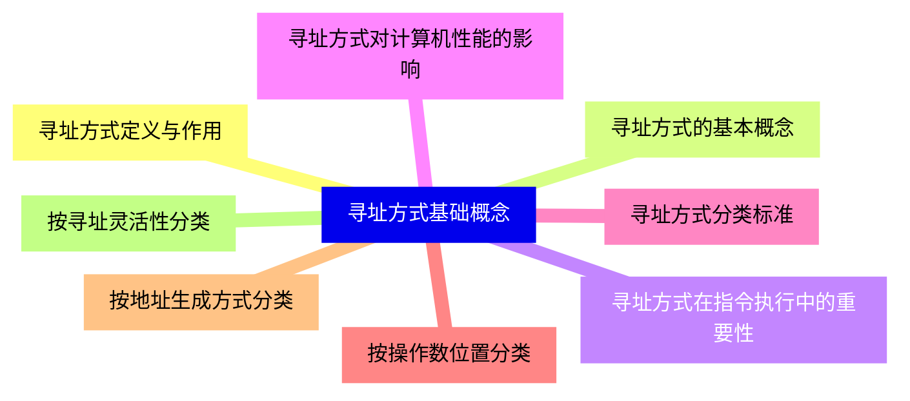
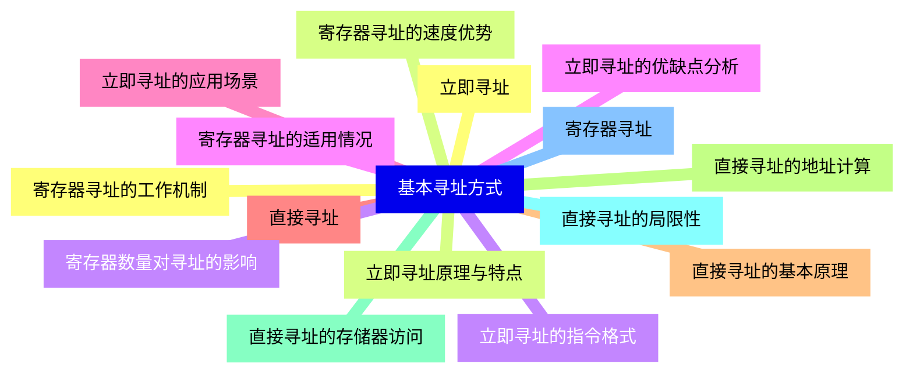
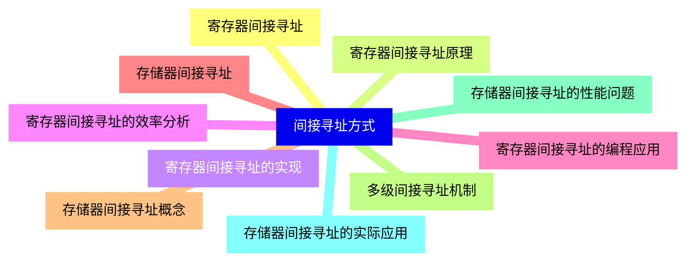
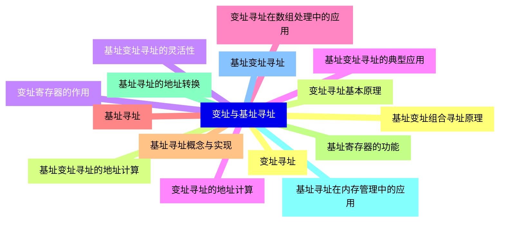
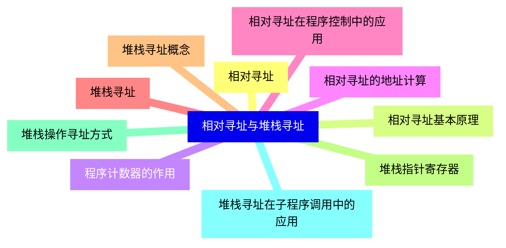
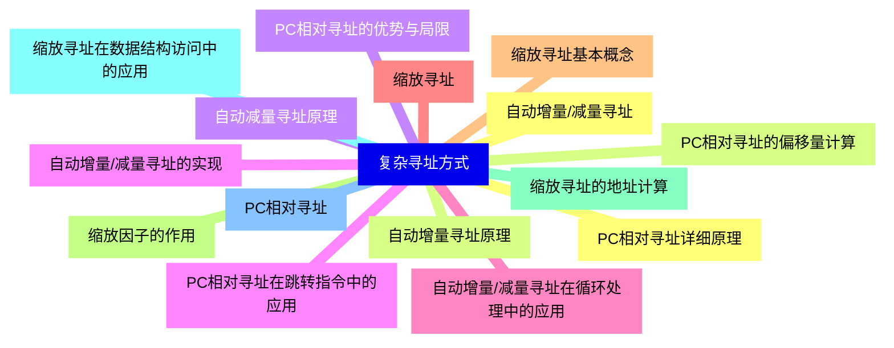
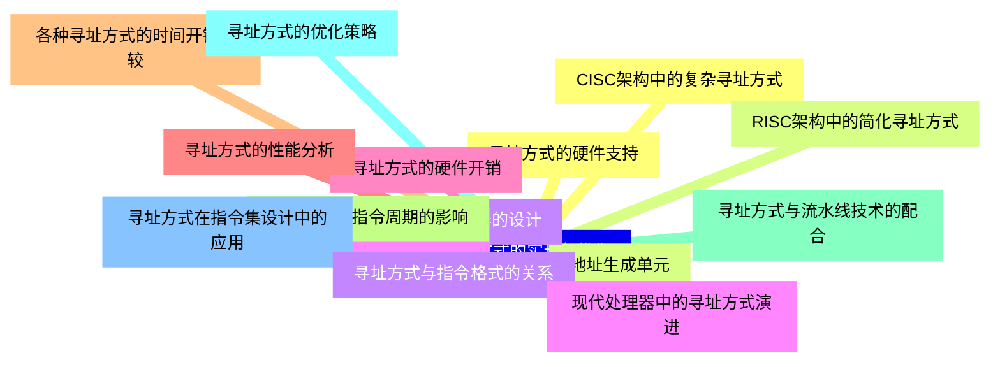
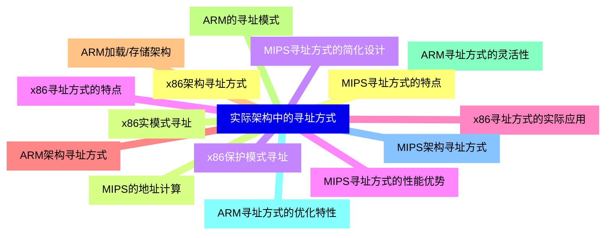
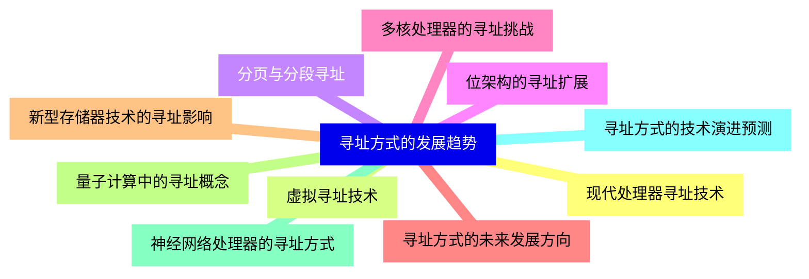


### 1 [寻址方式基础概念](#1)
#### 1.1 [寻址方式定义与作用](#1)
#### 1.2 [寻址方式的基本概念](#1)
#### 1.3 [寻址方式在指令执行中的重要性](#1)
#### 1.4 [寻址方式对计算机性能的影响](#1)
#### 1.5 [寻址方式分类标准](#1)
#### 1.6 [按操作数位置分类](#1)
#### 1.7 [按地址生成方式分类](#1)
#### 1.8 [按寻址灵活性分类](#1)
### 2 [基本寻址方式](#2)
#### 2.1 [立即寻址](#2)
#### 2.2 [立即寻址原理与特点](#2)
#### 2.3 [立即寻址的指令格式](#2)
#### 2.4 [立即寻址的优缺点分析](#2)
#### 2.5 [立即寻址的应用场景](#2)
#### 2.6 [直接寻址](#2)
#### 2.7 [直接寻址的基本原理](#2)
#### 2.8 [直接寻址的地址计算](#2)
#### 2.9 [直接寻址的存储器访问](#2)
#### 2.10 [直接寻址的局限性](#2)
#### 2.11 [寄存器寻址](#2)
#### 2.12 [寄存器寻址的工作机制](#2)
#### 2.13 [寄存器寻址的速度优势](#2)
#### 2.14 [寄存器数量对寻址的影响](#2)
#### 2.15 [寄存器寻址的适用情况](#2)
### 3 [间接寻址方式](#3)
#### 3.1 [寄存器间接寻址](#3)
#### 3.2 [寄存器间接寻址原理](#3)
#### 3.3 [寄存器间接寻址的实现](#3)
#### 3.4 [寄存器间接寻址的效率分析](#3)
#### 3.5 [寄存器间接寻址的编程应用](#3)
#### 3.6 [存储器间接寻址](#3)
#### 3.7 [存储器间接寻址概念](#3)
#### 3.8 [多级间接寻址机制](#3)
#### 3.9 [存储器间接寻址的性能问题](#3)
#### 3.10 [存储器间接寻址的实际应用](#3)
### 4 [变址与基址寻址](#4)
#### 4.1 [变址寻址](#4)
#### 4.2 [变址寻址基本原理](#4)
#### 4.3 [变址寄存器的作用](#4)
#### 4.4 [变址寻址的地址计算](#4)
#### 4.5 [变址寻址在数组处理中的应用](#4)
#### 4.6 [基址寻址](#4)
#### 4.7 [基址寻址概念与实现](#4)
#### 4.8 [基址寄存器的功能](#4)
#### 4.9 [基址寻址的地址转换](#4)
#### 4.10 [基址寻址在内存管理中的应用](#4)
#### 4.11 [基址变址寻址](#4)
#### 4.12 [基址变址组合寻址原理](#4)
#### 4.13 [基址变址寻址的地址计算](#4)
#### 4.14 [基址变址寻址的灵活性](#4)
#### 4.15 [基址变址寻址的典型应用](#4)
### 5 [相对寻址与堆栈寻址](#5)
#### 5.1 [相对寻址](#5)
#### 5.2 [相对寻址基本原理](#5)
#### 5.3 [程序计数器的作用](#5)
#### 5.4 [相对寻址的地址计算](#5)
#### 5.5 [相对寻址在程序控制中的应用](#5)
#### 5.6 [堆栈寻址](#5)
#### 5.7 [堆栈寻址概念](#5)
#### 5.8 [堆栈指针寄存器](#5)
#### 5.9 [堆栈操作寻址方式](#5)
#### 5.10 [堆栈寻址在子程序调用中的应用](#5)
### 6 [复杂寻址方式](#6)
#### 6.1 [自动增量/减量寻址](#6)
#### 6.2 [自动增量寻址原理](#6)
#### 6.3 [自动减量寻址原理](#6)
#### 6.4 [自动增量/减量寻址的实现](#6)
#### 6.5 [自动增量/减量寻址在循环处理中的应用](#6)
#### 6.6 [缩放寻址](#6)
#### 6.7 [缩放寻址基本概念](#6)
#### 6.8 [缩放因子的作用](#6)
#### 6.9 [缩放寻址的地址计算](#6)
#### 6.10 [缩放寻址在数据结构访问中的应用](#6)
#### 6.11 [PC相对寻址](#6)
#### 6.12 [PC相对寻址详细原理](#6)
#### 6.13 [PC相对寻址的偏移量计算](#6)
#### 6.14 [PC相对寻址的优势与局限](#6)
#### 6.15 [PC相对寻址在跳转指令中的应用](#6)
### 7 [寻址方式的实现与优化](#7)
#### 7.1 [寻址方式的硬件支持](#7)
#### 7.2 [地址生成单元](#7)
#### 7.3 [专用寄存器的设计](#7)
#### 7.4 [地址计算电路](#7)
#### 7.5 [寻址方式的硬件开销](#7)
#### 7.6 [寻址方式的性能分析](#7)
#### 7.7 [各种寻址方式的时间开销比较](#7)
#### 7.8 [寻址方式对指令周期的影响](#7)
#### 7.9 [寻址方式与流水线技术的配合](#7)
#### 7.10 [寻址方式的优化策略](#7)
#### 7.11 [寻址方式在指令集设计中的应用](#7)
#### 7.12 [CISC架构中的复杂寻址方式](#7)
#### 7.13 [RISC架构中的简化寻址方式](#7)
#### 7.14 [寻址方式与指令格式的关系](#7)
#### 7.15 [现代处理器中的寻址方式演进](#7)
### 8 [实际架构中的寻址方式](#8)
#### 8.1 [x86架构寻址方式](#8)
#### 8.2 [x86实模式寻址](#8)
#### 8.3 [x86保护模式寻址](#8)
#### 8.4 [x86寻址方式的特点](#8)
#### 8.5 [x86寻址方式的实际应用](#8)
#### 8.6 [ARM架构寻址方式](#8)
#### 8.7 [ARM加载/存储架构](#8)
#### 8.8 [ARM的寻址模式](#8)
#### 8.9 [ARM寻址方式的灵活性](#8)
#### 8.10 [ARM寻址方式的优化特性](#8)
#### 8.11 [MIPS架构寻址方式](#8)
#### 8.12 [MIPS寻址方式的特点](#8)
#### 8.13 [MIPS的地址计算](#8)
#### 8.14 [MIPS寻址方式的简化设计](#8)
#### 8.15 [MIPS寻址方式的性能优势](#8)
### 9 [寻址方式的发展趋势](#9)
#### 9.1 [现代处理器寻址技术](#9)
#### 9.2 [虚拟寻址技术](#9)
#### 9.3 [分页与分段寻址](#9)
#### 9.4 [位架构的寻址扩展](#9)
#### 9.5 [多核处理器的寻址挑战](#9)
#### 9.6 [寻址方式的未来发展方向](#9)
#### 9.7 [新型存储器技术的寻址影响](#9)
#### 9.8 [量子计算中的寻址概念](#9)
#### 9.9 [神经网络处理器的寻址方式](#9)
#### 9.10 [寻址方式的技术演进预测](#9)




### 1 寻址方式基础概念

---
### 1 寻址方式基础概念
___
#### 1.1 寻址方式定义与作用
___
#### 1.2 寻址方式的基本概念
___
#### 1.3 寻址方式在指令执行中的重要性
___
#### 1.4 寻址方式对计算机性能的影响
___
#### 1.5 寻址方式分类标准
___
#### 1.6 按操作数位置分类
___
#### 1.7 按地址生成方式分类
___
#### 1.8 按寻址灵活性分类
### 2 基本寻址方式

---
### 2 基本寻址方式
___
#### 2.1 立即寻址
___
#### 2.2 立即寻址原理与特点
___
#### 2.3 立即寻址的指令格式
___
#### 2.4 立即寻址的优缺点分析
___
#### 2.5 立即寻址的应用场景
___
#### 2.6 直接寻址
___
#### 2.7 直接寻址的基本原理
___
#### 2.8 直接寻址的地址计算
___
#### 2.9 直接寻址的存储器访问
___
#### 2.10 直接寻址的局限性
___
#### 2.11 寄存器寻址
___
#### 2.12 寄存器寻址的工作机制
___
#### 2.13 寄存器寻址的速度优势
___
#### 2.14 寄存器数量对寻址的影响
___
#### 2.15 寄存器寻址的适用情况
### 3 间接寻址方式

---
### 3 间接寻址方式
___
#### 3.1 寄存器间接寻址
___
#### 3.2 寄存器间接寻址原理
___
#### 3.3 寄存器间接寻址的实现
___
#### 3.4 寄存器间接寻址的效率分析
___
#### 3.5 寄存器间接寻址的编程应用
___
#### 3.6 存储器间接寻址
___
#### 3.7 存储器间接寻址概念
___
#### 3.8 多级间接寻址机制
___
#### 3.9 存储器间接寻址的性能问题
___
#### 3.10 存储器间接寻址的实际应用
### 4 变址与基址寻址

---
### 4 变址与基址寻址
___
#### 4.1 变址寻址
___
#### 4.2 变址寻址基本原理
___
#### 4.3 变址寄存器的作用
___
#### 4.4 变址寻址的地址计算
___
#### 4.5 变址寻址在数组处理中的应用
___
#### 4.6 基址寻址
___
#### 4.7 基址寻址概念与实现
___
#### 4.8 基址寄存器的功能
___
#### 4.9 基址寻址的地址转换
___
#### 4.10 基址寻址在内存管理中的应用
___
#### 4.11 基址变址寻址
___
#### 4.12 基址变址组合寻址原理
___
#### 4.13 基址变址寻址的地址计算
___
#### 4.14 基址变址寻址的灵活性
___
#### 4.15 基址变址寻址的典型应用
### 5 相对寻址与堆栈寻址

---
### 5 相对寻址与堆栈寻址
___
#### 5.1 相对寻址
___
#### 5.2 相对寻址基本原理
___
#### 5.3 程序计数器的作用
___
#### 5.4 相对寻址的地址计算
___
#### 5.5 相对寻址在程序控制中的应用
___
#### 5.6 堆栈寻址
___
#### 5.7 堆栈寻址概念
___
#### 5.8 堆栈指针寄存器
___
#### 5.9 堆栈操作寻址方式
___
#### 5.10 堆栈寻址在子程序调用中的应用
### 6 复杂寻址方式

---
### 6 复杂寻址方式
___
#### 6.1 自动增量/减量寻址
___
#### 6.2 自动增量寻址原理
___
#### 6.3 自动减量寻址原理
___
#### 6.4 自动增量/减量寻址的实现
___
#### 6.5 自动增量/减量寻址在循环处理中的应用
___
#### 6.6 缩放寻址
___
#### 6.7 缩放寻址基本概念
___
#### 6.8 缩放因子的作用
___
#### 6.9 缩放寻址的地址计算
___
#### 6.10 缩放寻址在数据结构访问中的应用
___
#### 6.11 PC相对寻址
___
#### 6.12 PC相对寻址详细原理
___
#### 6.13 PC相对寻址的偏移量计算
___
#### 6.14 PC相对寻址的优势与局限
___
#### 6.15 PC相对寻址在跳转指令中的应用
### 7 寻址方式的实现与优化

---
### 7 寻址方式的实现与优化
___
#### 7.1 寻址方式的硬件支持
___
#### 7.2 地址生成单元
___
#### 7.3 专用寄存器的设计
___
#### 7.4 地址计算电路
___
#### 7.5 寻址方式的硬件开销
___
#### 7.6 寻址方式的性能分析
___
#### 7.7 各种寻址方式的时间开销比较
___
#### 7.8 寻址方式对指令周期的影响
___
#### 7.9 寻址方式与流水线技术的配合
___
#### 7.10 寻址方式的优化策略
___
#### 7.11 寻址方式在指令集设计中的应用
___
#### 7.12 CISC架构中的复杂寻址方式
___
#### 7.13 RISC架构中的简化寻址方式
___
#### 7.14 寻址方式与指令格式的关系
___
#### 7.15 现代处理器中的寻址方式演进
### 8 实际架构中的寻址方式

---
### 8 实际架构中的寻址方式
___
#### 8.1 x86架构寻址方式
___
#### 8.2 x86实模式寻址
___
#### 8.3 x86保护模式寻址
___
#### 8.4 x86寻址方式的特点
___
#### 8.5 x86寻址方式的实际应用
___
#### 8.6 ARM架构寻址方式
___
#### 8.7 ARM加载/存储架构
___
#### 8.8 ARM的寻址模式
___
#### 8.9 ARM寻址方式的灵活性
___
#### 8.10 ARM寻址方式的优化特性
___
#### 8.11 MIPS架构寻址方式
___
#### 8.12 MIPS寻址方式的特点
___
#### 8.13 MIPS的地址计算
___
#### 8.14 MIPS寻址方式的简化设计
___
#### 8.15 MIPS寻址方式的性能优势
### 9 寻址方式的发展趋势

---
### 9 寻址方式的发展趋势
___
#### 9.1 现代处理器寻址技术
___
#### 9.2 虚拟寻址技术
___
#### 9.3 分页与分段寻址
___
#### 9.4 位架构的寻址扩展
___
#### 9.5 多核处理器的寻址挑战
___
#### 9.6 寻址方式的未来发展方向
___
#### 9.7 新型存储器技术的寻址影响
___
#### 9.8 量子计算中的寻址概念
___
#### 9.9 神经网络处理器的寻址方式
___
#### 9.10 寻址方式的技术演进预测


### 1 寻址方式基础概念{#1}

{}

<--->
{}
{}
{}
{}
{}
{}
{}
{}
{}
{}
{}
{}
{}
{}
{}
{}
{}

### 2 基本寻址方式{#2}

{}
{}
{}
{}
{}
{}
{}
{}
{}
{}
{}
{}
{}
{}
{}
{}
{}
{}
{}
{}
{}
{}
{}
{}
{}
{}
{}
{}
{}
{}
{}
<--->

{}

### 3 间接寻址方式{#3}

{}

<--->
{}
{}
{}
{}
{}
{}
{}
{}
{}
{}
{}
{}
{}
{}
{}
{}
{}
{}
{}
{}
{}

### 4 变址与基址寻址{#4}

{}
{}
{}
{}
{}
{}
{}
{}
{}
{}
{}
{}
{}
{}
{}
{}
{}
{}
{}
{}
{}
{}
{}
{}
{}
{}
{}
{}
{}
{}
{}
<--->

{}

### 5 相对寻址与堆栈寻址{#5}

{}

<--->
{}
{}
{}
{}
{}
{}
{}
{}
{}
{}
{}
{}
{}
{}
{}
{}
{}
{}
{}
{}
{}

### 6 复杂寻址方式{#6}

{}
{}
{}
{}
{}
{}
{}
{}
{}
{}
{}
{}
{}
{}
{}
{}
{}
{}
{}
{}
{}
{}
{}
{}
{}
{}
{}
{}
{}
{}
{}
<--->

{}

### 7 寻址方式的实现与优化{#7}

{}

<--->
{}
{}
{}
{}
{}
{}
{}
{}
{}
{}
{}
{}
{}
{}
{}
{}
{}
{}
{}
{}
{}
{}
{}
{}
{}
{}
{}
{}
{}
{}
{}

### 8 实际架构中的寻址方式{#8}

{}
{}
{}
{}
{}
{}
{}
{}
{}
{}
{}
{}
{}
{}
{}
{}
{}
{}
{}
{}
{}
{}
{}
{}
{}
{}
{}
{}
{}
{}
{}
<--->

{}

### 9 寻址方式的发展趋势{#9}

{}

<--->
{}
{}
{}
{}
{}
{}
{}
{}
{}
{}
{}
{}
{}
{}
{}
{}
{}
{}
{}
{}
{}
