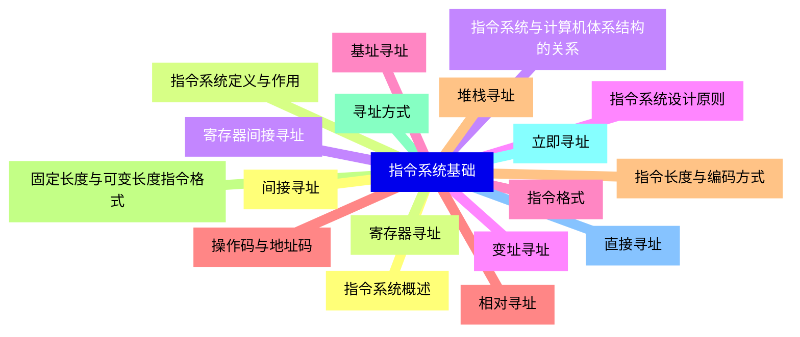
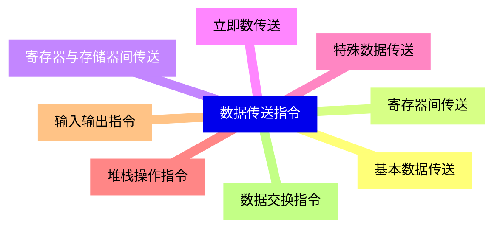
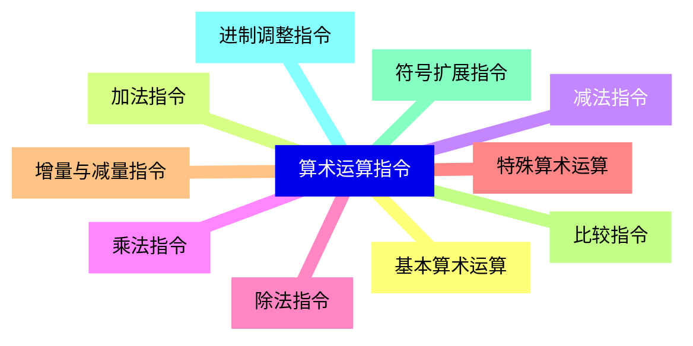
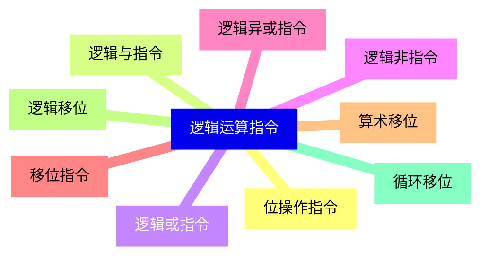
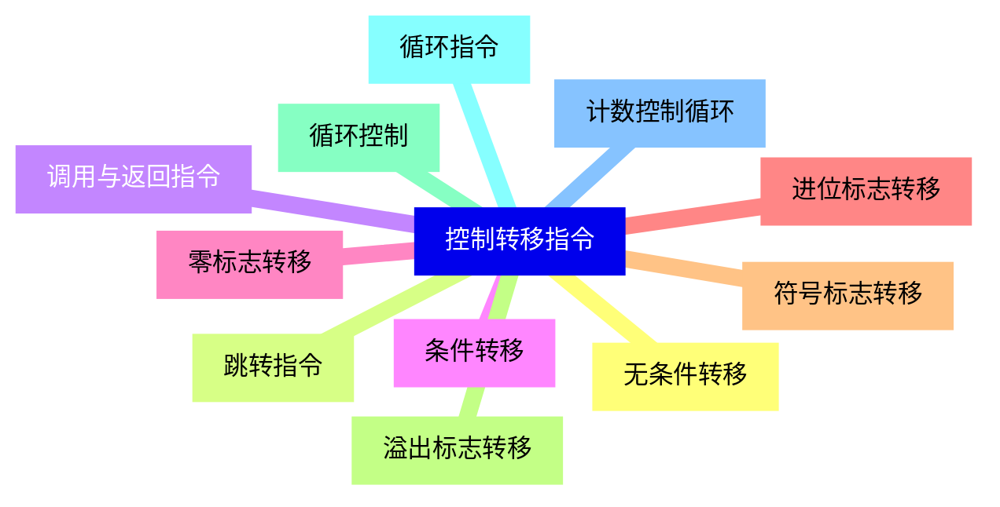
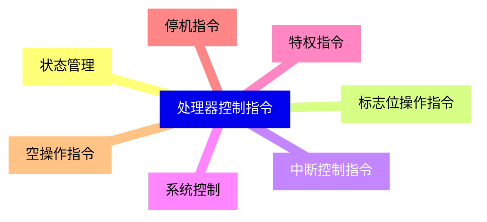
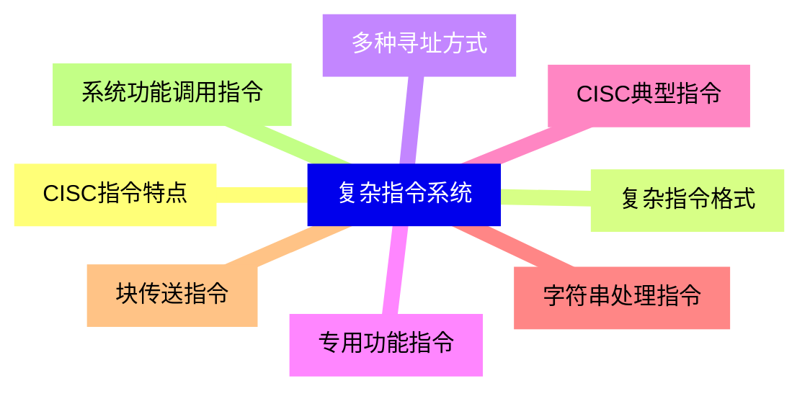
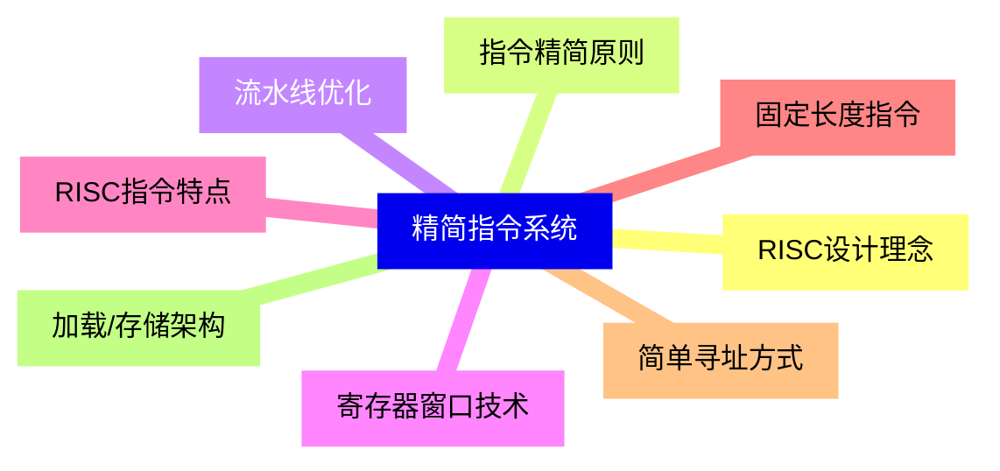
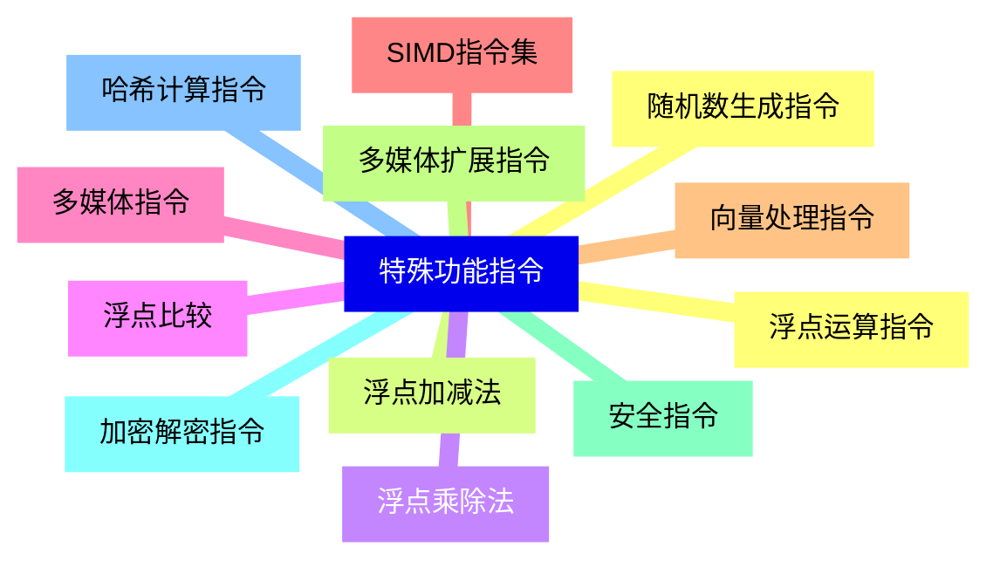
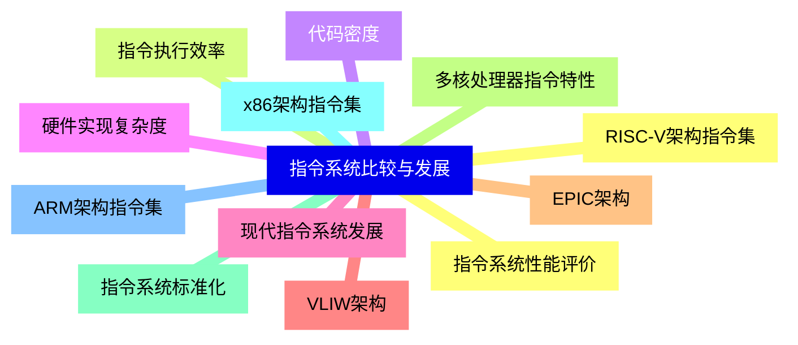


### 1 [指令系统基础](#1)
#### 1.1 [指令系统概述](#1)
#### 1.2 [指令系统定义与作用](#1)
#### 1.3 [指令系统与计算机体系结构的关系](#1)
#### 1.4 [指令系统设计原则](#1)
#### 1.5 [指令格式](#1)
#### 1.6 [操作码与地址码](#1)
#### 1.7 [指令长度与编码方式](#1)
#### 1.8 [固定长度与可变长度指令格式](#1)
#### 1.9 [寻址方式](#1)
#### 1.10 [立即寻址](#1)
#### 1.11 [直接寻址](#1)
#### 1.12 [间接寻址](#1)
#### 1.13 [寄存器寻址](#1)
#### 1.14 [寄存器间接寻址](#1)
#### 1.15 [变址寻址](#1)
#### 1.16 [基址寻址](#1)
#### 1.17 [相对寻址](#1)
#### 1.18 [堆栈寻址](#1)
### 2 [数据传送指令](#2)
#### 2.1 [基本数据传送](#2)
#### 2.2 [寄存器间传送](#2)
#### 2.3 [寄存器与存储器间传送](#2)
#### 2.4 [立即数传送](#2)
#### 2.5 [特殊数据传送](#2)
#### 2.6 [堆栈操作指令](#2)
#### 2.7 [输入输出指令](#2)
#### 2.8 [数据交换指令](#2)
### 3 [算术运算指令](#3)
#### 3.1 [基本算术运算](#3)
#### 3.2 [加法指令](#3)
#### 3.3 [减法指令](#3)
#### 3.4 [乘法指令](#3)
#### 3.5 [除法指令](#3)
#### 3.6 [特殊算术运算](#3)
#### 3.7 [增量与减量指令](#3)
#### 3.8 [比较指令](#3)
#### 3.9 [符号扩展指令](#3)
#### 3.10 [进制调整指令](#3)
### 4 [逻辑运算指令](#4)
#### 4.1 [位操作指令](#4)
#### 4.2 [逻辑与指令](#4)
#### 4.3 [逻辑或指令](#4)
#### 4.4 [逻辑非指令](#4)
#### 4.5 [逻辑异或指令](#4)
#### 4.6 [移位指令](#4)
#### 4.7 [算术移位](#4)
#### 4.8 [逻辑移位](#4)
#### 4.9 [循环移位](#4)
### 5 [控制转移指令](#5)
#### 5.1 [无条件转移](#5)
#### 5.2 [跳转指令](#5)
#### 5.3 [调用与返回指令](#5)
#### 5.4 [条件转移](#5)
#### 5.5 [零标志转移](#5)
#### 5.6 [进位标志转移](#5)
#### 5.7 [符号标志转移](#5)
#### 5.8 [溢出标志转移](#5)
#### 5.9 [循环控制](#5)
#### 5.10 [循环指令](#5)
#### 5.11 [计数控制循环](#5)
### 6 [处理器控制指令](#6)
#### 6.1 [状态管理](#6)
#### 6.2 [标志位操作指令](#6)
#### 6.3 [中断控制指令](#6)
#### 6.4 [系统控制](#6)
#### 6.5 [特权指令](#6)
#### 6.6 [停机指令](#6)
#### 6.7 [空操作指令](#6)
### 7 [复杂指令系统](#7)
#### 7.1 [CISC指令特点](#7)
#### 7.2 [复杂指令格式](#7)
#### 7.3 [多种寻址方式](#7)
#### 7.4 [专用功能指令](#7)
#### 7.5 [CISC典型指令](#7)
#### 7.6 [字符串处理指令](#7)
#### 7.7 [块传送指令](#7)
#### 7.8 [系统功能调用指令](#7)
### 8 [精简指令系统](#8)
#### 8.1 [RISC设计理念](#8)
#### 8.2 [指令精简原则](#8)
#### 8.3 [流水线优化](#8)
#### 8.4 [寄存器窗口技术](#8)
#### 8.5 [RISC指令特点](#8)
#### 8.6 [固定长度指令](#8)
#### 8.7 [简单寻址方式](#8)
#### 8.8 [加载/存储架构](#8)
### 9 [特殊功能指令](#9)
#### 9.1 [浮点运算指令](#9)
#### 9.2 [浮点加减法](#9)
#### 9.3 [浮点乘除法](#9)
#### 9.4 [浮点比较](#9)
#### 9.5 [多媒体指令](#9)
#### 9.6 [SIMD指令集](#9)
#### 9.7 [向量处理指令](#9)
#### 9.8 [多媒体扩展指令](#9)
#### 9.9 [安全指令](#9)
#### 9.10 [加密解密指令](#9)
#### 9.11 [哈希计算指令](#9)
#### 9.12 [随机数生成指令](#9)
### 10 [指令系统比较与发展](#10)
#### 10.1 [指令系统性能评价](#10)
#### 10.2 [指令执行效率](#10)
#### 10.3 [代码密度](#10)
#### 10.4 [硬件实现复杂度](#10)
#### 10.5 [现代指令系统发展](#10)
#### 10.6 [VLIW架构](#10)
#### 10.7 [EPIC架构](#10)
#### 10.8 [多核处理器指令特性](#10)
#### 10.9 [指令系统标准化](#10)
#### 10.10 [x86架构指令集](#10)
#### 10.11 [ARM架构指令集](#10)
#### 10.12 [RISC-V架构指令集](#10)




### 1 指令系统基础

---
### 1 指令系统基础
___
#### 1.1 指令系统概述
___
#### 1.2 指令系统定义与作用
___
#### 1.3 指令系统与计算机体系结构的关系
___
#### 1.4 指令系统设计原则
___
#### 1.5 指令格式
___
#### 1.6 操作码与地址码
___
#### 1.7 指令长度与编码方式
___
#### 1.8 固定长度与可变长度指令格式
___
#### 1.9 寻址方式
___
#### 1.10 立即寻址
___
#### 1.11 直接寻址
___
#### 1.12 间接寻址
___
#### 1.13 寄存器寻址
___
#### 1.14 寄存器间接寻址
___
#### 1.15 变址寻址
___
#### 1.16 基址寻址
___
#### 1.17 相对寻址
___
#### 1.18 堆栈寻址
### 2 数据传送指令

---
### 2 数据传送指令
___
#### 2.1 基本数据传送
___
#### 2.2 寄存器间传送
___
#### 2.3 寄存器与存储器间传送
___
#### 2.4 立即数传送
___
#### 2.5 特殊数据传送
___
#### 2.6 堆栈操作指令
___
#### 2.7 输入输出指令
___
#### 2.8 数据交换指令
### 3 算术运算指令

---
### 3 算术运算指令
___
#### 3.1 基本算术运算
___
#### 3.2 加法指令
___
#### 3.3 减法指令
___
#### 3.4 乘法指令
___
#### 3.5 除法指令
___
#### 3.6 特殊算术运算
___
#### 3.7 增量与减量指令
___
#### 3.8 比较指令
___
#### 3.9 符号扩展指令
___
#### 3.10 进制调整指令
### 4 逻辑运算指令

---
### 4 逻辑运算指令
___
#### 4.1 位操作指令
___
#### 4.2 逻辑与指令
___
#### 4.3 逻辑或指令
___
#### 4.4 逻辑非指令
___
#### 4.5 逻辑异或指令
___
#### 4.6 移位指令
___
#### 4.7 算术移位
___
#### 4.8 逻辑移位
___
#### 4.9 循环移位
### 5 控制转移指令

---
### 5 控制转移指令
___
#### 5.1 无条件转移
___
#### 5.2 跳转指令
___
#### 5.3 调用与返回指令
___
#### 5.4 条件转移
___
#### 5.5 零标志转移
___
#### 5.6 进位标志转移
___
#### 5.7 符号标志转移
___
#### 5.8 溢出标志转移
___
#### 5.9 循环控制
___
#### 5.10 循环指令
___
#### 5.11 计数控制循环
### 6 处理器控制指令

---
### 6 处理器控制指令
___
#### 6.1 状态管理
___
#### 6.2 标志位操作指令
___
#### 6.3 中断控制指令
___
#### 6.4 系统控制
___
#### 6.5 特权指令
___
#### 6.6 停机指令
___
#### 6.7 空操作指令
### 7 复杂指令系统

---
### 7 复杂指令系统
___
#### 7.1 CISC指令特点
___
#### 7.2 复杂指令格式
___
#### 7.3 多种寻址方式
___
#### 7.4 专用功能指令
___
#### 7.5 CISC典型指令
___
#### 7.6 字符串处理指令
___
#### 7.7 块传送指令
___
#### 7.8 系统功能调用指令
### 8 精简指令系统

---
### 8 精简指令系统
___
#### 8.1 RISC设计理念
___
#### 8.2 指令精简原则
___
#### 8.3 流水线优化
___
#### 8.4 寄存器窗口技术
___
#### 8.5 RISC指令特点
___
#### 8.6 固定长度指令
___
#### 8.7 简单寻址方式
___
#### 8.8 加载/存储架构
### 9 特殊功能指令

---
### 9 特殊功能指令
___
#### 9.1 浮点运算指令
___
#### 9.2 浮点加减法
___
#### 9.3 浮点乘除法
___
#### 9.4 浮点比较
___
#### 9.5 多媒体指令
___
#### 9.6 SIMD指令集
___
#### 9.7 向量处理指令
___
#### 9.8 多媒体扩展指令
___
#### 9.9 安全指令
___
#### 9.10 加密解密指令
___
#### 9.11 哈希计算指令
___
#### 9.12 随机数生成指令
### 10 指令系统比较与发展

---
### 10 指令系统比较与发展
___
#### 10.1 指令系统性能评价
___
#### 10.2 指令执行效率
___
#### 10.3 代码密度
___
#### 10.4 硬件实现复杂度
___
#### 10.5 现代指令系统发展
___
#### 10.6 VLIW架构
___
#### 10.7 EPIC架构
___
#### 10.8 多核处理器指令特性
___
#### 10.9 指令系统标准化
___
#### 10.10 x86架构指令集
___
#### 10.11 ARM架构指令集
___
#### 10.12 RISC-V架构指令集


### 1 指令系统基础{#1}

{}

<--->
{}
{}
{}
{}
{}
{}
{}
{}
{}
{}
{}
{}
{}
{}
{}
{}
{}
{}
{}
{}
{}
{}
{}
{}
{}
{}
{}
{}
{}
{}
{}
{}
{}
{}
{}
{}
{}

### 2 数据传送指令{#2}

{}
{}
{}
{}
{}
{}
{}
{}
{}
{}
{}
{}
{}
{}
{}
{}
{}
<--->

{}

### 3 算术运算指令{#3}

{}

<--->
{}
{}
{}
{}
{}
{}
{}
{}
{}
{}
{}
{}
{}
{}
{}
{}
{}
{}
{}
{}
{}

### 4 逻辑运算指令{#4}

{}
{}
{}
{}
{}
{}
{}
{}
{}
{}
{}
{}
{}
{}
{}
{}
{}
{}
{}
<--->

{}

### 5 控制转移指令{#5}

{}

<--->
{}
{}
{}
{}
{}
{}
{}
{}
{}
{}
{}
{}
{}
{}
{}
{}
{}
{}
{}
{}
{}
{}
{}

### 6 处理器控制指令{#6}

{}
{}
{}
{}
{}
{}
{}
{}
{}
{}
{}
{}
{}
{}
{}
<--->

{}

### 7 复杂指令系统{#7}

{}

<--->
{}
{}
{}
{}
{}
{}
{}
{}
{}
{}
{}
{}
{}
{}
{}
{}
{}

### 8 精简指令系统{#8}

{}
{}
{}
{}
{}
{}
{}
{}
{}
{}
{}
{}
{}
{}
{}
{}
{}
<--->

{}

### 9 特殊功能指令{#9}

{}

<--->
{}
{}
{}
{}
{}
{}
{}
{}
{}
{}
{}
{}
{}
{}
{}
{}
{}
{}
{}
{}
{}
{}
{}
{}
{}

### 10 指令系统比较与发展{#10}

{}
{}
{}
{}
{}
{}
{}
{}
{}
{}
{}
{}
{}
{}
{}
{}
{}
{}
{}
{}
{}
{}
{}
{}
{}
<--->

{}
