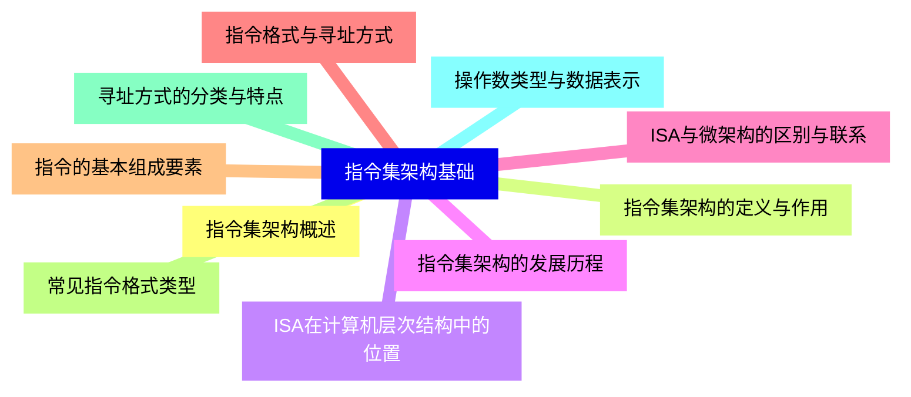
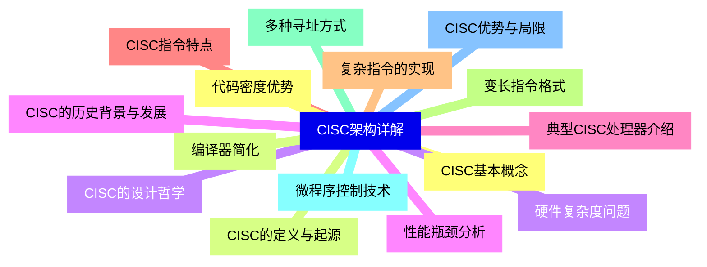
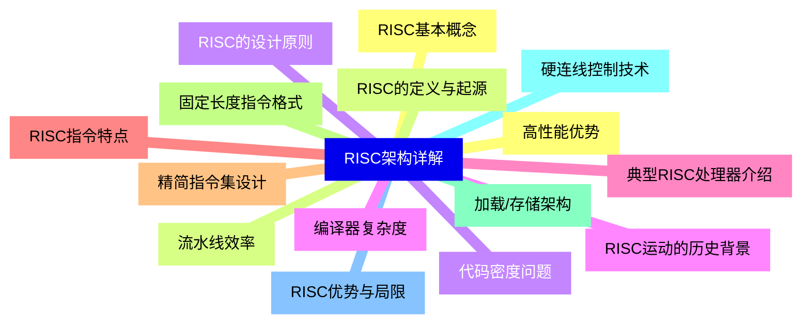
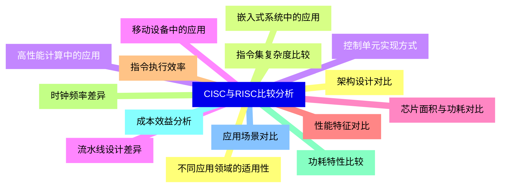
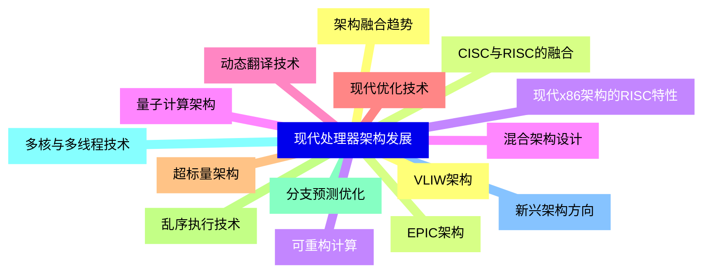
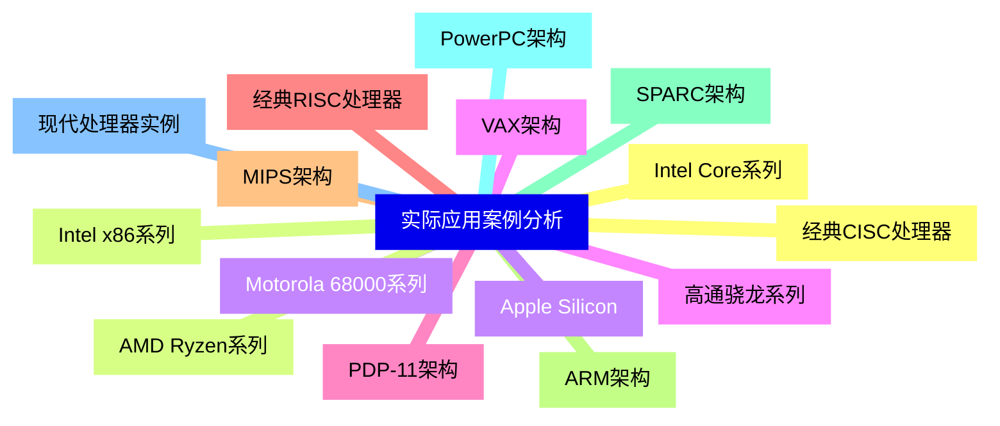
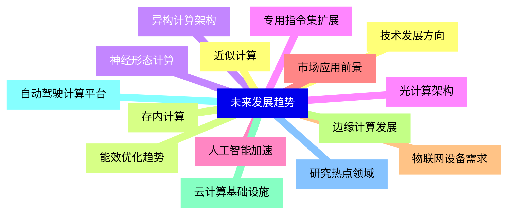


### 1 [指令集架构基础](#1)
#### 1.1 [指令集架构概述](#1)
#### 1.2 [指令集架构的定义与作用](#1)
#### 1.3 [ISA在计算机层次结构中的位置](#1)
#### 1.4 [指令集架构的发展历程](#1)
#### 1.5 [ISA与微架构的区别与联系](#1)
#### 1.6 [指令格式与寻址方式](#1)
#### 1.7 [指令的基本组成要素](#1)
#### 1.8 [常见指令格式类型](#1)
#### 1.9 [寻址方式的分类与特点](#1)
#### 1.10 [操作数类型与数据表示](#1)
### 2 [CISC架构详解](#2)
#### 2.1 [CISC基本概念](#2)
#### 2.2 [CISC的定义与起源](#2)
#### 2.3 [CISC的设计哲学](#2)
#### 2.4 [CISC的历史背景与发展](#2)
#### 2.5 [典型CISC处理器介绍](#2)
#### 2.6 [CISC指令特点](#2)
#### 2.7 [复杂指令的实现](#2)
#### 2.8 [变长指令格式](#2)
#### 2.9 [多种寻址方式](#2)
#### 2.10 [微程序控制技术](#2)
#### 2.11 [CISC优势与局限](#2)
#### 2.12 [代码密度优势](#2)
#### 2.13 [编译器简化](#2)
#### 2.14 [硬件复杂度问题](#2)
#### 2.15 [性能瓶颈分析](#2)
### 3 [RISC架构详解](#3)
#### 3.1 [RISC基本概念](#3)
#### 3.2 [RISC的定义与起源](#3)
#### 3.3 [RISC的设计原则](#3)
#### 3.4 [RISC运动的历史背景](#3)
#### 3.5 [典型RISC处理器介绍](#3)
#### 3.6 [RISC指令特点](#3)
#### 3.7 [精简指令集设计](#3)
#### 3.8 [固定长度指令格式](#3)
#### 3.9 [加载/存储架构](#3)
#### 3.10 [硬连线控制技术](#3)
#### 3.11 [RISC优势与局限](#3)
#### 3.12 [高性能优势](#3)
#### 3.13 [流水线效率](#3)
#### 3.14 [代码密度问题](#3)
#### 3.15 [编译器复杂度](#3)
### 4 [CISC与RISC比较分析](#4)
#### 4.1 [架构设计对比](#4)
#### 4.2 [指令集复杂度比较](#4)
#### 4.3 [控制单元实现方式](#4)
#### 4.4 [流水线设计差异](#4)
#### 4.5 [芯片面积与功耗对比](#4)
#### 4.6 [性能特征对比](#4)
#### 4.7 [指令执行效率](#4)
#### 4.8 [时钟频率差异](#4)
#### 4.9 [功耗特性比较](#4)
#### 4.10 [成本效益分析](#4)
#### 4.11 [应用场景对比](#4)
#### 4.12 [不同应用领域的适用性](#4)
#### 4.13 [嵌入式系统中的应用](#4)
#### 4.14 [高性能计算中的应用](#4)
#### 4.15 [移动设备中的应用](#4)
### 5 [现代处理器架构发展](#5)
#### 5.1 [架构融合趋势](#5)
#### 5.2 [CISC与RISC的融合](#5)
#### 5.3 [现代x86架构的RISC特性](#5)
#### 5.4 [混合架构设计](#5)
#### 5.5 [动态翻译技术](#5)
#### 5.6 [现代优化技术](#5)
#### 5.7 [超标量架构](#5)
#### 5.8 [乱序执行技术](#5)
#### 5.9 [分支预测优化](#5)
#### 5.10 [多核与多线程技术](#5)
#### 5.11 [新兴架构方向](#5)
#### 5.12 [VLIW架构](#5)
#### 5.13 [EPIC架构](#5)
#### 5.14 [可重构计算](#5)
#### 5.15 [量子计算架构](#5)
### 6 [实际应用案例分析](#6)
#### 6.1 [经典CISC处理器](#6)
#### 6.2 [Intel x86系列](#6)
#### 6.3 [Motorola 68000系列](#6)
#### 6.4 [VAX架构](#6)
#### 6.5 [PDP-11架构](#6)
#### 6.6 [经典RISC处理器](#6)
#### 6.7 [MIPS架构](#6)
#### 6.8 [ARM架构](#6)
#### 6.9 [SPARC架构](#6)
#### 6.10 [PowerPC架构](#6)
#### 6.11 [现代处理器实例](#6)
#### 6.12 [Intel Core系列](#6)
#### 6.13 [AMD Ryzen系列](#6)
#### 6.14 [Apple Silicon](#6)
#### 6.15 [高通骁龙系列](#6)
### 7 [未来发展趋势](#7)
#### 7.1 [技术发展方向](#7)
#### 7.2 [能效优化趋势](#7)
#### 7.3 [异构计算架构](#7)
#### 7.4 [专用指令集扩展](#7)
#### 7.5 [人工智能加速](#7)
#### 7.6 [市场应用前景](#7)
#### 7.7 [物联网设备需求](#7)
#### 7.8 [边缘计算发展](#7)
#### 7.9 [云计算基础设施](#7)
#### 7.10 [自动驾驶计算平台](#7)
#### 7.11 [研究热点领域](#7)
#### 7.12 [近似计算](#7)
#### 7.13 [存内计算](#7)
#### 7.14 [神经形态计算](#7)
#### 7.15 [光计算架构](#7)




### 1 指令集架构基础

---
### 1 指令集架构基础
___
#### 1.1 指令集架构概述
___
#### 1.2 指令集架构的定义与作用
___
#### 1.3 ISA在计算机层次结构中的位置
___
#### 1.4 指令集架构的发展历程
___
#### 1.5 ISA与微架构的区别与联系
___
#### 1.6 指令格式与寻址方式
___
#### 1.7 指令的基本组成要素
___
#### 1.8 常见指令格式类型
___
#### 1.9 寻址方式的分类与特点
___
#### 1.10 操作数类型与数据表示
### 2 CISC架构详解

---
### 2 CISC架构详解
___
#### 2.1 CISC基本概念
___
#### 2.2 CISC的定义与起源
___
#### 2.3 CISC的设计哲学
___
#### 2.4 CISC的历史背景与发展
___
#### 2.5 典型CISC处理器介绍
___
#### 2.6 CISC指令特点
___
#### 2.7 复杂指令的实现
___
#### 2.8 变长指令格式
___
#### 2.9 多种寻址方式
___
#### 2.10 微程序控制技术
___
#### 2.11 CISC优势与局限
___
#### 2.12 代码密度优势
___
#### 2.13 编译器简化
___
#### 2.14 硬件复杂度问题
___
#### 2.15 性能瓶颈分析
### 3 RISC架构详解

---
### 3 RISC架构详解
___
#### 3.1 RISC基本概念
___
#### 3.2 RISC的定义与起源
___
#### 3.3 RISC的设计原则
___
#### 3.4 RISC运动的历史背景
___
#### 3.5 典型RISC处理器介绍
___
#### 3.6 RISC指令特点
___
#### 3.7 精简指令集设计
___
#### 3.8 固定长度指令格式
___
#### 3.9 加载/存储架构
___
#### 3.10 硬连线控制技术
___
#### 3.11 RISC优势与局限
___
#### 3.12 高性能优势
___
#### 3.13 流水线效率
___
#### 3.14 代码密度问题
___
#### 3.15 编译器复杂度
### 4 CISC与RISC比较分析

---
### 4 CISC与RISC比较分析
___
#### 4.1 架构设计对比
___
#### 4.2 指令集复杂度比较
___
#### 4.3 控制单元实现方式
___
#### 4.4 流水线设计差异
___
#### 4.5 芯片面积与功耗对比
___
#### 4.6 性能特征对比
___
#### 4.7 指令执行效率
___
#### 4.8 时钟频率差异
___
#### 4.9 功耗特性比较
___
#### 4.10 成本效益分析
___
#### 4.11 应用场景对比
___
#### 4.12 不同应用领域的适用性
___
#### 4.13 嵌入式系统中的应用
___
#### 4.14 高性能计算中的应用
___
#### 4.15 移动设备中的应用
### 5 现代处理器架构发展

---
### 5 现代处理器架构发展
___
#### 5.1 架构融合趋势
___
#### 5.2 CISC与RISC的融合
___
#### 5.3 现代x86架构的RISC特性
___
#### 5.4 混合架构设计
___
#### 5.5 动态翻译技术
___
#### 5.6 现代优化技术
___
#### 5.7 超标量架构
___
#### 5.8 乱序执行技术
___
#### 5.9 分支预测优化
___
#### 5.10 多核与多线程技术
___
#### 5.11 新兴架构方向
___
#### 5.12 VLIW架构
___
#### 5.13 EPIC架构
___
#### 5.14 可重构计算
___
#### 5.15 量子计算架构
### 6 实际应用案例分析

---
### 6 实际应用案例分析
___
#### 6.1 经典CISC处理器
___
#### 6.2 Intel x86系列
___
#### 6.3 Motorola 68000系列
___
#### 6.4 VAX架构
___
#### 6.5 PDP-11架构
___
#### 6.6 经典RISC处理器
___
#### 6.7 MIPS架构
___
#### 6.8 ARM架构
___
#### 6.9 SPARC架构
___
#### 6.10 PowerPC架构
___
#### 6.11 现代处理器实例
___
#### 6.12 Intel Core系列
___
#### 6.13 AMD Ryzen系列
___
#### 6.14 Apple Silicon
___
#### 6.15 高通骁龙系列
### 7 未来发展趋势

---
### 7 未来发展趋势
___
#### 7.1 技术发展方向
___
#### 7.2 能效优化趋势
___
#### 7.3 异构计算架构
___
#### 7.4 专用指令集扩展
___
#### 7.5 人工智能加速
___
#### 7.6 市场应用前景
___
#### 7.7 物联网设备需求
___
#### 7.8 边缘计算发展
___
#### 7.9 云计算基础设施
___
#### 7.10 自动驾驶计算平台
___
#### 7.11 研究热点领域
___
#### 7.12 近似计算
___
#### 7.13 存内计算
___
#### 7.14 神经形态计算
___
#### 7.15 光计算架构


### 1 指令集架构基础{#1}

{}

<--->
{}
{}
{}
{}
{}
{}
{}
{}
{}
{}
{}
{}
{}
{}
{}
{}
{}
{}
{}
{}
{}

### 2 CISC架构详解{#2}

{}
{}
{}
{}
{}
{}
{}
{}
{}
{}
{}
{}
{}
{}
{}
{}
{}
{}
{}
{}
{}
{}
{}
{}
{}
{}
{}
{}
{}
{}
{}
<--->

{}

### 3 RISC架构详解{#3}

{}

<--->
{}
{}
{}
{}
{}
{}
{}
{}
{}
{}
{}
{}
{}
{}
{}
{}
{}
{}
{}
{}
{}
{}
{}
{}
{}
{}
{}
{}
{}
{}
{}

### 4 CISC与RISC比较分析{#4}

{}
{}
{}
{}
{}
{}
{}
{}
{}
{}
{}
{}
{}
{}
{}
{}
{}
{}
{}
{}
{}
{}
{}
{}
{}
{}
{}
{}
{}
{}
{}
<--->

{}

### 5 现代处理器架构发展{#5}

{}

<--->
{}
{}
{}
{}
{}
{}
{}
{}
{}
{}
{}
{}
{}
{}
{}
{}
{}
{}
{}
{}
{}
{}
{}
{}
{}
{}
{}
{}
{}
{}
{}

### 6 实际应用案例分析{#6}

{}
{}
{}
{}
{}
{}
{}
{}
{}
{}
{}
{}
{}
{}
{}
{}
{}
{}
{}
{}
{}
{}
{}
{}
{}
{}
{}
{}
{}
{}
{}
<--->

{}

### 7 未来发展趋势{#7}

{}

<--->
{}
{}
{}
{}
{}
{}
{}
{}
{}
{}
{}
{}
{}
{}
{}
{}
{}
{}
{}
{}
{}
{}
{}
{}
{}
{}
{}
{}
{}
{}
{}
