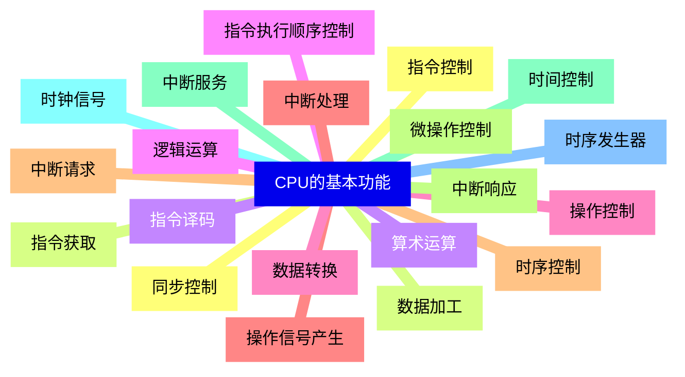
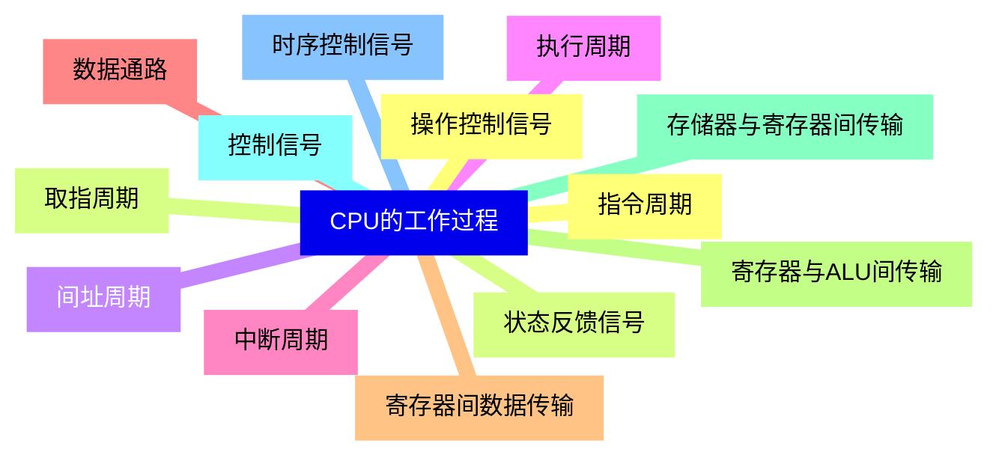
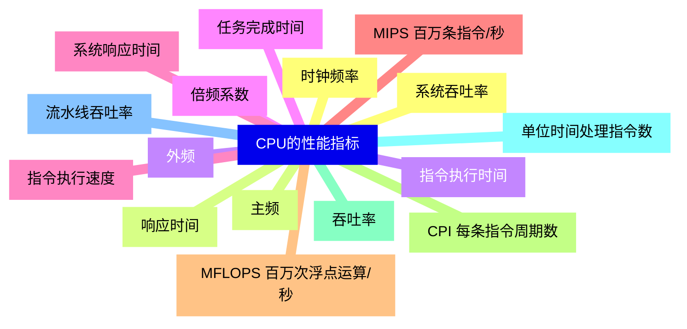
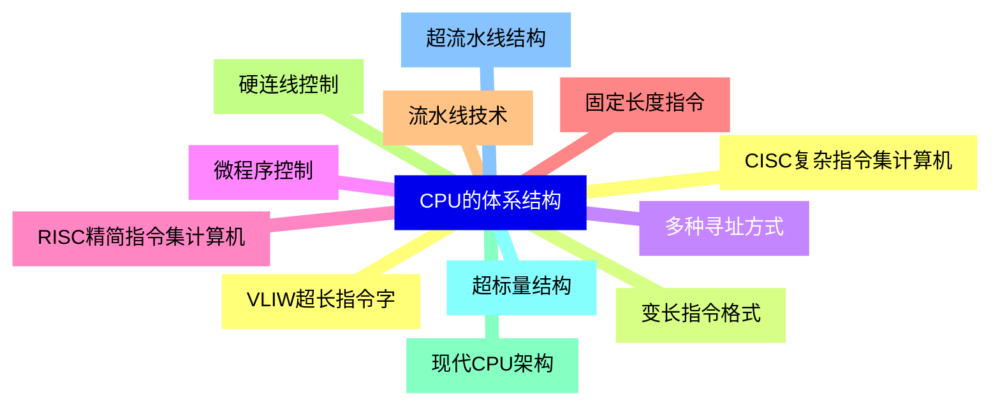
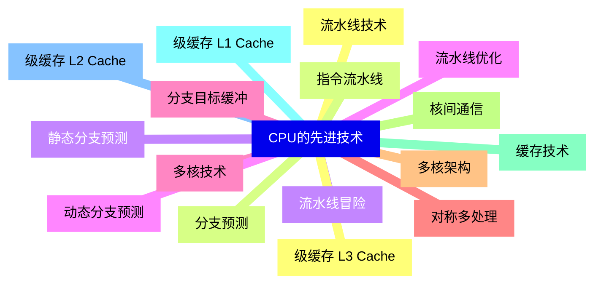
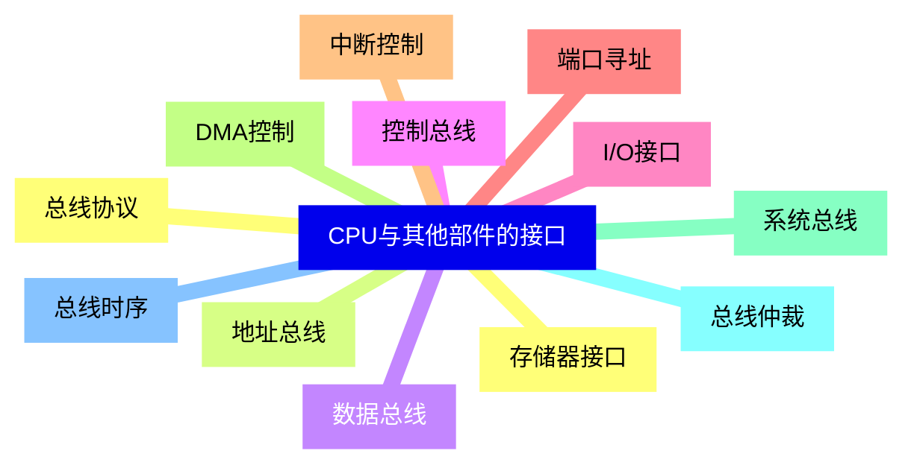
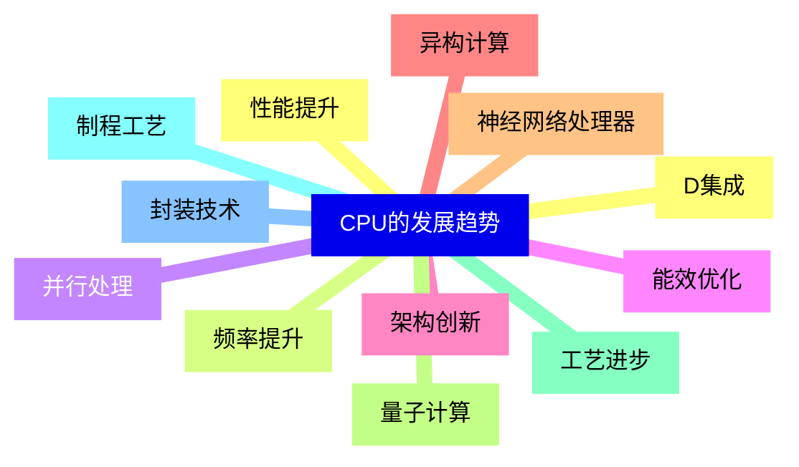


### 1 [CPU的基本功能](#1)
#### 1.1 [指令控制](#1)
#### 1.2 [指令获取](#1)
#### 1.3 [指令译码](#1)
#### 1.4 [指令执行顺序控制](#1)
#### 1.5 [操作控制](#1)
#### 1.6 [操作信号产生](#1)
#### 1.7 [时序控制](#1)
#### 1.8 [微操作控制](#1)
#### 1.9 [时间控制](#1)
#### 1.10 [时钟信号](#1)
#### 1.11 [时序发生器](#1)
#### 1.12 [同步控制](#1)
#### 1.13 [数据加工](#1)
#### 1.14 [算术运算](#1)
#### 1.15 [逻辑运算](#1)
#### 1.16 [数据转换](#1)
#### 1.17 [中断处理](#1)
#### 1.18 [中断请求](#1)
#### 1.19 [中断响应](#1)
#### 1.20 [中断服务](#1)
### 2 [CPU的基本组成](#2)
#### 2.1 [运算器](#2)
##### 2.1.1 [1  算术逻辑单元 ALU](#2)
#### 2.2 [加法器](#2)
#### 2.3 [移位器](#2)
#### 2.4 [逻辑运算单元](#2)
##### 2.4.1 [2  累加器](#2)
#### 2.5 [数据暂存](#2)
#### 2.6 [运算结果存储](#2)
#### 2.7 [状态标志设置](#2)
##### 2.7.1 [3  通用寄存器组](#2)
#### 2.8 [数据寄存器](#2)
#### 2.9 [地址寄存器](#2)
#### 2.10 [状态寄存器](#2)
##### 2.10.1 [4  专用寄存器](#2)
#### 2.11 [程序计数器 PC](#2)
#### 2.12 [指令寄存器 IR](#2)
#### 2.13 [存储器地址寄存器 MAR](#2)
#### 2.14 [存储器数据寄存器 MDR](#2)
#### 2.15 [控制器](#2)
##### 2.15.1 [1  指令寄存器 IR](#2)
#### 2.16 [指令存储](#2)
#### 2.17 [指令译码](#2)
#### 2.18 [操作码提取](#2)
##### 2.18.1 [2  程序计数器 PC](#2)
#### 2.19 [指令地址存储](#2)
#### 2.20 [地址自动递增](#2)
#### 2.21 [跳转地址控制](#2)
##### 2.21.1 [3  时序发生器](#2)
#### 2.22 [时钟信号产生](#2)
#### 2.23 [时序控制](#2)
#### 2.24 [节拍控制](#2)
##### 2.24.1 [4  操作控制器](#2)
#### 2.25 [微操作信号产生](#2)
#### 2.26 [控制信号分配](#2)
#### 2.27 [指令执行控制](#2)
#### 2.28 [寄存器组](#2)
##### 2.28.1 [1  用户可见寄存器](#2)
#### 2.29 [通用寄存器](#2)
#### 2.30 [数据寄存器](#2)
#### 2.31 [地址寄存器](#2)
#### 2.32 [条件码寄存器](#2)
##### 2.32.1 [2  控制和状态寄存器](#2)
#### 2.33 [程序计数器](#2)
#### 2.34 [指令寄存器](#2)
#### 2.35 [存储器地址寄存器](#2)
#### 2.36 [存储器缓冲寄存器](#2)
#### 2.37 [程序状态字 PSW](#2)
### 3 [CPU的工作过程](#3)
#### 3.1 [指令周期](#3)
#### 3.2 [取指周期](#3)
#### 3.3 [间址周期](#3)
#### 3.4 [执行周期](#3)
#### 3.5 [中断周期](#3)
#### 3.6 [数据通路](#3)
#### 3.7 [寄存器间数据传输](#3)
#### 3.8 [寄存器与ALU间传输](#3)
#### 3.9 [存储器与寄存器间传输](#3)
#### 3.10 [控制信号](#3)
#### 3.11 [时序控制信号](#3)
#### 3.12 [操作控制信号](#3)
#### 3.13 [状态反馈信号](#3)
### 4 [CPU的性能指标](#4)
#### 4.1 [时钟频率](#4)
#### 4.2 [主频](#4)
#### 4.3 [外频](#4)
#### 4.4 [倍频系数](#4)
#### 4.5 [指令执行速度](#4)
#### 4.6 [MIPS 百万条指令/秒](#4)
#### 4.7 [MFLOPS 百万次浮点运算/秒](#4)
#### 4.8 [CPI 每条指令周期数](#4)
#### 4.9 [吞吐率](#4)
#### 4.10 [单位时间处理指令数](#4)
#### 4.11 [流水线吞吐率](#4)
#### 4.12 [系统吞吐率](#4)
#### 4.13 [响应时间](#4)
#### 4.14 [指令执行时间](#4)
#### 4.15 [任务完成时间](#4)
#### 4.16 [系统响应时间](#4)
### 5 [CPU的体系结构](#5)
#### 5.1 [CISC复杂指令集计算机](#5)
#### 5.2 [变长指令格式](#5)
#### 5.3 [多种寻址方式](#5)
#### 5.4 [微程序控制](#5)
#### 5.5 [RISC精简指令集计算机](#5)
#### 5.6 [固定长度指令](#5)
#### 5.7 [流水线技术](#5)
#### 5.8 [硬连线控制](#5)
#### 5.9 [现代CPU架构](#5)
#### 5.10 [超标量结构](#5)
#### 5.11 [超流水线结构](#5)
#### 5.12 [VLIW超长指令字](#5)
### 6 [CPU的先进技术](#6)
#### 6.1 [流水线技术](#6)
#### 6.2 [指令流水线](#6)
#### 6.3 [流水线冒险](#6)
#### 6.4 [流水线优化](#6)
#### 6.5 [多核技术](#6)
#### 6.6 [对称多处理](#6)
#### 6.7 [多核架构](#6)
#### 6.8 [核间通信](#6)
#### 6.9 [缓存技术](#6)
#### 6.10 [级缓存 L1 Cache](#6)
#### 6.11 [级缓存 L2 Cache](#6)
#### 6.12 [级缓存 L3 Cache](#6)
#### 6.13 [分支预测](#6)
#### 6.14 [静态分支预测](#6)
#### 6.15 [动态分支预测](#6)
#### 6.16 [分支目标缓冲](#6)
### 7 [CPU与其他部件的接口](#7)
#### 7.1 [存储器接口](#7)
#### 7.2 [地址总线](#7)
#### 7.3 [数据总线](#7)
#### 7.4 [控制总线](#7)
#### 7.5 [I/O接口](#7)
#### 7.6 [端口寻址](#7)
#### 7.7 [中断控制](#7)
#### 7.8 [DMA控制](#7)
#### 7.9 [系统总线](#7)
#### 7.10 [总线仲裁](#7)
#### 7.11 [总线时序](#7)
#### 7.12 [总线协议](#7)
### 8 [CPU的发展趋势](#8)
#### 8.1 [性能提升](#8)
#### 8.2 [频率提升](#8)
#### 8.3 [并行处理](#8)
#### 8.4 [能效优化](#8)
#### 8.5 [架构创新](#8)
#### 8.6 [异构计算](#8)
#### 8.7 [神经网络处理器](#8)
#### 8.8 [量子计算](#8)
#### 8.9 [工艺进步](#8)
#### 8.10 [制程工艺](#8)
#### 8.11 [封装技术](#8)
#### 8.12 [D集成](#8)





### 1 CPU的基本功能


---
### 1 CPU的基本功能
___
#### 1.1 指令控制
___
#### 1.2 指令获取
___
#### 1.3 指令译码
___
#### 1.4 指令执行顺序控制
___
#### 1.5 操作控制
___
#### 1.6 操作信号产生
___
#### 1.7 时序控制
___
#### 1.8 微操作控制
___
#### 1.9 时间控制
___
#### 1.10 时钟信号
___
#### 1.11 时序发生器
___
#### 1.12 同步控制
___
#### 1.13 数据加工
___
#### 1.14 算术运算
___
#### 1.15 逻辑运算
___
#### 1.16 数据转换
___
#### 1.17 中断处理
___
#### 1.18 中断请求
___
#### 1.19 中断响应
___
#### 1.20 中断服务
### 2 CPU的基本组成


---
### 2 CPU的基本组成
___
#### 2.1 运算器
___
##### 2.1.1 1  算术逻辑单元 ALU
___
#### 2.2 加法器
___
#### 2.3 移位器
___
#### 2.4 逻辑运算单元
___
##### 2.4.1 2  累加器
___
#### 2.5 数据暂存
___
#### 2.6 运算结果存储
___
#### 2.7 状态标志设置
___
##### 2.7.1 3  通用寄存器组
___
#### 2.8 数据寄存器
___
#### 2.9 地址寄存器
___
#### 2.10 状态寄存器
___
##### 2.10.1 4  专用寄存器
___
#### 2.11 程序计数器 PC
___
#### 2.12 指令寄存器 IR
___
#### 2.13 存储器地址寄存器 MAR
___
#### 2.14 存储器数据寄存器 MDR
___
#### 2.15 控制器
___
##### 2.15.1 1  指令寄存器 IR
___
#### 2.16 指令存储
___
#### 2.17 指令译码
___
#### 2.18 操作码提取
___
##### 2.18.1 2  程序计数器 PC
___
#### 2.19 指令地址存储
___
#### 2.20 地址自动递增
___
#### 2.21 跳转地址控制
___
##### 2.21.1 3  时序发生器
___
#### 2.22 时钟信号产生
___
#### 2.23 时序控制
___
#### 2.24 节拍控制
___
##### 2.24.1 4  操作控制器
___
#### 2.25 微操作信号产生
___
#### 2.26 控制信号分配
___
#### 2.27 指令执行控制
___
#### 2.28 寄存器组
___
##### 2.28.1 1  用户可见寄存器
___
#### 2.29 通用寄存器
___
#### 2.30 数据寄存器
___
#### 2.31 地址寄存器
___
#### 2.32 条件码寄存器
___
##### 2.32.1 2  控制和状态寄存器
___
#### 2.33 程序计数器
___
#### 2.34 指令寄存器
___
#### 2.35 存储器地址寄存器
___
#### 2.36 存储器缓冲寄存器
___
#### 2.37 程序状态字 PSW
### 3 CPU的工作过程


---
### 3 CPU的工作过程
___
#### 3.1 指令周期
___
#### 3.2 取指周期
___
#### 3.3 间址周期
___
#### 3.4 执行周期
___
#### 3.5 中断周期
___
#### 3.6 数据通路
___
#### 3.7 寄存器间数据传输
___
#### 3.8 寄存器与ALU间传输
___
#### 3.9 存储器与寄存器间传输
___
#### 3.10 控制信号
___
#### 3.11 时序控制信号
___
#### 3.12 操作控制信号
___
#### 3.13 状态反馈信号
### 4 CPU的性能指标


---
### 4 CPU的性能指标
___
#### 4.1 时钟频率
___
#### 4.2 主频
___
#### 4.3 外频
___
#### 4.4 倍频系数
___
#### 4.5 指令执行速度
___
#### 4.6 MIPS 百万条指令/秒
___
#### 4.7 MFLOPS 百万次浮点运算/秒
___
#### 4.8 CPI 每条指令周期数
___
#### 4.9 吞吐率
___
#### 4.10 单位时间处理指令数
___
#### 4.11 流水线吞吐率
___
#### 4.12 系统吞吐率
___
#### 4.13 响应时间
___
#### 4.14 指令执行时间
___
#### 4.15 任务完成时间
___
#### 4.16 系统响应时间
### 5 CPU的体系结构


---
### 5 CPU的体系结构
___
#### 5.1 CISC复杂指令集计算机
___
#### 5.2 变长指令格式
___
#### 5.3 多种寻址方式
___
#### 5.4 微程序控制
___
#### 5.5 RISC精简指令集计算机
___
#### 5.6 固定长度指令
___
#### 5.7 流水线技术
___
#### 5.8 硬连线控制
___
#### 5.9 现代CPU架构
___
#### 5.10 超标量结构
___
#### 5.11 超流水线结构
___
#### 5.12 VLIW超长指令字
### 6 CPU的先进技术


---
### 6 CPU的先进技术
___
#### 6.1 流水线技术
___
#### 6.2 指令流水线
___
#### 6.3 流水线冒险
___
#### 6.4 流水线优化
___
#### 6.5 多核技术
___
#### 6.6 对称多处理
___
#### 6.7 多核架构
___
#### 6.8 核间通信
___
#### 6.9 缓存技术
___
#### 6.10 级缓存 L1 Cache
___
#### 6.11 级缓存 L2 Cache
___
#### 6.12 级缓存 L3 Cache
___
#### 6.13 分支预测
___
#### 6.14 静态分支预测
___
#### 6.15 动态分支预测
___
#### 6.16 分支目标缓冲
### 7 CPU与其他部件的接口


---
### 7 CPU与其他部件的接口
___
#### 7.1 存储器接口
___
#### 7.2 地址总线
___
#### 7.3 数据总线
___
#### 7.4 控制总线
___
#### 7.5 I/O接口
___
#### 7.6 端口寻址
___
#### 7.7 中断控制
___
#### 7.8 DMA控制
___
#### 7.9 系统总线
___
#### 7.10 总线仲裁
___
#### 7.11 总线时序
___
#### 7.12 总线协议
### 8 CPU的发展趋势


---
### 8 CPU的发展趋势
___
#### 8.1 性能提升
___
#### 8.2 频率提升
___
#### 8.3 并行处理
___
#### 8.4 能效优化
___
#### 8.5 架构创新
___
#### 8.6 异构计算
___
#### 8.7 神经网络处理器
___
#### 8.8 量子计算
___
#### 8.9 工艺进步
___
#### 8.10 制程工艺
___
#### 8.11 封装技术
___
#### 8.12 D集成



### 1 CPU的基本功能{#1}


{}


<--->
{}
{}
{}
{}
{}
{}
{}
{}
{}
{}
{}
{}
{}
{}
{}
{}
{}
{}
{}
{}
{}
{}
{}
{}
{}
{}
{}
{}
{}
{}
{}
{}
{}
{}
{}
{}
{}
{}
{}
{}
{}

### 2 CPU的基本组成{#2}


{}
{}
{}
{}
{}
{}
{}
{}
{}
{}
{}
{}
{}
{}
{}
{}
{}
{}
{}
{}
{}
{}
{}
{}
{}
{}
{}
{}
{}
{}
{}
{}
{}
{}
{}
{}
{}
{}
{}
{}
{}
{}
{}
{}
{}
{}
{}
{}
{}
{}
{}
{}
{}
{}
{}
{}
{}
{}
{}
{}
{}
{}
{}
{}
{}
{}
{}
{}
{}
{}
{}
{}
{}
{}
{}
{}
{}
{}
{}
{}
{}
{}
{}
{}
{}
{}
{}
{}
{}
{}
{}
{}
{}
{}
{}
<--->
```mermaid
mindmap
    id2[CPU的基本组成]
        id2-1[运算器]
            id2-1-1[1  算术逻辑单元 ALU]
        id2-2[加法器]
        id2-3[移位器]
        id2-4[逻辑运算单元]
            id2-4-1[2  累加器]
        id2-5[数据暂存]
        id2-6[运算结果存储]
        id2-7[状态标志设置]
            id2-7-1[3  通用寄存器组]
        id2-8[数据寄存器]
        id2-9[地址寄存器]
        id2-10[状态寄存器]
            id2-10-1[4  专用寄存器]
        id2-11[程序计数器 PC]
        id2-12[指令寄存器 IR]
        id2-13[存储器地址寄存器 MAR]
        id2-14[存储器数据寄存器 MDR]
        id2-15[控制器]
            id2-15-1[1  指令寄存器 IR]
        id2-16[指令存储]
        id2-17[指令译码]
        id2-18[操作码提取]
            id2-18-1[2  程序计数器 PC]
        id2-19[指令地址存储]
        id2-20[地址自动递增]
        id2-21[跳转地址控制]
            id2-21-1[3  时序发生器]
        id2-22[时钟信号产生]
        id2-23[时序控制]
        id2-24[节拍控制]
            id2-24-1[4  操作控制器]
        id2-25[微操作信号产生]
        id2-26[控制信号分配]
        id2-27[指令执行控制]
        id2-28[寄存器组]
            id2-28-1[1  用户可见寄存器]
        id2-29[通用寄存器]
        id2-30[数据寄存器]
        id2-31[地址寄存器]
        id2-32[条件码寄存器]
            id2-32-1[2  控制和状态寄存器]
        id2-33[程序计数器]
        id2-34[指令寄存器]
        id2-35[存储器地址寄存器]
        id2-36[存储器缓冲寄存器]
        id2-37[程序状态字 PSW]
```

{}

### 3 CPU的工作过程{#3}


{}


<--->
{}
{}
{}
{}
{}
{}
{}
{}
{}
{}
{}
{}
{}
{}
{}
{}
{}
{}
{}
{}
{}
{}
{}
{}
{}
{}
{}

### 4 CPU的性能指标{#4}


{}
{}
{}
{}
{}
{}
{}
{}
{}
{}
{}
{}
{}
{}
{}
{}
{}
{}
{}
{}
{}
{}
{}
{}
{}
{}
{}
{}
{}
{}
{}
{}
{}
<--->


{}

### 5 CPU的体系结构{#5}


{}


<--->
{}
{}
{}
{}
{}
{}
{}
{}
{}
{}
{}
{}
{}
{}
{}
{}
{}
{}
{}
{}
{}
{}
{}
{}
{}

### 6 CPU的先进技术{#6}


{}
{}
{}
{}
{}
{}
{}
{}
{}
{}
{}
{}
{}
{}
{}
{}
{}
{}
{}
{}
{}
{}
{}
{}
{}
{}
{}
{}
{}
{}
{}
{}
{}
<--->


{}

### 7 CPU与其他部件的接口{#7}


{}


<--->
{}
{}
{}
{}
{}
{}
{}
{}
{}
{}
{}
{}
{}
{}
{}
{}
{}
{}
{}
{}
{}
{}
{}
{}
{}

### 8 CPU的发展趋势{#8}


{}
{}
{}
{}
{}
{}
{}
{}
{}
{}
{}
{}
{}
{}
{}
{}
{}
{}
{}
{}
{}
{}
{}
{}
{}
<--->


{}
