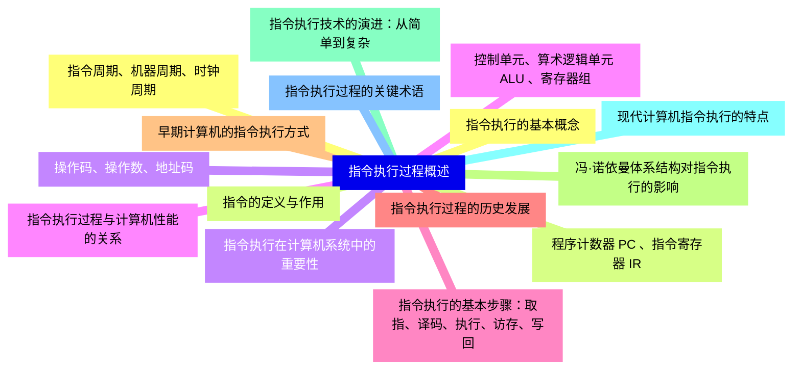
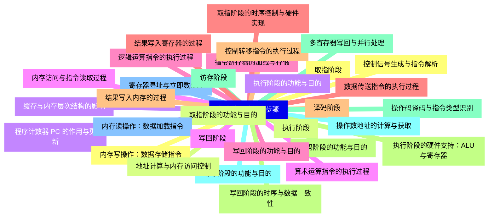
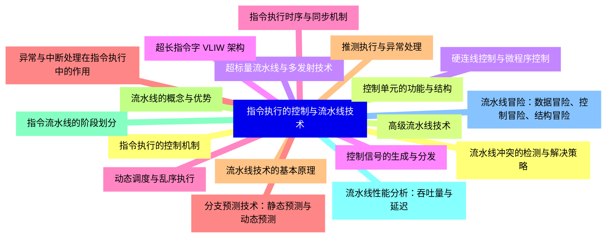
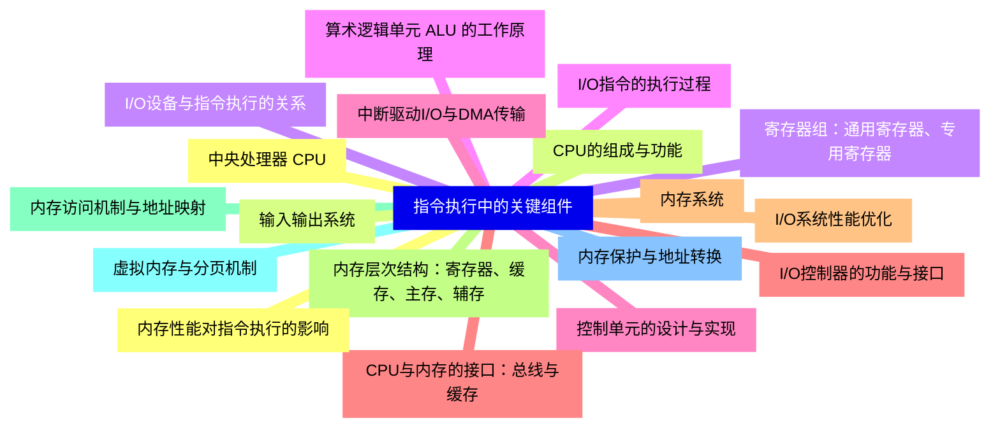
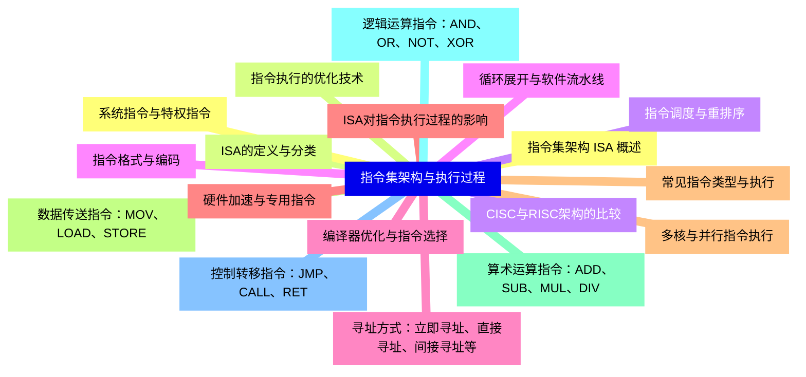
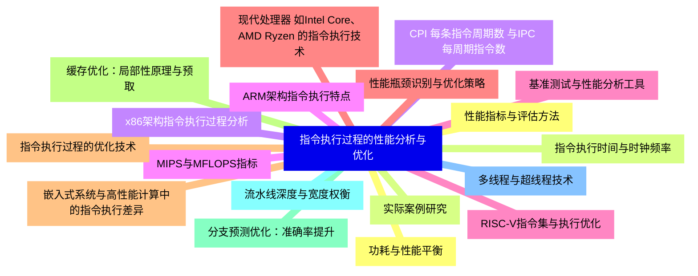
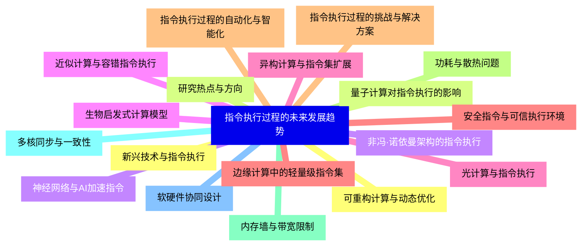


### 1 [指令执行过程概述](#1)
#### 1.1 [指令执行的基本概念](#1)
#### 1.2 [指令的定义与作用](#1)
#### 1.3 [指令执行在计算机系统中的重要性](#1)
#### 1.4 [指令执行过程与计算机性能的关系](#1)
#### 1.5 [指令执行的基本步骤：取指、译码、执行、访存、写回](#1)
#### 1.6 [指令执行过程的历史发展](#1)
#### 1.7 [早期计算机的指令执行方式](#1)
#### 1.8 [冯·诺依曼体系结构对指令执行的影响](#1)
#### 1.9 [指令执行技术的演进：从简单到复杂](#1)
#### 1.10 [现代计算机指令执行的特点](#1)
#### 1.11 [指令执行过程的关键术语](#1)
#### 1.12 [指令周期、机器周期、时钟周期](#1)
#### 1.13 [程序计数器 PC 、指令寄存器 IR](#1)
#### 1.14 [操作码、操作数、地址码](#1)
#### 1.15 [控制单元、算术逻辑单元 ALU 、寄存器组](#1)
### 2 [指令执行的基本步骤](#2)
#### 2.1 [取指阶段](#2)
#### 2.2 [取指阶段的功能与目的](#2)
#### 2.3 [程序计数器 PC 的作用与更新](#2)
#### 2.4 [内存访问与指令读取过程](#2)
#### 2.5 [指令寄存器的加载与存储](#2)
#### 2.6 [取指阶段的时序控制与硬件实现](#2)
#### 2.7 [译码阶段](#2)
#### 2.8 [译码阶段的功能与目的](#2)
#### 2.9 [操作码译码与指令类型识别](#2)
#### 2.10 [操作数地址的计算与获取](#2)
#### 2.11 [寄存器寻址与立即数处理](#2)
#### 2.12 [控制信号生成与指令解析](#2)
#### 2.13 [执行阶段](#2)
#### 2.14 [执行阶段的功能与目的](#2)
#### 2.15 [算术运算指令的执行过程](#2)
#### 2.16 [逻辑运算指令的执行过程](#2)
#### 2.17 [数据传送指令的执行过程](#2)
#### 2.18 [控制转移指令的执行过程](#2)
#### 2.19 [执行阶段的硬件支持：ALU与寄存器](#2)
#### 2.20 [访存阶段](#2)
#### 2.21 [访存阶段的功能与目的](#2)
#### 2.22 [内存读操作：数据加载指令](#2)
#### 2.23 [内存写操作：数据存储指令](#2)
#### 2.24 [地址计算与内存访问控制](#2)
#### 2.25 [缓存与内存层次结构的影响](#2)
#### 2.26 [写回阶段](#2)
#### 2.27 [写回阶段的功能与目的](#2)
#### 2.28 [结果写入寄存器的过程](#2)
#### 2.29 [结果写入内存的过程](#2)
#### 2.30 [写回阶段的时序与数据一致性](#2)
#### 2.31 [多寄存器写回与并行处理](#2)
### 3 [指令执行的控制与流水线技术](#3)
#### 3.1 [指令执行的控制机制](#3)
#### 3.2 [控制单元的功能与结构](#3)
#### 3.3 [硬连线控制与微程序控制](#3)
#### 3.4 [控制信号的生成与分发](#3)
#### 3.5 [指令执行时序与同步机制](#3)
#### 3.6 [异常与中断处理在指令执行中的作用](#3)
#### 3.7 [流水线技术的基本原理](#3)
#### 3.8 [流水线的概念与优势](#3)
#### 3.9 [指令流水线的阶段划分](#3)
#### 3.10 [流水线性能分析：吞吐量与延迟](#3)
#### 3.11 [流水线冒险：数据冒险、控制冒险、结构冒险](#3)
#### 3.12 [流水线冲突的检测与解决策略](#3)
#### 3.13 [高级流水线技术](#3)
#### 3.14 [超标量流水线与多发射技术](#3)
#### 3.15 [超长指令字 VLIW 架构](#3)
#### 3.16 [动态调度与乱序执行](#3)
#### 3.17 [分支预测技术：静态预测与动态预测](#3)
#### 3.18 [推测执行与异常处理](#3)
### 4 [指令执行中的关键组件](#4)
#### 4.1 [中央处理器 CPU](#4)
#### 4.2 [CPU的组成与功能](#4)
#### 4.3 [寄存器组：通用寄存器、专用寄存器](#4)
#### 4.4 [算术逻辑单元 ALU 的工作原理](#4)
#### 4.5 [控制单元的设计与实现](#4)
#### 4.6 [CPU与内存的接口：总线与缓存](#4)
#### 4.7 [内存系统](#4)
#### 4.8 [内存层次结构：寄存器、缓存、主存、辅存](#4)
#### 4.9 [内存访问机制与地址映射](#4)
#### 4.10 [虚拟内存与分页机制](#4)
#### 4.11 [内存保护与地址转换](#4)
#### 4.12 [内存性能对指令执行的影响](#4)
#### 4.13 [输入输出系统](#4)
#### 4.14 [I/O设备与指令执行的关系](#4)
#### 4.15 [I/O指令的执行过程](#4)
#### 4.16 [中断驱动I/O与DMA传输](#4)
#### 4.17 [I/O控制器的功能与接口](#4)
#### 4.18 [I/O系统性能优化](#4)
### 5 [指令集架构与执行过程](#5)
#### 5.1 [指令集架构 ISA 概述](#5)
#### 5.2 [ISA的定义与分类](#5)
#### 5.3 [CISC与RISC架构的比较](#5)
#### 5.4 [指令格式与编码](#5)
#### 5.5 [寻址方式：立即寻址、直接寻址、间接寻址等](#5)
#### 5.6 [ISA对指令执行过程的影响](#5)
#### 5.7 [常见指令类型与执行](#5)
#### 5.8 [数据传送指令：MOV、LOAD、STORE](#5)
#### 5.9 [算术运算指令：ADD、SUB、MUL、DIV](#5)
#### 5.10 [逻辑运算指令：AND、OR、NOT、XOR](#5)
#### 5.11 [控制转移指令：JMP、CALL、RET](#5)
#### 5.12 [系统指令与特权指令](#5)
#### 5.13 [指令执行的优化技术](#5)
#### 5.14 [指令调度与重排序](#5)
#### 5.15 [循环展开与软件流水线](#5)
#### 5.16 [编译器优化与指令选择](#5)
#### 5.17 [硬件加速与专用指令](#5)
#### 5.18 [多核与并行指令执行](#5)
### 6 [指令执行过程的性能分析与优化](#6)
#### 6.1 [性能指标与评估方法](#6)
#### 6.2 [指令执行时间与时钟频率](#6)
#### 6.3 [CPI 每条指令周期数 与IPC 每周期指令数](#6)
#### 6.4 [MIPS与MFLOPS指标](#6)
#### 6.5 [基准测试与性能分析工具](#6)
#### 6.6 [性能瓶颈识别与优化策略](#6)
#### 6.7 [指令执行过程的优化技术](#6)
#### 6.8 [缓存优化：局部性原理与预取](#6)
#### 6.9 [分支预测优化：准确率提升](#6)
#### 6.10 [流水线深度与宽度权衡](#6)
#### 6.11 [多线程与超线程技术](#6)
#### 6.12 [功耗与性能平衡](#6)
#### 6.13 [实际案例研究](#6)
#### 6.14 [x86架构指令执行过程分析](#6)
#### 6.15 [ARM架构指令执行特点](#6)
#### 6.16 [RISC-V指令集与执行优化](#6)
#### 6.17 [现代处理器 如Intel Core、AMD Ryzen 的指令执行技术](#6)
#### 6.18 [嵌入式系统与高性能计算中的指令执行差异](#6)
### 7 [指令执行过程的未来发展趋势](#7)
#### 7.1 [新兴技术与指令执行](#7)
#### 7.2 [量子计算对指令执行的影响](#7)
#### 7.3 [神经网络与AI加速指令](#7)
#### 7.4 [近似计算与容错指令执行](#7)
#### 7.5 [异构计算与指令集扩展](#7)
#### 7.6 [安全指令与可信执行环境](#7)
#### 7.7 [指令执行过程的挑战与解决方案](#7)
#### 7.8 [功耗与散热问题](#7)
#### 7.9 [内存墙与带宽限制](#7)
#### 7.10 [多核同步与一致性](#7)
#### 7.11 [软硬件协同设计](#7)
#### 7.12 [可重构计算与动态优化](#7)
#### 7.13 [研究热点与方向](#7)
#### 7.14 [非冯·诺依曼架构的指令执行](#7)
#### 7.15 [生物启发式计算模型](#7)
#### 7.16 [光计算与指令执行](#7)
#### 7.17 [边缘计算中的轻量级指令集](#7)
#### 7.18 [指令执行过程的自动化与智能化](#7)




### 1 指令执行过程概述

---
### 1 指令执行过程概述
___
#### 1.1 指令执行的基本概念
___
#### 1.2 指令的定义与作用
___
#### 1.3 指令执行在计算机系统中的重要性
___
#### 1.4 指令执行过程与计算机性能的关系
___
#### 1.5 指令执行的基本步骤：取指、译码、执行、访存、写回
___
#### 1.6 指令执行过程的历史发展
___
#### 1.7 早期计算机的指令执行方式
___
#### 1.8 冯·诺依曼体系结构对指令执行的影响
___
#### 1.9 指令执行技术的演进：从简单到复杂
___
#### 1.10 现代计算机指令执行的特点
___
#### 1.11 指令执行过程的关键术语
___
#### 1.12 指令周期、机器周期、时钟周期
___
#### 1.13 程序计数器 PC 、指令寄存器 IR
___
#### 1.14 操作码、操作数、地址码
___
#### 1.15 控制单元、算术逻辑单元 ALU 、寄存器组
### 2 指令执行的基本步骤

---
### 2 指令执行的基本步骤
___
#### 2.1 取指阶段
___
#### 2.2 取指阶段的功能与目的
___
#### 2.3 程序计数器 PC 的作用与更新
___
#### 2.4 内存访问与指令读取过程
___
#### 2.5 指令寄存器的加载与存储
___
#### 2.6 取指阶段的时序控制与硬件实现
___
#### 2.7 译码阶段
___
#### 2.8 译码阶段的功能与目的
___
#### 2.9 操作码译码与指令类型识别
___
#### 2.10 操作数地址的计算与获取
___
#### 2.11 寄存器寻址与立即数处理
___
#### 2.12 控制信号生成与指令解析
___
#### 2.13 执行阶段
___
#### 2.14 执行阶段的功能与目的
___
#### 2.15 算术运算指令的执行过程
___
#### 2.16 逻辑运算指令的执行过程
___
#### 2.17 数据传送指令的执行过程
___
#### 2.18 控制转移指令的执行过程
___
#### 2.19 执行阶段的硬件支持：ALU与寄存器
___
#### 2.20 访存阶段
___
#### 2.21 访存阶段的功能与目的
___
#### 2.22 内存读操作：数据加载指令
___
#### 2.23 内存写操作：数据存储指令
___
#### 2.24 地址计算与内存访问控制
___
#### 2.25 缓存与内存层次结构的影响
___
#### 2.26 写回阶段
___
#### 2.27 写回阶段的功能与目的
___
#### 2.28 结果写入寄存器的过程
___
#### 2.29 结果写入内存的过程
___
#### 2.30 写回阶段的时序与数据一致性
___
#### 2.31 多寄存器写回与并行处理
### 3 指令执行的控制与流水线技术

---
### 3 指令执行的控制与流水线技术
___
#### 3.1 指令执行的控制机制
___
#### 3.2 控制单元的功能与结构
___
#### 3.3 硬连线控制与微程序控制
___
#### 3.4 控制信号的生成与分发
___
#### 3.5 指令执行时序与同步机制
___
#### 3.6 异常与中断处理在指令执行中的作用
___
#### 3.7 流水线技术的基本原理
___
#### 3.8 流水线的概念与优势
___
#### 3.9 指令流水线的阶段划分
___
#### 3.10 流水线性能分析：吞吐量与延迟
___
#### 3.11 流水线冒险：数据冒险、控制冒险、结构冒险
___
#### 3.12 流水线冲突的检测与解决策略
___
#### 3.13 高级流水线技术
___
#### 3.14 超标量流水线与多发射技术
___
#### 3.15 超长指令字 VLIW 架构
___
#### 3.16 动态调度与乱序执行
___
#### 3.17 分支预测技术：静态预测与动态预测
___
#### 3.18 推测执行与异常处理
### 4 指令执行中的关键组件

---
### 4 指令执行中的关键组件
___
#### 4.1 中央处理器 CPU
___
#### 4.2 CPU的组成与功能
___
#### 4.3 寄存器组：通用寄存器、专用寄存器
___
#### 4.4 算术逻辑单元 ALU 的工作原理
___
#### 4.5 控制单元的设计与实现
___
#### 4.6 CPU与内存的接口：总线与缓存
___
#### 4.7 内存系统
___
#### 4.8 内存层次结构：寄存器、缓存、主存、辅存
___
#### 4.9 内存访问机制与地址映射
___
#### 4.10 虚拟内存与分页机制
___
#### 4.11 内存保护与地址转换
___
#### 4.12 内存性能对指令执行的影响
___
#### 4.13 输入输出系统
___
#### 4.14 I/O设备与指令执行的关系
___
#### 4.15 I/O指令的执行过程
___
#### 4.16 中断驱动I/O与DMA传输
___
#### 4.17 I/O控制器的功能与接口
___
#### 4.18 I/O系统性能优化
### 5 指令集架构与执行过程

---
### 5 指令集架构与执行过程
___
#### 5.1 指令集架构 ISA 概述
___
#### 5.2 ISA的定义与分类
___
#### 5.3 CISC与RISC架构的比较
___
#### 5.4 指令格式与编码
___
#### 5.5 寻址方式：立即寻址、直接寻址、间接寻址等
___
#### 5.6 ISA对指令执行过程的影响
___
#### 5.7 常见指令类型与执行
___
#### 5.8 数据传送指令：MOV、LOAD、STORE
___
#### 5.9 算术运算指令：ADD、SUB、MUL、DIV
___
#### 5.10 逻辑运算指令：AND、OR、NOT、XOR
___
#### 5.11 控制转移指令：JMP、CALL、RET
___
#### 5.12 系统指令与特权指令
___
#### 5.13 指令执行的优化技术
___
#### 5.14 指令调度与重排序
___
#### 5.15 循环展开与软件流水线
___
#### 5.16 编译器优化与指令选择
___
#### 5.17 硬件加速与专用指令
___
#### 5.18 多核与并行指令执行
### 6 指令执行过程的性能分析与优化

---
### 6 指令执行过程的性能分析与优化
___
#### 6.1 性能指标与评估方法
___
#### 6.2 指令执行时间与时钟频率
___
#### 6.3 CPI 每条指令周期数 与IPC 每周期指令数
___
#### 6.4 MIPS与MFLOPS指标
___
#### 6.5 基准测试与性能分析工具
___
#### 6.6 性能瓶颈识别与优化策略
___
#### 6.7 指令执行过程的优化技术
___
#### 6.8 缓存优化：局部性原理与预取
___
#### 6.9 分支预测优化：准确率提升
___
#### 6.10 流水线深度与宽度权衡
___
#### 6.11 多线程与超线程技术
___
#### 6.12 功耗与性能平衡
___
#### 6.13 实际案例研究
___
#### 6.14 x86架构指令执行过程分析
___
#### 6.15 ARM架构指令执行特点
___
#### 6.16 RISC-V指令集与执行优化
___
#### 6.17 现代处理器 如Intel Core、AMD Ryzen 的指令执行技术
___
#### 6.18 嵌入式系统与高性能计算中的指令执行差异
### 7 指令执行过程的未来发展趋势

---
### 7 指令执行过程的未来发展趋势
___
#### 7.1 新兴技术与指令执行
___
#### 7.2 量子计算对指令执行的影响
___
#### 7.3 神经网络与AI加速指令
___
#### 7.4 近似计算与容错指令执行
___
#### 7.5 异构计算与指令集扩展
___
#### 7.6 安全指令与可信执行环境
___
#### 7.7 指令执行过程的挑战与解决方案
___
#### 7.8 功耗与散热问题
___
#### 7.9 内存墙与带宽限制
___
#### 7.10 多核同步与一致性
___
#### 7.11 软硬件协同设计
___
#### 7.12 可重构计算与动态优化
___
#### 7.13 研究热点与方向
___
#### 7.14 非冯·诺依曼架构的指令执行
___
#### 7.15 生物启发式计算模型
___
#### 7.16 光计算与指令执行
___
#### 7.17 边缘计算中的轻量级指令集
___
#### 7.18 指令执行过程的自动化与智能化


### 1 指令执行过程概述{#1}

{}

<--->
{}
{}
{}
{}
{}
{}
{}
{}
{}
{}
{}
{}
{}
{}
{}
{}
{}
{}
{}
{}
{}
{}
{}
{}
{}
{}
{}
{}
{}
{}
{}

### 2 指令执行的基本步骤{#2}

{}
{}
{}
{}
{}
{}
{}
{}
{}
{}
{}
{}
{}
{}
{}
{}
{}
{}
{}
{}
{}
{}
{}
{}
{}
{}
{}
{}
{}
{}
{}
{}
{}
{}
{}
{}
{}
{}
{}
{}
{}
{}
{}
{}
{}
{}
{}
{}
{}
{}
{}
{}
{}
{}
{}
{}
{}
{}
{}
{}
{}
{}
{}
<--->

{}

### 3 指令执行的控制与流水线技术{#3}

{}

<--->
{}
{}
{}
{}
{}
{}
{}
{}
{}
{}
{}
{}
{}
{}
{}
{}
{}
{}
{}
{}
{}
{}
{}
{}
{}
{}
{}
{}
{}
{}
{}
{}
{}
{}
{}
{}
{}

### 4 指令执行中的关键组件{#4}

{}
{}
{}
{}
{}
{}
{}
{}
{}
{}
{}
{}
{}
{}
{}
{}
{}
{}
{}
{}
{}
{}
{}
{}
{}
{}
{}
{}
{}
{}
{}
{}
{}
{}
{}
{}
{}
<--->

{}

### 5 指令集架构与执行过程{#5}

{}

<--->
{}
{}
{}
{}
{}
{}
{}
{}
{}
{}
{}
{}
{}
{}
{}
{}
{}
{}
{}
{}
{}
{}
{}
{}
{}
{}
{}
{}
{}
{}
{}
{}
{}
{}
{}
{}
{}

### 6 指令执行过程的性能分析与优化{#6}

{}
{}
{}
{}
{}
{}
{}
{}
{}
{}
{}
{}
{}
{}
{}
{}
{}
{}
{}
{}
{}
{}
{}
{}
{}
{}
{}
{}
{}
{}
{}
{}
{}
{}
{}
{}
{}
<--->

{}

### 7 指令执行过程的未来发展趋势{#7}

{}

<--->
{}
{}
{}
{}
{}
{}
{}
{}
{}
{}
{}
{}
{}
{}
{}
{}
{}
{}
{}
{}
{}
{}
{}
{}
{}
{}
{}
{}
{}
{}
{}
{}
{}
{}
{}
{}
{}
