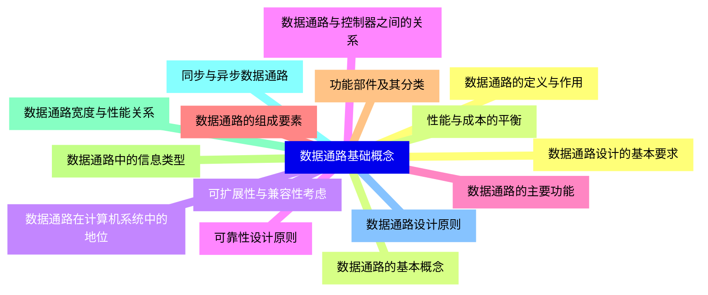
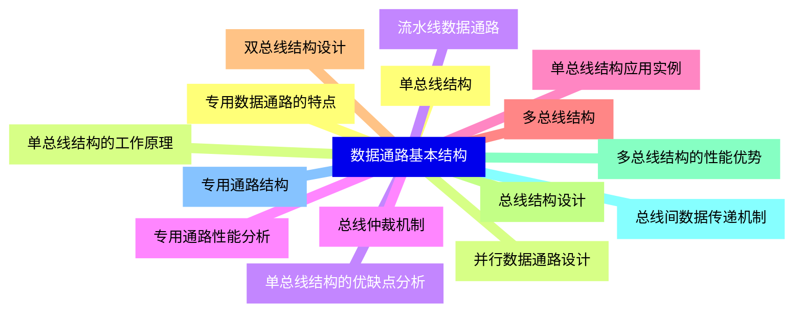
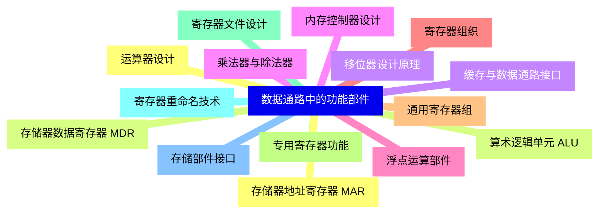
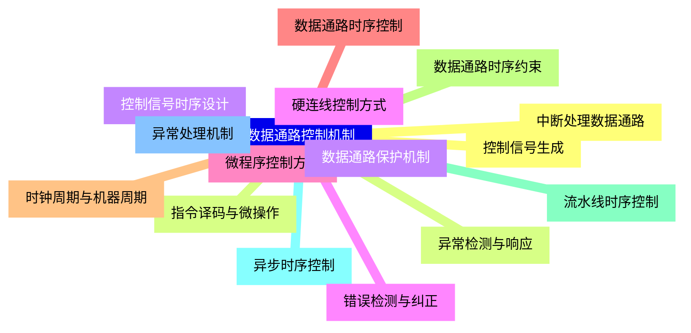
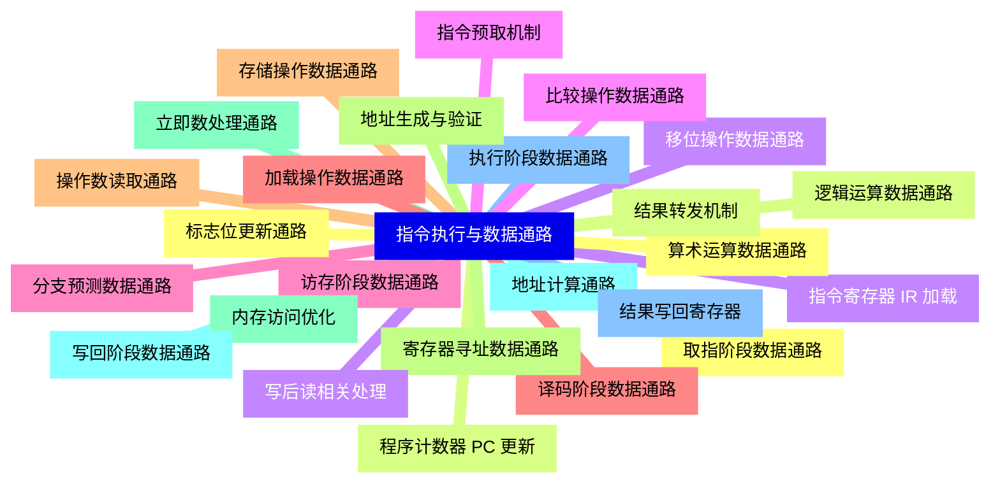
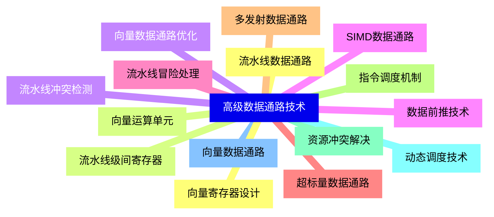
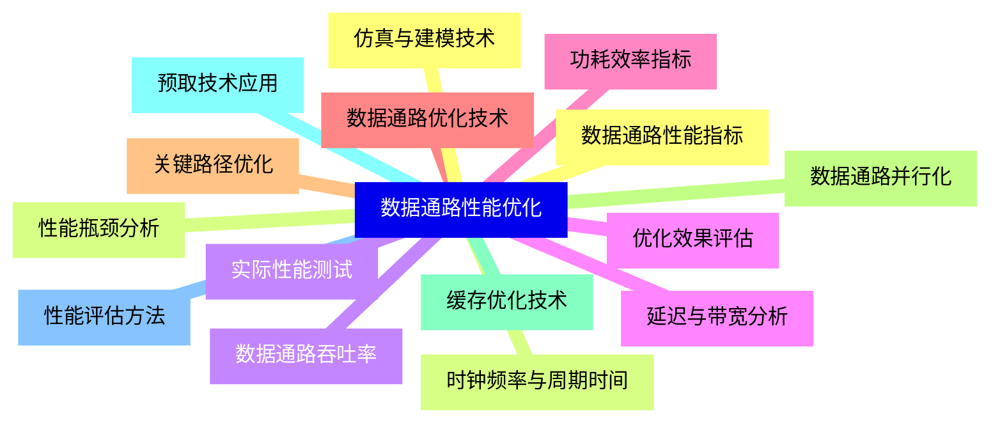
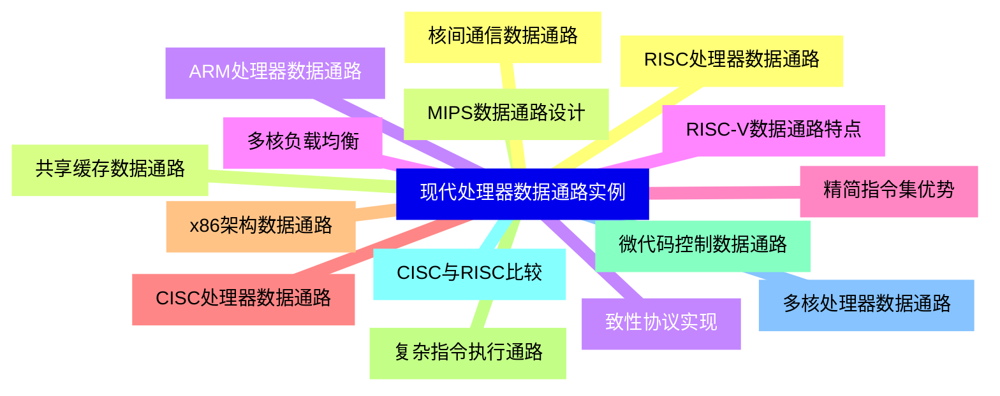
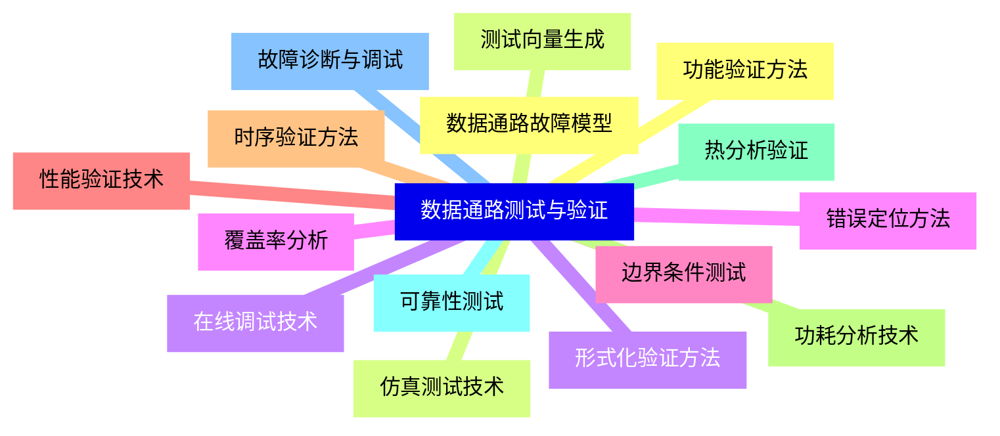
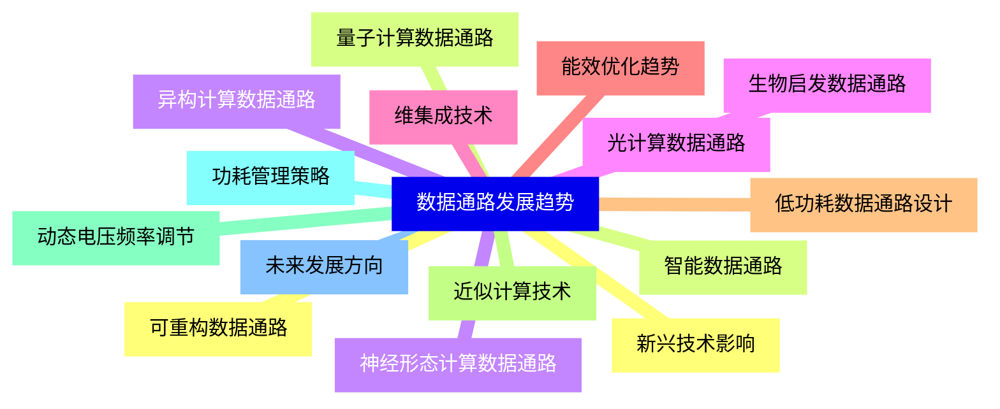


### 1 [数据通路基础概念](#1)
#### 1.1 [数据通路的定义与作用](#1)
#### 1.2 [数据通路的基本概念](#1)
#### 1.3 [数据通路在计算机系统中的地位](#1)
#### 1.4 [数据通路与控制器之间的关系](#1)
#### 1.5 [数据通路的主要功能](#1)
#### 1.6 [数据通路的组成要素](#1)
#### 1.7 [功能部件及其分类](#1)
#### 1.8 [数据通路中的信息类型](#1)
#### 1.9 [数据通路宽度与性能关系](#1)
#### 1.10 [同步与异步数据通路](#1)
#### 1.11 [数据通路设计原则](#1)
#### 1.12 [数据通路设计的基本要求](#1)
#### 1.13 [性能与成本的平衡](#1)
#### 1.14 [可扩展性与兼容性考虑](#1)
#### 1.15 [可靠性设计原则](#1)
### 2 [数据通路基本结构](#2)
#### 2.1 [单总线结构](#2)
#### 2.2 [单总线结构的工作原理](#2)
#### 2.3 [单总线结构的优缺点分析](#2)
#### 2.4 [总线仲裁机制](#2)
#### 2.5 [单总线结构应用实例](#2)
#### 2.6 [多总线结构](#2)
#### 2.7 [双总线结构设计](#2)
#### 2.8 [总线结构设计](#2)
#### 2.9 [多总线结构的性能优势](#2)
#### 2.10 [总线间数据传递机制](#2)
#### 2.11 [专用通路结构](#2)
#### 2.12 [专用数据通路的特点](#2)
#### 2.13 [并行数据通路设计](#2)
#### 2.14 [流水线数据通路](#2)
#### 2.15 [专用通路性能分析](#2)
### 3 [数据通路中的功能部件](#3)
#### 3.1 [运算器设计](#3)
#### 3.2 [算术逻辑单元 ALU](#3)
#### 3.3 [移位器设计原理](#3)
#### 3.4 [乘法器与除法器](#3)
#### 3.5 [浮点运算部件](#3)
#### 3.6 [寄存器组织](#3)
#### 3.7 [通用寄存器组](#3)
#### 3.8 [专用寄存器功能](#3)
#### 3.9 [寄存器文件设计](#3)
#### 3.10 [寄存器重命名技术](#3)
#### 3.11 [存储部件接口](#3)
#### 3.12 [存储器地址寄存器 MAR](#3)
#### 3.13 [存储器数据寄存器 MDR](#3)
#### 3.14 [缓存与数据通路接口](#3)
#### 3.15 [内存控制器设计](#3)
### 4 [数据通路控制机制](#4)
#### 4.1 [控制信号生成](#4)
#### 4.2 [指令译码与微操作](#4)
#### 4.3 [控制信号时序设计](#4)
#### 4.4 [硬连线控制方式](#4)
#### 4.5 [微程序控制方式](#4)
#### 4.6 [数据通路时序控制](#4)
#### 4.7 [时钟周期与机器周期](#4)
#### 4.8 [数据通路时序约束](#4)
#### 4.9 [流水线时序控制](#4)
#### 4.10 [异步时序控制](#4)
#### 4.11 [异常处理机制](#4)
#### 4.12 [中断处理数据通路](#4)
#### 4.13 [异常检测与响应](#4)
#### 4.14 [数据通路保护机制](#4)
#### 4.15 [错误检测与纠正](#4)
### 5 [指令执行与数据通路](#5)
#### 5.1 [取指阶段数据通路](#5)
#### 5.2 [程序计数器 PC 更新](#5)
#### 5.3 [指令寄存器 IR 加载](#5)
#### 5.4 [指令预取机制](#5)
#### 5.5 [分支预测数据通路](#5)
#### 5.6 [译码阶段数据通路](#5)
#### 5.7 [操作数读取通路](#5)
#### 5.8 [寄存器寻址数据通路](#5)
#### 5.9 [立即数处理通路](#5)
#### 5.10 [地址计算通路](#5)
#### 5.11 [执行阶段数据通路](#5)
#### 5.12 [算术运算数据通路](#5)
#### 5.13 [逻辑运算数据通路](#5)
#### 5.14 [移位操作数据通路](#5)
#### 5.15 [比较操作数据通路](#5)
#### 5.16 [访存阶段数据通路](#5)
#### 5.17 [加载操作数据通路](#5)
#### 5.18 [存储操作数据通路](#5)
#### 5.19 [地址生成与验证](#5)
#### 5.20 [内存访问优化](#5)
#### 5.21 [写回阶段数据通路](#5)
#### 5.22 [结果写回寄存器](#5)
#### 5.23 [标志位更新通路](#5)
#### 5.24 [结果转发机制](#5)
#### 5.25 [写后读相关处理](#5)
### 6 [高级数据通路技术](#6)
#### 6.1 [流水线数据通路](#6)
#### 6.2 [流水线级间寄存器](#6)
#### 6.3 [流水线冲突检测](#6)
#### 6.4 [数据前推技术](#6)
#### 6.5 [流水线冒险处理](#6)
#### 6.6 [超标量数据通路](#6)
#### 6.7 [多发射数据通路](#6)
#### 6.8 [指令调度机制](#6)
#### 6.9 [资源冲突解决](#6)
#### 6.10 [动态调度技术](#6)
#### 6.11 [向量数据通路](#6)
#### 6.12 [向量寄存器设计](#6)
#### 6.13 [向量运算单元](#6)
#### 6.14 [向量数据通路优化](#6)
#### 6.15 [SIMD数据通路](#6)
### 7 [数据通路性能优化](#7)
#### 7.1 [数据通路性能指标](#7)
#### 7.2 [时钟频率与周期时间](#7)
#### 7.3 [数据通路吞吐率](#7)
#### 7.4 [延迟与带宽分析](#7)
#### 7.5 [功耗效率指标](#7)
#### 7.6 [数据通路优化技术](#7)
#### 7.7 [关键路径优化](#7)
#### 7.8 [数据通路并行化](#7)
#### 7.9 [缓存优化技术](#7)
#### 7.10 [预取技术应用](#7)
#### 7.11 [性能评估方法](#7)
#### 7.12 [仿真与建模技术](#7)
#### 7.13 [性能瓶颈分析](#7)
#### 7.14 [实际性能测试](#7)
#### 7.15 [优化效果评估](#7)
### 8 [现代处理器数据通路实例](#8)
#### 8.1 [RISC处理器数据通路](#8)
#### 8.2 [MIPS数据通路设计](#8)
#### 8.3 [ARM处理器数据通路](#8)
#### 8.4 [RISC-V数据通路特点](#8)
#### 8.5 [精简指令集优势](#8)
#### 8.6 [CISC处理器数据通路](#8)
#### 8.7 [x86架构数据通路](#8)
#### 8.8 [复杂指令执行通路](#8)
#### 8.9 [微代码控制数据通路](#8)
#### 8.10 [CISC与RISC比较](#8)
#### 8.11 [多核处理器数据通路](#8)
#### 8.12 [核间通信数据通路](#8)
#### 8.13 [共享缓存数据通路](#8)
#### 8.14 [致性协议实现](#8)
#### 8.15 [多核负载均衡](#8)
### 9 [数据通路测试与验证](#9)
#### 9.1 [功能验证方法](#9)
#### 9.2 [仿真测试技术](#9)
#### 9.3 [形式化验证方法](#9)
#### 9.4 [覆盖率分析](#9)
#### 9.5 [边界条件测试](#9)
#### 9.6 [性能验证技术](#9)
#### 9.7 [时序验证方法](#9)
#### 9.8 [功耗分析技术](#9)
#### 9.9 [热分析验证](#9)
#### 9.10 [可靠性测试](#9)
#### 9.11 [故障诊断与调试](#9)
#### 9.12 [数据通路故障模型](#9)
#### 9.13 [测试向量生成](#9)
#### 9.14 [在线调试技术](#9)
#### 9.15 [错误定位方法](#9)
### 10 [数据通路发展趋势](#10)
#### 10.1 [新兴技术影响](#10)
#### 10.2 [量子计算数据通路](#10)
#### 10.3 [神经形态计算数据通路](#10)
#### 10.4 [光计算数据通路](#10)
#### 10.5 [维集成技术](#10)
#### 10.6 [能效优化趋势](#10)
#### 10.7 [低功耗数据通路设计](#10)
#### 10.8 [近似计算技术](#10)
#### 10.9 [动态电压频率调节](#10)
#### 10.10 [功耗管理策略](#10)
#### 10.11 [未来发展方向](#10)
#### 10.12 [可重构数据通路](#10)
#### 10.13 [智能数据通路](#10)
#### 10.14 [异构计算数据通路](#10)
#### 10.15 [生物启发数据通路](#10)




### 1 数据通路基础概念

---
### 1 数据通路基础概念
___
#### 1.1 数据通路的定义与作用
___
#### 1.2 数据通路的基本概念
___
#### 1.3 数据通路在计算机系统中的地位
___
#### 1.4 数据通路与控制器之间的关系
___
#### 1.5 数据通路的主要功能
___
#### 1.6 数据通路的组成要素
___
#### 1.7 功能部件及其分类
___
#### 1.8 数据通路中的信息类型
___
#### 1.9 数据通路宽度与性能关系
___
#### 1.10 同步与异步数据通路
___
#### 1.11 数据通路设计原则
___
#### 1.12 数据通路设计的基本要求
___
#### 1.13 性能与成本的平衡
___
#### 1.14 可扩展性与兼容性考虑
___
#### 1.15 可靠性设计原则
### 2 数据通路基本结构

---
### 2 数据通路基本结构
___
#### 2.1 单总线结构
___
#### 2.2 单总线结构的工作原理
___
#### 2.3 单总线结构的优缺点分析
___
#### 2.4 总线仲裁机制
___
#### 2.5 单总线结构应用实例
___
#### 2.6 多总线结构
___
#### 2.7 双总线结构设计
___
#### 2.8 总线结构设计
___
#### 2.9 多总线结构的性能优势
___
#### 2.10 总线间数据传递机制
___
#### 2.11 专用通路结构
___
#### 2.12 专用数据通路的特点
___
#### 2.13 并行数据通路设计
___
#### 2.14 流水线数据通路
___
#### 2.15 专用通路性能分析
### 3 数据通路中的功能部件

---
### 3 数据通路中的功能部件
___
#### 3.1 运算器设计
___
#### 3.2 算术逻辑单元 ALU
___
#### 3.3 移位器设计原理
___
#### 3.4 乘法器与除法器
___
#### 3.5 浮点运算部件
___
#### 3.6 寄存器组织
___
#### 3.7 通用寄存器组
___
#### 3.8 专用寄存器功能
___
#### 3.9 寄存器文件设计
___
#### 3.10 寄存器重命名技术
___
#### 3.11 存储部件接口
___
#### 3.12 存储器地址寄存器 MAR
___
#### 3.13 存储器数据寄存器 MDR
___
#### 3.14 缓存与数据通路接口
___
#### 3.15 内存控制器设计
### 4 数据通路控制机制

---
### 4 数据通路控制机制
___
#### 4.1 控制信号生成
___
#### 4.2 指令译码与微操作
___
#### 4.3 控制信号时序设计
___
#### 4.4 硬连线控制方式
___
#### 4.5 微程序控制方式
___
#### 4.6 数据通路时序控制
___
#### 4.7 时钟周期与机器周期
___
#### 4.8 数据通路时序约束
___
#### 4.9 流水线时序控制
___
#### 4.10 异步时序控制
___
#### 4.11 异常处理机制
___
#### 4.12 中断处理数据通路
___
#### 4.13 异常检测与响应
___
#### 4.14 数据通路保护机制
___
#### 4.15 错误检测与纠正
### 5 指令执行与数据通路

---
### 5 指令执行与数据通路
___
#### 5.1 取指阶段数据通路
___
#### 5.2 程序计数器 PC 更新
___
#### 5.3 指令寄存器 IR 加载
___
#### 5.4 指令预取机制
___
#### 5.5 分支预测数据通路
___
#### 5.6 译码阶段数据通路
___
#### 5.7 操作数读取通路
___
#### 5.8 寄存器寻址数据通路
___
#### 5.9 立即数处理通路
___
#### 5.10 地址计算通路
___
#### 5.11 执行阶段数据通路
___
#### 5.12 算术运算数据通路
___
#### 5.13 逻辑运算数据通路
___
#### 5.14 移位操作数据通路
___
#### 5.15 比较操作数据通路
___
#### 5.16 访存阶段数据通路
___
#### 5.17 加载操作数据通路
___
#### 5.18 存储操作数据通路
___
#### 5.19 地址生成与验证
___
#### 5.20 内存访问优化
___
#### 5.21 写回阶段数据通路
___
#### 5.22 结果写回寄存器
___
#### 5.23 标志位更新通路
___
#### 5.24 结果转发机制
___
#### 5.25 写后读相关处理
### 6 高级数据通路技术

---
### 6 高级数据通路技术
___
#### 6.1 流水线数据通路
___
#### 6.2 流水线级间寄存器
___
#### 6.3 流水线冲突检测
___
#### 6.4 数据前推技术
___
#### 6.5 流水线冒险处理
___
#### 6.6 超标量数据通路
___
#### 6.7 多发射数据通路
___
#### 6.8 指令调度机制
___
#### 6.9 资源冲突解决
___
#### 6.10 动态调度技术
___
#### 6.11 向量数据通路
___
#### 6.12 向量寄存器设计
___
#### 6.13 向量运算单元
___
#### 6.14 向量数据通路优化
___
#### 6.15 SIMD数据通路
### 7 数据通路性能优化

---
### 7 数据通路性能优化
___
#### 7.1 数据通路性能指标
___
#### 7.2 时钟频率与周期时间
___
#### 7.3 数据通路吞吐率
___
#### 7.4 延迟与带宽分析
___
#### 7.5 功耗效率指标
___
#### 7.6 数据通路优化技术
___
#### 7.7 关键路径优化
___
#### 7.8 数据通路并行化
___
#### 7.9 缓存优化技术
___
#### 7.10 预取技术应用
___
#### 7.11 性能评估方法
___
#### 7.12 仿真与建模技术
___
#### 7.13 性能瓶颈分析
___
#### 7.14 实际性能测试
___
#### 7.15 优化效果评估
### 8 现代处理器数据通路实例

---
### 8 现代处理器数据通路实例
___
#### 8.1 RISC处理器数据通路
___
#### 8.2 MIPS数据通路设计
___
#### 8.3 ARM处理器数据通路
___
#### 8.4 RISC-V数据通路特点
___
#### 8.5 精简指令集优势
___
#### 8.6 CISC处理器数据通路
___
#### 8.7 x86架构数据通路
___
#### 8.8 复杂指令执行通路
___
#### 8.9 微代码控制数据通路
___
#### 8.10 CISC与RISC比较
___
#### 8.11 多核处理器数据通路
___
#### 8.12 核间通信数据通路
___
#### 8.13 共享缓存数据通路
___
#### 8.14 致性协议实现
___
#### 8.15 多核负载均衡
### 9 数据通路测试与验证

---
### 9 数据通路测试与验证
___
#### 9.1 功能验证方法
___
#### 9.2 仿真测试技术
___
#### 9.3 形式化验证方法
___
#### 9.4 覆盖率分析
___
#### 9.5 边界条件测试
___
#### 9.6 性能验证技术
___
#### 9.7 时序验证方法
___
#### 9.8 功耗分析技术
___
#### 9.9 热分析验证
___
#### 9.10 可靠性测试
___
#### 9.11 故障诊断与调试
___
#### 9.12 数据通路故障模型
___
#### 9.13 测试向量生成
___
#### 9.14 在线调试技术
___
#### 9.15 错误定位方法
### 10 数据通路发展趋势

---
### 10 数据通路发展趋势
___
#### 10.1 新兴技术影响
___
#### 10.2 量子计算数据通路
___
#### 10.3 神经形态计算数据通路
___
#### 10.4 光计算数据通路
___
#### 10.5 维集成技术
___
#### 10.6 能效优化趋势
___
#### 10.7 低功耗数据通路设计
___
#### 10.8 近似计算技术
___
#### 10.9 动态电压频率调节
___
#### 10.10 功耗管理策略
___
#### 10.11 未来发展方向
___
#### 10.12 可重构数据通路
___
#### 10.13 智能数据通路
___
#### 10.14 异构计算数据通路
___
#### 10.15 生物启发数据通路


### 1 数据通路基础概念{#1}

{}

<--->
{}
{}
{}
{}
{}
{}
{}
{}
{}
{}
{}
{}
{}
{}
{}
{}
{}
{}
{}
{}
{}
{}
{}
{}
{}
{}
{}
{}
{}
{}
{}

### 2 数据通路基本结构{#2}

{}
{}
{}
{}
{}
{}
{}
{}
{}
{}
{}
{}
{}
{}
{}
{}
{}
{}
{}
{}
{}
{}
{}
{}
{}
{}
{}
{}
{}
{}
{}
<--->

{}

### 3 数据通路中的功能部件{#3}

{}

<--->
{}
{}
{}
{}
{}
{}
{}
{}
{}
{}
{}
{}
{}
{}
{}
{}
{}
{}
{}
{}
{}
{}
{}
{}
{}
{}
{}
{}
{}
{}
{}

### 4 数据通路控制机制{#4}

{}
{}
{}
{}
{}
{}
{}
{}
{}
{}
{}
{}
{}
{}
{}
{}
{}
{}
{}
{}
{}
{}
{}
{}
{}
{}
{}
{}
{}
{}
{}
<--->

{}

### 5 指令执行与数据通路{#5}

{}

<--->
{}
{}
{}
{}
{}
{}
{}
{}
{}
{}
{}
{}
{}
{}
{}
{}
{}
{}
{}
{}
{}
{}
{}
{}
{}
{}
{}
{}
{}
{}
{}
{}
{}
{}
{}
{}
{}
{}
{}
{}
{}
{}
{}
{}
{}
{}
{}
{}
{}
{}
{}

### 6 高级数据通路技术{#6}

{}
{}
{}
{}
{}
{}
{}
{}
{}
{}
{}
{}
{}
{}
{}
{}
{}
{}
{}
{}
{}
{}
{}
{}
{}
{}
{}
{}
{}
{}
{}
<--->

{}

### 7 数据通路性能优化{#7}

{}

<--->
{}
{}
{}
{}
{}
{}
{}
{}
{}
{}
{}
{}
{}
{}
{}
{}
{}
{}
{}
{}
{}
{}
{}
{}
{}
{}
{}
{}
{}
{}
{}

### 8 现代处理器数据通路实例{#8}

{}
{}
{}
{}
{}
{}
{}
{}
{}
{}
{}
{}
{}
{}
{}
{}
{}
{}
{}
{}
{}
{}
{}
{}
{}
{}
{}
{}
{}
{}
{}
<--->

{}

### 9 数据通路测试与验证{#9}

{}

<--->
{}
{}
{}
{}
{}
{}
{}
{}
{}
{}
{}
{}
{}
{}
{}
{}
{}
{}
{}
{}
{}
{}
{}
{}
{}
{}
{}
{}
{}
{}
{}

### 10 数据通路发展趋势{#10}

{}
{}
{}
{}
{}
{}
{}
{}
{}
{}
{}
{}
{}
{}
{}
{}
{}
{}
{}
{}
{}
{}
{}
{}
{}
{}
{}
{}
{}
{}
{}
<--->

{}
