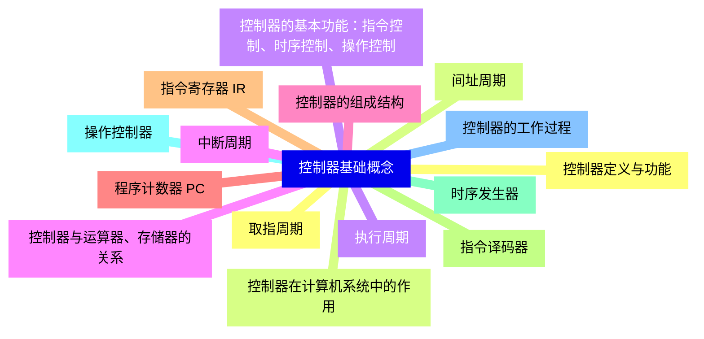
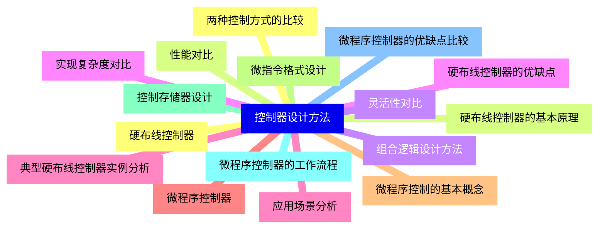
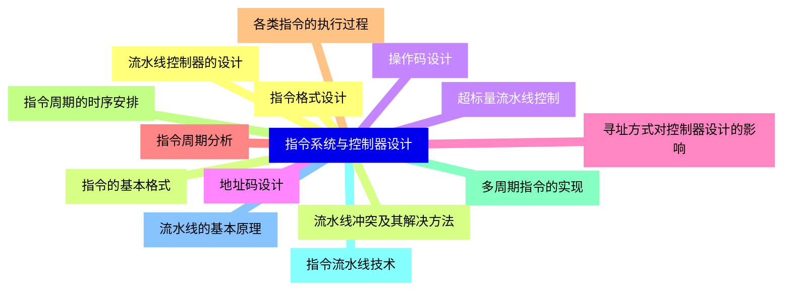
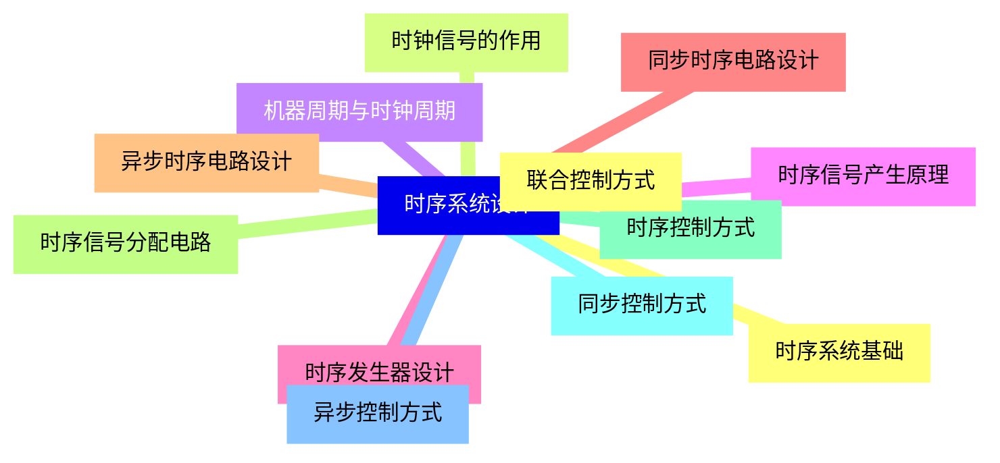
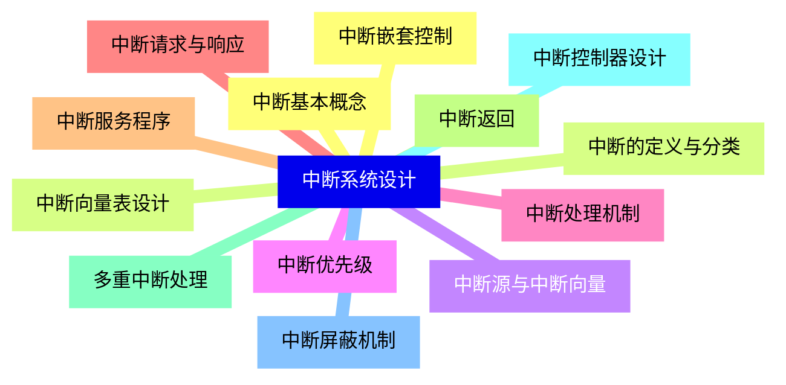
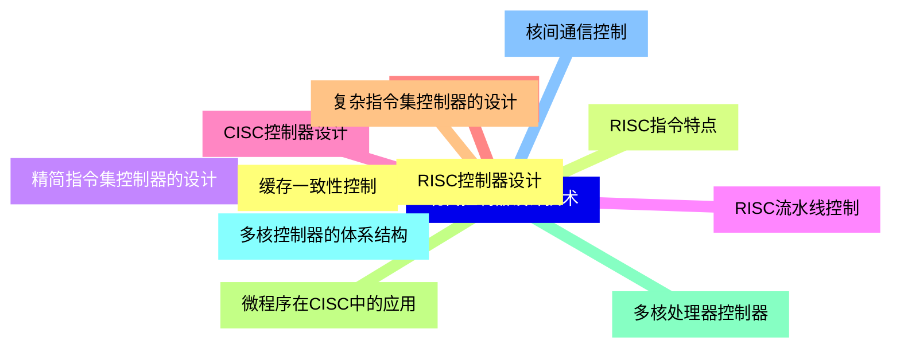
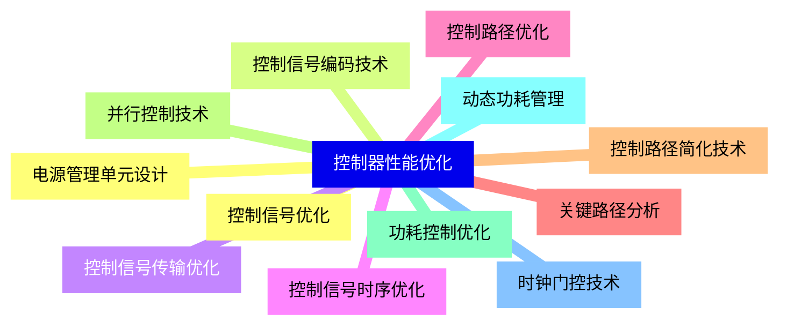
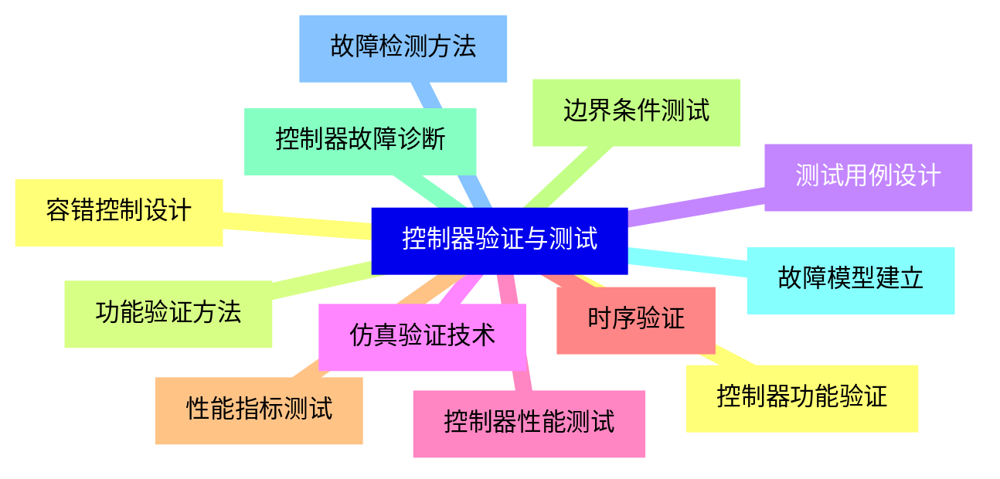
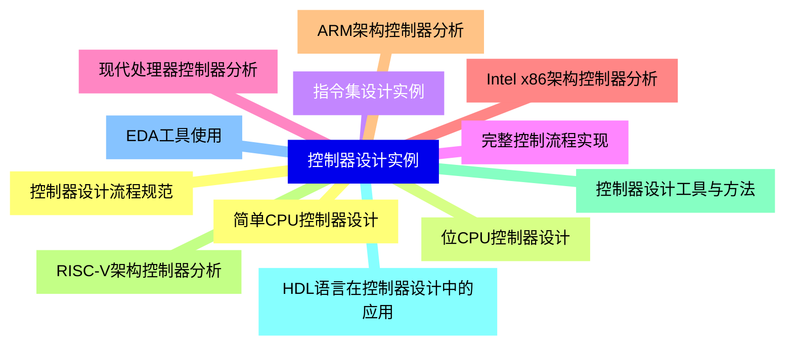


### 1 [控制器基础概念](#1)
#### 1.1 [控制器定义与功能](#1)
#### 1.2 [控制器在计算机系统中的作用](#1)
#### 1.3 [控制器的基本功能：指令控制、时序控制、操作控制](#1)
#### 1.4 [控制器与运算器、存储器的关系](#1)
#### 1.5 [控制器的组成结构](#1)
#### 1.6 [程序计数器 PC](#1)
#### 1.7 [指令寄存器 IR](#1)
#### 1.8 [指令译码器](#1)
#### 1.9 [时序发生器](#1)
#### 1.10 [操作控制器](#1)
#### 1.11 [控制器的工作过程](#1)
#### 1.12 [取指周期](#1)
#### 1.13 [间址周期](#1)
#### 1.14 [执行周期](#1)
#### 1.15 [中断周期](#1)
### 2 [控制器设计方法](#2)
#### 2.1 [硬布线控制器](#2)
#### 2.2 [硬布线控制器的基本原理](#2)
#### 2.3 [组合逻辑设计方法](#2)
#### 2.4 [硬布线控制器的优缺点](#2)
#### 2.5 [典型硬布线控制器实例分析](#2)
#### 2.6 [微程序控制器](#2)
#### 2.7 [微程序控制的基本概念](#2)
#### 2.8 [微指令格式设计](#2)
#### 2.9 [控制存储器设计](#2)
#### 2.10 [微程序控制器的工作流程](#2)
#### 2.11 [微程序控制器的优缺点比较](#2)
#### 2.12 [两种控制方式的比较](#2)
#### 2.13 [性能对比](#2)
#### 2.14 [灵活性对比](#2)
#### 2.15 [实现复杂度对比](#2)
#### 2.16 [应用场景分析](#2)
### 3 [指令系统与控制器设计](#3)
#### 3.1 [指令格式设计](#3)
#### 3.2 [指令的基本格式](#3)
#### 3.3 [操作码设计](#3)
#### 3.4 [地址码设计](#3)
#### 3.5 [寻址方式对控制器设计的影响](#3)
#### 3.6 [指令周期分析](#3)
#### 3.7 [各类指令的执行过程](#3)
#### 3.8 [指令周期的时序安排](#3)
#### 3.9 [多周期指令的实现](#3)
#### 3.10 [指令流水线技术](#3)
#### 3.11 [流水线的基本原理](#3)
#### 3.12 [流水线控制器的设计](#3)
#### 3.13 [流水线冲突及其解决方法](#3)
#### 3.14 [超标量流水线控制](#3)
### 4 [时序系统设计](#4)
#### 4.1 [时序系统基础](#4)
#### 4.2 [时钟信号的作用](#4)
#### 4.3 [机器周期与时钟周期](#4)
#### 4.4 [时序信号产生原理](#4)
#### 4.5 [时序发生器设计](#4)
#### 4.6 [同步时序电路设计](#4)
#### 4.7 [异步时序电路设计](#4)
#### 4.8 [时序信号分配电路](#4)
#### 4.9 [时序控制方式](#4)
#### 4.10 [同步控制方式](#4)
#### 4.11 [异步控制方式](#4)
#### 4.12 [联合控制方式](#4)
### 5 [中断系统设计](#5)
#### 5.1 [中断基本概念](#5)
#### 5.2 [中断的定义与分类](#5)
#### 5.3 [中断源与中断向量](#5)
#### 5.4 [中断优先级](#5)
#### 5.5 [中断处理机制](#5)
#### 5.6 [中断请求与响应](#5)
#### 5.7 [中断服务程序](#5)
#### 5.8 [中断返回](#5)
#### 5.9 [多重中断处理](#5)
#### 5.10 [中断控制器设计](#5)
#### 5.11 [中断屏蔽机制](#5)
#### 5.12 [中断嵌套控制](#5)
#### 5.13 [中断向量表设计](#5)
### 6 [现代控制器设计技术](#6)
#### 6.1 [RISC控制器设计](#6)
#### 6.2 [RISC指令特点](#6)
#### 6.3 [精简指令集控制器的设计](#6)
#### 6.4 [RISC流水线控制](#6)
#### 6.5 [CISC控制器设计](#6)
#### 6.6 [CISC指令特点](#6)
#### 6.7 [复杂指令集控制器的设计](#6)
#### 6.8 [微程序在CISC中的应用](#6)
#### 6.9 [多核处理器控制器](#6)
#### 6.10 [多核控制器的体系结构](#6)
#### 6.11 [核间通信控制](#6)
#### 6.12 [缓存一致性控制](#6)
### 7 [控制器性能优化](#7)
#### 7.1 [控制信号优化](#7)
#### 7.2 [控制信号编码技术](#7)
#### 7.3 [控制信号传输优化](#7)
#### 7.4 [控制信号时序优化](#7)
#### 7.5 [控制路径优化](#7)
#### 7.6 [关键路径分析](#7)
#### 7.7 [控制路径简化技术](#7)
#### 7.8 [并行控制技术](#7)
#### 7.9 [功耗控制优化](#7)
#### 7.10 [动态功耗管理](#7)
#### 7.11 [时钟门控技术](#7)
#### 7.12 [电源管理单元设计](#7)
### 8 [控制器验证与测试](#8)
#### 8.1 [控制器功能验证](#8)
#### 8.2 [功能验证方法](#8)
#### 8.3 [测试用例设计](#8)
#### 8.4 [仿真验证技术](#8)
#### 8.5 [控制器性能测试](#8)
#### 8.6 [时序验证](#8)
#### 8.7 [性能指标测试](#8)
#### 8.8 [边界条件测试](#8)
#### 8.9 [控制器故障诊断](#8)
#### 8.10 [故障模型建立](#8)
#### 8.11 [故障检测方法](#8)
#### 8.12 [容错控制设计](#8)
### 9 [控制器设计实例](#9)
#### 9.1 [简单CPU控制器设计](#9)
#### 9.2 [位CPU控制器设计](#9)
#### 9.3 [指令集设计实例](#9)
#### 9.4 [完整控制流程实现](#9)
#### 9.5 [现代处理器控制器分析](#9)
#### 9.6 [Intel x86架构控制器分析](#9)
#### 9.7 [ARM架构控制器分析](#9)
#### 9.8 [RISC-V架构控制器分析](#9)
#### 9.9 [控制器设计工具与方法](#9)
#### 9.10 [HDL语言在控制器设计中的应用](#9)
#### 9.11 [EDA工具使用](#9)
#### 9.12 [控制器设计流程规范](#9)




### 1 控制器基础概念

---
### 1 控制器基础概念
___
#### 1.1 控制器定义与功能
___
#### 1.2 控制器在计算机系统中的作用
___
#### 1.3 控制器的基本功能：指令控制、时序控制、操作控制
___
#### 1.4 控制器与运算器、存储器的关系
___
#### 1.5 控制器的组成结构
___
#### 1.6 程序计数器 PC
___
#### 1.7 指令寄存器 IR
___
#### 1.8 指令译码器
___
#### 1.9 时序发生器
___
#### 1.10 操作控制器
___
#### 1.11 控制器的工作过程
___
#### 1.12 取指周期
___
#### 1.13 间址周期
___
#### 1.14 执行周期
___
#### 1.15 中断周期
### 2 控制器设计方法

---
### 2 控制器设计方法
___
#### 2.1 硬布线控制器
___
#### 2.2 硬布线控制器的基本原理
___
#### 2.3 组合逻辑设计方法
___
#### 2.4 硬布线控制器的优缺点
___
#### 2.5 典型硬布线控制器实例分析
___
#### 2.6 微程序控制器
___
#### 2.7 微程序控制的基本概念
___
#### 2.8 微指令格式设计
___
#### 2.9 控制存储器设计
___
#### 2.10 微程序控制器的工作流程
___
#### 2.11 微程序控制器的优缺点比较
___
#### 2.12 两种控制方式的比较
___
#### 2.13 性能对比
___
#### 2.14 灵活性对比
___
#### 2.15 实现复杂度对比
___
#### 2.16 应用场景分析
### 3 指令系统与控制器设计

---
### 3 指令系统与控制器设计
___
#### 3.1 指令格式设计
___
#### 3.2 指令的基本格式
___
#### 3.3 操作码设计
___
#### 3.4 地址码设计
___
#### 3.5 寻址方式对控制器设计的影响
___
#### 3.6 指令周期分析
___
#### 3.7 各类指令的执行过程
___
#### 3.8 指令周期的时序安排
___
#### 3.9 多周期指令的实现
___
#### 3.10 指令流水线技术
___
#### 3.11 流水线的基本原理
___
#### 3.12 流水线控制器的设计
___
#### 3.13 流水线冲突及其解决方法
___
#### 3.14 超标量流水线控制
### 4 时序系统设计

---
### 4 时序系统设计
___
#### 4.1 时序系统基础
___
#### 4.2 时钟信号的作用
___
#### 4.3 机器周期与时钟周期
___
#### 4.4 时序信号产生原理
___
#### 4.5 时序发生器设计
___
#### 4.6 同步时序电路设计
___
#### 4.7 异步时序电路设计
___
#### 4.8 时序信号分配电路
___
#### 4.9 时序控制方式
___
#### 4.10 同步控制方式
___
#### 4.11 异步控制方式
___
#### 4.12 联合控制方式
### 5 中断系统设计

---
### 5 中断系统设计
___
#### 5.1 中断基本概念
___
#### 5.2 中断的定义与分类
___
#### 5.3 中断源与中断向量
___
#### 5.4 中断优先级
___
#### 5.5 中断处理机制
___
#### 5.6 中断请求与响应
___
#### 5.7 中断服务程序
___
#### 5.8 中断返回
___
#### 5.9 多重中断处理
___
#### 5.10 中断控制器设计
___
#### 5.11 中断屏蔽机制
___
#### 5.12 中断嵌套控制
___
#### 5.13 中断向量表设计
### 6 现代控制器设计技术

---
### 6 现代控制器设计技术
___
#### 6.1 RISC控制器设计
___
#### 6.2 RISC指令特点
___
#### 6.3 精简指令集控制器的设计
___
#### 6.4 RISC流水线控制
___
#### 6.5 CISC控制器设计
___
#### 6.6 CISC指令特点
___
#### 6.7 复杂指令集控制器的设计
___
#### 6.8 微程序在CISC中的应用
___
#### 6.9 多核处理器控制器
___
#### 6.10 多核控制器的体系结构
___
#### 6.11 核间通信控制
___
#### 6.12 缓存一致性控制
### 7 控制器性能优化

---
### 7 控制器性能优化
___
#### 7.1 控制信号优化
___
#### 7.2 控制信号编码技术
___
#### 7.3 控制信号传输优化
___
#### 7.4 控制信号时序优化
___
#### 7.5 控制路径优化
___
#### 7.6 关键路径分析
___
#### 7.7 控制路径简化技术
___
#### 7.8 并行控制技术
___
#### 7.9 功耗控制优化
___
#### 7.10 动态功耗管理
___
#### 7.11 时钟门控技术
___
#### 7.12 电源管理单元设计
### 8 控制器验证与测试

---
### 8 控制器验证与测试
___
#### 8.1 控制器功能验证
___
#### 8.2 功能验证方法
___
#### 8.3 测试用例设计
___
#### 8.4 仿真验证技术
___
#### 8.5 控制器性能测试
___
#### 8.6 时序验证
___
#### 8.7 性能指标测试
___
#### 8.8 边界条件测试
___
#### 8.9 控制器故障诊断
___
#### 8.10 故障模型建立
___
#### 8.11 故障检测方法
___
#### 8.12 容错控制设计
### 9 控制器设计实例

---
### 9 控制器设计实例
___
#### 9.1 简单CPU控制器设计
___
#### 9.2 位CPU控制器设计
___
#### 9.3 指令集设计实例
___
#### 9.4 完整控制流程实现
___
#### 9.5 现代处理器控制器分析
___
#### 9.6 Intel x86架构控制器分析
___
#### 9.7 ARM架构控制器分析
___
#### 9.8 RISC-V架构控制器分析
___
#### 9.9 控制器设计工具与方法
___
#### 9.10 HDL语言在控制器设计中的应用
___
#### 9.11 EDA工具使用
___
#### 9.12 控制器设计流程规范


### 1 控制器基础概念{#1}

{}

<--->
{}
{}
{}
{}
{}
{}
{}
{}
{}
{}
{}
{}
{}
{}
{}
{}
{}
{}
{}
{}
{}
{}
{}
{}
{}
{}
{}
{}
{}
{}
{}

### 2 控制器设计方法{#2}

{}
{}
{}
{}
{}
{}
{}
{}
{}
{}
{}
{}
{}
{}
{}
{}
{}
{}
{}
{}
{}
{}
{}
{}
{}
{}
{}
{}
{}
{}
{}
{}
{}
<--->

{}

### 3 指令系统与控制器设计{#3}

{}

<--->
{}
{}
{}
{}
{}
{}
{}
{}
{}
{}
{}
{}
{}
{}
{}
{}
{}
{}
{}
{}
{}
{}
{}
{}
{}
{}
{}
{}
{}

### 4 时序系统设计{#4}

{}
{}
{}
{}
{}
{}
{}
{}
{}
{}
{}
{}
{}
{}
{}
{}
{}
{}
{}
{}
{}
{}
{}
{}
{}
<--->

{}

### 5 中断系统设计{#5}

{}

<--->
{}
{}
{}
{}
{}
{}
{}
{}
{}
{}
{}
{}
{}
{}
{}
{}
{}
{}
{}
{}
{}
{}
{}
{}
{}
{}
{}

### 6 现代控制器设计技术{#6}

{}
{}
{}
{}
{}
{}
{}
{}
{}
{}
{}
{}
{}
{}
{}
{}
{}
{}
{}
{}
{}
{}
{}
{}
{}
<--->

{}

### 7 控制器性能优化{#7}

{}

<--->
{}
{}
{}
{}
{}
{}
{}
{}
{}
{}
{}
{}
{}
{}
{}
{}
{}
{}
{}
{}
{}
{}
{}
{}
{}

### 8 控制器验证与测试{#8}

{}
{}
{}
{}
{}
{}
{}
{}
{}
{}
{}
{}
{}
{}
{}
{}
{}
{}
{}
{}
{}
{}
{}
{}
{}
<--->

{}

### 9 控制器设计实例{#9}

{}

<--->
{}
{}
{}
{}
{}
{}
{}
{}
{}
{}
{}
{}
{}
{}
{}
{}
{}
{}
{}
{}
{}
{}
{}
{}
{}
