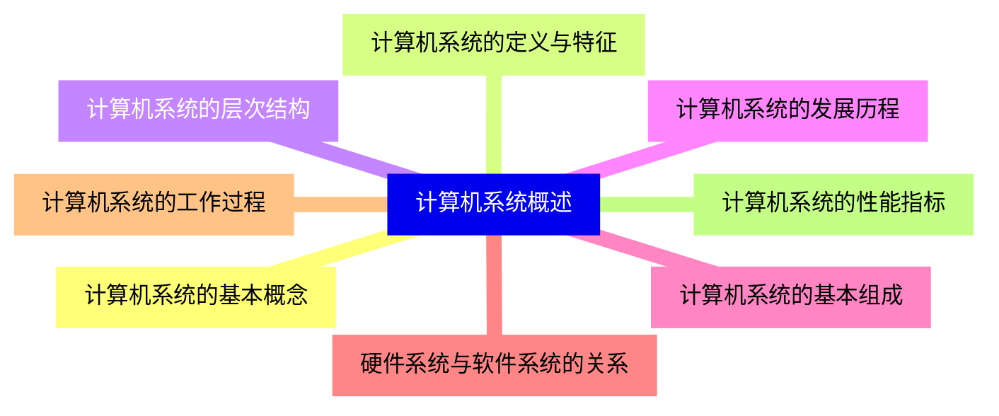
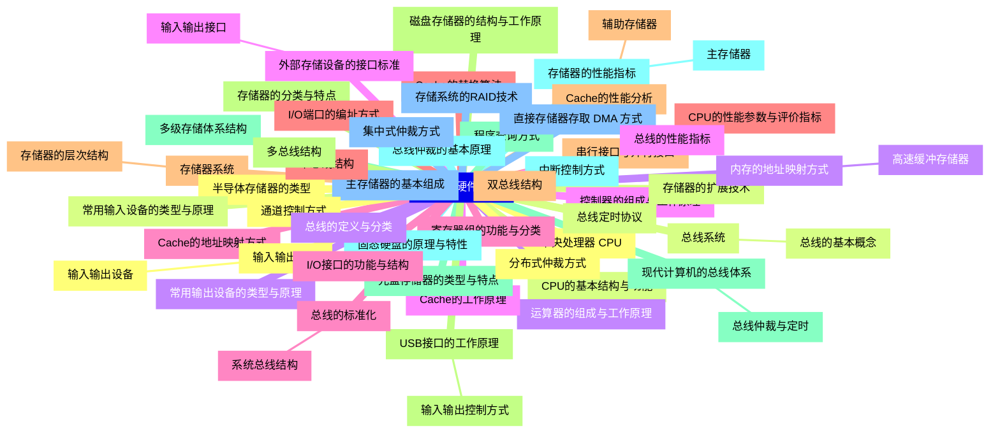
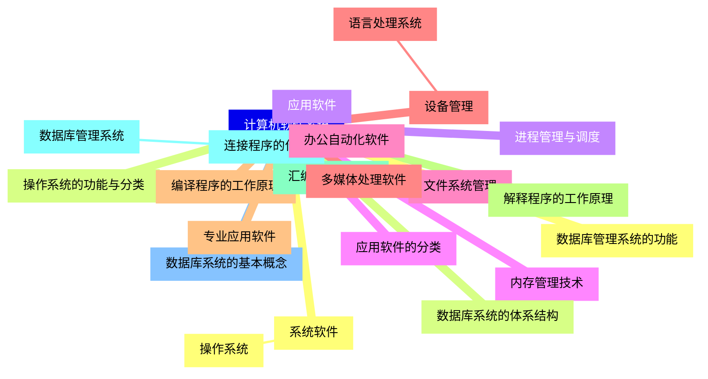
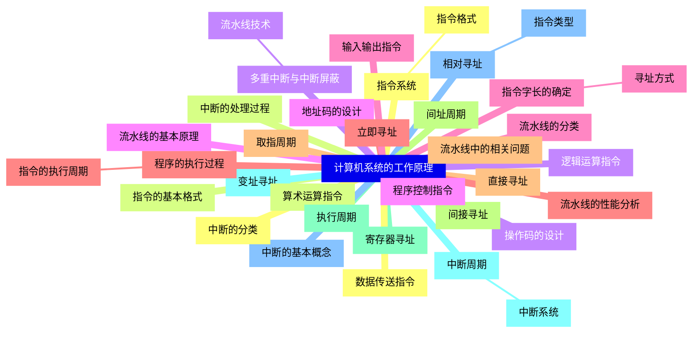
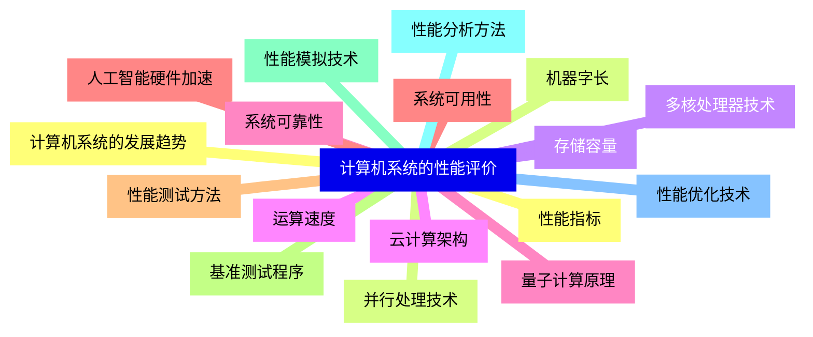


### 1 [计算机系统概述](#1)
#### 1.1 [计算机系统的基本概念](#1)
#### 1.2 [计算机系统的定义与特征](#1)
#### 1.3 [计算机系统的层次结构](#1)
#### 1.4 [计算机系统的发展历程](#1)
#### 1.5 [计算机系统的基本组成](#1)
#### 1.6 [硬件系统与软件系统的关系](#1)
#### 1.7 [计算机系统的工作过程](#1)
#### 1.8 [计算机系统的性能指标](#1)
### 2 [计算机硬件系统](#2)
#### 2.1 [中央处理器 CPU](#2)
#### 2.2 [CPU的基本结构与功能](#2)
#### 2.3 [运算器的组成与工作原理](#2)
#### 2.4 [控制器的组成与工作原理](#2)
#### 2.5 [寄存器组的功能与分类](#2)
#### 2.6 [CPU的性能参数与评价指标](#2)
#### 2.7 [存储器系统](#2)
##### 2.7.1 [存储器的层次结构](#2)
#### 2.8 [存储器的分类与特点](#2)
#### 2.9 [多级存储体系结构](#2)
#### 2.10 [存储器的性能指标](#2)
##### 2.10.1 [主存储器](#2)
#### 2.11 [主存储器的基本组成](#2)
#### 2.12 [半导体存储器的类型](#2)
#### 2.13 [存储器的扩展技术](#2)
#### 2.14 [内存的地址映射方式](#2)
##### 2.14.1 [高速缓冲存储器](#2)
#### 2.15 [Cache的工作原理](#2)
#### 2.16 [Cache的地址映射方式](#2)
#### 2.17 [Cache的替换算法](#2)
#### 2.18 [Cache的性能分析](#2)
##### 2.18.1 [辅助存储器](#2)
#### 2.19 [磁盘存储器的结构与工作原理](#2)
#### 2.20 [光盘存储器的类型与特点](#2)
#### 2.21 [固态硬盘的原理与特性](#2)
#### 2.22 [存储系统的RAID技术](#2)
#### 2.23 [输入输出系统](#2)
##### 2.23.1 [输入输出设备](#2)
#### 2.24 [常用输入设备的类型与原理](#2)
#### 2.25 [常用输出设备的类型与原理](#2)
#### 2.26 [外部存储设备的接口标准](#2)
##### 2.26.1 [输入输出接口](#2)
#### 2.27 [I/O接口的功能与结构](#2)
#### 2.28 [I/O端口的编址方式](#2)
#### 2.29 [串行接口与并行接口](#2)
#### 2.30 [USB接口的工作原理](#2)
##### 2.30.1 [输入输出控制方式](#2)
#### 2.31 [程序查询方式](#2)
#### 2.32 [中断控制方式](#2)
#### 2.33 [直接存储器存取 DMA 方式](#2)
#### 2.34 [通道控制方式](#2)
#### 2.35 [总线系统](#2)
##### 2.35.1 [总线的基本概念](#2)
#### 2.36 [总线的定义与分类](#2)
#### 2.37 [总线的性能指标](#2)
#### 2.38 [总线的标准化](#2)
##### 2.38.1 [系统总线结构](#2)
#### 2.39 [单总线结构](#2)
#### 2.40 [双总线结构](#2)
#### 2.41 [多总线结构](#2)
#### 2.42 [现代计算机的总线体系](#2)
##### 2.42.1 [总线仲裁与定时](#2)
#### 2.43 [总线仲裁的基本原理](#2)
#### 2.44 [集中式仲裁方式](#2)
#### 2.45 [分布式仲裁方式](#2)
#### 2.46 [总线定时协议](#2)
### 3 [计算机软件系统](#3)
#### 3.1 [系统软件](#3)
##### 3.1.1 [操作系统](#3)
#### 3.2 [操作系统的功能与分类](#3)
#### 3.3 [进程管理与调度](#3)
#### 3.4 [内存管理技术](#3)
#### 3.5 [文件系统管理](#3)
#### 3.6 [设备管理](#3)
##### 3.6.1 [语言处理系统](#3)
#### 3.7 [编译程序的工作原理](#3)
#### 3.8 [解释程序的工作原理](#3)
#### 3.9 [汇编程序的功能](#3)
#### 3.10 [连接程序的作用](#3)
##### 3.10.1 [数据库管理系统](#3)
#### 3.11 [数据库系统的基本概念](#3)
#### 3.12 [数据库管理系统的功能](#3)
#### 3.13 [数据库系统的体系结构](#3)
#### 3.14 [应用软件](#3)
#### 3.15 [应用软件的分类](#3)
#### 3.16 [办公自动化软件](#3)
#### 3.17 [多媒体处理软件](#3)
#### 3.18 [专业应用软件](#3)
### 4 [计算机系统的工作原理](#4)
#### 4.1 [指令系统](#4)
##### 4.1.1 [指令格式](#4)
#### 4.2 [指令的基本格式](#4)
#### 4.3 [操作码的设计](#4)
#### 4.4 [地址码的设计](#4)
#### 4.5 [指令字长的确定](#4)
##### 4.5.1 [寻址方式](#4)
#### 4.6 [立即寻址](#4)
#### 4.7 [直接寻址](#4)
#### 4.8 [间接寻址](#4)
#### 4.9 [寄存器寻址](#4)
#### 4.10 [变址寻址](#4)
#### 4.11 [相对寻址](#4)
##### 4.11.1 [指令类型](#4)
#### 4.12 [数据传送指令](#4)
#### 4.13 [算术运算指令](#4)
#### 4.14 [逻辑运算指令](#4)
#### 4.15 [程序控制指令](#4)
#### 4.16 [输入输出指令](#4)
#### 4.17 [程序的执行过程](#4)
##### 4.17.1 [指令的执行周期](#4)
#### 4.18 [取指周期](#4)
#### 4.19 [间址周期](#4)
#### 4.20 [执行周期](#4)
#### 4.21 [中断周期](#4)
##### 4.21.1 [中断系统](#4)
#### 4.22 [中断的基本概念](#4)
#### 4.23 [中断的分类](#4)
#### 4.24 [中断的处理过程](#4)
#### 4.25 [多重中断与中断屏蔽](#4)
##### 4.25.1 [流水线技术](#4)
#### 4.26 [流水线的基本原理](#4)
#### 4.27 [流水线的分类](#4)
#### 4.28 [流水线的性能分析](#4)
#### 4.29 [流水线中的相关问题](#4)
### 5 [计算机系统的性能评价](#5)
#### 5.1 [性能指标](#5)
#### 5.2 [机器字长](#5)
#### 5.3 [存储容量](#5)
#### 5.4 [运算速度](#5)
#### 5.5 [系统可靠性](#5)
#### 5.6 [系统可用性](#5)
#### 5.7 [性能测试方法](#5)
#### 5.8 [基准测试程序](#5)
#### 5.9 [性能模拟技术](#5)
#### 5.10 [性能分析方法](#5)
#### 5.11 [性能优化技术](#5)
#### 5.12 [计算机系统的发展趋势](#5)
#### 5.13 [并行处理技术](#5)
#### 5.14 [多核处理器技术](#5)
#### 5.15 [云计算架构](#5)
#### 5.16 [量子计算原理](#5)
#### 5.17 [人工智能硬件加速](#5)




### 1 计算机系统概述

---
### 1 计算机系统概述
___
#### 1.1 计算机系统的基本概念
___
#### 1.2 计算机系统的定义与特征
___
#### 1.3 计算机系统的层次结构
___
#### 1.4 计算机系统的发展历程
___
#### 1.5 计算机系统的基本组成
___
#### 1.6 硬件系统与软件系统的关系
___
#### 1.7 计算机系统的工作过程
___
#### 1.8 计算机系统的性能指标
### 2 计算机硬件系统

---
### 2 计算机硬件系统
___
#### 2.1 中央处理器 CPU
___
#### 2.2 CPU的基本结构与功能
___
#### 2.3 运算器的组成与工作原理
___
#### 2.4 控制器的组成与工作原理
___
#### 2.5 寄存器组的功能与分类
___
#### 2.6 CPU的性能参数与评价指标
___
#### 2.7 存储器系统
___
##### 2.7.1 存储器的层次结构
___
#### 2.8 存储器的分类与特点
___
#### 2.9 多级存储体系结构
___
#### 2.10 存储器的性能指标
___
##### 2.10.1 主存储器
___
#### 2.11 主存储器的基本组成
___
#### 2.12 半导体存储器的类型
___
#### 2.13 存储器的扩展技术
___
#### 2.14 内存的地址映射方式
___
##### 2.14.1 高速缓冲存储器
___
#### 2.15 Cache的工作原理
___
#### 2.16 Cache的地址映射方式
___
#### 2.17 Cache的替换算法
___
#### 2.18 Cache的性能分析
___
##### 2.18.1 辅助存储器
___
#### 2.19 磁盘存储器的结构与工作原理
___
#### 2.20 光盘存储器的类型与特点
___
#### 2.21 固态硬盘的原理与特性
___
#### 2.22 存储系统的RAID技术
___
#### 2.23 输入输出系统
___
##### 2.23.1 输入输出设备
___
#### 2.24 常用输入设备的类型与原理
___
#### 2.25 常用输出设备的类型与原理
___
#### 2.26 外部存储设备的接口标准
___
##### 2.26.1 输入输出接口
___
#### 2.27 I/O接口的功能与结构
___
#### 2.28 I/O端口的编址方式
___
#### 2.29 串行接口与并行接口
___
#### 2.30 USB接口的工作原理
___
##### 2.30.1 输入输出控制方式
___
#### 2.31 程序查询方式
___
#### 2.32 中断控制方式
___
#### 2.33 直接存储器存取 DMA 方式
___
#### 2.34 通道控制方式
___
#### 2.35 总线系统
___
##### 2.35.1 总线的基本概念
___
#### 2.36 总线的定义与分类
___
#### 2.37 总线的性能指标
___
#### 2.38 总线的标准化
___
##### 2.38.1 系统总线结构
___
#### 2.39 单总线结构
___
#### 2.40 双总线结构
___
#### 2.41 多总线结构
___
#### 2.42 现代计算机的总线体系
___
##### 2.42.1 总线仲裁与定时
___
#### 2.43 总线仲裁的基本原理
___
#### 2.44 集中式仲裁方式
___
#### 2.45 分布式仲裁方式
___
#### 2.46 总线定时协议
### 3 计算机软件系统

---
### 3 计算机软件系统
___
#### 3.1 系统软件
___
##### 3.1.1 操作系统
___
#### 3.2 操作系统的功能与分类
___
#### 3.3 进程管理与调度
___
#### 3.4 内存管理技术
___
#### 3.5 文件系统管理
___
#### 3.6 设备管理
___
##### 3.6.1 语言处理系统
___
#### 3.7 编译程序的工作原理
___
#### 3.8 解释程序的工作原理
___
#### 3.9 汇编程序的功能
___
#### 3.10 连接程序的作用
___
##### 3.10.1 数据库管理系统
___
#### 3.11 数据库系统的基本概念
___
#### 3.12 数据库管理系统的功能
___
#### 3.13 数据库系统的体系结构
___
#### 3.14 应用软件
___
#### 3.15 应用软件的分类
___
#### 3.16 办公自动化软件
___
#### 3.17 多媒体处理软件
___
#### 3.18 专业应用软件
### 4 计算机系统的工作原理

---
### 4 计算机系统的工作原理
___
#### 4.1 指令系统
___
##### 4.1.1 指令格式
___
#### 4.2 指令的基本格式
___
#### 4.3 操作码的设计
___
#### 4.4 地址码的设计
___
#### 4.5 指令字长的确定
___
##### 4.5.1 寻址方式
___
#### 4.6 立即寻址
___
#### 4.7 直接寻址
___
#### 4.8 间接寻址
___
#### 4.9 寄存器寻址
___
#### 4.10 变址寻址
___
#### 4.11 相对寻址
___
##### 4.11.1 指令类型
___
#### 4.12 数据传送指令
___
#### 4.13 算术运算指令
___
#### 4.14 逻辑运算指令
___
#### 4.15 程序控制指令
___
#### 4.16 输入输出指令
___
#### 4.17 程序的执行过程
___
##### 4.17.1 指令的执行周期
___
#### 4.18 取指周期
___
#### 4.19 间址周期
___
#### 4.20 执行周期
___
#### 4.21 中断周期
___
##### 4.21.1 中断系统
___
#### 4.22 中断的基本概念
___
#### 4.23 中断的分类
___
#### 4.24 中断的处理过程
___
#### 4.25 多重中断与中断屏蔽
___
##### 4.25.1 流水线技术
___
#### 4.26 流水线的基本原理
___
#### 4.27 流水线的分类
___
#### 4.28 流水线的性能分析
___
#### 4.29 流水线中的相关问题
### 5 计算机系统的性能评价

---
### 5 计算机系统的性能评价
___
#### 5.1 性能指标
___
#### 5.2 机器字长
___
#### 5.3 存储容量
___
#### 5.4 运算速度
___
#### 5.5 系统可靠性
___
#### 5.6 系统可用性
___
#### 5.7 性能测试方法
___
#### 5.8 基准测试程序
___
#### 5.9 性能模拟技术
___
#### 5.10 性能分析方法
___
#### 5.11 性能优化技术
___
#### 5.12 计算机系统的发展趋势
___
#### 5.13 并行处理技术
___
#### 5.14 多核处理器技术
___
#### 5.15 云计算架构
___
#### 5.16 量子计算原理
___
#### 5.17 人工智能硬件加速


### 1 计算机系统概述{#1}

{}

<--->
{}
{}
{}
{}
{}
{}
{}
{}
{}
{}
{}
{}
{}
{}
{}
{}
{}

### 2 计算机硬件系统{#2}

{}
{}
{}
{}
{}
{}
{}
{}
{}
{}
{}
{}
{}
{}
{}
{}
{}
{}
{}
{}
{}
{}
{}
{}
{}
{}
{}
{}
{}
{}
{}
{}
{}
{}
{}
{}
{}
{}
{}
{}
{}
{}
{}
{}
{}
{}
{}
{}
{}
{}
{}
{}
{}
{}
{}
{}
{}
{}
{}
{}
{}
{}
{}
{}
{}
{}
{}
{}
{}
{}
{}
{}
{}
{}
{}
{}
{}
{}
{}
{}
{}
{}
{}
{}
{}
{}
{}
{}
{}
{}
{}
{}
{}
{}
{}
{}
{}
{}
{}
{}
{}
{}
{}
{}
{}
{}
{}
{}
{}
{}
{}
{}
{}
<--->

{}

### 3 计算机软件系统{#3}

{}

<--->
{}
{}
{}
{}
{}
{}
{}
{}
{}
{}
{}
{}
{}
{}
{}
{}
{}
{}
{}
{}
{}
{}
{}
{}
{}
{}
{}
{}
{}
{}
{}
{}
{}
{}
{}
{}
{}
{}
{}
{}
{}
{}
{}

### 4 计算机系统的工作原理{#4}

{}
{}
{}
{}
{}
{}
{}
{}
{}
{}
{}
{}
{}
{}
{}
{}
{}
{}
{}
{}
{}
{}
{}
{}
{}
{}
{}
{}
{}
{}
{}
{}
{}
{}
{}
{}
{}
{}
{}
{}
{}
{}
{}
{}
{}
{}
{}
{}
{}
{}
{}
{}
{}
{}
{}
{}
{}
{}
{}
{}
{}
{}
{}
{}
{}
{}
{}
{}
{}
{}
{}
<--->

{}

### 5 计算机系统的性能评价{#5}

{}

<--->
{}
{}
{}
{}
{}
{}
{}
{}
{}
{}
{}
{}
{}
{}
{}
{}
{}
{}
{}
{}
{}
{}
{}
{}
{}
{}
{}
{}
{}
{}
{}
{}
{}
{}
{}
