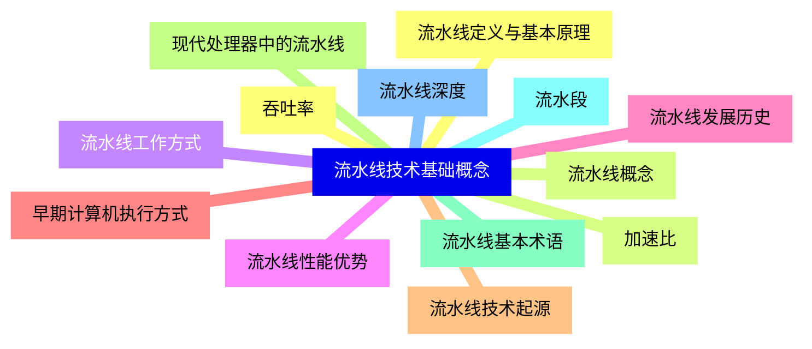
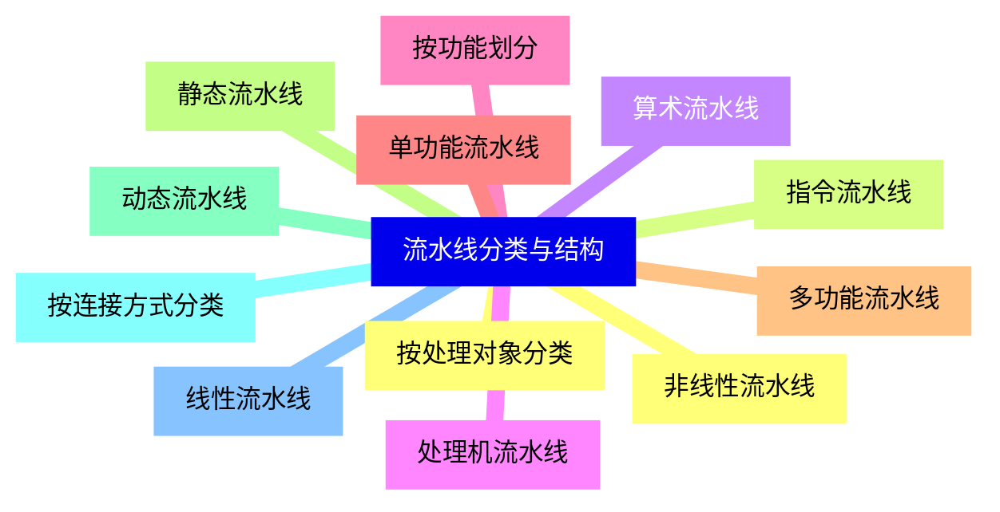
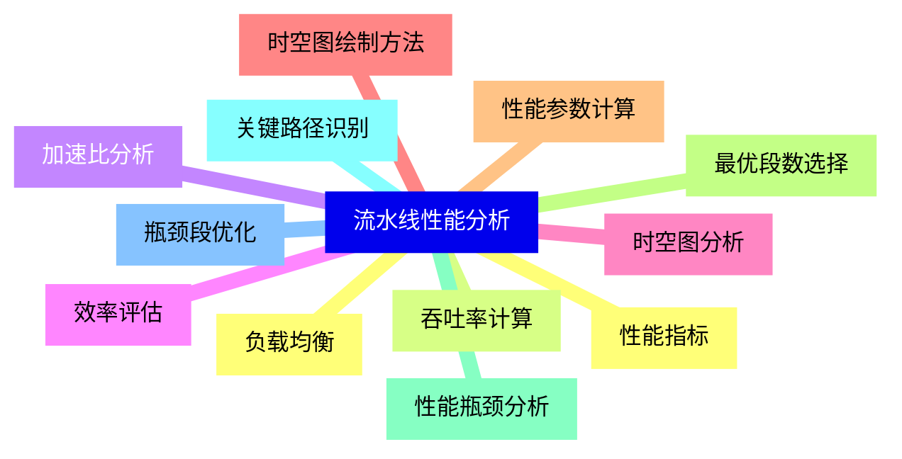
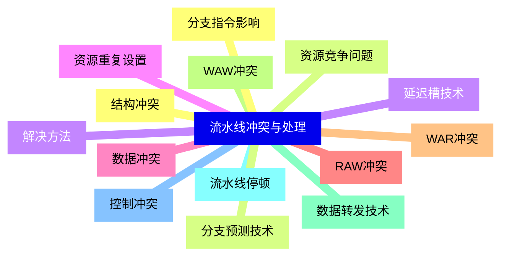
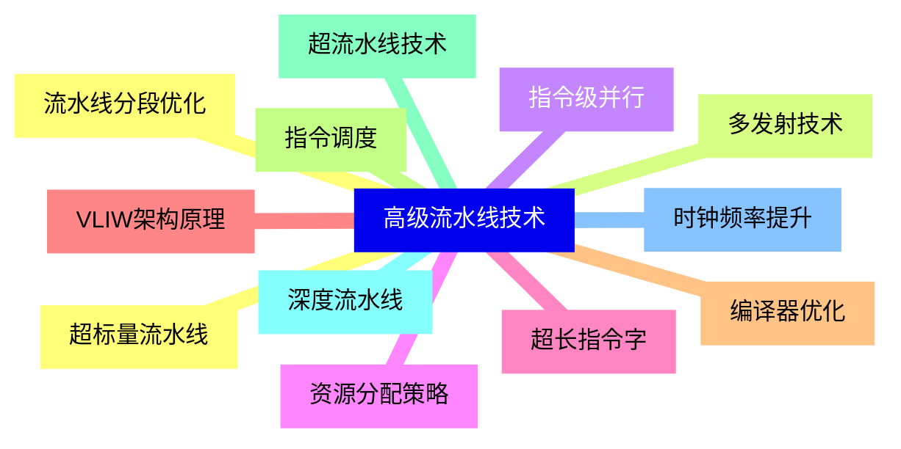
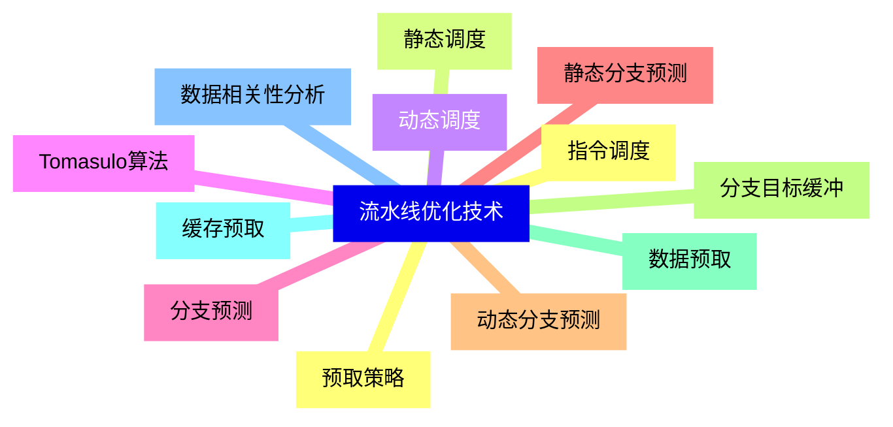
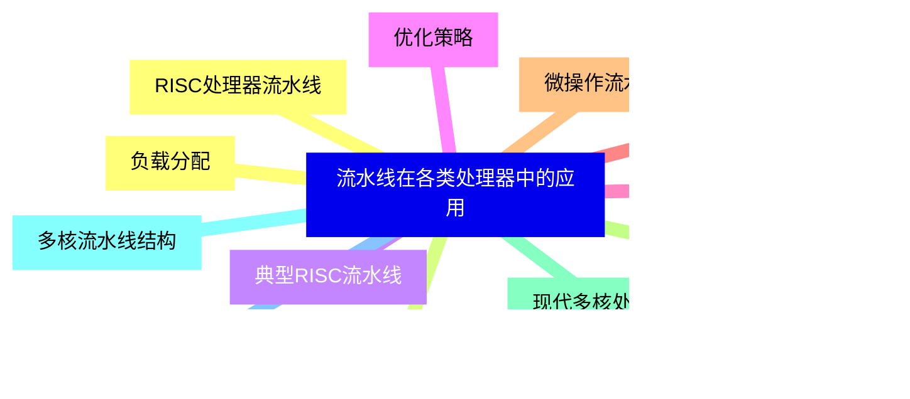
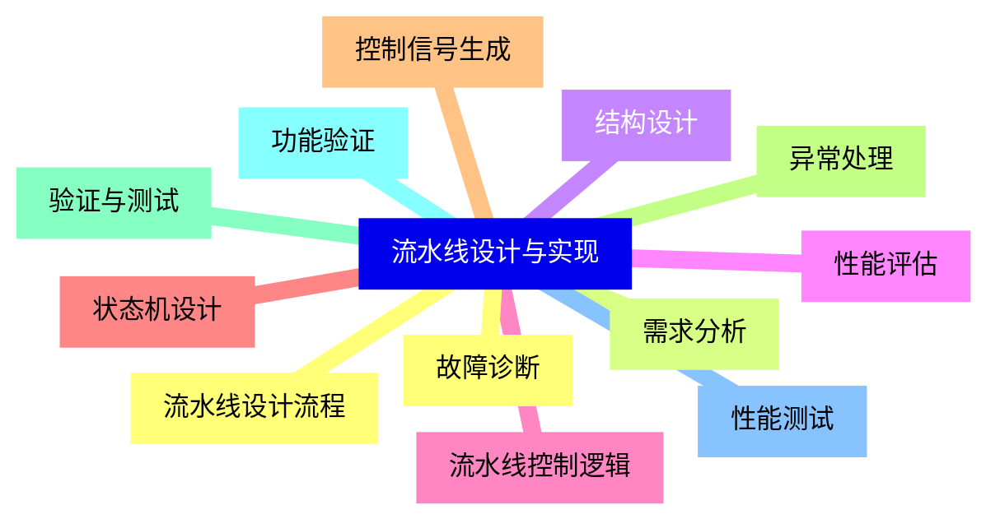
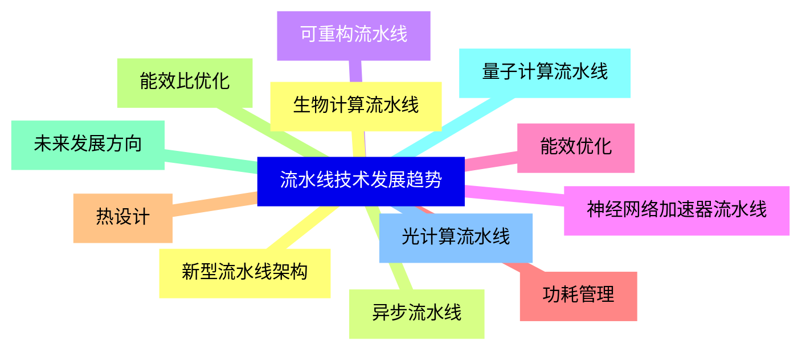


### 1 [流水线技术基础概念](#1)
#### 1.1 [流水线定义与基本原理](#1)
#### 1.2 [流水线概念](#1)
#### 1.3 [流水线工作方式](#1)
#### 1.4 [流水线性能优势](#1)
#### 1.5 [流水线发展历史](#1)
#### 1.6 [早期计算机执行方式](#1)
#### 1.7 [流水线技术起源](#1)
#### 1.8 [现代处理器中的流水线](#1)
#### 1.9 [流水线基本术语](#1)
#### 1.10 [流水段](#1)
#### 1.11 [流水线深度](#1)
#### 1.12 [吞吐率](#1)
#### 1.13 [加速比](#1)
### 2 [流水线分类与结构](#2)
#### 2.1 [按处理对象分类](#2)
#### 2.2 [指令流水线](#2)
#### 2.3 [算术流水线](#2)
#### 2.4 [处理机流水线](#2)
#### 2.5 [按功能划分](#2)
#### 2.6 [单功能流水线](#2)
#### 2.7 [多功能流水线](#2)
#### 2.8 [静态流水线](#2)
#### 2.9 [动态流水线](#2)
#### 2.10 [按连接方式分类](#2)
#### 2.11 [线性流水线](#2)
#### 2.12 [非线性流水线](#2)
### 3 [流水线性能分析](#3)
#### 3.1 [性能指标](#3)
#### 3.2 [吞吐率计算](#3)
#### 3.3 [加速比分析](#3)
#### 3.4 [效率评估](#3)
#### 3.5 [时空图分析](#3)
#### 3.6 [时空图绘制方法](#3)
#### 3.7 [性能参数计算](#3)
#### 3.8 [最优段数选择](#3)
#### 3.9 [性能瓶颈分析](#3)
#### 3.10 [关键路径识别](#3)
#### 3.11 [瓶颈段优化](#3)
#### 3.12 [负载均衡](#3)
### 4 [流水线冲突与处理](#4)
#### 4.1 [结构冲突](#4)
#### 4.2 [资源竞争问题](#4)
#### 4.3 [解决方法](#4)
#### 4.4 [资源重复设置](#4)
#### 4.5 [数据冲突](#4)
#### 4.6 [RAW冲突](#4)
#### 4.7 [WAR冲突](#4)
#### 4.8 [WAW冲突](#4)
#### 4.9 [数据转发技术](#4)
#### 4.10 [流水线停顿](#4)
#### 4.11 [控制冲突](#4)
#### 4.12 [分支指令影响](#4)
#### 4.13 [分支预测技术](#4)
#### 4.14 [延迟槽技术](#4)
### 5 [高级流水线技术](#5)
#### 5.1 [超标量流水线](#5)
#### 5.2 [多发射技术](#5)
#### 5.3 [指令级并行](#5)
#### 5.4 [资源分配策略](#5)
#### 5.5 [超长指令字](#5)
#### 5.6 [VLIW架构原理](#5)
#### 5.7 [编译器优化](#5)
#### 5.8 [指令调度](#5)
#### 5.9 [超流水线技术](#5)
#### 5.10 [深度流水线](#5)
#### 5.11 [时钟频率提升](#5)
#### 5.12 [流水线分段优化](#5)
### 6 [流水线优化技术](#6)
#### 6.1 [指令调度](#6)
#### 6.2 [静态调度](#6)
#### 6.3 [动态调度](#6)
#### 6.4 [Tomasulo算法](#6)
#### 6.5 [分支预测](#6)
#### 6.6 [静态分支预测](#6)
#### 6.7 [动态分支预测](#6)
#### 6.8 [分支目标缓冲](#6)
#### 6.9 [数据预取](#6)
#### 6.10 [缓存预取](#6)
#### 6.11 [数据相关性分析](#6)
#### 6.12 [预取策略](#6)
### 7 [流水线在各类处理器中的应用](#7)
#### 7.1 [RISC处理器流水线](#7)
#### 7.2 [RISC架构特点](#7)
#### 7.3 [典型RISC流水线](#7)
#### 7.4 [优化策略](#7)
#### 7.5 [CISC处理器流水线](#7)
#### 7.6 [CISC架构特点](#7)
#### 7.7 [微操作流水线](#7)
#### 7.8 [复杂指令处理](#7)
#### 7.9 [现代多核处理器](#7)
#### 7.10 [多核流水线结构](#7)
#### 7.11 [核间通信](#7)
#### 7.12 [负载分配](#7)
### 8 [流水线设计与实现](#8)
#### 8.1 [流水线设计流程](#8)
#### 8.2 [需求分析](#8)
#### 8.3 [结构设计](#8)
#### 8.4 [性能评估](#8)
#### 8.5 [流水线控制逻辑](#8)
#### 8.6 [状态机设计](#8)
#### 8.7 [控制信号生成](#8)
#### 8.8 [异常处理](#8)
#### 8.9 [验证与测试](#8)
#### 8.10 [功能验证](#8)
#### 8.11 [性能测试](#8)
#### 8.12 [故障诊断](#8)
### 9 [流水线技术发展趋势](#9)
#### 9.1 [新型流水线架构](#9)
#### 9.2 [异步流水线](#9)
#### 9.3 [可重构流水线](#9)
#### 9.4 [神经网络加速器流水线](#9)
#### 9.5 [能效优化](#9)
#### 9.6 [功耗管理](#9)
#### 9.7 [热设计](#9)
#### 9.8 [能效比优化](#9)
#### 9.9 [未来发展方向](#9)
#### 9.10 [量子计算流水线](#9)
#### 9.11 [光计算流水线](#9)
#### 9.12 [生物计算流水线](#9)




### 1 流水线技术基础概念

---
### 1 流水线技术基础概念
___
#### 1.1 流水线定义与基本原理
___
#### 1.2 流水线概念
___
#### 1.3 流水线工作方式
___
#### 1.4 流水线性能优势
___
#### 1.5 流水线发展历史
___
#### 1.6 早期计算机执行方式
___
#### 1.7 流水线技术起源
___
#### 1.8 现代处理器中的流水线
___
#### 1.9 流水线基本术语
___
#### 1.10 流水段
___
#### 1.11 流水线深度
___
#### 1.12 吞吐率
___
#### 1.13 加速比
### 2 流水线分类与结构

---
### 2 流水线分类与结构
___
#### 2.1 按处理对象分类
___
#### 2.2 指令流水线
___
#### 2.3 算术流水线
___
#### 2.4 处理机流水线
___
#### 2.5 按功能划分
___
#### 2.6 单功能流水线
___
#### 2.7 多功能流水线
___
#### 2.8 静态流水线
___
#### 2.9 动态流水线
___
#### 2.10 按连接方式分类
___
#### 2.11 线性流水线
___
#### 2.12 非线性流水线
### 3 流水线性能分析

---
### 3 流水线性能分析
___
#### 3.1 性能指标
___
#### 3.2 吞吐率计算
___
#### 3.3 加速比分析
___
#### 3.4 效率评估
___
#### 3.5 时空图分析
___
#### 3.6 时空图绘制方法
___
#### 3.7 性能参数计算
___
#### 3.8 最优段数选择
___
#### 3.9 性能瓶颈分析
___
#### 3.10 关键路径识别
___
#### 3.11 瓶颈段优化
___
#### 3.12 负载均衡
### 4 流水线冲突与处理

---
### 4 流水线冲突与处理
___
#### 4.1 结构冲突
___
#### 4.2 资源竞争问题
___
#### 4.3 解决方法
___
#### 4.4 资源重复设置
___
#### 4.5 数据冲突
___
#### 4.6 RAW冲突
___
#### 4.7 WAR冲突
___
#### 4.8 WAW冲突
___
#### 4.9 数据转发技术
___
#### 4.10 流水线停顿
___
#### 4.11 控制冲突
___
#### 4.12 分支指令影响
___
#### 4.13 分支预测技术
___
#### 4.14 延迟槽技术
### 5 高级流水线技术

---
### 5 高级流水线技术
___
#### 5.1 超标量流水线
___
#### 5.2 多发射技术
___
#### 5.3 指令级并行
___
#### 5.4 资源分配策略
___
#### 5.5 超长指令字
___
#### 5.6 VLIW架构原理
___
#### 5.7 编译器优化
___
#### 5.8 指令调度
___
#### 5.9 超流水线技术
___
#### 5.10 深度流水线
___
#### 5.11 时钟频率提升
___
#### 5.12 流水线分段优化
### 6 流水线优化技术

---
### 6 流水线优化技术
___
#### 6.1 指令调度
___
#### 6.2 静态调度
___
#### 6.3 动态调度
___
#### 6.4 Tomasulo算法
___
#### 6.5 分支预测
___
#### 6.6 静态分支预测
___
#### 6.7 动态分支预测
___
#### 6.8 分支目标缓冲
___
#### 6.9 数据预取
___
#### 6.10 缓存预取
___
#### 6.11 数据相关性分析
___
#### 6.12 预取策略
### 7 流水线在各类处理器中的应用

---
### 7 流水线在各类处理器中的应用
___
#### 7.1 RISC处理器流水线
___
#### 7.2 RISC架构特点
___
#### 7.3 典型RISC流水线
___
#### 7.4 优化策略
___
#### 7.5 CISC处理器流水线
___
#### 7.6 CISC架构特点
___
#### 7.7 微操作流水线
___
#### 7.8 复杂指令处理
___
#### 7.9 现代多核处理器
___
#### 7.10 多核流水线结构
___
#### 7.11 核间通信
___
#### 7.12 负载分配
### 8 流水线设计与实现

---
### 8 流水线设计与实现
___
#### 8.1 流水线设计流程
___
#### 8.2 需求分析
___
#### 8.3 结构设计
___
#### 8.4 性能评估
___
#### 8.5 流水线控制逻辑
___
#### 8.6 状态机设计
___
#### 8.7 控制信号生成
___
#### 8.8 异常处理
___
#### 8.9 验证与测试
___
#### 8.10 功能验证
___
#### 8.11 性能测试
___
#### 8.12 故障诊断
### 9 流水线技术发展趋势

---
### 9 流水线技术发展趋势
___
#### 9.1 新型流水线架构
___
#### 9.2 异步流水线
___
#### 9.3 可重构流水线
___
#### 9.4 神经网络加速器流水线
___
#### 9.5 能效优化
___
#### 9.6 功耗管理
___
#### 9.7 热设计
___
#### 9.8 能效比优化
___
#### 9.9 未来发展方向
___
#### 9.10 量子计算流水线
___
#### 9.11 光计算流水线
___
#### 9.12 生物计算流水线


### 1 流水线技术基础概念{#1}

{}

<--->
{}
{}
{}
{}
{}
{}
{}
{}
{}
{}
{}
{}
{}
{}
{}
{}
{}
{}
{}
{}
{}
{}
{}
{}
{}
{}
{}

### 2 流水线分类与结构{#2}

{}
{}
{}
{}
{}
{}
{}
{}
{}
{}
{}
{}
{}
{}
{}
{}
{}
{}
{}
{}
{}
{}
{}
{}
{}
<--->

{}

### 3 流水线性能分析{#3}

{}

<--->
{}
{}
{}
{}
{}
{}
{}
{}
{}
{}
{}
{}
{}
{}
{}
{}
{}
{}
{}
{}
{}
{}
{}
{}
{}

### 4 流水线冲突与处理{#4}

{}
{}
{}
{}
{}
{}
{}
{}
{}
{}
{}
{}
{}
{}
{}
{}
{}
{}
{}
{}
{}
{}
{}
{}
{}
{}
{}
{}
{}
<--->

{}

### 5 高级流水线技术{#5}

{}

<--->
{}
{}
{}
{}
{}
{}
{}
{}
{}
{}
{}
{}
{}
{}
{}
{}
{}
{}
{}
{}
{}
{}
{}
{}
{}

### 6 流水线优化技术{#6}

{}
{}
{}
{}
{}
{}
{}
{}
{}
{}
{}
{}
{}
{}
{}
{}
{}
{}
{}
{}
{}
{}
{}
{}
{}
<--->

{}

### 7 流水线在各类处理器中的应用{#7}

{}

<--->
{}
{}
{}
{}
{}
{}
{}
{}
{}
{}
{}
{}
{}
{}
{}
{}
{}
{}
{}
{}
{}
{}
{}
{}
{}

### 8 流水线设计与实现{#8}

{}
{}
{}
{}
{}
{}
{}
{}
{}
{}
{}
{}
{}
{}
{}
{}
{}
{}
{}
{}
{}
{}
{}
{}
{}
<--->

{}

### 9 流水线技术发展趋势{#9}

{}

<--->
{}
{}
{}
{}
{}
{}
{}
{}
{}
{}
{}
{}
{}
{}
{}
{}
{}
{}
{}
{}
{}
{}
{}
{}
{}
