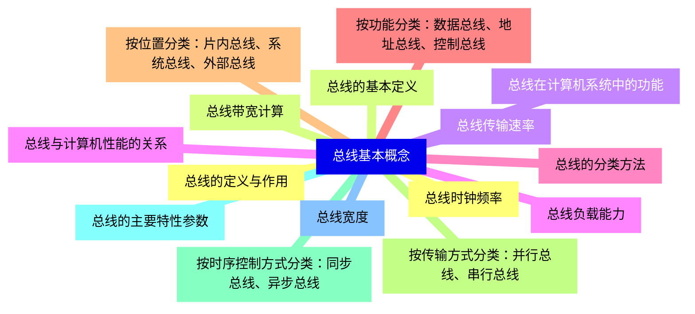
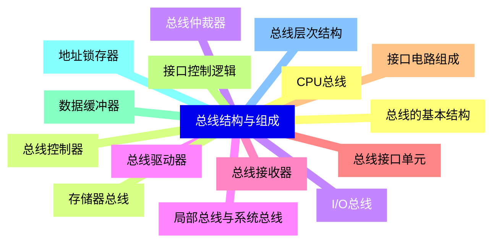
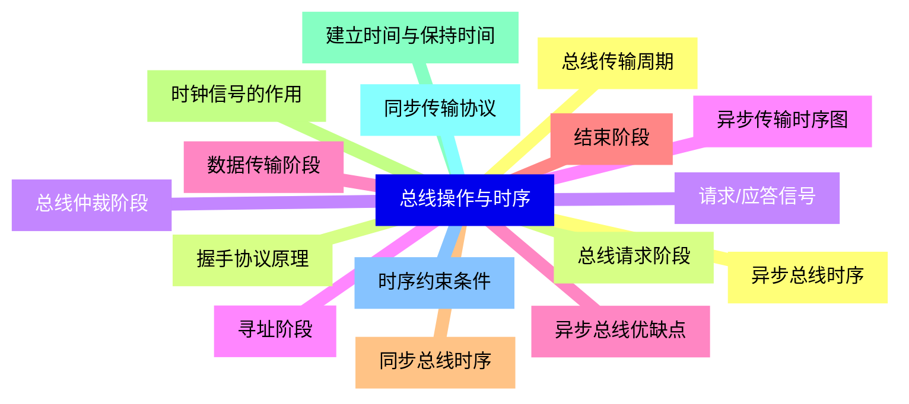
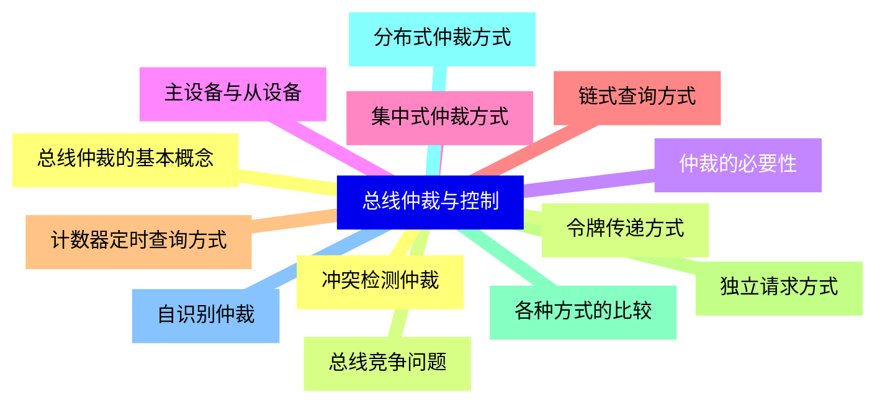
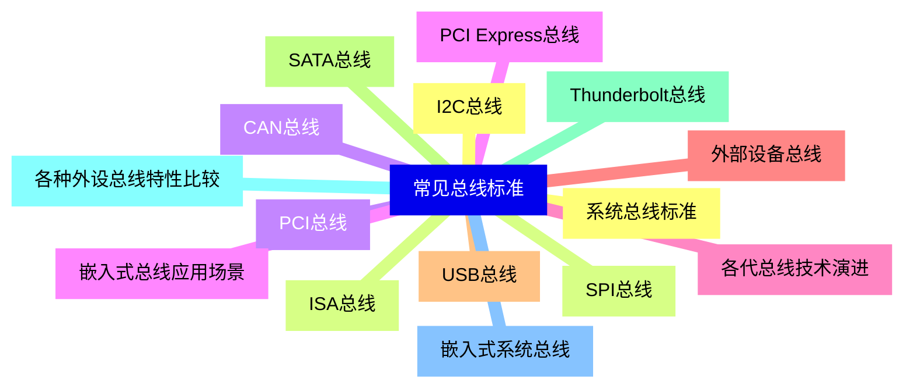
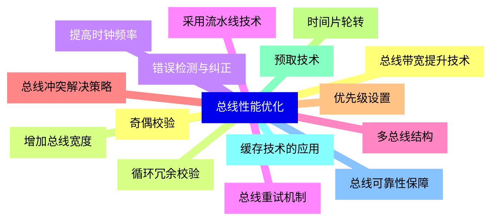
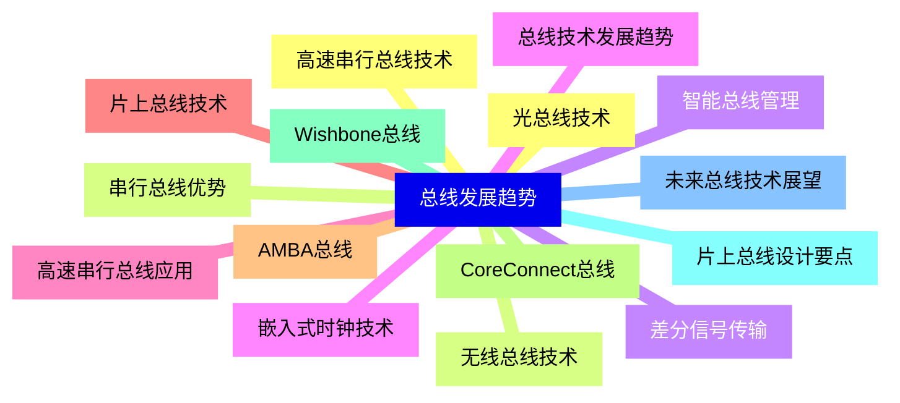


### 1 [总线基本概念](#1)
#### 1.1 [总线的定义与作用](#1)
#### 1.2 [总线的基本定义](#1)
#### 1.3 [总线在计算机系统中的功能](#1)
#### 1.4 [总线与计算机性能的关系](#1)
#### 1.5 [总线的分类方法](#1)
#### 1.6 [按功能分类：数据总线、地址总线、控制总线](#1)
#### 1.7 [按位置分类：片内总线、系统总线、外部总线](#1)
#### 1.8 [按传输方式分类：并行总线、串行总线](#1)
#### 1.9 [按时序控制方式分类：同步总线、异步总线](#1)
#### 1.10 [总线的主要特性参数](#1)
#### 1.11 [总线宽度](#1)
#### 1.12 [总线时钟频率](#1)
#### 1.13 [总线带宽计算](#1)
#### 1.14 [总线传输速率](#1)
#### 1.15 [总线负载能力](#1)
### 2 [总线结构与组成](#2)
#### 2.1 [总线的基本结构](#2)
#### 2.2 [总线控制器](#2)
#### 2.3 [总线仲裁器](#2)
#### 2.4 [总线驱动器](#2)
#### 2.5 [总线接收器](#2)
#### 2.6 [总线接口单元](#2)
#### 2.7 [接口电路组成](#2)
#### 2.8 [接口控制逻辑](#2)
#### 2.9 [数据缓冲器](#2)
#### 2.10 [地址锁存器](#2)
#### 2.11 [总线层次结构](#2)
#### 2.12 [CPU总线](#2)
#### 2.13 [存储器总线](#2)
#### 2.14 [I/O总线](#2)
#### 2.15 [局部总线与系统总线](#2)
### 3 [总线操作与时序](#3)
#### 3.1 [总线传输周期](#3)
#### 3.2 [总线请求阶段](#3)
#### 3.3 [总线仲裁阶段](#3)
#### 3.4 [寻址阶段](#3)
#### 3.5 [数据传输阶段](#3)
#### 3.6 [结束阶段](#3)
#### 3.7 [同步总线时序](#3)
#### 3.8 [时钟信号的作用](#3)
#### 3.9 [建立时间与保持时间](#3)
#### 3.10 [同步传输协议](#3)
#### 3.11 [时序约束条件](#3)
#### 3.12 [异步总线时序](#3)
#### 3.13 [握手协议原理](#3)
#### 3.14 [请求/应答信号](#3)
#### 3.15 [异步传输时序图](#3)
#### 3.16 [异步总线优缺点](#3)
### 4 [总线仲裁与控制](#4)
#### 4.1 [总线仲裁的基本概念](#4)
#### 4.2 [总线竞争问题](#4)
#### 4.3 [仲裁的必要性](#4)
#### 4.4 [主设备与从设备](#4)
#### 4.5 [集中式仲裁方式](#4)
#### 4.6 [链式查询方式](#4)
#### 4.7 [计数器定时查询方式](#4)
#### 4.8 [独立请求方式](#4)
#### 4.9 [各种方式的比较](#4)
#### 4.10 [分布式仲裁方式](#4)
#### 4.11 [自识别仲裁](#4)
#### 4.12 [冲突检测仲裁](#4)
#### 4.13 [令牌传递方式](#4)
### 5 [常见总线标准](#5)
#### 5.1 [系统总线标准](#5)
#### 5.2 [ISA总线](#5)
#### 5.3 [PCI总线](#5)
#### 5.4 [PCI Express总线](#5)
#### 5.5 [各代总线技术演进](#5)
#### 5.6 [外部设备总线](#5)
#### 5.7 [USB总线](#5)
#### 5.8 [SATA总线](#5)
#### 5.9 [Thunderbolt总线](#5)
#### 5.10 [各种外设总线特性比较](#5)
#### 5.11 [嵌入式系统总线](#5)
#### 5.12 [I2C总线](#5)
#### 5.13 [SPI总线](#5)
#### 5.14 [CAN总线](#5)
#### 5.15 [嵌入式总线应用场景](#5)
### 6 [总线性能优化](#6)
#### 6.1 [总线带宽提升技术](#6)
#### 6.2 [增加总线宽度](#6)
#### 6.3 [提高时钟频率](#6)
#### 6.4 [采用流水线技术](#6)
#### 6.5 [多总线结构](#6)
#### 6.6 [总线冲突解决策略](#6)
#### 6.7 [优先级设置](#6)
#### 6.8 [时间片轮转](#6)
#### 6.9 [预取技术](#6)
#### 6.10 [缓存技术的应用](#6)
#### 6.11 [总线可靠性保障](#6)
#### 6.12 [奇偶校验](#6)
#### 6.13 [循环冗余校验](#6)
#### 6.14 [错误检测与纠正](#6)
#### 6.15 [总线重试机制](#6)
### 7 [总线发展趋势](#7)
#### 7.1 [高速串行总线技术](#7)
#### 7.2 [串行总线优势](#7)
#### 7.3 [差分信号传输](#7)
#### 7.4 [嵌入式时钟技术](#7)
#### 7.5 [高速串行总线应用](#7)
#### 7.6 [片上总线技术](#7)
#### 7.7 [AMBA总线](#7)
#### 7.8 [CoreConnect总线](#7)
#### 7.9 [Wishbone总线](#7)
#### 7.10 [片上总线设计要点](#7)
#### 7.11 [未来总线技术展望](#7)
#### 7.12 [光总线技术](#7)
#### 7.13 [无线总线技术](#7)
#### 7.14 [智能总线管理](#7)
#### 7.15 [总线技术发展趋势](#7)




### 1 总线基本概念

---
### 1 总线基本概念
___
#### 1.1 总线的定义与作用
___
#### 1.2 总线的基本定义
___
#### 1.3 总线在计算机系统中的功能
___
#### 1.4 总线与计算机性能的关系
___
#### 1.5 总线的分类方法
___
#### 1.6 按功能分类：数据总线、地址总线、控制总线
___
#### 1.7 按位置分类：片内总线、系统总线、外部总线
___
#### 1.8 按传输方式分类：并行总线、串行总线
___
#### 1.9 按时序控制方式分类：同步总线、异步总线
___
#### 1.10 总线的主要特性参数
___
#### 1.11 总线宽度
___
#### 1.12 总线时钟频率
___
#### 1.13 总线带宽计算
___
#### 1.14 总线传输速率
___
#### 1.15 总线负载能力
### 2 总线结构与组成

---
### 2 总线结构与组成
___
#### 2.1 总线的基本结构
___
#### 2.2 总线控制器
___
#### 2.3 总线仲裁器
___
#### 2.4 总线驱动器
___
#### 2.5 总线接收器
___
#### 2.6 总线接口单元
___
#### 2.7 接口电路组成
___
#### 2.8 接口控制逻辑
___
#### 2.9 数据缓冲器
___
#### 2.10 地址锁存器
___
#### 2.11 总线层次结构
___
#### 2.12 CPU总线
___
#### 2.13 存储器总线
___
#### 2.14 I/O总线
___
#### 2.15 局部总线与系统总线
### 3 总线操作与时序

---
### 3 总线操作与时序
___
#### 3.1 总线传输周期
___
#### 3.2 总线请求阶段
___
#### 3.3 总线仲裁阶段
___
#### 3.4 寻址阶段
___
#### 3.5 数据传输阶段
___
#### 3.6 结束阶段
___
#### 3.7 同步总线时序
___
#### 3.8 时钟信号的作用
___
#### 3.9 建立时间与保持时间
___
#### 3.10 同步传输协议
___
#### 3.11 时序约束条件
___
#### 3.12 异步总线时序
___
#### 3.13 握手协议原理
___
#### 3.14 请求/应答信号
___
#### 3.15 异步传输时序图
___
#### 3.16 异步总线优缺点
### 4 总线仲裁与控制

---
### 4 总线仲裁与控制
___
#### 4.1 总线仲裁的基本概念
___
#### 4.2 总线竞争问题
___
#### 4.3 仲裁的必要性
___
#### 4.4 主设备与从设备
___
#### 4.5 集中式仲裁方式
___
#### 4.6 链式查询方式
___
#### 4.7 计数器定时查询方式
___
#### 4.8 独立请求方式
___
#### 4.9 各种方式的比较
___
#### 4.10 分布式仲裁方式
___
#### 4.11 自识别仲裁
___
#### 4.12 冲突检测仲裁
___
#### 4.13 令牌传递方式
### 5 常见总线标准

---
### 5 常见总线标准
___
#### 5.1 系统总线标准
___
#### 5.2 ISA总线
___
#### 5.3 PCI总线
___
#### 5.4 PCI Express总线
___
#### 5.5 各代总线技术演进
___
#### 5.6 外部设备总线
___
#### 5.7 USB总线
___
#### 5.8 SATA总线
___
#### 5.9 Thunderbolt总线
___
#### 5.10 各种外设总线特性比较
___
#### 5.11 嵌入式系统总线
___
#### 5.12 I2C总线
___
#### 5.13 SPI总线
___
#### 5.14 CAN总线
___
#### 5.15 嵌入式总线应用场景
### 6 总线性能优化

---
### 6 总线性能优化
___
#### 6.1 总线带宽提升技术
___
#### 6.2 增加总线宽度
___
#### 6.3 提高时钟频率
___
#### 6.4 采用流水线技术
___
#### 6.5 多总线结构
___
#### 6.6 总线冲突解决策略
___
#### 6.7 优先级设置
___
#### 6.8 时间片轮转
___
#### 6.9 预取技术
___
#### 6.10 缓存技术的应用
___
#### 6.11 总线可靠性保障
___
#### 6.12 奇偶校验
___
#### 6.13 循环冗余校验
___
#### 6.14 错误检测与纠正
___
#### 6.15 总线重试机制
### 7 总线发展趋势

---
### 7 总线发展趋势
___
#### 7.1 高速串行总线技术
___
#### 7.2 串行总线优势
___
#### 7.3 差分信号传输
___
#### 7.4 嵌入式时钟技术
___
#### 7.5 高速串行总线应用
___
#### 7.6 片上总线技术
___
#### 7.7 AMBA总线
___
#### 7.8 CoreConnect总线
___
#### 7.9 Wishbone总线
___
#### 7.10 片上总线设计要点
___
#### 7.11 未来总线技术展望
___
#### 7.12 光总线技术
___
#### 7.13 无线总线技术
___
#### 7.14 智能总线管理
___
#### 7.15 总线技术发展趋势


### 1 总线基本概念{#1}

{}

<--->
{}
{}
{}
{}
{}
{}
{}
{}
{}
{}
{}
{}
{}
{}
{}
{}
{}
{}
{}
{}
{}
{}
{}
{}
{}
{}
{}
{}
{}
{}
{}

### 2 总线结构与组成{#2}

{}
{}
{}
{}
{}
{}
{}
{}
{}
{}
{}
{}
{}
{}
{}
{}
{}
{}
{}
{}
{}
{}
{}
{}
{}
{}
{}
{}
{}
{}
{}
<--->

{}

### 3 总线操作与时序{#3}

{}

<--->
{}
{}
{}
{}
{}
{}
{}
{}
{}
{}
{}
{}
{}
{}
{}
{}
{}
{}
{}
{}
{}
{}
{}
{}
{}
{}
{}
{}
{}
{}
{}
{}
{}

### 4 总线仲裁与控制{#4}

{}
{}
{}
{}
{}
{}
{}
{}
{}
{}
{}
{}
{}
{}
{}
{}
{}
{}
{}
{}
{}
{}
{}
{}
{}
{}
{}
<--->

{}

### 5 常见总线标准{#5}

{}

<--->
{}
{}
{}
{}
{}
{}
{}
{}
{}
{}
{}
{}
{}
{}
{}
{}
{}
{}
{}
{}
{}
{}
{}
{}
{}
{}
{}
{}
{}
{}
{}

### 6 总线性能优化{#6}

{}
{}
{}
{}
{}
{}
{}
{}
{}
{}
{}
{}
{}
{}
{}
{}
{}
{}
{}
{}
{}
{}
{}
{}
{}
{}
{}
{}
{}
{}
{}
<--->

{}

### 7 总线发展趋势{#7}

{}

<--->
{}
{}
{}
{}
{}
{}
{}
{}
{}
{}
{}
{}
{}
{}
{}
{}
{}
{}
{}
{}
{}
{}
{}
{}
{}
{}
{}
{}
{}
{}
{}
