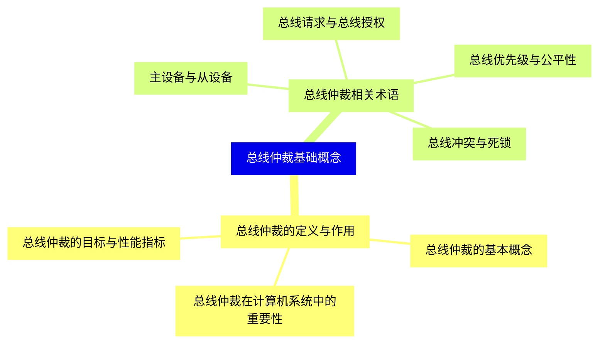
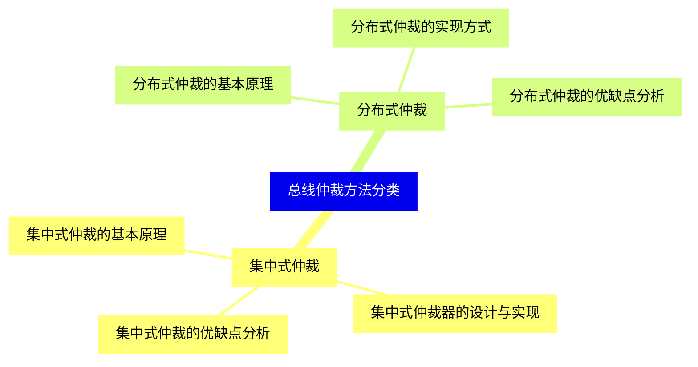
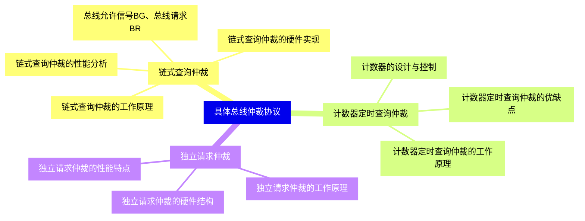
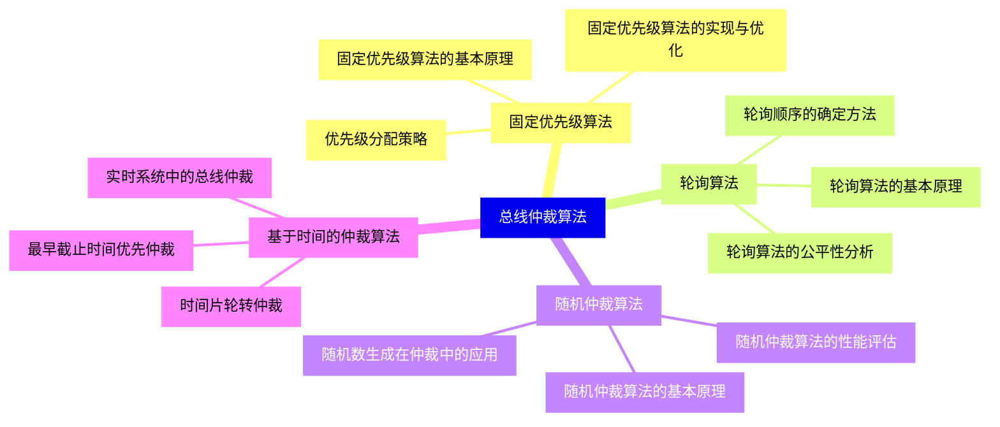
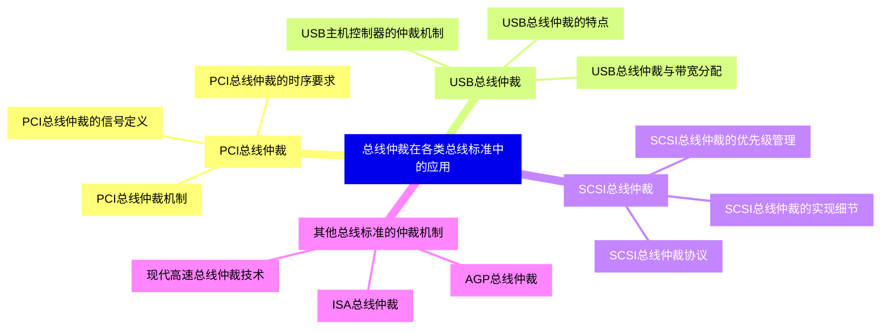
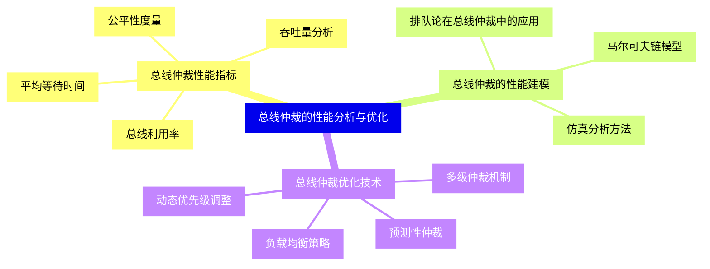
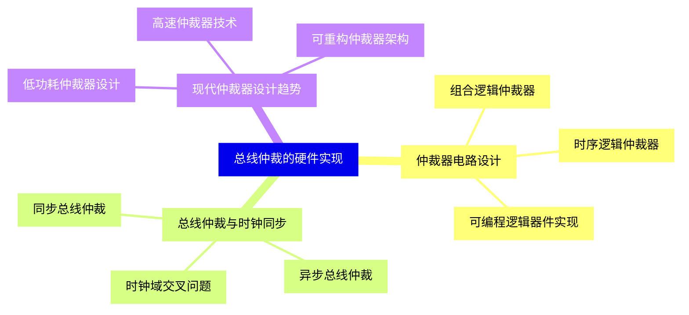
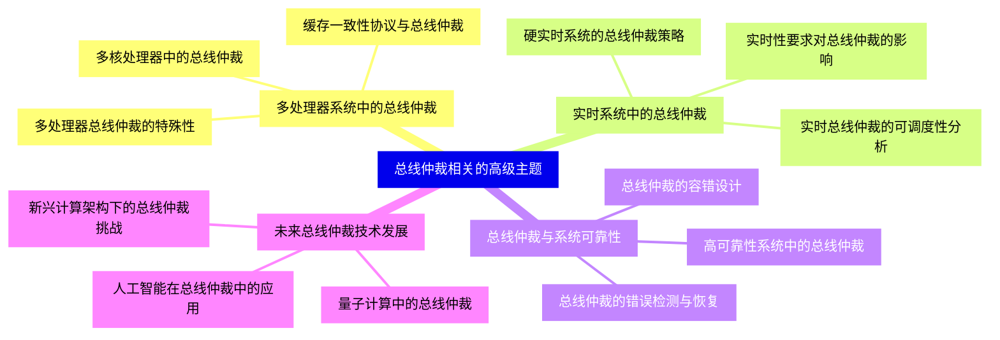


### 1 [总线仲裁基础概念](#1)
#### 1.1 [总线仲裁的定义与作用](#1)
##### 1.1.1 [总线仲裁的基本概念](#1)
##### 1.1.2 [总线仲裁在计算机系统中的重要性](#1)
##### 1.1.3 [总线仲裁的目标与性能指标](#1)
#### 1.2 [总线仲裁相关术语](#1)
##### 1.2.1 [主设备与从设备](#1)
##### 1.2.2 [总线请求与总线授权](#1)
##### 1.2.3 [总线优先级与公平性](#1)
##### 1.2.4 [总线冲突与死锁](#1)
### 2 [总线仲裁方法分类](#2)
#### 2.1 [集中式仲裁](#2)
##### 2.1.1 [集中式仲裁的基本原理](#2)
##### 2.1.2 [集中式仲裁器的设计与实现](#2)
##### 2.1.3 [集中式仲裁的优缺点分析](#2)
#### 2.2 [分布式仲裁](#2)
##### 2.2.1 [分布式仲裁的基本原理](#2)
##### 2.2.2 [分布式仲裁的实现方式](#2)
##### 2.2.3 [分布式仲裁的优缺点分析](#2)
### 3 [具体总线仲裁协议](#3)
#### 3.1 [链式查询仲裁](#3)
##### 3.1.1 [链式查询仲裁的工作原理](#3)
##### 3.1.2 [总线允许信号BG、总线请求BR](#3)
##### 3.1.3 [链式查询仲裁的硬件实现](#3)
##### 3.1.4 [链式查询仲裁的性能分析](#3)
#### 3.2 [计数器定时查询仲裁](#3)
##### 3.2.1 [计数器定时查询仲裁的工作原理](#3)
##### 3.2.2 [计数器的设计与控制](#3)
##### 3.2.3 [计数器定时查询仲裁的优缺点](#3)
#### 3.3 [独立请求仲裁](#3)
##### 3.3.1 [独立请求仲裁的工作原理](#3)
##### 3.3.2 [独立请求仲裁的硬件结构](#3)
##### 3.3.3 [独立请求仲裁的性能特点](#3)
### 4 [总线仲裁算法](#4)
#### 4.1 [固定优先级算法](#4)
##### 4.1.1 [固定优先级算法的基本原理](#4)
##### 4.1.2 [优先级分配策略](#4)
##### 4.1.3 [固定优先级算法的实现与优化](#4)
#### 4.2 [轮询算法](#4)
##### 4.2.1 [轮询算法的基本原理](#4)
##### 4.2.2 [轮询顺序的确定方法](#4)
##### 4.2.3 [轮询算法的公平性分析](#4)
#### 4.3 [随机仲裁算法](#4)
##### 4.3.1 [随机仲裁算法的基本原理](#4)
##### 4.3.2 [随机数生成在仲裁中的应用](#4)
##### 4.3.3 [随机仲裁算法的性能评估](#4)
#### 4.4 [基于时间的仲裁算法](#4)
##### 4.4.1 [时间片轮转仲裁](#4)
##### 4.4.2 [最早截止时间优先仲裁](#4)
##### 4.4.3 [实时系统中的总线仲裁](#4)
### 5 [总线仲裁在各类总线标准中的应用](#5)
#### 5.1 [PCI总线仲裁](#5)
##### 5.1.1 [PCI总线仲裁机制](#5)
##### 5.1.2 [PCI总线仲裁的信号定义](#5)
##### 5.1.3 [PCI总线仲裁的时序要求](#5)
#### 5.2 [USB总线仲裁](#5)
##### 5.2.1 [USB总线仲裁的特点](#5)
##### 5.2.2 [USB主机控制器的仲裁机制](#5)
##### 5.2.3 [USB总线仲裁与带宽分配](#5)
#### 5.3 [SCSI总线仲裁](#5)
##### 5.3.1 [SCSI总线仲裁协议](#5)
##### 5.3.2 [SCSI总线仲裁的优先级管理](#5)
##### 5.3.3 [SCSI总线仲裁的实现细节](#5)
#### 5.4 [其他总线标准的仲裁机制](#5)
##### 5.4.1 [ISA总线仲裁](#5)
##### 5.4.2 [AGP总线仲裁](#5)
##### 5.4.3 [现代高速总线仲裁技术](#5)
### 6 [总线仲裁的性能分析与优化](#6)
#### 6.1 [总线仲裁性能指标](#6)
##### 6.1.1 [总线利用率](#6)
##### 6.1.2 [平均等待时间](#6)
##### 6.1.3 [吞吐量分析](#6)
##### 6.1.4 [公平性度量](#6)
#### 6.2 [总线仲裁的性能建模](#6)
##### 6.2.1 [排队论在总线仲裁中的应用](#6)
##### 6.2.2 [马尔可夫链模型](#6)
##### 6.2.3 [仿真分析方法](#6)
#### 6.3 [总线仲裁优化技术](#6)
##### 6.3.1 [动态优先级调整](#6)
##### 6.3.2 [预测性仲裁](#6)
##### 6.3.3 [多级仲裁机制](#6)
##### 6.3.4 [负载均衡策略](#6)
### 7 [总线仲裁的硬件实现](#7)
#### 7.1 [仲裁器电路设计](#7)
##### 7.1.1 [组合逻辑仲裁器](#7)
##### 7.1.2 [时序逻辑仲裁器](#7)
##### 7.1.3 [可编程逻辑器件实现](#7)
#### 7.2 [总线仲裁与时钟同步](#7)
##### 7.2.1 [同步总线仲裁](#7)
##### 7.2.2 [异步总线仲裁](#7)
##### 7.2.3 [时钟域交叉问题](#7)
#### 7.3 [现代仲裁器设计趋势](#7)
##### 7.3.1 [低功耗仲裁器设计](#7)
##### 7.3.2 [高速仲裁器技术](#7)
##### 7.3.3 [可重构仲裁器架构](#7)
### 8 [总线仲裁相关的高级主题](#8)
#### 8.1 [多处理器系统中的总线仲裁](#8)
##### 8.1.1 [多处理器总线仲裁的特殊性](#8)
##### 8.1.2 [缓存一致性协议与总线仲裁](#8)
##### 8.1.3 [多核处理器中的总线仲裁](#8)
#### 8.2 [实时系统中的总线仲裁](#8)
##### 8.2.1 [实时性要求对总线仲裁的影响](#8)
##### 8.2.2 [硬实时系统的总线仲裁策略](#8)
##### 8.2.3 [实时总线仲裁的可调度性分析](#8)
#### 8.3 [总线仲裁与系统可靠性](#8)
##### 8.3.1 [总线仲裁的容错设计](#8)
##### 8.3.2 [总线仲裁的错误检测与恢复](#8)
##### 8.3.3 [高可靠性系统中的总线仲裁](#8)
#### 8.4 [未来总线仲裁技术发展](#8)
##### 8.4.1 [人工智能在总线仲裁中的应用](#8)
##### 8.4.2 [量子计算中的总线仲裁](#8)
##### 8.4.3 [新兴计算架构下的总线仲裁挑战](#8)




### 1 总线仲裁基础概念

---
### 1 总线仲裁基础概念
___
#### 1.1 总线仲裁的定义与作用
___
##### 1.1.1 总线仲裁的基本概念
___
##### 1.1.2 总线仲裁在计算机系统中的重要性
___
##### 1.1.3 总线仲裁的目标与性能指标
___
#### 1.2 总线仲裁相关术语
___
##### 1.2.1 主设备与从设备
___
##### 1.2.2 总线请求与总线授权
___
##### 1.2.3 总线优先级与公平性
___
##### 1.2.4 总线冲突与死锁
### 2 总线仲裁方法分类

---
### 2 总线仲裁方法分类
___
#### 2.1 集中式仲裁
___
##### 2.1.1 集中式仲裁的基本原理
___
##### 2.1.2 集中式仲裁器的设计与实现
___
##### 2.1.3 集中式仲裁的优缺点分析
___
#### 2.2 分布式仲裁
___
##### 2.2.1 分布式仲裁的基本原理
___
##### 2.2.2 分布式仲裁的实现方式
___
##### 2.2.3 分布式仲裁的优缺点分析
### 3 具体总线仲裁协议

---
### 3 具体总线仲裁协议
___
#### 3.1 链式查询仲裁
___
##### 3.1.1 链式查询仲裁的工作原理
___
##### 3.1.2 总线允许信号BG、总线请求BR
___
##### 3.1.3 链式查询仲裁的硬件实现
___
##### 3.1.4 链式查询仲裁的性能分析
___
#### 3.2 计数器定时查询仲裁
___
##### 3.2.1 计数器定时查询仲裁的工作原理
___
##### 3.2.2 计数器的设计与控制
___
##### 3.2.3 计数器定时查询仲裁的优缺点
___
#### 3.3 独立请求仲裁
___
##### 3.3.1 独立请求仲裁的工作原理
___
##### 3.3.2 独立请求仲裁的硬件结构
___
##### 3.3.3 独立请求仲裁的性能特点
### 4 总线仲裁算法

---
### 4 总线仲裁算法
___
#### 4.1 固定优先级算法
___
##### 4.1.1 固定优先级算法的基本原理
___
##### 4.1.2 优先级分配策略
___
##### 4.1.3 固定优先级算法的实现与优化
___
#### 4.2 轮询算法
___
##### 4.2.1 轮询算法的基本原理
___
##### 4.2.2 轮询顺序的确定方法
___
##### 4.2.3 轮询算法的公平性分析
___
#### 4.3 随机仲裁算法
___
##### 4.3.1 随机仲裁算法的基本原理
___
##### 4.3.2 随机数生成在仲裁中的应用
___
##### 4.3.3 随机仲裁算法的性能评估
___
#### 4.4 基于时间的仲裁算法
___
##### 4.4.1 时间片轮转仲裁
___
##### 4.4.2 最早截止时间优先仲裁
___
##### 4.4.3 实时系统中的总线仲裁
### 5 总线仲裁在各类总线标准中的应用

---
### 5 总线仲裁在各类总线标准中的应用
___
#### 5.1 PCI总线仲裁
___
##### 5.1.1 PCI总线仲裁机制
___
##### 5.1.2 PCI总线仲裁的信号定义
___
##### 5.1.3 PCI总线仲裁的时序要求
___
#### 5.2 USB总线仲裁
___
##### 5.2.1 USB总线仲裁的特点
___
##### 5.2.2 USB主机控制器的仲裁机制
___
##### 5.2.3 USB总线仲裁与带宽分配
___
#### 5.3 SCSI总线仲裁
___
##### 5.3.1 SCSI总线仲裁协议
___
##### 5.3.2 SCSI总线仲裁的优先级管理
___
##### 5.3.3 SCSI总线仲裁的实现细节
___
#### 5.4 其他总线标准的仲裁机制
___
##### 5.4.1 ISA总线仲裁
___
##### 5.4.2 AGP总线仲裁
___
##### 5.4.3 现代高速总线仲裁技术
### 6 总线仲裁的性能分析与优化

---
### 6 总线仲裁的性能分析与优化
___
#### 6.1 总线仲裁性能指标
___
##### 6.1.1 总线利用率
___
##### 6.1.2 平均等待时间
___
##### 6.1.3 吞吐量分析
___
##### 6.1.4 公平性度量
___
#### 6.2 总线仲裁的性能建模
___
##### 6.2.1 排队论在总线仲裁中的应用
___
##### 6.2.2 马尔可夫链模型
___
##### 6.2.3 仿真分析方法
___
#### 6.3 总线仲裁优化技术
___
##### 6.3.1 动态优先级调整
___
##### 6.3.2 预测性仲裁
___
##### 6.3.3 多级仲裁机制
___
##### 6.3.4 负载均衡策略
### 7 总线仲裁的硬件实现

---
### 7 总线仲裁的硬件实现
___
#### 7.1 仲裁器电路设计
___
##### 7.1.1 组合逻辑仲裁器
___
##### 7.1.2 时序逻辑仲裁器
___
##### 7.1.3 可编程逻辑器件实现
___
#### 7.2 总线仲裁与时钟同步
___
##### 7.2.1 同步总线仲裁
___
##### 7.2.2 异步总线仲裁
___
##### 7.2.3 时钟域交叉问题
___
#### 7.3 现代仲裁器设计趋势
___
##### 7.3.1 低功耗仲裁器设计
___
##### 7.3.2 高速仲裁器技术
___
##### 7.3.3 可重构仲裁器架构
### 8 总线仲裁相关的高级主题

---
### 8 总线仲裁相关的高级主题
___
#### 8.1 多处理器系统中的总线仲裁
___
##### 8.1.1 多处理器总线仲裁的特殊性
___
##### 8.1.2 缓存一致性协议与总线仲裁
___
##### 8.1.3 多核处理器中的总线仲裁
___
#### 8.2 实时系统中的总线仲裁
___
##### 8.2.1 实时性要求对总线仲裁的影响
___
##### 8.2.2 硬实时系统的总线仲裁策略
___
##### 8.2.3 实时总线仲裁的可调度性分析
___
#### 8.3 总线仲裁与系统可靠性
___
##### 8.3.1 总线仲裁的容错设计
___
##### 8.3.2 总线仲裁的错误检测与恢复
___
##### 8.3.3 高可靠性系统中的总线仲裁
___
#### 8.4 未来总线仲裁技术发展
___
##### 8.4.1 人工智能在总线仲裁中的应用
___
##### 8.4.2 量子计算中的总线仲裁
___
##### 8.4.3 新兴计算架构下的总线仲裁挑战


### 1 总线仲裁基础概念{#1}

{}

<--->
{}
{}
{}
{}
{}
{}
{}
{}
{}
{}
{}
{}
{}
{}
{}
{}
{}
{}
{}

### 2 总线仲裁方法分类{#2}

{}
{}
{}
{}
{}
{}
{}
{}
{}
{}
{}
{}
{}
{}
{}
{}
{}
<--->

{}

### 3 具体总线仲裁协议{#3}

{}

<--->
{}
{}
{}
{}
{}
{}
{}
{}
{}
{}
{}
{}
{}
{}
{}
{}
{}
{}
{}
{}
{}
{}
{}
{}
{}
{}
{}

### 4 总线仲裁算法{#4}

{}
{}
{}
{}
{}
{}
{}
{}
{}
{}
{}
{}
{}
{}
{}
{}
{}
{}
{}
{}
{}
{}
{}
{}
{}
{}
{}
{}
{}
{}
{}
{}
{}
<--->

{}

### 5 总线仲裁在各类总线标准中的应用{#5}

{}

<--->
{}
{}
{}
{}
{}
{}
{}
{}
{}
{}
{}
{}
{}
{}
{}
{}
{}
{}
{}
{}
{}
{}
{}
{}
{}
{}
{}
{}
{}
{}
{}
{}
{}

### 6 总线仲裁的性能分析与优化{#6}

{}
{}
{}
{}
{}
{}
{}
{}
{}
{}
{}
{}
{}
{}
{}
{}
{}
{}
{}
{}
{}
{}
{}
{}
{}
{}
{}
{}
{}
<--->

{}

### 7 总线仲裁的硬件实现{#7}

{}

<--->
{}
{}
{}
{}
{}
{}
{}
{}
{}
{}
{}
{}
{}
{}
{}
{}
{}
{}
{}
{}
{}
{}
{}
{}
{}

### 8 总线仲裁相关的高级主题{#8}

{}
{}
{}
{}
{}
{}
{}
{}
{}
{}
{}
{}
{}
{}
{}
{}
{}
{}
{}
{}
{}
{}
{}
{}
{}
{}
{}
{}
{}
{}
{}
{}
{}
<--->

{}
