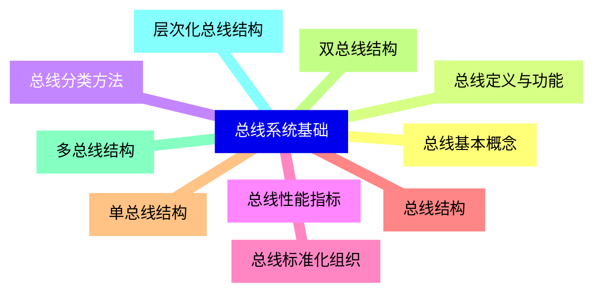
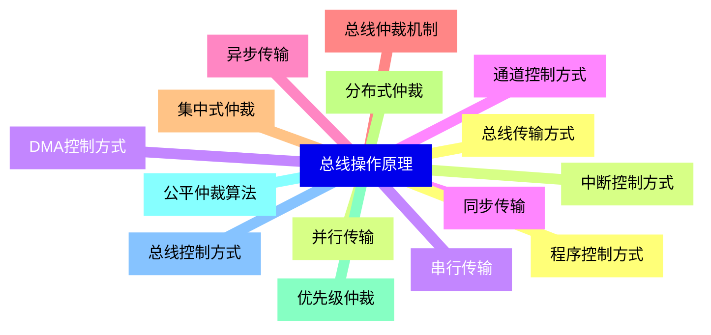
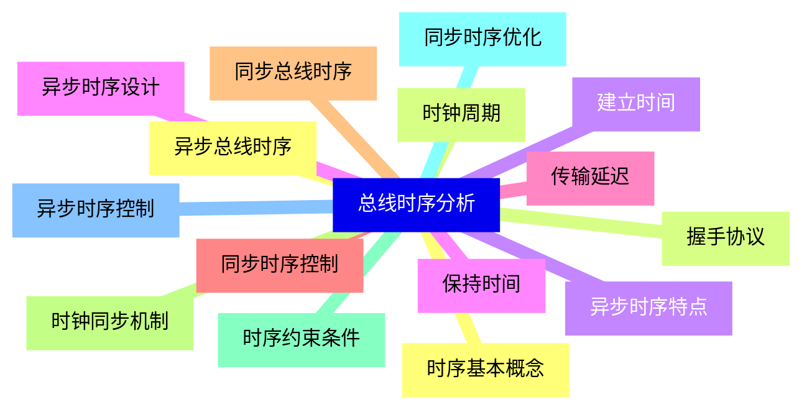
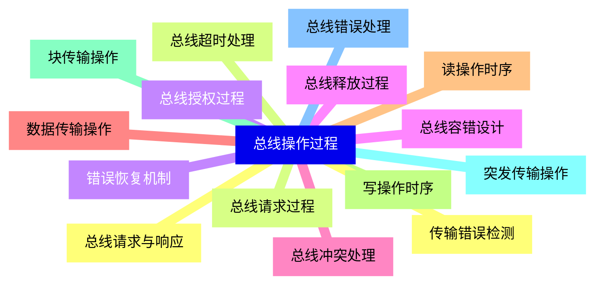
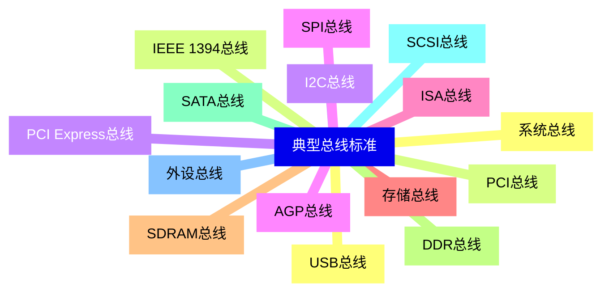
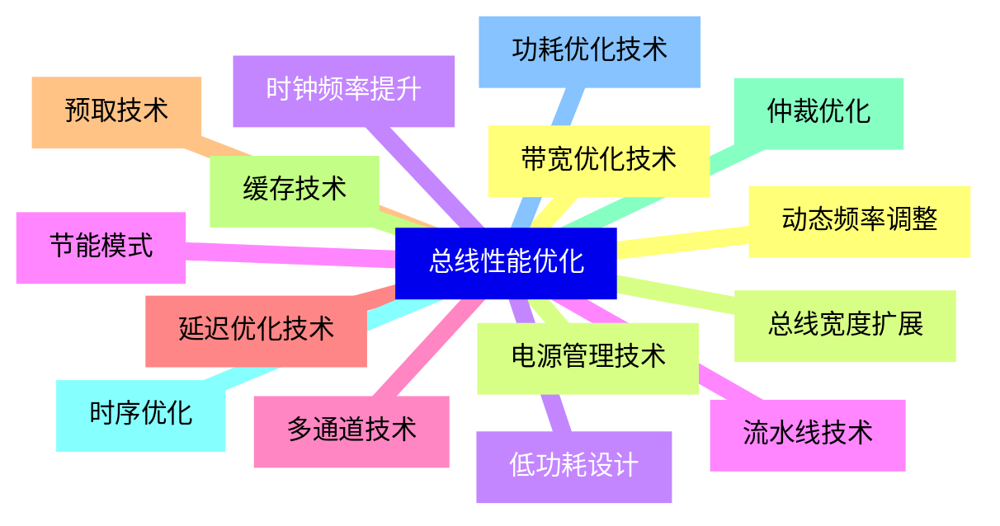
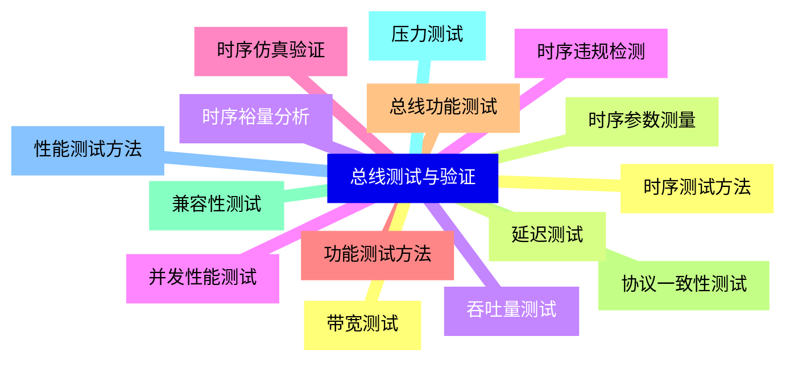
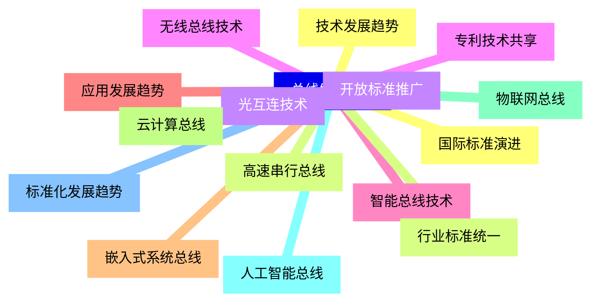


### 1 [总线系统基础](#1)
#### 1.1 [总线基本概念](#1)
#### 1.2 [总线定义与功能](#1)
#### 1.3 [总线分类方法](#1)
#### 1.4 [总线性能指标](#1)
#### 1.5 [总线标准化组织](#1)
#### 1.6 [总线结构](#1)
#### 1.7 [单总线结构](#1)
#### 1.8 [双总线结构](#1)
#### 1.9 [多总线结构](#1)
#### 1.10 [层次化总线结构](#1)
### 2 [总线操作原理](#2)
#### 2.1 [总线传输方式](#2)
#### 2.2 [并行传输](#2)
#### 2.3 [串行传输](#2)
#### 2.4 [同步传输](#2)
#### 2.5 [异步传输](#2)
#### 2.6 [总线仲裁机制](#2)
#### 2.7 [集中式仲裁](#2)
#### 2.8 [分布式仲裁](#2)
#### 2.9 [优先级仲裁](#2)
#### 2.10 [公平仲裁算法](#2)
#### 2.11 [总线控制方式](#2)
#### 2.12 [程序控制方式](#2)
#### 2.13 [中断控制方式](#2)
#### 2.14 [DMA控制方式](#2)
#### 2.15 [通道控制方式](#2)
### 3 [总线时序分析](#3)
#### 3.1 [时序基本概念](#3)
#### 3.2 [时钟周期](#3)
#### 3.3 [建立时间](#3)
#### 3.4 [保持时间](#3)
#### 3.5 [传输延迟](#3)
#### 3.6 [同步时序控制](#3)
#### 3.7 [同步总线时序](#3)
#### 3.8 [时钟同步机制](#3)
#### 3.9 [时序约束条件](#3)
#### 3.10 [同步时序优化](#3)
#### 3.11 [异步时序控制](#3)
#### 3.12 [异步总线时序](#3)
#### 3.13 [握手协议](#3)
#### 3.14 [异步时序特点](#3)
#### 3.15 [异步时序设计](#3)
### 4 [总线操作过程](#4)
#### 4.1 [总线请求与响应](#4)
#### 4.2 [总线请求过程](#4)
#### 4.3 [总线授权过程](#4)
#### 4.4 [总线释放过程](#4)
#### 4.5 [总线冲突处理](#4)
#### 4.6 [数据传输操作](#4)
#### 4.7 [读操作时序](#4)
#### 4.8 [写操作时序](#4)
#### 4.9 [块传输操作](#4)
#### 4.10 [突发传输操作](#4)
#### 4.11 [总线错误处理](#4)
#### 4.12 [传输错误检测](#4)
#### 4.13 [总线超时处理](#4)
#### 4.14 [错误恢复机制](#4)
#### 4.15 [总线容错设计](#4)
### 5 [典型总线标准](#5)
#### 5.1 [系统总线](#5)
#### 5.2 [PCI总线](#5)
#### 5.3 [PCI Express总线](#5)
#### 5.4 [AGP总线](#5)
#### 5.5 [ISA总线](#5)
#### 5.6 [存储总线](#5)
#### 5.7 [SDRAM总线](#5)
#### 5.8 [DDR总线](#5)
#### 5.9 [SATA总线](#5)
#### 5.10 [SCSI总线](#5)
#### 5.11 [外设总线](#5)
#### 5.12 [USB总线](#5)
#### 5.13 [IEEE 1394总线](#5)
#### 5.14 [I2C总线](#5)
#### 5.15 [SPI总线](#5)
### 6 [总线性能优化](#6)
#### 6.1 [带宽优化技术](#6)
#### 6.2 [总线宽度扩展](#6)
#### 6.3 [时钟频率提升](#6)
#### 6.4 [流水线技术](#6)
#### 6.5 [多通道技术](#6)
#### 6.6 [延迟优化技术](#6)
#### 6.7 [预取技术](#6)
#### 6.8 [缓存技术](#6)
#### 6.9 [仲裁优化](#6)
#### 6.10 [时序优化](#6)
#### 6.11 [功耗优化技术](#6)
#### 6.12 [动态频率调整](#6)
#### 6.13 [电源管理技术](#6)
#### 6.14 [低功耗设计](#6)
#### 6.15 [节能模式](#6)
### 7 [总线测试与验证](#7)
#### 7.1 [时序测试方法](#7)
#### 7.2 [时序参数测量](#7)
#### 7.3 [时序裕量分析](#7)
#### 7.4 [时序违规检测](#7)
#### 7.5 [时序仿真验证](#7)
#### 7.6 [功能测试方法](#7)
#### 7.7 [总线功能测试](#7)
#### 7.8 [协议一致性测试](#7)
#### 7.9 [兼容性测试](#7)
#### 7.10 [压力测试](#7)
#### 7.11 [性能测试方法](#7)
#### 7.12 [带宽测试](#7)
#### 7.13 [延迟测试](#7)
#### 7.14 [吞吐量测试](#7)
#### 7.15 [并发性能测试](#7)
### 8 [总线发展趋势](#8)
#### 8.1 [技术发展趋势](#8)
#### 8.2 [高速串行总线](#8)
#### 8.3 [光互连技术](#8)
#### 8.4 [无线总线技术](#8)
#### 8.5 [智能总线技术](#8)
#### 8.6 [应用发展趋势](#8)
#### 8.7 [嵌入式系统总线](#8)
#### 8.8 [云计算总线](#8)
#### 8.9 [物联网总线](#8)
#### 8.10 [人工智能总线](#8)
#### 8.11 [标准化发展趋势](#8)
#### 8.12 [国际标准演进](#8)
#### 8.13 [行业标准统一](#8)
#### 8.14 [开放标准推广](#8)
#### 8.15 [专利技术共享](#8)




### 1 总线系统基础

---
### 1 总线系统基础
___
#### 1.1 总线基本概念
___
#### 1.2 总线定义与功能
___
#### 1.3 总线分类方法
___
#### 1.4 总线性能指标
___
#### 1.5 总线标准化组织
___
#### 1.6 总线结构
___
#### 1.7 单总线结构
___
#### 1.8 双总线结构
___
#### 1.9 多总线结构
___
#### 1.10 层次化总线结构
### 2 总线操作原理

---
### 2 总线操作原理
___
#### 2.1 总线传输方式
___
#### 2.2 并行传输
___
#### 2.3 串行传输
___
#### 2.4 同步传输
___
#### 2.5 异步传输
___
#### 2.6 总线仲裁机制
___
#### 2.7 集中式仲裁
___
#### 2.8 分布式仲裁
___
#### 2.9 优先级仲裁
___
#### 2.10 公平仲裁算法
___
#### 2.11 总线控制方式
___
#### 2.12 程序控制方式
___
#### 2.13 中断控制方式
___
#### 2.14 DMA控制方式
___
#### 2.15 通道控制方式
### 3 总线时序分析

---
### 3 总线时序分析
___
#### 3.1 时序基本概念
___
#### 3.2 时钟周期
___
#### 3.3 建立时间
___
#### 3.4 保持时间
___
#### 3.5 传输延迟
___
#### 3.6 同步时序控制
___
#### 3.7 同步总线时序
___
#### 3.8 时钟同步机制
___
#### 3.9 时序约束条件
___
#### 3.10 同步时序优化
___
#### 3.11 异步时序控制
___
#### 3.12 异步总线时序
___
#### 3.13 握手协议
___
#### 3.14 异步时序特点
___
#### 3.15 异步时序设计
### 4 总线操作过程

---
### 4 总线操作过程
___
#### 4.1 总线请求与响应
___
#### 4.2 总线请求过程
___
#### 4.3 总线授权过程
___
#### 4.4 总线释放过程
___
#### 4.5 总线冲突处理
___
#### 4.6 数据传输操作
___
#### 4.7 读操作时序
___
#### 4.8 写操作时序
___
#### 4.9 块传输操作
___
#### 4.10 突发传输操作
___
#### 4.11 总线错误处理
___
#### 4.12 传输错误检测
___
#### 4.13 总线超时处理
___
#### 4.14 错误恢复机制
___
#### 4.15 总线容错设计
### 5 典型总线标准

---
### 5 典型总线标准
___
#### 5.1 系统总线
___
#### 5.2 PCI总线
___
#### 5.3 PCI Express总线
___
#### 5.4 AGP总线
___
#### 5.5 ISA总线
___
#### 5.6 存储总线
___
#### 5.7 SDRAM总线
___
#### 5.8 DDR总线
___
#### 5.9 SATA总线
___
#### 5.10 SCSI总线
___
#### 5.11 外设总线
___
#### 5.12 USB总线
___
#### 5.13 IEEE 1394总线
___
#### 5.14 I2C总线
___
#### 5.15 SPI总线
### 6 总线性能优化

---
### 6 总线性能优化
___
#### 6.1 带宽优化技术
___
#### 6.2 总线宽度扩展
___
#### 6.3 时钟频率提升
___
#### 6.4 流水线技术
___
#### 6.5 多通道技术
___
#### 6.6 延迟优化技术
___
#### 6.7 预取技术
___
#### 6.8 缓存技术
___
#### 6.9 仲裁优化
___
#### 6.10 时序优化
___
#### 6.11 功耗优化技术
___
#### 6.12 动态频率调整
___
#### 6.13 电源管理技术
___
#### 6.14 低功耗设计
___
#### 6.15 节能模式
### 7 总线测试与验证

---
### 7 总线测试与验证
___
#### 7.1 时序测试方法
___
#### 7.2 时序参数测量
___
#### 7.3 时序裕量分析
___
#### 7.4 时序违规检测
___
#### 7.5 时序仿真验证
___
#### 7.6 功能测试方法
___
#### 7.7 总线功能测试
___
#### 7.8 协议一致性测试
___
#### 7.9 兼容性测试
___
#### 7.10 压力测试
___
#### 7.11 性能测试方法
___
#### 7.12 带宽测试
___
#### 7.13 延迟测试
___
#### 7.14 吞吐量测试
___
#### 7.15 并发性能测试
### 8 总线发展趋势

---
### 8 总线发展趋势
___
#### 8.1 技术发展趋势
___
#### 8.2 高速串行总线
___
#### 8.3 光互连技术
___
#### 8.4 无线总线技术
___
#### 8.5 智能总线技术
___
#### 8.6 应用发展趋势
___
#### 8.7 嵌入式系统总线
___
#### 8.8 云计算总线
___
#### 8.9 物联网总线
___
#### 8.10 人工智能总线
___
#### 8.11 标准化发展趋势
___
#### 8.12 国际标准演进
___
#### 8.13 行业标准统一
___
#### 8.14 开放标准推广
___
#### 8.15 专利技术共享


### 1 总线系统基础{#1}

{}

<--->
{}
{}
{}
{}
{}
{}
{}
{}
{}
{}
{}
{}
{}
{}
{}
{}
{}
{}
{}
{}
{}

### 2 总线操作原理{#2}

{}
{}
{}
{}
{}
{}
{}
{}
{}
{}
{}
{}
{}
{}
{}
{}
{}
{}
{}
{}
{}
{}
{}
{}
{}
{}
{}
{}
{}
{}
{}
<--->

{}

### 3 总线时序分析{#3}

{}

<--->
{}
{}
{}
{}
{}
{}
{}
{}
{}
{}
{}
{}
{}
{}
{}
{}
{}
{}
{}
{}
{}
{}
{}
{}
{}
{}
{}
{}
{}
{}
{}

### 4 总线操作过程{#4}

{}
{}
{}
{}
{}
{}
{}
{}
{}
{}
{}
{}
{}
{}
{}
{}
{}
{}
{}
{}
{}
{}
{}
{}
{}
{}
{}
{}
{}
{}
{}
<--->

{}

### 5 典型总线标准{#5}

{}

<--->
{}
{}
{}
{}
{}
{}
{}
{}
{}
{}
{}
{}
{}
{}
{}
{}
{}
{}
{}
{}
{}
{}
{}
{}
{}
{}
{}
{}
{}
{}
{}

### 6 总线性能优化{#6}

{}
{}
{}
{}
{}
{}
{}
{}
{}
{}
{}
{}
{}
{}
{}
{}
{}
{}
{}
{}
{}
{}
{}
{}
{}
{}
{}
{}
{}
{}
{}
<--->

{}

### 7 总线测试与验证{#7}

{}

<--->
{}
{}
{}
{}
{}
{}
{}
{}
{}
{}
{}
{}
{}
{}
{}
{}
{}
{}
{}
{}
{}
{}
{}
{}
{}
{}
{}
{}
{}
{}
{}

### 8 总线发展趋势{#8}

{}
{}
{}
{}
{}
{}
{}
{}
{}
{}
{}
{}
{}
{}
{}
{}
{}
{}
{}
{}
{}
{}
{}
{}
{}
{}
{}
{}
{}
{}
{}
<--->

{}
