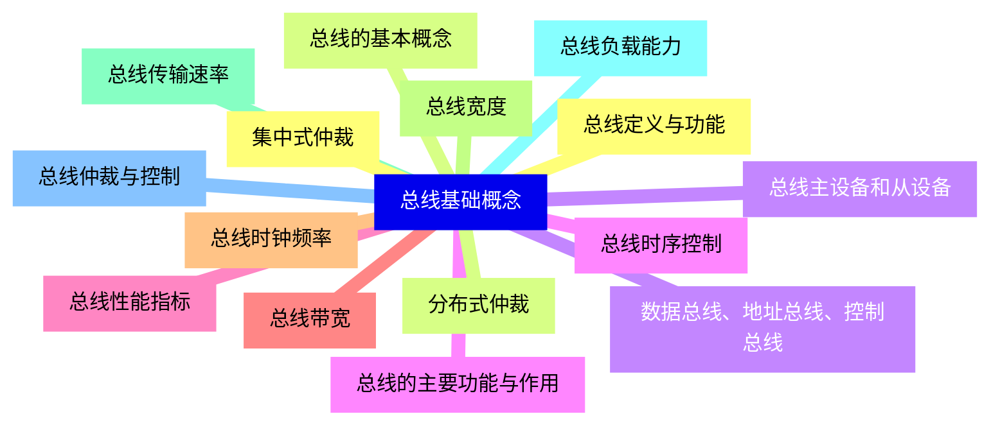
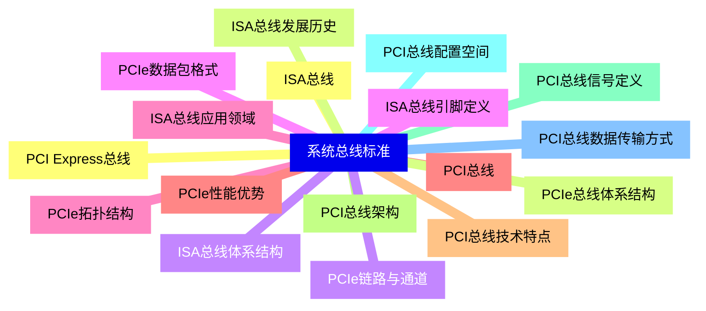
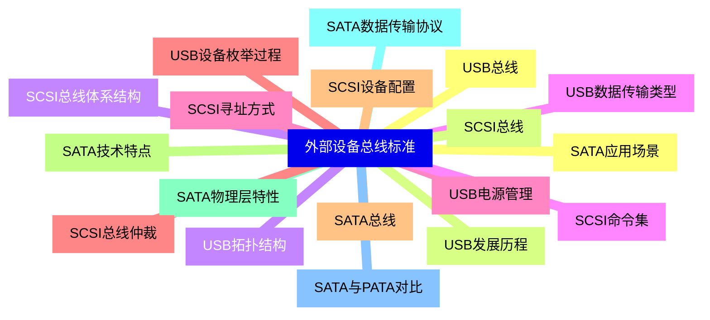
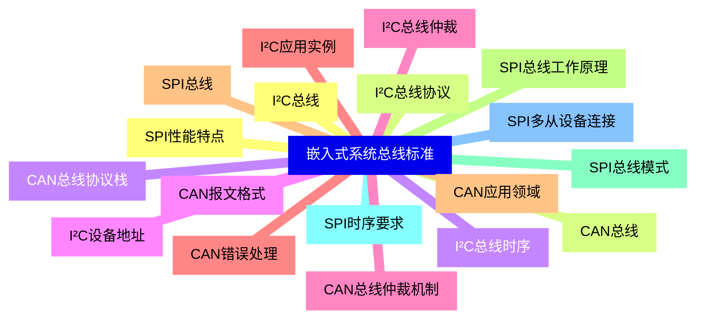
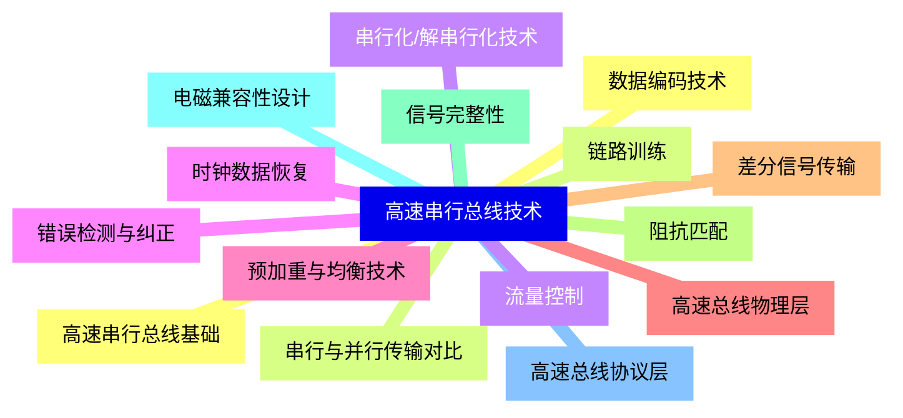
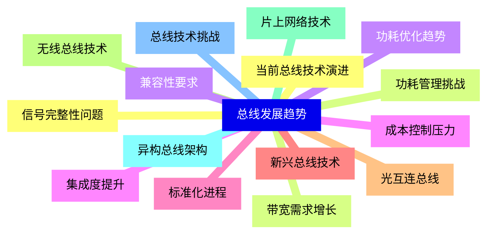


### 1 [总线基础概念](#1)
#### 1.1 [总线定义与功能](#1)
#### 1.2 [总线的基本概念](#1)
#### 1.3 [数据总线、地址总线、控制总线](#1)
#### 1.4 [总线的主要功能与作用](#1)
#### 1.5 [总线性能指标](#1)
#### 1.6 [总线带宽](#1)
#### 1.7 [总线时钟频率](#1)
#### 1.8 [总线宽度](#1)
#### 1.9 [总线传输速率](#1)
#### 1.10 [总线负载能力](#1)
#### 1.11 [总线仲裁与控制](#1)
#### 1.12 [集中式仲裁](#1)
#### 1.13 [分布式仲裁](#1)
#### 1.14 [总线主设备和从设备](#1)
#### 1.15 [总线时序控制](#1)
### 2 [系统总线标准](#2)
#### 2.1 [ISA总线](#2)
#### 2.2 [ISA总线发展历史](#2)
#### 2.3 [ISA总线体系结构](#2)
#### 2.4 [ISA总线引脚定义](#2)
#### 2.5 [ISA总线应用领域](#2)
#### 2.6 [PCI总线](#2)
#### 2.7 [PCI总线技术特点](#2)
#### 2.8 [PCI总线架构](#2)
#### 2.9 [PCI总线信号定义](#2)
#### 2.10 [PCI总线配置空间](#2)
#### 2.11 [PCI总线数据传输方式](#2)
#### 2.12 [PCI Express总线](#2)
#### 2.13 [PCIe总线体系结构](#2)
#### 2.14 [PCIe链路与通道](#2)
#### 2.15 [PCIe数据包格式](#2)
#### 2.16 [PCIe拓扑结构](#2)
#### 2.17 [PCIe性能优势](#2)
### 3 [外部设备总线标准](#3)
#### 3.1 [USB总线](#3)
#### 3.2 [USB发展历程](#3)
#### 3.3 [USB拓扑结构](#3)
#### 3.4 [USB数据传输类型](#3)
#### 3.5 [USB电源管理](#3)
#### 3.6 [USB设备枚举过程](#3)
#### 3.7 [SATA总线](#3)
#### 3.8 [SATA技术特点](#3)
#### 3.9 [SATA物理层特性](#3)
#### 3.10 [SATA数据传输协议](#3)
#### 3.11 [SATA与PATA对比](#3)
#### 3.12 [SATA应用场景](#3)
#### 3.13 [SCSI总线](#3)
#### 3.14 [SCSI总线体系结构](#3)
#### 3.15 [SCSI命令集](#3)
#### 3.16 [SCSI寻址方式](#3)
#### 3.17 [SCSI总线仲裁](#3)
#### 3.18 [SCSI设备配置](#3)
### 4 [嵌入式系统总线标准](#4)
#### 4.1 [I²C总线](#4)
#### 4.2 [I²C总线协议](#4)
#### 4.3 [I²C总线时序](#4)
#### 4.4 [I²C设备地址](#4)
#### 4.5 [I²C总线仲裁](#4)
#### 4.6 [I²C应用实例](#4)
#### 4.7 [SPI总线](#4)
#### 4.8 [SPI总线工作原理](#4)
#### 4.9 [SPI总线模式](#4)
#### 4.10 [SPI时序要求](#4)
#### 4.11 [SPI多从设备连接](#4)
#### 4.12 [SPI性能特点](#4)
#### 4.13 [CAN总线](#4)
#### 4.14 [CAN总线协议栈](#4)
#### 4.15 [CAN报文格式](#4)
#### 4.16 [CAN总线仲裁机制](#4)
#### 4.17 [CAN错误处理](#4)
#### 4.18 [CAN应用领域](#4)
### 5 [高速串行总线技术](#5)
#### 5.1 [高速串行总线基础](#5)
#### 5.2 [串行与并行传输对比](#5)
#### 5.3 [串行化/解串行化技术](#5)
#### 5.4 [时钟数据恢复](#5)
#### 5.5 [预加重与均衡技术](#5)
#### 5.6 [高速总线物理层](#5)
#### 5.7 [差分信号传输](#5)
#### 5.8 [阻抗匹配](#5)
#### 5.9 [信号完整性](#5)
#### 5.10 [电磁兼容性设计](#5)
#### 5.11 [高速总线协议层](#5)
#### 5.12 [数据编码技术](#5)
#### 5.13 [链路训练](#5)
#### 5.14 [流量控制](#5)
#### 5.15 [错误检测与纠正](#5)
### 6 [总线发展趋势](#6)
#### 6.1 [当前总线技术演进](#6)
#### 6.2 [带宽需求增长](#6)
#### 6.3 [功耗优化趋势](#6)
#### 6.4 [集成度提升](#6)
#### 6.5 [标准化进程](#6)
#### 6.6 [新兴总线技术](#6)
#### 6.7 [光互连总线](#6)
#### 6.8 [无线总线技术](#6)
#### 6.9 [片上网络技术](#6)
#### 6.10 [异构总线架构](#6)
#### 6.11 [总线技术挑战](#6)
#### 6.12 [信号完整性问题](#6)
#### 6.13 [功耗管理挑战](#6)
#### 6.14 [兼容性要求](#6)
#### 6.15 [成本控制压力](#6)




### 1 总线基础概念

---
### 1 总线基础概念
___
#### 1.1 总线定义与功能
___
#### 1.2 总线的基本概念
___
#### 1.3 数据总线、地址总线、控制总线
___
#### 1.4 总线的主要功能与作用
___
#### 1.5 总线性能指标
___
#### 1.6 总线带宽
___
#### 1.7 总线时钟频率
___
#### 1.8 总线宽度
___
#### 1.9 总线传输速率
___
#### 1.10 总线负载能力
___
#### 1.11 总线仲裁与控制
___
#### 1.12 集中式仲裁
___
#### 1.13 分布式仲裁
___
#### 1.14 总线主设备和从设备
___
#### 1.15 总线时序控制
### 2 系统总线标准

---
### 2 系统总线标准
___
#### 2.1 ISA总线
___
#### 2.2 ISA总线发展历史
___
#### 2.3 ISA总线体系结构
___
#### 2.4 ISA总线引脚定义
___
#### 2.5 ISA总线应用领域
___
#### 2.6 PCI总线
___
#### 2.7 PCI总线技术特点
___
#### 2.8 PCI总线架构
___
#### 2.9 PCI总线信号定义
___
#### 2.10 PCI总线配置空间
___
#### 2.11 PCI总线数据传输方式
___
#### 2.12 PCI Express总线
___
#### 2.13 PCIe总线体系结构
___
#### 2.14 PCIe链路与通道
___
#### 2.15 PCIe数据包格式
___
#### 2.16 PCIe拓扑结构
___
#### 2.17 PCIe性能优势
### 3 外部设备总线标准

---
### 3 外部设备总线标准
___
#### 3.1 USB总线
___
#### 3.2 USB发展历程
___
#### 3.3 USB拓扑结构
___
#### 3.4 USB数据传输类型
___
#### 3.5 USB电源管理
___
#### 3.6 USB设备枚举过程
___
#### 3.7 SATA总线
___
#### 3.8 SATA技术特点
___
#### 3.9 SATA物理层特性
___
#### 3.10 SATA数据传输协议
___
#### 3.11 SATA与PATA对比
___
#### 3.12 SATA应用场景
___
#### 3.13 SCSI总线
___
#### 3.14 SCSI总线体系结构
___
#### 3.15 SCSI命令集
___
#### 3.16 SCSI寻址方式
___
#### 3.17 SCSI总线仲裁
___
#### 3.18 SCSI设备配置
### 4 嵌入式系统总线标准

---
### 4 嵌入式系统总线标准
___
#### 4.1 I²C总线
___
#### 4.2 I²C总线协议
___
#### 4.3 I²C总线时序
___
#### 4.4 I²C设备地址
___
#### 4.5 I²C总线仲裁
___
#### 4.6 I²C应用实例
___
#### 4.7 SPI总线
___
#### 4.8 SPI总线工作原理
___
#### 4.9 SPI总线模式
___
#### 4.10 SPI时序要求
___
#### 4.11 SPI多从设备连接
___
#### 4.12 SPI性能特点
___
#### 4.13 CAN总线
___
#### 4.14 CAN总线协议栈
___
#### 4.15 CAN报文格式
___
#### 4.16 CAN总线仲裁机制
___
#### 4.17 CAN错误处理
___
#### 4.18 CAN应用领域
### 5 高速串行总线技术

---
### 5 高速串行总线技术
___
#### 5.1 高速串行总线基础
___
#### 5.2 串行与并行传输对比
___
#### 5.3 串行化/解串行化技术
___
#### 5.4 时钟数据恢复
___
#### 5.5 预加重与均衡技术
___
#### 5.6 高速总线物理层
___
#### 5.7 差分信号传输
___
#### 5.8 阻抗匹配
___
#### 5.9 信号完整性
___
#### 5.10 电磁兼容性设计
___
#### 5.11 高速总线协议层
___
#### 5.12 数据编码技术
___
#### 5.13 链路训练
___
#### 5.14 流量控制
___
#### 5.15 错误检测与纠正
### 6 总线发展趋势

---
### 6 总线发展趋势
___
#### 6.1 当前总线技术演进
___
#### 6.2 带宽需求增长
___
#### 6.3 功耗优化趋势
___
#### 6.4 集成度提升
___
#### 6.5 标准化进程
___
#### 6.6 新兴总线技术
___
#### 6.7 光互连总线
___
#### 6.8 无线总线技术
___
#### 6.9 片上网络技术
___
#### 6.10 异构总线架构
___
#### 6.11 总线技术挑战
___
#### 6.12 信号完整性问题
___
#### 6.13 功耗管理挑战
___
#### 6.14 兼容性要求
___
#### 6.15 成本控制压力


### 1 总线基础概念{#1}

{}

<--->
{}
{}
{}
{}
{}
{}
{}
{}
{}
{}
{}
{}
{}
{}
{}
{}
{}
{}
{}
{}
{}
{}
{}
{}
{}
{}
{}
{}
{}
{}
{}

### 2 系统总线标准{#2}

{}
{}
{}
{}
{}
{}
{}
{}
{}
{}
{}
{}
{}
{}
{}
{}
{}
{}
{}
{}
{}
{}
{}
{}
{}
{}
{}
{}
{}
{}
{}
{}
{}
{}
{}
<--->

{}

### 3 外部设备总线标准{#3}

{}

<--->
{}
{}
{}
{}
{}
{}
{}
{}
{}
{}
{}
{}
{}
{}
{}
{}
{}
{}
{}
{}
{}
{}
{}
{}
{}
{}
{}
{}
{}
{}
{}
{}
{}
{}
{}
{}
{}

### 4 嵌入式系统总线标准{#4}

{}
{}
{}
{}
{}
{}
{}
{}
{}
{}
{}
{}
{}
{}
{}
{}
{}
{}
{}
{}
{}
{}
{}
{}
{}
{}
{}
{}
{}
{}
{}
{}
{}
{}
{}
{}
{}
<--->

{}

### 5 高速串行总线技术{#5}

{}

<--->
{}
{}
{}
{}
{}
{}
{}
{}
{}
{}
{}
{}
{}
{}
{}
{}
{}
{}
{}
{}
{}
{}
{}
{}
{}
{}
{}
{}
{}
{}
{}

### 6 总线发展趋势{#6}

{}
{}
{}
{}
{}
{}
{}
{}
{}
{}
{}
{}
{}
{}
{}
{}
{}
{}
{}
{}
{}
{}
{}
{}
{}
{}
{}
{}
{}
{}
{}
<--->

{}
