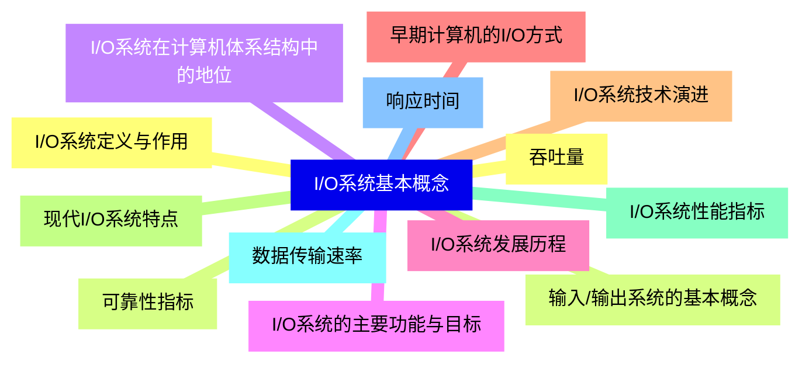
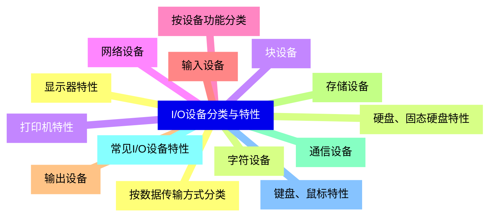
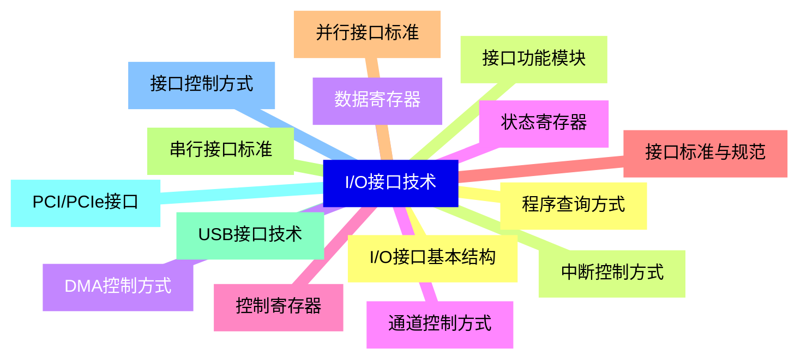
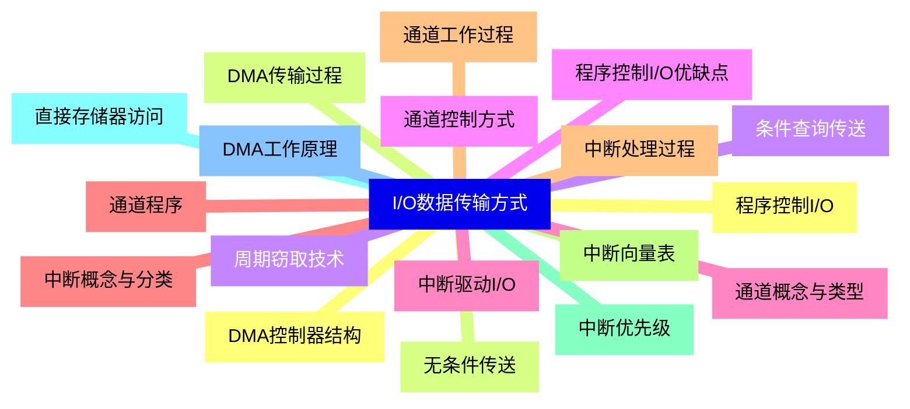
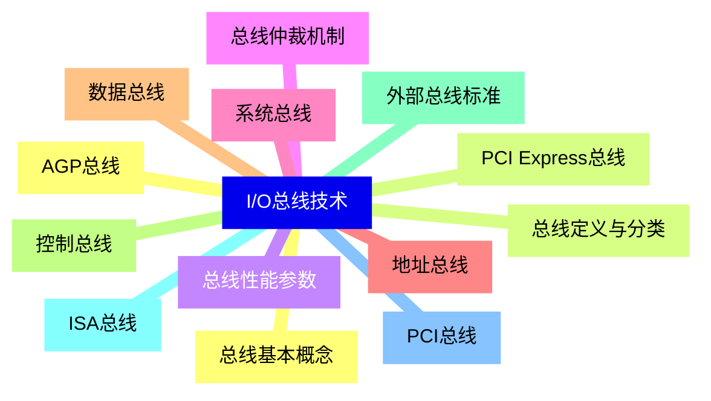
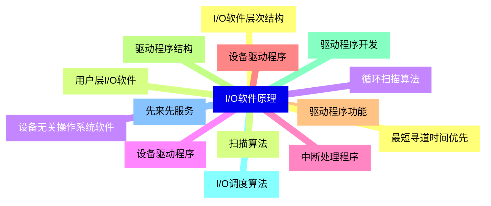
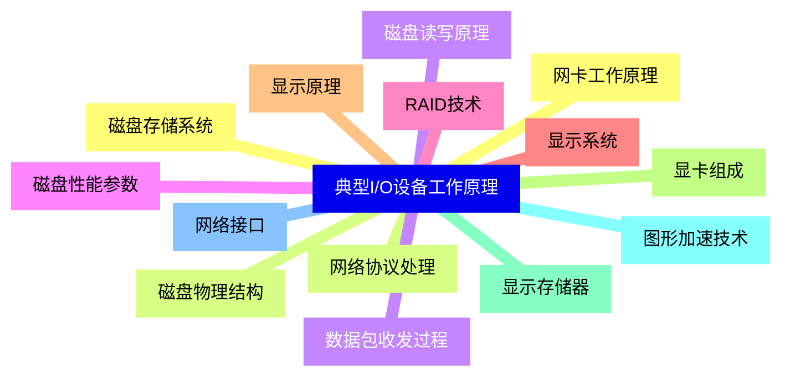
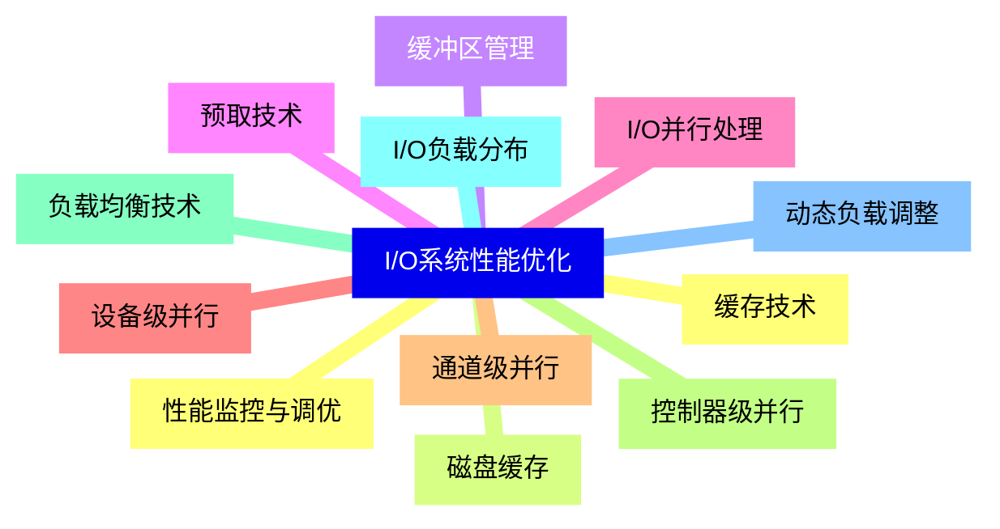
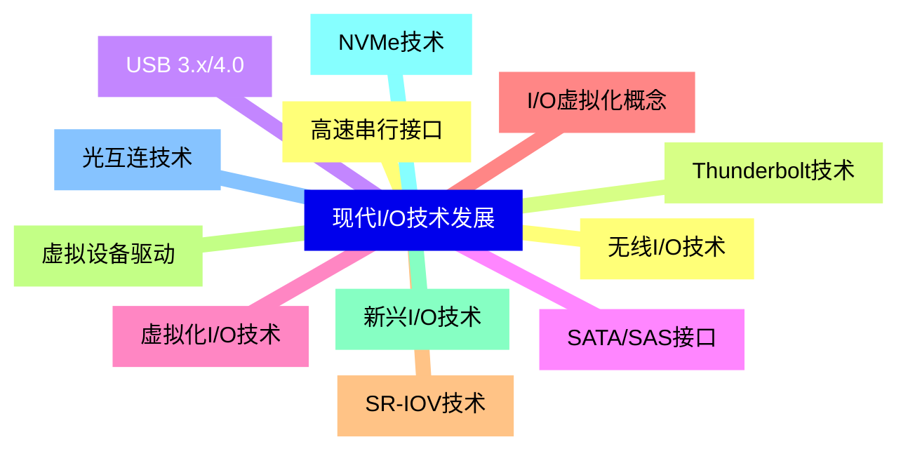
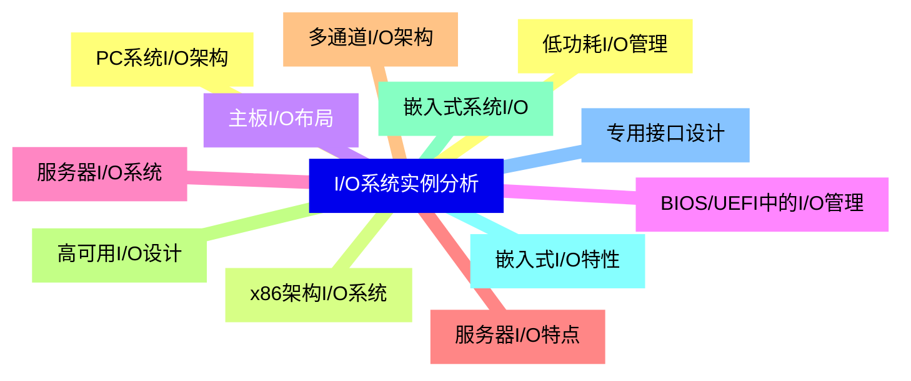


### 1 [I/O系统基本概念](#1)
#### 1.1 [I/O系统定义与作用](#1)
#### 1.2 [输入/输出系统的基本概念](#1)
#### 1.3 [I/O系统在计算机体系结构中的地位](#1)
#### 1.4 [I/O系统的主要功能与目标](#1)
#### 1.5 [I/O系统发展历程](#1)
#### 1.6 [早期计算机的I/O方式](#1)
#### 1.7 [I/O系统技术演进](#1)
#### 1.8 [现代I/O系统特点](#1)
#### 1.9 [I/O系统性能指标](#1)
#### 1.10 [数据传输速率](#1)
#### 1.11 [响应时间](#1)
#### 1.12 [吞吐量](#1)
#### 1.13 [可靠性指标](#1)
### 2 [I/O设备分类与特性](#2)
#### 2.1 [按数据传输方式分类](#2)
#### 2.2 [字符设备](#2)
#### 2.3 [块设备](#2)
#### 2.4 [网络设备](#2)
#### 2.5 [按设备功能分类](#2)
#### 2.6 [输入设备](#2)
#### 2.7 [输出设备](#2)
#### 2.8 [存储设备](#2)
#### 2.9 [通信设备](#2)
#### 2.10 [常见I/O设备特性](#2)
#### 2.11 [键盘、鼠标特性](#2)
#### 2.12 [显示器特性](#2)
#### 2.13 [硬盘、固态硬盘特性](#2)
#### 2.14 [打印机特性](#2)
### 3 [I/O接口技术](#3)
#### 3.1 [I/O接口基本结构](#3)
#### 3.2 [接口功能模块](#3)
#### 3.3 [数据寄存器](#3)
#### 3.4 [状态寄存器](#3)
#### 3.5 [控制寄存器](#3)
#### 3.6 [接口标准与规范](#3)
#### 3.7 [并行接口标准](#3)
#### 3.8 [串行接口标准](#3)
#### 3.9 [USB接口技术](#3)
#### 3.10 [PCI/PCIe接口](#3)
#### 3.11 [接口控制方式](#3)
#### 3.12 [程序查询方式](#3)
#### 3.13 [中断控制方式](#3)
#### 3.14 [DMA控制方式](#3)
#### 3.15 [通道控制方式](#3)
### 4 [I/O数据传输方式](#4)
#### 4.1 [程序控制I/O](#4)
#### 4.2 [无条件传送](#4)
#### 4.3 [条件查询传送](#4)
#### 4.4 [程序控制I/O优缺点](#4)
#### 4.5 [中断驱动I/O](#4)
#### 4.6 [中断概念与分类](#4)
#### 4.7 [中断处理过程](#4)
#### 4.8 [中断向量表](#4)
#### 4.9 [中断优先级](#4)
#### 4.10 [直接存储器访问](#4)
#### 4.11 [DMA工作原理](#4)
#### 4.12 [DMA控制器结构](#4)
#### 4.13 [DMA传输过程](#4)
#### 4.14 [周期窃取技术](#4)
#### 4.15 [通道控制方式](#4)
#### 4.16 [通道概念与类型](#4)
#### 4.17 [通道程序](#4)
#### 4.18 [通道工作过程](#4)
### 5 [I/O总线技术](#5)
#### 5.1 [总线基本概念](#5)
#### 5.2 [总线定义与分类](#5)
#### 5.3 [总线性能参数](#5)
#### 5.4 [总线仲裁机制](#5)
#### 5.5 [系统总线](#5)
#### 5.6 [地址总线](#5)
#### 5.7 [数据总线](#5)
#### 5.8 [控制总线](#5)
#### 5.9 [外部总线标准](#5)
#### 5.10 [ISA总线](#5)
#### 5.11 [PCI总线](#5)
#### 5.12 [AGP总线](#5)
#### 5.13 [PCI Express总线](#5)
### 6 [I/O软件原理](#6)
#### 6.1 [I/O软件层次结构](#6)
#### 6.2 [用户层I/O软件](#6)
#### 6.3 [设备无关操作系统软件](#6)
#### 6.4 [设备驱动程序](#6)
#### 6.5 [中断处理程序](#6)
#### 6.6 [设备驱动程序](#6)
#### 6.7 [驱动程序功能](#6)
#### 6.8 [驱动程序结构](#6)
#### 6.9 [驱动程序开发](#6)
#### 6.10 [I/O调度算法](#6)
#### 6.11 [先来先服务](#6)
#### 6.12 [最短寻道时间优先](#6)
#### 6.13 [扫描算法](#6)
#### 6.14 [循环扫描算法](#6)
### 7 [典型I/O设备工作原理](#7)
#### 7.1 [磁盘存储系统](#7)
#### 7.2 [磁盘物理结构](#7)
#### 7.3 [磁盘读写原理](#7)
#### 7.4 [磁盘性能参数](#7)
#### 7.5 [RAID技术](#7)
#### 7.6 [显示系统](#7)
#### 7.7 [显示原理](#7)
#### 7.8 [显卡组成](#7)
#### 7.9 [显示存储器](#7)
#### 7.10 [图形加速技术](#7)
#### 7.11 [网络接口](#7)
#### 7.12 [网卡工作原理](#7)
#### 7.13 [网络协议处理](#7)
#### 7.14 [数据包收发过程](#7)
### 8 [I/O系统性能优化](#8)
#### 8.1 [缓存技术](#8)
#### 8.2 [磁盘缓存](#8)
#### 8.3 [缓冲区管理](#8)
#### 8.4 [预取技术](#8)
#### 8.5 [I/O并行处理](#8)
#### 8.6 [设备级并行](#8)
#### 8.7 [通道级并行](#8)
#### 8.8 [控制器级并行](#8)
#### 8.9 [负载均衡技术](#8)
#### 8.10 [I/O负载分布](#8)
#### 8.11 [动态负载调整](#8)
#### 8.12 [性能监控与调优](#8)
### 9 [现代I/O技术发展](#9)
#### 9.1 [高速串行接口](#9)
#### 9.2 [Thunderbolt技术](#9)
#### 9.3 [USB 3.x/4.0](#9)
#### 9.4 [SATA/SAS接口](#9)
#### 9.5 [虚拟化I/O技术](#9)
#### 9.6 [I/O虚拟化概念](#9)
#### 9.7 [SR-IOV技术](#9)
#### 9.8 [虚拟设备驱动](#9)
#### 9.9 [新兴I/O技术](#9)
#### 9.10 [NVMe技术](#9)
#### 9.11 [光互连技术](#9)
#### 9.12 [无线I/O技术](#9)
### 10 [I/O系统实例分析](#10)
#### 10.1 [PC系统I/O架构](#10)
#### 10.2 [x86架构I/O系统](#10)
#### 10.3 [主板I/O布局](#10)
#### 10.4 [BIOS/UEFI中的I/O管理](#10)
#### 10.5 [服务器I/O系统](#10)
#### 10.6 [服务器I/O特点](#10)
#### 10.7 [多通道I/O架构](#10)
#### 10.8 [高可用I/O设计](#10)
#### 10.9 [嵌入式系统I/O](#10)
#### 10.10 [嵌入式I/O特性](#10)
#### 10.11 [专用接口设计](#10)
#### 10.12 [低功耗I/O管理](#10)




### 1 I/O系统基本概念

---
### 1 I/O系统基本概念
___
#### 1.1 I/O系统定义与作用
___
#### 1.2 输入/输出系统的基本概念
___
#### 1.3 I/O系统在计算机体系结构中的地位
___
#### 1.4 I/O系统的主要功能与目标
___
#### 1.5 I/O系统发展历程
___
#### 1.6 早期计算机的I/O方式
___
#### 1.7 I/O系统技术演进
___
#### 1.8 现代I/O系统特点
___
#### 1.9 I/O系统性能指标
___
#### 1.10 数据传输速率
___
#### 1.11 响应时间
___
#### 1.12 吞吐量
___
#### 1.13 可靠性指标
### 2 I/O设备分类与特性

---
### 2 I/O设备分类与特性
___
#### 2.1 按数据传输方式分类
___
#### 2.2 字符设备
___
#### 2.3 块设备
___
#### 2.4 网络设备
___
#### 2.5 按设备功能分类
___
#### 2.6 输入设备
___
#### 2.7 输出设备
___
#### 2.8 存储设备
___
#### 2.9 通信设备
___
#### 2.10 常见I/O设备特性
___
#### 2.11 键盘、鼠标特性
___
#### 2.12 显示器特性
___
#### 2.13 硬盘、固态硬盘特性
___
#### 2.14 打印机特性
### 3 I/O接口技术

---
### 3 I/O接口技术
___
#### 3.1 I/O接口基本结构
___
#### 3.2 接口功能模块
___
#### 3.3 数据寄存器
___
#### 3.4 状态寄存器
___
#### 3.5 控制寄存器
___
#### 3.6 接口标准与规范
___
#### 3.7 并行接口标准
___
#### 3.8 串行接口标准
___
#### 3.9 USB接口技术
___
#### 3.10 PCI/PCIe接口
___
#### 3.11 接口控制方式
___
#### 3.12 程序查询方式
___
#### 3.13 中断控制方式
___
#### 3.14 DMA控制方式
___
#### 3.15 通道控制方式
### 4 I/O数据传输方式

---
### 4 I/O数据传输方式
___
#### 4.1 程序控制I/O
___
#### 4.2 无条件传送
___
#### 4.3 条件查询传送
___
#### 4.4 程序控制I/O优缺点
___
#### 4.5 中断驱动I/O
___
#### 4.6 中断概念与分类
___
#### 4.7 中断处理过程
___
#### 4.8 中断向量表
___
#### 4.9 中断优先级
___
#### 4.10 直接存储器访问
___
#### 4.11 DMA工作原理
___
#### 4.12 DMA控制器结构
___
#### 4.13 DMA传输过程
___
#### 4.14 周期窃取技术
___
#### 4.15 通道控制方式
___
#### 4.16 通道概念与类型
___
#### 4.17 通道程序
___
#### 4.18 通道工作过程
### 5 I/O总线技术

---
### 5 I/O总线技术
___
#### 5.1 总线基本概念
___
#### 5.2 总线定义与分类
___
#### 5.3 总线性能参数
___
#### 5.4 总线仲裁机制
___
#### 5.5 系统总线
___
#### 5.6 地址总线
___
#### 5.7 数据总线
___
#### 5.8 控制总线
___
#### 5.9 外部总线标准
___
#### 5.10 ISA总线
___
#### 5.11 PCI总线
___
#### 5.12 AGP总线
___
#### 5.13 PCI Express总线
### 6 I/O软件原理

---
### 6 I/O软件原理
___
#### 6.1 I/O软件层次结构
___
#### 6.2 用户层I/O软件
___
#### 6.3 设备无关操作系统软件
___
#### 6.4 设备驱动程序
___
#### 6.5 中断处理程序
___
#### 6.6 设备驱动程序
___
#### 6.7 驱动程序功能
___
#### 6.8 驱动程序结构
___
#### 6.9 驱动程序开发
___
#### 6.10 I/O调度算法
___
#### 6.11 先来先服务
___
#### 6.12 最短寻道时间优先
___
#### 6.13 扫描算法
___
#### 6.14 循环扫描算法
### 7 典型I/O设备工作原理

---
### 7 典型I/O设备工作原理
___
#### 7.1 磁盘存储系统
___
#### 7.2 磁盘物理结构
___
#### 7.3 磁盘读写原理
___
#### 7.4 磁盘性能参数
___
#### 7.5 RAID技术
___
#### 7.6 显示系统
___
#### 7.7 显示原理
___
#### 7.8 显卡组成
___
#### 7.9 显示存储器
___
#### 7.10 图形加速技术
___
#### 7.11 网络接口
___
#### 7.12 网卡工作原理
___
#### 7.13 网络协议处理
___
#### 7.14 数据包收发过程
### 8 I/O系统性能优化

---
### 8 I/O系统性能优化
___
#### 8.1 缓存技术
___
#### 8.2 磁盘缓存
___
#### 8.3 缓冲区管理
___
#### 8.4 预取技术
___
#### 8.5 I/O并行处理
___
#### 8.6 设备级并行
___
#### 8.7 通道级并行
___
#### 8.8 控制器级并行
___
#### 8.9 负载均衡技术
___
#### 8.10 I/O负载分布
___
#### 8.11 动态负载调整
___
#### 8.12 性能监控与调优
### 9 现代I/O技术发展

---
### 9 现代I/O技术发展
___
#### 9.1 高速串行接口
___
#### 9.2 Thunderbolt技术
___
#### 9.3 USB 3.x/4.0
___
#### 9.4 SATA/SAS接口
___
#### 9.5 虚拟化I/O技术
___
#### 9.6 I/O虚拟化概念
___
#### 9.7 SR-IOV技术
___
#### 9.8 虚拟设备驱动
___
#### 9.9 新兴I/O技术
___
#### 9.10 NVMe技术
___
#### 9.11 光互连技术
___
#### 9.12 无线I/O技术
### 10 I/O系统实例分析

---
### 10 I/O系统实例分析
___
#### 10.1 PC系统I/O架构
___
#### 10.2 x86架构I/O系统
___
#### 10.3 主板I/O布局
___
#### 10.4 BIOS/UEFI中的I/O管理
___
#### 10.5 服务器I/O系统
___
#### 10.6 服务器I/O特点
___
#### 10.7 多通道I/O架构
___
#### 10.8 高可用I/O设计
___
#### 10.9 嵌入式系统I/O
___
#### 10.10 嵌入式I/O特性
___
#### 10.11 专用接口设计
___
#### 10.12 低功耗I/O管理


### 1 I/O系统基本概念{#1}

{}

<--->
{}
{}
{}
{}
{}
{}
{}
{}
{}
{}
{}
{}
{}
{}
{}
{}
{}
{}
{}
{}
{}
{}
{}
{}
{}
{}
{}

### 2 I/O设备分类与特性{#2}

{}
{}
{}
{}
{}
{}
{}
{}
{}
{}
{}
{}
{}
{}
{}
{}
{}
{}
{}
{}
{}
{}
{}
{}
{}
{}
{}
{}
{}
<--->

{}

### 3 I/O接口技术{#3}

{}

<--->
{}
{}
{}
{}
{}
{}
{}
{}
{}
{}
{}
{}
{}
{}
{}
{}
{}
{}
{}
{}
{}
{}
{}
{}
{}
{}
{}
{}
{}
{}
{}

### 4 I/O数据传输方式{#4}

{}
{}
{}
{}
{}
{}
{}
{}
{}
{}
{}
{}
{}
{}
{}
{}
{}
{}
{}
{}
{}
{}
{}
{}
{}
{}
{}
{}
{}
{}
{}
{}
{}
{}
{}
{}
{}
<--->

{}

### 5 I/O总线技术{#5}

{}

<--->
{}
{}
{}
{}
{}
{}
{}
{}
{}
{}
{}
{}
{}
{}
{}
{}
{}
{}
{}
{}
{}
{}
{}
{}
{}
{}
{}

### 6 I/O软件原理{#6}

{}
{}
{}
{}
{}
{}
{}
{}
{}
{}
{}
{}
{}
{}
{}
{}
{}
{}
{}
{}
{}
{}
{}
{}
{}
{}
{}
{}
{}
<--->

{}

### 7 典型I/O设备工作原理{#7}

{}

<--->
{}
{}
{}
{}
{}
{}
{}
{}
{}
{}
{}
{}
{}
{}
{}
{}
{}
{}
{}
{}
{}
{}
{}
{}
{}
{}
{}
{}
{}

### 8 I/O系统性能优化{#8}

{}
{}
{}
{}
{}
{}
{}
{}
{}
{}
{}
{}
{}
{}
{}
{}
{}
{}
{}
{}
{}
{}
{}
{}
{}
<--->

{}

### 9 现代I/O技术发展{#9}

{}

<--->
{}
{}
{}
{}
{}
{}
{}
{}
{}
{}
{}
{}
{}
{}
{}
{}
{}
{}
{}
{}
{}
{}
{}
{}
{}

### 10 I/O系统实例分析{#10}

{}
{}
{}
{}
{}
{}
{}
{}
{}
{}
{}
{}
{}
{}
{}
{}
{}
{}
{}
{}
{}
{}
{}
{}
{}
<--->

{}
