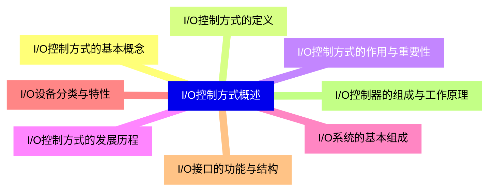
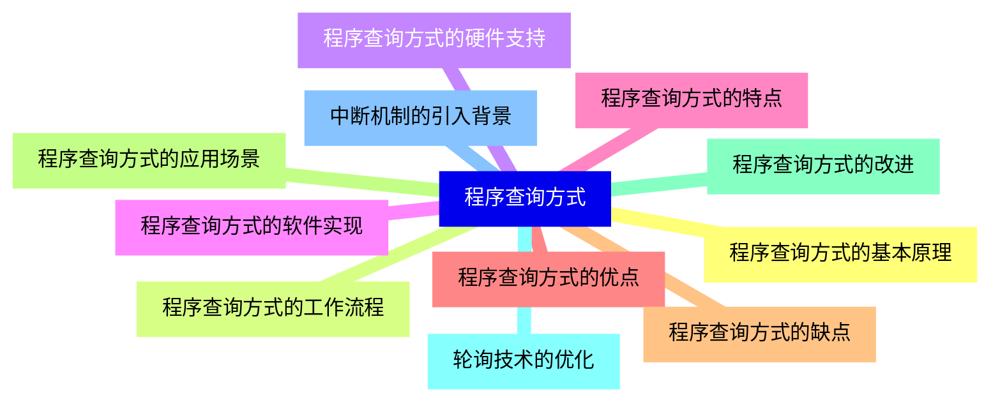
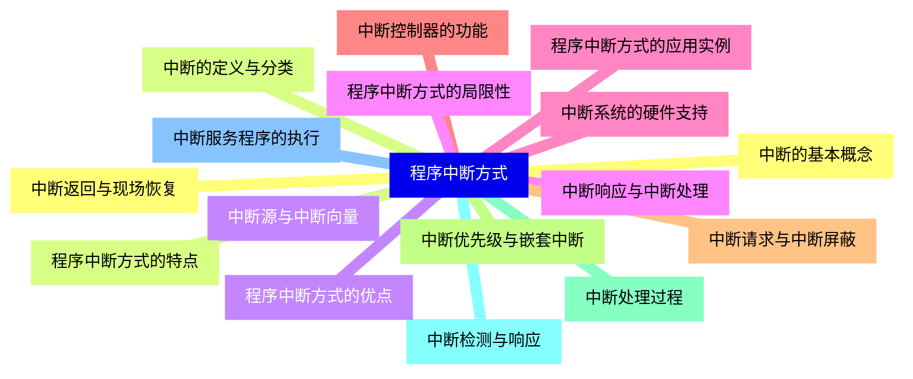
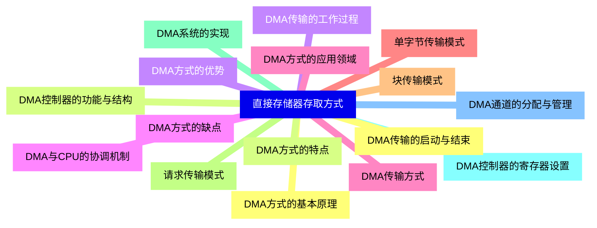
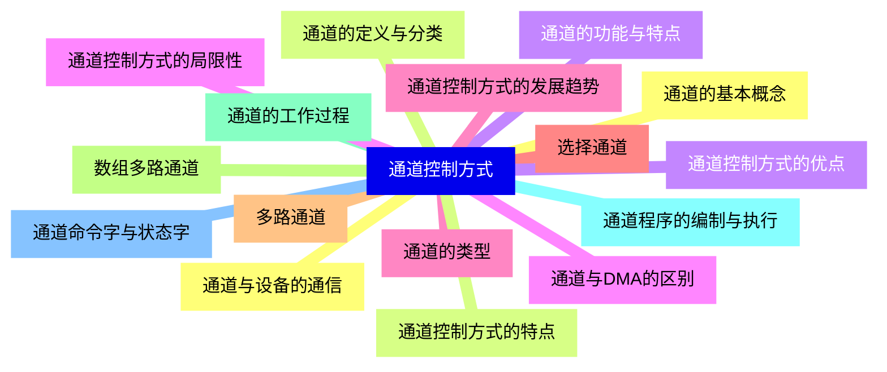
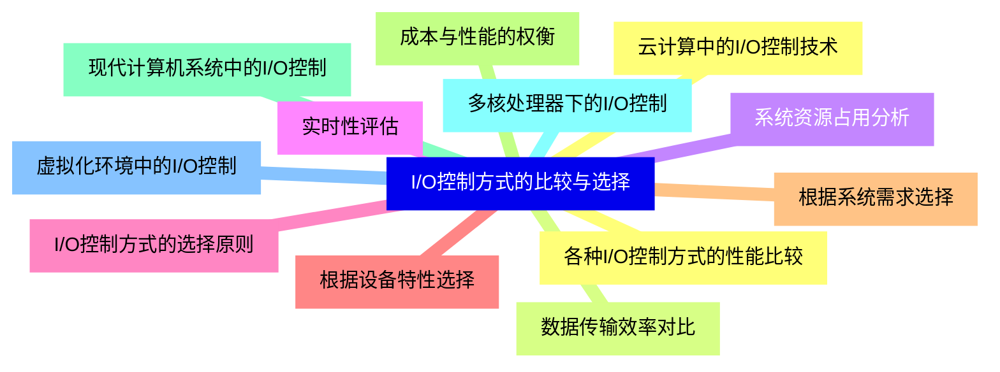
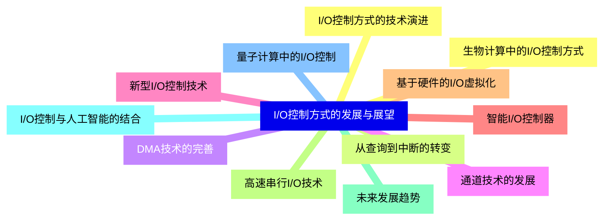


### 1 [I/O控制方式概述](#1)
#### 1.1 [I/O控制方式的基本概念](#1)
#### 1.2 [I/O控制方式的定义](#1)
#### 1.3 [I/O控制方式的作用与重要性](#1)
#### 1.4 [I/O控制方式的发展历程](#1)
#### 1.5 [I/O系统的基本组成](#1)
#### 1.6 [I/O设备分类与特性](#1)
#### 1.7 [I/O接口的功能与结构](#1)
#### 1.8 [I/O控制器的组成与工作原理](#1)
### 2 [程序查询方式](#2)
#### 2.1 [程序查询方式的基本原理](#2)
#### 2.2 [程序查询方式的工作流程](#2)
#### 2.3 [程序查询方式的硬件支持](#2)
#### 2.4 [程序查询方式的软件实现](#2)
#### 2.5 [程序查询方式的特点](#2)
#### 2.6 [程序查询方式的优点](#2)
#### 2.7 [程序查询方式的缺点](#2)
#### 2.8 [程序查询方式的应用场景](#2)
#### 2.9 [程序查询方式的改进](#2)
#### 2.10 [轮询技术的优化](#2)
#### 2.11 [中断机制的引入背景](#2)
### 3 [程序中断方式](#3)
#### 3.1 [中断的基本概念](#3)
#### 3.2 [中断的定义与分类](#3)
#### 3.3 [中断源与中断向量](#3)
#### 3.4 [中断响应与中断处理](#3)
#### 3.5 [中断系统的硬件支持](#3)
#### 3.6 [中断控制器的功能](#3)
#### 3.7 [中断请求与中断屏蔽](#3)
#### 3.8 [中断优先级与嵌套中断](#3)
#### 3.9 [中断处理过程](#3)
#### 3.10 [中断检测与响应](#3)
#### 3.11 [中断服务程序的执行](#3)
#### 3.12 [中断返回与现场恢复](#3)
#### 3.13 [程序中断方式的特点](#3)
#### 3.14 [程序中断方式的优点](#3)
#### 3.15 [程序中断方式的局限性](#3)
#### 3.16 [程序中断方式的应用实例](#3)
### 4 [直接存储器存取方式](#4)
#### 4.1 [DMA方式的基本原理](#4)
#### 4.2 [DMA控制器的功能与结构](#4)
#### 4.3 [DMA传输的工作过程](#4)
#### 4.4 [DMA与CPU的协调机制](#4)
#### 4.5 [DMA传输方式](#4)
#### 4.6 [单字节传输模式](#4)
#### 4.7 [块传输模式](#4)
#### 4.8 [请求传输模式](#4)
#### 4.9 [DMA系统的实现](#4)
#### 4.10 [DMA控制器的寄存器设置](#4)
#### 4.11 [DMA通道的分配与管理](#4)
#### 4.12 [DMA传输的启动与结束](#4)
#### 4.13 [DMA方式的特点](#4)
#### 4.14 [DMA方式的优势](#4)
#### 4.15 [DMA方式的缺点](#4)
#### 4.16 [DMA方式的应用领域](#4)
### 5 [通道控制方式](#5)
#### 5.1 [通道的基本概念](#5)
#### 5.2 [通道的定义与分类](#5)
#### 5.3 [通道的功能与特点](#5)
#### 5.4 [通道与DMA的区别](#5)
#### 5.5 [通道的类型](#5)
#### 5.6 [选择通道](#5)
#### 5.7 [多路通道](#5)
#### 5.8 [数组多路通道](#5)
#### 5.9 [通道的工作过程](#5)
#### 5.10 [通道程序的编制与执行](#5)
#### 5.11 [通道命令字与状态字](#5)
#### 5.12 [通道与设备的通信](#5)
#### 5.13 [通道控制方式的特点](#5)
#### 5.14 [通道控制方式的优点](#5)
#### 5.15 [通道控制方式的局限性](#5)
#### 5.16 [通道控制方式的发展趋势](#5)
### 6 [I/O控制方式的比较与选择](#6)
#### 6.1 [各种I/O控制方式的性能比较](#6)
#### 6.2 [数据传输效率对比](#6)
#### 6.3 [系统资源占用分析](#6)
#### 6.4 [实时性评估](#6)
#### 6.5 [I/O控制方式的选择原则](#6)
#### 6.6 [根据设备特性选择](#6)
#### 6.7 [根据系统需求选择](#6)
#### 6.8 [成本与性能的权衡](#6)
#### 6.9 [现代计算机系统中的I/O控制](#6)
#### 6.10 [多核处理器下的I/O控制](#6)
#### 6.11 [虚拟化环境中的I/O控制](#6)
#### 6.12 [云计算中的I/O控制技术](#6)
### 7 [I/O控制方式的发展与展望](#7)
#### 7.1 [I/O控制方式的技术演进](#7)
#### 7.2 [从查询到中断的转变](#7)
#### 7.3 [DMA技术的完善](#7)
#### 7.4 [通道技术的发展](#7)
#### 7.5 [新型I/O控制技术](#7)
#### 7.6 [智能I/O控制器](#7)
#### 7.7 [基于硬件的I/O虚拟化](#7)
#### 7.8 [高速串行I/O技术](#7)
#### 7.9 [未来发展趋势](#7)
#### 7.10 [I/O控制与人工智能的结合](#7)
#### 7.11 [量子计算中的I/O控制](#7)
#### 7.12 [生物计算中的I/O控制方式](#7)




### 1 I/O控制方式概述

---
### 1 I/O控制方式概述
___
#### 1.1 I/O控制方式的基本概念
___
#### 1.2 I/O控制方式的定义
___
#### 1.3 I/O控制方式的作用与重要性
___
#### 1.4 I/O控制方式的发展历程
___
#### 1.5 I/O系统的基本组成
___
#### 1.6 I/O设备分类与特性
___
#### 1.7 I/O接口的功能与结构
___
#### 1.8 I/O控制器的组成与工作原理
### 2 程序查询方式

---
### 2 程序查询方式
___
#### 2.1 程序查询方式的基本原理
___
#### 2.2 程序查询方式的工作流程
___
#### 2.3 程序查询方式的硬件支持
___
#### 2.4 程序查询方式的软件实现
___
#### 2.5 程序查询方式的特点
___
#### 2.6 程序查询方式的优点
___
#### 2.7 程序查询方式的缺点
___
#### 2.8 程序查询方式的应用场景
___
#### 2.9 程序查询方式的改进
___
#### 2.10 轮询技术的优化
___
#### 2.11 中断机制的引入背景
### 3 程序中断方式

---
### 3 程序中断方式
___
#### 3.1 中断的基本概念
___
#### 3.2 中断的定义与分类
___
#### 3.3 中断源与中断向量
___
#### 3.4 中断响应与中断处理
___
#### 3.5 中断系统的硬件支持
___
#### 3.6 中断控制器的功能
___
#### 3.7 中断请求与中断屏蔽
___
#### 3.8 中断优先级与嵌套中断
___
#### 3.9 中断处理过程
___
#### 3.10 中断检测与响应
___
#### 3.11 中断服务程序的执行
___
#### 3.12 中断返回与现场恢复
___
#### 3.13 程序中断方式的特点
___
#### 3.14 程序中断方式的优点
___
#### 3.15 程序中断方式的局限性
___
#### 3.16 程序中断方式的应用实例
### 4 直接存储器存取方式

---
### 4 直接存储器存取方式
___
#### 4.1 DMA方式的基本原理
___
#### 4.2 DMA控制器的功能与结构
___
#### 4.3 DMA传输的工作过程
___
#### 4.4 DMA与CPU的协调机制
___
#### 4.5 DMA传输方式
___
#### 4.6 单字节传输模式
___
#### 4.7 块传输模式
___
#### 4.8 请求传输模式
___
#### 4.9 DMA系统的实现
___
#### 4.10 DMA控制器的寄存器设置
___
#### 4.11 DMA通道的分配与管理
___
#### 4.12 DMA传输的启动与结束
___
#### 4.13 DMA方式的特点
___
#### 4.14 DMA方式的优势
___
#### 4.15 DMA方式的缺点
___
#### 4.16 DMA方式的应用领域
### 5 通道控制方式

---
### 5 通道控制方式
___
#### 5.1 通道的基本概念
___
#### 5.2 通道的定义与分类
___
#### 5.3 通道的功能与特点
___
#### 5.4 通道与DMA的区别
___
#### 5.5 通道的类型
___
#### 5.6 选择通道
___
#### 5.7 多路通道
___
#### 5.8 数组多路通道
___
#### 5.9 通道的工作过程
___
#### 5.10 通道程序的编制与执行
___
#### 5.11 通道命令字与状态字
___
#### 5.12 通道与设备的通信
___
#### 5.13 通道控制方式的特点
___
#### 5.14 通道控制方式的优点
___
#### 5.15 通道控制方式的局限性
___
#### 5.16 通道控制方式的发展趋势
### 6 I/O控制方式的比较与选择

---
### 6 I/O控制方式的比较与选择
___
#### 6.1 各种I/O控制方式的性能比较
___
#### 6.2 数据传输效率对比
___
#### 6.3 系统资源占用分析
___
#### 6.4 实时性评估
___
#### 6.5 I/O控制方式的选择原则
___
#### 6.6 根据设备特性选择
___
#### 6.7 根据系统需求选择
___
#### 6.8 成本与性能的权衡
___
#### 6.9 现代计算机系统中的I/O控制
___
#### 6.10 多核处理器下的I/O控制
___
#### 6.11 虚拟化环境中的I/O控制
___
#### 6.12 云计算中的I/O控制技术
### 7 I/O控制方式的发展与展望

---
### 7 I/O控制方式的发展与展望
___
#### 7.1 I/O控制方式的技术演进
___
#### 7.2 从查询到中断的转变
___
#### 7.3 DMA技术的完善
___
#### 7.4 通道技术的发展
___
#### 7.5 新型I/O控制技术
___
#### 7.6 智能I/O控制器
___
#### 7.7 基于硬件的I/O虚拟化
___
#### 7.8 高速串行I/O技术
___
#### 7.9 未来发展趋势
___
#### 7.10 I/O控制与人工智能的结合
___
#### 7.11 量子计算中的I/O控制
___
#### 7.12 生物计算中的I/O控制方式


### 1 I/O控制方式概述{#1}

{}

<--->
{}
{}
{}
{}
{}
{}
{}
{}
{}
{}
{}
{}
{}
{}
{}
{}
{}

### 2 程序查询方式{#2}

{}
{}
{}
{}
{}
{}
{}
{}
{}
{}
{}
{}
{}
{}
{}
{}
{}
{}
{}
{}
{}
{}
{}
<--->

{}

### 3 程序中断方式{#3}

{}

<--->
{}
{}
{}
{}
{}
{}
{}
{}
{}
{}
{}
{}
{}
{}
{}
{}
{}
{}
{}
{}
{}
{}
{}
{}
{}
{}
{}
{}
{}
{}
{}
{}
{}

### 4 直接存储器存取方式{#4}

{}
{}
{}
{}
{}
{}
{}
{}
{}
{}
{}
{}
{}
{}
{}
{}
{}
{}
{}
{}
{}
{}
{}
{}
{}
{}
{}
{}
{}
{}
{}
{}
{}
<--->

{}

### 5 通道控制方式{#5}

{}

<--->
{}
{}
{}
{}
{}
{}
{}
{}
{}
{}
{}
{}
{}
{}
{}
{}
{}
{}
{}
{}
{}
{}
{}
{}
{}
{}
{}
{}
{}
{}
{}
{}
{}

### 6 I/O控制方式的比较与选择{#6}

{}
{}
{}
{}
{}
{}
{}
{}
{}
{}
{}
{}
{}
{}
{}
{}
{}
{}
{}
{}
{}
{}
{}
{}
{}
<--->

{}

### 7 I/O控制方式的发展与展望{#7}

{}

<--->
{}
{}
{}
{}
{}
{}
{}
{}
{}
{}
{}
{}
{}
{}
{}
{}
{}
{}
{}
{}
{}
{}
{}
{}
{}
