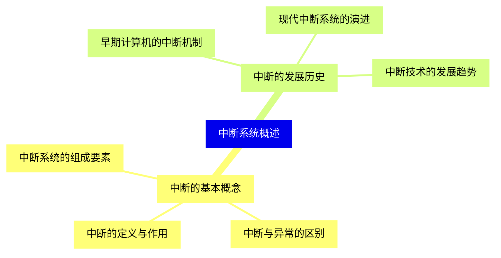
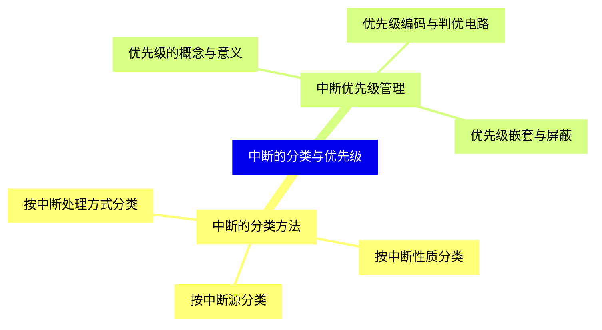
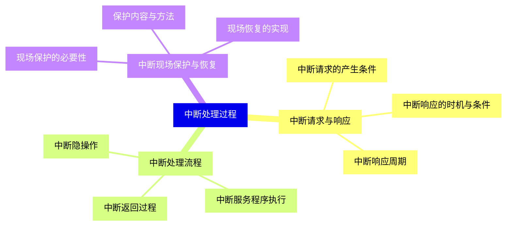
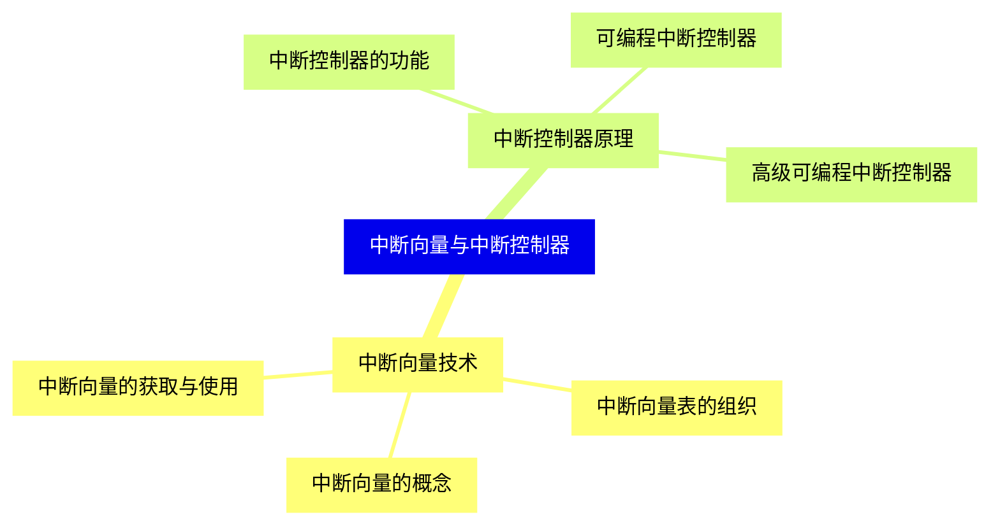
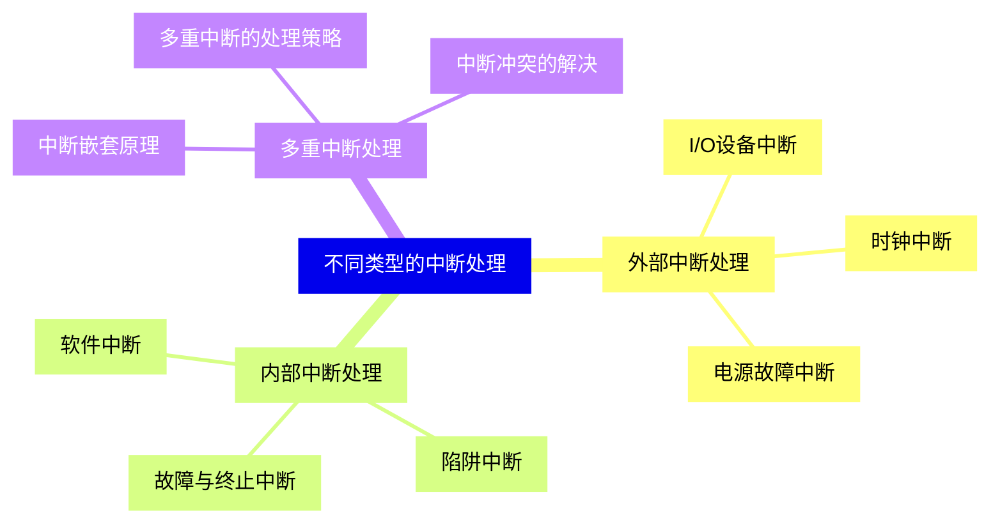
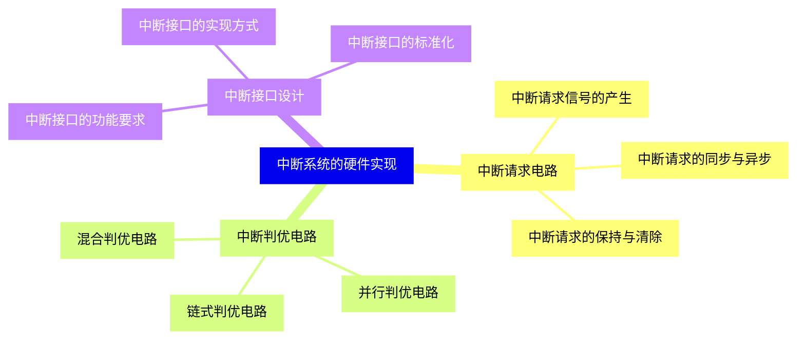
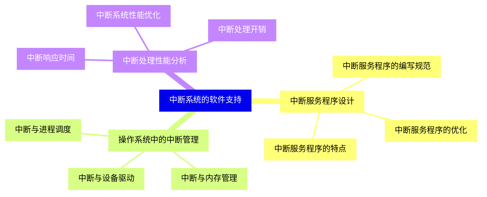
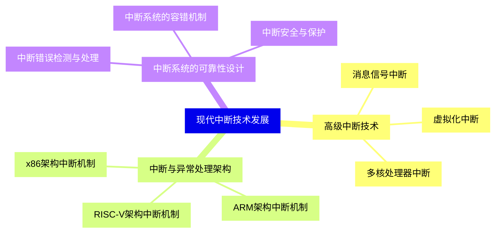
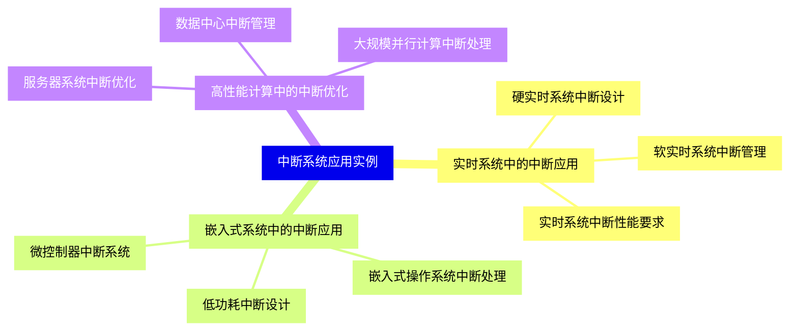
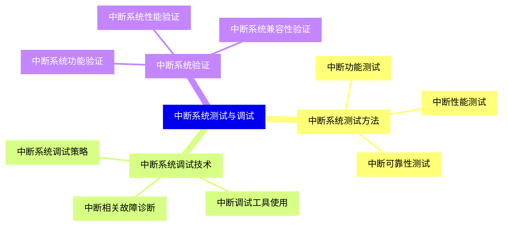


### 1 [中断系统概述](#1)
#### 1.1 [中断的基本概念](#1)
##### 1.1.1 [中断的定义与作用](#1)
##### 1.1.2 [中断与异常的区别](#1)
##### 1.1.3 [中断系统的组成要素](#1)
#### 1.2 [中断的发展历史](#1)
##### 1.2.1 [早期计算机的中断机制](#1)
##### 1.2.2 [现代中断系统的演进](#1)
##### 1.2.3 [中断技术的发展趋势](#1)
### 2 [中断的分类与优先级](#2)
#### 2.1 [中断的分类方法](#2)
##### 2.1.1 [按中断源分类](#2)
##### 2.1.2 [按中断性质分类](#2)
##### 2.1.3 [按中断处理方式分类](#2)
#### 2.2 [中断优先级管理](#2)
##### 2.2.1 [优先级的概念与意义](#2)
##### 2.2.2 [优先级编码与判优电路](#2)
##### 2.2.3 [优先级嵌套与屏蔽](#2)
### 3 [中断处理过程](#3)
#### 3.1 [中断请求与响应](#3)
##### 3.1.1 [中断请求的产生条件](#3)
##### 3.1.2 [中断响应的时机与条件](#3)
##### 3.1.3 [中断响应周期](#3)
#### 3.2 [中断处理流程](#3)
##### 3.2.1 [中断隐操作](#3)
##### 3.2.2 [中断服务程序执行](#3)
##### 3.2.3 [中断返回过程](#3)
#### 3.3 [中断现场保护与恢复](#3)
##### 3.3.1 [现场保护的必要性](#3)
##### 3.3.2 [保护内容与方法](#3)
##### 3.3.3 [现场恢复的实现](#3)
### 4 [中断向量与中断控制器](#4)
#### 4.1 [中断向量技术](#4)
##### 4.1.1 [中断向量的概念](#4)
##### 4.1.2 [中断向量表的组织](#4)
##### 4.1.3 [中断向量的获取与使用](#4)
#### 4.2 [中断控制器原理](#4)
##### 4.2.1 [中断控制器的功能](#4)
##### 4.2.2 [可编程中断控制器](#4)
##### 4.2.3 [高级可编程中断控制器](#4)
### 5 [不同类型的中断处理](#5)
#### 5.1 [外部中断处理](#5)
##### 5.1.1 [I/O设备中断](#5)
##### 5.1.2 [时钟中断](#5)
##### 5.1.3 [电源故障中断](#5)
#### 5.2 [内部中断处理](#5)
##### 5.2.1 [软件中断](#5)
##### 5.2.2 [陷阱中断](#5)
##### 5.2.3 [故障与终止中断](#5)
#### 5.3 [多重中断处理](#5)
##### 5.3.1 [中断嵌套原理](#5)
##### 5.3.2 [多重中断的处理策略](#5)
##### 5.3.3 [中断冲突的解决](#5)
### 6 [中断系统的硬件实现](#6)
#### 6.1 [中断请求电路](#6)
##### 6.1.1 [中断请求信号的产生](#6)
##### 6.1.2 [中断请求的同步与异步](#6)
##### 6.1.3 [中断请求的保持与清除](#6)
#### 6.2 [中断判优电路](#6)
##### 6.2.1 [链式判优电路](#6)
##### 6.2.2 [并行判优电路](#6)
##### 6.2.3 [混合判优电路](#6)
#### 6.3 [中断接口设计](#6)
##### 6.3.1 [中断接口的功能要求](#6)
##### 6.3.2 [中断接口的实现方式](#6)
##### 6.3.3 [中断接口的标准化](#6)
### 7 [中断系统的软件支持](#7)
#### 7.1 [中断服务程序设计](#7)
##### 7.1.1 [中断服务程序的特点](#7)
##### 7.1.2 [中断服务程序的编写规范](#7)
##### 7.1.3 [中断服务程序的优化](#7)
#### 7.2 [操作系统中的中断管理](#7)
##### 7.2.1 [中断与进程调度](#7)
##### 7.2.2 [中断与内存管理](#7)
##### 7.2.3 [中断与设备驱动](#7)
#### 7.3 [中断处理性能分析](#7)
##### 7.3.1 [中断响应时间](#7)
##### 7.3.2 [中断处理开销](#7)
##### 7.3.3 [中断系统性能优化](#7)
### 8 [现代中断技术发展](#8)
#### 8.1 [高级中断技术](#8)
##### 8.1.1 [消息信号中断](#8)
##### 8.1.2 [虚拟化中断](#8)
##### 8.1.3 [多核处理器中断](#8)
#### 8.2 [中断与异常处理架构](#8)
##### 8.2.1 [x86架构中断机制](#8)
##### 8.2.2 [ARM架构中断机制](#8)
##### 8.2.3 [RISC-V架构中断机制](#8)
#### 8.3 [中断系统的可靠性设计](#8)
##### 8.3.1 [中断错误检测与处理](#8)
##### 8.3.2 [中断系统的容错机制](#8)
##### 8.3.3 [中断安全与保护](#8)
### 9 [中断系统应用实例](#9)
#### 9.1 [实时系统中的中断应用](#9)
##### 9.1.1 [硬实时系统中断设计](#9)
##### 9.1.2 [软实时系统中断管理](#9)
##### 9.1.3 [实时系统中断性能要求](#9)
#### 9.2 [嵌入式系统中的中断应用](#9)
##### 9.2.1 [微控制器中断系统](#9)
##### 9.2.2 [嵌入式操作系统中断处理](#9)
##### 9.2.3 [低功耗中断设计](#9)
#### 9.3 [高性能计算中的中断优化](#9)
##### 9.3.1 [服务器系统中断优化](#9)
##### 9.3.2 [数据中心中断管理](#9)
##### 9.3.3 [大规模并行计算中断处理](#9)
### 10 [中断系统测试与调试](#10)
#### 10.1 [中断系统测试方法](#10)
##### 10.1.1 [中断功能测试](#10)
##### 10.1.2 [中断性能测试](#10)
##### 10.1.3 [中断可靠性测试](#10)
#### 10.2 [中断系统调试技术](#10)
##### 10.2.1 [中断相关故障诊断](#10)
##### 10.2.2 [中断调试工具使用](#10)
##### 10.2.3 [中断系统调试策略](#10)
#### 10.3 [中断系统验证](#10)
##### 10.3.1 [中断系统功能验证](#10)
##### 10.3.2 [中断系统性能验证](#10)
##### 10.3.3 [中断系统兼容性验证](#10)




### 1 中断系统概述

---
### 1 中断系统概述
___
#### 1.1 中断的基本概念
___
##### 1.1.1 中断的定义与作用
___
##### 1.1.2 中断与异常的区别
___
##### 1.1.3 中断系统的组成要素
___
#### 1.2 中断的发展历史
___
##### 1.2.1 早期计算机的中断机制
___
##### 1.2.2 现代中断系统的演进
___
##### 1.2.3 中断技术的发展趋势
### 2 中断的分类与优先级

---
### 2 中断的分类与优先级
___
#### 2.1 中断的分类方法
___
##### 2.1.1 按中断源分类
___
##### 2.1.2 按中断性质分类
___
##### 2.1.3 按中断处理方式分类
___
#### 2.2 中断优先级管理
___
##### 2.2.1 优先级的概念与意义
___
##### 2.2.2 优先级编码与判优电路
___
##### 2.2.3 优先级嵌套与屏蔽
### 3 中断处理过程

---
### 3 中断处理过程
___
#### 3.1 中断请求与响应
___
##### 3.1.1 中断请求的产生条件
___
##### 3.1.2 中断响应的时机与条件
___
##### 3.1.3 中断响应周期
___
#### 3.2 中断处理流程
___
##### 3.2.1 中断隐操作
___
##### 3.2.2 中断服务程序执行
___
##### 3.2.3 中断返回过程
___
#### 3.3 中断现场保护与恢复
___
##### 3.3.1 现场保护的必要性
___
##### 3.3.2 保护内容与方法
___
##### 3.3.3 现场恢复的实现
### 4 中断向量与中断控制器

---
### 4 中断向量与中断控制器
___
#### 4.1 中断向量技术
___
##### 4.1.1 中断向量的概念
___
##### 4.1.2 中断向量表的组织
___
##### 4.1.3 中断向量的获取与使用
___
#### 4.2 中断控制器原理
___
##### 4.2.1 中断控制器的功能
___
##### 4.2.2 可编程中断控制器
___
##### 4.2.3 高级可编程中断控制器
### 5 不同类型的中断处理

---
### 5 不同类型的中断处理
___
#### 5.1 外部中断处理
___
##### 5.1.1 I/O设备中断
___
##### 5.1.2 时钟中断
___
##### 5.1.3 电源故障中断
___
#### 5.2 内部中断处理
___
##### 5.2.1 软件中断
___
##### 5.2.2 陷阱中断
___
##### 5.2.3 故障与终止中断
___
#### 5.3 多重中断处理
___
##### 5.3.1 中断嵌套原理
___
##### 5.3.2 多重中断的处理策略
___
##### 5.3.3 中断冲突的解决
### 6 中断系统的硬件实现

---
### 6 中断系统的硬件实现
___
#### 6.1 中断请求电路
___
##### 6.1.1 中断请求信号的产生
___
##### 6.1.2 中断请求的同步与异步
___
##### 6.1.3 中断请求的保持与清除
___
#### 6.2 中断判优电路
___
##### 6.2.1 链式判优电路
___
##### 6.2.2 并行判优电路
___
##### 6.2.3 混合判优电路
___
#### 6.3 中断接口设计
___
##### 6.3.1 中断接口的功能要求
___
##### 6.3.2 中断接口的实现方式
___
##### 6.3.3 中断接口的标准化
### 7 中断系统的软件支持

---
### 7 中断系统的软件支持
___
#### 7.1 中断服务程序设计
___
##### 7.1.1 中断服务程序的特点
___
##### 7.1.2 中断服务程序的编写规范
___
##### 7.1.3 中断服务程序的优化
___
#### 7.2 操作系统中的中断管理
___
##### 7.2.1 中断与进程调度
___
##### 7.2.2 中断与内存管理
___
##### 7.2.3 中断与设备驱动
___
#### 7.3 中断处理性能分析
___
##### 7.3.1 中断响应时间
___
##### 7.3.2 中断处理开销
___
##### 7.3.3 中断系统性能优化
### 8 现代中断技术发展

---
### 8 现代中断技术发展
___
#### 8.1 高级中断技术
___
##### 8.1.1 消息信号中断
___
##### 8.1.2 虚拟化中断
___
##### 8.1.3 多核处理器中断
___
#### 8.2 中断与异常处理架构
___
##### 8.2.1 x86架构中断机制
___
##### 8.2.2 ARM架构中断机制
___
##### 8.2.3 RISC-V架构中断机制
___
#### 8.3 中断系统的可靠性设计
___
##### 8.3.1 中断错误检测与处理
___
##### 8.3.2 中断系统的容错机制
___
##### 8.3.3 中断安全与保护
### 9 中断系统应用实例

---
### 9 中断系统应用实例
___
#### 9.1 实时系统中的中断应用
___
##### 9.1.1 硬实时系统中断设计
___
##### 9.1.2 软实时系统中断管理
___
##### 9.1.3 实时系统中断性能要求
___
#### 9.2 嵌入式系统中的中断应用
___
##### 9.2.1 微控制器中断系统
___
##### 9.2.2 嵌入式操作系统中断处理
___
##### 9.2.3 低功耗中断设计
___
#### 9.3 高性能计算中的中断优化
___
##### 9.3.1 服务器系统中断优化
___
##### 9.3.2 数据中心中断管理
___
##### 9.3.3 大规模并行计算中断处理
### 10 中断系统测试与调试

---
### 10 中断系统测试与调试
___
#### 10.1 中断系统测试方法
___
##### 10.1.1 中断功能测试
___
##### 10.1.2 中断性能测试
___
##### 10.1.3 中断可靠性测试
___
#### 10.2 中断系统调试技术
___
##### 10.2.1 中断相关故障诊断
___
##### 10.2.2 中断调试工具使用
___
##### 10.2.3 中断系统调试策略
___
#### 10.3 中断系统验证
___
##### 10.3.1 中断系统功能验证
___
##### 10.3.2 中断系统性能验证
___
##### 10.3.3 中断系统兼容性验证


### 1 中断系统概述{#1}

{}

<--->
{}
{}
{}
{}
{}
{}
{}
{}
{}
{}
{}
{}
{}
{}
{}
{}
{}

### 2 中断的分类与优先级{#2}

{}
{}
{}
{}
{}
{}
{}
{}
{}
{}
{}
{}
{}
{}
{}
{}
{}
<--->

{}

### 3 中断处理过程{#3}

{}

<--->
{}
{}
{}
{}
{}
{}
{}
{}
{}
{}
{}
{}
{}
{}
{}
{}
{}
{}
{}
{}
{}
{}
{}
{}
{}

### 4 中断向量与中断控制器{#4}

{}
{}
{}
{}
{}
{}
{}
{}
{}
{}
{}
{}
{}
{}
{}
{}
{}
<--->

{}

### 5 不同类型的中断处理{#5}

{}

<--->
{}
{}
{}
{}
{}
{}
{}
{}
{}
{}
{}
{}
{}
{}
{}
{}
{}
{}
{}
{}
{}
{}
{}
{}
{}

### 6 中断系统的硬件实现{#6}

{}
{}
{}
{}
{}
{}
{}
{}
{}
{}
{}
{}
{}
{}
{}
{}
{}
{}
{}
{}
{}
{}
{}
{}
{}
<--->

{}

### 7 中断系统的软件支持{#7}

{}

<--->
{}
{}
{}
{}
{}
{}
{}
{}
{}
{}
{}
{}
{}
{}
{}
{}
{}
{}
{}
{}
{}
{}
{}
{}
{}

### 8 现代中断技术发展{#8}

{}
{}
{}
{}
{}
{}
{}
{}
{}
{}
{}
{}
{}
{}
{}
{}
{}
{}
{}
{}
{}
{}
{}
{}
{}
<--->

{}

### 9 中断系统应用实例{#9}

{}

<--->
{}
{}
{}
{}
{}
{}
{}
{}
{}
{}
{}
{}
{}
{}
{}
{}
{}
{}
{}
{}
{}
{}
{}
{}
{}

### 10 中断系统测试与调试{#10}

{}
{}
{}
{}
{}
{}
{}
{}
{}
{}
{}
{}
{}
{}
{}
{}
{}
{}
{}
{}
{}
{}
{}
{}
{}
<--->

{}
