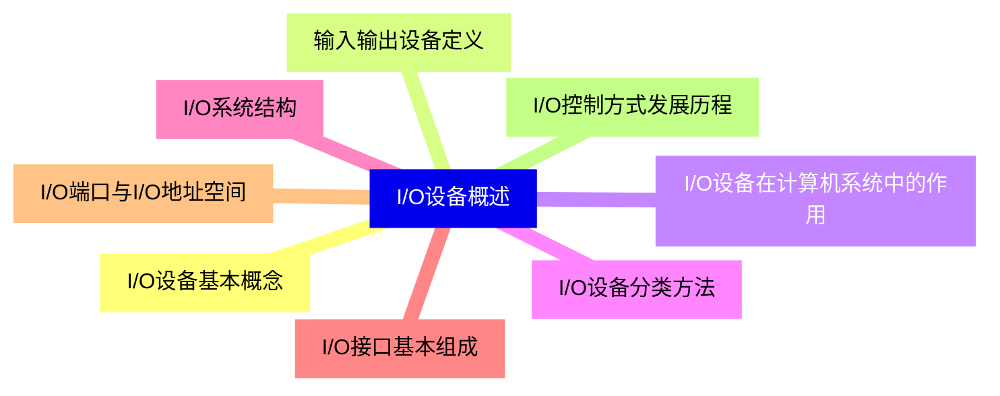
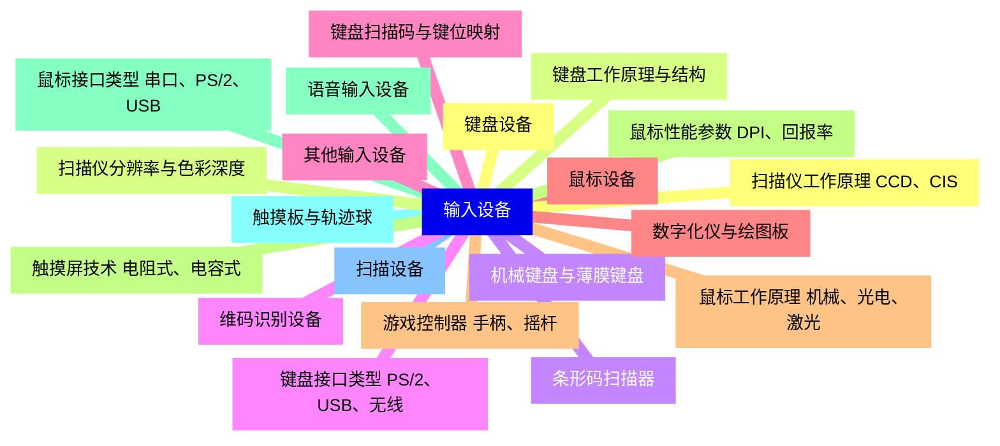
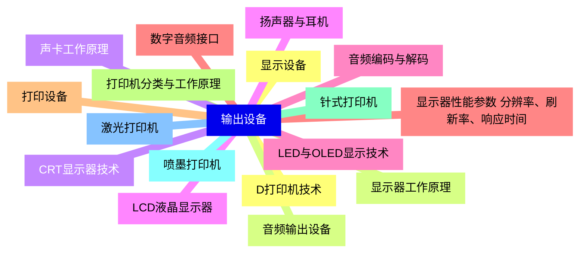
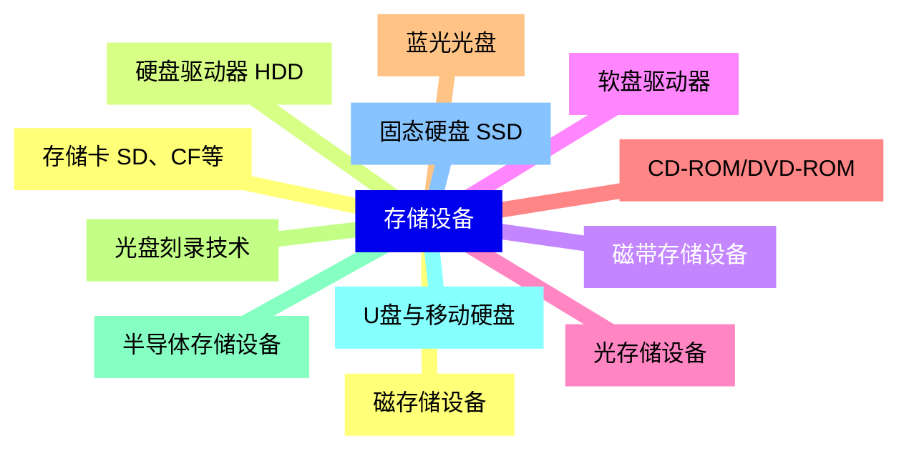
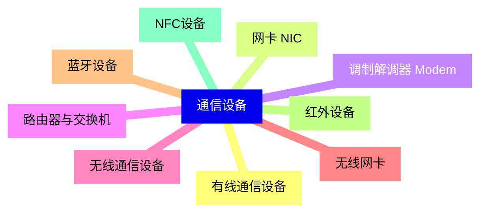
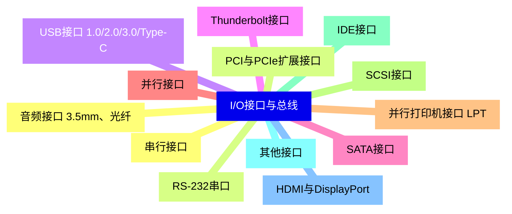
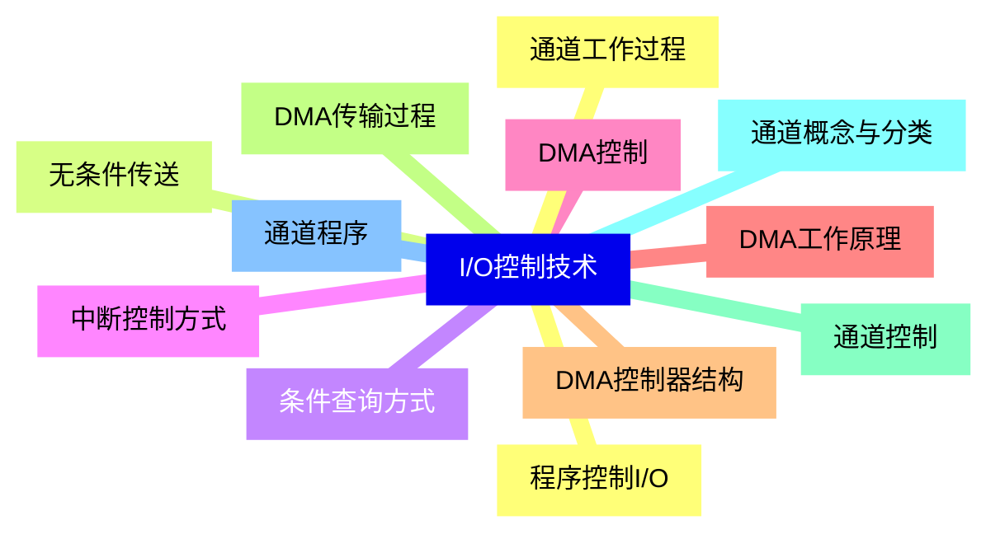
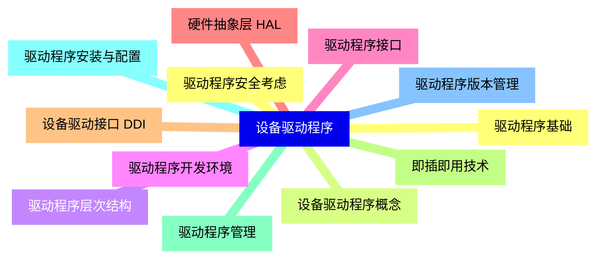
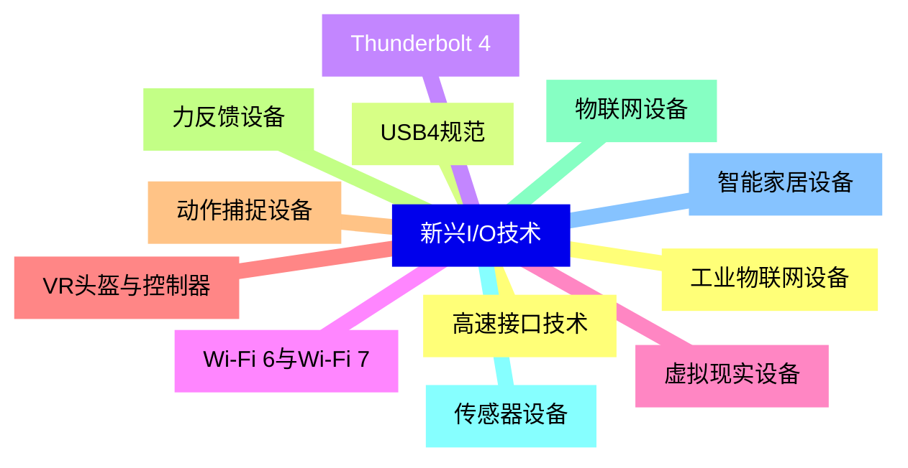
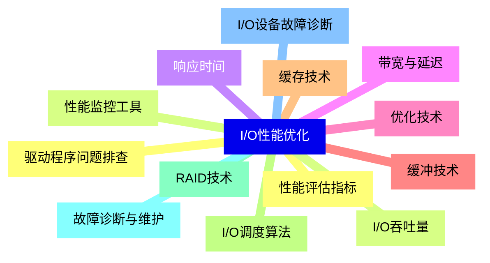


### 1 [I/O设备概述](#1)
#### 1.1 [I/O设备基本概念](#1)
#### 1.2 [输入输出设备定义](#1)
#### 1.3 [I/O设备在计算机系统中的作用](#1)
#### 1.4 [I/O设备分类方法](#1)
#### 1.5 [I/O系统结构](#1)
#### 1.6 [I/O接口基本组成](#1)
#### 1.7 [I/O端口与I/O地址空间](#1)
#### 1.8 [I/O控制方式发展历程](#1)
### 2 [输入设备](#2)
#### 2.1 [键盘设备](#2)
#### 2.2 [键盘工作原理与结构](#2)
#### 2.3 [机械键盘与薄膜键盘](#2)
#### 2.4 [键盘接口类型 PS/2、USB、无线](#2)
#### 2.5 [键盘扫描码与键位映射](#2)
#### 2.6 [鼠标设备](#2)
#### 2.7 [鼠标工作原理 机械、光电、激光](#2)
#### 2.8 [鼠标性能参数 DPI、回报率](#2)
#### 2.9 [鼠标接口类型 串口、PS/2、USB](#2)
#### 2.10 [触摸板与轨迹球](#2)
#### 2.11 [扫描设备](#2)
#### 2.12 [扫描仪工作原理 CCD、CIS](#2)
#### 2.13 [扫描仪分辨率与色彩深度](#2)
#### 2.14 [条形码扫描器](#2)
#### 2.15 [维码识别设备](#2)
#### 2.16 [其他输入设备](#2)
#### 2.17 [数字化仪与绘图板](#2)
#### 2.18 [游戏控制器 手柄、摇杆](#2)
#### 2.19 [触摸屏技术 电阻式、电容式](#2)
#### 2.20 [语音输入设备](#2)
### 3 [输出设备](#3)
#### 3.1 [显示设备](#3)
#### 3.2 [显示器工作原理](#3)
#### 3.3 [CRT显示器技术](#3)
#### 3.4 [LCD液晶显示器](#3)
#### 3.5 [LED与OLED显示技术](#3)
#### 3.6 [显示器性能参数 分辨率、刷新率、响应时间](#3)
#### 3.7 [打印设备](#3)
#### 3.8 [打印机分类与工作原理](#3)
#### 3.9 [针式打印机](#3)
#### 3.10 [喷墨打印机](#3)
#### 3.11 [激光打印机](#3)
#### 3.12 [D打印机技术](#3)
#### 3.13 [音频输出设备](#3)
#### 3.14 [声卡工作原理](#3)
#### 3.15 [扬声器与耳机](#3)
#### 3.16 [音频编码与解码](#3)
#### 3.17 [数字音频接口](#3)
### 4 [存储设备](#4)
#### 4.1 [磁存储设备](#4)
#### 4.2 [硬盘驱动器 HDD](#4)
#### 4.3 [磁带存储设备](#4)
#### 4.4 [软盘驱动器](#4)
#### 4.5 [光存储设备](#4)
#### 4.6 [CD-ROM/DVD-ROM](#4)
#### 4.7 [蓝光光盘](#4)
#### 4.8 [光盘刻录技术](#4)
#### 4.9 [半导体存储设备](#4)
#### 4.10 [U盘与移动硬盘](#4)
#### 4.11 [固态硬盘 SSD](#4)
#### 4.12 [存储卡 SD、CF等](#4)
### 5 [通信设备](#5)
#### 5.1 [有线通信设备](#5)
#### 5.2 [网卡 NIC](#5)
#### 5.3 [调制解调器 Modem](#5)
#### 5.4 [路由器与交换机](#5)
#### 5.5 [无线通信设备](#5)
#### 5.6 [无线网卡](#5)
#### 5.7 [蓝牙设备](#5)
#### 5.8 [红外设备](#5)
#### 5.9 [NFC设备](#5)
### 6 [I/O接口与总线](#6)
#### 6.1 [串行接口](#6)
#### 6.2 [RS-232串口](#6)
#### 6.3 [USB接口 1.0/2.0/3.0/Type-C](#6)
#### 6.4 [Thunderbolt接口](#6)
#### 6.5 [SATA接口](#6)
#### 6.6 [并行接口](#6)
#### 6.7 [并行打印机接口 LPT](#6)
#### 6.8 [SCSI接口](#6)
#### 6.9 [IDE接口](#6)
#### 6.10 [其他接口](#6)
#### 6.11 [HDMI与DisplayPort](#6)
#### 6.12 [音频接口 3.5mm、光纤](#6)
#### 6.13 [PCI与PCIe扩展接口](#6)
### 7 [I/O控制技术](#7)
#### 7.1 [程序控制I/O](#7)
#### 7.2 [无条件传送](#7)
#### 7.3 [条件查询方式](#7)
#### 7.4 [中断控制方式](#7)
#### 7.5 [DMA控制](#7)
#### 7.6 [DMA工作原理](#7)
#### 7.7 [DMA控制器结构](#7)
#### 7.8 [DMA传输过程](#7)
#### 7.9 [通道控制](#7)
#### 7.10 [通道概念与分类](#7)
#### 7.11 [通道程序](#7)
#### 7.12 [通道工作过程](#7)
### 8 [设备驱动程序](#8)
#### 8.1 [驱动程序基础](#8)
#### 8.2 [设备驱动程序概念](#8)
#### 8.3 [驱动程序层次结构](#8)
#### 8.4 [驱动程序开发环境](#8)
#### 8.5 [驱动程序接口](#8)
#### 8.6 [硬件抽象层 HAL](#8)
#### 8.7 [设备驱动接口 DDI](#8)
#### 8.8 [即插即用技术](#8)
#### 8.9 [驱动程序管理](#8)
#### 8.10 [驱动程序安装与配置](#8)
#### 8.11 [驱动程序版本管理](#8)
#### 8.12 [驱动程序安全考虑](#8)
### 9 [新兴I/O技术](#9)
#### 9.1 [高速接口技术](#9)
#### 9.2 [USB4规范](#9)
#### 9.3 [Thunderbolt 4](#9)
#### 9.4 [Wi-Fi 6与Wi-Fi 7](#9)
#### 9.5 [虚拟现实设备](#9)
#### 9.6 [VR头盔与控制器](#9)
#### 9.7 [动作捕捉设备](#9)
#### 9.8 [力反馈设备](#9)
#### 9.9 [物联网设备](#9)
#### 9.10 [传感器设备](#9)
#### 9.11 [智能家居设备](#9)
#### 9.12 [工业物联网设备](#9)
### 10 [I/O性能优化](#10)
#### 10.1 [性能评估指标](#10)
#### 10.2 [I/O吞吐量](#10)
#### 10.3 [响应时间](#10)
#### 10.4 [带宽与延迟](#10)
#### 10.5 [优化技术](#10)
#### 10.6 [缓冲技术](#10)
#### 10.7 [缓存技术](#10)
#### 10.8 [I/O调度算法](#10)
#### 10.9 [RAID技术](#10)
#### 10.10 [故障诊断与维护](#10)
#### 10.11 [I/O设备故障诊断](#10)
#### 10.12 [驱动程序问题排查](#10)
#### 10.13 [性能监控工具](#10)




### 1 I/O设备概述

---
### 1 I/O设备概述
___
#### 1.1 I/O设备基本概念
___
#### 1.2 输入输出设备定义
___
#### 1.3 I/O设备在计算机系统中的作用
___
#### 1.4 I/O设备分类方法
___
#### 1.5 I/O系统结构
___
#### 1.6 I/O接口基本组成
___
#### 1.7 I/O端口与I/O地址空间
___
#### 1.8 I/O控制方式发展历程
### 2 输入设备

---
### 2 输入设备
___
#### 2.1 键盘设备
___
#### 2.2 键盘工作原理与结构
___
#### 2.3 机械键盘与薄膜键盘
___
#### 2.4 键盘接口类型 PS/2、USB、无线
___
#### 2.5 键盘扫描码与键位映射
___
#### 2.6 鼠标设备
___
#### 2.7 鼠标工作原理 机械、光电、激光
___
#### 2.8 鼠标性能参数 DPI、回报率
___
#### 2.9 鼠标接口类型 串口、PS/2、USB
___
#### 2.10 触摸板与轨迹球
___
#### 2.11 扫描设备
___
#### 2.12 扫描仪工作原理 CCD、CIS
___
#### 2.13 扫描仪分辨率与色彩深度
___
#### 2.14 条形码扫描器
___
#### 2.15 维码识别设备
___
#### 2.16 其他输入设备
___
#### 2.17 数字化仪与绘图板
___
#### 2.18 游戏控制器 手柄、摇杆
___
#### 2.19 触摸屏技术 电阻式、电容式
___
#### 2.20 语音输入设备
### 3 输出设备

---
### 3 输出设备
___
#### 3.1 显示设备
___
#### 3.2 显示器工作原理
___
#### 3.3 CRT显示器技术
___
#### 3.4 LCD液晶显示器
___
#### 3.5 LED与OLED显示技术
___
#### 3.6 显示器性能参数 分辨率、刷新率、响应时间
___
#### 3.7 打印设备
___
#### 3.8 打印机分类与工作原理
___
#### 3.9 针式打印机
___
#### 3.10 喷墨打印机
___
#### 3.11 激光打印机
___
#### 3.12 D打印机技术
___
#### 3.13 音频输出设备
___
#### 3.14 声卡工作原理
___
#### 3.15 扬声器与耳机
___
#### 3.16 音频编码与解码
___
#### 3.17 数字音频接口
### 4 存储设备

---
### 4 存储设备
___
#### 4.1 磁存储设备
___
#### 4.2 硬盘驱动器 HDD
___
#### 4.3 磁带存储设备
___
#### 4.4 软盘驱动器
___
#### 4.5 光存储设备
___
#### 4.6 CD-ROM/DVD-ROM
___
#### 4.7 蓝光光盘
___
#### 4.8 光盘刻录技术
___
#### 4.9 半导体存储设备
___
#### 4.10 U盘与移动硬盘
___
#### 4.11 固态硬盘 SSD
___
#### 4.12 存储卡 SD、CF等
### 5 通信设备

---
### 5 通信设备
___
#### 5.1 有线通信设备
___
#### 5.2 网卡 NIC
___
#### 5.3 调制解调器 Modem
___
#### 5.4 路由器与交换机
___
#### 5.5 无线通信设备
___
#### 5.6 无线网卡
___
#### 5.7 蓝牙设备
___
#### 5.8 红外设备
___
#### 5.9 NFC设备
### 6 I/O接口与总线

---
### 6 I/O接口与总线
___
#### 6.1 串行接口
___
#### 6.2 RS-232串口
___
#### 6.3 USB接口 1.0/2.0/3.0/Type-C
___
#### 6.4 Thunderbolt接口
___
#### 6.5 SATA接口
___
#### 6.6 并行接口
___
#### 6.7 并行打印机接口 LPT
___
#### 6.8 SCSI接口
___
#### 6.9 IDE接口
___
#### 6.10 其他接口
___
#### 6.11 HDMI与DisplayPort
___
#### 6.12 音频接口 3.5mm、光纤
___
#### 6.13 PCI与PCIe扩展接口
### 7 I/O控制技术

---
### 7 I/O控制技术
___
#### 7.1 程序控制I/O
___
#### 7.2 无条件传送
___
#### 7.3 条件查询方式
___
#### 7.4 中断控制方式
___
#### 7.5 DMA控制
___
#### 7.6 DMA工作原理
___
#### 7.7 DMA控制器结构
___
#### 7.8 DMA传输过程
___
#### 7.9 通道控制
___
#### 7.10 通道概念与分类
___
#### 7.11 通道程序
___
#### 7.12 通道工作过程
### 8 设备驱动程序

---
### 8 设备驱动程序
___
#### 8.1 驱动程序基础
___
#### 8.2 设备驱动程序概念
___
#### 8.3 驱动程序层次结构
___
#### 8.4 驱动程序开发环境
___
#### 8.5 驱动程序接口
___
#### 8.6 硬件抽象层 HAL
___
#### 8.7 设备驱动接口 DDI
___
#### 8.8 即插即用技术
___
#### 8.9 驱动程序管理
___
#### 8.10 驱动程序安装与配置
___
#### 8.11 驱动程序版本管理
___
#### 8.12 驱动程序安全考虑
### 9 新兴I/O技术

---
### 9 新兴I/O技术
___
#### 9.1 高速接口技术
___
#### 9.2 USB4规范
___
#### 9.3 Thunderbolt 4
___
#### 9.4 Wi-Fi 6与Wi-Fi 7
___
#### 9.5 虚拟现实设备
___
#### 9.6 VR头盔与控制器
___
#### 9.7 动作捕捉设备
___
#### 9.8 力反馈设备
___
#### 9.9 物联网设备
___
#### 9.10 传感器设备
___
#### 9.11 智能家居设备
___
#### 9.12 工业物联网设备
### 10 I/O性能优化

---
### 10 I/O性能优化
___
#### 10.1 性能评估指标
___
#### 10.2 I/O吞吐量
___
#### 10.3 响应时间
___
#### 10.4 带宽与延迟
___
#### 10.5 优化技术
___
#### 10.6 缓冲技术
___
#### 10.7 缓存技术
___
#### 10.8 I/O调度算法
___
#### 10.9 RAID技术
___
#### 10.10 故障诊断与维护
___
#### 10.11 I/O设备故障诊断
___
#### 10.12 驱动程序问题排查
___
#### 10.13 性能监控工具


### 1 I/O设备概述{#1}

{}

<--->
{}
{}
{}
{}
{}
{}
{}
{}
{}
{}
{}
{}
{}
{}
{}
{}
{}

### 2 输入设备{#2}

{}
{}
{}
{}
{}
{}
{}
{}
{}
{}
{}
{}
{}
{}
{}
{}
{}
{}
{}
{}
{}
{}
{}
{}
{}
{}
{}
{}
{}
{}
{}
{}
{}
{}
{}
{}
{}
{}
{}
{}
{}
<--->

{}

### 3 输出设备{#3}

{}

<--->
{}
{}
{}
{}
{}
{}
{}
{}
{}
{}
{}
{}
{}
{}
{}
{}
{}
{}
{}
{}
{}
{}
{}
{}
{}
{}
{}
{}
{}
{}
{}
{}
{}
{}
{}

### 4 存储设备{#4}

{}
{}
{}
{}
{}
{}
{}
{}
{}
{}
{}
{}
{}
{}
{}
{}
{}
{}
{}
{}
{}
{}
{}
{}
{}
<--->

{}

### 5 通信设备{#5}

{}

<--->
{}
{}
{}
{}
{}
{}
{}
{}
{}
{}
{}
{}
{}
{}
{}
{}
{}
{}
{}

### 6 I/O接口与总线{#6}

{}
{}
{}
{}
{}
{}
{}
{}
{}
{}
{}
{}
{}
{}
{}
{}
{}
{}
{}
{}
{}
{}
{}
{}
{}
{}
{}
<--->

{}

### 7 I/O控制技术{#7}

{}

<--->
{}
{}
{}
{}
{}
{}
{}
{}
{}
{}
{}
{}
{}
{}
{}
{}
{}
{}
{}
{}
{}
{}
{}
{}
{}

### 8 设备驱动程序{#8}

{}
{}
{}
{}
{}
{}
{}
{}
{}
{}
{}
{}
{}
{}
{}
{}
{}
{}
{}
{}
{}
{}
{}
{}
{}
<--->

{}

### 9 新兴I/O技术{#9}

{}

<--->
{}
{}
{}
{}
{}
{}
{}
{}
{}
{}
{}
{}
{}
{}
{}
{}
{}
{}
{}
{}
{}
{}
{}
{}
{}

### 10 I/O性能优化{#10}

{}
{}
{}
{}
{}
{}
{}
{}
{}
{}
{}
{}
{}
{}
{}
{}
{}
{}
{}
{}
{}
{}
{}
{}
{}
{}
{}
<--->

{}
