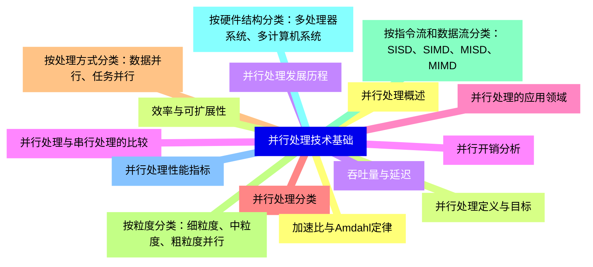
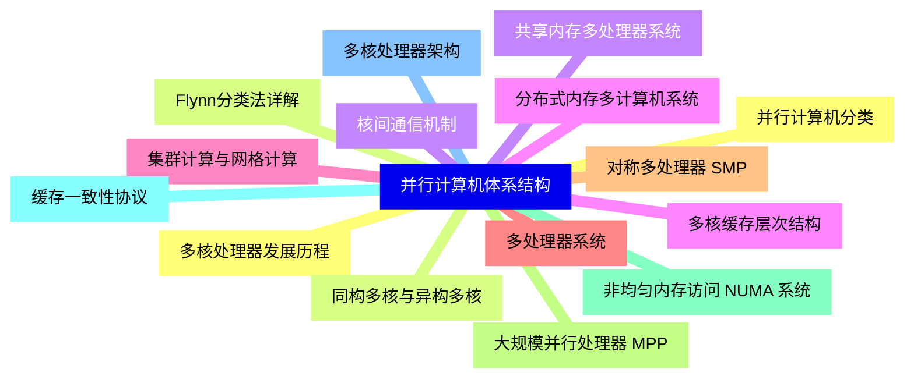
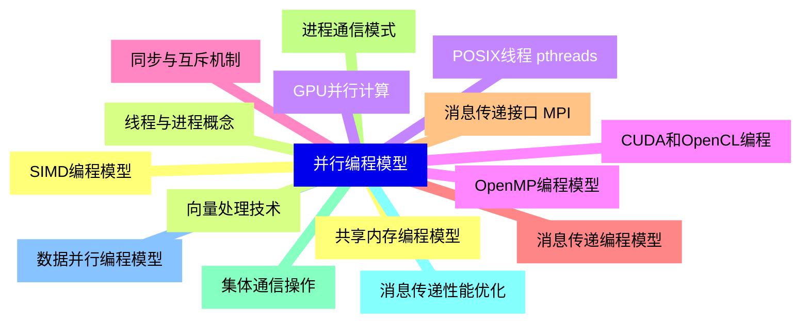
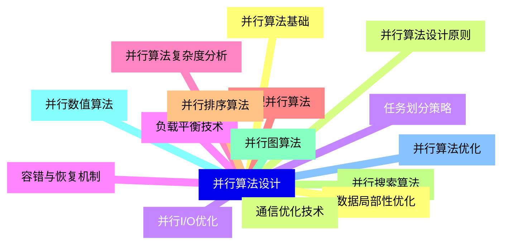
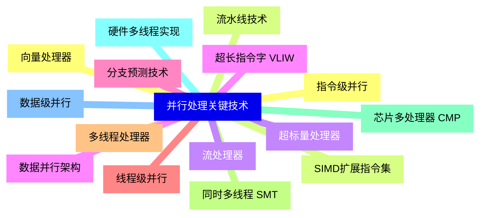
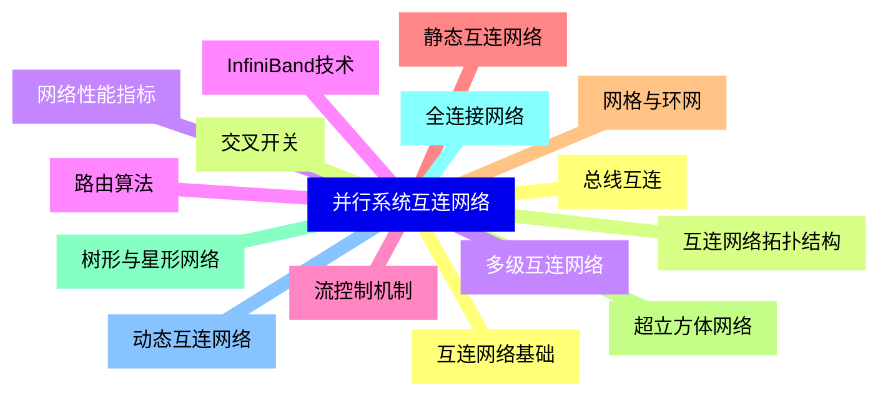
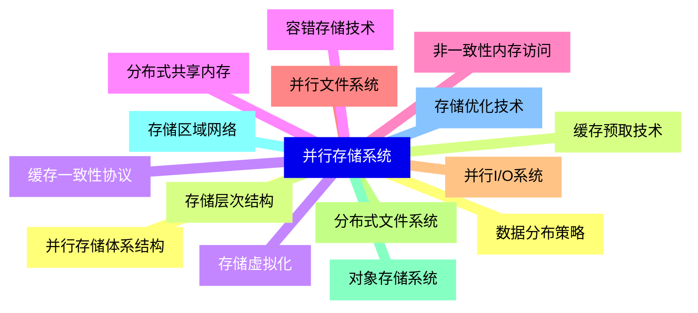
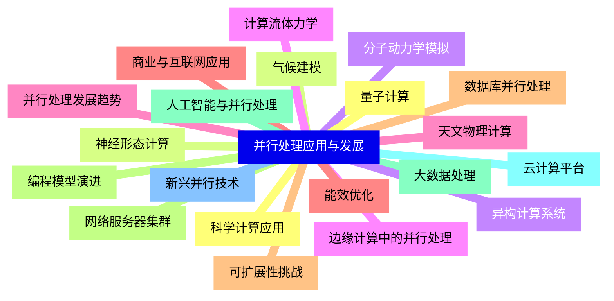


### 1 [并行处理技术基础](#1)
#### 1.1 [并行处理概述](#1)
#### 1.2 [并行处理定义与目标](#1)
#### 1.3 [并行处理发展历程](#1)
#### 1.4 [并行处理与串行处理的比较](#1)
#### 1.5 [并行处理的应用领域](#1)
#### 1.6 [并行处理分类](#1)
#### 1.7 [按处理方式分类：数据并行、任务并行](#1)
#### 1.8 [按粒度分类：细粒度、中粒度、粗粒度并行](#1)
#### 1.9 [按指令流和数据流分类：SISD、SIMD、MISD、MIMD](#1)
#### 1.10 [按硬件结构分类：多处理器系统、多计算机系统](#1)
#### 1.11 [并行处理性能指标](#1)
#### 1.12 [加速比与Amdahl定律](#1)
#### 1.13 [效率与可扩展性](#1)
#### 1.14 [吞吐量与延迟](#1)
#### 1.15 [并行开销分析](#1)
### 2 [并行计算机体系结构](#2)
#### 2.1 [并行计算机分类](#2)
#### 2.2 [Flynn分类法详解](#2)
#### 2.3 [共享内存多处理器系统](#2)
#### 2.4 [分布式内存多计算机系统](#2)
#### 2.5 [集群计算与网格计算](#2)
#### 2.6 [多处理器系统](#2)
#### 2.7 [对称多处理器 SMP](#2)
#### 2.8 [大规模并行处理器 MPP](#2)
#### 2.9 [非均匀内存访问 NUMA 系统](#2)
#### 2.10 [缓存一致性协议](#2)
#### 2.11 [多核处理器架构](#2)
#### 2.12 [多核处理器发展历程](#2)
#### 2.13 [同构多核与异构多核](#2)
#### 2.14 [核间通信机制](#2)
#### 2.15 [多核缓存层次结构](#2)
### 3 [并行编程模型](#3)
#### 3.1 [共享内存编程模型](#3)
#### 3.2 [线程与进程概念](#3)
#### 3.3 [POSIX线程 pthreads](#3)
#### 3.4 [OpenMP编程模型](#3)
#### 3.5 [同步与互斥机制](#3)
#### 3.6 [消息传递编程模型](#3)
#### 3.7 [消息传递接口 MPI](#3)
#### 3.8 [进程通信模式](#3)
#### 3.9 [集体通信操作](#3)
#### 3.10 [消息传递性能优化](#3)
#### 3.11 [数据并行编程模型](#3)
#### 3.12 [SIMD编程模型](#3)
#### 3.13 [向量处理技术](#3)
#### 3.14 [GPU并行计算](#3)
#### 3.15 [CUDA和OpenCL编程](#3)
### 4 [并行算法设计](#4)
#### 4.1 [并行算法基础](#4)
#### 4.2 [并行算法设计原则](#4)
#### 4.3 [任务划分策略](#4)
#### 4.4 [负载平衡技术](#4)
#### 4.5 [并行算法复杂度分析](#4)
#### 4.6 [典型并行算法](#4)
#### 4.7 [并行排序算法](#4)
#### 4.8 [并行搜索算法](#4)
#### 4.9 [并行图算法](#4)
#### 4.10 [并行数值算法](#4)
#### 4.11 [并行算法优化](#4)
#### 4.12 [数据局部性优化](#4)
#### 4.13 [通信优化技术](#4)
#### 4.14 [并行I/O优化](#4)
#### 4.15 [容错与恢复机制](#4)
### 5 [并行处理关键技术](#5)
#### 5.1 [指令级并行](#5)
#### 5.2 [流水线技术](#5)
#### 5.3 [超标量处理器](#5)
#### 5.4 [超长指令字 VLIW](#5)
#### 5.5 [分支预测技术](#5)
#### 5.6 [线程级并行](#5)
#### 5.7 [多线程处理器](#5)
#### 5.8 [同时多线程 SMT](#5)
#### 5.9 [芯片多处理器 CMP](#5)
#### 5.10 [硬件多线程实现](#5)
#### 5.11 [数据级并行](#5)
#### 5.12 [向量处理器](#5)
#### 5.13 [SIMD扩展指令集](#5)
#### 5.14 [流处理器](#5)
#### 5.15 [数据并行架构](#5)
### 6 [并行系统互连网络](#6)
#### 6.1 [互连网络基础](#6)
#### 6.2 [互连网络拓扑结构](#6)
#### 6.3 [网络性能指标](#6)
#### 6.4 [路由算法](#6)
#### 6.5 [流控制机制](#6)
#### 6.6 [静态互连网络](#6)
#### 6.7 [网格与环网](#6)
#### 6.8 [超立方体网络](#6)
#### 6.9 [树形与星形网络](#6)
#### 6.10 [全连接网络](#6)
#### 6.11 [动态互连网络](#6)
#### 6.12 [总线互连](#6)
#### 6.13 [交叉开关](#6)
#### 6.14 [多级互连网络](#6)
#### 6.15 [InfiniBand技术](#6)
### 7 [并行存储系统](#7)
#### 7.1 [并行存储体系结构](#7)
#### 7.2 [存储层次结构](#7)
#### 7.3 [缓存一致性协议](#7)
#### 7.4 [分布式共享内存](#7)
#### 7.5 [非一致性内存访问](#7)
#### 7.6 [并行文件系统](#7)
#### 7.7 [并行I/O系统](#7)
#### 7.8 [分布式文件系统](#7)
#### 7.9 [对象存储系统](#7)
#### 7.10 [存储区域网络](#7)
#### 7.11 [存储优化技术](#7)
#### 7.12 [数据分布策略](#7)
#### 7.13 [缓存预取技术](#7)
#### 7.14 [存储虚拟化](#7)
#### 7.15 [容错存储技术](#7)
### 8 [并行处理应用与发展](#8)
#### 8.1 [科学计算应用](#8)
#### 8.2 [气候建模](#8)
#### 8.3 [分子动力学模拟](#8)
#### 8.4 [计算流体力学](#8)
#### 8.5 [天文物理计算](#8)
#### 8.6 [商业与互联网应用](#8)
#### 8.7 [数据库并行处理](#8)
#### 8.8 [网络服务器集群](#8)
#### 8.9 [大数据处理](#8)
#### 8.10 [云计算平台](#8)
#### 8.11 [新兴并行技术](#8)
#### 8.12 [量子计算](#8)
#### 8.13 [神经形态计算](#8)
#### 8.14 [异构计算系统](#8)
#### 8.15 [边缘计算中的并行处理](#8)
#### 8.16 [并行处理发展趋势](#8)
#### 8.17 [能效优化](#8)
#### 8.18 [可扩展性挑战](#8)
#### 8.19 [编程模型演进](#8)
#### 8.20 [人工智能与并行处理](#8)




### 1 并行处理技术基础

---
### 1 并行处理技术基础
___
#### 1.1 并行处理概述
___
#### 1.2 并行处理定义与目标
___
#### 1.3 并行处理发展历程
___
#### 1.4 并行处理与串行处理的比较
___
#### 1.5 并行处理的应用领域
___
#### 1.6 并行处理分类
___
#### 1.7 按处理方式分类：数据并行、任务并行
___
#### 1.8 按粒度分类：细粒度、中粒度、粗粒度并行
___
#### 1.9 按指令流和数据流分类：SISD、SIMD、MISD、MIMD
___
#### 1.10 按硬件结构分类：多处理器系统、多计算机系统
___
#### 1.11 并行处理性能指标
___
#### 1.12 加速比与Amdahl定律
___
#### 1.13 效率与可扩展性
___
#### 1.14 吞吐量与延迟
___
#### 1.15 并行开销分析
### 2 并行计算机体系结构

---
### 2 并行计算机体系结构
___
#### 2.1 并行计算机分类
___
#### 2.2 Flynn分类法详解
___
#### 2.3 共享内存多处理器系统
___
#### 2.4 分布式内存多计算机系统
___
#### 2.5 集群计算与网格计算
___
#### 2.6 多处理器系统
___
#### 2.7 对称多处理器 SMP
___
#### 2.8 大规模并行处理器 MPP
___
#### 2.9 非均匀内存访问 NUMA 系统
___
#### 2.10 缓存一致性协议
___
#### 2.11 多核处理器架构
___
#### 2.12 多核处理器发展历程
___
#### 2.13 同构多核与异构多核
___
#### 2.14 核间通信机制
___
#### 2.15 多核缓存层次结构
### 3 并行编程模型

---
### 3 并行编程模型
___
#### 3.1 共享内存编程模型
___
#### 3.2 线程与进程概念
___
#### 3.3 POSIX线程 pthreads
___
#### 3.4 OpenMP编程模型
___
#### 3.5 同步与互斥机制
___
#### 3.6 消息传递编程模型
___
#### 3.7 消息传递接口 MPI
___
#### 3.8 进程通信模式
___
#### 3.9 集体通信操作
___
#### 3.10 消息传递性能优化
___
#### 3.11 数据并行编程模型
___
#### 3.12 SIMD编程模型
___
#### 3.13 向量处理技术
___
#### 3.14 GPU并行计算
___
#### 3.15 CUDA和OpenCL编程
### 4 并行算法设计

---
### 4 并行算法设计
___
#### 4.1 并行算法基础
___
#### 4.2 并行算法设计原则
___
#### 4.3 任务划分策略
___
#### 4.4 负载平衡技术
___
#### 4.5 并行算法复杂度分析
___
#### 4.6 典型并行算法
___
#### 4.7 并行排序算法
___
#### 4.8 并行搜索算法
___
#### 4.9 并行图算法
___
#### 4.10 并行数值算法
___
#### 4.11 并行算法优化
___
#### 4.12 数据局部性优化
___
#### 4.13 通信优化技术
___
#### 4.14 并行I/O优化
___
#### 4.15 容错与恢复机制
### 5 并行处理关键技术

---
### 5 并行处理关键技术
___
#### 5.1 指令级并行
___
#### 5.2 流水线技术
___
#### 5.3 超标量处理器
___
#### 5.4 超长指令字 VLIW
___
#### 5.5 分支预测技术
___
#### 5.6 线程级并行
___
#### 5.7 多线程处理器
___
#### 5.8 同时多线程 SMT
___
#### 5.9 芯片多处理器 CMP
___
#### 5.10 硬件多线程实现
___
#### 5.11 数据级并行
___
#### 5.12 向量处理器
___
#### 5.13 SIMD扩展指令集
___
#### 5.14 流处理器
___
#### 5.15 数据并行架构
### 6 并行系统互连网络

---
### 6 并行系统互连网络
___
#### 6.1 互连网络基础
___
#### 6.2 互连网络拓扑结构
___
#### 6.3 网络性能指标
___
#### 6.4 路由算法
___
#### 6.5 流控制机制
___
#### 6.6 静态互连网络
___
#### 6.7 网格与环网
___
#### 6.8 超立方体网络
___
#### 6.9 树形与星形网络
___
#### 6.10 全连接网络
___
#### 6.11 动态互连网络
___
#### 6.12 总线互连
___
#### 6.13 交叉开关
___
#### 6.14 多级互连网络
___
#### 6.15 InfiniBand技术
### 7 并行存储系统

---
### 7 并行存储系统
___
#### 7.1 并行存储体系结构
___
#### 7.2 存储层次结构
___
#### 7.3 缓存一致性协议
___
#### 7.4 分布式共享内存
___
#### 7.5 非一致性内存访问
___
#### 7.6 并行文件系统
___
#### 7.7 并行I/O系统
___
#### 7.8 分布式文件系统
___
#### 7.9 对象存储系统
___
#### 7.10 存储区域网络
___
#### 7.11 存储优化技术
___
#### 7.12 数据分布策略
___
#### 7.13 缓存预取技术
___
#### 7.14 存储虚拟化
___
#### 7.15 容错存储技术
### 8 并行处理应用与发展

---
### 8 并行处理应用与发展
___
#### 8.1 科学计算应用
___
#### 8.2 气候建模
___
#### 8.3 分子动力学模拟
___
#### 8.4 计算流体力学
___
#### 8.5 天文物理计算
___
#### 8.6 商业与互联网应用
___
#### 8.7 数据库并行处理
___
#### 8.8 网络服务器集群
___
#### 8.9 大数据处理
___
#### 8.10 云计算平台
___
#### 8.11 新兴并行技术
___
#### 8.12 量子计算
___
#### 8.13 神经形态计算
___
#### 8.14 异构计算系统
___
#### 8.15 边缘计算中的并行处理
___
#### 8.16 并行处理发展趋势
___
#### 8.17 能效优化
___
#### 8.18 可扩展性挑战
___
#### 8.19 编程模型演进
___
#### 8.20 人工智能与并行处理


### 1 并行处理技术基础{#1}

{}

<--->
{}
{}
{}
{}
{}
{}
{}
{}
{}
{}
{}
{}
{}
{}
{}
{}
{}
{}
{}
{}
{}
{}
{}
{}
{}
{}
{}
{}
{}
{}
{}

### 2 并行计算机体系结构{#2}

{}
{}
{}
{}
{}
{}
{}
{}
{}
{}
{}
{}
{}
{}
{}
{}
{}
{}
{}
{}
{}
{}
{}
{}
{}
{}
{}
{}
{}
{}
{}
<--->

{}

### 3 并行编程模型{#3}

{}

<--->
{}
{}
{}
{}
{}
{}
{}
{}
{}
{}
{}
{}
{}
{}
{}
{}
{}
{}
{}
{}
{}
{}
{}
{}
{}
{}
{}
{}
{}
{}
{}

### 4 并行算法设计{#4}

{}
{}
{}
{}
{}
{}
{}
{}
{}
{}
{}
{}
{}
{}
{}
{}
{}
{}
{}
{}
{}
{}
{}
{}
{}
{}
{}
{}
{}
{}
{}
<--->

{}

### 5 并行处理关键技术{#5}

{}

<--->
{}
{}
{}
{}
{}
{}
{}
{}
{}
{}
{}
{}
{}
{}
{}
{}
{}
{}
{}
{}
{}
{}
{}
{}
{}
{}
{}
{}
{}
{}
{}

### 6 并行系统互连网络{#6}

{}
{}
{}
{}
{}
{}
{}
{}
{}
{}
{}
{}
{}
{}
{}
{}
{}
{}
{}
{}
{}
{}
{}
{}
{}
{}
{}
{}
{}
{}
{}
<--->

{}

### 7 并行存储系统{#7}

{}

<--->
{}
{}
{}
{}
{}
{}
{}
{}
{}
{}
{}
{}
{}
{}
{}
{}
{}
{}
{}
{}
{}
{}
{}
{}
{}
{}
{}
{}
{}
{}
{}

### 8 并行处理应用与发展{#8}

{}
{}
{}
{}
{}
{}
{}
{}
{}
{}
{}
{}
{}
{}
{}
{}
{}
{}
{}
{}
{}
{}
{}
{}
{}
{}
{}
{}
{}
{}
{}
{}
{}
{}
{}
{}
{}
{}
{}
{}
{}
<--->

{}
