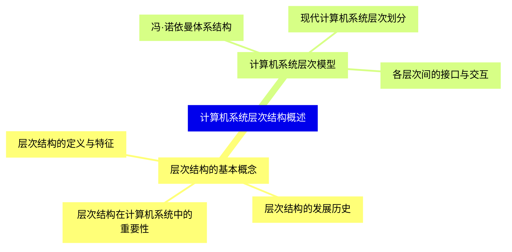
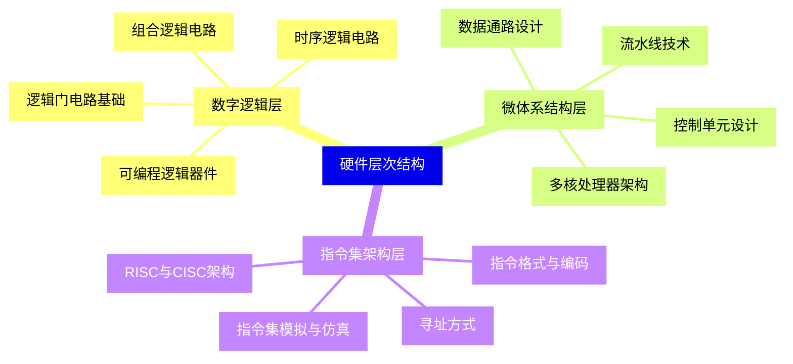
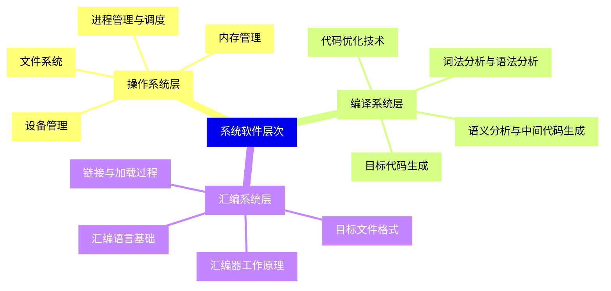
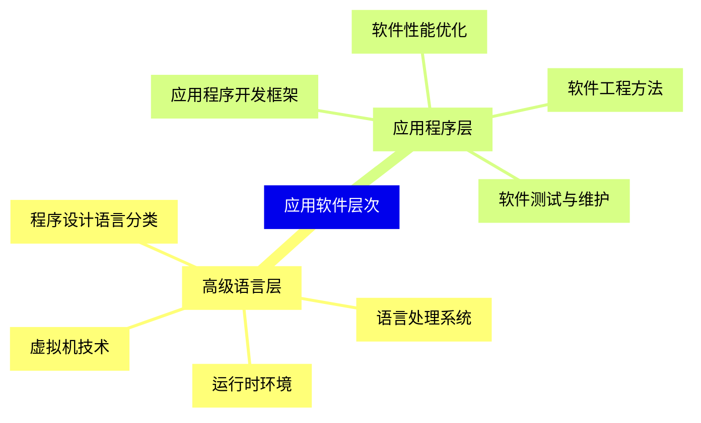
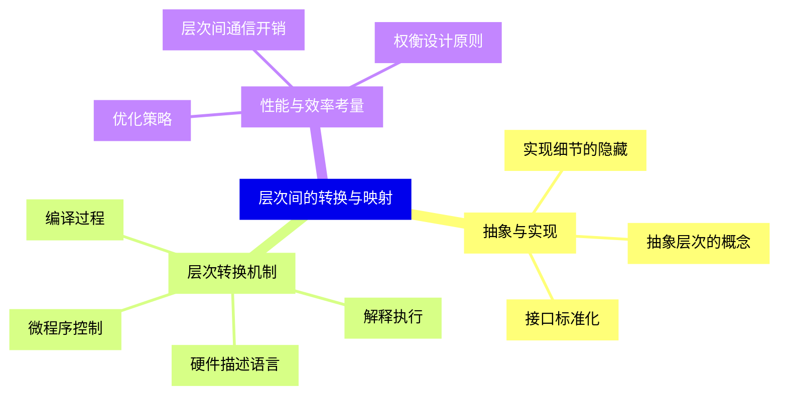
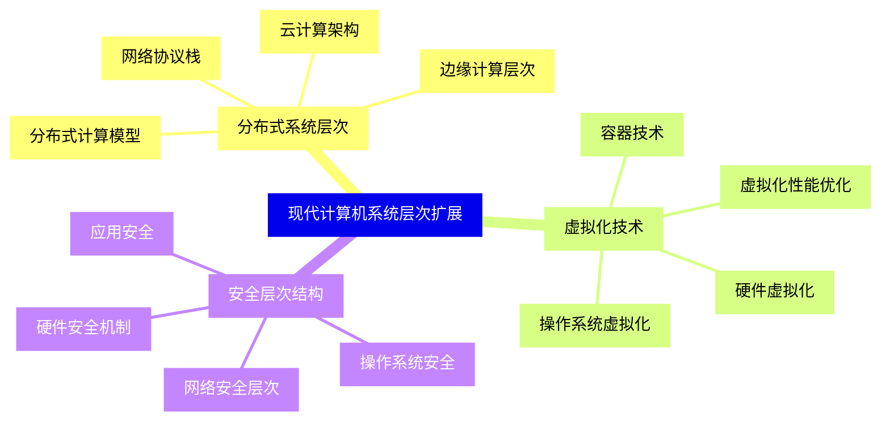
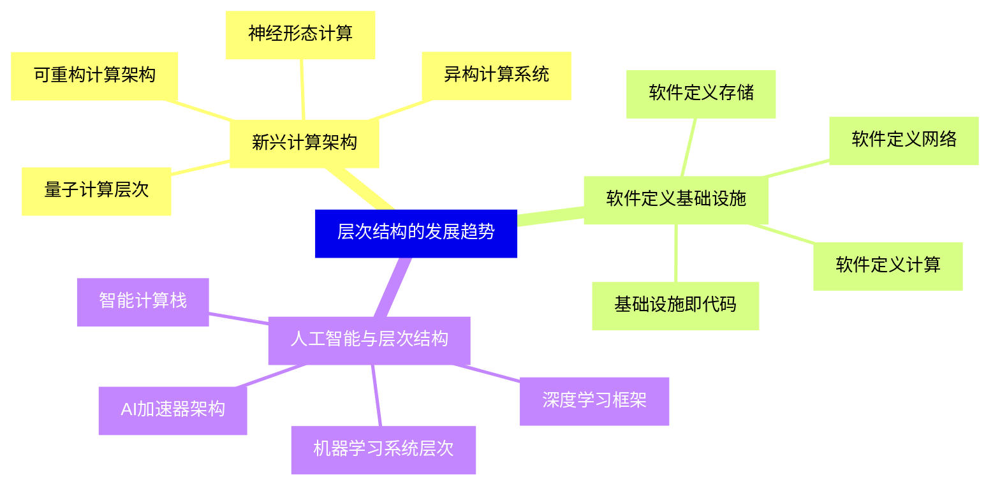


### 1 [计算机系统层次结构概述](#1)
#### 1.1 [层次结构的基本概念](#1)
##### 1.1.1 [层次结构的定义与特征](#1)
##### 1.1.2 [层次结构的发展历史](#1)
##### 1.1.3 [层次结构在计算机系统中的重要性](#1)
#### 1.2 [计算机系统层次模型](#1)
##### 1.2.1 [冯·诺依曼体系结构](#1)
##### 1.2.2 [现代计算机系统层次划分](#1)
##### 1.2.3 [各层次间的接口与交互](#1)
### 2 [硬件层次结构](#2)
#### 2.1 [数字逻辑层](#2)
##### 2.1.1 [逻辑门电路基础](#2)
##### 2.1.2 [组合逻辑电路](#2)
##### 2.1.3 [时序逻辑电路](#2)
##### 2.1.4 [可编程逻辑器件](#2)
#### 2.2 [微体系结构层](#2)
##### 2.2.1 [数据通路设计](#2)
##### 2.2.2 [控制单元设计](#2)
##### 2.2.3 [流水线技术](#2)
##### 2.2.4 [多核处理器架构](#2)
#### 2.3 [指令集架构层](#2)
##### 2.3.1 [指令格式与编码](#2)
##### 2.3.2 [寻址方式](#2)
##### 2.3.3 [RISC与CISC架构](#2)
##### 2.3.4 [指令集模拟与仿真](#2)
### 3 [系统软件层次](#3)
#### 3.1 [操作系统层](#3)
##### 3.1.1 [进程管理与调度](#3)
##### 3.1.2 [内存管理](#3)
##### 3.1.3 [文件系统](#3)
##### 3.1.4 [设备管理](#3)
#### 3.2 [编译系统层](#3)
##### 3.2.1 [词法分析与语法分析](#3)
##### 3.2.2 [语义分析与中间代码生成](#3)
##### 3.2.3 [代码优化技术](#3)
##### 3.2.4 [目标代码生成](#3)
#### 3.3 [汇编系统层](#3)
##### 3.3.1 [汇编语言基础](#3)
##### 3.3.2 [汇编器工作原理](#3)
##### 3.3.3 [链接与加载过程](#3)
##### 3.3.4 [目标文件格式](#3)
### 4 [应用软件层次](#4)
#### 4.1 [高级语言层](#4)
##### 4.1.1 [程序设计语言分类](#4)
##### 4.1.2 [语言处理系统](#4)
##### 4.1.3 [运行时环境](#4)
##### 4.1.4 [虚拟机技术](#4)
#### 4.2 [应用程序层](#4)
##### 4.2.1 [应用程序开发框架](#4)
##### 4.2.2 [软件工程方法](#4)
##### 4.2.3 [软件测试与维护](#4)
##### 4.2.4 [软件性能优化](#4)
### 5 [层次间的转换与映射](#5)
#### 5.1 [抽象与实现](#5)
##### 5.1.1 [抽象层次的概念](#5)
##### 5.1.2 [实现细节的隐藏](#5)
##### 5.1.3 [接口标准化](#5)
#### 5.2 [层次转换机制](#5)
##### 5.2.1 [编译过程](#5)
##### 5.2.2 [解释执行](#5)
##### 5.2.3 [微程序控制](#5)
##### 5.2.4 [硬件描述语言](#5)
#### 5.3 [性能与效率考量](#5)
##### 5.3.1 [层次间通信开销](#5)
##### 5.3.2 [优化策略](#5)
##### 5.3.3 [权衡设计原则](#5)
### 6 [现代计算机系统层次扩展](#6)
#### 6.1 [分布式系统层次](#6)
##### 6.1.1 [网络协议栈](#6)
##### 6.1.2 [分布式计算模型](#6)
##### 6.1.3 [云计算架构](#6)
##### 6.1.4 [边缘计算层次](#6)
#### 6.2 [虚拟化技术](#6)
##### 6.2.1 [硬件虚拟化](#6)
##### 6.2.2 [操作系统虚拟化](#6)
##### 6.2.3 [容器技术](#6)
##### 6.2.4 [虚拟化性能优化](#6)
#### 6.3 [安全层次结构](#6)
##### 6.3.1 [硬件安全机制](#6)
##### 6.3.2 [操作系统安全](#6)
##### 6.3.3 [应用安全](#6)
##### 6.3.4 [网络安全层次](#6)
### 7 [层次结构的发展趋势](#7)
#### 7.1 [新兴计算架构](#7)
##### 7.1.1 [量子计算层次](#7)
##### 7.1.2 [神经形态计算](#7)
##### 7.1.3 [异构计算系统](#7)
##### 7.1.4 [可重构计算架构](#7)
#### 7.2 [软件定义基础设施](#7)
##### 7.2.1 [软件定义网络](#7)
##### 7.2.2 [软件定义存储](#7)
##### 7.2.3 [软件定义计算](#7)
##### 7.2.4 [基础设施即代码](#7)
#### 7.3 [人工智能与层次结构](#7)
##### 7.3.1 [AI加速器架构](#7)
##### 7.3.2 [机器学习系统层次](#7)
##### 7.3.3 [深度学习框架](#7)
##### 7.3.4 [智能计算栈](#7)




### 1 计算机系统层次结构概述

---
### 1 计算机系统层次结构概述
___
#### 1.1 层次结构的基本概念
___
##### 1.1.1 层次结构的定义与特征
___
##### 1.1.2 层次结构的发展历史
___
##### 1.1.3 层次结构在计算机系统中的重要性
___
#### 1.2 计算机系统层次模型
___
##### 1.2.1 冯·诺依曼体系结构
___
##### 1.2.2 现代计算机系统层次划分
___
##### 1.2.3 各层次间的接口与交互
### 2 硬件层次结构

---
### 2 硬件层次结构
___
#### 2.1 数字逻辑层
___
##### 2.1.1 逻辑门电路基础
___
##### 2.1.2 组合逻辑电路
___
##### 2.1.3 时序逻辑电路
___
##### 2.1.4 可编程逻辑器件
___
#### 2.2 微体系结构层
___
##### 2.2.1 数据通路设计
___
##### 2.2.2 控制单元设计
___
##### 2.2.3 流水线技术
___
##### 2.2.4 多核处理器架构
___
#### 2.3 指令集架构层
___
##### 2.3.1 指令格式与编码
___
##### 2.3.2 寻址方式
___
##### 2.3.3 RISC与CISC架构
___
##### 2.3.4 指令集模拟与仿真
### 3 系统软件层次

---
### 3 系统软件层次
___
#### 3.1 操作系统层
___
##### 3.1.1 进程管理与调度
___
##### 3.1.2 内存管理
___
##### 3.1.3 文件系统
___
##### 3.1.4 设备管理
___
#### 3.2 编译系统层
___
##### 3.2.1 词法分析与语法分析
___
##### 3.2.2 语义分析与中间代码生成
___
##### 3.2.3 代码优化技术
___
##### 3.2.4 目标代码生成
___
#### 3.3 汇编系统层
___
##### 3.3.1 汇编语言基础
___
##### 3.3.2 汇编器工作原理
___
##### 3.3.3 链接与加载过程
___
##### 3.3.4 目标文件格式
### 4 应用软件层次

---
### 4 应用软件层次
___
#### 4.1 高级语言层
___
##### 4.1.1 程序设计语言分类
___
##### 4.1.2 语言处理系统
___
##### 4.1.3 运行时环境
___
##### 4.1.4 虚拟机技术
___
#### 4.2 应用程序层
___
##### 4.2.1 应用程序开发框架
___
##### 4.2.2 软件工程方法
___
##### 4.2.3 软件测试与维护
___
##### 4.2.4 软件性能优化
### 5 层次间的转换与映射

---
### 5 层次间的转换与映射
___
#### 5.1 抽象与实现
___
##### 5.1.1 抽象层次的概念
___
##### 5.1.2 实现细节的隐藏
___
##### 5.1.3 接口标准化
___
#### 5.2 层次转换机制
___
##### 5.2.1 编译过程
___
##### 5.2.2 解释执行
___
##### 5.2.3 微程序控制
___
##### 5.2.4 硬件描述语言
___
#### 5.3 性能与效率考量
___
##### 5.3.1 层次间通信开销
___
##### 5.3.2 优化策略
___
##### 5.3.3 权衡设计原则
### 6 现代计算机系统层次扩展

---
### 6 现代计算机系统层次扩展
___
#### 6.1 分布式系统层次
___
##### 6.1.1 网络协议栈
___
##### 6.1.2 分布式计算模型
___
##### 6.1.3 云计算架构
___
##### 6.1.4 边缘计算层次
___
#### 6.2 虚拟化技术
___
##### 6.2.1 硬件虚拟化
___
##### 6.2.2 操作系统虚拟化
___
##### 6.2.3 容器技术
___
##### 6.2.4 虚拟化性能优化
___
#### 6.3 安全层次结构
___
##### 6.3.1 硬件安全机制
___
##### 6.3.2 操作系统安全
___
##### 6.3.3 应用安全
___
##### 6.3.4 网络安全层次
### 7 层次结构的发展趋势

---
### 7 层次结构的发展趋势
___
#### 7.1 新兴计算架构
___
##### 7.1.1 量子计算层次
___
##### 7.1.2 神经形态计算
___
##### 7.1.3 异构计算系统
___
##### 7.1.4 可重构计算架构
___
#### 7.2 软件定义基础设施
___
##### 7.2.1 软件定义网络
___
##### 7.2.2 软件定义存储
___
##### 7.2.3 软件定义计算
___
##### 7.2.4 基础设施即代码
___
#### 7.3 人工智能与层次结构
___
##### 7.3.1 AI加速器架构
___
##### 7.3.2 机器学习系统层次
___
##### 7.3.3 深度学习框架
___
##### 7.3.4 智能计算栈


### 1 计算机系统层次结构概述{#1}

{}

<--->
{}
{}
{}
{}
{}
{}
{}
{}
{}
{}
{}
{}
{}
{}
{}
{}
{}

### 2 硬件层次结构{#2}

{}
{}
{}
{}
{}
{}
{}
{}
{}
{}
{}
{}
{}
{}
{}
{}
{}
{}
{}
{}
{}
{}
{}
{}
{}
{}
{}
{}
{}
{}
{}
<--->

{}

### 3 系统软件层次{#3}

{}

<--->
{}
{}
{}
{}
{}
{}
{}
{}
{}
{}
{}
{}
{}
{}
{}
{}
{}
{}
{}
{}
{}
{}
{}
{}
{}
{}
{}
{}
{}
{}
{}

### 4 应用软件层次{#4}

{}
{}
{}
{}
{}
{}
{}
{}
{}
{}
{}
{}
{}
{}
{}
{}
{}
{}
{}
{}
{}
<--->

{}

### 5 层次间的转换与映射{#5}

{}

<--->
{}
{}
{}
{}
{}
{}
{}
{}
{}
{}
{}
{}
{}
{}
{}
{}
{}
{}
{}
{}
{}
{}
{}
{}
{}
{}
{}

### 6 现代计算机系统层次扩展{#6}

{}
{}
{}
{}
{}
{}
{}
{}
{}
{}
{}
{}
{}
{}
{}
{}
{}
{}
{}
{}
{}
{}
{}
{}
{}
{}
{}
{}
{}
{}
{}
<--->

{}

### 7 层次结构的发展趋势{#7}

{}

<--->
{}
{}
{}
{}
{}
{}
{}
{}
{}
{}
{}
{}
{}
{}
{}
{}
{}
{}
{}
{}
{}
{}
{}
{}
{}
{}
{}
{}
{}
{}
{}
