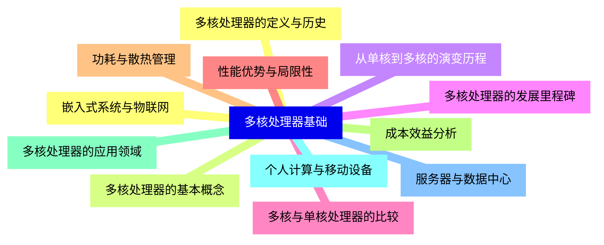
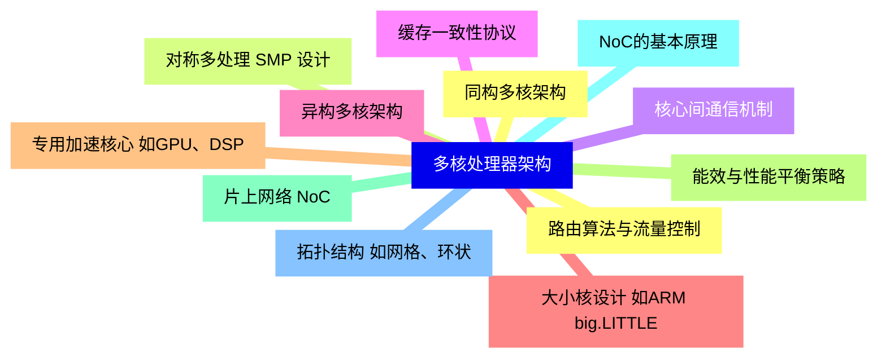
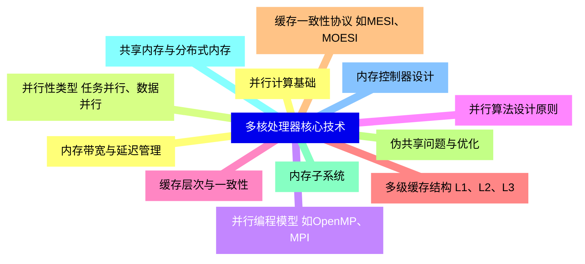
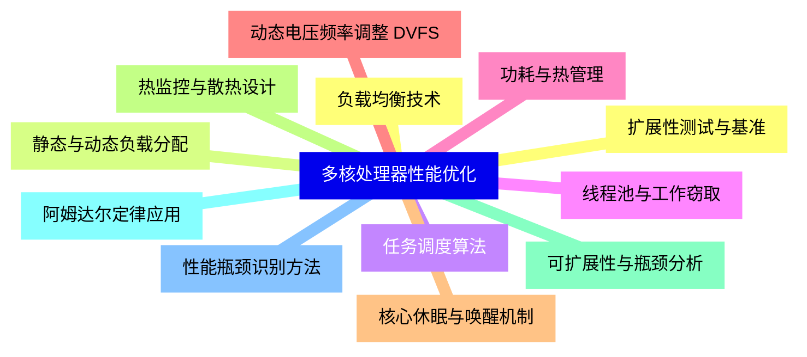
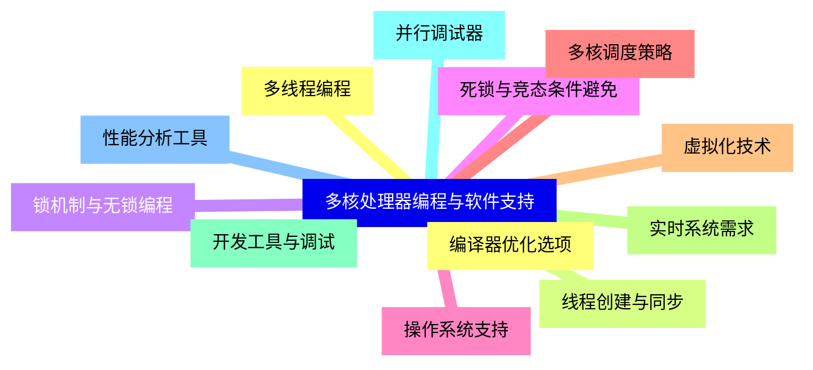
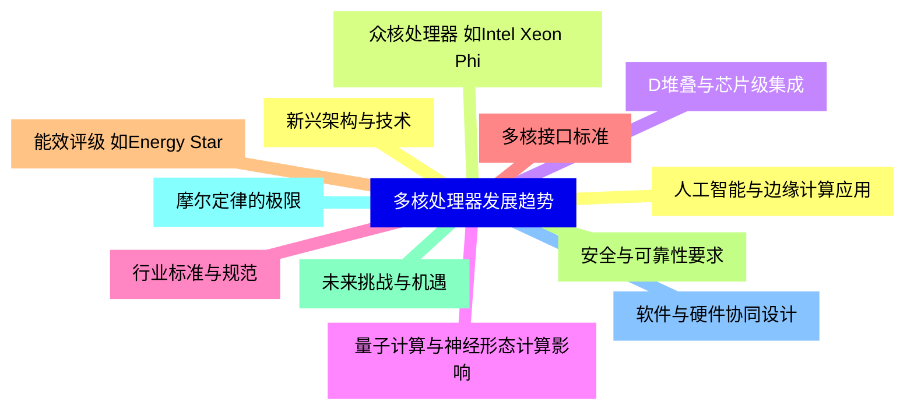
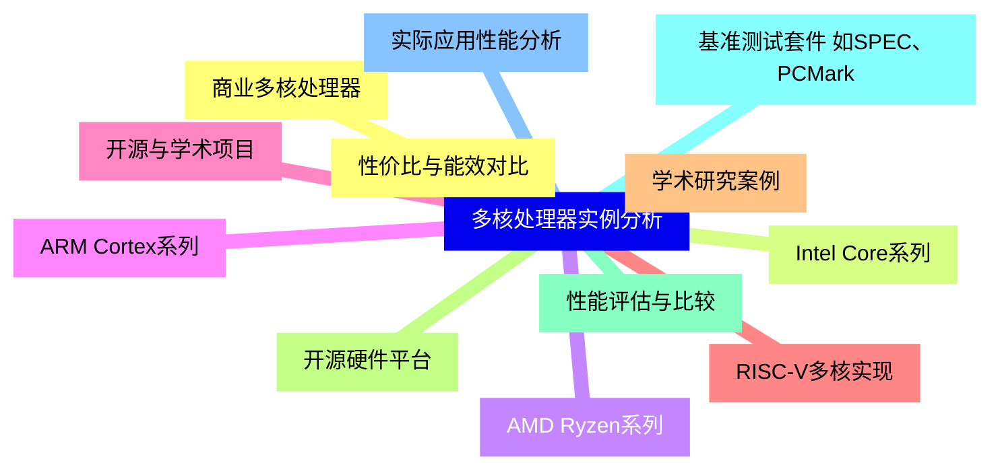


### 1 [多核处理器基础](#1)
#### 1.1 [多核处理器的定义与历史](#1)
#### 1.2 [多核处理器的基本概念](#1)
#### 1.3 [从单核到多核的演变历程](#1)
#### 1.4 [多核处理器的发展里程碑](#1)
#### 1.5 [多核与单核处理器的比较](#1)
#### 1.6 [性能优势与局限性](#1)
#### 1.7 [功耗与散热管理](#1)
#### 1.8 [成本效益分析](#1)
#### 1.9 [多核处理器的应用领域](#1)
#### 1.10 [个人计算与移动设备](#1)
#### 1.11 [服务器与数据中心](#1)
#### 1.12 [嵌入式系统与物联网](#1)
### 2 [多核处理器架构](#2)
#### 2.1 [同构多核架构](#2)
#### 2.2 [对称多处理 SMP 设计](#2)
#### 2.3 [核心间通信机制](#2)
#### 2.4 [缓存一致性协议](#2)
#### 2.5 [异构多核架构](#2)
#### 2.6 [大小核设计 如ARM big.LITTLE](#2)
#### 2.7 [专用加速核心 如GPU、DSP](#2)
#### 2.8 [能效与性能平衡策略](#2)
#### 2.9 [片上网络 NoC](#2)
#### 2.10 [NoC的基本原理](#2)
#### 2.11 [拓扑结构 如网格、环状](#2)
#### 2.12 [路由算法与流量控制](#2)
### 3 [多核处理器核心技术](#3)
#### 3.1 [并行计算基础](#3)
#### 3.2 [并行性类型 任务并行、数据并行](#3)
#### 3.3 [并行编程模型 如OpenMP、MPI](#3)
#### 3.4 [并行算法设计原则](#3)
#### 3.5 [缓存层次与一致性](#3)
#### 3.6 [多级缓存结构 L1、L2、L3](#3)
#### 3.7 [缓存一致性协议 如MESI、MOESI](#3)
#### 3.8 [伪共享问题与优化](#3)
#### 3.9 [内存子系统](#3)
#### 3.10 [共享内存与分布式内存](#3)
#### 3.11 [内存控制器设计](#3)
#### 3.12 [内存带宽与延迟管理](#3)
### 4 [多核处理器性能优化](#4)
#### 4.1 [负载均衡技术](#4)
#### 4.2 [静态与动态负载分配](#4)
#### 4.3 [任务调度算法](#4)
#### 4.4 [线程池与工作窃取](#4)
#### 4.5 [功耗与热管理](#4)
#### 4.6 [动态电压频率调整 DVFS](#4)
#### 4.7 [核心休眠与唤醒机制](#4)
#### 4.8 [热监控与散热设计](#4)
#### 4.9 [可扩展性与瓶颈分析](#4)
#### 4.10 [阿姆达尔定律应用](#4)
#### 4.11 [性能瓶颈识别方法](#4)
#### 4.12 [扩展性测试与基准](#4)
### 5 [多核处理器编程与软件支持](#5)
#### 5.1 [多线程编程](#5)
#### 5.2 [线程创建与同步](#5)
#### 5.3 [锁机制与无锁编程](#5)
#### 5.4 [死锁与竞态条件避免](#5)
#### 5.5 [操作系统支持](#5)
#### 5.6 [多核调度策略](#5)
#### 5.7 [虚拟化技术](#5)
#### 5.8 [实时系统需求](#5)
#### 5.9 [开发工具与调试](#5)
#### 5.10 [并行调试器](#5)
#### 5.11 [性能分析工具](#5)
#### 5.12 [编译器优化选项](#5)
### 6 [多核处理器发展趋势](#6)
#### 6.1 [新兴架构与技术](#6)
#### 6.2 [众核处理器 如Intel Xeon Phi](#6)
#### 6.3 [D堆叠与芯片级集成](#6)
#### 6.4 [量子计算与神经形态计算影响](#6)
#### 6.5 [行业标准与规范](#6)
#### 6.6 [多核接口标准](#6)
#### 6.7 [能效评级 如Energy Star](#6)
#### 6.8 [安全与可靠性要求](#6)
#### 6.9 [未来挑战与机遇](#6)
#### 6.10 [摩尔定律的极限](#6)
#### 6.11 [软件与硬件协同设计](#6)
#### 6.12 [人工智能与边缘计算应用](#6)
### 7 [多核处理器实例分析](#7)
#### 7.1 [商业多核处理器](#7)
#### 7.2 [Intel Core系列](#7)
#### 7.3 [AMD Ryzen系列](#7)
#### 7.4 [ARM Cortex系列](#7)
#### 7.5 [开源与学术项目](#7)
#### 7.6 [RISC-V多核实现](#7)
#### 7.7 [学术研究案例](#7)
#### 7.8 [开源硬件平台](#7)
#### 7.9 [性能评估与比较](#7)
#### 7.10 [基准测试套件 如SPEC、PCMark](#7)
#### 7.11 [实际应用性能分析](#7)
#### 7.12 [性价比与能效对比](#7)




### 1 多核处理器基础

---
### 1 多核处理器基础
___
#### 1.1 多核处理器的定义与历史
___
#### 1.2 多核处理器的基本概念
___
#### 1.3 从单核到多核的演变历程
___
#### 1.4 多核处理器的发展里程碑
___
#### 1.5 多核与单核处理器的比较
___
#### 1.6 性能优势与局限性
___
#### 1.7 功耗与散热管理
___
#### 1.8 成本效益分析
___
#### 1.9 多核处理器的应用领域
___
#### 1.10 个人计算与移动设备
___
#### 1.11 服务器与数据中心
___
#### 1.12 嵌入式系统与物联网
### 2 多核处理器架构

---
### 2 多核处理器架构
___
#### 2.1 同构多核架构
___
#### 2.2 对称多处理 SMP 设计
___
#### 2.3 核心间通信机制
___
#### 2.4 缓存一致性协议
___
#### 2.5 异构多核架构
___
#### 2.6 大小核设计 如ARM big.LITTLE
___
#### 2.7 专用加速核心 如GPU、DSP
___
#### 2.8 能效与性能平衡策略
___
#### 2.9 片上网络 NoC
___
#### 2.10 NoC的基本原理
___
#### 2.11 拓扑结构 如网格、环状
___
#### 2.12 路由算法与流量控制
### 3 多核处理器核心技术

---
### 3 多核处理器核心技术
___
#### 3.1 并行计算基础
___
#### 3.2 并行性类型 任务并行、数据并行
___
#### 3.3 并行编程模型 如OpenMP、MPI
___
#### 3.4 并行算法设计原则
___
#### 3.5 缓存层次与一致性
___
#### 3.6 多级缓存结构 L1、L2、L3
___
#### 3.7 缓存一致性协议 如MESI、MOESI
___
#### 3.8 伪共享问题与优化
___
#### 3.9 内存子系统
___
#### 3.10 共享内存与分布式内存
___
#### 3.11 内存控制器设计
___
#### 3.12 内存带宽与延迟管理
### 4 多核处理器性能优化

---
### 4 多核处理器性能优化
___
#### 4.1 负载均衡技术
___
#### 4.2 静态与动态负载分配
___
#### 4.3 任务调度算法
___
#### 4.4 线程池与工作窃取
___
#### 4.5 功耗与热管理
___
#### 4.6 动态电压频率调整 DVFS
___
#### 4.7 核心休眠与唤醒机制
___
#### 4.8 热监控与散热设计
___
#### 4.9 可扩展性与瓶颈分析
___
#### 4.10 阿姆达尔定律应用
___
#### 4.11 性能瓶颈识别方法
___
#### 4.12 扩展性测试与基准
### 5 多核处理器编程与软件支持

---
### 5 多核处理器编程与软件支持
___
#### 5.1 多线程编程
___
#### 5.2 线程创建与同步
___
#### 5.3 锁机制与无锁编程
___
#### 5.4 死锁与竞态条件避免
___
#### 5.5 操作系统支持
___
#### 5.6 多核调度策略
___
#### 5.7 虚拟化技术
___
#### 5.8 实时系统需求
___
#### 5.9 开发工具与调试
___
#### 5.10 并行调试器
___
#### 5.11 性能分析工具
___
#### 5.12 编译器优化选项
### 6 多核处理器发展趋势

---
### 6 多核处理器发展趋势
___
#### 6.1 新兴架构与技术
___
#### 6.2 众核处理器 如Intel Xeon Phi
___
#### 6.3 D堆叠与芯片级集成
___
#### 6.4 量子计算与神经形态计算影响
___
#### 6.5 行业标准与规范
___
#### 6.6 多核接口标准
___
#### 6.7 能效评级 如Energy Star
___
#### 6.8 安全与可靠性要求
___
#### 6.9 未来挑战与机遇
___
#### 6.10 摩尔定律的极限
___
#### 6.11 软件与硬件协同设计
___
#### 6.12 人工智能与边缘计算应用
### 7 多核处理器实例分析

---
### 7 多核处理器实例分析
___
#### 7.1 商业多核处理器
___
#### 7.2 Intel Core系列
___
#### 7.3 AMD Ryzen系列
___
#### 7.4 ARM Cortex系列
___
#### 7.5 开源与学术项目
___
#### 7.6 RISC-V多核实现
___
#### 7.7 学术研究案例
___
#### 7.8 开源硬件平台
___
#### 7.9 性能评估与比较
___
#### 7.10 基准测试套件 如SPEC、PCMark
___
#### 7.11 实际应用性能分析
___
#### 7.12 性价比与能效对比


### 1 多核处理器基础{#1}

{}

<--->
{}
{}
{}
{}
{}
{}
{}
{}
{}
{}
{}
{}
{}
{}
{}
{}
{}
{}
{}
{}
{}
{}
{}
{}
{}

### 2 多核处理器架构{#2}

{}
{}
{}
{}
{}
{}
{}
{}
{}
{}
{}
{}
{}
{}
{}
{}
{}
{}
{}
{}
{}
{}
{}
{}
{}
<--->

{}

### 3 多核处理器核心技术{#3}

{}

<--->
{}
{}
{}
{}
{}
{}
{}
{}
{}
{}
{}
{}
{}
{}
{}
{}
{}
{}
{}
{}
{}
{}
{}
{}
{}

### 4 多核处理器性能优化{#4}

{}
{}
{}
{}
{}
{}
{}
{}
{}
{}
{}
{}
{}
{}
{}
{}
{}
{}
{}
{}
{}
{}
{}
{}
{}
<--->

{}

### 5 多核处理器编程与软件支持{#5}

{}

<--->
{}
{}
{}
{}
{}
{}
{}
{}
{}
{}
{}
{}
{}
{}
{}
{}
{}
{}
{}
{}
{}
{}
{}
{}
{}

### 6 多核处理器发展趋势{#6}

{}
{}
{}
{}
{}
{}
{}
{}
{}
{}
{}
{}
{}
{}
{}
{}
{}
{}
{}
{}
{}
{}
{}
{}
{}
<--->

{}

### 7 多核处理器实例分析{#7}

{}

<--->
{}
{}
{}
{}
{}
{}
{}
{}
{}
{}
{}
{}
{}
{}
{}
{}
{}
{}
{}
{}
{}
{}
{}
{}
{}
