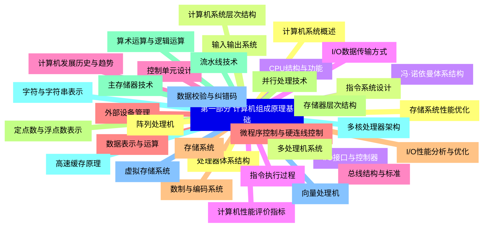
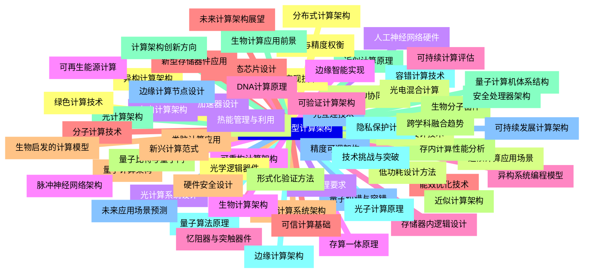


### 1 [第一部分 计算机组成原理基础](#1)
#### 1.1 [计算机系统概述](#1)
#### 1.2 [计算机系统层次结构](#1)
#### 1.3 [冯·诺依曼体系结构](#1)
#### 1.4 [计算机性能评价指标](#1)
#### 1.5 [计算机发展历史与趋势](#1)
#### 1.6 [数据表示与运算](#1)
#### 1.7 [数制与编码系统](#1)
#### 1.8 [定点数与浮点数表示](#1)
#### 1.9 [算术运算与逻辑运算](#1)
#### 1.10 [字符与字符串表示](#1)
#### 1.11 [数据校验与纠错码](#1)
#### 1.12 [处理器体系结构](#1)
#### 1.13 [指令系统设计](#1)
#### 1.14 [CPU结构与功能](#1)
#### 1.15 [指令执行过程](#1)
#### 1.16 [控制单元设计](#1)
#### 1.17 [微程序控制与硬连线控制](#1)
#### 1.18 [存储系统](#1)
#### 1.19 [存储器层次结构](#1)
#### 1.20 [主存储器技术](#1)
#### 1.21 [高速缓存原理](#1)
#### 1.22 [虚拟存储系统](#1)
#### 1.23 [存储系统性能优化](#1)
#### 1.24 [输入输出系统](#1)
#### 1.25 [I/O接口与控制器](#1)
#### 1.26 [I/O数据传输方式](#1)
#### 1.27 [总线结构与标准](#1)
#### 1.28 [外部设备管理](#1)
#### 1.29 [I/O性能分析与优化](#1)
#### 1.30 [并行处理技术](#1)
#### 1.31 [流水线技术](#1)
#### 1.32 [多核处理器架构](#1)
#### 1.33 [向量处理机](#1)
#### 1.34 [阵列处理机](#1)
#### 1.35 [多处理机系统](#1)
### 2 [第二部分 新型计算架构](#2)
#### 2.1 [异构计算架构](#2)
#### 2.2 [CPU-GPU协同计算](#2)
#### 2.3 [专用加速器设计](#2)
#### 2.4 [可重构计算架构](#2)
#### 2.5 [异构系统编程模型](#2)
#### 2.6 [能效优化技术](#2)
#### 2.7 [量子计算架构](#2)
#### 2.8 [量子比特与量子门](#2)
#### 2.9 [量子计算机体系结构](#2)
#### 2.10 [量子算法原理](#2)
#### 2.11 [量子纠错与容错](#2)
#### 2.12 [量子计算实现技术](#2)
#### 2.13 [神经形态计算](#2)
#### 2.14 [人工神经网络硬件](#2)
#### 2.15 [脉冲神经网络架构](#2)
#### 2.16 [忆阻器与突触器件](#2)
#### 2.17 [神经形态芯片设计](#2)
#### 2.18 [类脑计算应用](#2)
#### 2.19 [近似计算架构](#2)
#### 2.20 [近似计算原理](#2)
#### 2.21 [容错计算技术](#2)
#### 2.22 [精度可调架构](#2)
#### 2.23 [能效与精度权衡](#2)
#### 2.24 [近似计算应用场景](#2)
#### 2.25 [存内计算架构](#2)
#### 2.26 [存算一体原理](#2)
#### 2.27 [存储器内逻辑设计](#2)
#### 2.28 [新型存储器件应用](#2)
#### 2.29 [存内计算系统架构](#2)
#### 2.30 [存内计算性能分析](#2)
#### 2.31 [光计算架构](#2)
#### 2.32 [光子计算原理](#2)
#### 2.33 [光互连技术](#2)
#### 2.34 [光学逻辑器件](#2)
#### 2.35 [光电混合计算](#2)
#### 2.36 [光计算系统设计](#2)
#### 2.37 [生物计算架构](#2)
#### 2.38 [DNA计算原理](#2)
#### 2.39 [分子计算技术](#2)
#### 2.40 [生物启发的计算模型](#2)
#### 2.41 [生物分子器件](#2)
#### 2.42 [生物计算应用前景](#2)
#### 2.43 [边缘计算架构](#2)
#### 2.44 [边缘计算节点设计](#2)
#### 2.45 [分布式计算架构](#2)
#### 2.46 [低功耗设计技术](#2)
#### 2.47 [实时处理要求](#2)
#### 2.48 [边缘智能实现](#2)
#### 2.49 [可验证计算架构](#2)
#### 2.50 [可信计算基础](#2)
#### 2.51 [硬件安全设计](#2)
#### 2.52 [形式化验证方法](#2)
#### 2.53 [安全处理器架构](#2)
#### 2.54 [隐私保护计算](#2)
#### 2.55 [可持续发展计算架构](#2)
#### 2.56 [绿色计算技术](#2)
#### 2.57 [低功耗设计方法](#2)
#### 2.58 [热能管理与利用](#2)
#### 2.59 [可再生能源计算](#2)
#### 2.60 [可持续计算评估](#2)
#### 2.61 [未来计算架构展望](#2)
#### 2.62 [新兴计算范式](#2)
#### 2.63 [跨学科融合趋势](#2)
#### 2.64 [计算架构创新方向](#2)
#### 2.65 [技术挑战与突破](#2)
#### 2.66 [未来应用场景预测](#2)




### 1 第一部分 计算机组成原理基础

---
### 1 第一部分 计算机组成原理基础
___
#### 1.1 计算机系统概述
___
#### 1.2 计算机系统层次结构
___
#### 1.3 冯·诺依曼体系结构
___
#### 1.4 计算机性能评价指标
___
#### 1.5 计算机发展历史与趋势
___
#### 1.6 数据表示与运算
___
#### 1.7 数制与编码系统
___
#### 1.8 定点数与浮点数表示
___
#### 1.9 算术运算与逻辑运算
___
#### 1.10 字符与字符串表示
___
#### 1.11 数据校验与纠错码
___
#### 1.12 处理器体系结构
___
#### 1.13 指令系统设计
___
#### 1.14 CPU结构与功能
___
#### 1.15 指令执行过程
___
#### 1.16 控制单元设计
___
#### 1.17 微程序控制与硬连线控制
___
#### 1.18 存储系统
___
#### 1.19 存储器层次结构
___
#### 1.20 主存储器技术
___
#### 1.21 高速缓存原理
___
#### 1.22 虚拟存储系统
___
#### 1.23 存储系统性能优化
___
#### 1.24 输入输出系统
___
#### 1.25 I/O接口与控制器
___
#### 1.26 I/O数据传输方式
___
#### 1.27 总线结构与标准
___
#### 1.28 外部设备管理
___
#### 1.29 I/O性能分析与优化
___
#### 1.30 并行处理技术
___
#### 1.31 流水线技术
___
#### 1.32 多核处理器架构
___
#### 1.33 向量处理机
___
#### 1.34 阵列处理机
___
#### 1.35 多处理机系统
### 2 第二部分 新型计算架构

---
### 2 第二部分 新型计算架构
___
#### 2.1 异构计算架构
___
#### 2.2 CPU-GPU协同计算
___
#### 2.3 专用加速器设计
___
#### 2.4 可重构计算架构
___
#### 2.5 异构系统编程模型
___
#### 2.6 能效优化技术
___
#### 2.7 量子计算架构
___
#### 2.8 量子比特与量子门
___
#### 2.9 量子计算机体系结构
___
#### 2.10 量子算法原理
___
#### 2.11 量子纠错与容错
___
#### 2.12 量子计算实现技术
___
#### 2.13 神经形态计算
___
#### 2.14 人工神经网络硬件
___
#### 2.15 脉冲神经网络架构
___
#### 2.16 忆阻器与突触器件
___
#### 2.17 神经形态芯片设计
___
#### 2.18 类脑计算应用
___
#### 2.19 近似计算架构
___
#### 2.20 近似计算原理
___
#### 2.21 容错计算技术
___
#### 2.22 精度可调架构
___
#### 2.23 能效与精度权衡
___
#### 2.24 近似计算应用场景
___
#### 2.25 存内计算架构
___
#### 2.26 存算一体原理
___
#### 2.27 存储器内逻辑设计
___
#### 2.28 新型存储器件应用
___
#### 2.29 存内计算系统架构
___
#### 2.30 存内计算性能分析
___
#### 2.31 光计算架构
___
#### 2.32 光子计算原理
___
#### 2.33 光互连技术
___
#### 2.34 光学逻辑器件
___
#### 2.35 光电混合计算
___
#### 2.36 光计算系统设计
___
#### 2.37 生物计算架构
___
#### 2.38 DNA计算原理
___
#### 2.39 分子计算技术
___
#### 2.40 生物启发的计算模型
___
#### 2.41 生物分子器件
___
#### 2.42 生物计算应用前景
___
#### 2.43 边缘计算架构
___
#### 2.44 边缘计算节点设计
___
#### 2.45 分布式计算架构
___
#### 2.46 低功耗设计技术
___
#### 2.47 实时处理要求
___
#### 2.48 边缘智能实现
___
#### 2.49 可验证计算架构
___
#### 2.50 可信计算基础
___
#### 2.51 硬件安全设计
___
#### 2.52 形式化验证方法
___
#### 2.53 安全处理器架构
___
#### 2.54 隐私保护计算
___
#### 2.55 可持续发展计算架构
___
#### 2.56 绿色计算技术
___
#### 2.57 低功耗设计方法
___
#### 2.58 热能管理与利用
___
#### 2.59 可再生能源计算
___
#### 2.60 可持续计算评估
___
#### 2.61 未来计算架构展望
___
#### 2.62 新兴计算范式
___
#### 2.63 跨学科融合趋势
___
#### 2.64 计算架构创新方向
___
#### 2.65 技术挑战与突破
___
#### 2.66 未来应用场景预测


### 1 第一部分 计算机组成原理基础{#1}

{}

<--->
{}
{}
{}
{}
{}
{}
{}
{}
{}
{}
{}
{}
{}
{}
{}
{}
{}
{}
{}
{}
{}
{}
{}
{}
{}
{}
{}
{}
{}
{}
{}
{}
{}
{}
{}
{}
{}
{}
{}
{}
{}
{}
{}
{}
{}
{}
{}
{}
{}
{}
{}
{}
{}
{}
{}
{}
{}
{}
{}
{}
{}
{}
{}
{}
{}
{}
{}
{}
{}
{}
{}

### 2 第二部分 新型计算架构{#2}

{}
{}
{}
{}
{}
{}
{}
{}
{}
{}
{}
{}
{}
{}
{}
{}
{}
{}
{}
{}
{}
{}
{}
{}
{}
{}
{}
{}
{}
{}
{}
{}
{}
{}
{}
{}
{}
{}
{}
{}
{}
{}
{}
{}
{}
{}
{}
{}
{}
{}
{}
{}
{}
{}
{}
{}
{}
{}
{}
{}
{}
{}
{}
{}
{}
{}
{}
{}
{}
{}
{}
{}
{}
{}
{}
{}
{}
{}
{}
{}
{}
{}
{}
{}
{}
{}
{}
{}
{}
{}
{}
{}
{}
{}
{}
{}
{}
{}
{}
{}
{}
{}
{}
{}
{}
{}
{}
{}
{}
{}
{}
{}
{}
{}
{}
{}
{}
{}
{}
{}
{}
{}
{}
{}
{}
{}
{}
{}
{}
{}
{}
{}
{}
<--->

{}
