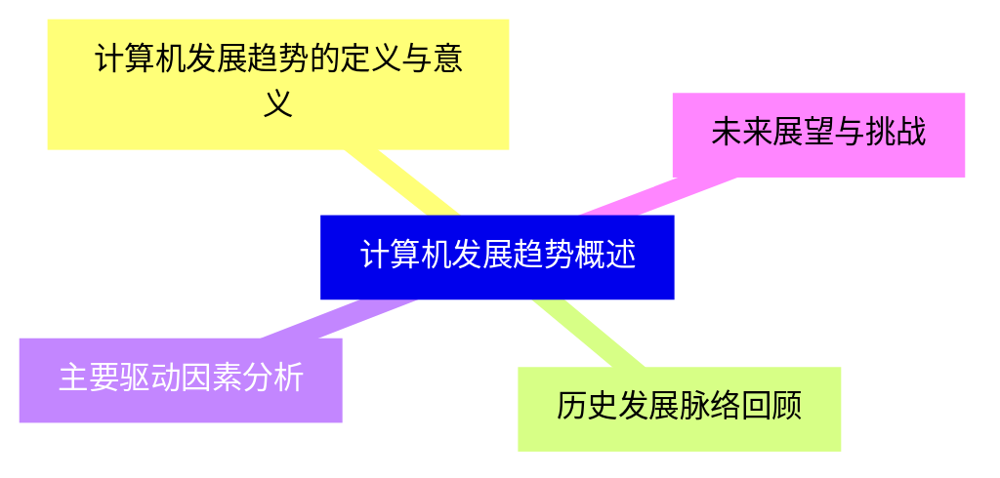
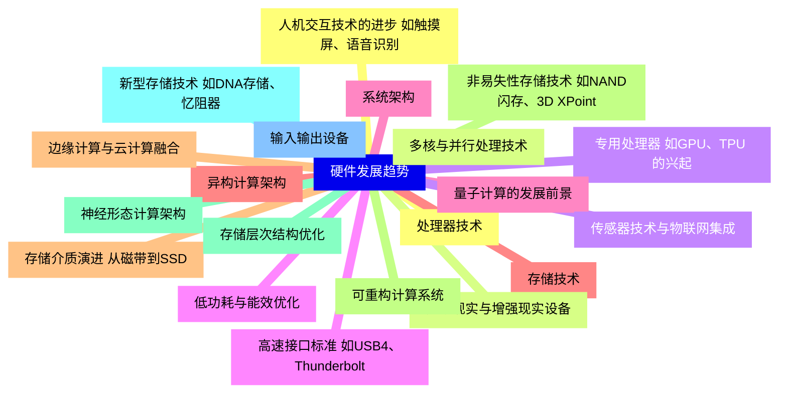
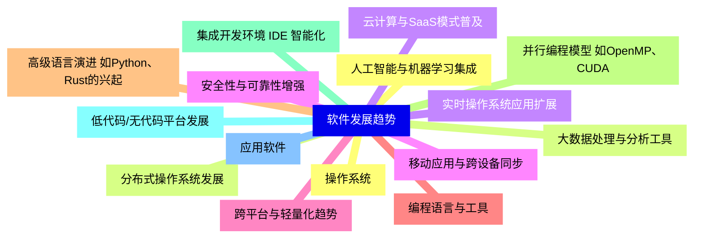
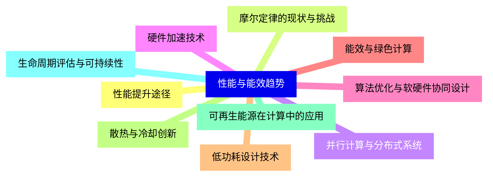
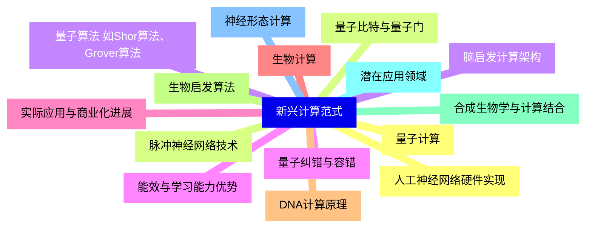
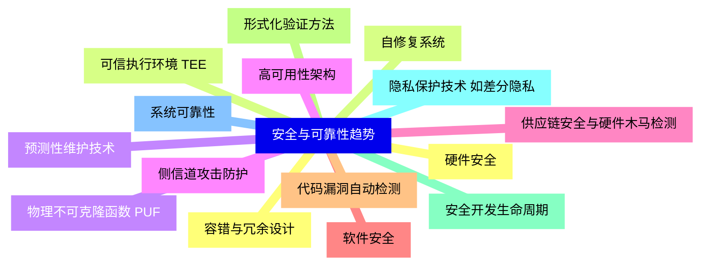
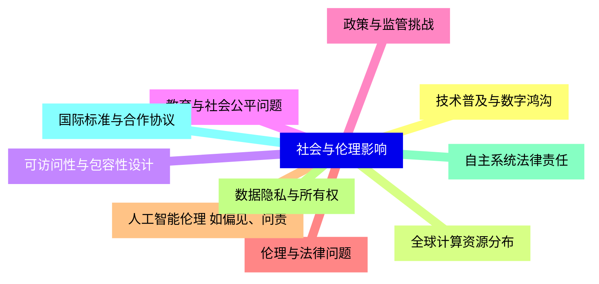
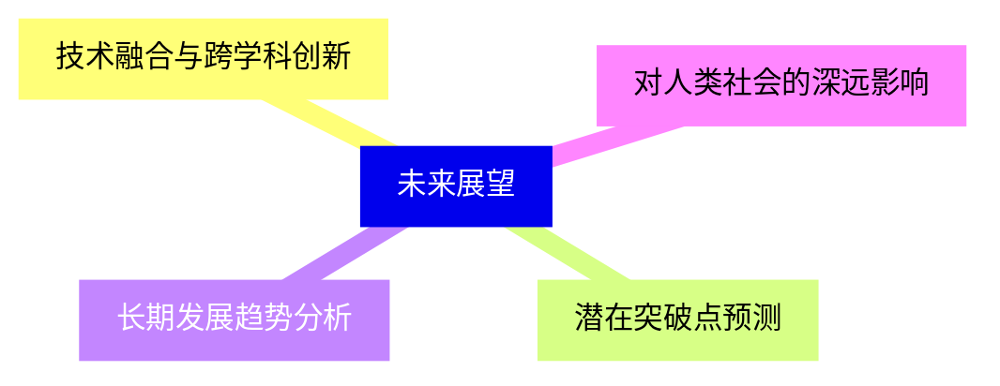


### 1 [计算机发展趋势概述](#1)
#### 1.1 [计算机发展趋势的定义与意义](#1)
#### 1.2 [历史发展脉络回顾](#1)
#### 1.3 [主要驱动因素分析](#1)
#### 1.4 [未来展望与挑战](#1)
### 2 [硬件发展趋势](#2)
#### 2.1 [处理器技术](#2)
#### 2.2 [多核与并行处理技术](#2)
#### 2.3 [专用处理器 如GPU、TPU 的兴起](#2)
#### 2.4 [低功耗与能效优化](#2)
#### 2.5 [量子计算的发展前景](#2)
#### 2.6 [存储技术](#2)
#### 2.7 [存储介质演进 从磁带到SSD](#2)
#### 2.8 [非易失性存储技术 如NAND闪存、3D XPoint](#2)
#### 2.9 [存储层次结构优化](#2)
#### 2.10 [新型存储技术 如DNA存储、忆阻器](#2)
#### 2.11 [输入输出设备](#2)
#### 2.12 [人机交互技术的进步 如触摸屏、语音识别](#2)
#### 2.13 [虚拟现实与增强现实设备](#2)
#### 2.14 [传感器技术与物联网集成](#2)
#### 2.15 [高速接口标准 如USB4、Thunderbolt](#2)
#### 2.16 [系统架构](#2)
#### 2.17 [异构计算架构](#2)
#### 2.18 [边缘计算与云计算融合](#2)
#### 2.19 [可重构计算系统](#2)
#### 2.20 [神经形态计算架构](#2)
### 3 [软件发展趋势](#3)
#### 3.1 [操作系统](#3)
#### 3.2 [分布式操作系统发展](#3)
#### 3.3 [实时操作系统应用扩展](#3)
#### 3.4 [安全性与可靠性增强](#3)
#### 3.5 [跨平台与轻量化趋势](#3)
#### 3.6 [编程语言与工具](#3)
#### 3.7 [高级语言演进 如Python、Rust的兴起](#3)
#### 3.8 [并行编程模型 如OpenMP、CUDA](#3)
#### 3.9 [集成开发环境 IDE 智能化](#3)
#### 3.10 [低代码/无代码平台发展](#3)
#### 3.11 [应用软件](#3)
#### 3.12 [人工智能与机器学习集成](#3)
#### 3.13 [大数据处理与分析工具](#3)
#### 3.14 [云计算与SaaS模式普及](#3)
#### 3.15 [移动应用与跨设备同步](#3)
### 4 [性能与能效趋势](#4)
#### 4.1 [性能提升途径](#4)
#### 4.2 [摩尔定律的现状与挑战](#4)
#### 4.3 [并行计算与分布式系统](#4)
#### 4.4 [硬件加速技术](#4)
#### 4.5 [算法优化与软硬件协同设计](#4)
#### 4.6 [能效与绿色计算](#4)
#### 4.7 [低功耗设计技术](#4)
#### 4.8 [散热与冷却创新](#4)
#### 4.9 [可再生能源在计算中的应用](#4)
#### 4.10 [生命周期评估与可持续性](#4)
### 5 [新兴计算范式](#5)
#### 5.1 [量子计算](#5)
#### 5.2 [量子比特与量子门](#5)
#### 5.3 [量子算法 如Shor算法、Grover算法](#5)
#### 5.4 [量子纠错与容错](#5)
#### 5.5 [实际应用与商业化进展](#5)
#### 5.6 [生物计算](#5)
#### 5.7 [DNA计算原理](#5)
#### 5.8 [生物启发算法](#5)
#### 5.9 [合成生物学与计算结合](#5)
#### 5.10 [潜在应用领域](#5)
#### 5.11 [神经形态计算](#5)
#### 5.12 [人工神经网络硬件实现](#5)
#### 5.13 [脉冲神经网络技术](#5)
#### 5.14 [脑启发计算架构](#5)
#### 5.15 [能效与学习能力优势](#5)
### 6 [安全与可靠性趋势](#6)
#### 6.1 [硬件安全](#6)
#### 6.2 [可信执行环境 TEE](#6)
#### 6.3 [物理不可克隆函数 PUF](#6)
#### 6.4 [侧信道攻击防护](#6)
#### 6.5 [供应链安全与硬件木马检测](#6)
#### 6.6 [软件安全](#6)
#### 6.7 [代码漏洞自动检测](#6)
#### 6.8 [形式化验证方法](#6)
#### 6.9 [安全开发生命周期](#6)
#### 6.10 [隐私保护技术 如差分隐私](#6)
#### 6.11 [系统可靠性](#6)
#### 6.12 [容错与冗余设计](#6)
#### 6.13 [自修复系统](#6)
#### 6.14 [预测性维护技术](#6)
#### 6.15 [高可用性架构](#6)
### 7 [社会与伦理影响](#7)
#### 7.1 [技术普及与数字鸿沟](#7)
#### 7.2 [全球计算资源分布](#7)
#### 7.3 [可访问性与包容性设计](#7)
#### 7.4 [教育与社会公平问题](#7)
#### 7.5 [政策与监管挑战](#7)
#### 7.6 [伦理与法律问题](#7)
#### 7.7 [人工智能伦理 如偏见、问责](#7)
#### 7.8 [数据隐私与所有权](#7)
#### 7.9 [自主系统法律责任](#7)
#### 7.10 [国际标准与合作协议](#7)
### 8 [未来展望](#8)
#### 8.1 [技术融合与跨学科创新](#8)
#### 8.2 [潜在突破点预测](#8)
#### 8.3 [长期发展趋势分析](#8)
#### 8.4 [对人类社会的深远影响](#8)




### 1 计算机发展趋势概述

---
### 1 计算机发展趋势概述
___
#### 1.1 计算机发展趋势的定义与意义
___
#### 1.2 历史发展脉络回顾
___
#### 1.3 主要驱动因素分析
___
#### 1.4 未来展望与挑战
### 2 硬件发展趋势

---
### 2 硬件发展趋势
___
#### 2.1 处理器技术
___
#### 2.2 多核与并行处理技术
___
#### 2.3 专用处理器 如GPU、TPU 的兴起
___
#### 2.4 低功耗与能效优化
___
#### 2.5 量子计算的发展前景
___
#### 2.6 存储技术
___
#### 2.7 存储介质演进 从磁带到SSD
___
#### 2.8 非易失性存储技术 如NAND闪存、3D XPoint
___
#### 2.9 存储层次结构优化
___
#### 2.10 新型存储技术 如DNA存储、忆阻器
___
#### 2.11 输入输出设备
___
#### 2.12 人机交互技术的进步 如触摸屏、语音识别
___
#### 2.13 虚拟现实与增强现实设备
___
#### 2.14 传感器技术与物联网集成
___
#### 2.15 高速接口标准 如USB4、Thunderbolt
___
#### 2.16 系统架构
___
#### 2.17 异构计算架构
___
#### 2.18 边缘计算与云计算融合
___
#### 2.19 可重构计算系统
___
#### 2.20 神经形态计算架构
### 3 软件发展趋势

---
### 3 软件发展趋势
___
#### 3.1 操作系统
___
#### 3.2 分布式操作系统发展
___
#### 3.3 实时操作系统应用扩展
___
#### 3.4 安全性与可靠性增强
___
#### 3.5 跨平台与轻量化趋势
___
#### 3.6 编程语言与工具
___
#### 3.7 高级语言演进 如Python、Rust的兴起
___
#### 3.8 并行编程模型 如OpenMP、CUDA
___
#### 3.9 集成开发环境 IDE 智能化
___
#### 3.10 低代码/无代码平台发展
___
#### 3.11 应用软件
___
#### 3.12 人工智能与机器学习集成
___
#### 3.13 大数据处理与分析工具
___
#### 3.14 云计算与SaaS模式普及
___
#### 3.15 移动应用与跨设备同步
### 4 性能与能效趋势

---
### 4 性能与能效趋势
___
#### 4.1 性能提升途径
___
#### 4.2 摩尔定律的现状与挑战
___
#### 4.3 并行计算与分布式系统
___
#### 4.4 硬件加速技术
___
#### 4.5 算法优化与软硬件协同设计
___
#### 4.6 能效与绿色计算
___
#### 4.7 低功耗设计技术
___
#### 4.8 散热与冷却创新
___
#### 4.9 可再生能源在计算中的应用
___
#### 4.10 生命周期评估与可持续性
### 5 新兴计算范式

---
### 5 新兴计算范式
___
#### 5.1 量子计算
___
#### 5.2 量子比特与量子门
___
#### 5.3 量子算法 如Shor算法、Grover算法
___
#### 5.4 量子纠错与容错
___
#### 5.5 实际应用与商业化进展
___
#### 5.6 生物计算
___
#### 5.7 DNA计算原理
___
#### 5.8 生物启发算法
___
#### 5.9 合成生物学与计算结合
___
#### 5.10 潜在应用领域
___
#### 5.11 神经形态计算
___
#### 5.12 人工神经网络硬件实现
___
#### 5.13 脉冲神经网络技术
___
#### 5.14 脑启发计算架构
___
#### 5.15 能效与学习能力优势
### 6 安全与可靠性趋势

---
### 6 安全与可靠性趋势
___
#### 6.1 硬件安全
___
#### 6.2 可信执行环境 TEE
___
#### 6.3 物理不可克隆函数 PUF
___
#### 6.4 侧信道攻击防护
___
#### 6.5 供应链安全与硬件木马检测
___
#### 6.6 软件安全
___
#### 6.7 代码漏洞自动检测
___
#### 6.8 形式化验证方法
___
#### 6.9 安全开发生命周期
___
#### 6.10 隐私保护技术 如差分隐私
___
#### 6.11 系统可靠性
___
#### 6.12 容错与冗余设计
___
#### 6.13 自修复系统
___
#### 6.14 预测性维护技术
___
#### 6.15 高可用性架构
### 7 社会与伦理影响

---
### 7 社会与伦理影响
___
#### 7.1 技术普及与数字鸿沟
___
#### 7.2 全球计算资源分布
___
#### 7.3 可访问性与包容性设计
___
#### 7.4 教育与社会公平问题
___
#### 7.5 政策与监管挑战
___
#### 7.6 伦理与法律问题
___
#### 7.7 人工智能伦理 如偏见、问责
___
#### 7.8 数据隐私与所有权
___
#### 7.9 自主系统法律责任
___
#### 7.10 国际标准与合作协议
### 8 未来展望

---
### 8 未来展望
___
#### 8.1 技术融合与跨学科创新
___
#### 8.2 潜在突破点预测
___
#### 8.3 长期发展趋势分析
___
#### 8.4 对人类社会的深远影响


### 1 计算机发展趋势概述{#1}

{}

<--->
{}
{}
{}
{}
{}
{}
{}
{}
{}

### 2 硬件发展趋势{#2}

{}
{}
{}
{}
{}
{}
{}
{}
{}
{}
{}
{}
{}
{}
{}
{}
{}
{}
{}
{}
{}
{}
{}
{}
{}
{}
{}
{}
{}
{}
{}
{}
{}
{}
{}
{}
{}
{}
{}
{}
{}
<--->

{}

### 3 软件发展趋势{#3}

{}

<--->
{}
{}
{}
{}
{}
{}
{}
{}
{}
{}
{}
{}
{}
{}
{}
{}
{}
{}
{}
{}
{}
{}
{}
{}
{}
{}
{}
{}
{}
{}
{}

### 4 性能与能效趋势{#4}

{}
{}
{}
{}
{}
{}
{}
{}
{}
{}
{}
{}
{}
{}
{}
{}
{}
{}
{}
{}
{}
<--->

{}

### 5 新兴计算范式{#5}

{}

<--->
{}
{}
{}
{}
{}
{}
{}
{}
{}
{}
{}
{}
{}
{}
{}
{}
{}
{}
{}
{}
{}
{}
{}
{}
{}
{}
{}
{}
{}
{}
{}

### 6 安全与可靠性趋势{#6}

{}
{}
{}
{}
{}
{}
{}
{}
{}
{}
{}
{}
{}
{}
{}
{}
{}
{}
{}
{}
{}
{}
{}
{}
{}
{}
{}
{}
{}
{}
{}
<--->

{}

### 7 社会与伦理影响{#7}

{}

<--->
{}
{}
{}
{}
{}
{}
{}
{}
{}
{}
{}
{}
{}
{}
{}
{}
{}
{}
{}
{}
{}

### 8 未来展望{#8}

{}
{}
{}
{}
{}
{}
{}
{}
{}
<--->

{}
