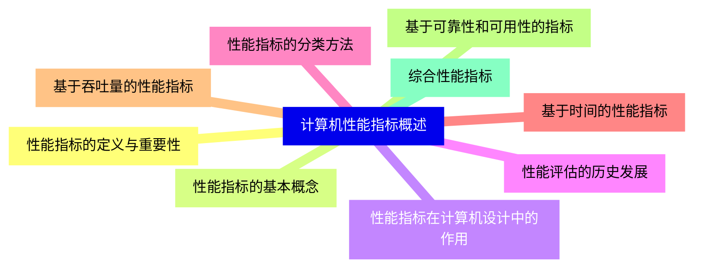
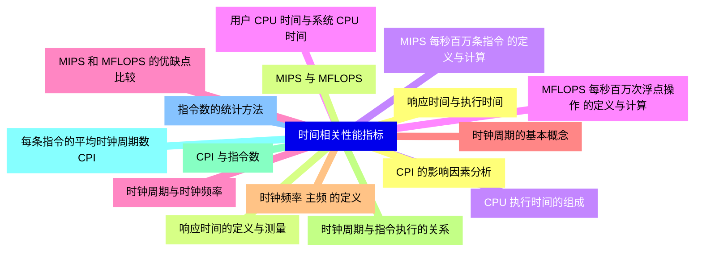
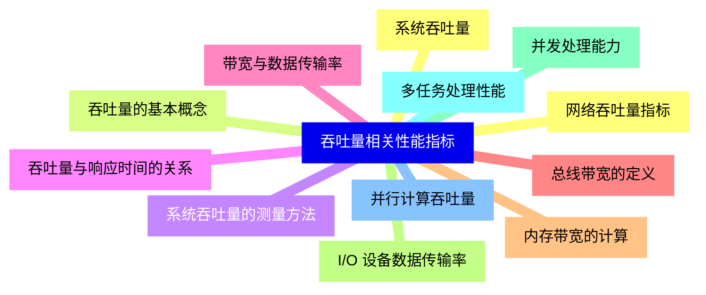
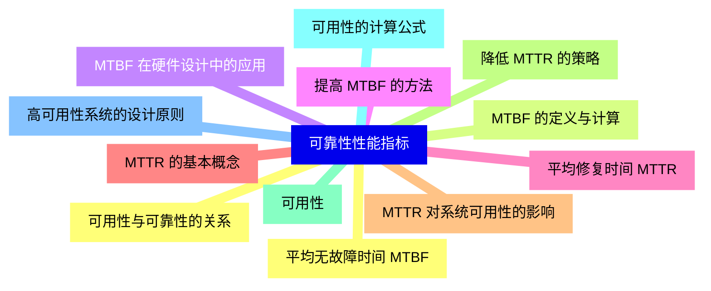
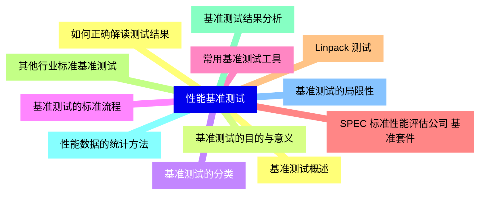
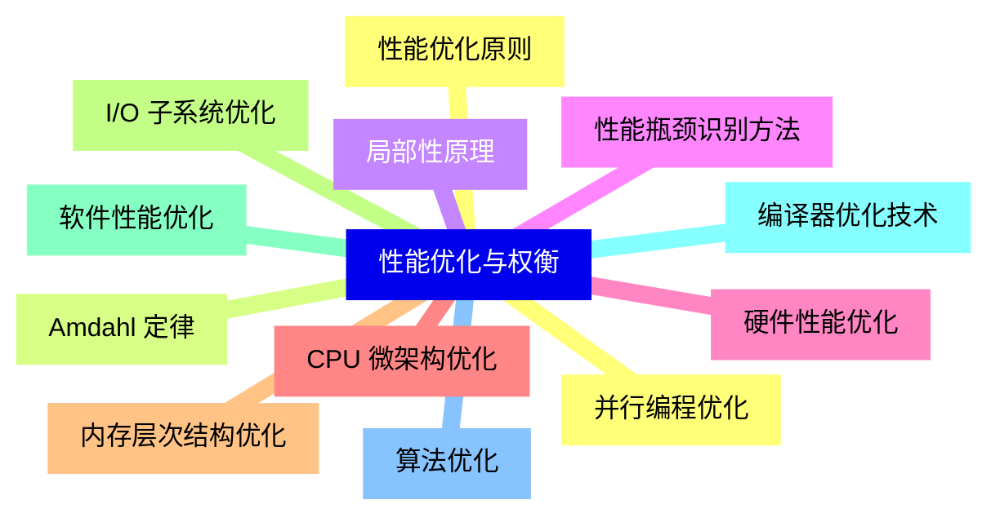
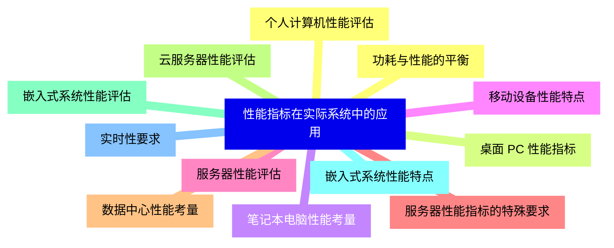
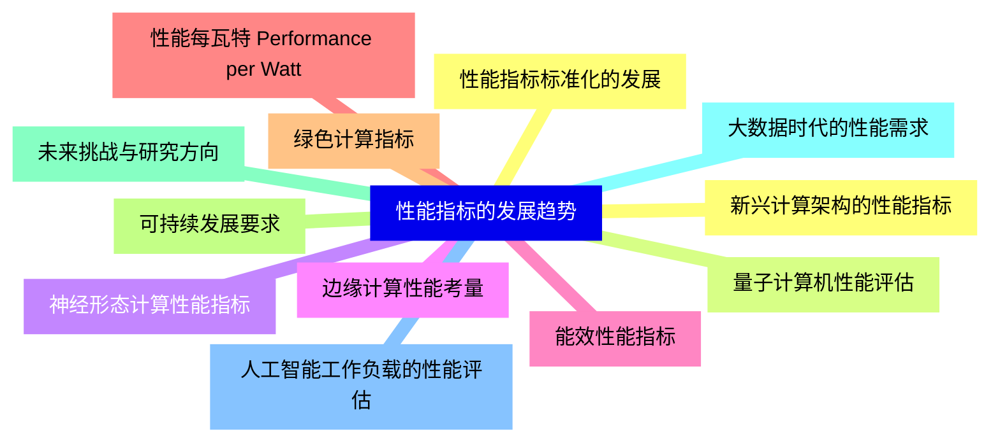


### 1 [计算机性能指标概述](#1)
#### 1.1 [性能指标的定义与重要性](#1)
#### 1.2 [性能指标的基本概念](#1)
#### 1.3 [性能指标在计算机设计中的作用](#1)
#### 1.4 [性能评估的历史发展](#1)
#### 1.5 [性能指标的分类方法](#1)
#### 1.6 [基于时间的性能指标](#1)
#### 1.7 [基于吞吐量的性能指标](#1)
#### 1.8 [基于可靠性和可用性的指标](#1)
#### 1.9 [综合性能指标](#1)
### 2 [时间相关性能指标](#2)
#### 2.1 [响应时间与执行时间](#2)
#### 2.2 [响应时间的定义与测量](#2)
#### 2.3 [CPU 执行时间的组成](#2)
#### 2.4 [用户 CPU 时间与系统 CPU 时间](#2)
#### 2.5 [时钟周期与时钟频率](#2)
#### 2.6 [时钟周期的基本概念](#2)
#### 2.7 [时钟频率 主频 的定义](#2)
#### 2.8 [时钟周期与指令执行的关系](#2)
#### 2.9 [CPI 与指令数](#2)
#### 2.10 [每条指令的平均时钟周期数 CPI](#2)
#### 2.11 [指令数的统计方法](#2)
#### 2.12 [CPI 的影响因素分析](#2)
#### 2.13 [MIPS 与 MFLOPS](#2)
#### 2.14 [MIPS 每秒百万条指令 的定义与计算](#2)
#### 2.15 [MFLOPS 每秒百万次浮点操作 的定义与计算](#2)
#### 2.16 [MIPS 和 MFLOPS 的优缺点比较](#2)
### 3 [吞吐量相关性能指标](#3)
#### 3.1 [系统吞吐量](#3)
#### 3.2 [吞吐量的基本概念](#3)
#### 3.3 [系统吞吐量的测量方法](#3)
#### 3.4 [吞吐量与响应时间的关系](#3)
#### 3.5 [带宽与数据传输率](#3)
#### 3.6 [总线带宽的定义](#3)
#### 3.7 [内存带宽的计算](#3)
#### 3.8 [I/O 设备数据传输率](#3)
#### 3.9 [并发处理能力](#3)
#### 3.10 [多任务处理性能](#3)
#### 3.11 [并行计算吞吐量](#3)
#### 3.12 [网络吞吐量指标](#3)
### 4 [可靠性性能指标](#4)
#### 4.1 [平均无故障时间 MTBF](#4)
#### 4.2 [MTBF 的定义与计算](#4)
#### 4.3 [MTBF 在硬件设计中的应用](#4)
#### 4.4 [提高 MTBF 的方法](#4)
#### 4.5 [平均修复时间 MTTR](#4)
#### 4.6 [MTTR 的基本概念](#4)
#### 4.7 [MTTR 对系统可用性的影响](#4)
#### 4.8 [降低 MTTR 的策略](#4)
#### 4.9 [可用性](#4)
#### 4.10 [可用性的计算公式](#4)
#### 4.11 [高可用性系统的设计原则](#4)
#### 4.12 [可用性与可靠性的关系](#4)
### 5 [性能基准测试](#5)
#### 5.1 [基准测试概述](#5)
#### 5.2 [基准测试的目的与意义](#5)
#### 5.3 [基准测试的分类](#5)
#### 5.4 [基准测试的标准流程](#5)
#### 5.5 [常用基准测试工具](#5)
#### 5.6 [SPEC 标准性能评估公司 基准套件](#5)
#### 5.7 [Linpack 测试](#5)
#### 5.8 [其他行业标准基准测试](#5)
#### 5.9 [基准测试结果分析](#5)
#### 5.10 [性能数据的统计方法](#5)
#### 5.11 [基准测试的局限性](#5)
#### 5.12 [如何正确解读测试结果](#5)
### 6 [性能优化与权衡](#6)
#### 6.1 [性能优化原则](#6)
#### 6.2 [Amdahl 定律](#6)
#### 6.3 [局部性原理](#6)
#### 6.4 [性能瓶颈识别方法](#6)
#### 6.5 [硬件性能优化](#6)
#### 6.6 [CPU 微架构优化](#6)
#### 6.7 [内存层次结构优化](#6)
#### 6.8 [I/O 子系统优化](#6)
#### 6.9 [软件性能优化](#6)
#### 6.10 [编译器优化技术](#6)
#### 6.11 [算法优化](#6)
#### 6.12 [并行编程优化](#6)
### 7 [性能指标在实际系统中的应用](#7)
#### 7.1 [个人计算机性能评估](#7)
#### 7.2 [桌面 PC 性能指标](#7)
#### 7.3 [笔记本电脑性能考量](#7)
#### 7.4 [移动设备性能特点](#7)
#### 7.5 [服务器性能评估](#7)
#### 7.6 [服务器性能指标的特殊要求](#7)
#### 7.7 [数据中心性能考量](#7)
#### 7.8 [云服务器性能评估](#7)
#### 7.9 [嵌入式系统性能评估](#7)
#### 7.10 [嵌入式系统性能特点](#7)
#### 7.11 [实时性要求](#7)
#### 7.12 [功耗与性能的平衡](#7)
### 8 [性能指标的发展趋势](#8)
#### 8.1 [新兴计算架构的性能指标](#8)
#### 8.2 [量子计算机性能评估](#8)
#### 8.3 [神经形态计算性能指标](#8)
#### 8.4 [边缘计算性能考量](#8)
#### 8.5 [能效性能指标](#8)
#### 8.6 [性能每瓦特 Performance per Watt](#8)
#### 8.7 [绿色计算指标](#8)
#### 8.8 [可持续发展要求](#8)
#### 8.9 [未来挑战与研究方向](#8)
#### 8.10 [大数据时代的性能需求](#8)
#### 8.11 [人工智能工作负载的性能评估](#8)
#### 8.12 [性能指标标准化的发展](#8)




### 1 计算机性能指标概述

---
### 1 计算机性能指标概述
___
#### 1.1 性能指标的定义与重要性
___
#### 1.2 性能指标的基本概念
___
#### 1.3 性能指标在计算机设计中的作用
___
#### 1.4 性能评估的历史发展
___
#### 1.5 性能指标的分类方法
___
#### 1.6 基于时间的性能指标
___
#### 1.7 基于吞吐量的性能指标
___
#### 1.8 基于可靠性和可用性的指标
___
#### 1.9 综合性能指标
### 2 时间相关性能指标

---
### 2 时间相关性能指标
___
#### 2.1 响应时间与执行时间
___
#### 2.2 响应时间的定义与测量
___
#### 2.3 CPU 执行时间的组成
___
#### 2.4 用户 CPU 时间与系统 CPU 时间
___
#### 2.5 时钟周期与时钟频率
___
#### 2.6 时钟周期的基本概念
___
#### 2.7 时钟频率 主频 的定义
___
#### 2.8 时钟周期与指令执行的关系
___
#### 2.9 CPI 与指令数
___
#### 2.10 每条指令的平均时钟周期数 CPI
___
#### 2.11 指令数的统计方法
___
#### 2.12 CPI 的影响因素分析
___
#### 2.13 MIPS 与 MFLOPS
___
#### 2.14 MIPS 每秒百万条指令 的定义与计算
___
#### 2.15 MFLOPS 每秒百万次浮点操作 的定义与计算
___
#### 2.16 MIPS 和 MFLOPS 的优缺点比较
### 3 吞吐量相关性能指标

---
### 3 吞吐量相关性能指标
___
#### 3.1 系统吞吐量
___
#### 3.2 吞吐量的基本概念
___
#### 3.3 系统吞吐量的测量方法
___
#### 3.4 吞吐量与响应时间的关系
___
#### 3.5 带宽与数据传输率
___
#### 3.6 总线带宽的定义
___
#### 3.7 内存带宽的计算
___
#### 3.8 I/O 设备数据传输率
___
#### 3.9 并发处理能力
___
#### 3.10 多任务处理性能
___
#### 3.11 并行计算吞吐量
___
#### 3.12 网络吞吐量指标
### 4 可靠性性能指标

---
### 4 可靠性性能指标
___
#### 4.1 平均无故障时间 MTBF
___
#### 4.2 MTBF 的定义与计算
___
#### 4.3 MTBF 在硬件设计中的应用
___
#### 4.4 提高 MTBF 的方法
___
#### 4.5 平均修复时间 MTTR
___
#### 4.6 MTTR 的基本概念
___
#### 4.7 MTTR 对系统可用性的影响
___
#### 4.8 降低 MTTR 的策略
___
#### 4.9 可用性
___
#### 4.10 可用性的计算公式
___
#### 4.11 高可用性系统的设计原则
___
#### 4.12 可用性与可靠性的关系
### 5 性能基准测试

---
### 5 性能基准测试
___
#### 5.1 基准测试概述
___
#### 5.2 基准测试的目的与意义
___
#### 5.3 基准测试的分类
___
#### 5.4 基准测试的标准流程
___
#### 5.5 常用基准测试工具
___
#### 5.6 SPEC 标准性能评估公司 基准套件
___
#### 5.7 Linpack 测试
___
#### 5.8 其他行业标准基准测试
___
#### 5.9 基准测试结果分析
___
#### 5.10 性能数据的统计方法
___
#### 5.11 基准测试的局限性
___
#### 5.12 如何正确解读测试结果
### 6 性能优化与权衡

---
### 6 性能优化与权衡
___
#### 6.1 性能优化原则
___
#### 6.2 Amdahl 定律
___
#### 6.3 局部性原理
___
#### 6.4 性能瓶颈识别方法
___
#### 6.5 硬件性能优化
___
#### 6.6 CPU 微架构优化
___
#### 6.7 内存层次结构优化
___
#### 6.8 I/O 子系统优化
___
#### 6.9 软件性能优化
___
#### 6.10 编译器优化技术
___
#### 6.11 算法优化
___
#### 6.12 并行编程优化
### 7 性能指标在实际系统中的应用

---
### 7 性能指标在实际系统中的应用
___
#### 7.1 个人计算机性能评估
___
#### 7.2 桌面 PC 性能指标
___
#### 7.3 笔记本电脑性能考量
___
#### 7.4 移动设备性能特点
___
#### 7.5 服务器性能评估
___
#### 7.6 服务器性能指标的特殊要求
___
#### 7.7 数据中心性能考量
___
#### 7.8 云服务器性能评估
___
#### 7.9 嵌入式系统性能评估
___
#### 7.10 嵌入式系统性能特点
___
#### 7.11 实时性要求
___
#### 7.12 功耗与性能的平衡
### 8 性能指标的发展趋势

---
### 8 性能指标的发展趋势
___
#### 8.1 新兴计算架构的性能指标
___
#### 8.2 量子计算机性能评估
___
#### 8.3 神经形态计算性能指标
___
#### 8.4 边缘计算性能考量
___
#### 8.5 能效性能指标
___
#### 8.6 性能每瓦特 Performance per Watt
___
#### 8.7 绿色计算指标
___
#### 8.8 可持续发展要求
___
#### 8.9 未来挑战与研究方向
___
#### 8.10 大数据时代的性能需求
___
#### 8.11 人工智能工作负载的性能评估
___
#### 8.12 性能指标标准化的发展


### 1 计算机性能指标概述{#1}

{}

<--->
{}
{}
{}
{}
{}
{}
{}
{}
{}
{}
{}
{}
{}
{}
{}
{}
{}
{}
{}

### 2 时间相关性能指标{#2}

{}
{}
{}
{}
{}
{}
{}
{}
{}
{}
{}
{}
{}
{}
{}
{}
{}
{}
{}
{}
{}
{}
{}
{}
{}
{}
{}
{}
{}
{}
{}
{}
{}
<--->

{}

### 3 吞吐量相关性能指标{#3}

{}

<--->
{}
{}
{}
{}
{}
{}
{}
{}
{}
{}
{}
{}
{}
{}
{}
{}
{}
{}
{}
{}
{}
{}
{}
{}
{}

### 4 可靠性性能指标{#4}

{}
{}
{}
{}
{}
{}
{}
{}
{}
{}
{}
{}
{}
{}
{}
{}
{}
{}
{}
{}
{}
{}
{}
{}
{}
<--->

{}

### 5 性能基准测试{#5}

{}

<--->
{}
{}
{}
{}
{}
{}
{}
{}
{}
{}
{}
{}
{}
{}
{}
{}
{}
{}
{}
{}
{}
{}
{}
{}
{}

### 6 性能优化与权衡{#6}

{}
{}
{}
{}
{}
{}
{}
{}
{}
{}
{}
{}
{}
{}
{}
{}
{}
{}
{}
{}
{}
{}
{}
{}
{}
<--->

{}

### 7 性能指标在实际系统中的应用{#7}

{}

<--->
{}
{}
{}
{}
{}
{}
{}
{}
{}
{}
{}
{}
{}
{}
{}
{}
{}
{}
{}
{}
{}
{}
{}
{}
{}

### 8 性能指标的发展趋势{#8}

{}
{}
{}
{}
{}
{}
{}
{}
{}
{}
{}
{}
{}
{}
{}
{}
{}
{}
{}
{}
{}
{}
{}
{}
{}
<--->

{}
