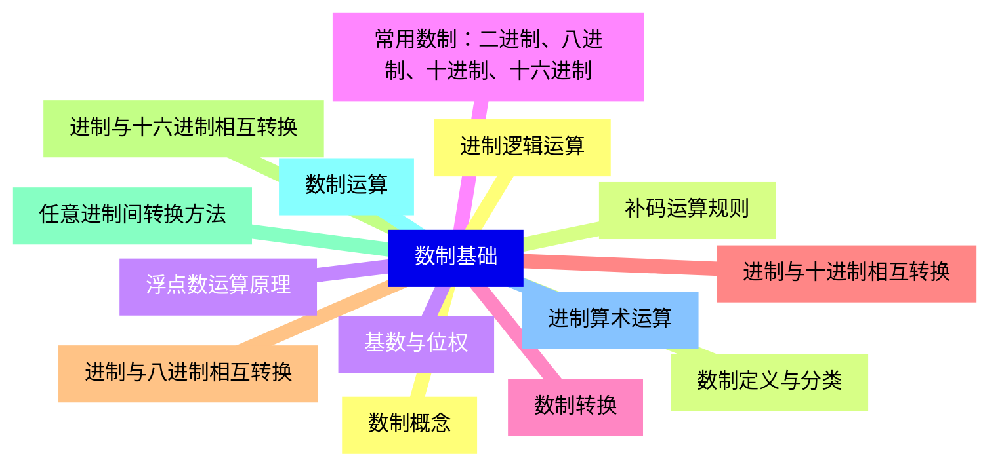
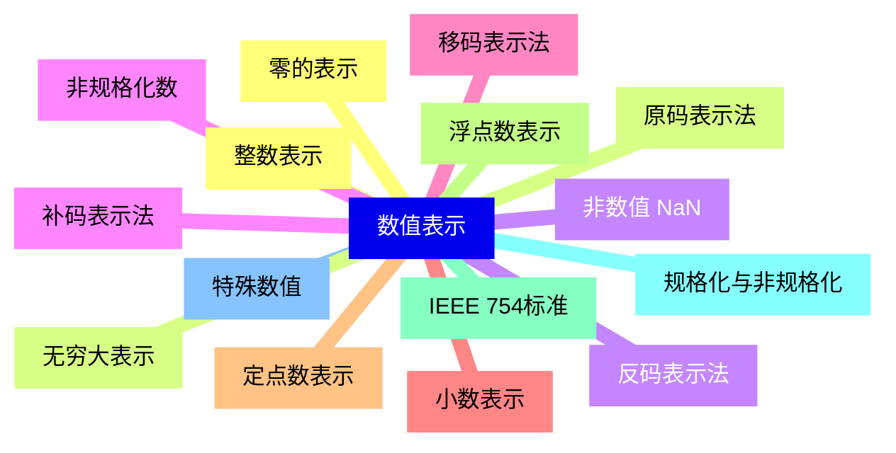
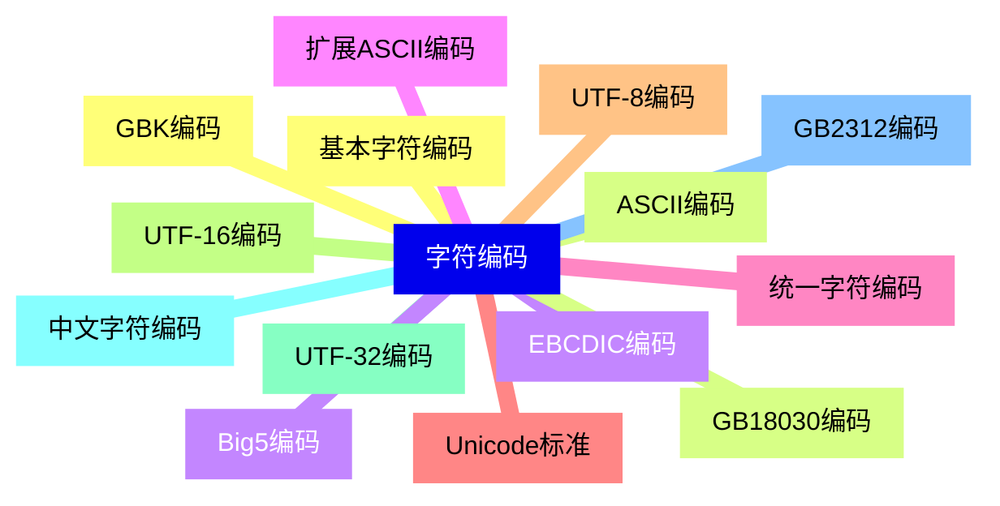
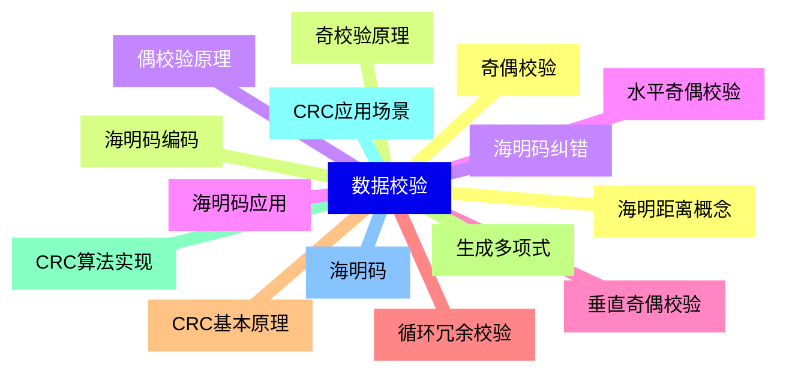
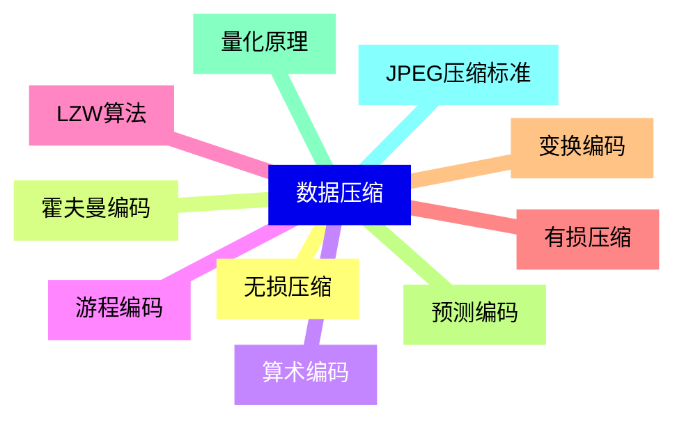
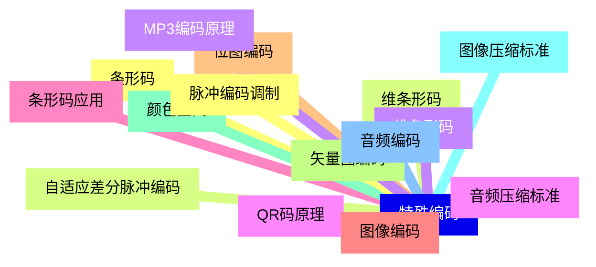
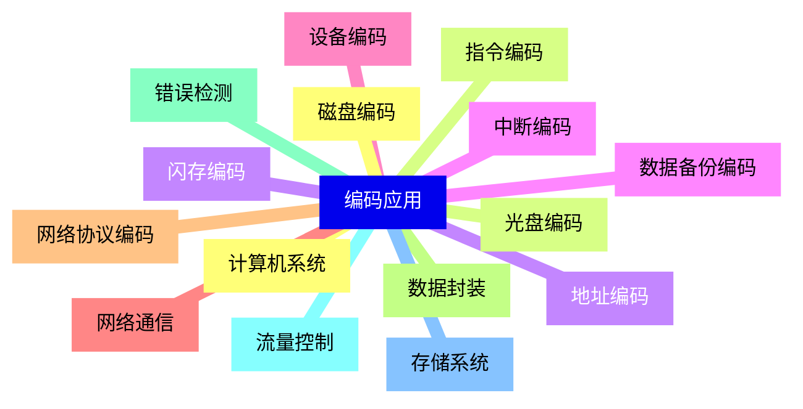


### 1 [数制基础](#1)
#### 1.1 [数制概念](#1)
#### 1.2 [数制定义与分类](#1)
#### 1.3 [基数与位权](#1)
#### 1.4 [常用数制：二进制、八进制、十进制、十六进制](#1)
#### 1.5 [数制转换](#1)
#### 1.6 [进制与十进制相互转换](#1)
#### 1.7 [进制与八进制相互转换](#1)
#### 1.8 [进制与十六进制相互转换](#1)
#### 1.9 [任意进制间转换方法](#1)
#### 1.10 [数制运算](#1)
#### 1.11 [进制算术运算](#1)
#### 1.12 [进制逻辑运算](#1)
#### 1.13 [补码运算规则](#1)
#### 1.14 [浮点数运算原理](#1)
### 2 [数值表示](#2)
#### 2.1 [整数表示](#2)
#### 2.2 [原码表示法](#2)
#### 2.3 [反码表示法](#2)
#### 2.4 [补码表示法](#2)
#### 2.5 [移码表示法](#2)
#### 2.6 [小数表示](#2)
#### 2.7 [定点数表示](#2)
#### 2.8 [浮点数表示](#2)
#### 2.9 [IEEE 754标准](#2)
#### 2.10 [规格化与非规格化](#2)
#### 2.11 [特殊数值](#2)
#### 2.12 [零的表示](#2)
#### 2.13 [无穷大表示](#2)
#### 2.14 [非数值 NaN](#2)
#### 2.15 [非规格化数](#2)
### 3 [字符编码](#3)
#### 3.1 [基本字符编码](#3)
#### 3.2 [ASCII编码](#3)
#### 3.3 [EBCDIC编码](#3)
#### 3.4 [扩展ASCII编码](#3)
#### 3.5 [统一字符编码](#3)
#### 3.6 [Unicode标准](#3)
#### 3.7 [UTF-8编码](#3)
#### 3.8 [UTF-16编码](#3)
#### 3.9 [UTF-32编码](#3)
#### 3.10 [中文字符编码](#3)
#### 3.11 [GB2312编码](#3)
#### 3.12 [GBK编码](#3)
#### 3.13 [GB18030编码](#3)
#### 3.14 [Big5编码](#3)
### 4 [数据校验](#4)
#### 4.1 [奇偶校验](#4)
#### 4.2 [奇校验原理](#4)
#### 4.3 [偶校验原理](#4)
#### 4.4 [水平奇偶校验](#4)
#### 4.5 [垂直奇偶校验](#4)
#### 4.6 [循环冗余校验](#4)
#### 4.7 [CRC基本原理](#4)
#### 4.8 [生成多项式](#4)
#### 4.9 [CRC算法实现](#4)
#### 4.10 [CRC应用场景](#4)
#### 4.11 [海明码](#4)
#### 4.12 [海明距离概念](#4)
#### 4.13 [海明码编码](#4)
#### 4.14 [海明码纠错](#4)
#### 4.15 [海明码应用](#4)
### 5 [数据压缩](#5)
#### 5.1 [无损压缩](#5)
#### 5.2 [霍夫曼编码](#5)
#### 5.3 [算术编码](#5)
#### 5.4 [游程编码](#5)
#### 5.5 [LZW算法](#5)
#### 5.6 [有损压缩](#5)
#### 5.7 [变换编码](#5)
#### 5.8 [预测编码](#5)
#### 5.9 [量化原理](#5)
#### 5.10 [JPEG压缩标准](#5)
### 6 [特殊编码](#6)
#### 6.1 [条形码](#6)
#### 6.2 [维条形码](#6)
#### 6.3 [维条形码](#6)
#### 6.4 [QR码原理](#6)
#### 6.5 [条形码应用](#6)
#### 6.6 [图像编码](#6)
#### 6.7 [位图编码](#6)
#### 6.8 [矢量图编码](#6)
#### 6.9 [颜色空间](#6)
#### 6.10 [图像压缩标准](#6)
#### 6.11 [音频编码](#6)
#### 6.12 [脉冲编码调制](#6)
#### 6.13 [自适应差分脉冲编码](#6)
#### 6.14 [MP3编码原理](#6)
#### 6.15 [音频压缩标准](#6)
### 7 [编码应用](#7)
#### 7.1 [计算机系统](#7)
#### 7.2 [指令编码](#7)
#### 7.3 [地址编码](#7)
#### 7.4 [中断编码](#7)
#### 7.5 [设备编码](#7)
#### 7.6 [网络通信](#7)
#### 7.7 [网络协议编码](#7)
#### 7.8 [数据封装](#7)
#### 7.9 [错误检测](#7)
#### 7.10 [流量控制](#7)
#### 7.11 [存储系统](#7)
#### 7.12 [磁盘编码](#7)
#### 7.13 [光盘编码](#7)
#### 7.14 [闪存编码](#7)
#### 7.15 [数据备份编码](#7)




### 1 数制基础

---
### 1 数制基础
___
#### 1.1 数制概念
___
#### 1.2 数制定义与分类
___
#### 1.3 基数与位权
___
#### 1.4 常用数制：二进制、八进制、十进制、十六进制
___
#### 1.5 数制转换
___
#### 1.6 进制与十进制相互转换
___
#### 1.7 进制与八进制相互转换
___
#### 1.8 进制与十六进制相互转换
___
#### 1.9 任意进制间转换方法
___
#### 1.10 数制运算
___
#### 1.11 进制算术运算
___
#### 1.12 进制逻辑运算
___
#### 1.13 补码运算规则
___
#### 1.14 浮点数运算原理
### 2 数值表示

---
### 2 数值表示
___
#### 2.1 整数表示
___
#### 2.2 原码表示法
___
#### 2.3 反码表示法
___
#### 2.4 补码表示法
___
#### 2.5 移码表示法
___
#### 2.6 小数表示
___
#### 2.7 定点数表示
___
#### 2.8 浮点数表示
___
#### 2.9 IEEE 754标准
___
#### 2.10 规格化与非规格化
___
#### 2.11 特殊数值
___
#### 2.12 零的表示
___
#### 2.13 无穷大表示
___
#### 2.14 非数值 NaN
___
#### 2.15 非规格化数
### 3 字符编码

---
### 3 字符编码
___
#### 3.1 基本字符编码
___
#### 3.2 ASCII编码
___
#### 3.3 EBCDIC编码
___
#### 3.4 扩展ASCII编码
___
#### 3.5 统一字符编码
___
#### 3.6 Unicode标准
___
#### 3.7 UTF-8编码
___
#### 3.8 UTF-16编码
___
#### 3.9 UTF-32编码
___
#### 3.10 中文字符编码
___
#### 3.11 GB2312编码
___
#### 3.12 GBK编码
___
#### 3.13 GB18030编码
___
#### 3.14 Big5编码
### 4 数据校验

---
### 4 数据校验
___
#### 4.1 奇偶校验
___
#### 4.2 奇校验原理
___
#### 4.3 偶校验原理
___
#### 4.4 水平奇偶校验
___
#### 4.5 垂直奇偶校验
___
#### 4.6 循环冗余校验
___
#### 4.7 CRC基本原理
___
#### 4.8 生成多项式
___
#### 4.9 CRC算法实现
___
#### 4.10 CRC应用场景
___
#### 4.11 海明码
___
#### 4.12 海明距离概念
___
#### 4.13 海明码编码
___
#### 4.14 海明码纠错
___
#### 4.15 海明码应用
### 5 数据压缩

---
### 5 数据压缩
___
#### 5.1 无损压缩
___
#### 5.2 霍夫曼编码
___
#### 5.3 算术编码
___
#### 5.4 游程编码
___
#### 5.5 LZW算法
___
#### 5.6 有损压缩
___
#### 5.7 变换编码
___
#### 5.8 预测编码
___
#### 5.9 量化原理
___
#### 5.10 JPEG压缩标准
### 6 特殊编码

---
### 6 特殊编码
___
#### 6.1 条形码
___
#### 6.2 维条形码
___
#### 6.3 维条形码
___
#### 6.4 QR码原理
___
#### 6.5 条形码应用
___
#### 6.6 图像编码
___
#### 6.7 位图编码
___
#### 6.8 矢量图编码
___
#### 6.9 颜色空间
___
#### 6.10 图像压缩标准
___
#### 6.11 音频编码
___
#### 6.12 脉冲编码调制
___
#### 6.13 自适应差分脉冲编码
___
#### 6.14 MP3编码原理
___
#### 6.15 音频压缩标准
### 7 编码应用

---
### 7 编码应用
___
#### 7.1 计算机系统
___
#### 7.2 指令编码
___
#### 7.3 地址编码
___
#### 7.4 中断编码
___
#### 7.5 设备编码
___
#### 7.6 网络通信
___
#### 7.7 网络协议编码
___
#### 7.8 数据封装
___
#### 7.9 错误检测
___
#### 7.10 流量控制
___
#### 7.11 存储系统
___
#### 7.12 磁盘编码
___
#### 7.13 光盘编码
___
#### 7.14 闪存编码
___
#### 7.15 数据备份编码


### 1 数制基础{#1}

{}

<--->
{}
{}
{}
{}
{}
{}
{}
{}
{}
{}
{}
{}
{}
{}
{}
{}
{}
{}
{}
{}
{}
{}
{}
{}
{}
{}
{}
{}
{}

### 2 数值表示{#2}

{}
{}
{}
{}
{}
{}
{}
{}
{}
{}
{}
{}
{}
{}
{}
{}
{}
{}
{}
{}
{}
{}
{}
{}
{}
{}
{}
{}
{}
{}
{}
<--->

{}

### 3 字符编码{#3}

{}

<--->
{}
{}
{}
{}
{}
{}
{}
{}
{}
{}
{}
{}
{}
{}
{}
{}
{}
{}
{}
{}
{}
{}
{}
{}
{}
{}
{}
{}
{}

### 4 数据校验{#4}

{}
{}
{}
{}
{}
{}
{}
{}
{}
{}
{}
{}
{}
{}
{}
{}
{}
{}
{}
{}
{}
{}
{}
{}
{}
{}
{}
{}
{}
{}
{}
<--->

{}

### 5 数据压缩{#5}

{}

<--->
{}
{}
{}
{}
{}
{}
{}
{}
{}
{}
{}
{}
{}
{}
{}
{}
{}
{}
{}
{}
{}

### 6 特殊编码{#6}

{}
{}
{}
{}
{}
{}
{}
{}
{}
{}
{}
{}
{}
{}
{}
{}
{}
{}
{}
{}
{}
{}
{}
{}
{}
{}
{}
{}
{}
{}
{}
<--->

{}

### 7 编码应用{#7}

{}

<--->
{}
{}
{}
{}
{}
{}
{}
{}
{}
{}
{}
{}
{}
{}
{}
{}
{}
{}
{}
{}
{}
{}
{}
{}
{}
{}
{}
{}
{}
{}
{}
