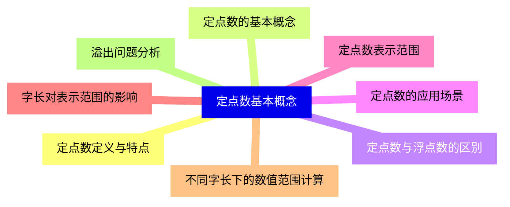
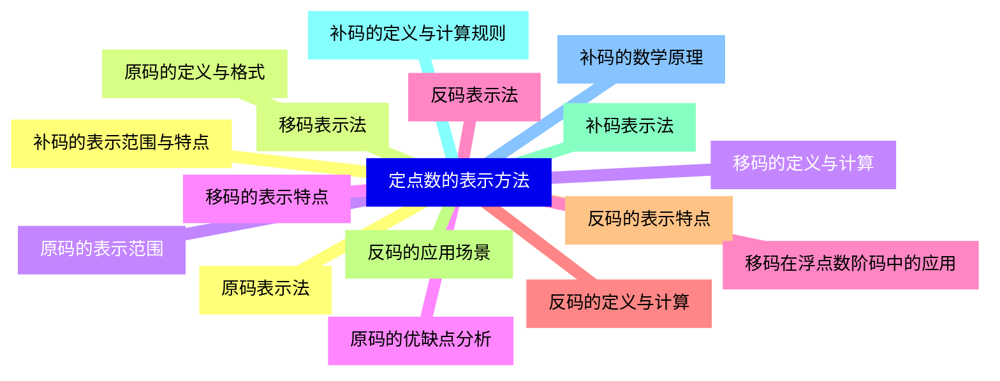
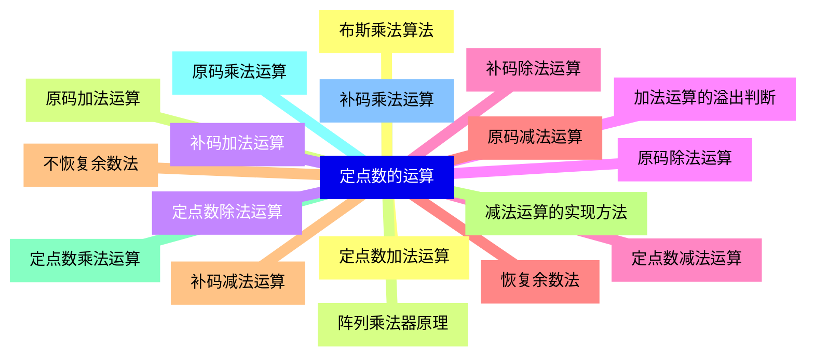
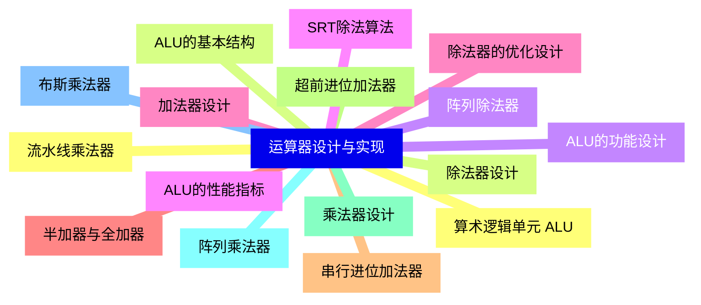
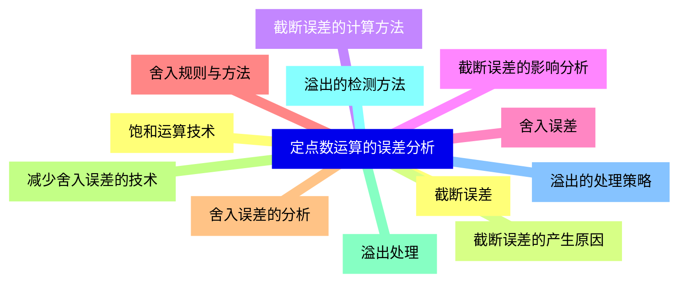
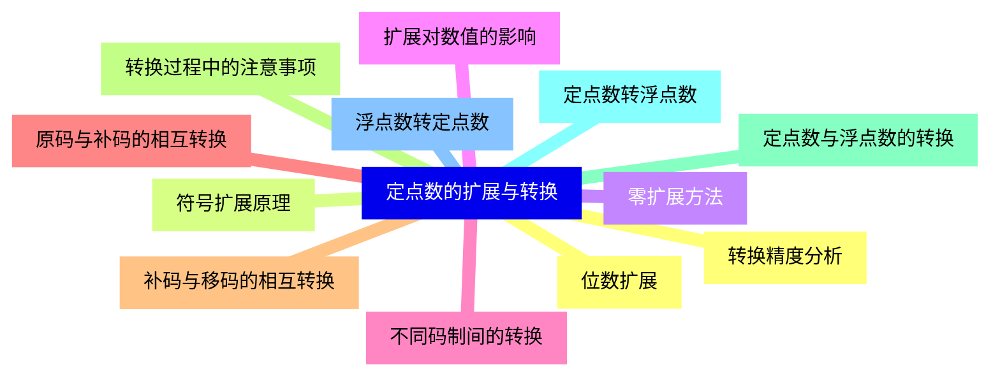
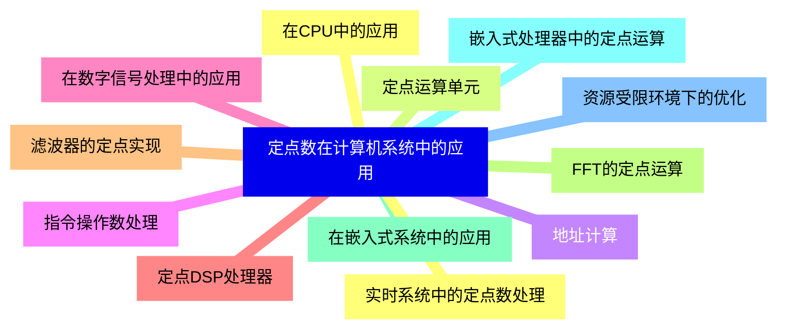
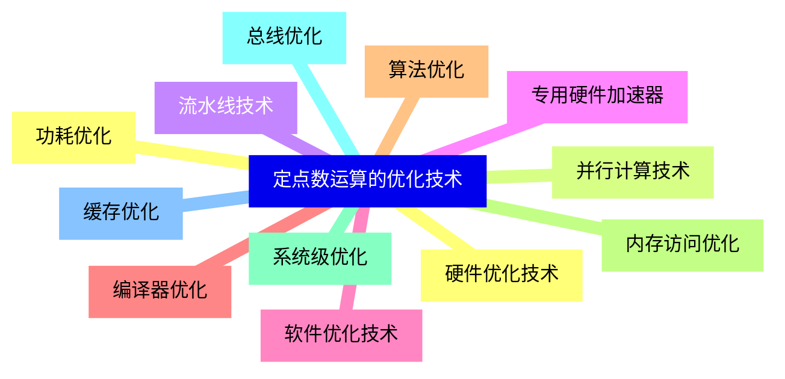


### 1 [定点数基本概念](#1)
#### 1.1 [定点数定义与特点](#1)
#### 1.2 [定点数的基本概念](#1)
#### 1.3 [定点数与浮点数的区别](#1)
#### 1.4 [定点数的应用场景](#1)
#### 1.5 [定点数表示范围](#1)
#### 1.6 [字长对表示范围的影响](#1)
#### 1.7 [不同字长下的数值范围计算](#1)
#### 1.8 [溢出问题分析](#1)
### 2 [定点数的表示方法](#2)
#### 2.1 [原码表示法](#2)
#### 2.2 [原码的定义与格式](#2)
#### 2.3 [原码的表示范围](#2)
#### 2.4 [原码的优缺点分析](#2)
#### 2.5 [反码表示法](#2)
#### 2.6 [反码的定义与计算](#2)
#### 2.7 [反码的表示特点](#2)
#### 2.8 [反码的应用场景](#2)
#### 2.9 [补码表示法](#2)
#### 2.10 [补码的定义与计算规则](#2)
#### 2.11 [补码的数学原理](#2)
#### 2.12 [补码的表示范围与特点](#2)
#### 2.13 [移码表示法](#2)
#### 2.14 [移码的定义与计算](#2)
#### 2.15 [移码的表示特点](#2)
#### 2.16 [移码在浮点数阶码中的应用](#2)
### 3 [定点数的运算](#3)
#### 3.1 [定点数加法运算](#3)
#### 3.2 [原码加法运算](#3)
#### 3.3 [补码加法运算](#3)
#### 3.4 [加法运算的溢出判断](#3)
#### 3.5 [定点数减法运算](#3)
#### 3.6 [原码减法运算](#3)
#### 3.7 [补码减法运算](#3)
#### 3.8 [减法运算的实现方法](#3)
#### 3.9 [定点数乘法运算](#3)
#### 3.10 [原码乘法运算](#3)
#### 3.11 [补码乘法运算](#3)
#### 3.12 [布斯乘法算法](#3)
#### 3.13 [阵列乘法器原理](#3)
#### 3.14 [定点数除法运算](#3)
#### 3.15 [原码除法运算](#3)
#### 3.16 [补码除法运算](#3)
#### 3.17 [恢复余数法](#3)
#### 3.18 [不恢复余数法](#3)
### 4 [运算器设计与实现](#4)
#### 4.1 [算术逻辑单元 ALU](#4)
#### 4.2 [ALU的基本结构](#4)
#### 4.3 [ALU的功能设计](#4)
#### 4.4 [ALU的性能指标](#4)
#### 4.5 [加法器设计](#4)
#### 4.6 [半加器与全加器](#4)
#### 4.7 [串行进位加法器](#4)
#### 4.8 [超前进位加法器](#4)
#### 4.9 [乘法器设计](#4)
#### 4.10 [阵列乘法器](#4)
#### 4.11 [布斯乘法器](#4)
#### 4.12 [流水线乘法器](#4)
#### 4.13 [除法器设计](#4)
#### 4.14 [阵列除法器](#4)
#### 4.15 [SRT除法算法](#4)
#### 4.16 [除法器的优化设计](#4)
### 5 [定点数运算的误差分析](#5)
#### 5.1 [截断误差](#5)
#### 5.2 [截断误差的产生原因](#5)
#### 5.3 [截断误差的计算方法](#5)
#### 5.4 [截断误差的影响分析](#5)
#### 5.5 [舍入误差](#5)
#### 5.6 [舍入规则与方法](#5)
#### 5.7 [舍入误差的分析](#5)
#### 5.8 [减少舍入误差的技术](#5)
#### 5.9 [溢出处理](#5)
#### 5.10 [溢出的检测方法](#5)
#### 5.11 [溢出的处理策略](#5)
#### 5.12 [饱和运算技术](#5)
### 6 [定点数的扩展与转换](#6)
#### 6.1 [位数扩展](#6)
#### 6.2 [符号扩展原理](#6)
#### 6.3 [零扩展方法](#6)
#### 6.4 [扩展对数值的影响](#6)
#### 6.5 [不同码制间的转换](#6)
#### 6.6 [原码与补码的相互转换](#6)
#### 6.7 [补码与移码的相互转换](#6)
#### 6.8 [转换过程中的注意事项](#6)
#### 6.9 [定点数与浮点数的转换](#6)
#### 6.10 [定点数转浮点数](#6)
#### 6.11 [浮点数转定点数](#6)
#### 6.12 [转换精度分析](#6)
### 7 [定点数在计算机系统中的应用](#7)
#### 7.1 [在CPU中的应用](#7)
#### 7.2 [定点运算单元](#7)
#### 7.3 [地址计算](#7)
#### 7.4 [指令操作数处理](#7)
#### 7.5 [在数字信号处理中的应用](#7)
#### 7.6 [定点DSP处理器](#7)
#### 7.7 [滤波器的定点实现](#7)
#### 7.8 [FFT的定点运算](#7)
#### 7.9 [在嵌入式系统中的应用](#7)
#### 7.10 [嵌入式处理器中的定点运算](#7)
#### 7.11 [资源受限环境下的优化](#7)
#### 7.12 [实时系统中的定点数处理](#7)
### 8 [定点数运算的优化技术](#8)
#### 8.1 [硬件优化技术](#8)
#### 8.2 [并行计算技术](#8)
#### 8.3 [流水线技术](#8)
#### 8.4 [专用硬件加速器](#8)
#### 8.5 [软件优化技术](#8)
#### 8.6 [编译器优化](#8)
#### 8.7 [算法优化](#8)
#### 8.8 [内存访问优化](#8)
#### 8.9 [系统级优化](#8)
#### 8.10 [总线优化](#8)
#### 8.11 [缓存优化](#8)
#### 8.12 [功耗优化](#8)




### 1 定点数基本概念

---
### 1 定点数基本概念
___
#### 1.1 定点数定义与特点
___
#### 1.2 定点数的基本概念
___
#### 1.3 定点数与浮点数的区别
___
#### 1.4 定点数的应用场景
___
#### 1.5 定点数表示范围
___
#### 1.6 字长对表示范围的影响
___
#### 1.7 不同字长下的数值范围计算
___
#### 1.8 溢出问题分析
### 2 定点数的表示方法

---
### 2 定点数的表示方法
___
#### 2.1 原码表示法
___
#### 2.2 原码的定义与格式
___
#### 2.3 原码的表示范围
___
#### 2.4 原码的优缺点分析
___
#### 2.5 反码表示法
___
#### 2.6 反码的定义与计算
___
#### 2.7 反码的表示特点
___
#### 2.8 反码的应用场景
___
#### 2.9 补码表示法
___
#### 2.10 补码的定义与计算规则
___
#### 2.11 补码的数学原理
___
#### 2.12 补码的表示范围与特点
___
#### 2.13 移码表示法
___
#### 2.14 移码的定义与计算
___
#### 2.15 移码的表示特点
___
#### 2.16 移码在浮点数阶码中的应用
### 3 定点数的运算

---
### 3 定点数的运算
___
#### 3.1 定点数加法运算
___
#### 3.2 原码加法运算
___
#### 3.3 补码加法运算
___
#### 3.4 加法运算的溢出判断
___
#### 3.5 定点数减法运算
___
#### 3.6 原码减法运算
___
#### 3.7 补码减法运算
___
#### 3.8 减法运算的实现方法
___
#### 3.9 定点数乘法运算
___
#### 3.10 原码乘法运算
___
#### 3.11 补码乘法运算
___
#### 3.12 布斯乘法算法
___
#### 3.13 阵列乘法器原理
___
#### 3.14 定点数除法运算
___
#### 3.15 原码除法运算
___
#### 3.16 补码除法运算
___
#### 3.17 恢复余数法
___
#### 3.18 不恢复余数法
### 4 运算器设计与实现

---
### 4 运算器设计与实现
___
#### 4.1 算术逻辑单元 ALU
___
#### 4.2 ALU的基本结构
___
#### 4.3 ALU的功能设计
___
#### 4.4 ALU的性能指标
___
#### 4.5 加法器设计
___
#### 4.6 半加器与全加器
___
#### 4.7 串行进位加法器
___
#### 4.8 超前进位加法器
___
#### 4.9 乘法器设计
___
#### 4.10 阵列乘法器
___
#### 4.11 布斯乘法器
___
#### 4.12 流水线乘法器
___
#### 4.13 除法器设计
___
#### 4.14 阵列除法器
___
#### 4.15 SRT除法算法
___
#### 4.16 除法器的优化设计
### 5 定点数运算的误差分析

---
### 5 定点数运算的误差分析
___
#### 5.1 截断误差
___
#### 5.2 截断误差的产生原因
___
#### 5.3 截断误差的计算方法
___
#### 5.4 截断误差的影响分析
___
#### 5.5 舍入误差
___
#### 5.6 舍入规则与方法
___
#### 5.7 舍入误差的分析
___
#### 5.8 减少舍入误差的技术
___
#### 5.9 溢出处理
___
#### 5.10 溢出的检测方法
___
#### 5.11 溢出的处理策略
___
#### 5.12 饱和运算技术
### 6 定点数的扩展与转换

---
### 6 定点数的扩展与转换
___
#### 6.1 位数扩展
___
#### 6.2 符号扩展原理
___
#### 6.3 零扩展方法
___
#### 6.4 扩展对数值的影响
___
#### 6.5 不同码制间的转换
___
#### 6.6 原码与补码的相互转换
___
#### 6.7 补码与移码的相互转换
___
#### 6.8 转换过程中的注意事项
___
#### 6.9 定点数与浮点数的转换
___
#### 6.10 定点数转浮点数
___
#### 6.11 浮点数转定点数
___
#### 6.12 转换精度分析
### 7 定点数在计算机系统中的应用

---
### 7 定点数在计算机系统中的应用
___
#### 7.1 在CPU中的应用
___
#### 7.2 定点运算单元
___
#### 7.3 地址计算
___
#### 7.4 指令操作数处理
___
#### 7.5 在数字信号处理中的应用
___
#### 7.6 定点DSP处理器
___
#### 7.7 滤波器的定点实现
___
#### 7.8 FFT的定点运算
___
#### 7.9 在嵌入式系统中的应用
___
#### 7.10 嵌入式处理器中的定点运算
___
#### 7.11 资源受限环境下的优化
___
#### 7.12 实时系统中的定点数处理
### 8 定点数运算的优化技术

---
### 8 定点数运算的优化技术
___
#### 8.1 硬件优化技术
___
#### 8.2 并行计算技术
___
#### 8.3 流水线技术
___
#### 8.4 专用硬件加速器
___
#### 8.5 软件优化技术
___
#### 8.6 编译器优化
___
#### 8.7 算法优化
___
#### 8.8 内存访问优化
___
#### 8.9 系统级优化
___
#### 8.10 总线优化
___
#### 8.11 缓存优化
___
#### 8.12 功耗优化


### 1 定点数基本概念{#1}

{}

<--->
{}
{}
{}
{}
{}
{}
{}
{}
{}
{}
{}
{}
{}
{}
{}
{}
{}

### 2 定点数的表示方法{#2}

{}
{}
{}
{}
{}
{}
{}
{}
{}
{}
{}
{}
{}
{}
{}
{}
{}
{}
{}
{}
{}
{}
{}
{}
{}
{}
{}
{}
{}
{}
{}
{}
{}
<--->

{}

### 3 定点数的运算{#3}

{}

<--->
{}
{}
{}
{}
{}
{}
{}
{}
{}
{}
{}
{}
{}
{}
{}
{}
{}
{}
{}
{}
{}
{}
{}
{}
{}
{}
{}
{}
{}
{}
{}
{}
{}
{}
{}
{}
{}

### 4 运算器设计与实现{#4}

{}
{}
{}
{}
{}
{}
{}
{}
{}
{}
{}
{}
{}
{}
{}
{}
{}
{}
{}
{}
{}
{}
{}
{}
{}
{}
{}
{}
{}
{}
{}
{}
{}
<--->

{}

### 5 定点数运算的误差分析{#5}

{}

<--->
{}
{}
{}
{}
{}
{}
{}
{}
{}
{}
{}
{}
{}
{}
{}
{}
{}
{}
{}
{}
{}
{}
{}
{}
{}

### 6 定点数的扩展与转换{#6}

{}
{}
{}
{}
{}
{}
{}
{}
{}
{}
{}
{}
{}
{}
{}
{}
{}
{}
{}
{}
{}
{}
{}
{}
{}
<--->

{}

### 7 定点数在计算机系统中的应用{#7}

{}

<--->
{}
{}
{}
{}
{}
{}
{}
{}
{}
{}
{}
{}
{}
{}
{}
{}
{}
{}
{}
{}
{}
{}
{}
{}
{}

### 8 定点数运算的优化技术{#8}

{}
{}
{}
{}
{}
{}
{}
{}
{}
{}
{}
{}
{}
{}
{}
{}
{}
{}
{}
{}
{}
{}
{}
{}
{}
<--->

{}
