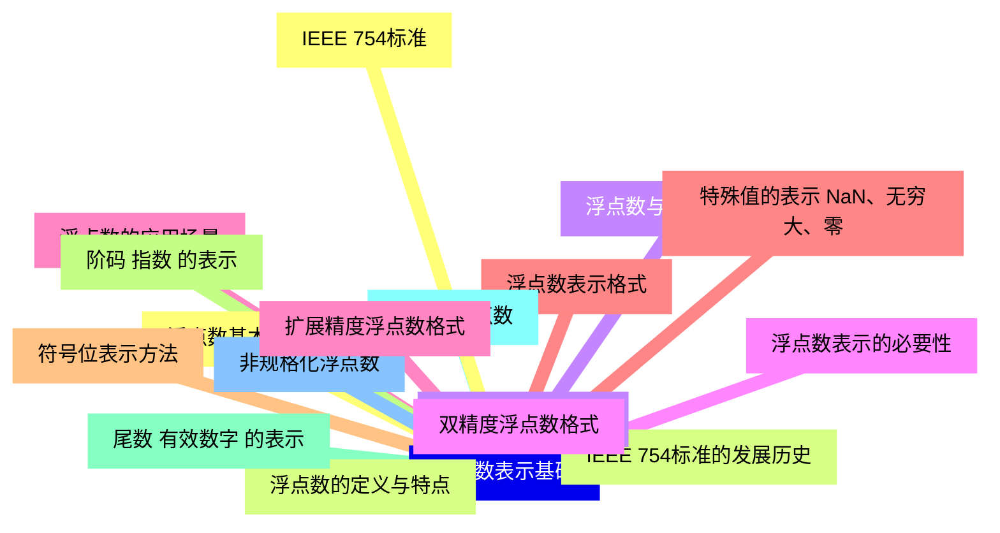
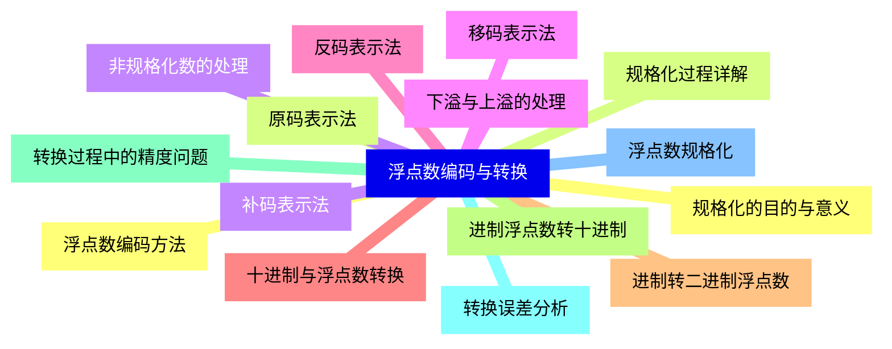
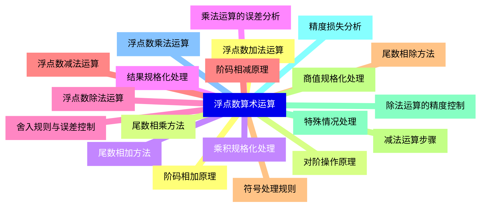
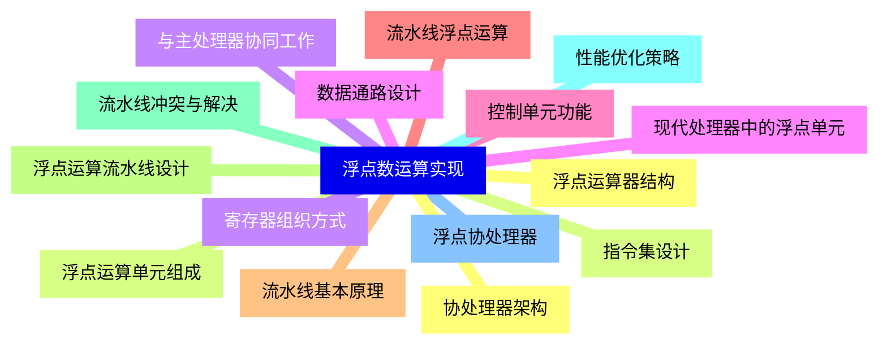
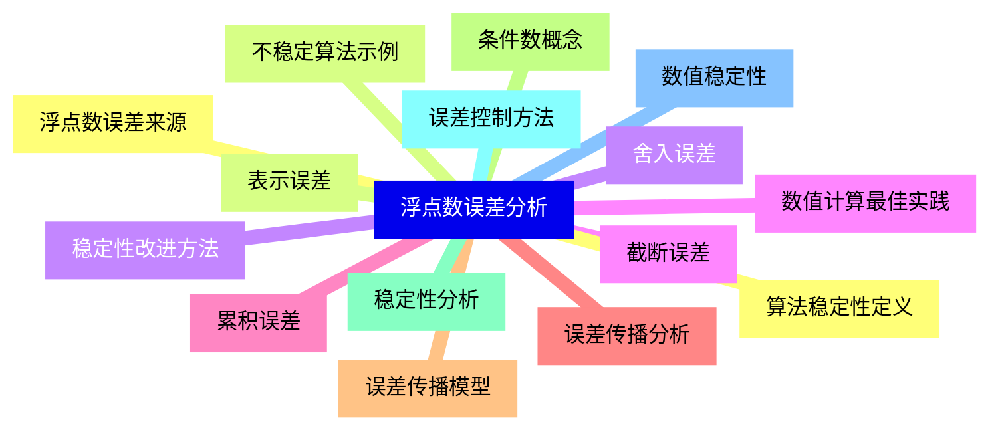
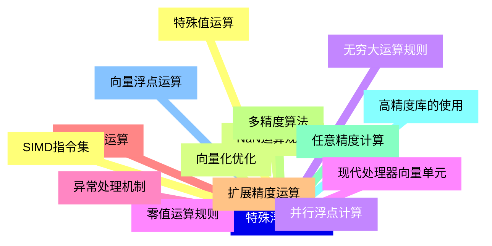
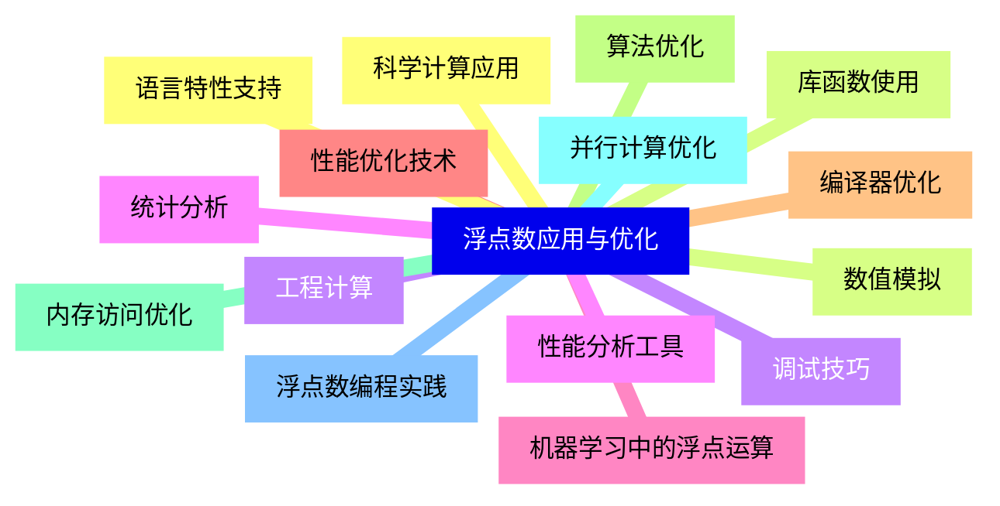
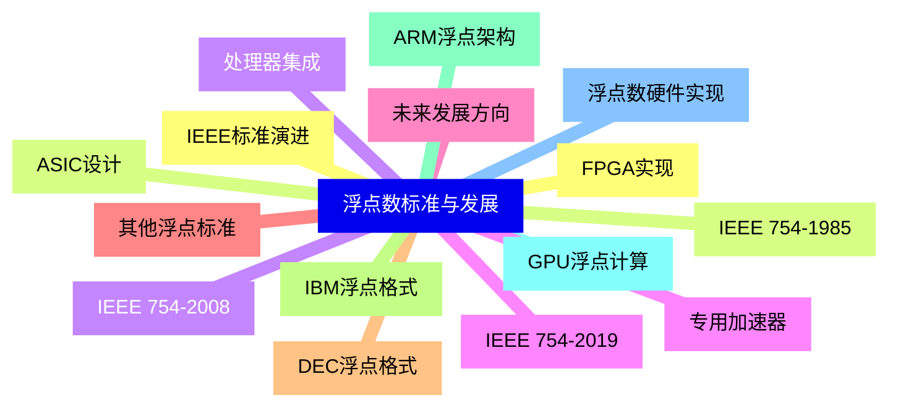


### 1 [浮点数表示基础](#1)
#### 1.1 [浮点数基本概念](#1)
#### 1.2 [浮点数的定义与特点](#1)
#### 1.3 [浮点数与定点数的比较](#1)
#### 1.4 [浮点数表示的必要性](#1)
#### 1.5 [浮点数的应用场景](#1)
#### 1.6 [浮点数表示格式](#1)
#### 1.7 [符号位表示方法](#1)
#### 1.8 [阶码 指数 的表示](#1)
#### 1.9 [尾数 有效数字 的表示](#1)
#### 1.10 [规格化浮点数](#1)
#### 1.11 [非规格化浮点数](#1)
#### 1.12 [IEEE 754标准](#1)
#### 1.13 [IEEE 754标准的发展历史](#1)
#### 1.14 [单精度浮点数格式](#1)
#### 1.15 [双精度浮点数格式](#1)
#### 1.16 [扩展精度浮点数格式](#1)
#### 1.17 [特殊值的表示 NaN、无穷大、零](#1)
### 2 [浮点数编码与转换](#2)
#### 2.1 [浮点数编码方法](#2)
#### 2.2 [原码表示法](#2)
#### 2.3 [补码表示法](#2)
#### 2.4 [移码表示法](#2)
#### 2.5 [反码表示法](#2)
#### 2.6 [十进制与浮点数转换](#2)
#### 2.7 [进制转二进制浮点数](#2)
#### 2.8 [进制浮点数转十进制](#2)
#### 2.9 [转换过程中的精度问题](#2)
#### 2.10 [转换误差分析](#2)
#### 2.11 [浮点数规格化](#2)
#### 2.12 [规格化的目的与意义](#2)
#### 2.13 [规格化过程详解](#2)
#### 2.14 [非规格化数的处理](#2)
#### 2.15 [下溢与上溢的处理](#2)
### 3 [浮点数算术运算](#3)
#### 3.1 [浮点数加法运算](#3)
#### 3.2 [对阶操作原理](#3)
#### 3.3 [尾数相加方法](#3)
#### 3.4 [结果规格化处理](#3)
#### 3.5 [舍入规则与误差控制](#3)
#### 3.6 [浮点数减法运算](#3)
#### 3.7 [符号处理规则](#3)
#### 3.8 [减法运算步骤](#3)
#### 3.9 [特殊情况处理](#3)
#### 3.10 [精度损失分析](#3)
#### 3.11 [浮点数乘法运算](#3)
#### 3.12 [阶码相加原理](#3)
#### 3.13 [尾数相乘方法](#3)
#### 3.14 [乘积规格化处理](#3)
#### 3.15 [乘法运算的误差分析](#3)
#### 3.16 [浮点数除法运算](#3)
#### 3.17 [阶码相减原理](#3)
#### 3.18 [尾数相除方法](#3)
#### 3.19 [商值规格化处理](#3)
#### 3.20 [除法运算的精度控制](#3)
### 4 [浮点数运算实现](#4)
#### 4.1 [浮点运算器结构](#4)
#### 4.2 [浮点运算单元组成](#4)
#### 4.3 [寄存器组织方式](#4)
#### 4.4 [数据通路设计](#4)
#### 4.5 [控制单元功能](#4)
#### 4.6 [流水线浮点运算](#4)
#### 4.7 [流水线基本原理](#4)
#### 4.8 [浮点运算流水线设计](#4)
#### 4.9 [流水线冲突与解决](#4)
#### 4.10 [性能优化策略](#4)
#### 4.11 [浮点协处理器](#4)
#### 4.12 [协处理器架构](#4)
#### 4.13 [指令集设计](#4)
#### 4.14 [与主处理器协同工作](#4)
#### 4.15 [现代处理器中的浮点单元](#4)
### 5 [浮点数误差分析](#5)
#### 5.1 [浮点数误差来源](#5)
#### 5.2 [表示误差](#5)
#### 5.3 [舍入误差](#5)
#### 5.4 [截断误差](#5)
#### 5.5 [累积误差](#5)
#### 5.6 [误差传播分析](#5)
#### 5.7 [误差传播模型](#5)
#### 5.8 [条件数概念](#5)
#### 5.9 [稳定性分析](#5)
#### 5.10 [误差控制方法](#5)
#### 5.11 [数值稳定性](#5)
#### 5.12 [算法稳定性定义](#5)
#### 5.13 [不稳定算法示例](#5)
#### 5.14 [稳定性改进方法](#5)
#### 5.15 [数值计算最佳实践](#5)
### 6 [特殊浮点运算](#6)
#### 6.1 [特殊值运算](#6)
#### 6.2 [NaN运算规则](#6)
#### 6.3 [无穷大运算规则](#6)
#### 6.4 [零值运算规则](#6)
#### 6.5 [异常处理机制](#6)
#### 6.6 [高精度运算](#6)
#### 6.7 [扩展精度运算](#6)
#### 6.8 [多精度算法](#6)
#### 6.9 [任意精度计算](#6)
#### 6.10 [高精度库的使用](#6)
#### 6.11 [向量浮点运算](#6)
#### 6.12 [SIMD指令集](#6)
#### 6.13 [向量化优化](#6)
#### 6.14 [并行浮点计算](#6)
#### 6.15 [现代处理器向量单元](#6)
### 7 [浮点数应用与优化](#7)
#### 7.1 [科学计算应用](#7)
#### 7.2 [数值模拟](#7)
#### 7.3 [工程计算](#7)
#### 7.4 [统计分析](#7)
#### 7.5 [机器学习中的浮点运算](#7)
#### 7.6 [性能优化技术](#7)
#### 7.7 [编译器优化](#7)
#### 7.8 [算法优化](#7)
#### 7.9 [内存访问优化](#7)
#### 7.10 [并行计算优化](#7)
#### 7.11 [浮点数编程实践](#7)
#### 7.12 [语言特性支持](#7)
#### 7.13 [库函数使用](#7)
#### 7.14 [调试技巧](#7)
#### 7.15 [性能分析工具](#7)
### 8 [浮点数标准与发展](#8)
#### 8.1 [IEEE标准演进](#8)
#### 8.2 [IEEE 754-1985](#8)
#### 8.3 [IEEE 754-2008](#8)
#### 8.4 [IEEE 754-2019](#8)
#### 8.5 [未来发展方向](#8)
#### 8.6 [其他浮点标准](#8)
#### 8.7 [DEC浮点格式](#8)
#### 8.8 [IBM浮点格式](#8)
#### 8.9 [ARM浮点架构](#8)
#### 8.10 [GPU浮点计算](#8)
#### 8.11 [浮点数硬件实现](#8)
#### 8.12 [FPGA实现](#8)
#### 8.13 [ASIC设计](#8)
#### 8.14 [处理器集成](#8)
#### 8.15 [专用加速器](#8)




### 1 浮点数表示基础

---
### 1 浮点数表示基础
___
#### 1.1 浮点数基本概念
___
#### 1.2 浮点数的定义与特点
___
#### 1.3 浮点数与定点数的比较
___
#### 1.4 浮点数表示的必要性
___
#### 1.5 浮点数的应用场景
___
#### 1.6 浮点数表示格式
___
#### 1.7 符号位表示方法
___
#### 1.8 阶码 指数 的表示
___
#### 1.9 尾数 有效数字 的表示
___
#### 1.10 规格化浮点数
___
#### 1.11 非规格化浮点数
___
#### 1.12 IEEE 754标准
___
#### 1.13 IEEE 754标准的发展历史
___
#### 1.14 单精度浮点数格式
___
#### 1.15 双精度浮点数格式
___
#### 1.16 扩展精度浮点数格式
___
#### 1.17 特殊值的表示 NaN、无穷大、零
### 2 浮点数编码与转换

---
### 2 浮点数编码与转换
___
#### 2.1 浮点数编码方法
___
#### 2.2 原码表示法
___
#### 2.3 补码表示法
___
#### 2.4 移码表示法
___
#### 2.5 反码表示法
___
#### 2.6 十进制与浮点数转换
___
#### 2.7 进制转二进制浮点数
___
#### 2.8 进制浮点数转十进制
___
#### 2.9 转换过程中的精度问题
___
#### 2.10 转换误差分析
___
#### 2.11 浮点数规格化
___
#### 2.12 规格化的目的与意义
___
#### 2.13 规格化过程详解
___
#### 2.14 非规格化数的处理
___
#### 2.15 下溢与上溢的处理
### 3 浮点数算术运算

---
### 3 浮点数算术运算
___
#### 3.1 浮点数加法运算
___
#### 3.2 对阶操作原理
___
#### 3.3 尾数相加方法
___
#### 3.4 结果规格化处理
___
#### 3.5 舍入规则与误差控制
___
#### 3.6 浮点数减法运算
___
#### 3.7 符号处理规则
___
#### 3.8 减法运算步骤
___
#### 3.9 特殊情况处理
___
#### 3.10 精度损失分析
___
#### 3.11 浮点数乘法运算
___
#### 3.12 阶码相加原理
___
#### 3.13 尾数相乘方法
___
#### 3.14 乘积规格化处理
___
#### 3.15 乘法运算的误差分析
___
#### 3.16 浮点数除法运算
___
#### 3.17 阶码相减原理
___
#### 3.18 尾数相除方法
___
#### 3.19 商值规格化处理
___
#### 3.20 除法运算的精度控制
### 4 浮点数运算实现

---
### 4 浮点数运算实现
___
#### 4.1 浮点运算器结构
___
#### 4.2 浮点运算单元组成
___
#### 4.3 寄存器组织方式
___
#### 4.4 数据通路设计
___
#### 4.5 控制单元功能
___
#### 4.6 流水线浮点运算
___
#### 4.7 流水线基本原理
___
#### 4.8 浮点运算流水线设计
___
#### 4.9 流水线冲突与解决
___
#### 4.10 性能优化策略
___
#### 4.11 浮点协处理器
___
#### 4.12 协处理器架构
___
#### 4.13 指令集设计
___
#### 4.14 与主处理器协同工作
___
#### 4.15 现代处理器中的浮点单元
### 5 浮点数误差分析

---
### 5 浮点数误差分析
___
#### 5.1 浮点数误差来源
___
#### 5.2 表示误差
___
#### 5.3 舍入误差
___
#### 5.4 截断误差
___
#### 5.5 累积误差
___
#### 5.6 误差传播分析
___
#### 5.7 误差传播模型
___
#### 5.8 条件数概念
___
#### 5.9 稳定性分析
___
#### 5.10 误差控制方法
___
#### 5.11 数值稳定性
___
#### 5.12 算法稳定性定义
___
#### 5.13 不稳定算法示例
___
#### 5.14 稳定性改进方法
___
#### 5.15 数值计算最佳实践
### 6 特殊浮点运算

---
### 6 特殊浮点运算
___
#### 6.1 特殊值运算
___
#### 6.2 NaN运算规则
___
#### 6.3 无穷大运算规则
___
#### 6.4 零值运算规则
___
#### 6.5 异常处理机制
___
#### 6.6 高精度运算
___
#### 6.7 扩展精度运算
___
#### 6.8 多精度算法
___
#### 6.9 任意精度计算
___
#### 6.10 高精度库的使用
___
#### 6.11 向量浮点运算
___
#### 6.12 SIMD指令集
___
#### 6.13 向量化优化
___
#### 6.14 并行浮点计算
___
#### 6.15 现代处理器向量单元
### 7 浮点数应用与优化

---
### 7 浮点数应用与优化
___
#### 7.1 科学计算应用
___
#### 7.2 数值模拟
___
#### 7.3 工程计算
___
#### 7.4 统计分析
___
#### 7.5 机器学习中的浮点运算
___
#### 7.6 性能优化技术
___
#### 7.7 编译器优化
___
#### 7.8 算法优化
___
#### 7.9 内存访问优化
___
#### 7.10 并行计算优化
___
#### 7.11 浮点数编程实践
___
#### 7.12 语言特性支持
___
#### 7.13 库函数使用
___
#### 7.14 调试技巧
___
#### 7.15 性能分析工具
### 8 浮点数标准与发展

---
### 8 浮点数标准与发展
___
#### 8.1 IEEE标准演进
___
#### 8.2 IEEE 754-1985
___
#### 8.3 IEEE 754-2008
___
#### 8.4 IEEE 754-2019
___
#### 8.5 未来发展方向
___
#### 8.6 其他浮点标准
___
#### 8.7 DEC浮点格式
___
#### 8.8 IBM浮点格式
___
#### 8.9 ARM浮点架构
___
#### 8.10 GPU浮点计算
___
#### 8.11 浮点数硬件实现
___
#### 8.12 FPGA实现
___
#### 8.13 ASIC设计
___
#### 8.14 处理器集成
___
#### 8.15 专用加速器


### 1 浮点数表示基础{#1}

{}

<--->
{}
{}
{}
{}
{}
{}
{}
{}
{}
{}
{}
{}
{}
{}
{}
{}
{}
{}
{}
{}
{}
{}
{}
{}
{}
{}
{}
{}
{}
{}
{}
{}
{}
{}
{}

### 2 浮点数编码与转换{#2}

{}
{}
{}
{}
{}
{}
{}
{}
{}
{}
{}
{}
{}
{}
{}
{}
{}
{}
{}
{}
{}
{}
{}
{}
{}
{}
{}
{}
{}
{}
{}
<--->

{}

### 3 浮点数算术运算{#3}

{}

<--->
{}
{}
{}
{}
{}
{}
{}
{}
{}
{}
{}
{}
{}
{}
{}
{}
{}
{}
{}
{}
{}
{}
{}
{}
{}
{}
{}
{}
{}
{}
{}
{}
{}
{}
{}
{}
{}
{}
{}
{}
{}

### 4 浮点数运算实现{#4}

{}
{}
{}
{}
{}
{}
{}
{}
{}
{}
{}
{}
{}
{}
{}
{}
{}
{}
{}
{}
{}
{}
{}
{}
{}
{}
{}
{}
{}
{}
{}
<--->

{}

### 5 浮点数误差分析{#5}

{}

<--->
{}
{}
{}
{}
{}
{}
{}
{}
{}
{}
{}
{}
{}
{}
{}
{}
{}
{}
{}
{}
{}
{}
{}
{}
{}
{}
{}
{}
{}
{}
{}

### 6 特殊浮点运算{#6}

{}
{}
{}
{}
{}
{}
{}
{}
{}
{}
{}
{}
{}
{}
{}
{}
{}
{}
{}
{}
{}
{}
{}
{}
{}
{}
{}
{}
{}
{}
{}
<--->

{}

### 7 浮点数应用与优化{#7}

{}

<--->
{}
{}
{}
{}
{}
{}
{}
{}
{}
{}
{}
{}
{}
{}
{}
{}
{}
{}
{}
{}
{}
{}
{}
{}
{}
{}
{}
{}
{}
{}
{}

### 8 浮点数标准与发展{#8}

{}
{}
{}
{}
{}
{}
{}
{}
{}
{}
{}
{}
{}
{}
{}
{}
{}
{}
{}
{}
{}
{}
{}
{}
{}
{}
{}
{}
{}
{}
{}
<--->

{}
