
### 1 [算术逻辑单元基础概念](#1)
#### 1.1 [ALU的定义与功能](#1)
#### 1.2 [算术逻辑单元的基本定义](#1)
#### 1.3 [ALU在计算机系统中的位置与作用](#1)
#### 1.4 [ALU的主要功能分类](#1)
#### 1.5 [ALU的发展历史](#1)
#### 1.6 [早期计算设备中的算术单元](#1)
#### 1.7 [集成电路ALU的出现与发展](#1)
#### 1.8 [现代ALU的技术特点](#1)
#### 1.9 [ALU的性能指标](#1)
#### 1.10 [运算速度与时钟频率](#1)
#### 1.11 [字长与并行处理能力](#1)
#### 1.12 [功耗与散热特性](#1)
### 2 [ALU的基本结构](#2)
#### 2.1 [ALU的组成模块](#2)
#### 2.2 [算术运算单元](#2)
#### 2.3 [逻辑运算单元](#2)
#### 2.4 [移位器与移位操作](#2)
#### 2.5 [标志位生成电路](#2)
#### 2.6 [数据通路设计](#2)
#### 2.7 [输入输出数据总线](#2)
#### 2.8 [内部数据流向控制](#2)
#### 2.9 [多路选择器的应用](#2)
#### 2.10 [控制信号设计](#2)
#### 2.11 [操作码解码电路](#2)
#### 2.12 [时序控制信号](#2)
#### 2.13 [功能选择机制](#2)
### 3 [算术运算实现](#3)
#### 3.1 [基本算术运算](#3)
#### 3.2 [加法器设计与实现](#3)
#### 3.3 [减法器设计与实现](#3)
#### 3.4 [乘法器原理与实现](#3)
#### 3.5 [除法器原理与实现](#3)
#### 3.6 [高级算术运算](#3)
#### 3.7 [浮点数运算单元](#3)
#### 3.8 [定点数运算处理](#3)
#### 3.9 [BCD码运算实现](#3)
#### 3.10 [运算优化技术](#3)
#### 3.11 [进位选择加法器](#3)
#### 3.12 [超前进位加法器](#3)
#### 3.13 [布斯乘法算法](#3)
#### 3.14 [华莱士树乘法器](#3)
### 4 [逻辑运算实现](#4)
#### 4.1 [基本逻辑运算](#4)
#### 4.2 [与、或、非门电路](#4)
#### 4.3 [异或、同或运算](#4)
#### 4.4 [逻辑运算的真值表](#4)
#### 4.5 [复合逻辑运算](#4)
#### 4.6 [与非、或非运算](#4)
#### 4.7 [多输入逻辑运算](#4)
#### 4.8 [逻辑函数的化简](#4)
#### 4.9 [逻辑运算应用](#4)
#### 4.10 [位操作指令实现](#4)
#### 4.11 [掩码操作处理](#4)
#### 4.12 [条件判断支持](#4)
### 5 [移位操作实现](#5)
#### 5.1 [基本移位操作](#5)
#### 5.2 [逻辑左移与右移](#5)
#### 5.3 [算术左移与右移](#5)
#### 5.4 [循环移位操作](#5)
#### 5.5 [移位器设计](#5)
#### 5.6 [桶形移位器原理](#5)
#### 5.7 [多位移位实现](#5)
#### 5.8 [移位器的性能优化](#5)
#### 5.9 [移位操作应用](#5)
#### 5.10 [乘法除法的加速](#5)
#### 5.11 [数据对齐处理](#5)
#### 5.12 [位字段操作支持](#5)
### 6 [ALU的标志位系统](#6)
#### 6.1 [状态标志位](#6)
#### 6.2 [零标志位 ZF](#6)
#### 6.3 [进位标志位 CF](#6)
#### 6.4 [溢出标志位 OF](#6)
#### 6.5 [符号标志位 SF](#6)
#### 6.6 [辅助标志位](#6)
#### 6.7 [奇偶标志位 PF](#6)
#### 6.8 [辅助进位标志 AF](#6)
#### 6.9 [其他特殊标志位](#6)
#### 6.10 [标志位的应用](#6)
#### 6.11 [条件跳转指令支持](#6)
#### 6.12 [溢出检测与处理](#6)
#### 6.13 [多精度运算支持](#6)
### 7 [ALU的接口与互连](#7)
#### 7.1 [与寄存器的接口](#7)
#### 7.2 [通用寄存器连接](#7)
#### 7.3 [累加器的特殊作用](#7)
#### 7.4 [寄存器文件设计](#7)
#### 7.5 [与存储器的接口](#7)
#### 7.6 [数据缓存连接](#7)
#### 7.7 [内存访问优化](#7)
#### 7.8 [总线传输协议](#7)
#### 7.9 [与控制单元的协同](#7)
#### 7.10 [指令执行流程](#7)
#### 7.11 [流水线技术应用](#7)
#### 7.12 [异常处理机制](#7)
### 8 [ALU的性能优化](#8)
#### 8.1 [并行处理技术](#8)
#### 8.2 [多位并行处理](#8)
#### 8.3 [流水线ALU设计](#8)
#### 8.4 [超标量ALU实现](#8)
#### 8.5 [高速运算技术](#8)
#### 8.6 [进位预测技术](#8)
#### 8.7 [前瞻执行机制](#8)
#### 8.8 [专用运算单元](#8)
#### 8.9 [低功耗设计](#8)
#### 8.10 [时钟门控技术](#8)
#### 8.11 [动态电压频率调节](#8)
#### 8.12 [功耗管理策略](#8)
### 9 [特殊功能ALU](#9)
#### 9.1 [向量ALU](#9)
#### 9.2 [SIMD架构支持](#9)
#### 9.3 [多媒体扩展指令](#9)
#### 9.4 [向量运算优化](#9)
#### 9.5 [浮点ALU](#9)
#### 9.6 [IEEE 754标准实现](#9)
#### 9.7 [浮点运算流水线](#9)
#### 9.8 [特殊值处理](#9)
#### 9.9 [专用ALU](#9)
#### 9.10 [DSP专用ALU](#9)
#### 9.11 [图形处理ALU](#9)
#### 9.12 [加密运算ALU](#9)
### 10 [ALU的测试与验证](#10)
#### 10.1 [功能测试方法](#10)
#### 10.2 [单元测试策略](#10)
#### 10.3 [边界值测试](#10)
#### 10.4 [随机测试方法](#10)
#### 10.5 [性能测试指标](#10)
#### 10.6 [吞吐量测试](#10)
#### 10.7 [延迟测试](#10)
#### 10.8 [功耗测试](#10)
#### 10.9 [故障诊断与修复](#10)
#### 10.10 [错误检测电路](#10)
#### 10.11 [容错设计技术](#10)
#### 10.12 [自修复机制](#10)
### 11 [ALU在现代处理器中的应用](#11)
#### 11.1 [多核处理器中的ALU](#11)
#### 11.2 [核心间ALU协同](#11)
#### 11.3 [负载均衡策略](#11)
#### 11.4 [缓存一致性维护](#11)
#### 11.5 [超标量处理器中的ALU](#11)
#### 11.6 [多发射机制](#11)
#### 11.7 [乱序执行支持](#11)
#### 11.8 [资源冲突解决](#11)
#### 11.9 [特殊架构中的ALU](#11)
#### 11.10 [RISC架构ALU特点](#11)
#### 11.11 [CISC架构ALU特点](#11)
#### 11.12 [VLIW架构ALU设计](#11)
### 12 [ALU的未来发展趋势](#12)
#### 12.1 [新技术影响](#12)
#### 12.2 [量子计算对ALU的影响](#12)
#### 12.3 [神经网络专用ALU](#12)
#### 12.4 [可重构ALU设计](#12)
#### 12.5 [性能提升方向](#12)
#### 12.6 [D集成技术](#12)
#### 12.7 [新型材料应用](#12)
#### 12.8 [光学计算融合](#12)
#### 12.9 [应用领域扩展](#12)
#### 12.10 [人工智能加速](#12)
#### 12.11 [物联网设备优化](#12)
#### 12.12 [边缘计算支持](#12)





### 1 算术逻辑单元基础概念


---
### 1 算术逻辑单元基础概念
___
#### 1.1 ALU的定义与功能
___
#### 1.2 算术逻辑单元的基本定义
___
#### 1.3 ALU在计算机系统中的位置与作用
___
#### 1.4 ALU的主要功能分类
___
#### 1.5 ALU的发展历史
___
#### 1.6 早期计算设备中的算术单元
___
#### 1.7 集成电路ALU的出现与发展
___
#### 1.8 现代ALU的技术特点
___
#### 1.9 ALU的性能指标
___
#### 1.10 运算速度与时钟频率
___
#### 1.11 字长与并行处理能力
___
#### 1.12 功耗与散热特性
### 2 ALU的基本结构


---
### 2 ALU的基本结构
___
#### 2.1 ALU的组成模块
___
#### 2.2 算术运算单元
___
#### 2.3 逻辑运算单元
___
#### 2.4 移位器与移位操作
___
#### 2.5 标志位生成电路
___
#### 2.6 数据通路设计
___
#### 2.7 输入输出数据总线
___
#### 2.8 内部数据流向控制
___
#### 2.9 多路选择器的应用
___
#### 2.10 控制信号设计
___
#### 2.11 操作码解码电路
___
#### 2.12 时序控制信号
___
#### 2.13 功能选择机制
### 3 算术运算实现


---
### 3 算术运算实现
___
#### 3.1 基本算术运算
___
#### 3.2 加法器设计与实现
___
#### 3.3 减法器设计与实现
___
#### 3.4 乘法器原理与实现
___
#### 3.5 除法器原理与实现
___
#### 3.6 高级算术运算
___
#### 3.7 浮点数运算单元
___
#### 3.8 定点数运算处理
___
#### 3.9 BCD码运算实现
___
#### 3.10 运算优化技术
___
#### 3.11 进位选择加法器
___
#### 3.12 超前进位加法器
___
#### 3.13 布斯乘法算法
___
#### 3.14 华莱士树乘法器
### 4 逻辑运算实现


---
### 4 逻辑运算实现
___
#### 4.1 基本逻辑运算
___
#### 4.2 与、或、非门电路
___
#### 4.3 异或、同或运算
___
#### 4.4 逻辑运算的真值表
___
#### 4.5 复合逻辑运算
___
#### 4.6 与非、或非运算
___
#### 4.7 多输入逻辑运算
___
#### 4.8 逻辑函数的化简
___
#### 4.9 逻辑运算应用
___
#### 4.10 位操作指令实现
___
#### 4.11 掩码操作处理
___
#### 4.12 条件判断支持
### 5 移位操作实现


---
### 5 移位操作实现
___
#### 5.1 基本移位操作
___
#### 5.2 逻辑左移与右移
___
#### 5.3 算术左移与右移
___
#### 5.4 循环移位操作
___
#### 5.5 移位器设计
___
#### 5.6 桶形移位器原理
___
#### 5.7 多位移位实现
___
#### 5.8 移位器的性能优化
___
#### 5.9 移位操作应用
___
#### 5.10 乘法除法的加速
___
#### 5.11 数据对齐处理
___
#### 5.12 位字段操作支持
### 6 ALU的标志位系统


---
### 6 ALU的标志位系统
___
#### 6.1 状态标志位
___
#### 6.2 零标志位 ZF
___
#### 6.3 进位标志位 CF
___
#### 6.4 溢出标志位 OF
___
#### 6.5 符号标志位 SF
___
#### 6.6 辅助标志位
___
#### 6.7 奇偶标志位 PF
___
#### 6.8 辅助进位标志 AF
___
#### 6.9 其他特殊标志位
___
#### 6.10 标志位的应用
___
#### 6.11 条件跳转指令支持
___
#### 6.12 溢出检测与处理
___
#### 6.13 多精度运算支持
### 7 ALU的接口与互连


---
### 7 ALU的接口与互连
___
#### 7.1 与寄存器的接口
___
#### 7.2 通用寄存器连接
___
#### 7.3 累加器的特殊作用
___
#### 7.4 寄存器文件设计
___
#### 7.5 与存储器的接口
___
#### 7.6 数据缓存连接
___
#### 7.7 内存访问优化
___
#### 7.8 总线传输协议
___
#### 7.9 与控制单元的协同
___
#### 7.10 指令执行流程
___
#### 7.11 流水线技术应用
___
#### 7.12 异常处理机制
### 8 ALU的性能优化


---
### 8 ALU的性能优化
___
#### 8.1 并行处理技术
___
#### 8.2 多位并行处理
___
#### 8.3 流水线ALU设计
___
#### 8.4 超标量ALU实现
___
#### 8.5 高速运算技术
___
#### 8.6 进位预测技术
___
#### 8.7 前瞻执行机制
___
#### 8.8 专用运算单元
___
#### 8.9 低功耗设计
___
#### 8.10 时钟门控技术
___
#### 8.11 动态电压频率调节
___
#### 8.12 功耗管理策略
### 9 特殊功能ALU


---
### 9 特殊功能ALU
___
#### 9.1 向量ALU
___
#### 9.2 SIMD架构支持
___
#### 9.3 多媒体扩展指令
___
#### 9.4 向量运算优化
___
#### 9.5 浮点ALU
___
#### 9.6 IEEE 754标准实现
___
#### 9.7 浮点运算流水线
___
#### 9.8 特殊值处理
___
#### 9.9 专用ALU
___
#### 9.10 DSP专用ALU
___
#### 9.11 图形处理ALU
___
#### 9.12 加密运算ALU
### 10 ALU的测试与验证


---
### 10 ALU的测试与验证
___
#### 10.1 功能测试方法
___
#### 10.2 单元测试策略
___
#### 10.3 边界值测试
___
#### 10.4 随机测试方法
___
#### 10.5 性能测试指标
___
#### 10.6 吞吐量测试
___
#### 10.7 延迟测试
___
#### 10.8 功耗测试
___
#### 10.9 故障诊断与修复
___
#### 10.10 错误检测电路
___
#### 10.11 容错设计技术
___
#### 10.12 自修复机制
### 11 ALU在现代处理器中的应用


---
### 11 ALU在现代处理器中的应用
___
#### 11.1 多核处理器中的ALU
___
#### 11.2 核心间ALU协同
___
#### 11.3 负载均衡策略
___
#### 11.4 缓存一致性维护
___
#### 11.5 超标量处理器中的ALU
___
#### 11.6 多发射机制
___
#### 11.7 乱序执行支持
___
#### 11.8 资源冲突解决
___
#### 11.9 特殊架构中的ALU
___
#### 11.10 RISC架构ALU特点
___
#### 11.11 CISC架构ALU特点
___
#### 11.12 VLIW架构ALU设计
### 12 ALU的未来发展趋势


---
### 12 ALU的未来发展趋势
___
#### 12.1 新技术影响
___
#### 12.2 量子计算对ALU的影响
___
#### 12.3 神经网络专用ALU
___
#### 12.4 可重构ALU设计
___
#### 12.5 性能提升方向
___
#### 12.6 D集成技术
___
#### 12.7 新型材料应用
___
#### 12.8 光学计算融合
___
#### 12.9 应用领域扩展
___
#### 12.10 人工智能加速
___
#### 12.11 物联网设备优化
___
#### 12.12 边缘计算支持



### 1 算术逻辑单元基础概念{#1}


{}
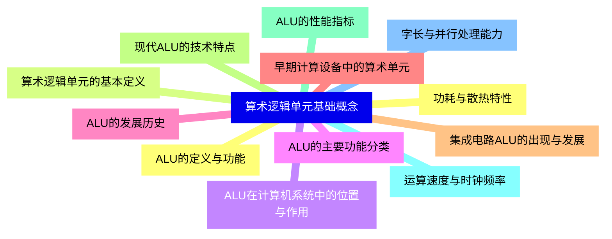

<--->
{}
{}
{}
{}
{}
{}
{}
{}
{}
{}
{}
{}
{}
{}
{}
{}
{}
{}
{}
{}
{}
{}
{}
{}
{}

### 2 ALU的基本结构{#2}


{}
{}
{}
{}
{}
{}
{}
{}
{}
{}
{}
{}
{}
{}
{}
{}
{}
{}
{}
{}
{}
{}
{}
{}
{}
{}
{}
<--->
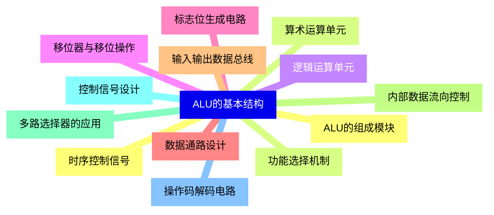

{}

### 3 算术运算实现{#3}


{}
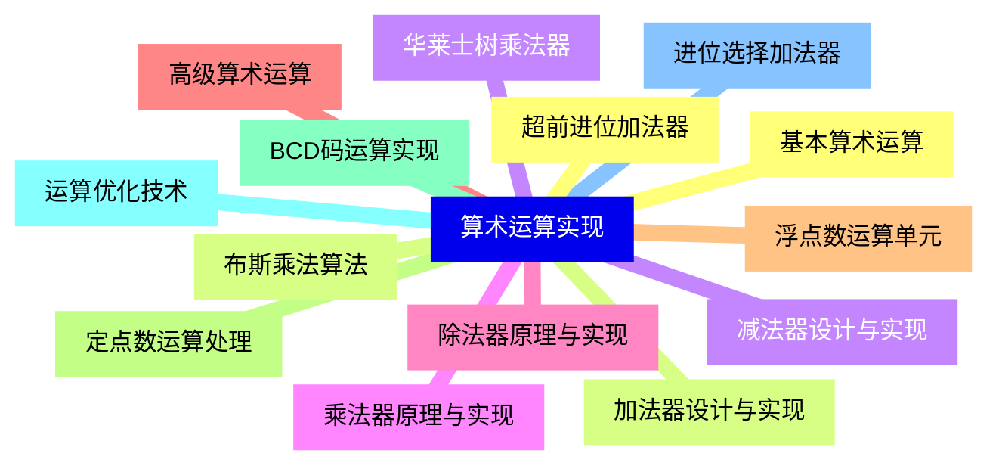

<--->
{}
{}
{}
{}
{}
{}
{}
{}
{}
{}
{}
{}
{}
{}
{}
{}
{}
{}
{}
{}
{}
{}
{}
{}
{}
{}
{}
{}
{}

### 4 逻辑运算实现{#4}


{}
{}
{}
{}
{}
{}
{}
{}
{}
{}
{}
{}
{}
{}
{}
{}
{}
{}
{}
{}
{}
{}
{}
{}
{}
<--->
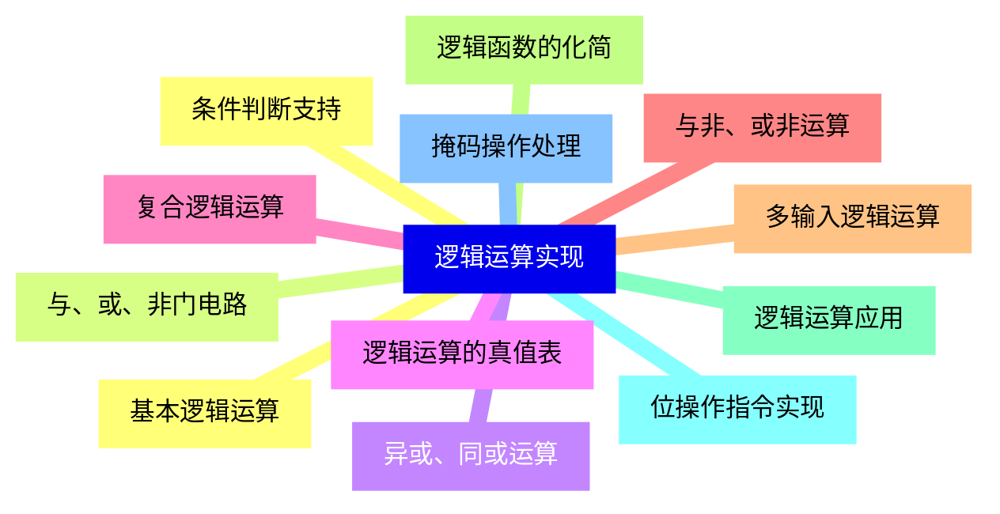

{}

### 5 移位操作实现{#5}


{}
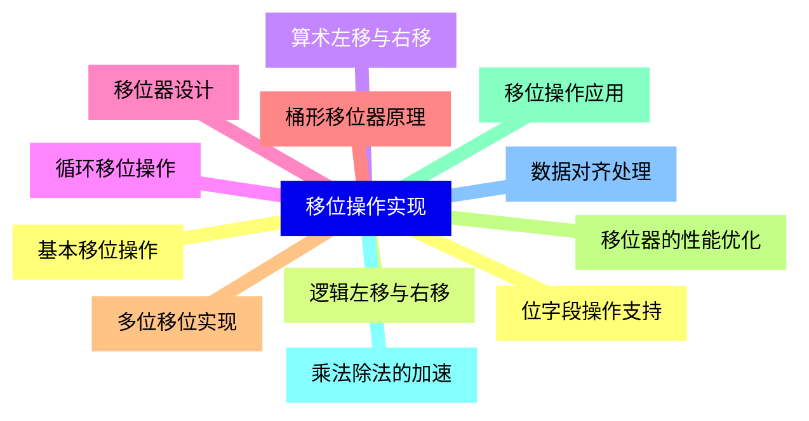

<--->
{}
{}
{}
{}
{}
{}
{}
{}
{}
{}
{}
{}
{}
{}
{}
{}
{}
{}
{}
{}
{}
{}
{}
{}
{}

### 6 ALU的标志位系统{#6}


{}
{}
{}
{}
{}
{}
{}
{}
{}
{}
{}
{}
{}
{}
{}
{}
{}
{}
{}
{}
{}
{}
{}
{}
{}
{}
{}
<--->
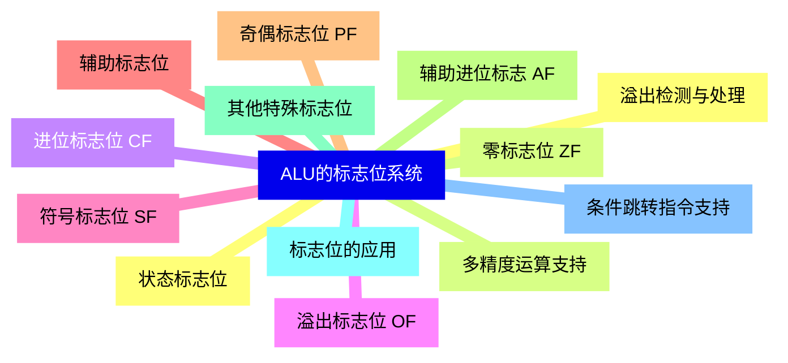

{}

### 7 ALU的接口与互连{#7}


{}
```mermaid
mindmap
    id7[ALU的接口与互连]
        id7-1[与寄存器的接口]
        id7-2[通用寄存器连接]
        id7-3[累加器的特殊作用]
        id7-4[寄存器文件设计]
        id7-5[与存储器的接口]
        id7-6[数据缓存连接]
        id7-7[内存访问优化]
        id7-8[总线传输协议]
        id7-9[与控制单元的协同]
        id7-10[指令执行流程]
        id7-11[流水线技术应用]
        id7-12[异常处理机制]
```

<--->
{}
{}
{}
{}
{}
{}
{}
{}
{}
{}
{}
{}
{}
{}
{}
{}
{}
{}
{}
{}
{}
{}
{}
{}
{}

### 8 ALU的性能优化{#8}


{}
{}
{}
{}
{}
{}
{}
{}
{}
{}
{}
{}
{}
{}
{}
{}
{}
{}
{}
{}
{}
{}
{}
{}
{}
<--->
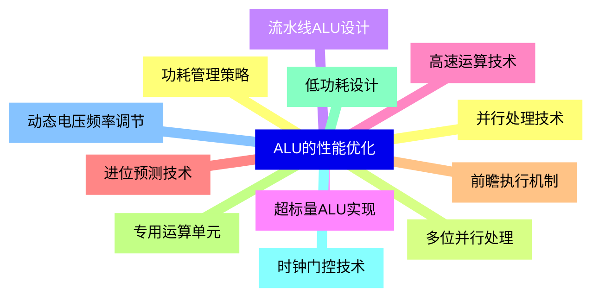

{}

### 9 特殊功能ALU{#9}


{}
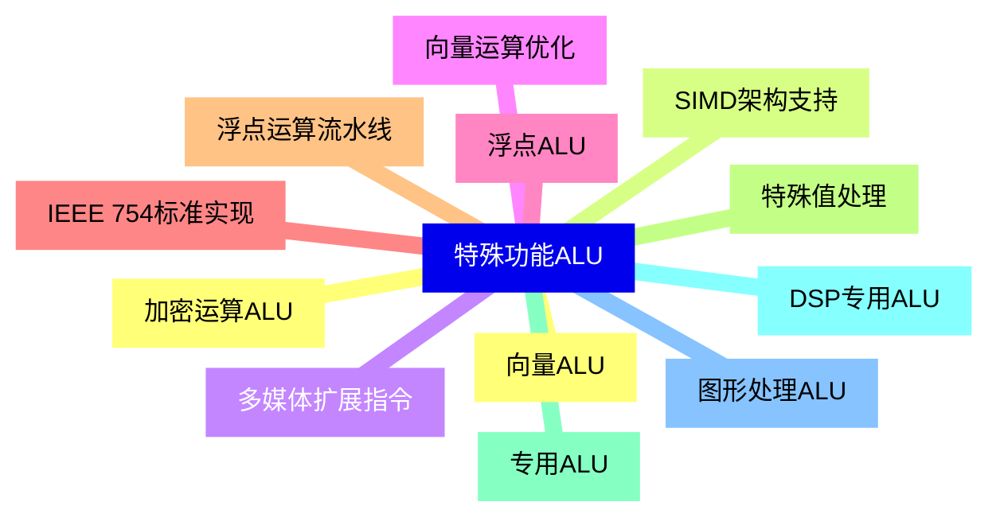

<--->
{}
{}
{}
{}
{}
{}
{}
{}
{}
{}
{}
{}
{}
{}
{}
{}
{}
{}
{}
{}
{}
{}
{}
{}
{}

### 10 ALU的测试与验证{#10}


{}
{}
{}
{}
{}
{}
{}
{}
{}
{}
{}
{}
{}
{}
{}
{}
{}
{}
{}
{}
{}
{}
{}
{}
{}
<--->
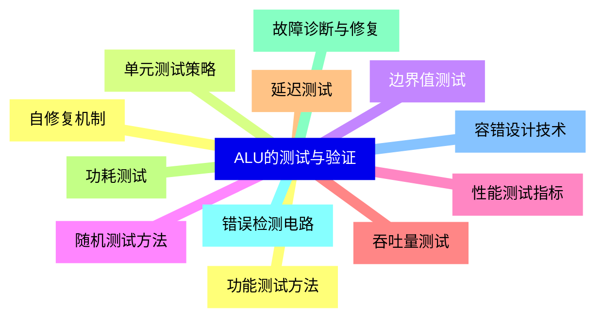

{}

### 11 ALU在现代处理器中的应用{#11}


{}
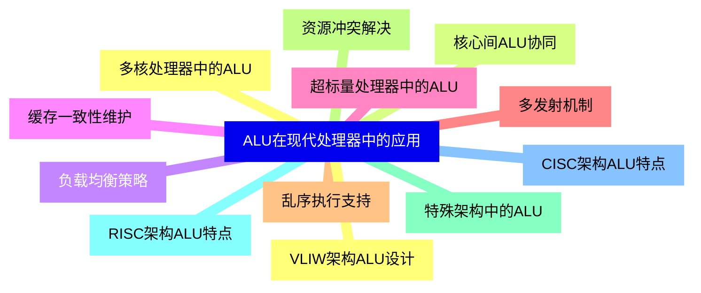

<--->
{}
{}
{}
{}
{}
{}
{}
{}
{}
{}
{}
{}
{}
{}
{}
{}
{}
{}
{}
{}
{}
{}
{}
{}
{}

### 12 ALU的未来发展趋势{#12}


{}
{}
{}
{}
{}
{}
{}
{}
{}
{}
{}
{}
{}
{}
{}
{}
{}
{}
{}
{}
{}
{}
{}
{}
{}
<--->
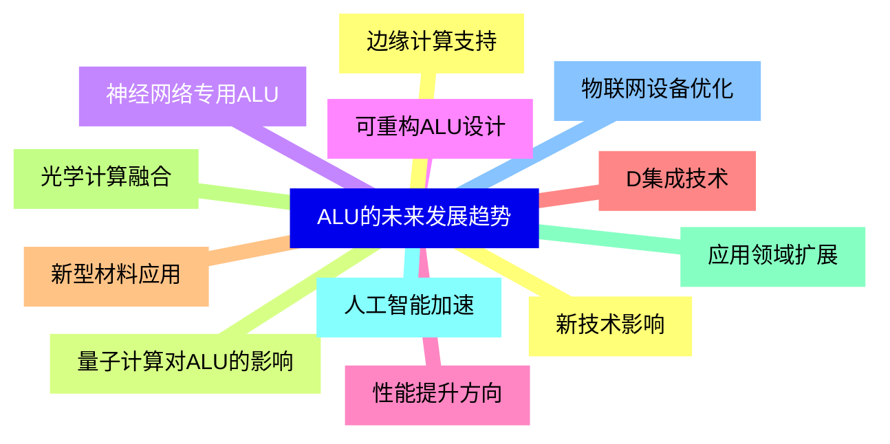

{}
