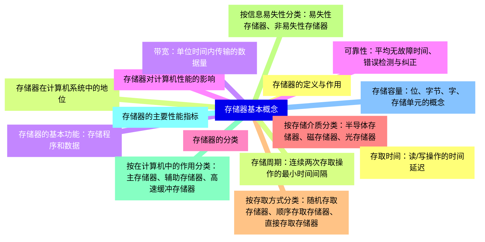
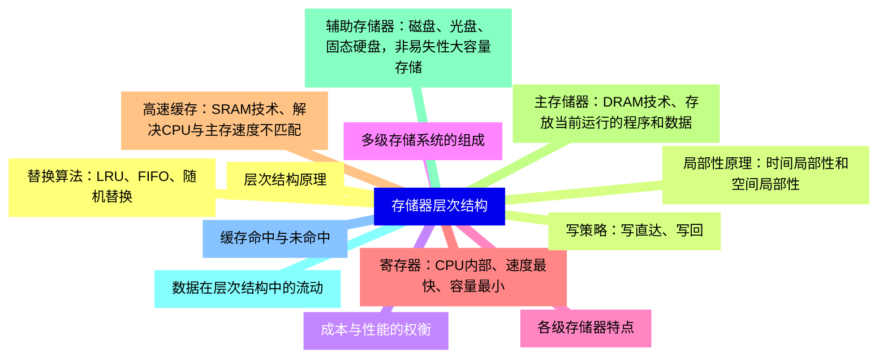
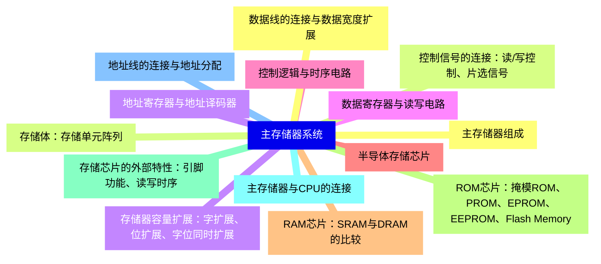
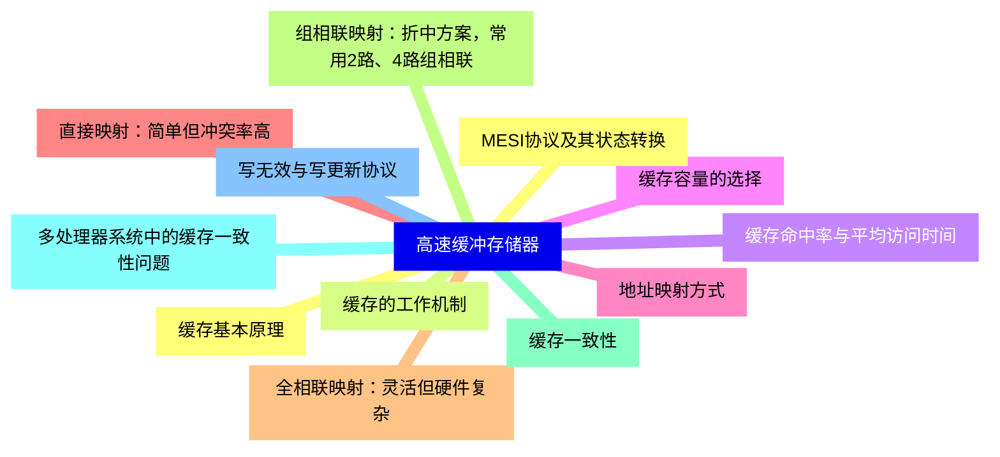
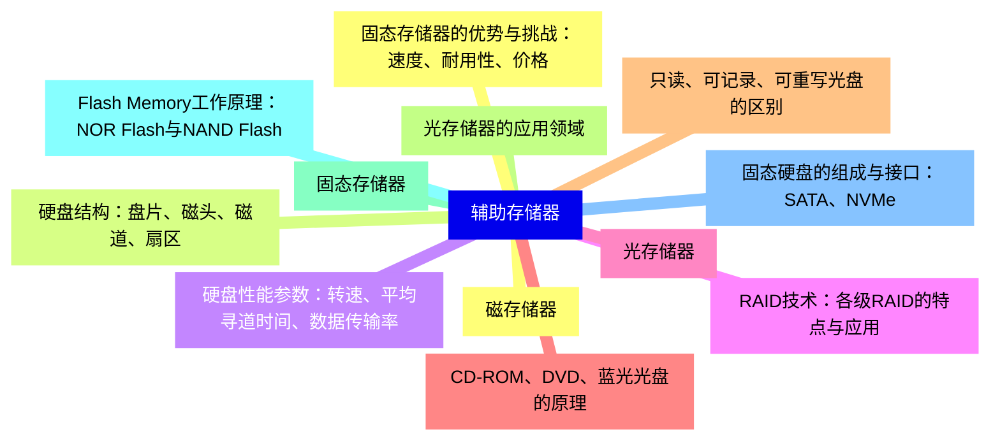
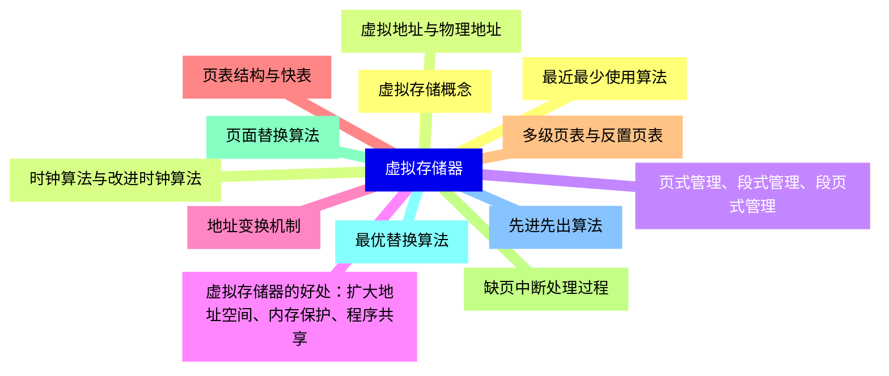
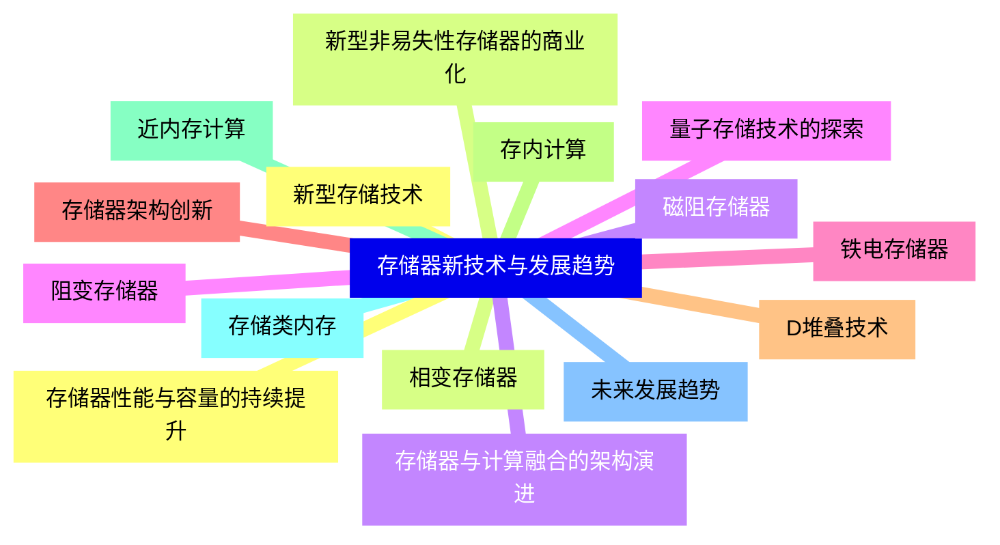


### 1 [存储器基本概念](#1)
#### 1.1 [存储器的定义与作用](#1)
#### 1.2 [存储器在计算机系统中的地位](#1)
#### 1.3 [存储器的基本功能：存储程序和数据](#1)
#### 1.4 [存储器对计算机性能的影响](#1)
#### 1.5 [存储器的分类](#1)
#### 1.6 [按存储介质分类：半导体存储器、磁存储器、光存储器](#1)
#### 1.7 [按存取方式分类：随机存取存储器、顺序存取存储器、直接存取存储器](#1)
#### 1.8 [按信息易失性分类：易失性存储器、非易失性存储器](#1)
#### 1.9 [按在计算机中的作用分类：主存储器、辅助存储器、高速缓冲存储器](#1)
#### 1.10 [存储器的主要性能指标](#1)
#### 1.11 [存储容量：位、字节、字、存储单元的概念](#1)
#### 1.12 [存取时间：读/写操作的时间延迟](#1)
#### 1.13 [存储周期：连续两次存取操作的最小时间间隔](#1)
#### 1.14 [带宽：单位时间内传输的数据量](#1)
#### 1.15 [可靠性：平均无故障时间、错误检测与纠正](#1)
### 2 [存储器层次结构](#2)
#### 2.1 [层次结构原理](#2)
#### 2.2 [局部性原理：时间局部性和空间局部性](#2)
#### 2.3 [成本与性能的权衡](#2)
#### 2.4 [多级存储系统的组成](#2)
#### 2.5 [各级存储器特点](#2)
#### 2.6 [寄存器：CPU内部、速度最快、容量最小](#2)
#### 2.7 [高速缓存：SRAM技术、解决CPU与主存速度不匹配](#2)
#### 2.8 [主存储器：DRAM技术、存放当前运行的程序和数据](#2)
#### 2.9 [辅助存储器：磁盘、光盘、固态硬盘，非易失性大容量存储](#2)
#### 2.10 [数据在层次结构中的流动](#2)
#### 2.11 [缓存命中与未命中](#2)
#### 2.12 [替换算法：LRU、FIFO、随机替换](#2)
#### 2.13 [写策略：写直达、写回](#2)
### 3 [主存储器系统](#3)
#### 3.1 [主存储器组成](#3)
#### 3.2 [存储体：存储单元阵列](#3)
#### 3.3 [地址寄存器与地址译码器](#3)
#### 3.4 [数据寄存器与读写电路](#3)
#### 3.5 [控制逻辑与时序电路](#3)
#### 3.6 [半导体存储芯片](#3)
#### 3.7 [RAM芯片：SRAM与DRAM的比较](#3)
#### 3.8 [ROM芯片：掩模ROM、PROM、EPROM、EEPROM、Flash Memory](#3)
#### 3.9 [存储芯片的外部特性：引脚功能、读写时序](#3)
#### 3.10 [主存储器与CPU的连接](#3)
#### 3.11 [地址线的连接与地址分配](#3)
#### 3.12 [数据线的连接与数据宽度扩展](#3)
#### 3.13 [控制信号的连接：读/写控制、片选信号](#3)
#### 3.14 [存储器容量扩展：字扩展、位扩展、字位同时扩展](#3)
### 4 [高速缓冲存储器](#4)
#### 4.1 [缓存基本原理](#4)
#### 4.2 [缓存的工作机制](#4)
#### 4.3 [缓存命中率与平均访问时间](#4)
#### 4.4 [缓存容量的选择](#4)
#### 4.5 [地址映射方式](#4)
#### 4.6 [直接映射：简单但冲突率高](#4)
#### 4.7 [全相联映射：灵活但硬件复杂](#4)
#### 4.8 [组相联映射：折中方案，常用2路、4路组相联](#4)
#### 4.9 [缓存一致性](#4)
#### 4.10 [多处理器系统中的缓存一致性问题](#4)
#### 4.11 [写无效与写更新协议](#4)
#### 4.12 [MESI协议及其状态转换](#4)
### 5 [辅助存储器](#5)
#### 5.1 [磁存储器](#5)
#### 5.2 [硬盘结构：盘片、磁头、磁道、扇区](#5)
#### 5.3 [硬盘性能参数：转速、平均寻道时间、数据传输率](#5)
#### 5.4 [RAID技术：各级RAID的特点与应用](#5)
#### 5.5 [光存储器](#5)
#### 5.6 [CD-ROM、DVD、蓝光光盘的原理](#5)
#### 5.7 [只读、可记录、可重写光盘的区别](#5)
#### 5.8 [光存储器的应用领域](#5)
#### 5.9 [固态存储器](#5)
#### 5.10 [Flash Memory工作原理：NOR Flash与NAND Flash](#5)
#### 5.11 [固态硬盘的组成与接口：SATA、NVMe](#5)
#### 5.12 [固态存储器的优势与挑战：速度、耐用性、价格](#5)
### 6 [虚拟存储器](#6)
#### 6.1 [虚拟存储概念](#6)
#### 6.2 [虚拟地址与物理地址](#6)
#### 6.3 [页式管理、段式管理、段页式管理](#6)
#### 6.4 [虚拟存储器的好处：扩大地址空间、内存保护、程序共享](#6)
#### 6.5 [地址变换机制](#6)
#### 6.6 [页表结构与快表](#6)
#### 6.7 [多级页表与反置页表](#6)
#### 6.8 [缺页中断处理过程](#6)
#### 6.9 [页面替换算法](#6)
#### 6.10 [最优替换算法](#6)
#### 6.11 [先进先出算法](#6)
#### 6.12 [最近最少使用算法](#6)
#### 6.13 [时钟算法与改进时钟算法](#6)
### 7 [存储器新技术与发展趋势](#7)
#### 7.1 [新型存储技术](#7)
#### 7.2 [相变存储器](#7)
#### 7.3 [磁阻存储器](#7)
#### 7.4 [阻变存储器](#7)
#### 7.5 [铁电存储器](#7)
#### 7.6 [存储器架构创新](#7)
#### 7.7 [D堆叠技术](#7)
#### 7.8 [存内计算](#7)
#### 7.9 [近内存计算](#7)
#### 7.10 [存储类内存](#7)
#### 7.11 [未来发展趋势](#7)
#### 7.12 [存储器性能与容量的持续提升](#7)
#### 7.13 [新型非易失性存储器的商业化](#7)
#### 7.14 [存储器与计算融合的架构演进](#7)
#### 7.15 [量子存储技术的探索](#7)




### 1 存储器基本概念

---
### 1 存储器基本概念
___
#### 1.1 存储器的定义与作用
___
#### 1.2 存储器在计算机系统中的地位
___
#### 1.3 存储器的基本功能：存储程序和数据
___
#### 1.4 存储器对计算机性能的影响
___
#### 1.5 存储器的分类
___
#### 1.6 按存储介质分类：半导体存储器、磁存储器、光存储器
___
#### 1.7 按存取方式分类：随机存取存储器、顺序存取存储器、直接存取存储器
___
#### 1.8 按信息易失性分类：易失性存储器、非易失性存储器
___
#### 1.9 按在计算机中的作用分类：主存储器、辅助存储器、高速缓冲存储器
___
#### 1.10 存储器的主要性能指标
___
#### 1.11 存储容量：位、字节、字、存储单元的概念
___
#### 1.12 存取时间：读/写操作的时间延迟
___
#### 1.13 存储周期：连续两次存取操作的最小时间间隔
___
#### 1.14 带宽：单位时间内传输的数据量
___
#### 1.15 可靠性：平均无故障时间、错误检测与纠正
### 2 存储器层次结构

---
### 2 存储器层次结构
___
#### 2.1 层次结构原理
___
#### 2.2 局部性原理：时间局部性和空间局部性
___
#### 2.3 成本与性能的权衡
___
#### 2.4 多级存储系统的组成
___
#### 2.5 各级存储器特点
___
#### 2.6 寄存器：CPU内部、速度最快、容量最小
___
#### 2.7 高速缓存：SRAM技术、解决CPU与主存速度不匹配
___
#### 2.8 主存储器：DRAM技术、存放当前运行的程序和数据
___
#### 2.9 辅助存储器：磁盘、光盘、固态硬盘，非易失性大容量存储
___
#### 2.10 数据在层次结构中的流动
___
#### 2.11 缓存命中与未命中
___
#### 2.12 替换算法：LRU、FIFO、随机替换
___
#### 2.13 写策略：写直达、写回
### 3 主存储器系统

---
### 3 主存储器系统
___
#### 3.1 主存储器组成
___
#### 3.2 存储体：存储单元阵列
___
#### 3.3 地址寄存器与地址译码器
___
#### 3.4 数据寄存器与读写电路
___
#### 3.5 控制逻辑与时序电路
___
#### 3.6 半导体存储芯片
___
#### 3.7 RAM芯片：SRAM与DRAM的比较
___
#### 3.8 ROM芯片：掩模ROM、PROM、EPROM、EEPROM、Flash Memory
___
#### 3.9 存储芯片的外部特性：引脚功能、读写时序
___
#### 3.10 主存储器与CPU的连接
___
#### 3.11 地址线的连接与地址分配
___
#### 3.12 数据线的连接与数据宽度扩展
___
#### 3.13 控制信号的连接：读/写控制、片选信号
___
#### 3.14 存储器容量扩展：字扩展、位扩展、字位同时扩展
### 4 高速缓冲存储器

---
### 4 高速缓冲存储器
___
#### 4.1 缓存基本原理
___
#### 4.2 缓存的工作机制
___
#### 4.3 缓存命中率与平均访问时间
___
#### 4.4 缓存容量的选择
___
#### 4.5 地址映射方式
___
#### 4.6 直接映射：简单但冲突率高
___
#### 4.7 全相联映射：灵活但硬件复杂
___
#### 4.8 组相联映射：折中方案，常用2路、4路组相联
___
#### 4.9 缓存一致性
___
#### 4.10 多处理器系统中的缓存一致性问题
___
#### 4.11 写无效与写更新协议
___
#### 4.12 MESI协议及其状态转换
### 5 辅助存储器

---
### 5 辅助存储器
___
#### 5.1 磁存储器
___
#### 5.2 硬盘结构：盘片、磁头、磁道、扇区
___
#### 5.3 硬盘性能参数：转速、平均寻道时间、数据传输率
___
#### 5.4 RAID技术：各级RAID的特点与应用
___
#### 5.5 光存储器
___
#### 5.6 CD-ROM、DVD、蓝光光盘的原理
___
#### 5.7 只读、可记录、可重写光盘的区别
___
#### 5.8 光存储器的应用领域
___
#### 5.9 固态存储器
___
#### 5.10 Flash Memory工作原理：NOR Flash与NAND Flash
___
#### 5.11 固态硬盘的组成与接口：SATA、NVMe
___
#### 5.12 固态存储器的优势与挑战：速度、耐用性、价格
### 6 虚拟存储器

---
### 6 虚拟存储器
___
#### 6.1 虚拟存储概念
___
#### 6.2 虚拟地址与物理地址
___
#### 6.3 页式管理、段式管理、段页式管理
___
#### 6.4 虚拟存储器的好处：扩大地址空间、内存保护、程序共享
___
#### 6.5 地址变换机制
___
#### 6.6 页表结构与快表
___
#### 6.7 多级页表与反置页表
___
#### 6.8 缺页中断处理过程
___
#### 6.9 页面替换算法
___
#### 6.10 最优替换算法
___
#### 6.11 先进先出算法
___
#### 6.12 最近最少使用算法
___
#### 6.13 时钟算法与改进时钟算法
### 7 存储器新技术与发展趋势

---
### 7 存储器新技术与发展趋势
___
#### 7.1 新型存储技术
___
#### 7.2 相变存储器
___
#### 7.3 磁阻存储器
___
#### 7.4 阻变存储器
___
#### 7.5 铁电存储器
___
#### 7.6 存储器架构创新
___
#### 7.7 D堆叠技术
___
#### 7.8 存内计算
___
#### 7.9 近内存计算
___
#### 7.10 存储类内存
___
#### 7.11 未来发展趋势
___
#### 7.12 存储器性能与容量的持续提升
___
#### 7.13 新型非易失性存储器的商业化
___
#### 7.14 存储器与计算融合的架构演进
___
#### 7.15 量子存储技术的探索


### 1 存储器基本概念{#1}

{}

<--->
{}
{}
{}
{}
{}
{}
{}
{}
{}
{}
{}
{}
{}
{}
{}
{}
{}
{}
{}
{}
{}
{}
{}
{}
{}
{}
{}
{}
{}
{}
{}

### 2 存储器层次结构{#2}

{}
{}
{}
{}
{}
{}
{}
{}
{}
{}
{}
{}
{}
{}
{}
{}
{}
{}
{}
{}
{}
{}
{}
{}
{}
{}
{}
<--->

{}

### 3 主存储器系统{#3}

{}

<--->
{}
{}
{}
{}
{}
{}
{}
{}
{}
{}
{}
{}
{}
{}
{}
{}
{}
{}
{}
{}
{}
{}
{}
{}
{}
{}
{}
{}
{}

### 4 高速缓冲存储器{#4}

{}
{}
{}
{}
{}
{}
{}
{}
{}
{}
{}
{}
{}
{}
{}
{}
{}
{}
{}
{}
{}
{}
{}
{}
{}
<--->

{}

### 5 辅助存储器{#5}

{}

<--->
{}
{}
{}
{}
{}
{}
{}
{}
{}
{}
{}
{}
{}
{}
{}
{}
{}
{}
{}
{}
{}
{}
{}
{}
{}

### 6 虚拟存储器{#6}

{}
{}
{}
{}
{}
{}
{}
{}
{}
{}
{}
{}
{}
{}
{}
{}
{}
{}
{}
{}
{}
{}
{}
{}
{}
{}
{}
<--->

{}

### 7 存储器新技术与发展趋势{#7}

{}

<--->
{}
{}
{}
{}
{}
{}
{}
{}
{}
{}
{}
{}
{}
{}
{}
{}
{}
{}
{}
{}
{}
{}
{}
{}
{}
{}
{}
{}
{}
{}
{}
